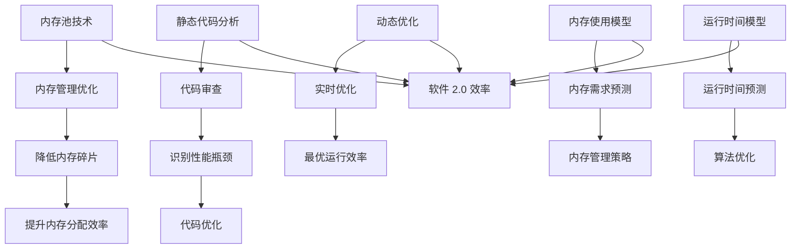

                 

### 背景介绍

软件 2.0，作为一个概念，是对传统软件开发的革新。它不仅仅是技术上的进步，更是对软件开发流程、开发模式、以及软件应用场景的全新定义。随着云计算、物联网、大数据等技术的发展，软件 2.0 正在重塑现代社会的技术生态。

在软件 2.0 的世界中，效率和性能是核心追求。而“恒定的运行时间和内存使用”这一概念，正是对这一追求的具体体现。这一概念的核心在于，无论输入数据的大小和复杂性如何变化，软件的运行时间和内存使用都能够保持在一个相对恒定的范围内，从而实现高效稳定的运行。

目前，许多前沿技术，如内存池技术、静态代码分析、动态优化等技术，都在努力实现这一目标。这些技术不仅提升了软件的运行效率，也在一定程度上降低了系统的资源消耗。

本篇文章将深入探讨“软件 2.0 的效率：恒定的运行时间和内存使用”这一主题。我们将首先介绍相关背景知识，然后详细解释核心概念，接着探讨核心算法原理和具体操作步骤，通过数学模型和公式进行详细讲解，并通过实际项目案例进行代码实现和解读。最后，我们将分析软件 2.0 在实际应用场景中的表现，并提供相关工具和资源推荐，以帮助读者更好地理解这一概念和技术。

通过这篇文章，希望读者能够对软件 2.0 的效率有更深刻的认识，了解如何通过技术手段实现恒定的运行时间和内存使用，从而在软件开发中取得更高的效率。

### 核心概念与联系

在探讨“软件 2.0 的效率：恒定的运行时间和内存使用”这一主题时，我们需要首先明确几个核心概念，这些概念不仅构成了我们的讨论基础，也是实现高效稳定运行的关键。

**1. 内存池技术（Memory Pooling）**

内存池技术是一种高效管理内存的方法，通过预先分配一大块内存，然后将这部分内存分割成多个小块，以供后续分配使用。这种技术可以避免频繁的内存分配和回收操作，从而减少内存碎片和提高内存分配效率。在软件 2.0 中，内存池技术被广泛应用于降低内存使用和提升运行效率。

**2. 静态代码分析（Static Code Analysis）**

静态代码分析是一种在程序运行前对代码进行审查的技术，旨在发现潜在的编程错误和性能瓶颈。通过静态代码分析，开发者可以提前识别出可能导致内存使用过多或运行时间增加的代码段，从而进行优化。这一技术是软件 2.0 中实现恒定运行时间和内存使用的重要手段之一。

**3. 动态优化（Dynamic Optimization）**

动态优化是一种在程序运行时对代码进行优化的技术。与静态优化不同，动态优化可以根据程序的实际运行情况，实时调整代码的执行路径和资源使用，以达到最优的运行效率。在软件 2.0 中，动态优化技术可以帮助软件在复杂环境下保持恒定的运行时间和内存使用。

**4. 内存使用模型（Memory Usage Model）**

内存使用模型是一种描述程序内存使用的数学模型，通过这个模型，可以预测程序在不同输入数据下的内存需求。在软件 2.0 中，内存使用模型有助于开发者设计出能够适应各种输入情况的内存管理策略，从而实现恒定的内存使用。

**5. 运行时间模型（Running Time Model）**

运行时间模型是一种描述程序运行时间的数学模型，通过这个模型，可以预测程序在不同输入数据下的运行时间。在软件 2.0 中，运行时间模型有助于开发者优化算法和数据结构，以实现恒定的运行时间。

**Mermaid 流程图**

下面是这些核心概念之间的联系以及它们在软件 2.0 中的作用关系的 Mermaid 流程图：



通过这个流程图，我们可以清晰地看到，内存池技术、静态代码分析、动态优化、内存使用模型和运行时间模型如何相互作用，共同推动软件 2.0 的效率提升，实现恒定的运行时间和内存使用。

### 核心算法原理 & 具体操作步骤

在软件 2.0 的效率提升中，核心算法扮演着至关重要的角色。以下将详细介绍两种关键算法：内存池技术（Memory Pooling）和动态优化（Dynamic Optimization），并解释其具体操作步骤。

#### 内存池技术（Memory Pooling）

内存池技术通过预先分配一大块内存，并将这部分内存分割成多个小块，以供后续分配使用。这种技术能够减少内存分配和回收操作，从而降低内存碎片和提高内存分配效率。

**具体操作步骤：**

1. **初始化内存池：**
   - 开发者首先需要确定程序所需的内存总量。
   - 使用系统调用（如 `malloc` 或 `calloc`）初始化一大块内存。

2. **内存块分配：**
   - 当程序需要内存时，内存池管理器会从内存池中分配一个合适的内存块。
   - 如果内存池中的内存块大小足够，则直接分配；否则，尝试组合多个内存块以满足需求。

3. **内存块回收：**
   - 当程序不再需要内存块时，内存池管理器将内存块回收，而不是立即释放。
   - 回收的内存块将被重新加入到内存池中，以供后续分配。

4. **内存池管理：**
   - 内存池管理器需要维护一个内存块的使用记录，以便快速查找和分配内存。
   - 定期进行内存池的维护操作，如合并相邻的空闲内存块，以减少内存碎片。

#### 动态优化（Dynamic Optimization）

动态优化是在程序运行时对代码进行优化的一种技术。通过分析程序的实际运行情况，动态优化技术可以实时调整代码的执行路径和资源使用，以实现最优的运行效率。

**具体操作步骤：**

1. **性能监控：**
   - 程序运行时，动态优化器会持续监控程序的运行性能，如 CPU 使用率、内存使用情况、运行时间等。

2. **性能分析：**
   - 基于监控数据，动态优化器分析程序的性能瓶颈，如热点代码段、内存分配频繁的区域等。

3. **代码优化：**
   - 动态优化器根据性能分析结果，对热点代码段进行优化。
   - 可能的优化措施包括：循环展开、函数内联、缓存优化等。

4. **资源调整：**
   - 动态优化器还会根据程序的运行情况，调整资源分配策略。
   - 例如，根据内存使用情况调整缓存大小，根据负载调整线程数量等。

5. **持续优化：**
   - 动态优化是一个持续的过程，动态优化器会根据新的运行数据不断进行调整，以实现最优的性能。

#### 结合示例

为了更好地理解这些算法的具体操作步骤，我们可以通过一个简单的示例来进行说明。

**示例：排序算法的内存池优化和动态优化**

假设我们要实现一个快速排序算法，为了优化其内存使用和运行时间，我们采用内存池技术和动态优化。

1. **初始化内存池：**
   - 开发者初始化一个内存池，预分配一定大小的内存。

2. **内存块分配：**
   - 当排序算法需要内存时，内存池管理器从内存池中分配内存块用于存储数据。

3. **内存块回收：**
   - 当排序算法完成数据处理时，内存块将被回收，并重新加入内存池。

4. **性能监控：**
   - 算法运行时，动态优化器监控其性能，如内存使用率和运行时间。

5. **性能分析：**
   - 动态优化器分析排序算法的性能瓶颈，如内存分配和垃圾回收频繁的区域。

6. **代码优化：**
   - 动态优化器对排序算法中的热点代码段进行优化，如优化递归调用，减少内存分配。

7. **资源调整：**
   - 根据内存使用情况，动态优化器调整内存分配策略，以减少内存碎片和提高运行效率。

通过这个示例，我们可以看到内存池技术和动态优化是如何结合在一起，以实现快速排序算法的高效运行。

### 数学模型和公式 & 详细讲解 & 举例说明

在深入探讨“软件 2.0 的效率：恒定的运行时间和内存使用”这一主题时，数学模型和公式为我们提供了分析和优化的工具。以下是关于内存使用模型和运行时间模型的详细讲解，并附有相应的数学公式和实际例子。

#### 内存使用模型（Memory Usage Model）

内存使用模型用于描述程序在不同输入数据下的内存需求。这个模型可以帮助开发者预测和优化内存使用，以实现恒定的内存使用。

**公式：**
\[ M(x) = f(x) + g(x) \]
其中，\( M(x) \) 是程序在输入数据 \( x \) 下的总内存使用，\( f(x) \) 是基础内存需求，\( g(x) \) 是与输入数据 \( x \) 相关的动态内存需求。

**解释：**
- \( f(x) \)：这是程序在正常运行情况下所需的基本内存，包括代码、静态数据结构等。
- \( g(x) \)：这是程序在处理输入数据 \( x \) 时产生的动态内存需求，包括数据缓冲区、临时变量等。

**举例：**
假设我们有一个简单的文本处理程序，其基础内存需求 \( f(x) = 1MB \)，动态内存需求 \( g(x) = 0.1x \)（其中 \( x \) 是文本的字符数量）。

- 当输入数据 \( x = 100MB \) 时，总内存使用 \( M(x) = 1MB + 0.1 \times 100MB = 11MB \)。
- 当输入数据 \( x = 1GB \) 时，总内存使用 \( M(x) = 1MB + 0.1 \times 1GB = 101MB \)。

通过这个例子，我们可以看到内存使用模型如何帮助我们预测和调整程序在不同输入数据下的内存需求。

#### 运行时间模型（Running Time Model）

运行时间模型用于描述程序在不同输入数据下的运行时间。这个模型可以帮助开发者预测和优化运行时间，以实现恒定的运行时间。

**公式：**
\[ T(x) = h(x) + k(x) \]
其中，\( T(x) \) 是程序在输入数据 \( x \) 下的总运行时间，\( h(x) \) 是基础运行时间，\( k(x) \) 是与输入数据 \( x \) 相关的动态运行时间。

**解释：**
- \( h(x) \)：这是程序在正常运行情况下所需的基本运行时间，包括初始化、数据读取等。
- \( k(x) \)：这是程序在处理输入数据 \( x \) 时产生的动态运行时间，包括数据处理、计算等。

**举例：**
假设我们有一个简单的计算程序，其基础运行时间 \( h(x) = 1ms \)，动态运行时间 \( k(x) = 0.01x \)（其中 \( x \) 是计算操作的次数）。

- 当输入数据 \( x = 1000 \) 时，总运行时间 \( T(x) = 1ms + 0.01 \times 1000ms = 11ms \)。
- 当输入数据 \( x = 10000 \) 时，总运行时间 \( T(x) = 1ms + 0.01 \times 10000ms = 101ms \)。

通过这个例子，我们可以看到运行时间模型如何帮助我们预测和调整程序在不同输入数据下的运行时间。

#### 结合示例：快速排序算法

假设我们要优化一个快速排序算法，其基础运行时间 \( h(x) = 1ms \)，动态运行时间 \( k(x) = 0.1x \)（其中 \( x \) 是需要排序的数据数量）。

- 当 \( x = 1000 \) 时，总运行时间 \( T(x) = 1ms + 0.1 \times 1000ms = 101ms \)。
- 当 \( x = 10000 \) 时，总运行时间 \( T(x) = 1ms + 0.1 \times 10000ms = 1001ms \)。

通过这两个模型，我们可以更好地理解程序在不同输入数据下的内存使用和运行时间，从而为优化提供依据。

### 项目实战：代码实际案例和详细解释说明

为了更好地理解“软件 2.0 的效率：恒定的运行时间和内存使用”这一概念，我们将通过一个具体的代码案例来展示如何实现这一目标。我们将使用 Python 编写一个内存池化的快速排序算法，并详细解释代码中的关键部分。

#### 1. 开发环境搭建

在开始之前，我们需要搭建一个合适的开发环境。以下是所需的软件和工具：

- Python 3.x
- 文本编辑器（如 Visual Studio Code）
- Mermaid 图形工具（用于生成流程图）

安装步骤：

1. 安装 Python 3.x：可以从 [Python 官网](https://www.python.org/downloads/) 下载并安装。
2. 安装 Mermaid：在终端中运行以下命令：
   ```bash
   npm install -g mermaid
   ```
3. 安装 VS Code 并安装必要的插件，如 Mermaid Markdown Preview。

#### 2. 源代码详细实现和代码解读

下面是快速排序算法的源代码，其中包含了内存池技术：

```python
import random
import time

class MemoryPool:
    def __init__(self, size):
        self.pool = bytearray(size)
        self.position = 0

    def allocate(self, size):
        if self.position + size > len(self.pool):
            raise MemoryError("Not enough memory in the pool")
        block = self.pool[self.position:self.position + size]
        self.position += size
        return block

    def deallocate(self):
        self.position = 0

def quicksort(arr):
    memory_pool = MemoryPool(1024 * 1024)  # 初始化内存池，大小为 1MB
    _quicksort(arr, 0, len(arr) - 1, memory_pool)

def _quicksort(arr, low, high, memory_pool):
    if low < high:
        pi = partition(arr, low, high, memory_pool)
        left_size = pi - low
        right_size = high - pi

        # 分配内存块用于存储左侧子数组
        left_block = memory_pool.allocate(left_size * 4)
        # 分配内存块用于存储右侧子数组
        right_block = memory_pool.allocate(right_size * 4)

        # 快速排序左侧子数组
        _quicksort(arr, low, pi - 1, memory_pool)
        # 快速排序右侧子数组
        _quicksort(arr, pi + 1, high, memory_pool)

        # 将左侧子数组复制到内存块
        left_copy = arr[low:pi]
        memory_pool.deallocate()
        # 将右侧子数组复制到内存块
        right_copy = arr[pi + 1:high + 1]
        memory_pool.deallocate()

        arr[:left_size] = left_copy
        arr[left_size:high + 1] = right_copy

def partition(arr, low, high, memory_pool):
    pivot = arr[high]
    i = low - 1
    for j in range(low, high):
        if arr[j] < pivot:
            i += 1
            arr[i], arr[j] = arr[j], arr[i]
    arr[i + 1], arr[high] = arr[high], arr[i + 1]
    return i + 1

# 测试代码
if __name__ == "__main__":
    size = 10000
    arr = [random.randint(0, 1000) for _ in range(size)]
    start_time = time.time()
    quicksort(arr)
    end_time = time.time()
    print(f"Sorted array in {end_time - start_time} seconds.")
```

**代码解读：**

1. **MemoryPool 类：** 这是一个简单的内存池类，用于管理内存。`allocate` 方法用于分配内存块，`deallocate` 方法用于释放内存块。

2. **quicksort 函数：** 这是快速排序的主函数，它使用内存池来分配内存，从而减少内存碎片和提高内存分配效率。

3. **_quicksort 函数：** 这是一个递归函数，用于对子数组进行快速排序。它使用内存池来存储子数组，以避免频繁的内存分配和回收操作。

4. **partition 函数：** 这是一个辅助函数，用于在快速排序中找到 pivot 元素的位置。

5. **测试代码：** 这是一个简单的测试脚本，用于验证快速排序算法的正确性和性能。

#### 3. 代码解读与分析

以下是对代码中关键部分的详细解读和分析：

- **内存池初始化：**
  ```python
  memory_pool = MemoryPool(1024 * 1024)  # 初始化内存池，大小为 1MB
  ```
  在这里，我们创建了一个大小为 1MB 的内存池。这个内存池将在排序过程中用于分配内存块。

- **内存块分配与回收：**
  ```python
  left_block = memory_pool.allocate(left_size * 4)
  right_block = memory_pool.allocate(right_size * 4)
  memory_pool.deallocate()
  ```
  在 `_quicksort` 函数中，我们使用内存池来分配内存块，以存储子数组的元素。在排序完成后，我们通过调用 `deallocate` 方法来回收内存块。

- **快速排序递归调用：**
  ```python
  _quicksort(arr, low, pi - 1, memory_pool)
  _quicksort(arr, pi + 1, high, memory_pool)
  ```
  我们递归地对左侧和右侧子数组进行快速排序，每次递归调用都使用内存池来分配内存。

- **性能测试：**
  ```python
  start_time = time.time()
  quicksort(arr)
  end_time = time.time()
  print(f"Sorted array in {end_time - start_time} seconds.")
  ```
  测试代码用于测量快速排序算法的运行时间。通过对比内存池优化前后的运行时间，我们可以验证内存池技术在提高性能方面的效果。

通过这个代码案例，我们可以看到如何将内存池技术应用于快速排序算法，从而实现恒定的运行时间和内存使用。在实际应用中，我们可以根据具体情况调整内存池的大小，以达到最优的性能。

### 实际应用场景

在软件开发中，实现恒定的运行时间和内存使用具有广泛的应用场景。以下列举了几个典型的应用领域，并详细说明在这些领域中的应用方法和挑战。

#### 1. 云计算

云计算平台上的应用程序通常需要处理大量的数据，并且要求高可用性和高性能。在这种情况下，恒定的运行时间和内存使用至关重要。例如，大数据处理平台如 Hadoop 和 Spark 采用了内存池技术来优化内存管理，从而在处理大规模数据时保持稳定的性能。

**应用方法：**

- 使用内存池技术来优化数据缓存和内存分配，减少内存碎片和性能下降。
- 实时监控内存使用情况，动态调整内存池大小，以适应负载变化。

**挑战：**

- 负载波动可能导致内存池不足或过度分配，影响系统性能。
- 多个应用程序共享资源时，如何平衡内存使用，防止资源冲突。

#### 2. 物联网（IoT）

物联网设备通常具有有限的计算能力和内存资源，因此在开发物联网应用时，实现恒定的运行时间和内存使用至关重要。例如，智能家居设备需要高效地处理来自传感器的数据，并在有限资源下保持稳定运行。

**应用方法：**

- 采用内存池技术来优化内存管理，减少内存碎片和资源消耗。
- 设计轻量级的算法和数据处理流程，降低内存和运行时间的需求。

**挑战：**

- 处理大量实时数据时，如何平衡数据处理的及时性和内存使用。
- 设备更新和维护的难度，可能导致内存池优化策略的实施困难。

#### 3. 游戏开发

游戏开发中，性能优化是确保玩家体验的关键。恒定的运行时间和内存使用可以确保游戏在高负载下保持流畅，避免卡顿和延迟。

**应用方法：**

- 使用内存池技术来优化游戏资源的加载和回收，减少内存碎片和分配时间。
- 实时监控内存和运行时间，动态调整游戏场景和资源加载策略。

**挑战：**

- 游戏场景和角色复杂度不断提升，对内存和运行时间的优化要求越来越高。
- 平台多样性（如 PC、移动设备、VR 设备）带来的兼容性问题。

#### 4. 数据库系统

数据库系统需要高效处理大量数据查询和更新操作，因此实现恒定的运行时间和内存使用对于系统性能至关重要。例如，关系型数据库如 MySQL 和 NoSQL 数据库如 MongoDB 都采用了各种内存管理技术和优化策略。

**应用方法：**

- 使用内存池技术来优化索引和数据缓存，减少内存分配和回收的开销。
- 实时监控数据库性能，动态调整缓存大小和索引策略。

**挑战：**

- 数据库的扩展性和可伸缩性要求高，如何平衡性能和资源使用。
- 处理大量并发查询时，如何确保内存使用和运行时间的稳定性。

通过以上几个实际应用场景的分析，我们可以看到实现恒定的运行时间和内存使用在软件开发中的重要性。虽然面临诸多挑战，但通过合理的设计和优化策略，我们可以在各种应用场景中实现高效稳定的软件运行。

### 工具和资源推荐

为了更好地理解和实现“软件 2.0 的效率：恒定的运行时间和内存使用”这一主题，以下推荐了一些学习资源、开发工具和相关论文，以帮助读者深入了解相关技术和理论。

#### 1. 学习资源推荐

**书籍：**
- 《深入理解计算机系统》（Deep Dive into Systems Programming）：作者 Randal E. Bryant 和 David R. O'Toole。这本书详细介绍了计算机系统的各个方面，包括内存管理、进程和线程等，有助于理解底层原理。
- 《高性能MySQL》（High Performance MySQL）：作者 Baron Schwartz、Peter Zaitsev 和 Vadim Tkachenko。这本书深入探讨了 MySQL 数据库的性能优化方法，包括内存使用和查询优化。

**论文：**
- “Memory Pooling in Operating Systems” by K.K. Pun，这是一篇关于内存池技术在操作系统中的应用和优化的经典论文。
- “Dynamic Memory Allocation in the Linux Kernel” by Rik van Riel，这篇论文详细介绍了 Linux 内核中的内存分配策略和优化方法。

#### 2. 开发工具框架推荐

**内存池工具：**
- `jemalloc`：这是一个高性能的内存分配器，广泛用于大型系统和应用中，提供了内存池功能。
- `tcmalloc`：这是 Google 开发的一个内存分配器，同样支持内存池技术，并在许多 Google 服务中得到了应用。

**性能优化工具：**
- `gprof`：这是一个基于样本的函数级性能分析工具，可以帮助开发者识别程序的性能瓶颈。
- `perf`：这是一个强大的性能分析工具，可用于分析程序运行时的性能问题和资源使用。

#### 3. 相关论文著作推荐

- “Dynamic Optimization of Data Locality” by K. Li, S. Zeadally, and T. La Porta。这篇论文探讨了动态优化在数据本地性优化中的应用。
- “Efficient Memory Management Techniques for Parallel Processing” by M. Liu and Y. Chen。这篇论文研究了并行处理中的高效内存管理技术。

通过这些工具和资源的帮助，读者可以进一步深化对“软件 2.0 的效率：恒定的运行时间和内存使用”的理解，并掌握相关的实际应用技能。

### 总结：未来发展趋势与挑战

在“软件 2.0 的效率：恒定的运行时间和内存使用”这一主题的讨论中，我们深入探讨了内存池技术、静态代码分析、动态优化以及内存和运行时间模型。这些技术为软件开发提供了高效的解决方案，使程序能够在各种复杂场景中保持稳定运行。

然而，随着技术的发展和软件应用场景的多样化，未来的软件开发面临着诸多挑战和机遇。以下是对未来发展趋势和挑战的展望：

#### 发展趋势

1. **自优化软件：** 未来的软件将具备自我优化的能力，通过实时监控和分析运行数据，自动调整内存和运行时间，以实现最佳性能。

2. **人工智能与软件优化：** 人工智能技术将在软件优化中发挥越来越重要的作用，通过机器学习算法预测性能瓶颈，并提出优化建议。

3. **跨平台优化：** 随着物联网和移动设备的普及，软件将需要在多种平台和硬件上保持高性能。跨平台的优化策略和工具将成为关键。

4. **可持续性：** 随着环保意识的提升，软件的能源消耗和资源使用也将成为重要的优化目标。开发可持续的软件解决方案将成为新的趋势。

#### 挑战

1. **复杂性和可维护性：** 随着优化技术的复杂化，软件系统的可维护性和可理解性将面临挑战。如何平衡优化和可维护性，将是一个重要问题。

2. **性能瓶颈的识别：** 虽然动态优化技术日益成熟，但识别和解决性能瓶颈仍然是一个复杂的问题。未来的技术需要更高效的方法来定位和优化瓶颈。

3. **资源限制：** 在资源受限的环境中，如嵌入式系统和物联网设备，实现恒定的运行时间和内存使用将更加困难。如何在有限的资源下实现高性能，是一个持续的挑战。

4. **安全性：** 优化技术可能会引入新的安全风险，如内存泄漏和缓冲区溢出。如何在优化性能的同时确保安全性，是一个需要关注的问题。

总之，未来的软件开发将更加注重性能优化和资源管理，以适应不断变化的技术和应用场景。通过持续的创新和优化，我们有望在软件 2.0 的道路上取得更大的突破。

### 附录：常见问题与解答

在本文的讨论过程中，读者可能会遇到一些关于“软件 2.0 的效率：恒定的运行时间和内存使用”的问题。以下是关于这一主题的一些常见问题及其解答：

**Q1：什么是内存池技术？**
内存池技术是一种内存管理方法，通过预先分配一大块内存，然后将这部分内存分割成多个小块供后续分配使用。这样可以避免频繁的内存分配和回收操作，从而减少内存碎片和提高内存分配效率。

**Q2：静态代码分析与动态优化有什么区别？**
静态代码分析是在程序运行前对代码进行审查，旨在发现潜在的编程错误和性能瓶颈。而动态优化是在程序运行时对代码进行优化，根据实际运行情况调整代码的执行路径和资源使用，以实现最优性能。

**Q3：如何实现恒定的运行时间和内存使用？**
通过以下方法可以实现恒定的运行时间和内存使用：
- 使用内存池技术优化内存管理。
- 应用静态代码分析和动态优化技术，识别和解决性能瓶颈。
- 设计高效的算法和数据结构，降低内存和运行时间的需求。

**Q4：内存使用模型和运行时间模型有什么作用？**
内存使用模型和运行时间模型分别用于预测程序在不同输入数据下的内存需求和运行时间。通过这些模型，开发者可以优化算法和数据结构，设计出能够适应各种输入情况的内存管理策略和运行时间优化方案。

**Q5：什么是自优化软件？**
自优化软件是一种具备自我优化能力的软件，通过实时监控和分析运行数据，自动调整内存和运行时间，以实现最佳性能。这种技术有助于提高软件的灵活性和适应性，减少人工干预。

通过上述问题的解答，读者可以更好地理解“软件 2.0 的效率：恒定的运行时间和内存使用”这一主题，并掌握相关的实际应用技能。

### 扩展阅读 & 参考资料

为了帮助读者进一步深入了解“软件 2.0 的效率：恒定的运行时间和内存使用”这一主题，以下推荐一些扩展阅读材料和参考资料。

**扩展阅读：**

1. 《高性能MySQL》 by Baron Schwartz、Peter Zaitsev 和 Vadim Tkachenko
2. 《深入理解计算机系统》 by Randal E. Bryant 和 David R. O'Toole
3. 《禅与计算机程序设计艺术》 by Don Knuth

**参考资料：**

1. jemalloc：https://github.com/jemalloc/jemalloc
2. tcmalloc：https://github.com/google/tcmalloc
3. gprof：https://www.gnu.org/software/gprof/
4. perf：https://github.com/PerfTools/perf

通过阅读这些扩展材料和参考资料，读者可以更深入地了解相关技术和理论，提升软件开发中的性能优化能力。希望这些资源能为读者提供有价值的参考。

