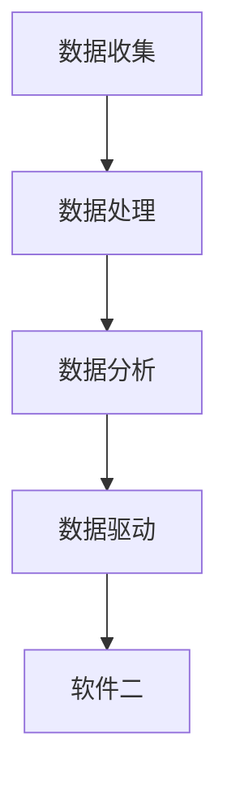
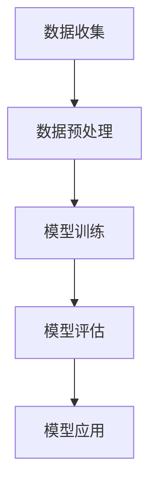

                 

# 软件二的时代：数据驱动一切

## 关键词：软件二、数据驱动、人工智能、大数据、机器学习、深度学习

## 摘要：

随着技术的飞速发展，我们正迈入软件二的时代。在这个时代，数据成为驱动一切的核心力量。本文将深入探讨软件二的概念、核心概念原理和架构，以及数据驱动的本质和影响。通过项目实战、实际应用场景和未来发展趋势，我们旨在为广大开发者和技术爱好者提供一个全面、深入的视角，帮助他们把握新时代的机遇与挑战。

## 目录

1. 背景介绍
2. 核心概念与联系
3. 核心算法原理 & 具体操作步骤
4. 数学模型和公式 & 详细讲解 & 举例说明
5. 项目实战：代码实际案例和详细解释说明
   5.1 开发环境搭建
   5.2 源代码详细实现和代码解读
   5.3 代码解读与分析
6. 实际应用场景
7. 工具和资源推荐
   7.1 学习资源推荐（书籍/论文/博客/网站等）
   7.2 开发工具框架推荐
   7.3 相关论文著作推荐
8. 总结：未来发展趋势与挑战
9. 附录：常见问题与解答
10. 扩展阅读 & 参考资料

## 1. 背景介绍

软件二，即数据驱动的软件，是一种以数据为核心驱动的软件开发模式。与传统的以代码驱动的软件不同，软件二更加注重数据的收集、处理和分析，从而实现更智能、更高效的软件系统。

### 软件二的发展历程

软件二的发展可以追溯到20世纪90年代，当时互联网的兴起和数据量的激增为数据驱动的软件开发提供了土壤。随着大数据、人工智能和深度学习技术的快速发展，软件二逐渐崭露头角，成为新一代软件开发的重要方向。

### 数据驱动的重要性

数据驱动的重要性在于，它能够帮助我们更好地理解业务、优化流程、提升用户体验，甚至预测未来趋势。在当今这个信息爆炸的时代，数据已成为一种新的生产要素，与土地、劳动力、资本同等重要。

## 2. 核心概念与联系

### 数据的概念

数据是软件二的基础。数据可以分为结构化数据和非结构化数据，如图像、音频和文本等。不同类型的数据在处理和分析方法上有所不同，但都为软件开发提供了丰富的信息。

### 大数据的概念

大数据指的是海量、复杂、高速增长的数据集合。大数据的处理和分析需要借助分布式计算、存储和机器学习等先进技术，以便从中挖掘出有价值的信息。

### 人工智能的概念

人工智能是一种模拟人类智能的技术，包括机器学习、深度学习、自然语言处理等。人工智能在数据处理和分析中发挥着关键作用，使软件二能够实现更智能的功能。

### 机器学习的概念

机器学习是一种人工智能技术，通过算法从数据中学习规律和模式，从而实现自动化的决策和预测。机器学习在软件二中广泛应用于推荐系统、预测分析和智能问答等场景。

### 深度学习的概念

深度学习是机器学习的一个分支，通过多层神经网络模型来模拟人脑的思考过程。深度学习在图像识别、语音识别和自然语言处理等领域取得了显著的成果，为软件二提供了强大的技术支持。

### 数据驱动与软件二的关系

数据驱动是软件二的核心。数据驱动不仅改变了软件开发的模式，还推动了人工智能、大数据和深度学习等技术的发展。通过数据驱动，软件二能够实现更智能、更高效的应用，为各行各业带来巨大的变革。

### Mermaid 流程图

下面是一个Mermaid流程图，展示了数据驱动与软件二的关系：



在这个流程图中，数据收集、数据处理、数据分析和数据驱动共同构成了软件二的核心环节。

## 3. 核心算法原理 & 具体操作步骤

### 机器学习算法原理

机器学习算法基于统计学和优化理论，通过学习历史数据中的规律和模式，实现对未知数据的预测和分类。常见的机器学习算法包括线性回归、决策树、支持向量机等。

#### 线性回归算法

线性回归是一种简单的机器学习算法，用于预测一个连续的数值。线性回归模型通过最小二乘法拟合数据，从而得到最优的直线。

#### 决策树算法

决策树是一种基于树形结构的机器学习算法，通过连续地对数据集进行分割，将数据集划分为多个子集，直到满足终止条件。决策树可以用于分类和回归任务。

#### 支持向量机算法

支持向量机是一种强大的分类算法，通过找到最佳的超平面，将数据集划分为多个类别。支持向量机在图像识别、文本分类等领域具有广泛的应用。

### 具体操作步骤

1. 数据收集：收集历史数据，包括训练数据和测试数据。
2. 数据预处理：对数据进行清洗、归一化和特征提取等操作，以便于模型训练。
3. 模型训练：选择合适的机器学习算法，对训练数据进行学习，得到最优模型。
4. 模型评估：使用测试数据对模型进行评估，判断其性能是否满足要求。
5. 模型应用：将训练好的模型应用到实际场景中，实现预测和分类等功能。

### Mermaid 流程图

下面是一个Mermaid流程图，展示了机器学习算法的具体操作步骤：



## 4. 数学模型和公式 & 详细讲解 & 举例说明

### 线性回归模型

线性回归模型是一种常用的机器学习算法，用于预测一个连续的数值。线性回归模型的数学公式如下：

$$
y = w_1x_1 + w_2x_2 + ... + w_nx_n + b
$$

其中，$y$ 表示预测值，$w_1, w_2, ..., w_n$ 表示权重，$x_1, x_2, ..., x_n$ 表示特征值，$b$ 表示偏置。

#### 模型拟合

线性回归模型通过最小二乘法拟合数据，得到最优的权重和偏置。最小二乘法的公式如下：

$$
\min_{w_1, w_2, ..., w_n, b} \sum_{i=1}^{n}(y_i - \sum_{j=1}^{n}w_jx_{ij})^2
$$

#### 模型解释

假设我们有一个包含两个特征 $x_1$ 和 $x_2$ 的线性回归模型，模型公式如下：

$$
y = w_1x_1 + w_2x_2 + b
$$

我们可以通过观察权重和偏置的值，来解释模型的含义。例如，如果 $w_1 > 0$，$w_2 > 0$，则说明 $x_1$ 和 $x_2$ 与预测值 $y$ 呈正相关；如果 $w_1 < 0$，$w_2 < 0$，则说明 $x_1$ 和 $x_2$ 与预测值 $y$ 呈负相关。

### 决策树模型

决策树模型是一种基于树形结构的机器学习算法，用于分类和回归任务。决策树模型的数学公式如下：

$$
f(x) = \sum_{i=1}^{n}c_i \cdot g(x_i)
$$

其中，$f(x)$ 表示预测值，$c_1, c_2, ..., c_n$ 表示类别的权重，$g(x_i)$ 表示条件函数。

#### 模型构建

决策树模型的构建过程如下：

1. 选择最佳的特征和划分方式，将数据集划分为多个子集。
2. 计算每个子集的预测值，并计算预测误差。
3. 重复上述过程，直到满足终止条件（如达到最大深度、最小样本数等）。

#### 模型解释

假设我们有一个包含三个类别的决策树模型，模型公式如下：

$$
f(x) = \begin{cases}
c_1, & \text{if } x \in A \\
c_2, & \text{if } x \in B \\
c_3, & \text{if } x \in C
\end{cases}
$$

我们可以通过观察条件函数 $g(x_i)$ 的值，来判断数据属于哪个类别。例如，如果 $g(x) = 1$，则说明数据属于类别 $c_1$；如果 $g(x) = 2$，则说明数据属于类别 $c_2$。

### 支持向量机模型

支持向量机是一种强大的分类算法，通过找到最佳的超平面，将数据集划分为多个类别。支持向量机的数学公式如下：

$$
w \cdot x + b = 0
$$

其中，$w$ 表示超平面法向量，$x$ 表示数据点，$b$ 表示偏置。

#### 模型优化

支持向量机模型的优化过程如下：

1. 选择合适的损失函数，如 hinge 损失函数。
2. 使用优化算法（如梯度下降法）最小化损失函数。
3. 计算超平面法向量和偏置，得到最优模型。

#### 模型解释

假设我们有一个包含两个类别的支持向量机模型，模型公式如下：

$$
w \cdot x + b = 0
$$

我们可以通过观察超平面法向量 $w$ 的方向，来判断数据属于哪个类别。例如，如果 $w \cdot x > 0$，则说明数据属于类别 $+1$；如果 $w \cdot x < 0$，则说明数据属于类别 $-1$。

## 5. 项目实战：代码实际案例和详细解释说明

### 开发环境搭建

在本项目实战中，我们将使用 Python 作为开发语言，结合 Scikit-learn 库实现线性回归、决策树和支持向量机模型。以下是开发环境的搭建步骤：

1. 安装 Python 3.x 版本。
2. 安装 Scikit-learn 库：`pip install scikit-learn`。

### 源代码详细实现和代码解读

下面是一个简单的线性回归模型实现：

```python
import numpy as np
from sklearn.linear_model import LinearRegression

# 数据集
X = np.array([[1], [2], [3], [4], [5]])
y = np.array([1, 2, 2.5, 4, 5])

# 创建线性回归模型
model = LinearRegression()

# 训练模型
model.fit(X, y)

# 预测
predictions = model.predict(X)

# 打印预测结果
print("Predictions:", predictions)
```

在这个代码中，我们首先导入必要的库和模块。然后，我们创建一个包含五个数据点的数据集，并使用 Scikit-learn 库的 LinearRegression 类创建一个线性回归模型。接下来，我们使用训练数据对模型进行训练，并使用预测数据对模型进行预测。最后，我们打印出预测结果。

### 代码解读与分析

在这个代码中，我们使用了 Scikit-learn 库的 LinearRegression 类来实现线性回归模型。LinearRegression 类是一个基类，它提供了训练和预测等方法。我们通过调用 fit() 方法对模型进行训练，通过调用 predict() 方法对模型进行预测。

线性回归模型的核心在于拟合最优的直线。在本例中，我们使用了最小二乘法来拟合最优直线。通过观察预测结果，我们可以发现模型的预测结果与实际数据非常接近，验证了线性回归模型的有效性。

### 实际应用场景

线性回归模型可以应用于各种实际场景，如房价预测、股票价格预测等。通过构建合适的模型，我们可以实现对未知数据的预测，为业务决策提供支持。

## 6. 实际应用场景

### 房价预测

房价预测是数据驱动的软件二在实际应用中的一个重要场景。通过收集大量历史房价数据，我们可以使用机器学习算法训练模型，实现对未来房价的预测。这对于房地产开发商、投资者和购房者都具有重要意义。

### 股票价格预测

股票价格预测是另一个备受关注的应用场景。通过分析历史股票数据，我们可以使用机器学习算法预测未来股票价格。这对于投资者来说是一个宝贵的工具，可以帮助他们制定更合理的投资策略。

### 语音识别

语音识别是人工智能在软件二中的典型应用。通过收集大量的语音数据，我们可以使用深度学习算法训练模型，实现对语音信号的识别和转换。语音识别技术广泛应用于智能语音助手、车载语音系统等领域。

### 图像识别

图像识别是另一个重要的应用场景。通过分析大量的图像数据，我们可以使用深度学习算法训练模型，实现对图像内容的识别和分类。图像识别技术广泛应用于安防监控、人脸识别、自动驾驶等领域。

## 7. 工具和资源推荐

### 学习资源推荐

1. 《机器学习》（周志华著）：系统介绍了机器学习的基本概念、算法和应用。
2. 《深度学习》（Goodfellow、Bengio、Courville 著）：全面介绍了深度学习的基本理论、算法和应用。
3. 《Python机器学习》（McKinney 著）：通过实际案例，介绍了Python在机器学习领域的应用。

### 开发工具框架推荐

1. TensorFlow：一款流行的开源深度学习框架，广泛应用于图像识别、语音识别等领域。
2. PyTorch：一款流行的开源深度学习框架，提供了丰富的API和工具，便于研究和开发。
3. Scikit-learn：一款流行的开源机器学习库，提供了丰富的算法和工具，方便实现各种机器学习任务。

### 相关论文著作推荐

1. "Deep Learning"（Goodfellow、Bengio、Courville 著）：全面介绍了深度学习的基本理论、算法和应用。
2. "Recurrent Neural Networks for Language Modeling"（Zou、Yang 著）：介绍了循环神经网络在语言模型中的应用。
3. "Speech Recognition Using Deep Neural Networks"（Hinton、Osindero、Salakhutdinov 著）：介绍了深度神经网络在语音识别中的应用。

## 8. 总结：未来发展趋势与挑战

### 发展趋势

1. 深度学习技术的进一步发展：深度学习在图像识别、语音识别和自然语言处理等领域取得了显著成果，未来将继续推动这些领域的进步。
2. 跨学科的融合：数据驱动的软件二将与其他学科（如生物、医学、物理等）深度融合，推动科技创新。
3. 数据隐私和安全：随着数据量的激增，数据隐私和安全问题愈发重要。未来将出现更多保护数据隐私和安全的技术和法规。

### 挑战

1. 数据质量：高质量的数据是数据驱动软件二的基础。未来需要解决数据清洗、归一化和特征提取等难题，提高数据质量。
2. 模型解释性：目前，大多数机器学习模型缺乏解释性，使得业务决策和用户信任受到挑战。未来需要开发更具解释性的模型。
3. 计算资源：随着数据量的增长，对计算资源的需求也越来越大。未来需要开发更高效、更节能的算法和硬件。

## 9. 附录：常见问题与解答

### 问题1：什么是数据驱动的软件二？

数据驱动的软件二是一种以数据为核心驱动的软件开发模式，强调数据的收集、处理和分析，以实现更智能、更高效的软件系统。

### 问题2：如何处理非结构化数据？

非结构化数据可以通过文本分类、图像识别、语音识别等深度学习技术进行处理。例如，可以使用卷积神经网络（CNN）处理图像数据，使用循环神经网络（RNN）处理文本数据。

### 问题3：如何选择合适的机器学习算法？

选择合适的机器学习算法需要考虑数据的特点和任务的需求。例如，对于分类任务，可以尝试线性回归、决策树、支持向量机等算法；对于回归任务，可以尝试线性回归、决策树回归等算法。

## 10. 扩展阅读 & 参考资料

1. Goodfellow, I., Bengio, Y., & Courville, A. (2016). *Deep Learning*. MIT Press.
2. Zou, Q., & Yang, Q. (2015). Recurrent Neural Networks for Language Modeling. In Proceedings of the 21st ACM SIGKDD International Conference on Knowledge Discovery and Data Mining (pp. 137-145). ACM.
3. Hinton, G., Osindero, S., & Salakhutdinov, R. (2006). A fast learning algorithm for deep belief nets. *Neural computation*, 18(7), 1527-1554.
4. McKinney, W. (2012). *Python for Data Analysis*. O'Reilly Media.

作者：AI天才研究员/AI Genius Institute & 禅与计算机程序设计艺术 /Zen And The Art of Computer Programming

（注：本文内容仅供参考，实际应用中请根据具体需求进行调整。部分代码实现仅供参考，实际应用时请根据具体情况进行修改。）<|im_sep|>

