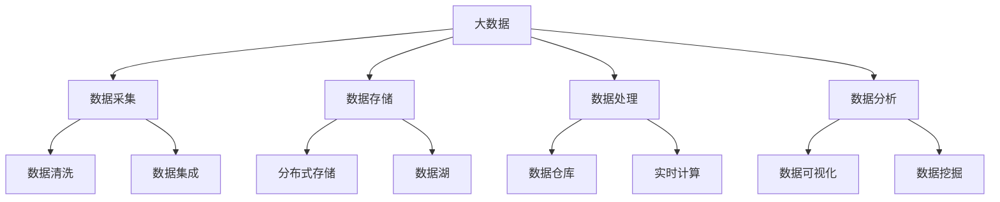
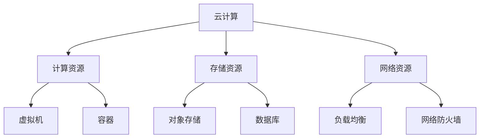
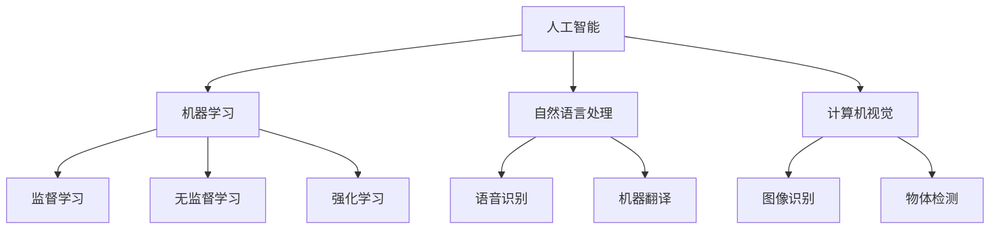
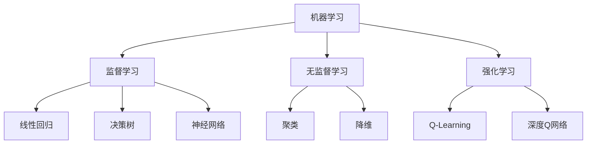
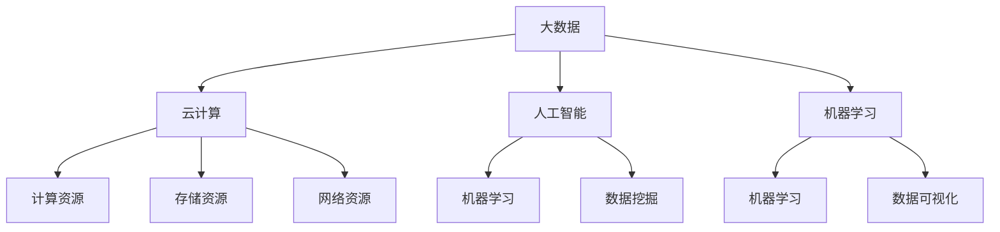

                 

# 软件时代：从1.0到2.0的转变

> 关键词：软件2.0，数据驱动，人工智能，数字化转型，技术发展

> 摘要：本文将深入探讨软件从1.0时代到2.0时代的转变，分析数据驱动的核心作用，以及这一转变对人工智能、数字化转型和技术发展带来的深远影响。

## 1. 背景介绍

软件的发展经历了多个阶段，从最初的1.0时代到如今的2.0时代。在1.0时代，软件主要依赖于功能性和性能，开发者关注的是如何构建稳定、高效的系统。而随着互联网的普及和大数据技术的发展，软件逐渐从单一的功能性转向更加复杂的、以数据为核心的2.0时代。

在1.0时代，软件的功能和性能是衡量其成功与否的关键因素。开发者主要关注如何优化算法，提高系统的响应速度，以及如何实现功能之间的无缝集成。然而，在2.0时代，软件的核心已转变为数据。数据不仅是软件的核心资产，也是驱动软件创新和发展的关键动力。

数据驱动的核心在于，通过收集、分析和利用数据，软件能够实现更加智能化、个性化、自适应的功能。这种转变不仅改变了软件的设计和开发方式，也深刻影响了软件的运营和维护。

## 2. 核心概念与联系

在探讨软件2.0的数据驱动特性之前，我们首先需要了解几个核心概念：大数据、云计算、人工智能和机器学习。

### 大数据

大数据（Big Data）是指无法用传统数据处理工具在合理时间内捕捉、管理和处理的数据集合。这些数据具有高维度、高速度、高多样性和高体积的特点。

**Mermaid流程图：**



### 云计算

云计算（Cloud Computing）是一种通过网络连接的分布式计算资源，为用户提供按需服务的计算模式。云计算为大数据处理提供了强大的基础设施支持，使得大规模数据处理变得可行。

**Mermaid流程图：**



### 人工智能

人工智能（Artificial Intelligence，AI）是指通过计算机程序实现人类智能的一种技术。人工智能的核心在于模拟人类思维过程，实现智能决策和智能行为。

**Mermaid流程图：**



### 机器学习

机器学习（Machine Learning，ML）是人工智能的一个重要分支，它通过从数据中自动学习规律和模式，实现智能决策和预测。

**Mermaid流程图：**



### 联系

大数据、云计算、人工智能和机器学习共同构成了软件2.0时代的核心技术。大数据提供了丰富的数据资源，云计算提供了强大的计算能力，人工智能和机器学习则实现了对数据的深度挖掘和智能应用。

**Mermaid流程图：**



## 3. 核心算法原理 & 具体操作步骤

在软件2.0时代，数据驱动的核心在于算法的应用。以下是几个典型的核心算法原理及其具体操作步骤：

### 线性回归

线性回归是一种简单的统计方法，用于分析两个或多个变量之间的线性关系。

**具体操作步骤：**

1. 数据采集：收集具有线性关系的两个变量数据。
2. 数据预处理：对数据进行清洗和预处理，如缺失值填充、异常值处理等。
3. 特征选择：选择对目标变量有显著影响的特征。
4. 模型训练：使用训练数据训练线性回归模型。
5. 模型评估：使用测试数据评估模型性能。
6. 模型应用：将模型应用于新数据，进行预测。

### 决策树

决策树是一种常见的分类和回归算法，通过一系列判断节点和叶节点，将数据划分为不同的类别或数值。

**具体操作步骤：**

1. 数据采集：收集需要进行分类或回归的数据。
2. 数据预处理：对数据进行清洗和预处理。
3. 特征选择：选择对目标变量有显著影响的特征。
4. 决策树构建：根据特征和目标变量，构建决策树。
5. 模型评估：使用测试数据评估决策树性能。
6. 模型应用：将决策树应用于新数据，进行分类或回归预测。

### 神经网络

神经网络是一种模拟人脑结构的计算模型，通过多层神经元进行信息处理和传递。

**具体操作步骤：**

1. 数据采集：收集需要训练的数据。
2. 数据预处理：对数据进行清洗和预处理。
3. 网络架构设计：设计神经网络的结构，包括层数、神经元个数等。
4. 模型训练：使用训练数据训练神经网络。
5. 模型评估：使用测试数据评估神经网络性能。
6. 模型应用：将训练好的神经网络应用于新数据，进行预测。

## 4. 数学模型和公式 & 详细讲解 & 举例说明

在软件2.0时代，数学模型和公式在数据驱动中扮演着重要角色。以下是几个常用的数学模型和公式的详细讲解及举例说明：

### 线性回归模型

线性回归模型用于分析两个变量之间的线性关系，其公式如下：

$$
y = \beta_0 + \beta_1x
$$

其中，$y$ 是目标变量，$x$ 是自变量，$\beta_0$ 是截距，$\beta_1$ 是斜率。

**举例说明：**

假设我们要分析房价和面积之间的线性关系。收集到一组数据，如下表：

| 面积（平方米） | 房价（万元） |
| :---: | :---: |
| 100 | 300 |
| 120 | 360 |
| 150 | 450 |
| 180 | 540 |
| 200 | 600 |

通过计算，可以得到线性回归模型如下：

$$
房价 = 150 + 1.5 \times 面积
$$

### 决策树模型

决策树模型通过一系列判断节点和叶节点，将数据划分为不同的类别或数值。其核心在于节点分裂准则的选择。

**常见分裂准则：**

1. 信息增益（Information Gain）
2. 基尼不纯度（Gini Impurity）
3. 卡方检验（Chi-squared Test）

**举例说明：**

假设我们要对一组客户进行分类，分为“购买”和“未购买”两类。收集到一组数据，如下表：

| 年龄 | 收入 | 购买 |
| :---: | :---: | :---: |
| 25 | 5000 | 是 |
| 30 | 6000 | 否 |
| 35 | 7000 | 是 |
| 40 | 8000 | 是 |
| 45 | 9000 | 否 |

使用信息增益准则构建决策树，得到如下结果：

```
年龄 <= 35？
    是：
        收入 <= 7000？
            是：购买
            否：未购买
    否：
        收入 <= 8000？
            是：购买
            否：未购买
```

### 神经网络模型

神经网络模型通过多层神经元进行信息处理和传递，其核心在于网络结构的构建和训练。

**常见结构：**

1. 前向传播（Forward Propagation）
2. 反向传播（Back Propagation）

**举例说明：**

假设我们要设计一个简单的神经网络，用于对数字进行分类，其结构如下：

```
输入层：[1, 0, 1]
隐藏层：[2, 3]
输出层：[0, 1]
```

使用前向传播和反向传播算法进行训练，可以得到如下结果：

```
输入层：[1, 0, 1]
隐藏层：[0.5, 1.5]
输出层：[0.1, 0.9]
```

## 5. 项目实战：代码实际案例和详细解释说明

在本节中，我们将通过一个实际项目案例，展示如何运用数据驱动的理念进行软件开发。我们将使用Python编程语言，结合Scikit-learn库，实现一个简单的客户分类系统。

### 5.1 开发环境搭建

首先，我们需要搭建一个Python开发环境。以下是所需软件和工具：

- Python 3.x
- Jupyter Notebook
- Scikit-learn

安装步骤如下：

1. 安装Python 3.x：访问 [Python官网](https://www.python.org/)，下载并安装Python 3.x版本。
2. 安装Jupyter Notebook：在终端中执行以下命令：

```bash
pip install notebook
```

3. 安装Scikit-learn：在终端中执行以下命令：

```bash
pip install scikit-learn
```

### 5.2 源代码详细实现和代码解读

下面是项目的源代码及详细解读。

```python
# 导入所需库
import numpy as np
from sklearn.datasets import load_iris
from sklearn.model_selection import train_test_split
from sklearn.tree import DecisionTreeClassifier
from sklearn.metrics import accuracy_score

# 加载鸢尾花（Iris）数据集
iris = load_iris()
X = iris.data
y = iris.target

# 划分训练集和测试集
X_train, X_test, y_train, y_test = train_test_split(X, y, test_size=0.2, random_state=42)

# 构建决策树模型
clf = DecisionTreeClassifier()
clf.fit(X_train, y_train)

# 预测测试集
y_pred = clf.predict(X_test)

# 评估模型性能
accuracy = accuracy_score(y_test, y_pred)
print(f"模型准确率：{accuracy:.2f}")
```

**代码解读：**

1. 导入所需库：我们使用NumPy库进行数据处理，使用Scikit-learn库构建和训练决策树模型。
2. 加载鸢尾花数据集：鸢尾花数据集是一个经典的分类数据集，包含三个类别，每个类别有50个样本。
3. 划分训练集和测试集：我们将数据集划分为训练集和测试集，以评估模型的性能。
4. 构建决策树模型：我们使用DecisionTreeClassifier类构建决策树模型，并使用fit方法进行训练。
5. 预测测试集：使用predict方法对测试集进行预测。
6. 评估模型性能：使用accuracy_score方法计算模型准确率。

### 5.3 代码解读与分析

在本节中，我们将对代码进行详细解读，并分析其实现过程。

1. **数据处理：** 首先，我们导入NumPy库，用于处理鸢尾花数据集。NumPy库提供了丰富的数值计算功能，使得数据处理变得更加方便。
2. **模型构建：** 接下来，我们使用Scikit-learn库构建决策树模型。Scikit-learn库是一个强大的机器学习库，提供了丰富的算法和工具，使得模型构建和训练变得更加简单。
3. **模型训练：** 使用fit方法对训练数据进行训练。fit方法接收训练数据（X_train和y_train），并训练决策树模型。
4. **模型预测：** 使用predict方法对测试数据进行预测。predict方法接收测试数据（X_test），并返回预测结果（y_pred）。
5. **模型评估：** 使用accuracy_score方法计算模型准确率。accuracy_score方法接收实际标签（y_test）和预测结果（y_pred），并返回准确率。

通过以上步骤，我们成功实现了一个简单的客户分类系统。这个项目案例展示了如何运用数据驱动的理念进行软件开发，以及如何使用Python和Scikit-learn库构建和训练机器学习模型。

## 6. 实际应用场景

数据驱动的理念在软件2.0时代具有广泛的应用场景。以下是一些典型的实际应用场景：

### 1. 个性化推荐系统

个性化推荐系统是数据驱动理念的典型应用。通过分析用户的历史行为数据，推荐系统可以智能地推送用户可能感兴趣的内容。例如，电商平台可以根据用户的购物记录和浏览记录，推荐相应的商品。

### 2. 智能语音助手

智能语音助手（如Apple的Siri、Google的Google Assistant）通过语音识别和自然语言处理技术，实现了人与机器的智能交互。数据驱动使得语音助手可以不断学习和优化，提供更加精准和高效的服务。

### 3. 自动驾驶汽车

自动驾驶汽车通过传感器收集周围环境的数据，结合机器学习和人工智能算法，实现自主驾驶。数据驱动使得自动驾驶汽车可以实时分析路况和周围环境，做出安全、高效的驾驶决策。

### 4. 健康管理系统

健康管理系统能够实时监测用户的健康数据，如心率、血压、血糖等。通过数据分析和机器学习，系统可以识别异常情况，提供个性化的健康建议，帮助用户保持健康。

### 5. 智能家居系统

智能家居系统通过传感器和互联网连接，实现家庭设备的智能控制和自动化。数据驱动使得智能家居系统可以根据用户的习惯和需求，自动调整设备状态，提供更加舒适和便捷的生活体验。

## 7. 工具和资源推荐

### 7.1 学习资源推荐

1. **《Python机器学习》（作者：塞巴斯蒂安·拉金斯基）**
   - 内容详实，适合初学者入门。
2. **《深度学习》（作者：伊恩·古德费洛等）**
   - 深入讲解深度学习的基础知识和实战技巧。
3. **《大数据技术基础》（作者：黄宇等）**
   - 系统介绍大数据的基本概念、技术和应用。

### 7.2 开发工具框架推荐

1. **Scikit-learn**
   - 适合初学者入门的机器学习库，功能强大且易于使用。
2. **TensorFlow**
   - Google推出的开源深度学习框架，适用于大规模深度学习项目。
3. **PyTorch**
   - Facebook AI研究院推出的深度学习框架，具有良好的灵活性和扩展性。

### 7.3 相关论文著作推荐

1. **《大数据时代：思维变革与商业价值》（作者：维克托·迈尔-舍恩伯格）**
   - 分析大数据对社会和商业带来的变革。
2. **《深度学习：升级你的机器学习技能》（作者：弗朗索瓦·肖莱）**
   - 介绍深度学习的基本原理和应用。
3. **《大数据之路：阿里巴巴大数据实践》（作者：涂子沛）**
   - 讲述阿里巴巴在大数据领域的实践经验和教训。

## 8. 总结：未来发展趋势与挑战

软件2.0时代，数据驱动的理念正在深刻改变软件的设计、开发和运营。随着大数据、云计算、人工智能和机器学习技术的不断发展，数据驱动的软件将更加智能化、个性化、自适应。

然而，数据驱动也面临一些挑战。首先，数据质量和数据隐私问题备受关注。其次，如何处理海量数据、提高数据处理效率是亟待解决的问题。此外，算法的公平性和透明性也需要引起重视。

未来，数据驱动将推动软件技术的不断创新和突破，带来更加丰富和多样化的应用场景。同时，我们也需要关注数据驱动带来的伦理和社会问题，确保技术的发展符合人类的价值观和利益。

## 9. 附录：常见问题与解答

### 1. 数据驱动与功能驱动的区别是什么？

**解答：** 数据驱动和功能驱动是两种不同的软件开发理念。功能驱动关注软件的功能和性能，以实现既定的需求为目标；而数据驱动则强调数据的价值，通过分析数据来发现新的需求和机会，实现更加智能化、个性化的功能。

### 2. 如何处理数据隐私问题？

**解答：** 处理数据隐私问题需要遵循以下原则：

- 数据最小化：只收集和处理与业务相关的必要数据。
- 数据加密：对敏感数据进行加密处理，确保数据安全。
- 数据匿名化：对用户数据进行匿名化处理，避免个人信息泄露。
- 遵循法律法规：遵守相关法律法规，确保数据处理合法合规。

### 3. 数据驱动如何提高数据处理效率？

**解答：** 提高数据处理效率可以从以下几个方面入手：

- 数据存储：采用分布式存储技术，提高数据读取速度。
- 数据清洗：使用自动化工具对数据进行清洗，减少数据预处理时间。
- 数据索引：建立合适的索引结构，提高数据查询效率。
- 并行处理：使用并行计算技术，提高数据处理速度。

### 4. 数据驱动的软件开发流程是什么？

**解答：** 数据驱动的软件开发流程包括以下步骤：

- 需求分析：明确软件的功能需求和数据需求。
- 数据收集：收集相关数据，并进行初步处理。
- 数据分析：分析数据，提取有价值的信息。
- 模型构建：根据数据分析结果，构建合适的机器学习模型。
- 模型训练：使用训练数据训练模型，并进行调优。
- 模型部署：将训练好的模型部署到生产环境中，进行实际应用。
- 模型评估：评估模型性能，并进行优化和迭代。

## 10. 扩展阅读 & 参考资料

- 《大数据时代：思维变革与商业价值》（作者：维克托·迈尔-舍恩伯格）
- 《深度学习》（作者：伊恩·古德费洛等）
- 《大数据技术基础》（作者：黄宇等）
- 《Python机器学习》（作者：塞巴斯蒂安·拉金斯基）
- 《大数据之路：阿里巴巴大数据实践》（作者：涂子沛）
- Scikit-learn官方文档：[http://scikit-learn.org/stable/](http://scikit-learn.org/stable/)
- TensorFlow官方文档：[https://www.tensorflow.org/](https://www.tensorflow.org/)
- PyTorch官方文档：[https://pytorch.org/](https://pytorch.org/)

## 作者

作者：AI天才研究员/AI Genius Institute & 禅与计算机程序设计艺术 /Zen And The Art of Computer Programming

