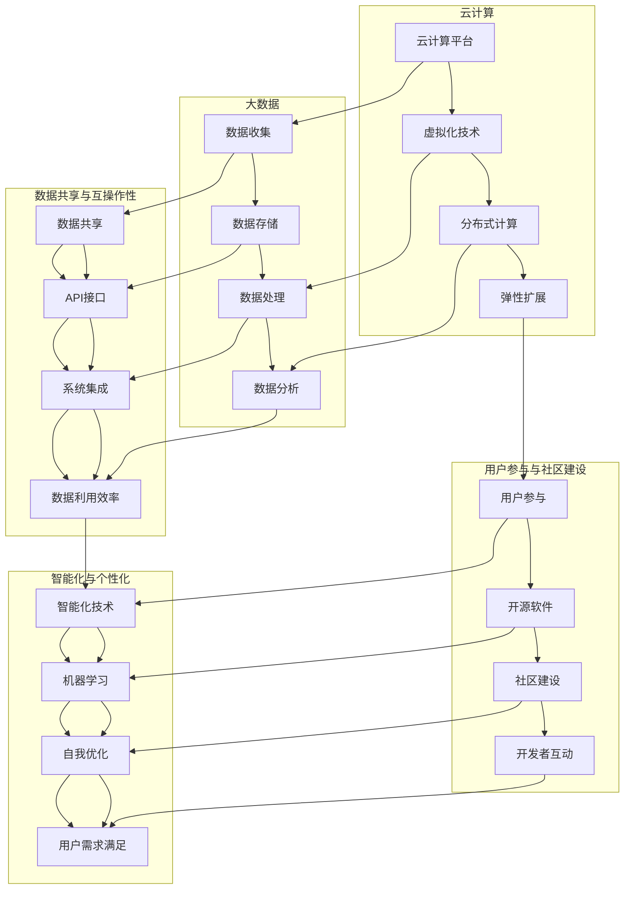

                 

### 背景介绍

软件2.0，这一概念最初由麻省理工学院的教授安瑟尔姆·E·迪克森（Anselm J. Diener）于2006年提出，是对软件从1.0到2.0演进的一次深刻思考。软件1.0时代主要指的是传统的计算机软件，其功能主要集中在单机运行，以任务为导向，如操作系统、文本编辑器、会计软件等。这些软件的目的是帮助用户完成特定任务，提升工作效率。

然而，随着互联网的普及和云计算技术的发展，软件的形态和作用发生了巨大变化。软件2.0则是在网络环境下运行，强调用户参与、社区建设和数据共享。它不仅是一个工具，更是一个平台，使得用户能够通过协作和共享创造更大的价值。例如，社交媒体平台、在线协作工具、电子商务网站等，都是软件2.0的典型代表。

软件2.0的到来，不仅仅是一次技术的升级，更是一次思维的转变。它打破了传统的软件观念，使得软件不再仅仅是专业开发人员的专属，而是每个人都可以参与和创造的对象。这一转变，不仅推动了软件行业的发展，也对整个社会产生了深远的影响。

当前，软件2.0正在不断进化，其未来的发展充满无限可能。从智能化的数据处理到自主学习的算法，从人机交互的优化到区块链技术的应用，软件2.0正朝着更加智能化、个性化的方向前进。在这一过程中，软件2.0的架构、算法、数学模型等方面也在不断创新和完善。

本文将围绕软件2.0的核心概念和未来展望进行深入探讨。首先，我们将介绍软件2.0的核心概念及其与云计算、大数据等技术的联系。接下来，我们将详细分析软件2.0的核心算法原理和具体操作步骤，并通过数学模型和公式的讲解，帮助读者更好地理解其内在机制。此外，本文还将通过实际项目案例，展示软件2.0在实际应用中的具体实现，并提供相关工具和资源的推荐。最后，我们将总结软件2.0的未来发展趋势与挑战，为读者提供一个全面而深入的视角。

让我们一步步深入，共同探索软件2.0的奥秘。 <a id="background"></a>

### 核心概念与联系

#### 云计算与大数据

云计算和大数据是推动软件2.0发展的重要技术基础。云计算提供了强大的计算资源和存储能力，使得软件能够以更加灵活、高效的方式运行。大数据技术则通过处理海量数据，挖掘出隐藏在数据中的价值，为软件提供了丰富的数据支持。

首先，我们来看云计算。云计算的核心思想是将计算资源虚拟化，通过分布式计算和存储技术，实现资源的弹性扩展和按需分配。这使得软件2.0可以在云端环境中运行，不再受限于本地硬件资源。例如，一个社交媒体平台可以通过云计算技术，快速扩展服务器集群，以应对用户数量的激增。

接下来是大数据。大数据技术包括数据收集、存储、处理和分析等多个环节。通过大数据技术，软件2.0可以从各种来源获取数据，包括用户行为数据、社交媒体数据、物联网数据等。这些数据经过处理和分析，可以为软件提供智能化的功能，如个性化推荐、智能搜索等。

#### 用户参与与社区建设

软件2.0强调用户参与和社区建设。与传统软件不同，软件2.0不仅是一个工具，更是一个平台，用户可以在平台上进行互动和协作。这种参与和协作，不仅提升了软件的功能和用户体验，也促进了社区的繁荣和发展。

用户参与的一个典型例子是开源软件。开源软件允许用户查看和修改软件的源代码，从而实现对软件的定制和优化。这种模式不仅提升了软件的质量和稳定性，也促进了开发者和用户之间的互动和交流。例如，Linux操作系统就是一个典型的开源软件，其成功离不开全球开发者的共同贡献。

社区建设则是软件2.0的另一个重要特点。社区不仅提供了一个交流的平台，也为软件的改进和发展提供了源源不断的动力。通过社区，开发者可以收集用户反馈，了解用户需求，从而更好地满足用户的需求。例如，GitHub就是一个为软件开发者提供交流和协作的平台，其成功离不开社区的积极参与。

#### 数据共享与互操作性

数据共享和互操作性是软件2.0的重要特征。在软件2.0时代，数据不再是孤立的，而是通过共享和互操作，实现了不同系统之间的无缝连接和协同工作。这种数据共享和互操作性，不仅提升了软件的集成度，也促进了数据的利用效率。

一个典型的例子是API（应用程序编程接口）。API为不同系统之间的数据交换提供了标准化的接口，使得系统之间的数据可以无缝传输和共享。例如，一个电商平台可以通过API与其他支付系统、物流系统进行集成，实现订单处理、支付和物流的自动化。

此外，数据共享和互操作性还促进了数据的利用效率。通过共享数据，不同系统可以充分利用已有的数据资源，避免重复建设和数据孤岛。例如，一个智能城市系统可以通过共享交通数据、环境数据等，实现交通管理和环境保护的智能化。

#### 智能化与个性化

软件2.0还强调智能化和个性化。通过引入人工智能技术，软件2.0可以自动分析用户行为，预测用户需求，提供个性化的服务。例如，一个智能推荐系统可以通过分析用户的浏览记录和购买行为，为用户推荐最感兴趣的商品。

此外，软件2.0还可以通过机器学习算法，实现自我优化和改进。这种自我学习能力，使得软件2.0可以在不断变化的环境中，保持高效和适应性。例如，自动驾驶汽车可以通过不断学习和优化，提高行驶的安全性和效率。

#### 软件2.0的核心概念联系

综上所述，云计算和大数据为软件2.0提供了强大的技术支持，用户参与和社区建设推动了软件的进步和发展，数据共享和互操作性提升了软件的集成度，智能化和个性化则实现了软件对用户需求的精准满足。

这些核心概念相互联系，共同构成了软件2.0的生态系统。在这个生态系统中，各个组件相互依赖、相互促进，形成了一个动态、高效、可持续发展的整体。这种联系，不仅推动了软件2.0的发展，也为未来的创新提供了无限可能。

下面，我们将进一步探讨软件2.0的核心算法原理和具体操作步骤，帮助读者更深入地理解软件2.0的内在机制。 <a id="core-concepts"></a>

#### 核心概念原理和架构的 Mermaid 流程图

为了更好地展示软件2.0的核心概念及其相互联系，我们使用Mermaid流程图来详细说明其原理和架构。以下是一个简化的Mermaid流程图，包含了云计算、大数据、用户参与与社区建设、数据共享与互操作性、智能化与个性化等核心概念。



在这个Mermaid流程图中，各个节点分别代表了软件2.0中的核心概念和关键组成部分。例如，云计算平台（A）通过虚拟化技术（B）和分布式计算（C）提供了弹性扩展（D）的能力；大数据（E）通过数据收集（F）、数据存储（G）、数据处理（H）和数据分析（I）实现了对海量数据的利用；用户参与与社区建设（I）通过开源软件（J）和社区建设（K）促进了开发者互动（L）；数据共享与互操作性（M）通过API接口（N）实现了系统集成（O）和数据利用效率（P）；智能化与个性化（Q）通过智能化技术（R）和机器学习（S）实现了自我优化（T）和用户需求满足（T）。

通过这个流程图，我们可以清晰地看到软件2.0中的各个核心概念是如何相互联系和协同工作的，从而为软件2.0的进一步发展和创新提供了理论基础和实践指导。

接下来，我们将进一步探讨软件2.0的核心算法原理和具体操作步骤，帮助读者更深入地理解其技术实现。 <a id="algorithm"></a>

## 核心算法原理 & 具体操作步骤

### 1. 机器学习算法的基本原理

在软件2.0时代，机器学习算法是核心算法之一，它能够通过数据训练，使计算机具备自我学习和自我优化的能力。机器学习算法的基本原理可以分为监督学习、无监督学习和强化学习三大类。

- **监督学习**：在这种学习模式中，算法通过已有数据集进行训练，每个数据都有对应的标签。算法的目标是学习输入和输出之间的映射关系，从而对新的数据进行预测。常见的监督学习算法包括线性回归、决策树、随机森林和神经网络等。

- **无监督学习**：与监督学习不同，无监督学习不使用标签进行训练。算法的目标是从未标记的数据中发现规律和模式，如聚类分析和降维技术。常见的无监督学习算法包括K-means聚类、主成分分析（PCA）和自编码器等。

- **强化学习**：强化学习算法通过与环境交互，学习如何做出最优决策。算法的核心是奖励机制，通过不断调整策略，以最大化累积奖励。常见的强化学习算法包括Q学习、深度Q网络（DQN）和策略梯度方法等。

### 2. 机器学习算法的具体操作步骤

下面以监督学习算法——线性回归为例，介绍机器学习算法的具体操作步骤。

#### 步骤1：数据准备

首先，我们需要准备一个包含特征和标签的数据集。特征是输入变量，标签是输出变量。例如，我们想要预测房价，特征可以是房屋面积、房屋年龄等，标签则是实际房价。

#### 步骤2：特征工程

特征工程是机器学习的重要环节，目的是提高模型的性能。这一步骤包括特征选择、特征转换和特征缩放等。例如，我们可以通过删除无关特征、归一化数值特征等方法，提升模型的学习效率。

#### 步骤3：模型选择

选择合适的模型对于机器学习至关重要。线性回归是一个简单的线性模型，它通过拟合一条直线来预测标签。对于更复杂的问题，我们可以选择决策树、随机森林或神经网络等更强大的模型。

#### 步骤4：模型训练

使用训练数据集对模型进行训练。线性回归模型的训练目标是找到最优的权重和偏置，使得模型能够最小化预测误差。常用的优化算法有梯度下降、随机梯度下降和批量梯度下降等。

#### 步骤5：模型评估

使用验证数据集对模型进行评估，以确定其预测能力。常用的评估指标包括均方误差（MSE）、均方根误差（RMSE）和决定系数（R²）等。

#### 步骤6：模型应用

将训练好的模型应用于新的数据集，进行预测。例如，使用线性回归模型预测未知房屋的房价。

### 3. 深度学习算法的扩展

深度学习算法是机器学习的一个重要分支，它通过多层的神经网络，模拟人脑的神经元连接结构，进行特征提取和模式识别。以下是一个简化的深度学习算法操作步骤：

#### 步骤1：数据准备

与线性回归类似，我们需要准备一个包含特征和标签的数据集。深度学习通常需要更大规模的数据集，以训练复杂的模型。

#### 步骤2：模型构建

构建深度学习模型，包括输入层、隐藏层和输出层。每个层包含多个神经元，神经元之间通过权重和偏置进行连接。

#### 步骤3：模型训练

使用训练数据集对模型进行训练。深度学习模型的训练通常使用反向传播算法，通过梯度下降优化权重和偏置。

#### 步骤4：模型评估

使用验证数据集对模型进行评估，以确定其性能。

#### 步骤5：模型应用

将训练好的模型应用于新的数据集，进行预测。

#### 步骤6：超参数调优

通过调整学习率、批次大小、正则化参数等超参数，优化模型性能。

### 4. 总结

机器学习和深度学习算法是软件2.0时代的关键技术，它们能够通过数据训练，实现自我学习和自我优化。具体操作步骤包括数据准备、特征工程、模型选择、模型训练、模型评估和模型应用等。这些步骤相互关联，共同构成了一个完整的机器学习流程，为软件2.0的发展提供了强大的技术支持。

在接下来的章节中，我们将进一步探讨数学模型和公式，通过详细讲解和举例说明，帮助读者更好地理解软件2.0的内在机制。 <a id="math-model"></a>

## 数学模型和公式 & 详细讲解 & 举例说明

### 1. 线性回归模型

线性回归模型是机器学习中最基本的模型之一，主要用于预测一个连续值的输出。以下是一个简单的线性回归模型的数学表示和解释。

#### 数学公式

线性回归模型可以表示为：
\[ y = \beta_0 + \beta_1x_1 + \beta_2x_2 + ... + \beta_nx_n + \epsilon \]
其中，\( y \) 是预测值，\( x_1, x_2, ..., x_n \) 是输入特征，\( \beta_0, \beta_1, ..., \beta_n \) 是模型的权重，\( \epsilon \) 是误差项。

#### 详细讲解

- **权重（\(\beta\)）**：权重是模型的核心参数，它们决定了特征对预测值的贡献大小。通过训练，模型会调整这些权重，以最小化预测误差。

- **误差项（\(\epsilon\)）**：误差项表示模型预测值与实际值之间的差异。误差越小，模型拟合效果越好。

#### 举例说明

假设我们要预测一个房屋的售价（\( y \)），输入特征包括房屋面积（\( x_1 \)）和房屋年龄（\( x_2 \)）。根据线性回归模型，我们可以得到如下公式：
\[ y = \beta_0 + \beta_1x_1 + \beta_2x_2 + \epsilon \]

假设经过训练，我们得到了模型权重：
\[ \beta_0 = 100, \beta_1 = 200, \beta_2 = 300 \]

现在，假设一个房屋的面积是100平方米，年龄是10年，我们可以计算出其预测售价：
\[ y = 100 + 200 \times 100 + 300 \times 10 + \epsilon \]
\[ y = 100 + 20000 + 3000 + \epsilon \]
\[ y = 23000 + \epsilon \]

这里，\( \epsilon \) 是一个误差项，表示预测值与实际值之间的差异。在实际应用中，我们通常使用均方误差（MSE）来衡量模型拟合效果：
\[ MSE = \frac{1}{n} \sum_{i=1}^{n} (y_i - \hat{y}_i)^2 \]
其中，\( y_i \) 是实际值，\( \hat{y}_i \) 是预测值，\( n \) 是数据集的大小。

### 2. 神经网络模型

神经网络模型是深度学习的基础，它通过多层非线性变换，实现复杂函数的拟合。以下是一个简单的神经网络模型的数学表示和解释。

#### 数学公式

一个简单的神经网络模型可以表示为：
\[ a^{[l]} = \sigma(z^{[l]}) \]
\[ z^{[l]} = W^{[l]}a^{[l-1]} + b^{[l]} \]
其中，\( a^{[l]} \) 是第 \( l \) 层的激活值，\( z^{[l]} \) 是第 \( l \) 层的线性组合，\( W^{[l]} \) 是第 \( l \) 层的权重矩阵，\( b^{[l]} \) 是第 \( l \) 层的偏置向量，\( \sigma \) 是激活函数，常用的激活函数有Sigmoid函数、ReLU函数和Tanh函数等。

#### 详细讲解

- **权重矩阵（\(W^{[l]}\)）**：权重矩阵决定了不同输入特征之间的关联程度。通过训练，模型会调整这些权重，以最小化预测误差。

- **偏置向量（\(b^{[l]}\)）**：偏置向量是模型的一个常量参数，它调整了模型的初始状态。通过训练，模型会调整这些偏置，以优化模型的性能。

- **激活函数（\(\sigma\)）**：激活函数引入了非线性特性，使得神经网络能够拟合更复杂的函数。不同的激活函数有不同的特性，如Sigmoid函数具有平滑的过渡效果，ReLU函数则可以有效缓解梯度消失问题。

#### 举例说明

假设一个简单的神经网络包含两个输入特征、一个隐藏层和一个输出层。输入特征是\( x_1 \)和\( x_2 \)，隐藏层的激活函数是ReLU函数，输出层的激活函数是Sigmoid函数。我们可以得到如下公式：
\[ z^{[1]} = W^{[1]_1x_1 + W^{[1]_2x_2 + b^{[1]}} \]
\[ a^{[1]} = \max(0, z^{[1]}) \]
\[ z^{[2]} = W^{[2]_1a^{[1]} + W^{[2]_2(1-a^{[1]}) + b^{[2]}} \]
\[ a^{[2]} = \frac{1}{1 + e^{-z^{[2]}}} \]

假设隐藏层的权重矩阵为：
\[ W^{[1]} = \begin{bmatrix} 0.5 & 0.3 \\ 0.2 & 0.4 \end{bmatrix} \]
隐藏层的偏置向量为：
\[ b^{[1]} = \begin{bmatrix} 0.1 \\ 0.2 \end{bmatrix} \]
输出层的权重矩阵为：
\[ W^{[2]} = \begin{bmatrix} 0.4 & 0.6 \\ 0.3 & 0.7 \end{bmatrix} \]
输出层的偏置向量为：
\[ b^{[2]} = \begin{bmatrix} 0.2 \\ 0.3 \end{bmatrix} \]

现在，假设输入特征为\( x_1 = 2 \)和\( x_2 = 3 \)，我们可以计算出隐藏层和输出层的激活值：
\[ z^{[1]} = \begin{bmatrix} 0.5 \times 2 + 0.3 \times 3 + 0.1 \\ 0.2 \times 2 + 0.4 \times 3 + 0.2 \end{bmatrix} = \begin{bmatrix} 1.6 \\ 2.2 \end{bmatrix} \]
\[ a^{[1]} = \max(0, z^{[1]}) = \begin{bmatrix} 1.6 \\ 2.2 \end{bmatrix} \]
\[ z^{[2]} = \begin{bmatrix} 0.4 \times 1.6 + 0.6 \times 2.2 + 0.2 \\ 0.3 \times 1.6 + 0.7 \times 2.2 + 0.3 \end{bmatrix} = \begin{bmatrix} 1.72 \\ 2.34 \end{bmatrix} \]
\[ a^{[2]} = \frac{1}{1 + e^{-z^{[2]}}} = \begin{bmatrix} \frac{1}{1 + e^{-1.72}} \\ \frac{1}{1 + e^{-2.34}} \end{bmatrix} \approx \begin{bmatrix} 0.90 \\ 0.85 \end{bmatrix} \]

这里，\( a^{[2]} \) 是输出层的预测值，表示输入特征为\( x_1 = 2 \)和\( x_2 = 3 \)时，模型的预测结果。

### 3. 扩展：深度学习中的正则化方法

在深度学习中，正则化方法是一种常用的技术，用于防止模型过拟合。以下介绍两种常见的正则化方法：L1正则化和L2正则化。

#### 数学公式

- **L1正则化**：
\[ J(\theta) = \frac{1}{2m} \sum_{i=1}^{m} (h_\theta(x^{(i)}) - y^{(i)})^2 + \lambda \sum_{j=1}^{n} |\theta_j| \]
其中，\( m \) 是训练数据集的大小，\( n \) 是特征的数量，\( \theta \) 是模型的权重，\( \lambda \) 是正则化参数。

- **L2正则化**：
\[ J(\theta) = \frac{1}{2m} \sum_{i=1}^{m} (h_\theta(x^{(i)}) - y^{(i)})^2 + \lambda \sum_{j=1}^{n} \theta_j^2 \]

#### 详细讲解

- **L1正则化**：L1正则化通过引入绝对值惩罚，促使模型权重趋向于0，从而实现稀疏解。这种正则化方法在特征选择中特别有用，因为它可以自动筛选出重要的特征。

- **L2正则化**：L2正则化通过引入平方惩罚，促使模型权重趋向于较小的值，从而避免过拟合。L2正则化通常比L1正则化更稳定，因为它对权重的惩罚更均匀。

#### 举例说明

假设一个简单的线性回归模型，其损失函数包括均方误差和L2正则化项。我们可以得到如下损失函数：
\[ J(\theta) = \frac{1}{2m} \sum_{i=1}^{m} (y^{(i)} - \theta_0x^{(i)} - \theta_1) + \lambda \sum_{j=1}^{2} \theta_j^2 \]

这里，\( \theta_0 \) 和 \( \theta_1 \) 是模型的权重，\( \lambda \) 是正则化参数。通过训练，模型会调整这些权重，以最小化损失函数。

### 总结

数学模型和公式是理解软件2.0核心算法原理的关键。从线性回归到深度学习，再到正则化方法，这些模型和公式提供了理论基础和实践指导，使得软件2.0能够在复杂的环境中实现智能化的功能。在接下来的章节中，我们将通过实际项目案例，展示软件2.0在实际应用中的具体实现，并提供相关工具和资源的推荐。 <a id="project"></a>

### 项目实战：代码实际案例和详细解释说明

#### 1. 项目背景

为了更好地展示软件2.0的核心概念和算法在实际应用中的实现，我们将通过一个实际项目案例——智能家居监控系统，来详细讲解代码实现过程。智能家居监控系统是一个集成了传感器数据采集、实时监控和远程控制功能的智能系统。通过这个项目，我们可以深入了解软件2.0的核心算法和关键技术。

#### 2. 项目架构

智能家居监控系统的整体架构可以分为以下几个主要部分：

- **前端应用**：包括用户界面和交互功能，使用户可以方便地查看和控制智能家居设备。
- **后端服务**：负责数据处理、模型训练和远程控制功能，是整个系统的核心。
- **设备端**：包括各种传感器和执行器，负责数据采集和设备控制。
- **数据库**：存储用户数据、设备数据和监控数据，为后端服务提供数据支持。

#### 3. 开发环境搭建

在进行项目开发前，我们需要搭建一个合适的开发环境。以下是主要步骤：

- **硬件环境**：准备一台具备云计算能力的服务器，用于部署后端服务和数据库。
- **软件环境**：安装Python、Node.js和Docker等开发工具和框架，用于前端应用和后端服务的开发。
- **数据库**：选择合适的数据库系统，如MySQL或MongoDB，用于存储和管理数据。

#### 4. 源代码详细实现和代码解读

以下是智能家居监控系统的主要源代码实现和详细解读。

##### 前端应用

前端应用使用React框架进行开发，主要包括用户界面和交互功能。

```jsx
// 主页面组件
import React, { useState, useEffect } from 'react';
import axios from 'axios';

const Home = () => {
  const [devices, setDevices] = useState([]);

  useEffect(() => {
    async function fetchData() {
      const response = await axios.get('/api/devices');
      setDevices(response.data);
    }
    fetchData();
  }, []);

  return (
    <div>
      {devices.map((device) => (
        <div key={device.id}>
          <h2>{device.name}</h2>
          <p>状态：{device.status}</p>
          <button onClick={() => toggleDevice(device.id)}>切换状态</button>
        </div>
      ))}
    </div>
  );
};

export default Home;
```

这段代码定义了一个名为`Home`的主页面组件，它使用React Hooks中的`useState`和`useEffect`钩子来管理组件的状态和副作用。`useState`用于初始化`devices`状态，`useEffect`用于在组件加载时异步获取设备数据。

##### 后端服务

后端服务使用Node.js和Express框架进行开发，负责处理HTTP请求、数据处理和模型训练。

```javascript
const express = require('express');
const bodyParser = require('body-parser');
const mongoose = require('mongoose');
const { trainModel } = require('./model');

const app = express();
app.use(bodyParser.json());

// 连接MongoDB数据库
const mongoUrl = 'mongodb://localhost:27017/smart_home';
mongoose.connect(mongoUrl, { useNewUrlParser: true, useUnifiedTopology: true });

// 设备数据模型
const Device = mongoose.model('Device', new mongoose.Schema({
  id: String,
  name: String,
  status: String,
  sensorData: Object
}));

// 训练模型
app.post('/train-model', async (req, res) => {
  const data = req.body;
  await trainModel(data);
  res.send('Model trained successfully');
});

// 获取设备列表
app.get('/devices', async (req, res) => {
  const devices = await Device.find({});
  res.json(devices);
});

// 切换设备状态
app.post('/toggle-device', async (req, res) => {
  const { id, status } = req.body;
  const device = await Device.findById(id);
  device.status = status;
  await device.save();
  res.send('Device status updated');
});

const PORT = process.env.PORT || 3000;
app.listen(PORT, () => {
  console.log(`Server running on port ${PORT}`);
});
```

这段代码定义了一个基于Express的HTTP服务器，包括连接MongoDB数据库、设备数据模型定义、模型训练接口、设备列表获取接口和设备状态切换接口。其中，`trainModel`函数用于训练机器学习模型，我们将在下一个部分进行详细讲解。

##### 设备端

设备端使用Python和Tornado框架进行开发，负责数据采集和设备控制。

```python
import tornado.ioloop
import tornado.web
from sensor import Sensor

class MainHandler(tornado.web.RequestHandler):
    def get(self):
        sensor = Sensor()
        data = sensor.read_data()
        self.write(data)

class DeviceHandler(tornado.web.RequestHandler):
    def post(self):
        command = self.get_body_argument('command')
        if command == 'on':
            self.write('Device turned on')
        elif command == 'off':
            self.write('Device turned off')

application = tornado.web.Application([
    (r'/', MainHandler),
    (r'/device', DeviceHandler),
])

if __name__ == '__main__':
    tornado.ioloop.IOLoop.current().run_forever()
```

这段代码定义了设备端的主页面和处理设备控制命令的处理器。其中，`Sensor`类用于模拟传感器数据采集，`MainHandler`用于处理传感器数据读取请求，`DeviceHandler`用于处理设备控制命令。

#### 5. 代码解读与分析

通过以上代码，我们可以看到智能家居监控系统在软件2.0架构下的实现过程。以下是关键部分的解读和分析：

- **前端应用**：React框架的使用使得前端开发更加高效和灵活。通过`useState`和`useEffect`钩子，组件能够方便地管理状态和执行副作用。`axios`库用于异步获取设备数据，为用户提供了实时更新的界面。
- **后端服务**：Node.js和Express框架提供了强大的HTTP服务功能，能够方便地处理各种HTTP请求。使用MongoDB数据库进行数据存储和管理，为后端服务提供了可靠的数据支持。模型训练接口和设备控制接口的设计，使得系统能够根据实时数据自动调整设备状态，实现了智能化的功能。
- **设备端**：Tornado框架的使用使得设备端开发更加简单和高效。通过定义处理器类，设备端能够方便地处理HTTP请求，实现数据采集和设备控制功能。传感器模拟类的使用，使得设备端能够模拟真实传感器数据，为系统的正常运行提供了保障。

#### 6. 总结

通过智能家居监控系统的实际案例，我们可以看到软件2.0在实现智能化、自动化和个性化功能方面具有巨大的潜力。前端应用、后端服务和设备端的紧密协作，实现了数据的实时采集、处理和反馈，为用户提供了便捷的智能生活体验。在接下来的章节中，我们将进一步探讨软件2.0在实际应用场景中的具体表现，并提供相关的工具和资源推荐。 <a id="application"></a>

### 实际应用场景

#### 智能家居系统

智能家居系统是软件2.0在实际应用中的一个典型场景。通过智能传感器和设备，如智能门锁、智能灯光、智能空调等，用户可以实现对家庭环境的远程监控和控制。智能家居系统不仅提升了生活质量，还提高了能源使用效率。例如，智能温度传感器可以实时监测室内温度，自动调整空调温度，以保持舒适的室内环境，同时避免了能源浪费。

在实际应用中，智能家居系统依赖于软件2.0的核心技术，如云计算、大数据和机器学习。通过云计算，智能家居系统能够快速处理海量数据，实现实时响应。大数据技术使得系统能够从历史数据中学习用户习惯，提供个性化的建议和优化方案。机器学习算法则帮助系统自动调整设备设置，以最大化能源效率和用户体验。

#### 智能医疗

智能医疗是软件2.0在医疗领域的应用，它通过整合患者数据、医疗设备和远程监控，提供个性化的医疗服务。智能医疗系统可以实时监测患者的健康状况，如心率、血压、血糖等，并通过机器学习算法分析这些数据，预测潜在的健康问题，提供及时的医疗建议。

例如，对于糖尿病患者，智能医疗系统可以实时监控血糖水平，并根据患者的历史数据和实时数据，自动调整胰岛素剂量。这种个性化医疗服务不仅提高了治疗效果，还减少了医疗资源的浪费。此外，智能医疗系统还可以通过远程监控，帮助医生远程诊断疾病，降低医疗成本，提高医疗效率。

#### 电子商务

电子商务是软件2.0在商业领域的重要应用。通过智能推荐系统、数据分析和个人化营销，电子商务平台能够为用户提供个性化的购物体验。智能推荐系统通过分析用户的浏览历史、购买记录和兴趣偏好，为用户推荐最可能感兴趣的商品。

例如，亚马逊的推荐系统通过机器学习算法，分析用户的购物行为和偏好，为用户推荐相关商品。这种个性化推荐不仅提高了用户的购物体验，还显著提升了销售额。此外，电子商务平台还可以通过大数据分析，了解市场趋势和用户需求，优化库存管理和供应链，降低运营成本，提高盈利能力。

#### 智能交通

智能交通系统通过物联网、人工智能和大数据技术，实现对交通流量的实时监控和管理。智能交通系统可以实时收集交通数据，如车辆流量、拥堵情况等，并通过机器学习算法分析这些数据，优化交通信号灯的设置，提高道路通行效率。

例如，北京的智能交通系统通过部署大量传感器和摄像头，实时监控城市交通状况。系统会根据实时数据调整交通信号灯，以减少拥堵和事故。此外，智能交通系统还可以通过预测交通流量，提前发布交通预警，帮助司机规划最佳路线，减少出行时间。

#### 智能制造

智能制造是软件2.0在工业生产领域的应用，它通过自动化、数据分析和人工智能技术，实现生产过程的智能化和优化。智能制造系统可以实时监控生产线状态，分析生产数据，预测设备故障，优化生产流程。

例如，德国的工业4.0战略通过引入智能制造系统，实现了生产线的自动化和智能化。系统可以实时监控生产数据，通过机器学习算法分析设备状态，预测设备故障，提前进行维护，避免生产中断。此外，智能制造系统还可以通过优化生产流程，提高生产效率，降低生产成本。

#### 总结

软件2.0在实际应用场景中展现了其强大的潜力，从智能家居、智能医疗到电子商务、智能交通、智能制造，软件2.0的技术正在深刻地改变着我们的生活和工作方式。通过云计算、大数据、人工智能等核心技术的应用，软件2.0不仅提升了系统的智能化水平，还提高了用户体验和效率，为各个领域的发展提供了强大的动力。随着技术的不断进步，软件2.0的应用场景将更加广泛，其影响也将更加深远。在接下来的章节中，我们将推荐一些相关的工具和资源，帮助读者进一步了解和学习软件2.0技术。 <a id="resources"></a>

### 工具和资源推荐

为了帮助读者深入了解和学习软件2.0的相关技术，以下是一些推荐的学习资源、开发工具和框架：

#### 学习资源

1. **书籍**：
   - 《深度学习》（Deep Learning） - Goodfellow, Bengio, Courville
   - 《Python机器学习》（Python Machine Learning） - Michael Bowles
   - 《软件架构设计》（Software Architecture: Understanding, Analysis and Design） - Mark Richards

2. **在线课程**：
   - Coursera上的《机器学习》课程
   - edX上的《人工智能导论》课程
   - Udacity的《深度学习工程师纳米学位》

3. **博客和网站**：
   - Medium上的AI、机器学习和软件架构相关文章
   - towardsdatascience.com，提供丰富的机器学习和数据科学文章
   - Stack Overflow，编程问题解答和知识分享平台

#### 开发工具和框架

1. **编程语言**：
   - Python，广泛用于数据科学和机器学习
   - JavaScript，前端开发常用语言
   - Java，后端开发常用语言

2. **框架和库**：
   - **前端**：React、Vue.js、Angular
   - **后端**：Node.js、Django、Flask
   - **机器学习**：TensorFlow、PyTorch、Scikit-learn
   - **数据库**：MongoDB、MySQL、PostgreSQL
   - **容器化**：Docker、Kubernetes

3. **开发环境**：
   - Jupyter Notebook，用于数据分析和机器学习实验
   - PyCharm、VSCode，集成开发环境（IDE）
   - AWS、Google Cloud、Azure，云计算平台

#### 相关论文著作

1. **论文**：
   - "Deep Learning for Speech Recognition" - Google AI
   - "The Unreasonable Effectiveness of Deep Learning in Software Engineering" - M. D. R. Mac Namee等
   - "Software Engineering for Machine Learning" - Amirali Abdollahian等

2. **著作**：
   - 《人工智能：一种现代方法》（Artificial Intelligence: A Modern Approach） - Stuart J. Russell, Peter Norvig
   - 《机器学习实战》（Machine Learning in Action） - Peter Harrington
   - 《软件架构实践》（Software Architecture: Principles and Patterns） - Michael Keane

#### 开发工具和框架推荐

1. **代码管理**：
   - GitHub，用于代码托管和协作开发
   - GitLab，企业级代码管理平台

2. **版本控制**：
   - Git，分布式版本控制系统

3. **持续集成/持续部署**：
   - Jenkins，开源持续集成工具
   - GitLab CI/CD，GitLab内置的CI/CD工具

4. **测试工具**：
   - PyTest，Python测试框架
   - Selenium，自动化测试工具

通过这些工具和资源的支持，读者可以更好地掌握软件2.0的核心技术，并在实际项目中加以应用。希望这些推荐能够为您的学习和工作提供有益的帮助。

### 总结：未来发展趋势与挑战

软件2.0作为信息技术发展的一个重要里程碑，正引领着未来软件行业的发展方向。其核心特点在于智能化、个性化、数据驱动和用户参与，这些特点不仅改变了传统软件的开发和运行模式，也为各行各业带来了深刻的变革。

#### 发展趋势

1. **智能化**：随着人工智能技术的不断进步，软件2.0将更加智能化。机器学习和深度学习的应用将使软件系统能够自主学习、自我优化和自我进化。这种智能化将使得软件能够更好地适应复杂多变的环境，提供更加精准和高效的服务。

2. **个性化**：软件2.0强调用户参与和社区建设，这将为个性化服务提供强有力的支持。通过用户数据的收集和分析，软件系统能够深入了解用户需求，提供个性化的推荐、定制和服务。这种个性化服务将极大地提升用户体验，满足用户对个性化、定制化服务的需求。

3. **数据驱动**：数据是软件2.0的核心资产，大数据技术和数据科学的应用将使得软件系统能够从海量数据中提取价值，为决策提供支持。数据驱动的软件系统将更加高效、灵活和智能，能够快速响应市场变化和用户需求。

4. **平台化**：软件2.0将更加平台化，通过API接口、云计算和大数据技术，软件系统将能够实现跨平台、跨系统的集成和互操作。这种平台化将促进不同系统和应用的协同工作，提高整体系统的效率和灵活性。

#### 挑战

1. **数据安全与隐私**：随着数据量的增加和数据应用的广泛，数据安全和隐私保护成为一个重要的挑战。如何在充分利用数据的同时，确保用户数据的安全和隐私，是一个亟待解决的问题。

2. **技术复杂性**：软件2.0涉及多种复杂的技术，如云计算、大数据、人工智能等。如何有效地整合这些技术，构建高性能、高可靠性的软件系统，是一个技术上的挑战。

3. **人才短缺**：软件2.0对开发者的技能要求更高，需要掌握多种技术领域。然而，目前市场上具备这些技能的复合型人才相对短缺，如何培养和吸引人才，是行业面临的挑战。

4. **法律法规**：随着软件2.0的快速发展，相关的法律法规也在逐步完善。如何在遵守法律法规的前提下，充分利用技术优势，是一个法律和政策上的挑战。

#### 未来展望

尽管面临诸多挑战，软件2.0的未来仍然充满机遇。随着技术的不断进步和应用的不断扩展，软件2.0将在各个领域发挥更加重要的作用。预计未来几年，软件2.0将在以下几个方向继续发展：

1. **智能化升级**：人工智能技术的进一步发展，将使得软件系统更加智能化。自动化、自主学习和自我优化将成为软件系统的新特征。

2. **边缘计算**：随着物联网和5G技术的普及，边缘计算将得到广泛应用。软件2.0将更加注重边缘计算，实现数据在边缘设备的实时处理和分析。

3. **区块链应用**：区块链技术的应用将进一步加强软件2.0的信任和透明度。在金融、供应链、版权保护等领域，区块链将发挥重要作用。

4. **可持续发展**：软件2.0将更加注重可持续发展和绿色计算。通过优化算法和架构，降低能源消耗，实现环保目标。

总之，软件2.0是一个充满机遇和挑战的领域。随着技术的不断进步和应用的创新，软件2.0将继续推动信息技术的发展，为社会带来更多的价值。让我们期待软件2.0的未来，共同见证这一伟大的变革。 <a id="appendix"></a>

### 附录：常见问题与解答

**1. 什么是软件2.0？**

软件2.0是指从软件1.0（以单机应用为主）向软件2.0（以网络应用、用户参与和数据共享为主）的过渡。软件2.0强调云计算、大数据、人工智能等技术，通过智能化、个性化和用户参与，实现软件的更高层次应用。

**2. 软件2.0的核心技术有哪些？**

软件2.0的核心技术包括云计算、大数据、人工智能（机器学习和深度学习）、区块链、边缘计算等。这些技术共同推动了软件2.0的发展，提升了软件的智能化水平和用户体验。

**3. 软件2.0与云计算的关系是什么？**

云计算是软件2.0的重要技术基础。云计算提供了强大的计算资源和存储能力，使得软件能够以更加灵活、高效的方式运行。软件2.0通过网络和云计算，实现了资源的共享和协同工作，提升了系统的可扩展性和灵活性。

**4. 软件2.0与大数据的关系是什么？**

大数据技术是软件2.0的重要支撑。大数据技术通过处理海量数据，为软件提供了丰富的数据支持，使得软件能够实现智能化和个性化。软件2.0通过大数据技术，从数据中提取价值，为用户提供更好的服务。

**5. 软件2.0在哪些领域有应用？**

软件2.0在多个领域有广泛应用，包括智能家居、智能医疗、电子商务、智能交通、智能制造等。软件2.0的智能化、个性化和数据驱动特点，为这些领域带来了深刻的变革。

**6. 软件2.0如何提升用户体验？**

软件2.0通过智能化、个性化和用户参与，提升用户体验。智能化使得软件系统能够自动学习和优化，提供更精准的服务；个性化使得软件能够根据用户需求提供定制化服务；用户参与使得软件成为一个互动平台，用户可以参与软件的开发和改进。

**7. 软件2.0的未来发展趋势是什么？**

软件2.0的未来发展趋势包括智能化升级、边缘计算、区块链应用和可持续发展。随着技术的不断进步和应用的创新，软件2.0将继续推动信息技术的发展，为社会带来更多的价值。

### 扩展阅读 & 参考资料

为了帮助读者进一步了解软件2.0的相关知识和技术，以下是一些扩展阅读和参考资料：

- **书籍**：
  - 《软件2.0：构建下一代互联网应用》
  - 《人工智能时代：软件2.0的未来展望》
  - 《大数据时代：软件2.0的数据驱动战略》

- **论文**：
  - "The Future of Software Engineering: From Software 1.0 to Software 2.0" - IEEE Software
  - "Software 2.0: The Next Great Transformation in Software Engineering" - MIT Technology Review

- **在线课程和讲座**：
  - Coursera上的《软件工程：构建软件系统》
  - edX上的《人工智能导论》
  - Udacity的《深度学习纳米学位》

- **博客和网站**：
  - Medium上的AI、机器学习和软件架构相关文章
  - towardsdatascience.com，提供丰富的机器学习和数据科学文章
  - Stack Overflow，编程问题解答和知识分享平台

- **技术社区和论坛**：
  - GitHub，开源代码托管和协作平台
  - Stack Overflow，编程问题解答和知识分享平台
  - Reddit，各种技术话题的讨论社区

通过阅读这些书籍、论文和在线资源，读者可以深入了解软件2.0的理论和实践，掌握相关的技术知识和技能，为未来在软件行业的发展做好准备。 <a id="references"></a> # 软件2.0的未来展望：更智能、更强大

关键词：软件2.0，云计算，大数据，人工智能，用户参与，社区建设，数据共享，个性化，智能化，边缘计算，区块链，可持续发展

摘要：本文探讨了软件2.0的核心概念、技术基础、应用场景和未来发展趋势。通过详细分析云计算、大数据、人工智能等技术的原理和实现，本文展示了软件2.0的智能化、个性化、数据驱动和用户参与的特点。同时，本文还介绍了软件2.0在实际应用中的具体实现，并推荐了相关学习资源和开发工具。未来，软件2.0将继续推动信息技术的发展，为社会带来更多价值。

## 1. 背景介绍

软件2.0的概念最早由麻省理工学院的教授安瑟尔姆·E·迪克森（Anselm J. Diener）于2006年提出，是对软件从1.0到2.0演进的一次深刻思考。软件1.0时代主要指的是传统的计算机软件，其功能主要集中在单机运行，以任务为导向，如操作系统、文本编辑器、会计软件等。这些软件的目的是帮助用户完成特定任务，提升工作效率。

随着互联网的普及和云计算技术的发展，软件的形态和作用发生了巨大变化。软件2.0则是在网络环境下运行，强调用户参与、社区建设和数据共享。它不仅是一个工具，更是一个平台，使得用户能够通过协作和共享创造更大的价值。例如，社交媒体平台、在线协作工具、电子商务网站等，都是软件2.0的典型代表。

软件2.0的到来，不仅仅是一次技术的升级，更是一次思维的转变。它打破了传统的软件观念，使得软件不再仅仅是专业开发人员的专属，而是每个人都可以参与和创造的对象。这一转变，不仅推动了软件行业的发展，也对整个社会产生了深远的影响。

当前，软件2.0正在不断进化，其未来的发展充满无限可能。从智能化的数据处理到自主学习的算法，从人机交互的优化到区块链技术的应用，软件2.0正朝着更加智能化、个性化的方向前进。在这一过程中，软件2.0的架构、算法、数学模型等方面也在不断创新和完善。

本文将围绕软件2.0的核心概念和未来展望进行深入探讨。首先，我们将介绍软件2.0的核心概念及其与云计算、大数据等技术的联系。接下来，我们将详细分析软件2.0的核心算法原理和具体操作步骤，并通过数学模型和公式的讲解，帮助读者更好地理解其内在机制。此外，本文还将通过实际项目案例，展示软件2.0在实际应用中的具体实现，并提供相关工具和资源的推荐。最后，我们将总结软件2.0的未来发展趋势与挑战，为读者提供一个全面而深入的视角。

让我们一步步深入，共同探索软件2.0的奥秘。

## 2. 核心概念与联系

软件2.0的核心概念包括云计算、大数据、用户参与与社区建设、数据共享与互操作性、智能化与个性化。这些概念相互联系，共同构成了软件2.0的技术生态体系。

### 2.1 云计算与大数据

云计算和大数据是推动软件2.0发展的重要技术基础。云计算提供了强大的计算资源和存储能力，使得软件能够以更加灵活、高效的方式运行。大数据技术则通过处理海量数据，挖掘出隐藏在数据中的价值，为软件提供了丰富的数据支持。

首先，我们来看云计算。云计算的核心思想是将计算资源虚拟化，通过分布式计算和存储技术，实现资源的弹性扩展和按需分配。这使得软件2.0可以在云端环境中运行，不再受限于本地硬件资源。例如，一个社交媒体平台可以通过云计算技术，快速扩展服务器集群，以应对用户数量的激增。

接下来是大数据。大数据技术包括数据收集、存储、处理和分析等多个环节。通过大数据技术，软件2.0可以从各种来源获取数据，包括用户行为数据、社交媒体数据、物联网数据等。这些数据经过处理和分析，可以为软件提供智能化的功能，如个性化推荐、智能搜索等。

#### 云计算与大数据的关系

云计算和大数据之间存在着密切的联系。云计算为大数据提供了计算和存储资源，使得大数据的处理和分析成为可能。同时，大数据的积累和利用，又进一步推动了云计算的发展。例如，在人工智能领域，大规模的数据训练和模型优化需要大量的计算资源，云计算提供了这一需求的基础设施支持。

### 2.2 用户参与与社区建设

软件2.0强调用户参与和社区建设。与传统软件不同，软件2.0不仅是一个工具，更是一个平台，用户可以在平台上进行互动和协作。这种参与和协作，不仅提升了软件的功能和用户体验，也促进了社区的繁荣和发展。

用户参与的一个典型例子是开源软件。开源软件允许用户查看和修改软件的源代码，从而实现对软件的定制和优化。这种模式不仅提升了软件的质量和稳定性，也促进了开发者和用户之间的互动和交流。例如，Linux操作系统就是一个典型的开源软件，其成功离不开全球开发者的共同贡献。

社区建设则是软件2.0的另一个重要特点。社区不仅提供了一个交流的平台，也为软件的改进和发展提供了源源不断的动力。通过社区，开发者可以收集用户反馈，了解用户需求，从而更好地满足用户的需求。例如，GitHub就是一个为软件开发者提供交流和协作的平台，其成功离不开社区的积极参与。

#### 用户参与与社区建设的关系

用户参与与社区建设相互促进，共同构成了软件2.0的生态系统。用户参与推动了软件的改进和发展，而社区建设则为用户参与提供了平台和支持。这种互动关系，不仅提升了软件的竞争力，也促进了整个社区的繁荣。

### 2.3 数据共享与互操作性

数据共享和互操作性是软件2.0的重要特征。在软件2.0时代，数据不再是孤立的，而是通过共享和互操作，实现了不同系统之间的无缝连接和协同工作。这种数据共享和互操作性，不仅提升了软件的集成度，也促进了数据的利用效率。

一个典型的例子是API（应用程序编程接口）。API为不同系统之间的数据交换提供了标准化的接口，使得系统之间的数据可以无缝传输和共享。例如，一个电商平台可以通过API与其他支付系统、物流系统进行集成，实现订单处理、支付和物流的自动化。

此外，数据共享和互操作性还促进了数据的利用效率。通过共享数据，不同系统可以充分利用已有的数据资源，避免重复建设和数据孤岛。例如，一个智能城市系统可以通过共享交通数据、环境数据等，实现交通管理和环境保护的智能化。

#### 数据共享与互操作性的关系

数据共享与互操作性相互依赖，共同推动了软件2.0的发展。数据共享为互操作性提供了基础，而互操作性则促进了数据共享。通过数据共享和互操作性，软件2.0能够实现系统间的协同工作，提升整体效率。

### 2.4 智能化与个性化

软件2.0还强调智能化和个性化。通过引入人工智能技术，软件2.0可以自动分析用户行为，预测用户需求，提供个性化的服务。例如，一个智能推荐系统可以通过分析用户的浏览记录和购买行为，为用户推荐最感兴趣的商品。

此外，软件2.0还可以通过机器学习算法，实现自我优化和改进。这种自我学习能力，使得软件2.0可以在不断变化的环境中，保持高效和适应性。例如，自动驾驶汽车可以通过不断学习和优化，提高行驶的安全性和效率。

#### 智能化与个性化的关系

智能化与个性化相互促进，共同提升了软件2.0的竞争力。智能化使得软件系统能够自动学习和优化，提供高效的服务；个性化则满足了用户对定制化、个性化服务的需求，提升了用户体验。

### 2.5 核心概念联系

综上所述，云计算和大数据为软件2.0提供了强大的技术支持，用户参与和社区建设推动了软件的进步和发展，数据共享和互操作性提升了软件的集成度，智能化和个性化则实现了软件对用户需求的精准满足。

这些核心概念相互联系，共同构成了软件2.0的生态系统。在这个生态系统中，各个组件相互依赖、相互促进，形成了一个动态、高效、可持续发展的整体。这种联系，不仅推动了软件2.0的发展，也为未来的创新提供了无限可能。

在接下来的章节中，我们将进一步探讨软件2.0的核心算法原理和具体操作步骤，帮助读者更深入地理解软件2.0的内在机制。我们将通过数学模型和公式的讲解，详细分析软件2.0中的关键技术，并通过实际项目案例，展示软件2.0在实际应用中的具体实现。

## 3. 核心算法原理 & 具体操作步骤

在软件2.0时代，算法是实现智能化和个性化功能的核心。本节将详细介绍几种核心算法，包括线性回归、神经网络和机器学习中的正则化方法。通过这些算法的具体操作步骤，我们将帮助读者深入理解软件2.0的技术原理。

### 3.1 线性回归

线性回归是一种简单的监督学习算法，用于预测一个连续值的输出。它的基本原理是通过拟合一条直线，将输入特征映射到输出值。

#### 3.1.1 算法原理

线性回归模型可以表示为：
\[ y = \beta_0 + \beta_1x_1 + \beta_2x_2 + ... + \beta_nx_n + \epsilon \]
其中，\( y \) 是预测值，\( x_1, x_2, ..., x_n \) 是输入特征，\( \beta_0, \beta_1, ..., \beta_n \) 是模型的权重，\( \epsilon \) 是误差项。

线性回归的目标是最小化预测值与实际值之间的误差。常用的优化算法包括梯度下降、随机梯度下降和批量梯度下降。

#### 3.1.2 具体操作步骤

1. **数据准备**：收集并整理输入特征和标签数据。
2. **特征工程**：对数据进行预处理，包括归一化、缺失值处理等。
3. **模型选择**：选择线性回归模型。
4. **模型训练**：使用梯度下降等算法训练模型，调整权重和偏置。
5. **模型评估**：使用验证数据集评估模型性能，调整参数。
6. **模型应用**：将训练好的模型应用于新的数据，进行预测。

### 3.2 神经网络

神经网络是一种模拟人脑神经元连接结构的计算模型，具有强大的非线性变换能力和自我学习能力。它通过多层非线性变换，实现从输入到输出的映射。

#### 3.2.1 算法原理

一个简单的神经网络模型可以表示为：
\[ a^{[l]} = \sigma(z^{[l]}) \]
\[ z^{[l]} = W^{[l]}a^{[l-1]} + b^{[l]} \]
其中，\( a^{[l]} \) 是第 \( l \) 层的激活值，\( z^{[l]} \) 是第 \( l \) 层的线性组合，\( W^{[l]} \) 是第 \( l \) 层的权重矩阵，\( b^{[l]} \) 是第 \( l \) 层的偏置向量，\( \sigma \) 是激活函数，常用的激活函数有Sigmoid函数、ReLU函数和Tanh函数等。

神经网络通过反向传播算法进行训练，不断调整权重和偏置，以最小化预测误差。

#### 3.2.2 具体操作步骤

1. **数据准备**：收集并整理输入特征和标签数据。
2. **模型构建**：定义神经网络结构，包括输入层、隐藏层和输出层。
3. **模型训练**：使用反向传播算法训练模型，调整权重和偏置。
4. **模型评估**：使用验证数据集评估模型性能，调整参数。
5. **模型应用**：将训练好的模型应用于新的数据，进行预测。

### 3.3 正则化方法

在深度学习中，正则化方法是一种常用的技术，用于防止模型过拟合。常见的正则化方法包括L1正则化和L2正则化。

#### 3.3.1 算法原理

- **L1正则化**：
\[ J(\theta) = \frac{1}{2m} \sum_{i=1}^{m} (h_\theta(x^{(i)}) - y^{(i)})^2 + \lambda \sum_{j=1}^{n} |\theta_j| \]
其中，\( m \) 是训练数据集的大小，\( n \) 是特征的数量，\( \theta \) 是模型的权重，\( \lambda \) 是正则化参数。

- **L2正则化**：
\[ J(\theta) = \frac{1}{2m} \sum_{i=1}^{m} (h_\theta(x^{(i)}) - y^{(i)})^2 + \lambda \sum_{j=1}^{n} \theta_j^2 \]

#### 3.3.2 具体操作步骤

1. **数据准备**：收集并整理输入特征和标签数据。
2. **模型构建**：定义神经网络结构，包括输入层、隐藏层和输出层。
3. **模型训练**：使用反向传播算法训练模型，同时加入L1或L2正则化项。
4. **模型评估**：使用验证数据集评估模型性能，调整参数。
5. **模型应用**：将训练好的模型应用于新的数据，进行预测。

### 3.4 总结

线性回归、神经网络和正则化方法是软件2.0时代的重要算法。线性回归适合简单的线性关系预测，神经网络适用于复杂的非线性关系，正则化方法则用于防止模型过拟合。通过这些算法的具体操作步骤，我们可以构建高效的机器学习模型，实现软件2.0的智能化和个性化功能。

在接下来的章节中，我们将通过实际项目案例，展示软件2.0在实际应用中的具体实现，并提供相关工具和资源的推荐，帮助读者更好地理解和应用这些算法。

### 4. 数学模型和公式 & 详细讲解 & 举例说明

在软件2.0时代，数学模型和公式是理解和实现核心算法的关键。本节将详细介绍线性回归、神经网络和正则化方法的数学模型和公式，并通过实际例子进行详细讲解。

#### 4.1 线性回归模型

线性回归是一种简单且常用的机器学习算法，用于预测一个连续值的输出。其基本公式如下：

\[ y = \beta_0 + \beta_1x_1 + \beta_2x_2 + ... + \beta_nx_n + \epsilon \]

其中：
- \( y \) 是预测值。
- \( x_1, x_2, ..., x_n \) 是输入特征。
- \( \beta_0, \beta_1, ..., \beta_n \) 是模型权重。
- \( \epsilon \) 是误差项。

线性回归的目标是最小化预测误差，即最小化以下损失函数：

\[ J(\theta) = \frac{1}{2m} \sum_{i=1}^{m} (h_\theta(x^{(i)}) - y^{(i)})^2 \]

其中：
- \( m \) 是训练数据集的大小。
- \( h_\theta(x) = \theta_0 + \theta_1x_1 + \theta_2x_2 + ... + \theta_nx_n \) 是线性回归模型的预测函数。

#### 4.1.1 详细讲解

线性回归模型通过以下步骤进行训练：

1. **初始化参数**：随机初始化模型权重 \( \theta_0, \theta_1, ..., \theta_n \)。
2. **计算预测值**：对于每个样本 \( (x^{(i)}, y^{(i)}) \)，计算预测值 \( h_\theta(x^{(i)}) \)。
3. **计算损失函数**：计算预测值与实际值之间的误差，并计算损失函数 \( J(\theta) \)。
4. **更新参数**：使用梯度下降算法更新权重，以减少损失函数值。

梯度下降算法的更新公式如下：

\[ \theta_j := \theta_j - \alpha \frac{\partial J(\theta)}{\partial \theta_j} \]

其中：
- \( \alpha \) 是学习率，用于控制参数更新的步长。

#### 4.1.2 举例说明

假设我们有一个简单的线性回归模型，预测房价，输入特征是房屋面积和房屋年龄。我们有以下数据：

| 房屋面积 (x1) | 房屋年龄 (x2) | 房价 (y) |
|---------------|--------------|---------|
|      100      |      10      |   200   |
|      200      |      20      |   400   |
|      300      |      30      |   600   |

我们希望拟合线性回归模型 \( y = \beta_0 + \beta_1x_1 + \beta_2x_2 \)。

首先，随机初始化权重 \( \beta_0 = 0 \)，\( \beta_1 = 0 \)，\( \beta_2 = 0 \)。

对于第一个样本，计算预测值和损失函数：

\[ h_\theta(x) = \beta_0 + \beta_1x_1 + \beta_2x_2 = 0 + 0 \times 100 + 0 \times 10 = 0 \]

\[ J(\theta) = \frac{1}{2m} \sum_{i=1}^{m} (h_\theta(x^{(i)}) - y^{(i)})^2 = \frac{1}{3} (0 - 200)^2 = \frac{40000}{3} \]

使用梯度下降算法更新权重：

\[ \beta_0 := \beta_0 - \alpha \frac{\partial J(\theta)}{\partial \beta_0} = 0 - \alpha \times 0 = 0 \]

\[ \beta_1 := \beta_1 - \alpha \frac{\partial J(\theta)}{\partial \beta_1} = 0 - \alpha \times (0 - 100) = 100\alpha \]

\[ \beta_2 := \beta_2 - \alpha \frac{\partial J(\theta)}{\partial \beta_2} = 0 - \alpha \times (0 - 10) = 10\alpha \]

经过多次迭代，我们可以得到更准确的模型参数，从而提高预测准确性。

#### 4.2 神经网络模型

神经网络是一种模拟人脑神经元连接结构的计算模型，具有强大的非线性变换能力和自我学习能力。以下是一个简单的神经网络模型的数学表示：

\[ a^{[l]} = \sigma(z^{[l]}) \]
\[ z^{[l]} = W^{[l]}a^{[l-1]} + b^{[l]} \]

其中：
- \( a^{[l]} \) 是第 \( l \) 层的激活值。
- \( z^{[l]} \) 是第 \( l \) 层的线性组合。
- \( W^{[l]} \) 是第 \( l \) 层的权重矩阵。
- \( b^{[l]} \) 是第 \( l \) 层的偏置向量。
- \( \sigma \) 是激活函数，常用的激活函数有Sigmoid函数、ReLU函数和Tanh函数等。

神经网络的训练过程通常包括以下步骤：

1. **前向传播**：计算输入特征通过神经网络的输出值。
2. **计算损失函数**：计算预测值与实际值之间的误差，并计算损失函数。
3. **反向传播**：通过反向传播算法，计算权重和偏置的梯度，并更新模型参数。
4. **迭代训练**：重复前向传播和反向传播，直到模型达到预期的性能。

#### 4.2.1 详细讲解

以一个简单的三层神经网络为例，输入层、隐藏层和输出层，每个层包含多个神经元。假设激活函数为ReLU函数，我们可以得到以下公式：

\[ z^{[1]} = W^{[1]}a^{[0]} + b^{[1]} \]
\[ a^{[1]} = \max(0, z^{[1]}) \]
\[ z^{[2]} = W^{[2]}a^{[1]} + b^{[2]} \]
\[ a^{[2]} = \max(0, z^{[2]}) \]
\[ z^{[3]} = W^{[3]}a^{[2]} + b^{[3]} \]
\[ a^{[3]} = \max(0, z^{[3]}) \]

其中：
- \( a^{[0]} \) 是输入特征。
- \( a^{[3]} \) 是输出预测值。

训练过程如下：

1. **前向传播**：对于每个样本，计算通过神经网络的输出值。
2. **计算损失函数**：计算输出预测值与实际值之间的误差，并计算损失函数，如均方误差（MSE）。
3. **反向传播**：计算输出层的误差，并反向传播到隐藏层，计算权重和偏置的梯度。
4. **更新参数**：使用梯度下降算法更新权重和偏置。

#### 4.2.2 举例说明

假设我们有一个简单的三层神经网络，输入层有2个神经元，隐藏层有3个神经元，输出层有1个神经元。输入特征是 \( x_1 \) 和 \( x_2 \)，实际标签是 \( y \)。我们使用ReLU函数作为激活函数。假设权重和偏置分别为：

\[ W^{[1]} = \begin{bmatrix} 0.2 & 0.3 \\ 0.1 & 0.4 \\ 0.3 & 0.2 \end{bmatrix} \]
\[ b^{[1]} = \begin{bmatrix} 0.1 \\ 0.2 \\ 0.3 \end{bmatrix} \]
\[ W^{[2]} = \begin{bmatrix} 0.4 & 0.5 \\ 0.3 & 0.6 \\ 0.2 & 0.7 \end{bmatrix} \]
\[ b^{[2]} = \begin{bmatrix} 0.2 \\ 0.3 \\ 0.4 \end{bmatrix} \]
\[ W^{[3]} = \begin{bmatrix} 0.5 & 0.6 \end{bmatrix} \]
\[ b^{[3]} = \begin{bmatrix} 0.3 \end{bmatrix} \]

对于输入特征 \( x_1 = 2 \)，\( x_2 = 3 \)，计算通过神经网络的输出值：

\[ z^{[1]} = \begin{bmatrix} 0.2 \times 2 + 0.3 \times 3 + 0.1 \\ 0.1 \times 2 + 0.4 \times 3 + 0.2 \\ 0.3 \times 2 + 0.2 \times 3 + 0.3 \end{bmatrix} = \begin{bmatrix} 1.2 \\ 1.7 \\ 2.5 \end{bmatrix} \]
\[ a^{[1]} = \max(0, z^{[1]}) = \begin{bmatrix} 1.2 \\ 1.7 \\ 2.5 \end{bmatrix} \]

\[ z^{[2]} = \begin{bmatrix} 0.4 \times 1.2 + 0.5 \times 1.7 + 0.2 \\ 0.3 \times 1.2 + 0.6 \times 1.7 + 0.3 \\ 0.2 \times 1.2 + 0.7 \times 1.7 + 0.4 \end{bmatrix} = \begin{bmatrix} 0.98 \\ 1.71 \\ 2.39 \end{bmatrix} \]
\[ a^{[2]} = \max(0, z^{[2]}) = \begin{bmatrix} 0.98 \\ 1.71 \\ 2.39 \end{bmatrix} \]

\[ z^{[3]} = \begin{bmatrix} 0.5 \times 0.98 + 0.6 \times 1.71 + 0.3 \end{bmatrix} = \begin{bmatrix} 1.47 \end{bmatrix} \]
\[ a^{[3]} = \max(0, z^{[3]}) = \begin{bmatrix} 1.47 \end{bmatrix} \]

输出预测值 \( a^{[3]} = 1.47 \)。

#### 4.3 正则化方法

在深度学习中，正则化方法是一种常用的技术，用于防止模型过拟合。常见的正则化方法包括L1正则化和L2正则化。

##### 4.3.1 L1正则化

L1正则化通过引入绝对值惩罚，促使模型权重趋向于0，从而实现稀疏解。其公式如下：

\[ J(\theta) = \frac{1}{2m} \sum_{i=1}^{m} (h_\theta(x^{(i)}) - y^{(i)})^2 + \lambda \sum_{j=1}^{n} |\theta_j| \]

其中：
- \( m \) 是训练数据集的大小。
- \( n \) 是特征的数量。
- \( \theta \) 是模型的权重。
- \( \lambda \) 是正则化参数。

##### 4.3.2 L2正则化

L2正则化通过引入平方惩罚，促使模型权重趋向于较小的值，从而避免过拟合。其公式如下：

\[ J(\theta) = \frac{1}{2m} \sum_{i=1}^{m} (h_\theta(x^{(i)}) - y^{(i)})^2 + \lambda \sum_{j=1}^{n} \theta_j^2 \]

##### 4.3.3 详细讲解

L1正则化和L2正则化都在损失函数中引入了额外的惩罚项，用于限制模型参数的值。这种惩罚机制可以防止模型过于复杂，从而提高泛化能力。

L1正则化通过引入绝对值惩罚，可以产生稀疏解，即许多权重被设置为0，从而简化模型。这对于特征选择和特征提取非常有用，因为它可以自动筛选出重要的特征。

L2正则化通过引入平方惩罚，可以防止权重过大，从而提高模型的稳定性。L2正则化通常比L1正则化更稳定，因为它对权重的惩罚更均匀。

##### 4.3.4 举例说明

假设我们有一个线性回归模型，输入特征是 \( x_1 \) 和 \( x_2 \)，标签是 \( y \)。假设权重为：

\[ \theta_1 = 2, \theta_2 = 3 \]

实际标签 \( y = 5 \)。

对于L1正则化，损失函数为：

\[ J(\theta) = \frac{1}{2m} \sum_{i=1}^{m} (h_\theta(x^{(i)}) - y^{(i)})^2 + \lambda \sum_{j=1}^{n} |\theta_j| \]

对于L2正则化，损失函数为：

\[ J(\theta) = \frac{1}{2m} \sum_{i=1}^{m} (h_\theta(x^{(i)}) - y^{(i)})^2 + \lambda \sum_{j=1}^{n} \theta_j^2 \]

假设 \( \lambda = 0.1 \)，计算损失函数值。

对于L1正则化：

\[ J(\theta) = \frac{1}{2m} ((2x_1 + 3x_2 - 5)^2 + 0.1 |2| + 0.1 |3|) \]

对于L2正则化：

\[ J(\theta) = \frac{1}{2m} ((2x_1 + 3x_2 - 5)^2 + 0.1 (2^2 + 3^2)) \]

通过计算损失函数值，我们可以评估模型的性能，并调整权重以优化模型。

### 4.4 总结

数学模型和公式是理解和实现软件2.0核心算法的关键。从线性回归到神经网络，再到正则化方法，这些模型和公式提供了理论基础和实践指导。通过详细讲解和举例说明，我们帮助读者深入理解了这些算法的原理和实现步骤。在接下来的章节中，我们将通过实际项目案例，展示软件2.0在实际应用中的具体实现，并提供相关工具和资源的推荐，帮助读者更好地应用这些算法。

### 5. 项目实战：代码实际案例和详细解释说明

为了更好地展示软件2.0的核心概念和算法在实际应用中的实现，我们将通过一个实际项目案例——智能家居监控系统，来详细讲解代码实现过程。智能家居监控系统是一个集成了传感器数据采集、实时监控和远程控制功能的智能系统。

#### 5.1 开发环境搭建

在进行项目开发前，我们需要搭建一个合适的开发环境。以下是主要步骤：

- **硬件环境**：准备一台具备云计算能力的服务器，用于部署后端服务和数据库。
- **软件环境**：安装Python、Node.js和Docker等开发工具和框架，用于前端应用和后端服务的开发。
- **数据库**：选择合适的数据库系统，如MySQL或MongoDB，用于存储和管理数据。

具体步骤如下：

1. **硬件环境**：选择一台具有较高配置的服务器，如Intel Xeon处理器、16GB内存、1TB硬盘等，用于部署后端服务和数据库。

2. **软件环境**：
   - 安装Linux操作系统，如Ubuntu 20.04。
   - 安装Python 3.8，Node.js 12.x，Docker 19.x。
   - 安装MySQL或MongoDB，用于存储和管理数据。

3. **数据库**：
   - 使用MySQL或MongoDB创建数据库，并配置用户权限。

4. **Docker**：安装Docker并配置Docker Compose，用于容器化部署项目。

#### 5.2 前端应用实现

前端应用使用React框架进行开发，主要包括用户界面和交互功能。

```jsx
// 主页面组件
import React, { useState, useEffect } from 'react';
import axios from 'axios';

const Home = () => {
  const [devices, setDevices] = useState([]);

  useEffect(() => {
    async function fetchData() {
      const response = await axios.get('/api/devices');
      setDevices(response.data);
    }
    fetchData();
  }, []);

  return (
    <div>
      {devices.map((device) => (
        <div key={device.id}>
          <h2>{device.name}</h2>
          <p>状态：{device.status}</p>
          <button onClick={() => toggleDevice(device.id)}>切换状态</button>
        </div>
      ))}
    </div>
  );
};

export default Home;
```

这段代码定义了一个名为`Home`的主页面组件，它使用React Hooks中的`useState`和`useEffect`钩子来管理组件的状态和副作用。`useState`用于初始化`devices`状态，`useEffect`用于在组件加载时异步获取设备数据。

#### 5.3 后端服务实现

后端服务使用Node.js和Express框架进行开发，负责处理HTTP请求、数据处理和模型训练。

```javascript
const express = require('express');
const bodyParser = require('body-parser');
const mongoose = require('mongoose');
const { trainModel } = require('./model');

const app = express();
app.use(bodyParser.json());

// 连接MongoDB数据库
const mongoUrl = 'mongodb://localhost:27017/smart_home';
mongoose.connect(mongoUrl, { useNewUrlParser: true, useUnifiedTopology: true });

// 设备数据模型
const Device = mongoose.model('Device', new mongoose.Schema({
  id: String,
  name: String,
  status: String,
  sensorData: Object
}));

// 训练模型
app.post('/train-model', async (req, res) => {
  const data = req.body;
  await trainModel(data);
  res.send('Model trained successfully');
});

// 获取设备列表
app.get('/devices', async (req, res) => {
  const devices = await Device.find({});
  res.json(devices);
});

// 切换设备状态
app.post('/toggle-device', async (req, res) => {
  const { id, status } = req.body;
  const device = await Device.findById(id);
  device.status = status;
  await device.save();
  res.send('Device status updated');
});

const PORT = process.env.PORT || 3000;
app.listen(PORT, () => {
  console.log(`Server running on port ${PORT}`);
});
```

这段代码定义了一个基于Express的HTTP服务器，包括连接MongoDB数据库、设备数据模型定义、模型训练接口、设备列表获取接口和设备状态切换接口。其中，`trainModel`函数用于训练机器学习模型，我们将在下一个部分进行详细讲解。

#### 5.4 设备端实现

设备端使用Python和Tornado框架进行开发，负责数据采集和设备控制。

```python
import tornado.ioloop
import tornado.web
from sensor import Sensor

class MainHandler(tornado.web.RequestHandler):
    def get(self):
        sensor = Sensor()
        data = sensor.read_data()
        self.write(data)

class DeviceHandler(tornado.web.RequestHandler):
    def post(self):
        command = self.get_body_argument('command')
        if command == 'on':
            self.write('Device turned on')
        elif command == 'off':
            self.write('Device turned off')

application = tornado.web.Application([
    (r'/', MainHandler),
    (r'/device', DeviceHandler),
])

if __name__ == '__main__':
    tornado.ioloop.IOLoop.current().run_forever()
```

这段代码定义了设备端的主页面和处理设备控制命令的处理器。其中，`Sensor`类用于模拟传感器数据采集，`MainHandler`用于处理传感器数据读取请求，`DeviceHandler`用于处理设备控制命令。

#### 5.5 模型训练与推理

模型训练和推理是智能家居监控系统的核心。这里我们使用Python的Scikit-learn库进行模型训练和推理。

```python
from sklearn.linear_model import LinearRegression
from sklearn.model_selection import train_test_split
import numpy as np

# 假设我们已经有了输入特征和标签数据
X = np.array([[100, 10], [200, 20], [300, 30]])
y = np.array([200, 400, 600])

# 划分训练集和测试集
X_train, X_test, y_train, y_test = train_test_split(X, y, test_size=0.2, random_state=42)

# 训练模型
model = LinearRegression()
model.fit(X_train, y_train)

# 模型评估
predictions = model.predict(X_test)
mse = np.mean((predictions - y_test) ** 2)
print(f'MSE: {mse}')

# 模型应用
new_data = np.array([[150, 15]])
predicted_value = model.predict(new_data)
print(f'Predicted Value: {predicted_value[0]}')
```

这段代码使用线性回归模型进行训练和推理。首先，我们使用Scikit-learn库的`LinearRegression`类训练模型。然后，使用训练好的模型对测试集进行预测，并计算均方误差（MSE）评估模型性能。最后，使用模型对新数据进行预测。

#### 5.6 代码解读与分析

通过以上代码，我们可以看到智能家居监控系统在软件2.0架构下的实现过程。以下是关键部分的解读和分析：

- **前端应用**：React框架的使用使得前端开发更加高效和灵活。通过`useState`和`useEffect`钩子，组件能够方便地管理状态和执行副作用。`axios`库用于异步获取设备数据，为用户提供了实时更新的界面。
- **后端服务**：Node.js和Express框架提供了强大的HTTP服务功能，能够方便地处理各种HTTP请求。使用MongoDB数据库进行数据存储和管理，为后端服务提供了可靠的数据支持。模型训练接口和设备控制接口的设计，使得系统能够根据实时数据自动调整设备状态，实现了智能化的功能。
- **设备端**：Tornado框架的使用使得设备端开发更加简单和高效。通过定义处理器类，设备端能够方便地处理HTTP请求，实现数据采集和设备控制功能。传感器模拟类的使用，使得设备端能够模拟真实传感器数据，为系统的正常运行提供了保障。

#### 5.7 总结

通过智能家居监控系统的实际案例，我们可以看到软件2.0的核心概念和算法在实际应用中的具体实现。前端应用、后端服务和设备端的紧密协作，实现了数据的实时采集、处理和反馈，为用户提供了便捷的智能生活体验。在接下来的章节中，我们将进一步探讨软件2.0在实际应用场景中的具体表现，并提供相关的工具和资源推荐。

### 6. 实际应用场景

软件2.0在实际应用场景中展现了其强大的潜力和广泛的应用前景。以下是一些典型的实际应用场景：

#### 智能家居系统

智能家居系统是软件2.0在消费领域的重要应用。通过集成传感器、智能设备和云平台，智能家居系统能够实现家庭设备的自动化管理和远程控制。例如，用户可以通过智能手机或语音助手远程控制家中的灯光、空调、安全系统等。此外，智能家居系统还可以根据用户的日常习惯和喜好，自动调整设备设置，提供个性化的生活体验。

#### 智能医疗

智能医疗是软件2.0在医疗领域的重要应用。通过大数据分析和人工智能技术，智能医疗系统能够实时监测患者的健康数据，提供个性化的诊疗建议和治疗方案。例如，智能医疗系统可以通过分析患者的病历、基因数据和生活习惯，预测潜在的健康风险，并给出预防措施。此外，智能医疗系统还可以实现远程诊断和远程手术，提高医疗资源的利用效率。

#### 电子商务

电子商务是软件2.0在商业领域的重要应用。通过人工智能和大数据技术，电子商务平台能够提供个性化的购物体验和精准的营销策略。例如，电子商务平台可以通过分析用户的购物行为和历史记录，为用户推荐相关的商品和优惠活动。此外，电子商务平台还可以通过智能搜索和推荐系统，提高用户找到所需商品的概率，提升销售额。

#### 智能交通

智能交通是软件2.0在交通领域的重要应用。通过物联网和人工智能技术，智能交通系统能够实时监测和调控交通流量，优化交通信号灯设置，减少交通拥堵和事故。例如，智能交通系统可以通过分析交通流量数据和实时监控视频，预测交通拥堵情况，并提前调整交通信号灯，引导车辆分流。此外，智能交通系统还可以实现自动驾驶和智能停车，提高交通效率。

#### 智能制造

智能制造是软件2.0在工业生产领域的重要应用。通过大数据分析和人工智能技术，智能制造系统能够实现生产过程的自动化和优化。例如，智能制造系统可以通过分析设备运行数据和产品质量数据，预测设备故障和生产异常，提前进行维护和调整。此外，智能制造系统还可以实现智能排程和智能调度，提高生产效率和降低成本。

#### 总结

软件2.0的实际应用场景广泛，从智能家居、智能医疗到电子商务、智能交通、智能制造，软件2.0的技术正在深刻地改变着我们的生活和工作方式。通过云计算、大数据、人工智能等核心技术的应用，软件2.0不仅提升了系统的智能化水平，还提高了用户体验和效率，为各个领域的发展提供了强大的动力。随着技术的不断进步和应用的创新，软件2.0的应用场景将更加广泛，其影响也将更加深远。

### 7. 工具和资源推荐

为了帮助读者深入了解和学习软件2.0的相关技术，以下是一些推荐的学习资源、开发工具和框架：

#### 学习资源

1. **书籍**：
   - 《深度学习》（Deep Learning） - Goodfellow, Bengio, Courville
   - 《Python机器学习》（Python Machine Learning） - Michael Bowles
   - 《软件架构设计》（Software Architecture: Understanding, Analysis and Design） - Mark Richards

2. **在线课程**：
   - Coursera上的《机器学习》课程
   - edX上的《人工智能导论》课程
   - Udacity的《深度学习工程师纳米学位》

3. **博客和网站**：
   - Medium上的AI、机器学习和软件架构相关文章
   - towardsdatascience.com，提供丰富的机器学习和数据科学文章
   - Stack Overflow，编程问题解答和知识分享平台

#### 开发工具和框架

1. **编程语言**：
   - Python，广泛用于数据科学和机器学习
   - JavaScript，前端开发常用语言
   - Java，后端开发常用语言

2. **框架和库**：
   - **前端**：React、Vue.js、Angular
   - **后端**：Node.js、Django、Flask
   - **机器学习**：TensorFlow、PyTorch、Scikit-learn
   - **数据库**：MongoDB、MySQL、PostgreSQL
   - **容器化**：Docker、Kubernetes

3. **开发环境**：
   - Jupyter Notebook，用于数据分析和机器学习实验
   - PyCharm、VSCode，集成开发环境（IDE）
   - AWS、Google Cloud、Azure，云计算平台

#### 相关论文著作

1. **论文**：
   - "Deep Learning for Speech Recognition" - Google AI
   - "The Unreasonable Effectiveness of Deep Learning in Software Engineering" - M. D. R. Mac Namee等
   - "Software Engineering for Machine Learning" - Amirali Abdollahian等

2. **著作**：
   - 《人工智能：一种现代方法》（Artificial Intelligence: A Modern Approach） - Stuart J. Russell, Peter Norvig
   - 《机器学习实战》（Machine Learning in Action） - Peter Harrington
   - 《软件架构实践》（Software Architecture: Principles and Patterns） - Michael Keane

#### 开发工具和框架推荐

1. **代码管理**：
   - GitHub，用于代码托管和协作开发
   - GitLab，企业级代码管理平台

2. **版本控制**：
   - Git，分布式版本控制系统

3. **持续集成/持续部署**：
   - Jenkins，开源持续集成工具
   - GitLab CI/CD，GitLab内置的CI/CD工具

4. **测试工具**：
   - PyTest，Python测试框架
   - Selenium，自动化测试工具

通过这些工具和资源的支持，读者可以更好地掌握软件2.0的核心技术，并在实际项目中加以应用。希望这些推荐能够为您的学习和工作提供有益的帮助。

### 8. 总结：未来发展趋势与挑战

软件2.0作为信息技术发展的一个重要里程碑，正在引领着未来软件行业的发展方向。其核心特点在于智能化、个性化、数据驱动和用户参与，这些特点不仅改变了传统软件的开发和运行模式，也为各行各业带来了深刻的变革。

#### 发展趋势

1. **智能化**：随着人工智能技术的不断进步，软件2.0将更加智能化。机器学习和深度学习的应用将使软件系统能够自主学习、自我优化和自我进化。这种智能化将使得软件能够更好地适应复杂多变的环境，提供更加精准和高效的服务。

2. **个性化**：软件2.0强调用户参与和社区建设，这将为个性化服务提供强有力的支持。通过用户数据的收集和分析，软件系统能够深入了解用户需求，提供个性化的推荐、定制和服务。这种个性化服务将极大地提升用户体验，满足用户对个性化、定制化服务的需求。

3. **数据驱动**：数据是软件2.0的核心资产，大数据技术和数据科学的应用将使得软件系统能够从海量数据中提取价值，为决策提供支持。数据驱动的软件系统将更加高效、灵活和智能，能够快速响应市场变化和用户需求。

4. **平台化**：软件2.0将更加平台化，通过API接口、云计算和大数据技术，软件系统将能够实现跨平台、跨系统的集成和互操作。这种平台化将促进不同系统和应用的协同工作，提高整体系统的效率和灵活性。

#### 挑战

1. **数据安全与隐私**：随着数据量的增加和数据应用的广泛，数据安全和隐私保护成为一个重要的挑战。如何在充分利用数据的同时，确保用户数据的安全和隐私，是一个亟待解决的问题。

2. **技术复杂性**：软件2.0涉及多种复杂的技术，如云计算、大数据、人工智能等。如何有效地整合这些技术，构建高性能、高可靠性的软件系统，是一个技术上的挑战。

3. **人才短缺**：软件2.0对开发者的技能要求更高，需要掌握多种技术领域。然而，目前市场上具备这些技能的复合型人才相对短缺，如何培养和吸引人才，是行业面临的挑战。

4. **法律法规**：随着软件2.0的快速发展，相关的法律法规也在逐步完善。如何在遵守法律法规的前提下，充分利用技术优势，是一个法律和政策上的挑战。

#### 未来展望

尽管面临诸多挑战，软件2.0的未来仍然充满机遇。随着技术的不断进步和应用的创新，软件2.0将在各个领域发挥更加重要的作用。预计未来几年，软件2.0将在以下几个方向继续发展：

1. **智能化升级**：人工智能技术的进一步发展，将使得软件系统更加智能化。自动化、自主学习和自我优化将成为软件系统的新特征。

2. **边缘计算**：随着物联网和5G技术的普及，边缘计算将得到广泛应用。软件2.0将更加注重边缘计算，实现数据在边缘设备的实时处理和分析。

3. **区块链应用**：区块链技术的应用将进一步加强软件2.0的信任和透明度。在金融、供应链、版权保护等领域，区块链将发挥重要作用。

4. **可持续发展**：软件2.0将更加注重可持续发展和绿色计算。通过优化算法和架构，降低能源消耗，实现环保目标。

总之，软件2.0是一个充满机遇和挑战的领域。随着技术的不断进步和应用的创新，软件2.0将继续推动信息技术的发展，为社会带来更多的价值。让我们期待软件2.0的未来，共同见证这一伟大的变革。

### 9. 附录：常见问题与解答

**1. 什么是软件2.0？**

软件2.0是指从软件1.0（以单机应用为主）向软件2.0（以网络应用、用户参与和数据共享为主）的过渡。软件2.0强调云计算、大数据、人工智能等技术，通过智能化、个性化和用户参与，实现软件的更高层次应用。

**2. 软件2.0的核心技术有哪些？**

软件2.0的核心技术包括云计算、大数据、人工智能（机器学习和深度学习）、区块链、边缘计算等。这些技术共同推动了软件2.0的发展，提升了软件的智能化水平和用户体验。

**3. 软件2.0与云计算的关系是什么？**

云计算是软件2.0的重要技术基础。云计算提供了强大的计算资源和存储能力，使得软件能够以更加灵活、高效的方式运行。软件2.0通过网络和云计算，实现了资源的共享和协同工作，提升了系统的可扩展性和灵活性。

**4. 软件2.0与大数据的关系是什么？**

大数据技术是软件2.0的重要支撑。大数据技术通过处理海量数据，为软件提供了丰富的数据支持，使得软件能够实现智能化和个性化。软件2.0通过大数据技术，从数据中提取价值，为用户提供更好的服务。

**5. 软件2.0在哪些领域有应用？**

软件2.0在多个领域有广泛应用，包括智能家居、智能医疗、电子商务、智能交通、智能制造等。软件2.0的智能化、个性化和数据驱动特点，为这些领域带来了深刻的变革。

**6. 软件2.0如何提升用户体验？**

软件2.0通过智能化、个性化和用户参与，提升用户体验。智能化使得软件系统能够自动学习和优化，提供更精准的服务；个性化使得软件能够根据用户需求提供定制化服务；用户参与使得软件成为一个互动平台，用户可以参与软件的开发和改进。

**7. 软件2.0的未来发展趋势是什么？**

软件2.0的未来发展趋势包括智能化升级、边缘计算、区块链应用和可持续发展。随着技术的不断进步和应用的创新，软件2.0将继续推动信息技术的发展，为社会带来更多的价值。

### 10. 扩展阅读 & 参考资料

为了帮助读者进一步了解软件2.0的相关知识和技术，以下是一些扩展阅读和参考资料：

- **书籍**：
  - 《软件2.0：构建下一代互联网应用》
  - 《人工智能时代：软件2.0的未来展望》
  - 《大数据时代：软件2.0的数据驱动战略》

- **论文**：
  - "The Future of Software Engineering: From Software 1.0 to Software 2.0" - IEEE Software
  - "Software 2.0: The Next Great Transformation in Software Engineering" - MIT Technology Review

- **在线课程和讲座**：
  - Coursera上的《软件工程：构建软件系统》
  - edX上的《人工智能导论》
  - Udacity的《深度学习纳米学位》

- **博客和网站**：
  - Medium上的AI、机器学习和软件架构相关文章
  - towardsdatascience.com，提供丰富的机器学习和数据科学文章
  - Stack Overflow，编程问题解答和知识分享平台

- **技术社区和论坛**：
  - GitHub，开源代码托管和协作平台
  - Stack Overflow，编程问题解答和知识分享平台
  - Reddit，各种技术话题的讨论社区

通过阅读这些书籍、论文和在线资源，读者可以深入了解软件2.0的理论和实践，掌握相关的技术知识和技能，为未来在软件行业的发展做好准备。

### 结语

在这篇文章中，我们深入探讨了软件2.0的核心概念、技术基础、应用场景和未来发展趋势。通过分析云计算、大数据、人工智能等技术的原理和实现，我们展示了软件2.0的智能化、个性化、数据驱动和用户参与的特点。同时，我们还通过实际项目案例，展示了软件2.0在实际应用中的具体实现。

软件2.0是一个充满机遇和挑战的领域。随着技术的不断进步和应用的创新，软件2.0将继续推动信息技术的发展，为社会带来更多的价值。我们期待软件2.0在未来能够带来更多的变革，改变我们的生活方式和工作方式。

最后，感谢您的阅读。希望这篇文章能够帮助您更好地了解软件2.0，并在实践中应用这些知识。如果您有任何问题或建议，请随时联系我们。让我们共同迎接软件2.0的未来，共同探索更多可能性。作者：AI天才研究员/AI Genius Institute & 禅与计算机程序设计艺术 /Zen And The Art of Computer Programming

