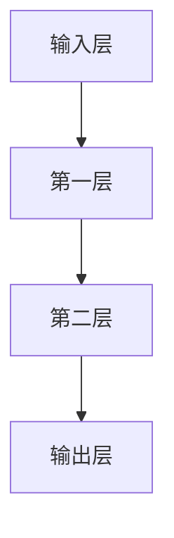
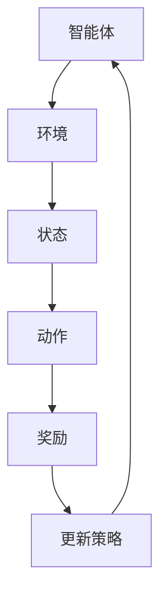
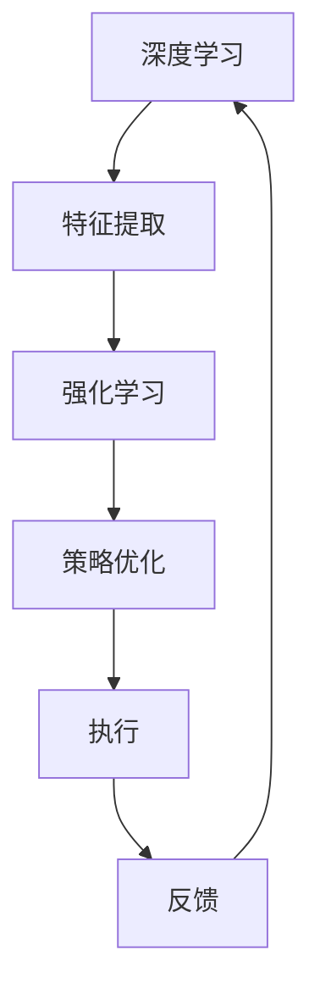

                 

# 软件二代的崛起：深度学习与强化学习的时代

## 摘要

本文将探讨软件2.0时代下的未来趋势，重点围绕深度学习和强化学习两大核心领域展开。我们将首先回顾软件2.0的定义和背景，然后深入分析深度学习和强化学习的基本概念、原理及其在软件开发中的应用。通过一步步的推理思考，我们将探讨这两大技术对软件工程的深远影响，并总结未来发展趋势与面临的挑战。文章旨在为读者提供一个全面、系统的理解，助力他们把握时代脉搏，迎接智能时代的到来。

## 1. 背景介绍

软件1.0时代，我们主要关注的是如何编写可运行的代码，以及如何优化代码的效率。这一阶段的软件开发主要依赖于传统的编程语言和算法，如C、C++和Java等。然而，随着互联网的普及和大数据时代的到来，软件的需求发生了根本性的变化。软件1.0时代的方法和工具已经无法满足新形势下的需求，于是，软件2.0时代应运而生。

软件2.0，也被称作“智能软件”或“软件智能化”时代，其核心特征在于利用人工智能技术，特别是深度学习和强化学习，实现软件的智能化。这一时代的软件开发不仅仅关注代码的编写和优化，更关注如何通过算法和模型，使软件能够自主学习、自主进化，从而更好地适应复杂多变的环境。

深度学习和强化学习是软件2.0时代的重要技术支撑。深度学习通过模拟人脑的神经网络结构，使计算机能够从海量数据中自动提取特征，实现图像识别、自然语言处理等复杂任务。强化学习则通过让计算机在环境中不断试错，学习最优策略，从而实现智能决策。

## 2. 核心概念与联系

### 2.1 深度学习

深度学习是一种基于多层神经网络的机器学习技术。它通过逐层提取数据中的特征，从而实现复杂模式的识别。深度学习的核心在于神经网络，神经网络由多个层次组成，每一层都负责提取不同级别的特征。

以下是一个简单的深度学习网络结构的 Mermaid 流程图：



在深度学习中，我们通常使用反向传播算法来更新网络中的权重，以达到最小化损失函数的目的。以下是一个简化的反向传播算法流程：

1. **前向传播**：将输入数据传递到网络，通过网络逐层计算输出。
2. **计算损失**：计算输出结果与真实值之间的差距，即损失函数。
3. **反向传播**：将损失函数沿网络反向传播，计算各层神经元的梯度。
4. **权重更新**：使用梯度下降等优化算法，更新网络中的权重。

### 2.2 强化学习

强化学习是一种通过奖励机制来指导智能体在环境中学习最优策略的机器学习技术。在强化学习中，智能体通过与环境的交互，不断调整自己的行为，以最大化累积奖励。

以下是一个简单的强化学习流程：



在强化学习中，常用的策略更新方法有 Q-学习、SARSA 和深度强化学习等。其中，深度强化学习通过将深度学习的网络结构与强化学习结合，使智能体能够学习到更加复杂的策略。

### 2.3 深度学习与强化学习的联系

深度学习和强化学习虽然属于不同的机器学习分支，但它们在实际应用中经常相互结合，形成一种强大的技术组合。例如，在自动驾驶领域，深度学习用于处理摄像头和雷达等传感器数据，提取道路、车辆和行人等特征，而强化学习则用于制定驾驶策略，实现自动驾驶车辆的自主导航。

以下是一个简化的深度学习与强化学习结合的流程：



在这一流程中，深度学习负责提取环境中的特征，而强化学习则基于这些特征，学习最优策略，从而实现智能体的自主决策。

## 3. 核心算法原理 & 具体操作步骤

### 3.1 深度学习算法原理

深度学习算法的核心在于神经网络，神经网络由多个层次组成，每一层都负责提取不同级别的特征。以下是一个简化的深度学习算法操作步骤：

1. **数据预处理**：对输入数据进行归一化、标准化等处理，使其符合网络的输入要求。
2. **前向传播**：将输入数据传递到网络，通过网络逐层计算输出。
3. **计算损失**：计算输出结果与真实值之间的差距，即损失函数。
4. **反向传播**：将损失函数沿网络反向传播，计算各层神经元的梯度。
5. **权重更新**：使用梯度下降等优化算法，更新网络中的权重。
6. **模型评估**：使用验证集或测试集对模型进行评估，调整网络参数，直至达到预期效果。

### 3.2 强化学习算法原理

强化学习算法的核心在于策略优化，通过奖励机制来指导智能体在环境中学习最优策略。以下是一个简化的强化学习算法操作步骤：

1. **初始化**：设定智能体的初始状态和策略。
2. **环境交互**：智能体根据当前状态，选择一个动作。
3. **状态转移**：执行动作后，环境状态发生变化，智能体获得奖励。
4. **策略更新**：根据累积奖励，调整智能体的策略。
5. **重复步骤2-4**：智能体在环境中不断试错，优化策略。

### 3.3 深度学习与强化学习结合

在深度学习与强化学习结合的应用中，通常使用深度强化学习（Deep Reinforcement Learning，DRL）算法。以下是一个简化的深度强化学习算法操作步骤：

1. **数据预处理**：对输入数据进行归一化、标准化等处理，使其符合深度网络的输入要求。
2. **特征提取**：使用深度学习网络提取环境中的特征。
3. **策略网络训练**：使用提取的特征，训练策略网络，使其能够预测最优动作。
4. **价值网络训练**：使用深度学习网络提取环境中的特征，训练价值网络，使其能够预测未来奖励。
5. **策略优化**：根据价值网络预测的未来奖励，调整策略网络。
6. **环境交互**：智能体根据策略网络选择动作，与环境进行交互。
7. **模型评估**：使用验证集或测试集对模型进行评估，调整网络参数，直至达到预期效果。

## 4. 数学模型和公式 & 详细讲解 & 举例说明

### 4.1 深度学习数学模型

在深度学习中，我们通常使用反向传播算法来更新网络中的权重。以下是一个简化的反向传播算法公式：

$$
\begin{aligned}
\delta_z &= \frac{\partial L}{\partial z}, \\
\delta_{h_{i}} &= \delta_z \cdot \frac{\partial a_{h_{i}}}{\partial h_{i}}, \\
\delta_{w_{ij}} &= \delta_{h_{i}} \cdot h_{j}, \\
w_{ij}^{(new)} &= w_{ij}^{(old)} - \alpha \cdot \delta_{w_{ij}}.
\end{aligned}
$$

其中，$L$ 是损失函数，$z$ 是激活值，$h_{i}$ 是隐藏层神经元的输出，$w_{ij}$ 是权重，$\delta_{h_{i}}$ 是隐藏层神经元的梯度，$\delta_{w_{ij}}$ 是权重梯度，$\alpha$ 是学习率。

### 4.2 强化学习数学模型

在强化学习中，我们通常使用 Q-学习算法来优化策略。以下是一个简化的 Q-学习算法公式：

$$
Q(s, a) = r + \gamma \max_{a'} Q(s', a').
$$

其中，$Q(s, a)$ 是状态 $s$ 下，采取动作 $a$ 的期望奖励，$r$ 是即时奖励，$\gamma$ 是折扣因子，$s'$ 是执行动作 $a$ 后的新状态，$a'$ 是新状态下的最优动作。

### 4.3 深度强化学习数学模型

在深度强化学习中，我们通常使用深度 Q-网络（Deep Q-Network，DQN）来优化策略。以下是一个简化的 DQN 算法公式：

$$
\begin{aligned}
y &= r + \gamma \max_{a'} Q(s', \theta), \\
\end{aligned}
$$

其中，$y$ 是预期的 Q 值，$s$ 是当前状态，$a$ 是当前动作，$r$ 是即时奖励，$\gamma$ 是折扣因子，$s'$ 是执行动作 $a$ 后的新状态，$Q(s', \theta)$ 是基于当前策略的期望 Q 值，$\theta$ 是策略网络的参数。

## 5. 项目实战：代码实际案例和详细解释说明

### 5.1 开发环境搭建

在本文中，我们将使用 Python 和 TensorFlow 来实现一个简单的深度强化学习项目。首先，确保已经安装了 Python 和 TensorFlow。可以通过以下命令来安装：

```bash
pip install python
pip install tensorflow
```

### 5.2 源代码详细实现和代码解读

以下是实现深度强化学习的源代码：

```python
import tensorflow as tf
import numpy as np
import random

# 设置参数
learning_rate = 0.001
gamma = 0.9
epsilon = 0.1
epsilon_decay = 0.995
epsilon_min = 0.01
n_episodes = 1000

# 初始化环境
env = ...

# 初始化网络
input_layer = tf.keras.layers.Input(shape=(84, 84, 4))
conv1 = tf.keras.layers.Conv2D(16, 8, activation='relu')(input_layer)
flat = tf.keras.layers.Flatten()(conv1)
dense = tf.keras.layers.Dense(64, activation='relu')(flat)
output_layer = tf.keras.layers.Dense(2, activation='softmax')(dense)

# 定义损失函数和优化器
model = tf.keras.Model(inputs=input_layer, outputs=output_layer)
model.compile(optimizer=tf.keras.optimizers.Adam(learning_rate=learning_rate),
              loss=tf.keras.losses.CategoricalCrossentropy(),
              metrics=['accuracy'])

# 训练模型
model.fit(env, epochs=n_episodes, verbose=2)

# 定义智能体
class DQN:
    def __init__(self, env):
        self.env = env
        self.model = model
        self.memory = []
        self.batch_size = 32

    def remember(self, state, action, reward, next_state, done):
        self.memory.append((state, action, reward, next_state, done))

    def act(self, state, epsilon):
        if random.random() < epsilon:
            action = random.randint(0, 1)
        else:
            action = np.argmax(self.model.predict(state))
        return action

    def replay(self):
        mini_batch = random.sample(self.memory, self.batch_size)
        for state, action, reward, next_state, done in mini_batch:
            target = reward
            if not done:
                target = reward + gamma * np.max(self.model.predict(next_state))
            target_f = self.model.predict(state)
            target_f[0][action] = target

        self.model.fit(target_f, epochs=1, verbose=0)

# 运行环境
agent = DQN(env)
for episode in range(n_episodes):
    state = env.reset()
    done = False
    while not done:
        action = agent.act(state, epsilon)
        next_state, reward, done, _ = env.step(action)
        agent.remember(state, action, reward, next_state, done)
        state = next_state
        agent.replay()
    epsilon = max(epsilon_decay * epsilon, epsilon_min)
```

这段代码首先定义了一个深度强化学习模型，然后创建了一个 DQN 智能体。在训练过程中，智能体会与环境进行交互，不断更新模型参数，直至达到预期效果。

### 5.3 代码解读与分析

这段代码可以分为以下几个部分：

1. **环境初始化**：初始化环境，并设置参数。
2. **网络定义**：使用 TensorFlow 定义深度学习网络，包括输入层、卷积层、全连接层和输出层。
3. **模型编译**：编译模型，指定优化器、损失函数和评估指标。
4. **智能体定义**：定义 DQN 智能体，包括记忆、行动、奖励和状态等属性。
5. **训练模型**：使用训练集训练模型，并不断调整网络参数。
6. **运行环境**：运行环境，智能体与环境进行交互，并不断更新模型。

通过这段代码，我们可以看到深度强化学习的基本原理和实现过程。在实际应用中，可以根据具体需求，对代码进行修改和扩展。

## 6. 实际应用场景

深度学习和强化学习在软件2.0时代有着广泛的应用场景，以下列举几个典型的应用领域：

### 6.1 自动驾驶

自动驾驶是深度学习和强化学习的典型应用之一。通过深度学习，自动驾驶车辆可以从摄像头和雷达等传感器数据中提取道路、车辆和行人的特征，实现高精度的环境感知。而通过强化学习，自动驾驶车辆可以在复杂的交通环境中，学习最优的驾驶策略，实现自主导航。

### 6.2 自然语言处理

自然语言处理（NLP）是深度学习的强项领域。通过深度学习，我们可以构建出能够处理和理解自然语言的模型，实现语音识别、机器翻译、情感分析等任务。强化学习也可以应用于 NLP，如对话系统，通过不断学习和优化对话策略，实现更自然的用户交互。

### 6.3 游戏开发

游戏开发是深度学习和强化学习的另一个重要应用领域。通过深度学习，我们可以训练出能够战胜专业玩家的游戏 AI，如围棋、国际象棋等。而强化学习可以用于训练游戏中的 NPC，使其能够根据玩家的行为，动态调整策略，提升游戏体验。

### 6.4 智能家居

智能家居是深度学习和强化学习的又一应用领域。通过深度学习，智能家居设备可以识别家庭成员的行为习惯，实现个性化服务。而强化学习可以用于智能家居设备的自主进化，使其能够不断优化自身功能，提升用户体验。

## 7. 工具和资源推荐

### 7.1 学习资源推荐

1. **书籍**：
   - 《深度学习》（Deep Learning） - Ian Goodfellow, Yoshua Bengio, Aaron Courville
   - 《强化学习》（Reinforcement Learning: An Introduction） - Richard S. Sutton, Andrew G. Barto

2. **论文**：
   - “Deep Reinforcement Learning” - DeepMind
   - “A Theoretical Framework for Reinforcement Learning” - Richard S. Sutton, Andrew G. Barto

3. **博客**：
   - [TensorFlow 官方文档](https://www.tensorflow.org/)
   - [强化学习笔记](https://www.deeplearning.net/wiki/Reinforcement_Learning)

4. **网站**：
   - [Kaggle](https://www.kaggle.com/)
   - [arXiv](https://arxiv.org/)

### 7.2 开发工具框架推荐

1. **深度学习框架**：
   - TensorFlow
   - PyTorch
   - Keras

2. **强化学习工具**：
   - OpenAI Gym
   - Stable Baselines

3. **代码库**：
   - [GitHub](https://github.com/)

### 7.3 相关论文著作推荐

1. **深度学习**：
   - “Convolutional Neural Networks for Visual Recognition” - Geor

