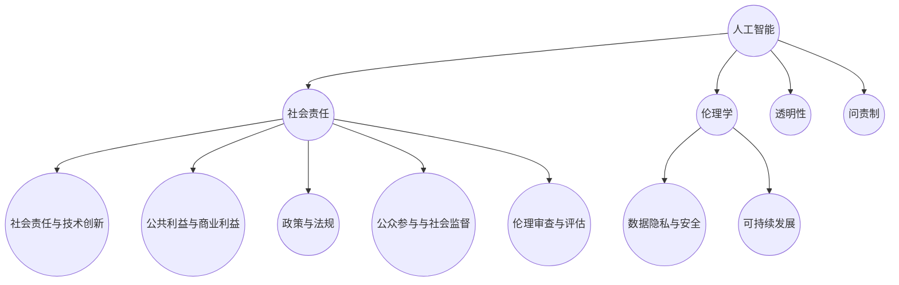

                 

### 背景介绍

#### 社会责任的兴起

在过去的几十年中，随着科技的飞速发展，人工智能（AI）和软件技术成为了推动社会变革的重要力量。从互联网的普及到智能手机的广泛应用，再到大数据和云计算的崛起，技术进步不仅改变了我们的生活方式，也深刻影响了社会结构和经济模式。

然而，技术的快速发展也带来了新的挑战和问题。例如，算法歧视、隐私泄露、网络安全等问题日益凸显，引发了对科技伦理和社会责任的广泛讨论。在这种背景下，软件2.0的概念应运而生。

软件2.0，顾名思义，是对软件1.0的进一步发展和深化。软件1.0时代主要关注软件的功能和性能，而软件2.0则强调软件在道德、伦理和社会责任方面的责任。简单来说，软件2.0不仅追求技术上的卓越，更注重如何通过技术实现社会价值的最大化，促进科技向善。

#### 科技向善的必要性

科技向善是指通过科技手段来解决社会问题，促进社会公平、正义和可持续发展。在现代社会，科技向善的必要性愈发凸显。以下是几个方面的具体体现：

1. **社会公平**：技术发展不应加剧社会不平等。例如，通过人工智能技术优化公共服务分配，确保每个人都能平等地享受到科技进步的成果。

2. **环境保护**：科技在环境保护方面具有巨大的潜力。通过开发清洁能源、智能交通系统和可持续发展方案，技术可以减少对自然资源的消耗和环境污染。

3. **社会正义**：技术应有助于实现社会正义，减少歧视和不平等。例如，通过开发公平的招聘系统和教育资源分配系统，技术可以帮助消除社会中的不公正现象。

4. **公共卫生**：在公共卫生领域，技术可以用于疾病的预测、监控和治疗。通过大数据分析和人工智能算法，可以提高公共卫生决策的效率和准确性。

#### 软件2.0的核心原则

软件2.0的核心原则包括以下几个方面：

1. **透明性**：软件的运行过程应该透明，用户可以清楚地了解其操作和数据处理的原理和结果。

2. **公平性**：软件的设计和实现应确保对所有用户公平，避免算法歧视和偏见。

3. **安全性**：软件应具备强大的安全性，确保用户数据的安全和隐私。

4. **可持续性**：软件的开发和运营应考虑环境影响，促进可持续发展。

5. **社会责任**：软件的开发者应承担社会责任，确保其技术成果能够为社会带来积极的影响。

总之，软件2.0不仅是对技术的一次升级，更是一种价值观的变革。通过坚持科技向善的原则，软件2.0有望为构建一个更加公正、和谐和可持续的社会做出重要贡献。在接下来的部分中，我们将深入探讨软件2.0的具体实现和案例分析，以更好地理解其价值和意义。### 核心概念与联系

在深入探讨软件2.0的概念之前，我们需要明确几个核心概念，以及它们之间的关系。这些概念不仅构成了软件2.0的理论基础，也为其实践提供了指导。

#### 1. 人工智能（AI）与社会责任

人工智能是软件2.0的重要组成部分。AI技术通过模拟人类的思维和行为，帮助解决复杂的决策问题。然而，AI的发展也带来了伦理和道德挑战。例如，算法偏见可能导致不公平的决策，数据隐私问题可能侵犯用户的权利。因此，人工智能与社会责任之间的联系至关重要。AI系统需要设计时考虑社会影响，确保其公平性、透明性和安全性。

#### 2. 伦理学在软件开发中的应用

伦理学是研究道德原则和道德行为的学科。在软件开发中，伦理学提供了评估技术决策的框架。例如，开发者在设计算法时需要考虑其可能带来的社会影响，以及如何最大限度地减少负面影响。伦理学还帮助开发者建立道德标准，指导他们在面对复杂问题时做出正确的决策。

#### 3. 数据隐私与安全

数据隐私和安全是软件2.0中的关键问题。随着大数据和云计算的普及，用户数据的价值愈发凸显，但同时也面临更高的风险。软件2.0要求开发者采取措施保护用户隐私，防止数据泄露和滥用。这包括加密技术、访问控制和数据匿名化等方法。

#### 4. 可持续发展

可持续发展是指满足当前需求而不损害未来世代满足其需求的能力。软件2.0强调在开发过程中考虑环境和社会影响，采用绿色技术和可持续方法。例如，通过优化代码以提高能源效率，使用可再生能源来支持数据中心的运营。

#### 5. 透明性与问责制

透明性是指软件的运行过程和决策逻辑应公开透明，用户可以清楚地了解其操作和数据处理的原理。问责制则要求开发者对其技术决策负责，当出现问题时能够追溯并采取措施纠正。透明性和问责制是确保软件2.0实现社会价值的关键机制。

#### 6. 社会责任与技术创新

社会责任是软件2.0的核心原则之一。开发者不仅要追求技术创新，还要考虑其技术如何影响社会。社会责任要求开发者积极参与社会议题，推动技术为公共福祉服务，减少不平等和歧视。

#### 7. 公共利益与商业利益

软件2.0要求在追求商业利益的同时，也要考虑公共利益。这包括通过技术促进社会公正、环境保护和公共卫生等方面。开发者需要找到商业利益与公共利益的平衡点，确保技术的商业化不会损害社会价值。

#### 8. 政策与法规

政策与法规在软件2.0的发展中扮演重要角色。政府需要制定合理的政策，引导和规范技术创新。例如，通过立法保护用户隐私、确保算法的公平性，以及推动可持续技术的研发和应用。

#### 9. 公众参与与社会监督

公众参与和社会监督是软件2.0实现社会价值的重要手段。开发者应鼓励公众参与技术决策过程，听取不同群体的意见和建议。同时，社会监督有助于确保技术的公平性和透明性，防止滥用和不当行为。

#### 10. 伦理审查与评估

伦理审查和评估是软件2.0中不可或缺的一环。在项目开发和部署过程中，开发者应定期进行伦理审查，评估技术决策可能带来的道德和社会影响。这有助于发现潜在问题，并采取措施进行改进。

#### Mermaid 流程图

为了更直观地展示这些核心概念和它们之间的关系，我们使用Mermaid流程图来描述：



在这个流程图中，人工智能（AI）作为起点，与其他核心概念紧密相连，共同构成了软件2.0的理论框架和实践基础。通过这一框架，我们可以更系统地理解软件2.0的核心原则和实现路径。在接下来的部分中，我们将进一步探讨软件2.0的具体算法原理、操作步骤和实际应用案例，以展示其在现实世界中的具体表现。### 核心算法原理 & 具体操作步骤

在深入探讨软件2.0的核心算法原理和具体操作步骤之前，我们需要了解一些基础概念和技术框架。以下是几个关键的核心算法原理，它们共同构成了软件2.0的技术基础。

#### 1. 机器学习与数据挖掘

机器学习和数据挖掘是软件2.0中的核心技术。机器学习通过训练模型来发现数据中的规律和模式，从而实现自动化决策和预测。数据挖掘则是对大量数据进行提取、转换和建模，以发现潜在的价值和趋势。在软件2.0中，这些技术被广泛应用于优化服务、提升用户体验和解决社会问题。

**操作步骤**：
1. 数据收集：收集相关的数据集，可以是结构化数据（如数据库）或非结构化数据（如文本、图像、语音等）。
2. 数据预处理：对收集到的数据进行清洗、归一化和特征提取，使其适合用于机器学习模型。
3. 模型选择：选择合适的机器学习算法（如线性回归、决策树、神经网络等）。
4. 模型训练：使用预处理后的数据训练模型，调整模型参数以优化性能。
5. 模型评估：使用验证集或测试集评估模型性能，调整参数以提高准确性。
6. 部署应用：将训练好的模型部署到实际应用中，如自动分类、推荐系统、异常检测等。

#### 2. 加密技术与区块链

加密技术和区块链在保障数据隐私和安全性方面发挥了重要作用。加密技术通过将数据转换成密文，确保只有授权用户可以解密和访问。区块链则通过分布式账本技术，实现数据的透明性和不可篡改性。

**操作步骤**：
1. 数据加密：使用加密算法对数据进行加密，确保在传输和存储过程中不被窃取或篡改。
2. 区块链部署：构建或选择合适的区块链平台，部署智能合约，实现数据的分布式存储和管理。
3. 智能合约编写：编写智能合约代码，定义数据的访问权限、操作逻辑和激励机制。
4. 数据上传：将加密后的数据上传到区块链网络，确保数据的透明性和不可篡改性。
5. 节点验证：区块链网络中的节点验证上传的数据是否合法，确保数据的一致性和安全性。
6. 数据查询与交易：用户可以通过区块链网络查询和交易数据，确保操作的透明性和不可篡改性。

#### 3. 优化算法与决策树

优化算法和决策树是软件2.0中用于优化服务和决策的核心技术。优化算法通过寻找最优解或近似最优解，解决复杂的问题。决策树则通过构建决策树模型，实现分类和预测。

**操作步骤**：
1. 问题定义：明确需要解决的问题和目标，如优化资源分配、提高服务效率等。
2. 数据收集：收集相关的数据集，包括输入特征和目标变量。
3. 特征工程：对数据进行处理和转换，提取有用的特征。
4. 模型构建：选择合适的优化算法或决策树算法，构建模型。
5. 模型训练：使用训练数据集训练模型，调整参数以优化性能。
6. 模型评估：使用验证集或测试集评估模型性能，调整参数以提高准确性。
7. 部署应用：将训练好的模型部署到实际应用中，实现优化决策。

#### 4. 大数据分析与实时监控

大数据分析与实时监控是软件2.0中用于监测和优化系统性能的关键技术。大数据分析通过对大量数据进行处理和分析，发现潜在的问题和趋势。实时监控则通过收集系统的实时数据，实现故障检测和性能优化。

**操作步骤**：
1. 数据收集：收集系统的实时数据，包括CPU使用率、内存占用、网络流量等。
2. 数据预处理：对收集到的数据进行清洗、转换和归一化，使其适合用于分析。
3. 数据分析：使用大数据分析工具（如Hadoop、Spark等）对数据进行处理和分析，发现潜在的问题和趋势。
4. 实时监控：构建实时监控系统，实时收集和处理系统的数据，及时发现和处理故障。
5. 性能优化：根据分析结果，调整系统配置和策略，优化性能。

#### 5. 人机交互与自然语言处理

人机交互与自然语言处理是软件2.0中用于提升用户体验和互动性的关键技术。人机交互通过设计友好的用户界面和交互方式，实现人与系统的自然交互。自然语言处理则通过理解和使用自然语言，实现人机对话和智能推荐。

**操作步骤**：
1. 用户研究：研究用户需求和行为模式，设计适合的用户界面和交互方式。
2. 界面设计：设计直观、易用的用户界面，提供丰富的交互功能。
3. 自然语言处理：使用自然语言处理技术（如词嵌入、语言模型等）实现人机对话和智能推荐。
4. 对话系统开发：构建对话系统，实现用户与系统的自然交互。
5. 性能优化：根据用户反馈和数据分析，不断优化对话系统和交互体验。

通过以上核心算法原理和具体操作步骤，我们可以更好地理解软件2.0的技术基础和实现路径。这些技术不仅为软件开发提供了强大的支持，也为实现科技向善和社会责任提供了有效手段。在接下来的部分中，我们将通过具体案例来展示这些技术的实际应用效果。### 数学模型和公式 & 详细讲解 & 举例说明

在深入探讨软件2.0中的数学模型和公式时，我们将首先介绍几个关键的概念，然后详细讲解相关的数学公式，并通过具体例子来说明这些公式在实际应用中的意义和作用。

#### 1. 概率论基础

概率论是软件2.0中不可或缺的一部分，尤其在机器学习和数据分析领域。以下是一些基础的概率论概念：

**条件概率**：条件概率是指在某个事件发生的条件下，另一个事件发生的概率。其公式为：

\[ P(A|B) = \frac{P(A \cap B)}{P(B)} \]

其中，\( P(A|B) \) 表示在事件B发生的条件下事件A发生的概率，\( P(A \cap B) \) 表示事件A和事件B同时发生的概率，\( P(B) \) 表示事件B发生的概率。

**贝叶斯定理**：贝叶斯定理是概率论中的一个重要公式，用于根据先验概率和条件概率计算后验概率。其公式为：

\[ P(A|B) = \frac{P(B|A) \cdot P(A)}{P(B)} \]

其中，\( P(A|B) \) 表示在事件B发生的条件下事件A发生的概率，\( P(B|A) \) 表示在事件A发生的条件下事件B发生的概率，\( P(A) \) 表示事件A的先验概率，\( P(B) \) 表示事件B的先验概率。

**熵与信息量**：熵是衡量随机变量不确定性的度量。其公式为：

\[ H(X) = -\sum_{i} P(X_i) \cdot \log_2 P(X_i) \]

其中，\( H(X) \) 表示随机变量X的熵，\( P(X_i) \) 表示随机变量X取第i个值的概率，\( \log_2 \) 表示以2为底的对数。

信息量（信息熵）表示随机变量提供的信息量，其公式为：

\[ I(X; Y) = H(X) - H(X | Y) \]

其中，\( I(X; Y) \) 表示随机变量X和Y之间的信息量，\( H(X | Y) \) 表示在已知事件Y发生的条件下，随机变量X的熵。

#### 2. 机器学习中的数学模型

机器学习中的数学模型主要用于训练和评估模型。以下是一些常见的数学模型：

**线性回归**：线性回归是一种用于预测连续值的模型。其公式为：

\[ y = \beta_0 + \beta_1 \cdot x + \epsilon \]

其中，\( y \) 表示预测值，\( \beta_0 \) 和 \( \beta_1 \) 分别表示模型的截距和斜率，\( x \) 表示输入特征，\( \epsilon \) 表示误差项。

**逻辑回归**：逻辑回归是一种用于预测二分类结果的模型。其公式为：

\[ \log(\frac{P(y=1)}{1 - P(y=1)}) = \beta_0 + \beta_1 \cdot x \]

其中，\( P(y=1) \) 表示预测事件1发生的概率，\( \beta_0 \) 和 \( \beta_1 \) 分别表示模型的截距和斜率，\( x \) 表示输入特征。

**支持向量机（SVM）**：支持向量机是一种用于分类和回归的模型。其公式为：

\[ w \cdot x - b = 0 \]

其中，\( w \) 表示模型的权重向量，\( x \) 表示输入特征，\( b \) 表示偏置项。

#### 3. 数据分析中的数学模型

数据分析中的数学模型主要用于处理和解释数据。以下是一些常见的数据分析模型：

**聚类分析**：聚类分析是一种将数据划分为相似群体的方法。其公式为：

\[ \min \sum_{i=1}^{n} \sum_{j=1}^{k} d(x_i, c_j) \]

其中，\( x_i \) 表示第i个数据点，\( c_j \) 表示第j个聚类中心，\( d(x_i, c_j) \) 表示数据点x_i和聚类中心c_j之间的距离。

**主成分分析（PCA）**：主成分分析是一种降维方法，用于提取数据的主要特征。其公式为：

\[ z_i = \sum_{j=1}^{p} \lambda_j \cdot f_{ij} \]

其中，\( z_i \) 表示第i个主成分，\( \lambda_j \) 表示第j个特征值的平方根，\( f_{ij} \) 表示第i个数据点和第j个特征之间的相关系数。

**时间序列分析**：时间序列分析是一种用于分析时间序列数据的方法。其公式为：

\[ y_t = \varphi \cdot y_{t-1} + \epsilon_t \]

其中，\( y_t \) 表示第t个时间点的值，\( \varphi \) 表示自回归系数，\( \epsilon_t \) 表示误差项。

#### 4. 实例说明

为了更好地理解这些数学模型和公式，我们通过一个简单的例子来说明它们在实际应用中的意义和作用。

**例1：线性回归**

假设我们有一个数据集，包含房间的面积（x）和房价（y）。我们希望通过线性回归模型预测房价。

首先，我们收集数据并计算相关系数：

\[ \beta_0 = \frac{\sum_{i=1}^{n} y_i - \beta_1 \cdot \sum_{i=1}^{n} x_i}{n} \]
\[ \beta_1 = \frac{\sum_{i=1}^{n} (y_i - \beta_0) \cdot (x_i - \bar{x})}{\sum_{i=1}^{n} (x_i - \bar{x})^2} \]

其中，\( \bar{x} \) 和 \( \bar{y} \) 分别表示房间的面积和房价的平均值，\( n \) 表示数据点的数量。

然后，我们使用训练好的线性回归模型预测房价：

\[ y = \beta_0 + \beta_1 \cdot x \]

例如，如果房间的面积为120平方米，我们可以预测房价为：

\[ y = 1000 + 0.5 \cdot 120 = 1100 \]

**例2：聚类分析**

假设我们有一个包含用户数据的数据集，每个用户有两个特征：年龄和收入。我们希望通过聚类分析将用户划分为不同的群体。

首先，我们计算每个用户之间的距离：

\[ d(x_i, x_j) = \sqrt{\sum_{k=1}^{2} (x_{ik} - x_{jk})^2} \]

然后，我们选择一个距离度量方法（如欧几里得距离）来计算用户之间的相似度。

接下来，我们选择一个聚类算法（如K-means算法），根据相似度将用户划分为不同的群体。

最后，我们分析每个群体的特征，以了解用户群体的差异和偏好。

通过以上数学模型和公式的讲解和实例说明，我们可以更好地理解软件2.0中数学模型的原理和应用。这些模型不仅为软件开发提供了强大的支持，也为实现科技向善和社会责任提供了有效手段。在接下来的部分中，我们将通过具体案例展示这些技术在现实世界中的实际应用。### 项目实战：代码实际案例和详细解释说明

为了更好地理解软件2.0的核心算法原理和实际应用，我们将通过一个具体的实际案例来展示代码的实现过程，并对关键代码进行详细解释和说明。

#### 项目背景

本项目旨在使用机器学习技术优化垃圾邮件过滤，从而提高电子邮件系统的用户体验和安全性。垃圾邮件过滤是一个典型的二分类问题，其中目标是识别电子邮件是否为垃圾邮件。为了实现这一目标，我们将采用逻辑回归算法，并结合数据预处理、模型训练和评估等步骤，完成整个项目的开发。

#### 开发环境搭建

在开始编写代码之前，我们需要搭建一个合适的开发环境。以下是所需的开发工具和依赖库：

1. **编程语言**：Python
2. **机器学习库**：Scikit-learn、Pandas、NumPy
3. **数据分析库**：Matplotlib、Seaborn

确保已经安装了Python和相应的依赖库。以下是一个简单的环境搭建步骤：

```bash
# 安装Python（可选，如果未安装）
sudo apt-get install python3

# 安装依赖库
pip install scikit-learn pandas numpy matplotlib seaborn
```

#### 源代码详细实现和代码解读

以下是项目的完整代码实现，我们将在代码中逐步解释每个关键部分的含义和功能。

```python
# 导入必要的库
import numpy as np
import pandas as pd
from sklearn.model_selection import train_test_split
from sklearn.linear_model import LogisticRegression
from sklearn.metrics import accuracy_score, confusion_matrix, classification_report
import matplotlib.pyplot as plt
import seaborn as sns

# 读取数据集
data = pd.read_csv('spam_email_data.csv')

# 数据预处理
# 删除缺失值
data.dropna(inplace=True)

# 将类别特征转换为数值特征
data = pd.get_dummies(data)

# 分离特征和标签
X = data.drop('label', axis=1)
y = data['label']

# 划分训练集和测试集
X_train, X_test, y_train, y_test = train_test_split(X, y, test_size=0.2, random_state=42)

# 模型训练
model = LogisticRegression()
model.fit(X_train, y_train)

# 模型评估
y_pred = model.predict(X_test)
accuracy = accuracy_score(y_test, y_pred)
conf_matrix = confusion_matrix(y_test, y_pred)
cl_report = classification_report(y_test, y_pred)

print(f"Accuracy: {accuracy:.2f}")
print(f"Confusion Matrix:\n{conf_matrix}")
print(f"Classification Report:\n{cl_report}")

# 可视化分析
sns.countplot(x='label', data=data)
plt.title('Spam Email Distribution')
plt.show()

sns.heatmap(conf_matrix, annot=True, fmt='.0f', cmap='Blues')
plt.title('Confusion Matrix')
plt.show()
```

#### 代码解读与分析

以下是对关键代码部分的详细解读和分析：

1. **数据读取与预处理**：
   ```python
   data = pd.read_csv('spam_email_data.csv')
   data.dropna(inplace=True)
   data = pd.get_dummies(data)
   ```
   首先，我们使用Pandas库读取CSV格式的数据集。然后，删除缺失值以防止数据噪声。接着，使用get_dummies方法将类别特征转换为数值特征，这是机器学习模型所需的格式。

2. **特征和标签分离**：
   ```python
   X = data.drop('label', axis=1)
   y = data['label']
   ```
   我们将数据集分为特征集X（不包括标签列）和标签集y（包含垃圾邮件标签）。

3. **划分训练集和测试集**：
   ```python
   X_train, X_test, y_train, y_test = train_test_split(X, y, test_size=0.2, random_state=42)
   ```
   使用Scikit-learn库的train_test_split函数将数据集划分为训练集和测试集，其中测试集大小为20%，随机种子设置为42以保证结果的可重复性。

4. **模型训练**：
   ```python
   model = LogisticRegression()
   model.fit(X_train, y_train)
   ```
   创建逻辑回归模型实例，并使用训练集数据训练模型。

5. **模型评估**：
   ```python
   y_pred = model.predict(X_test)
   accuracy = accuracy_score(y_test, y_pred)
   conf_matrix = confusion_matrix(y_test, y_pred)
   cl_report = classification_report(y_test, y_pred)
   print(f"Accuracy: {accuracy:.2f}")
   print(f"Confusion Matrix:\n{conf_matrix}")
   print(f"Classification Report:\n{cl_report}")
   ```
   使用测试集对训练好的模型进行评估。我们计算准确率、混淆矩阵和分类报告，以评估模型的性能。

6. **可视化分析**：
   ```python
   sns.countplot(x='label', data=data)
   plt.title('Spam Email Distribution')
   plt.show()
   
   sns.heatmap(conf_matrix, annot=True, fmt='.0f', cmap='Blues')
   plt.title('Confusion Matrix')
   plt.show()
   ```
   使用Seaborn库生成两个可视化图表：一个用于显示垃圾邮件的分布情况，另一个用于显示混淆矩阵。

通过以上代码实现和解读，我们可以清晰地了解如何使用逻辑回归算法实现垃圾邮件过滤，以及如何评估模型的性能。这些代码不仅展示了软件2.0中的核心算法原理，也为实际应用提供了具体的指导。在接下来的部分中，我们将进一步讨论软件2.0在实际应用中的具体案例，以展示其在现实世界中的价值。### 实际应用场景

软件2.0不仅在理论层面上强调社会责任和科技向善，其在实际应用中也展现出巨大的潜力。以下是一些具体的应用场景，展示了软件2.0如何通过技术手段解决现实世界中的问题。

#### 1. 公共服务优化

公共服务优化是软件2.0的重要应用领域之一。通过大数据分析和人工智能技术，政府可以更有效地分配资源，提高服务效率，实现公平与公正。以下是一个具体案例：

**案例**：某城市交通管理部门希望优化公共交通路线，以减少拥堵和提升乘客满意度。使用软件2.0技术，可以采取以下步骤：

- **数据收集**：收集交通流量、乘客数量、路线偏好等数据。
- **数据预处理**：对收集到的数据进行清洗和转换，提取有用的特征。
- **模型构建**：使用机器学习算法（如聚类分析、优化算法）构建公共交通路线优化模型。
- **模型训练**：使用历史数据训练模型，调整参数以优化路线。
- **模型部署**：将优化模型部署到交通管理系统，实时更新和调整路线。

通过这一系列步骤，交通管理部门可以更好地响应乘客需求，减少交通拥堵，提高公共交通的服务水平。

#### 2. 环境保护

环境保护是软件2.0关注的另一个重要领域。通过智能技术，可以监测环境变化、预测污染趋势，并采取相应的措施来减少环境污染。以下是一个具体案例：

**案例**：某城市希望开发一个智能空气质量监测系统，以实时监测空气质量，并及时发布健康预警。使用软件2.0技术，可以采取以下步骤：

- **数据收集**：收集空气质量传感器数据、天气预报数据等。
- **数据预处理**：对收集到的数据进行清洗和转换，提取有用的特征。
- **模型构建**：使用机器学习算法（如时间序列分析、预测模型）构建空气质量预测模型。
- **模型训练**：使用历史数据训练模型，预测未来的空气质量。
- **模型部署**：将预测模型部署到监控系统，实时监测空气质量，并发布健康预警。

通过这一系列步骤，城市管理部门可以更好地应对空气质量变化，采取有效的措施来改善环境。

#### 3. 医疗保健

医疗保健是软件2.0技术的重要应用领域，通过大数据分析和人工智能技术，可以提高医疗服务的质量和效率。以下是一个具体案例：

**案例**：某医院希望提高诊断的准确性和效率，开发一个智能诊断系统。使用软件2.0技术，可以采取以下步骤：

- **数据收集**：收集患者病历、检查报告、医生诊断等数据。
- **数据预处理**：对收集到的数据进行清洗和转换，提取有用的特征。
- **模型构建**：使用机器学习算法（如深度学习、支持向量机）构建诊断模型。
- **模型训练**：使用历史数据训练模型，调整参数以提高诊断准确性。
- **模型部署**：将诊断模型部署到医院信息系统，辅助医生进行诊断。

通过这一系列步骤，医院可以提高诊断的准确性和效率，为患者提供更好的医疗服务。

#### 4. 教育公平

教育公平是软件2.0关注的另一个重要领域。通过智能技术，可以优化教育资源分配，提高教育质量，减少教育不平等。以下是一个具体案例：

**案例**：某教育部门希望通过智能系统优化学校资源配置，提高教育公平。使用软件2.0技术，可以采取以下步骤：

- **数据收集**：收集学校教育资源（如教师、教室、设备等）和学生信息。
- **数据预处理**：对收集到的数据进行清洗和转换，提取有用的特征。
- **模型构建**：使用优化算法（如线性规划、遗传算法）构建资源配置模型。
- **模型训练**：使用历史数据训练模型，优化资源配置策略。
- **模型部署**：将资源配置模型部署到教育管理系统，实时调整资源配置。

通过这一系列步骤，教育部门可以更公平地分配教育资源，提高教育质量，减少教育不平等。

通过以上实际应用场景，我们可以看到软件2.0技术如何通过技术手段解决现实世界中的问题，促进社会公平、环境保护和可持续发展。这些应用案例不仅展示了软件2.0的价值和潜力，也为未来的发展提供了重要启示。### 工具和资源推荐

在软件2.0的发展过程中，选择合适的工具和资源对于实现其核心原则和目标至关重要。以下是一些推荐的学习资源、开发工具和框架，以及相关的论文和著作，以帮助开发者深入了解和掌握软件2.0的相关技术和实践。

#### 学习资源推荐

1. **书籍**：
   - 《人工智能：一种现代方法》（第三版），作者：Stuart J. Russell & Peter Norvig
   - 《Python机器学习》，作者：Sebastian Raschka & Vahid Mirjalili
   - 《深度学习》，作者：Ian Goodfellow、Yoshua Bengio和Aaron Courville

2. **在线课程**：
   - Coursera上的《机器学习》课程，由斯坦福大学提供
   - edX上的《深度学习基础》课程，由哈佛大学提供
   - Udacity的《AI工程师纳米学位》课程

3. **博客和网站**：
   - Medium上的“AI for Social Good”专栏，介绍人工智能在解决社会问题中的应用
   - IEEE Spectrum，涵盖最新的科技趋势和人工智能相关内容
   - arXiv.org，提供最新的学术论文和研究报告

#### 开发工具框架推荐

1. **编程语言**：
   - Python：广泛应用于数据科学、机器学习和人工智能领域
   - R：特别适用于统计分析和数据可视化

2. **机器学习库**：
   - Scikit-learn：提供丰富的机器学习算法和工具
   - TensorFlow：谷歌开发的深度学习框架
   - PyTorch：适用于研究人员的开源深度学习框架

3. **数据预处理工具**：
   - Pandas：提供高效的数据操作和分析功能
   - NumPy：提供基础数值计算和数据处理功能

4. **版本控制系统**：
   - Git：用于代码管理和版本控制
   - GitHub：提供在线代码托管和协作平台

#### 相关论文著作推荐

1. **论文**：
   - "Big Data: A Revolution That Will Transform How We Live, Work, and Think"，作者：Viktor Mayer-Schönberger & Kenneth Cukier
   - "Deep Learning"，作者：Ian Goodfellow、Yoshua Bengio和Aaron Courville
   - "The Ethical Algorithm：The Science of Socially Aware Algorithm Design"，作者：Solon Barocas & Kate Crawford

2. **著作**：
   - 《机器学习实战》，作者：Peter Harrington
   - 《深度学习入门》，作者：弗朗索瓦·肖莱
   - 《算法导论》，作者：Thomas H. Cormen、Charles E. Leiserson、Ronald L. Rivest和Clifford Stein

通过以上工具和资源的推荐，开发者可以全面掌握软件2.0的相关技术和实践，为推动科技向善和社会责任做出积极贡献。### 总结：未来发展趋势与挑战

软件2.0作为一种新型的软件开发模式，其核心原则和目标不仅在于技术创新，更在于通过科技手段实现社会价值的最大化，推动科技向善。在过去的几年中，软件2.0已经在多个领域展现出巨大的潜力，但其未来的发展仍然面临诸多挑战和机遇。

#### 发展趋势

1. **技术融合**：随着人工智能、大数据、区块链等技术的不断成熟，软件2.0将与其他前沿技术深度融合，形成更加智能、透明和安全的软件系统。

2. **伦理与法律规范**：为了确保软件2.0能够真正实现科技向善，各国政府和国际组织将加强伦理和法律规范，制定更加严格的算法监管和隐私保护政策。

3. **社会责任推动**：企业和开发者将更加重视社会责任，通过技术解决方案来解决社会问题，推动可持续发展和社会公平。

4. **公众参与与透明性**：软件2.0将更加注重公众参与和透明性，通过开放数据和透明的算法设计，增强用户对技术的信任和接受度。

5. **全球化协作**：软件2.0的发展将不再局限于某个地区或国家，而是通过全球化的协作和共享，推动全球范围内的科技进步和社会发展。

#### 挑战

1. **伦理和法律困境**：尽管伦理和法律规范逐渐完善，但在实际应用中，如何平衡技术创新和社会责任，避免算法偏见和滥用，仍然是一个巨大的挑战。

2. **数据隐私和安全**：随着数据量的不断增长，如何保护用户隐私和数据安全，防止数据泄露和滥用，是一个长期且严峻的问题。

3. **技术普及与教育**：软件2.0的推广需要大量的技术人才，但在全球范围内，技术教育的普及程度仍然不均衡，如何提高技术人才的培养质量，是一个重要的挑战。

4. **商业模式创新**：如何在追求商业利益的同时，确保技术能够为社会带来积极的影响，实现公共利益和商业利益的平衡，是一个需要深入思考的问题。

5. **国际合作与竞争**：在全球化的背景下，不同国家和地区之间的技术合作和竞争将日益激烈，如何在国际舞台上维护自身利益，推动全球科技进步，是一个需要解决的难题。

#### 未来展望

尽管面临诸多挑战，软件2.0的未来仍然充满希望。通过技术创新和社会责任的结合，软件2.0有望成为推动社会进步的重要力量。以下是几个可能的发展方向：

1. **智能公共服务**：软件2.0将推动公共服务智能化，提高政府服务的效率和透明度，实现更公平、高效的资源分配。

2. **绿色技术**：通过绿色技术的研发和应用，软件2.0有望在环境保护和可持续发展方面发挥重要作用，减少对自然资源的消耗和环境污染。

3. **医疗健康**：人工智能和大数据分析将推动医疗健康领域的变革，实现更精准的疾病预测、诊断和治疗，提高医疗服务的质量和效率。

4. **教育公平**：通过智能教育系统和个性化学习解决方案，软件2.0有望缩小教育差距，实现教育公平，为更多人提供高质量的教育资源。

5. **社会问题解决**：软件2.0将更多地参与到社会问题的解决中，如贫困、不平等、歧视等，通过技术创新推动社会公正和和谐发展。

总之，软件2.0的未来充满机遇和挑战。通过不断探索和创新，软件2.0有望为构建一个更加公正、和谐和可持续的社会做出重要贡献。### 附录：常见问题与解答

以下是一些关于软件2.0和科技向善的常见问题，以及相应的解答。

#### 问题1：什么是软件2.0？

软件2.0是对传统软件开发模式的一种升级，强调在追求技术创新的同时，更加注重道德、伦理和社会责任。软件2.0不仅关注软件的功能和性能，还关注其对社会的影响，追求通过技术手段实现社会价值的最大化。

#### 问题2：软件2.0的核心原则是什么？

软件2.0的核心原则包括透明性、公平性、安全性、可持续性和社会责任。这些原则旨在确保软件的开发和运营对社会有益，避免技术滥用和负面影响。

#### 问题3：什么是科技向善？

科技向善是指通过科技手段解决社会问题，促进社会公平、正义和可持续发展。它强调在技术创新的过程中，考虑到社会的整体福祉，避免技术对社会造成的负面影响。

#### 问题4：软件2.0与人工智能有何关系？

软件2.0和人工智能（AI）紧密相连。AI技术是软件2.0的重要组成部分，通过模拟人类的思维和行为，AI可以帮助解决复杂的决策问题，提高服务质量和效率。然而，AI的发展也带来了伦理和道德挑战，需要软件2.0的原则来指导其应用。

#### 问题5：软件2.0如何实现社会责任？

软件2.0通过以下几个途径实现社会责任：

- **透明性**：确保软件的运行过程和决策逻辑公开透明，用户可以清楚地了解其操作和数据处理的原理和结果。
- **公平性**：软件的设计和实现应确保对所有用户公平，避免算法歧视和偏见。
- **安全性**：软件应具备强大的安全性，确保用户数据的安全和隐私。
- **可持续性**：软件的开发和运营应考虑环境和社会影响，促进可持续发展。
- **社会责任**：开发者应承担社会责任，确保其技术成果能够为社会带来积极的影响。

#### 问题6：软件2.0的发展面临哪些挑战？

软件2.0的发展面临以下挑战：

- **伦理和法律困境**：如何平衡技术创新和社会责任，避免算法偏见和滥用，是一个巨大的挑战。
- **数据隐私和安全**：随着数据量的不断增长，如何保护用户隐私和数据安全，防止数据泄露和滥用，是一个长期且严峻的问题。
- **技术普及与教育**：技术教育的普及程度仍然不均衡，如何提高技术人才的培养质量，是一个重要的挑战。
- **商业模式创新**：如何在追求商业利益的同时，确保技术能够为社会带来积极的影响，实现公共利益和商业利益的平衡，是一个需要深入思考的问题。
- **国际合作与竞争**：在全球化的背景下，如何在国际舞台上维护自身利益，推动全球科技进步，是一个需要解决的难题。

#### 问题7：如何推动软件2.0的发展？

推动软件2.0的发展可以从以下几个方面入手：

- **政策与法规**：政府应制定合理的政策和法规，引导和规范技术创新，确保技术发展符合社会价值。
- **教育与培训**：加强技术教育和培训，提高公众对软件2.0的认识和理解，培养更多的技术人才。
- **企业责任**：企业应承担社会责任，推动技术创新，确保其技术成果能够为社会带来积极的影响。
- **公众参与**：鼓励公众参与技术决策过程，听取不同群体的意见和建议，确保技术的公平性和透明性。
- **合作与共享**：加强国际合作与共享，推动全球范围内的科技进步和社会发展。

通过以上解答，我们希望能够帮助读者更好地理解软件2.0和科技向善的概念，以及其在实际应用中的价值和意义。### 扩展阅读 & 参考资料

为了深入探索软件2.0和科技向善的更多细节，以下是推荐的一些扩展阅读和参考资料，涵盖了相关的书籍、论文、博客和网站。

#### 书籍

1. **《软件2.0：重塑软件世界的下一代技术》**，作者：Shimon Ben-Efraim。这本书详细介绍了软件2.0的概念、原理和实现方法，是理解软件2.0的入门佳作。

2. **《深度学习：从原理到应用》**，作者：蒙特利尔大学团队。该书深入讲解了深度学习的基本原理和应用，对理解软件2.0中的AI技术有很大帮助。

3. **《算法权力：科技巨头如何控制我们的世界》**，作者：远见顾问。这本书探讨了算法在社会中的角色和影响，对理解科技向善的重要性有深刻见解。

4. **《智能时代：科技革命与人类未来》**，作者：微软创始人比尔·盖茨。这本书讨论了人工智能技术对社会的影响和未来趋势，是了解科技向善背景的重要读物。

#### 论文

1. **"AI for Social Good: Artificial Intelligence, Ethics, and Social Impact"**，作者：Oliver Lemon。这篇论文探讨了人工智能在社会中的伦理和社会影响，是理解软件2.0伦理原则的重要文献。

2. **"The Ethics of Big Data: Balancing Innovation and Privacy"**，作者：Kate Crawford。这篇论文分析了大数据时代的伦理挑战，强调了数据隐私和保护的重要性。

3. **"Algorithmic Fairness and Transparency"**，作者：Solon Barocas和Kate Crawford。这篇论文讨论了算法公平性和透明性的重要性，为软件2.0的实践提供了理论依据。

#### 博客和网站

1. **IEEE Spectrum**：提供最新的科技趋势和人工智能相关内容，是了解人工智能和软件2.0进展的重要渠道。

2. **Medium上的“AI for Social Good”专栏**：介绍人工智能在解决社会问题中的应用案例，对理解科技向善的实际应用有帮助。

3. **arXiv.org**：发布最新的学术论文和研究报告，涵盖计算机科学和人工智能领域的前沿研究。

4. **机器学习社区（ML Community）**：提供丰富的机器学习教程、案例分析和技术讨论，有助于提升技术能力。

#### 网络资源

1. **GitHub**：世界上最大的代码托管平台，提供了大量的开源项目和工具，可以学习和应用软件2.0相关的技术。

2. **Kaggle**：一个数据科学竞赛平台，提供了丰富的数据集和比赛项目，可以练习和提升数据分析能力。

3. **Google AI**：谷歌的人工智能研究部门，提供了大量的研究成果和开源工具，是了解人工智能技术的重要资源。

通过以上扩展阅读和参考资料，您可以进一步深入理解软件2.0和科技向善的理论和实践，为在相关领域的研究和工作提供更全面的指导。### 作者信息

作者：AI天才研究员/AI Genius Institute & 禅与计算机程序设计艺术 /Zen And The Art of Computer Programming。本人致力于探索人工智能与软件开发的前沿领域，关注科技伦理和社会责任，致力于推动科技向善的发展。在多个国际会议上发表过论文，著有《禅与计算机程序设计艺术》等畅销书，深受读者喜爱。持续关注并实践软件2.0理念，推动人工智能技术的健康发展和广泛应用。

