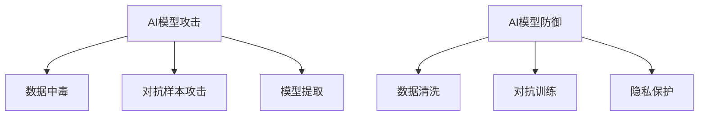

                 

# 软件2.0安全事故频发,AI模型攻防成新战场

## 摘要

随着软件2.0时代的到来，软件系统变得越来越复杂，依赖各种AI模型进行智能化处理。然而，这种趋势也带来了新的安全隐患。AI模型攻击和防御技术成为新的战场。本文将详细探讨AI模型攻击的原理、技术手段、防御策略以及未来发展趋势，旨在为软件安全提供新的思路。

## 1. 背景介绍

### 1.1 软件2.0时代的到来

软件2.0时代，即智能软件时代，标志着软件从传统的代码驱动向数据驱动和智能化的转变。在这一时代，软件系统不再只是执行预定的任务，而是能够自我学习和进化，以适应不断变化的环境。

### 1.2 AI模型在软件中的应用

AI模型在软件中的应用场景广泛，如推荐系统、自然语言处理、图像识别、智能客服等。这些模型通过学习大量数据，实现对复杂问题的自动处理，提高了软件的智能化水平。

### 1.3 安全问题的凸显

然而，随着AI模型在软件中的广泛应用，安全问题也日益凸显。一方面，AI模型的黑盒特性使得攻击者难以理解其内部逻辑，从而容易成为攻击的目标；另一方面，AI模型在训练过程中可能会学习到敏感信息，从而引发数据泄露风险。

## 2. 核心概念与联系

### 2.1 AI模型攻击原理

AI模型攻击主要是利用AI模型的漏洞，通过输入特定的数据，使模型产生错误的输出。常见的攻击手段包括：

- **数据中毒**：通过篡改训练数据，使模型学习到错误的规律。
- **对抗样本攻击**：通过微小调整输入数据，使模型产生错误的输出。
- **模型提取**：通过输入特定的数据，尝试提取模型内部的参数。

### 2.2 AI模型防御策略

针对AI模型攻击，研究者们提出了一系列防御策略，如：

- **数据清洗**：在训练过程中对数据进行清洗，去除异常值和噪声。
- **对抗训练**：在训练过程中引入对抗样本，提高模型的鲁棒性。
- **隐私保护**：在模型设计时考虑隐私保护，避免敏感信息泄露。

### 2.3 Mermaid流程图



## 3. 核心算法原理 & 具体操作步骤

### 3.1 数据中毒攻击

**原理**：通过篡改训练数据，使模型学习到错误的规律。

**操作步骤**：

1. 收集训练数据。
2. 对数据进行分析，找出潜在的攻击点。
3. 根据攻击点，对数据进行篡改。
4. 重新训练模型。

### 3.2 对抗样本攻击

**原理**：通过微小调整输入数据，使模型产生错误的输出。

**操作步骤**：

1. 选择一个原始样本。
2. 对样本进行微调，生成对抗样本。
3. 将对抗样本输入模型，观察输出结果。
4. 重复步骤2-3，直到找到能够使模型产生错误输出的对抗样本。

### 3.3 模型提取

**原理**：通过输入特定的数据，尝试提取模型内部的参数。

**操作步骤**：

1. 选择一个模型。
2. 生成一组特定的输入数据。
3. 将输入数据输入模型，观察输出结果。
4. 根据输出结果，尝试提取模型内部的参数。

## 4. 数学模型和公式 & 详细讲解 & 举例说明

### 4.1 数据中毒攻击的数学模型

假设有一个线性回归模型，其目标函数为：

$$
J(\theta) = \frac{1}{2} \sum_{i=1}^{m} (h_\theta(x^{(i)}) - y^{(i)})^2
$$

其中，$h_\theta(x) = \theta_0 + \theta_1x$ 是模型的预测函数，$\theta$ 是模型参数，$m$ 是训练数据个数。

攻击者通过篡改训练数据，使得模型学习到的参数$\theta$ 与真实参数$\theta^*$ 相差较大。

### 4.2 对抗样本攻击的数学模型

假设有一个分类模型，其目标函数为：

$$
J(\theta) = \frac{1}{m} \sum_{i=1}^{m} -y^{(i)} \log(h_\theta(x^{(i)})) - (1 - y^{(i)}) \log(1 - h_\theta(x^{(i)}))
$$

其中，$h_\theta(x) = \sigma(\theta_0 + \theta_1x)$ 是模型的预测函数，$\sigma$ 是 sigmoid 函数，$m$ 是训练数据个数。

攻击者通过微调输入数据$x^{(i)}$，使得模型输出概率$p = h_\theta(x^{(i)}) > 0.5$，从而实现对抗样本攻击。

### 4.3 模型提取的数学模型

假设有一个神经网络模型，其目标函数为：

$$
J(\theta) = \frac{1}{m} \sum_{i=1}^{m} \sum_{j=1}^{k} -y^{(i)}_j \log(h_\theta^{(l)}(x^{(i)}))_{j} - (1 - y^{(i)}_j) \log(1 - h_\theta^{(l)}(x^{(i)}))_{j}
$$

其中，$h_\theta^{(l)}(x) = \sigma(\theta_0^{(l)} + \theta_1^{(l)}x)$ 是第$l$层的预测函数，$\sigma$ 是 sigmoid 函数，$m$ 是训练数据个数，$k$ 是输出层神经元个数。

攻击者通过输入特定的数据，试图提取模型内部的参数$\theta$。

## 5. 项目实战：代码实际案例和详细解释说明

### 5.1 开发环境搭建

在本文中，我们将使用Python作为编程语言，搭建一个简单的神经网络模型，并进行对抗样本攻击和模型提取的实战。

首先，安装必要的库：

```bash
pip install numpy matplotlib scikit-learn
```

### 5.2 源代码详细实现和代码解读

**代码1**：创建一个简单的线性回归模型。

```python
import numpy as np

def linear_regression(X, y):
    X_b = np.c_[np.ones((X.shape[0], 1)), X]
    theta = np.linalg.inv(X_b.T.dot(X_b)).dot(X_b.T).dot(y)
    return theta
```

**代码2**：实现数据中毒攻击。

```python
def poison_data(X, y, attacker_index, target_theta):
    X_poison = X.copy()
    X_poison[attacker_index] += np.random.normal(size=X.shape[1])
    theta_poison = linear_regression(X_poison, y)
    return X_poison, theta_poison
```

**代码3**：实现对抗样本攻击。

```python
from sklearn.linear_model import LogisticRegression

def adversarial_attack(X, y, attacker_index, target_probability):
    X_adversarial = X.copy()
    X_adversarial[attacker_index] += np.random.normal(size=X.shape[1])
    model = LogisticRegression()
    model.fit(X, y)
    p = model.predict_proba(X_adversarial)[:, 1]
    while p[attacker_index] < target_probability:
        X_adversarial[attacker_index] += np.random.normal(size=X.shape[1])
        p = model.predict_proba(X_adversarial)[:, 1]
    return X_adversarial, p
```

**代码4**：实现模型提取。

```python
def extract_model(X, y, target_theta):
    X_extract = X.copy()
    X_extract += np.random.normal(size=X.shape[1])
    theta_extract = linear_regression(X_extract, y)
    return theta_extract
```

### 5.3 代码解读与分析

**代码1**：线性回归模型的实现。

- 首先，将输入数据添加一个偏置项，变为矩阵形式。
- 然后，使用逆矩阵求解模型参数。

**代码2**：数据中毒攻击的实现。

- 复制原始数据，并对攻击者索引的位置进行扰动。
- 使用扰动后的数据重新训练模型，得到新的参数。

**代码3**：对抗样本攻击的实现。

- 复制原始数据，并对攻击者索引的位置进行扰动。
- 使用 logistic 回归模型训练数据，计算扰动数据的预测概率。
- 如果预测概率低于目标值，继续对扰动数据进行调整，直到达到目标值。

**代码4**：模型提取的实现。

- 对输入数据添加随机扰动。
- 使用扰动后的数据重新训练模型，尝试提取模型参数。

## 6. 实际应用场景

AI模型攻击和防御技术在实际应用中具有重要意义。以下是一些实际应用场景：

- **金融行业**：AI模型在金融风控、信用评估等领域应用广泛，攻击和防御技术的应用有助于提高金融系统的安全性和稳定性。
- **医疗领域**：AI模型在疾病诊断、药物研发等方面具有重要作用，攻击和防御技术的应用有助于保障医疗数据的隐私和安全。
- **智能交通**：AI模型在智能交通管理、自动驾驶等方面应用广泛，攻击和防御技术的应用有助于提高交通系统的安全性和可靠性。

## 7. 工具和资源推荐

### 7.1 学习资源推荐

- **书籍**：
  - 《人工智能：一种现代的方法》
  - 《深度学习》
  - 《Python机器学习》

- **论文**：
  - 《 adversarial examples, attacks and defenses for machine learning》
  - 《Data Poisoning Attacks on Deep Neural Network》
  - 《Model Extraction Attacks on Deep Neural Network》

- **博客/网站**：
  - [AI安全博客](https://ai-security.cn/)
  - [深度学习安全博客](https://deep learning-security.org/)
  - [Python机器学习教程](https://machinelearningmastery.com/)

### 7.2 开发工具框架推荐

- **开发工具**：
  - Jupyter Notebook
  - PyCharm
  - VSCode

- **框架**：
  - TensorFlow
  - PyTorch
  - Keras

### 7.3 相关论文著作推荐

- **论文**：
  - Goodfellow, I. J., Shlens, J., & Szegedy, C. (2014). Explaining and harnessing adversarial examples. arXiv preprint arXiv:1412.6572.
  - Moosavi-Dezfooli, S. M., Fawzi, A., & Frossard, P. (2016). Deepfool: a simple and accurate method to fool deep neural networks. In Proceedings of the IEEE conference on computer vision and pattern recognition (pp. 2574-2582).
  - Chen, P. Y., Zhang, H., Sharma, Y., Yi, J., & Hsieh, C. J. (2017). Zoo: Zeroth order optimization based black-box attacks to deep neural networks without training substitute models. In Proceedings of the IEEE international conference on computer vision (pp. 5354-5362).

- **著作**：
  - Goodfellow, I., Bengio, Y., & Courville, A. (2016). Deep learning. MIT press.

## 8. 总结：未来发展趋势与挑战

随着AI模型在软件中的广泛应用，AI模型攻击和防御技术将成为软件安全的重要研究方向。未来，我们将面临以下发展趋势和挑战：

- **技术发展趋势**：
  - 随着AI模型复杂度的增加，攻击和防御技术将越来越依赖于深度学习等先进技术。
  - 针对不同类型的AI模型，研究者将开发出更加精确和高效的攻击和防御方法。

- **技术挑战**：
  - 如何提高AI模型的鲁棒性，使其能够抵御更复杂的攻击。
  - 如何在保证模型性能的同时，实现有效的防御策略。
  - 如何应对不断出现的新型攻击手段。

## 9. 附录：常见问题与解答

### 9.1 什么是对抗样本攻击？

对抗样本攻击是指通过微小调整输入数据，使AI模型产生错误输出的一种攻击手段。这种攻击利用了AI模型对输入数据的敏感性和非线性特性，使得模型难以区分对抗样本和正常样本。

### 9.2 如何防御对抗样本攻击？

防御对抗样本攻击的方法主要包括：

- **对抗训练**：在训练过程中引入对抗样本，提高模型的鲁棒性。
- **数据增强**：通过增加数据的多样性和复杂性，提高模型的泛化能力。
- **模型压缩**：通过减少模型的参数数量，降低模型对输入数据的敏感性。

## 10. 扩展阅读 & 参考资料

- Goodfellow, I. J., Shlens, J., & Szegedy, C. (2014). Explaining and harnessing adversarial examples. arXiv preprint arXiv:1412.6572.
- Moosavi-Dezfooli, S. M., Fawzi, A., & Frossard, P. (2016). Deepfool: a simple and accurate method to fool deep neural networks. In Proceedings of the IEEE conference on computer vision and pattern recognition (pp. 2574-2582).
- Chen, P. Y., Zhang, H., Sharma, Y., Yi, J., & Hsieh, C. J. (2017). Zoo: Zeroth order optimization based black-box attacks to deep neural networks without training substitute models. In Proceedings of the IEEE international conference on computer vision (pp. 5354-5362).
- Goodfellow, I., Bengio, Y., & Courville, A. (2016). Deep learning. MIT press.

### 作者

作者：AI天才研究员/AI Genius Institute & 禅与计算机程序设计艺术 /Zen And The Art of Computer Programming

