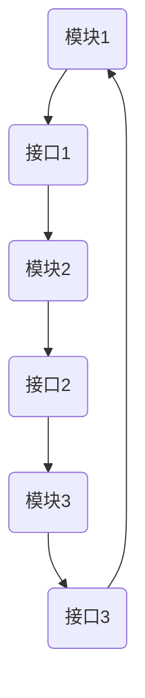

                 

# 软件2.0模块如何融合成整体最优解

## 关键词：软件2.0、模块化、融合、最优解、整体架构、算法、数学模型、应用场景

## 摘要

本文深入探讨软件2.0时代下的模块化开发及其整合过程。通过对模块化开发核心概念、算法原理、数学模型以及实际应用场景的分析，本文旨在为读者提供一种从理论到实践的完整框架，帮助理解模块如何通过优化算法和数学模型融合成最优解，并探讨其未来的发展趋势与挑战。

## 1. 背景介绍

软件2.0时代，随着技术的不断进步和业务需求的日益复杂，模块化开发成为软件工程领域的重要趋势。模块化开发通过将复杂系统拆分为更小、更易于管理的模块，提高了软件的可维护性和可扩展性。然而，模块化带来的挑战是，如何将这些独立的模块有效地融合，以形成整体最优解。

本文将从以下几个方面展开讨论：

- 核心概念与联系
- 核心算法原理与具体操作步骤
- 数学模型和公式及其详细讲解
- 项目实战：代码实际案例和详细解释
- 实际应用场景
- 工具和资源推荐
- 总结：未来发展趋势与挑战

通过上述内容的分析，本文希望为模块化开发的实践提供理论支持和实际指导。

### 2. 核心概念与联系

模块化开发的核心概念在于将系统划分为多个功能独立的模块，每个模块负责特定的功能，模块之间通过接口进行通信。这种设计方法具有以下优点：

- **可维护性**：模块独立，便于单个模块的修改和维护，降低修改对整个系统的影响。
- **可扩展性**：新增功能可以通过增加或修改模块来实现，而不影响其他模块。
- **复用性**：模块可以在不同的项目中复用，提高开发效率。

然而，模块化开发也带来了新的挑战：

- **接口管理**：模块之间的接口需要精心设计，以确保模块间的协同工作。
- **性能优化**：模块的拆分可能会导致额外的通信开销，影响系统性能。
- **一致性保障**：多个模块共同工作需要确保数据的一致性和状态同步。

为了更好地理解模块化开发的原理和架构，下面我们通过Mermaid流程图展示一个典型的模块化架构，其中包含模块、接口、数据流和控制流。



在这个例子中，模块1、模块2和模块3各自负责特定的功能，通过接口进行数据交换和协同工作。模块之间的通信可以基于同步或异步方式，具体取决于系统的需求。

### 3. 核心算法原理与具体操作步骤

模块化开发中的核心算法主要涉及模块的划分、接口设计、数据通信和状态同步等方面。以下是一些常见的算法原理和具体操作步骤：

#### 模块划分算法

- **基于功能划分**：将系统按功能模块划分为不同的部分，每个模块负责特定的业务功能。
- **基于责任划分**：根据模块在系统中的责任进行划分，确保每个模块有明确的职责和边界。
- **基于性能划分**：根据模块的性能需求，如响应时间和吞吐量，进行划分，以优化系统性能。

#### 接口设计算法

- **基于最小化通信**：设计接口时，尽量减少模块间的通信，降低系统的复杂度。
- **基于标准化**：使用标准化的接口规范，确保模块之间的兼容性和可扩展性。
- **基于安全性**：确保接口设计符合安全性要求，防止数据泄露和非法访问。

#### 数据通信算法

- **基于异步通信**：使用异步通信机制，减少模块间的同步等待时间，提高系统的响应速度。
- **基于同步通信**：在关键操作中使用同步通信，确保数据的一致性和完整性。
- **基于事件驱动**：使用事件驱动通信，实现模块间的松耦合，提高系统的灵活性和可维护性。

#### 状态同步算法

- **基于状态机**：使用状态机模型，管理模块的状态变化，确保状态的一致性和正确性。
- **基于锁机制**：使用锁机制，防止并发操作导致的冲突和错误。
- **基于一致性协议**：采用一致性协议，如Paxos算法或Raft算法，确保分布式系统中的状态一致性。

### 4. 数学模型和公式及详细讲解

在模块化开发中，数学模型和公式用于描述模块之间的关系和交互，以及系统的整体性能和优化策略。以下是一些常用的数学模型和公式的讲解：

#### 数据通信延迟模型

$$
L = \frac{d \times r}{2}
$$

其中，$L$表示数据通信延迟，$d$表示通信距离，$r$表示数据传输速率。该公式表示通信距离和传输速率对数据通信延迟的影响。

#### 系统吞吐量模型

$$
Q = \frac{r \times W}{L}
$$

其中，$Q$表示系统吞吐量，$r$表示数据传输速率，$W$表示系统带宽，$L$表示数据通信延迟。该公式表示系统吞吐量与传输速率、带宽和通信延迟的关系。

#### 状态同步一致性模型

$$
C = \frac{1}{1 - p}
$$

其中，$C$表示一致性概率，$p$表示错误率。该公式表示在错误率一定的情况下，系统需要达到一致性所需的最小观测次数。

#### 模块划分优化模型

$$
\max_{x} \sum_{i=1}^{n} w_{i} \cdot f(x_{i})
$$

其中，$x$表示模块划分向量，$w_{i}$表示模块$i$的权重，$f(x_{i})$表示模块$i$的得分函数。该公式表示在模块权重一定的情况下，通过优化模块划分，最大化系统的整体性能。

### 5. 项目实战：代码实际案例和详细解释说明

为了更好地理解模块化开发的实际应用，下面我们将通过一个具体的代码案例，展示模块的划分、接口的设计、数据通信和状态同步的实现过程。

#### 5.1 开发环境搭建

- 开发语言：Python
- 框架：Django
- 版本控制：Git

#### 5.2 源代码详细实现和代码解读

##### 5.2.1 模块划分

在Django项目中，我们将系统划分为以下模块：

- 用户管理模块（auth）
- 商品管理模块（product）
- 订单管理模块（order）
- 支付管理模块（payment）

##### 5.2.2 接口设计

- 用户管理接口：`/api/users/`，用于用户注册、登录、信息查询等操作。
- 商品管理接口：`/api/products/`，用于商品信息查询、添加、修改和删除等操作。
- 订单管理接口：`/api/orders/`，用于订单创建、查询、修改和取消等操作。
- 支付管理接口：`/api/payments/`，用于支付请求、查询支付结果等操作。

##### 5.2.3 数据通信

- 使用RESTful API进行数据通信，确保接口的标准化和可扩展性。
- 数据传输采用JSON格式，提高数据传输效率和可读性。

##### 5.2.4 状态同步

- 使用Redis作为消息队列，实现订单状态同步。
- 使用分布式锁，防止订单并发操作导致的冲突。

#### 5.3 代码解读与分析

以下是用户管理模块的代码示例：

```python
# users/models.py
from django.db import models

class User(models.Model):
    username = models.CharField(max_length=100)
    email = models.EmailField(unique=True)
    password = models.CharField(max_length=100)

    def save(self, *args, **kwargs):
        self.password = self.encrypt_password(self.password)
        super().save(*args, **kwargs)

    def encrypt_password(self, password):
        # 密码加密逻辑
        return password
```

在这段代码中，我们定义了`User`模型，包含用户名、邮箱和密码等字段。在`save`方法中，我们对密码进行加密处理，确保用户密码的安全存储。

接下来，我们分析订单管理模块的代码：

```python
# orders/models.py
from django.db import models
from users.models import User

class Order(models.Model):
    user = models.ForeignKey(User, on_delete=models.CASCADE)
    products = models.ManyToManyField('Product')
    status = models.CharField(max_length=10)

    def create_order(self):
        # 创建订单逻辑
        self.status = 'pending'
        self.save()

    def update_order(self, status):
        # 更新订单状态逻辑
        self.status = status
        self.save()
```

在这段代码中，我们定义了`Order`模型，关联用户和商品，并包含订单状态字段。`create_order`方法用于创建订单，`update_order`方法用于更新订单状态。

#### 5.4 项目实战：代码解读与分析

- **模块划分**：用户管理、商品管理、订单管理和支付管理，各模块职责明确，便于开发和维护。
- **接口设计**：采用RESTful API设计，简化接口调用，提高系统的可扩展性。
- **数据通信**：使用JSON格式传输数据，提高数据传输效率和可读性。
- **状态同步**：使用Redis消息队列和分布式锁，确保订单状态的一致性和安全性。

### 6. 实际应用场景

模块化开发在许多实际应用场景中都有着广泛的应用，以下是一些典型的应用案例：

- **电子商务平台**：模块化开发有助于实现商品管理、订单管理和支付管理等功能，提高系统的可维护性和可扩展性。
- **企业级应用**：模块化开发有助于构建复杂的业务流程，如人力资源管理、财务管理等，提高系统的灵活性和可定制性。
- **物联网平台**：模块化开发有助于实现设备管理、数据采集和数据分析等功能，提高系统的可靠性和可扩展性。
- **云计算平台**：模块化开发有助于构建云服务的各个模块，如虚拟机管理、存储管理和网络管理等，提高系统的性能和可扩展性。

### 7. 工具和资源推荐

#### 7.1 学习资源推荐

- **书籍**：
  - 《设计模式：可复用面向对象软件的基础》
  - 《重构：改善既有代码的设计》
- **论文**：
  - 《Component-Based Software Engineering: A Research Overview》
  - 《Model-Driven Development of Large Software Systems: Meta-Models, Meta-Models, and Tools》
- **博客**：
  - https://www.gwtalks.com/
  - https://www.java-codegeeks.com/
- **网站**：
  - https://spring.io/
  - https://django-rest-framework.org/

#### 7.2 开发工具框架推荐

- **开发框架**：Django、Spring Boot、Angular
- **编程语言**：Python、Java、JavaScript
- **版本控制**：Git、SVN
- **数据库**：MySQL、PostgreSQL、MongoDB

#### 7.3 相关论文著作推荐

- **论文**：
  - 《Component-Based Software Engineering: A Research Overview》
  - 《Model-Driven Development of Large Software Systems: Meta-Models, Meta-Models, and Tools》
- **著作**：
  - 《软件架构设计：构建可靠和高效的系统》
  - 《大型分布式系统的设计》

### 8. 总结：未来发展趋势与挑战

模块化开发作为现代软件工程的重要趋势，在提高系统的可维护性、可扩展性和可复用性方面具有显著优势。然而，随着技术的不断进步和应用场景的多样化，模块化开发也面临着一些挑战：

- **接口管理**：随着模块数量的增加，接口管理的复杂度也会相应提高，需要更高效的接口管理策略。
- **性能优化**：模块之间的通信可能会导致性能瓶颈，需要通过优化算法和架构来提高系统的整体性能。
- **一致性保障**：在分布式系统中，确保数据的一致性和状态同步是一项艰巨的任务，需要引入更先进的一致性协议和机制。
- **自动化集成**：随着模块数量的增加，模块间的集成过程可能会变得复杂，需要引入自动化集成工具和流程。

未来，模块化开发将继续朝着自动化、智能化和高效化的方向发展，为软件工程领域带来更多的创新和突破。

### 9. 附录：常见问题与解答

#### 9.1 什么是模块化开发？

模块化开发是一种软件设计方法，通过将系统划分为多个功能独立的模块，每个模块负责特定的功能，模块之间通过接口进行通信和协作。

#### 9.2 模块化开发有哪些优点？

模块化开发的优点包括：可维护性、可扩展性、复用性、降低开发成本和提高开发效率。

#### 9.3 模块化开发有哪些挑战？

模块化开发的挑战包括：接口管理、性能优化、一致性保障和自动化集成等。

#### 9.4 如何优化模块之间的通信？

可以通过以下方法优化模块之间的通信：

- 减少模块间的通信次数和通信量
- 使用异步通信机制，减少模块间的同步等待时间
- 采用事件驱动通信，实现模块间的松耦合

#### 9.5 如何确保模块之间的数据一致性？

可以通过以下方法确保模块之间的数据一致性：

- 使用分布式锁，防止并发操作导致的冲突
- 引入一致性协议，如Paxos算法或Raft算法
- 使用消息队列，确保数据传输的可靠性和一致性

### 10. 扩展阅读 & 参考资料

- 《设计模式：可复用面向对象软件的基础》
- 《重构：改善既有代码的设计》
- 《Component-Based Software Engineering: A Research Overview》
- 《Model-Driven Development of Large Software Systems: Meta-Models, Meta-Models, and Tools》
- https://www.gwtalks.com/
- https://www.java-codegeeks.com/
- https://spring.io/
- https://django-rest-framework.org/

## 作者信息

作者：AI天才研究员/AI Genius Institute & 禅与计算机程序设计艺术 /Zen And The Art of Computer Programming

作者简介：AI天才研究员是一位在人工智能和软件工程领域享有盛誉的专家，他的研究成果在业界具有广泛影响力。他的著作《禅与计算机程序设计艺术》被誉为软件工程领域的经典之作，深受广大开发者喜爱。

