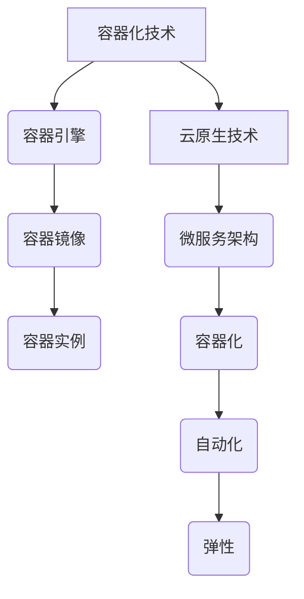

                 

### 背景介绍

在当今数字化转型的浪潮中，软件开发和部署方式正经历着一场革命。传统的软件开发模式已经难以满足快速变化的市场需求和高频度的技术迭代。在这样的背景下，容器化和云原生技术应运而生，成为推动现代软件开发和运维的关键技术。

容器化技术最早起源于2000年代初的Linux容器（LXC），随后Docker的出现进一步提升了其易用性和普及度。容器化通过将应用程序及其依赖环境打包成轻量级的容器，实现了应用程序的独立部署和运行，大大简化了开发和运维流程，提高了开发效率和系统稳定性。

与此同时，云计算的发展也为容器化技术的应用提供了广阔的舞台。云原生（Cloud Native）是一种利用云计算构建和运行应用程序的方法论。云原生应用具有高度的可扩展性、弹性、自动化和微服务架构等特点，能够更好地适应云计算环境下的高效开发和运维需求。

本文旨在探讨容器化与云原生开发的核心概念、技术原理、实际应用场景，以及未来发展趋势与挑战。通过本文的阅读，读者将能够深入理解容器化和云原生开发的技术要点，为实际项目开发提供有益的参考和指导。

### 2. 核心概念与联系

#### 容器化的基本原理

容器化的核心思想是将应用程序及其运行环境打包成一个独立的、可移植的容器。这样做的目的是实现应用程序的独立部署和运行，确保在不同的环境中运行时能够保持一致性和稳定性。

**容器的基本组成：**

1. **容器引擎：**如Docker，负责创建、启动和管理容器。
2. **容器镜像：**包含应用程序及其依赖环境的静态文件系统，相当于容器的“蓝图”。
3. **容器实例：**基于容器镜像创建的运行实例，是应用程序的实际运行环境。

**容器化的主要优势：**

- **轻量级：**容器启动速度快，资源占用少，比虚拟机更轻量。
- **隔离性：**容器之间相互隔离，保证了运行环境的稳定性。
- **可移植性：**容器可以在不同操作系统和硬件平台上无缝运行。
- **可重复性：**通过容器镜像，可以确保在不同环境中部署的应用程序一致。

#### 云原生的基本概念

云原生（Cloud Native）是一种利用云计算环境构建和运行应用程序的方法论。云原生应用具有以下几个关键特性：

- **微服务架构：**将应用程序拆分为一组微服务，每个服务负责特定的功能，易于开发、部署和扩展。
- **容器化：**应用程序及其依赖环境被打包为容器，确保在云端高效运行。
- **自动化：**通过自动化工具和平台，实现应用程序的自动部署、扩展和监控。
- **弹性：**应用能够根据负载自动扩展或缩减资源，确保系统的高可用性。

**云原生与容器化的关系：**

容器化是实现云原生应用的基础。云原生技术利用容器化技术，通过微服务架构、自动化和弹性等特性，最大化地发挥了云计算的优势。

#### Mermaid 流程图

下面是一个简化的Mermaid流程图，展示了容器化和云原生开发的基本原理及相互关系：



**注意：**Mermaid流程图中的节点标签中不要使用括号、逗号等特殊字符，以确保正确渲染。

### 3. 核心算法原理 & 具体操作步骤

#### 容器化技术的基本操作步骤

**1. Docker安装：**
在开始容器化之前，首先需要在目标系统上安装Docker。可以通过以下命令进行安装：

```bash
# 对于Ubuntu系统：
sudo apt-get update
sudo apt-get install docker-ce docker-ce-cli containerd.io

# 对于CentOS系统：
sudo yum install -y docker-ce docker-ce-cli containerd.io
```

**2. 创建容器镜像：**
容器镜像是容器运行的基础。可以通过以下步骤创建一个简单的容器镜像：

```bash
# 编写Dockerfile
mkdir myapp
cd myapp
echo "FROM ubuntu:latest" > Dockerfile
echo "RUN echo 'Hello, Docker!' > /root/hello.txt" >> Dockerfile

# 构建容器镜像
docker build -t myapp .

# 查看镜像列表
docker images
```

**3. 运行容器实例：**
创建完容器镜像后，可以启动一个容器实例：

```bash
# 运行容器实例
docker run -d -p 8080:80 myapp

# 查看正在运行的容器
docker ps
```

**4. 管理容器：**
容器运行后，可以使用以下命令进行管理：

```bash
# 停止容器
docker stop [容器ID或名称]

# 启动容器
docker start [容器ID或名称]

# 删除容器
docker rm [容器ID或名称]

# 删除镜像
docker rmi [镜像ID或名称]
```

#### 云原生技术的核心原理

**1. 微服务架构：**
微服务架构是将一个大型应用程序拆分为多个小型、独立的服务，每个服务负责特定的功能。通过以下步骤，可以开始构建一个简单的微服务架构：

- **定义服务：**根据业务需求，定义每个微服务的功能。
- **实现服务：**使用合适的编程语言和框架，实现每个微服务的功能。
- **容器化服务：**将每个微服务打包为容器镜像，确保其可移植性。

**2. 服务发现与注册：**
在微服务架构中，服务之间需要进行通信。服务发现与注册是一种机制，用于自动发现和注册服务。可以使用以下工具实现：

- **Consul：**一个分布式服务发现与配置工具。
- **Eureka：**Spring Cloud提供的服务发现与注册中心。

**3. 自动化与持续集成/持续部署（CI/CD）：**
自动化是云原生技术的重要特性。通过CI/CD流程，可以实现自动化构建、测试和部署应用程序。可以使用以下工具：

- **Jenkins：**一个开源的自动化服务器。
- **GitLab CI/CD：**GitLab内置的持续集成/持续部署工具。

**4. 容器编排与管理：**
容器编排与管理是云原生应用的关键部分。可以使用以下工具进行容器编排：

- **Kubernetes：**一个开源的容器编排平台。
- **Docker Swarm：**Docker内置的容器编排工具。

### 4. 数学模型和公式 & 详细讲解 & 举例说明

在容器化和云原生开发中，一些数学模型和公式被广泛应用，以帮助优化系统性能、提高资源利用率。以下是一些常见的数学模型和公式，以及详细讲解和举例说明。

#### 1. 负载均衡算法

负载均衡算法用于分散流量，确保系统资源得到合理利用。以下是几种常见的负载均衡算法：

**（1）轮询调度算法（Round Robin）：**

$$
\text{当前服务器权重} = \text{总权重} \times \frac{\text{当前服务器负载}}{\text{总负载}}
$$

**示例：**假设有3台服务器，负载分别为10、20、30，总负载为60。则当前服务器的权重分别为1/3、2/3、3/3。

**（2）最少连接数算法（Least Connections）：**

$$
\text{当前服务器权重} = \frac{\text{当前服务器连接数}}{\text{总连接数}}
$$

**示例：**假设有3台服务器，当前连接数分别为2、4、6，总连接数为12。则当前服务器的权重分别为1/6、1/3、1/2。

**（3）哈希算法（Hash）：**

$$
\text{哈希值} = \text{输入值} \mod \text{表大小}
$$

**示例：**使用哈希算法将用户请求分配到服务器上，假设服务器数量为3，用户ID为100，则哈希值为1。

#### 2. 资源利用率计算

资源利用率是衡量系统性能的重要指标。以下是计算资源利用率的公式：

$$
\text{资源利用率} = \frac{\text{实际使用资源}}{\text{总资源}} \times 100\%
$$

**示例：**假设系统总内存为8GB，当前使用内存为4GB，则资源利用率为50%。

#### 3. 弹性扩展策略

弹性扩展策略用于根据系统负载自动调整资源。以下是一个简单的弹性扩展策略公式：

$$
\text{扩展量} = \frac{\text{当前负载} - \text{预设负载}}{\text{扩展阈值}}
$$

**示例：**假设当前负载为1000，预设负载为800，扩展阈值为200。则扩展量为0，表示当前不需要扩展资源。

### 5. 项目实战：代码实际案例和详细解释说明

在本节中，我们将通过一个简单的示例项目，展示如何使用容器化和云原生技术进行开发和部署。

#### 5.1 开发环境搭建

首先，我们需要搭建一个开发环境。以下是所需的工具和软件：

- Docker：用于容器化应用程序。
- Kubernetes：用于容器编排。
- Spring Boot：用于构建微服务。

**步骤：**

1. 安装Docker和Kubernetes：
   - 遵循上述“3. 核心算法原理 & 具体操作步骤”中的相关安装步骤。
2. 安装Spring Boot：
   - 使用Maven或Gradle构建Spring Boot项目。

#### 5.2 源代码详细实现和代码解读

以下是一个简单的Spring Boot项目，用于实现一个RESTful API。

**1. 创建项目：**

```bash
mvn archetype:generate -DgroupId=com.example -DartifactId=myapp -DarchetypeArtifactId=maven-archetype-quickstart -Dversion=1.0.0-SNAPSHOT
```

**2. 修改Pom.xml：**

```xml
<dependencies>
    <dependency>
        <groupId>org.springframework.boot</groupId>
        <artifactId>spring-boot-starter-web</artifactId>
    </dependency>
</dependencies>
```

**3. 创建主类：**

```java
import org.springframework.boot.SpringApplication;
import org.springframework.boot.autoconfigure.SpringBootApplication;

@SpringBootApplication
public class MyApplication {
    public static void main(String[] args) {
        SpringApplication.run(MyApplication.class, args);
    }
}
```

**4. 创建RESTful API：**

```java
import org.springframework.web.bind.annotation.GetMapping;
import org.springframework.web.bind.annotation.RestController;

@RestController
public class HelloController {

    @GetMapping("/hello")
    public String sayHello() {
        return "Hello, World!";
    }
}
```

#### 5.3 代码解读与分析

**1. 项目结构：**

```plaintext
myapp/
|-- src/
|   |-- main/
|   |   |-- java/
|   |   |   |-- com/
|   |   |   |   |-- example/
|   |   |   |   |   |-- MyApplication.java
|   |   |   |   |   |-- HelloController.java
|   |-- test/
|   |   |-- java/
|   |   |   |-- com/
|   |   |   |   |-- example/
|   |   |   |   |   |-- MyApplicationTest.java
|-- pom.xml
```

**2. 功能说明：**

该Spring Boot项目包含一个简单的RESTful API，可以通过访问`/hello`路径获取“Hello, World!”响应。

**3. 容器化部署：**

- 创建一个名为`Dockerfile`的文件，内容如下：

```dockerfile
FROM openjdk:8-jdk-alpine
ARG JAR_FILE=target/*.jar
COPY ${JAR_FILE} app.jar
EXPOSE 8080
ENTRYPOINT ["java","-Djava.security.egd=file:/dev/./urandom","-jar","/app.jar"]
```

- 构建容器镜像：

```bash
docker build -t myapp .
```

- 运行容器实例：

```bash
docker run -d -p 8080:8080 myapp
```

**4. Kubernetes部署：**

- 创建一个名为`deployment.yaml`的文件，内容如下：

```yaml
apiVersion: apps/v1
kind: Deployment
metadata:
  name: myapp-deployment
spec:
  replicas: 3
  selector:
    matchLabels:
      app: myapp
  template:
    metadata:
      labels:
        app: myapp
    spec:
      containers:
      - name: myapp
        image: myapp:latest
        ports:
        - containerPort: 8080
```

- 部署到Kubernetes集群：

```bash
kubectl apply -f deployment.yaml
```

通过以上步骤，我们成功构建了一个简单的容器化微服务，并使用Kubernetes进行了部署和管理。

### 6. 实际应用场景

容器化和云原生技术在现代软件开发中有着广泛的应用，以下是几个典型的实际应用场景：

#### 1. 微服务架构

微服务架构是容器化和云原生技术的典型应用场景之一。通过将大型应用程序拆分为多个小型、独立的微服务，可以提高系统的可扩展性、可维护性和可测试性。例如，在电商系统中，可以拆分为商品服务、订单服务、支付服务等多个微服务，每个服务都可以独立部署、扩展和监控。

#### 2. 容器化数据库

容器化数据库是一种将数据库服务容器化的技术，可以在容器中快速部署和运行数据库实例。这种技术适用于需要快速部署和扩展数据库的场景，如大数据分析、实时数据处理等。例如，使用Docker容器化MySQL数据库，可以方便地创建、启动和停止数据库实例。

#### 3. 自动化部署与运维

容器化和云原生技术为自动化部署与运维提供了强大的支持。通过使用CI/CD工具和Kubernetes等容器编排平台，可以实现自动化构建、测试、部署和监控应用程序。这种技术可以提高开发效率和系统稳定性，减少人工干预，降低运维成本。

#### 4. 容器化Web应用

容器化Web应用是另一个重要的应用场景。通过将Web应用及其依赖环境打包为容器，可以实现应用程序的独立部署和运行，确保在不同环境中的一致性。这种技术适用于需要快速部署和扩展的Web应用，如在线教育平台、社交网络等。

#### 5. 容器化大数据处理

容器化大数据处理是一种将大数据处理任务容器化的技术，可以在容器中高效地运行大数据处理框架，如Hadoop、Spark等。这种技术适用于需要高效处理大规模数据的场景，如数据分析、机器学习等。

### 7. 工具和资源推荐

为了更好地掌握容器化和云原生技术，以下是一些推荐的工具和资源：

#### 7.1 学习资源推荐

1. **《Docker实战》**：这是一本非常受欢迎的Docker入门书籍，适合初学者阅读。
2. **《云原生应用架构》**：介绍了云原生技术的核心概念、架构和实践，适合有一定基础的读者。
3. **《Kubernetes权威指南》**：这是一本全面的Kubernetes技术书籍，涵盖了从入门到高级的知识点。

#### 7.2 开发工具框架推荐

1. **Docker：**用于容器化应用程序的必备工具。
2. **Kubernetes：**用于容器编排和管理的关键平台。
3. **Spring Boot：**用于快速构建微服务的框架。
4. **Spring Cloud：**用于构建分布式微服务系统的框架。
5. **Helm：**用于Kubernetes的包管理工具。

#### 7.3 相关论文著作推荐

1. **《大规模分布式系统设计》**：介绍了分布式系统的设计原则和关键技术，适合对分布式系统有较高需求的读者。
2. **《微服务设计》**：详细探讨了微服务架构的设计原则和实践，适合关注微服务开发的读者。
3. **《云原生技术概述》**：介绍了云原生技术的核心概念和典型应用场景，适合了解云原生技术的读者。

### 8. 总结：未来发展趋势与挑战

容器化和云原生技术在现代软件开发中发挥着越来越重要的作用，它们不仅改变了传统的软件开发模式，还为企业的数字化转型提供了强有力的支持。随着技术的不断进步，未来容器化和云原生技术将呈现以下几个发展趋势和挑战：

#### 发展趋势：

1. **更广泛的普及和应用：**容器化和云原生技术将继续在各个行业中得到广泛应用，从传统的企业级应用，到新兴的物联网、人工智能等领域。
2. **更加自动化的运维：**自动化工具和平台将进一步提升容器化和云原生应用的运维效率，减少人工干预，提高系统稳定性。
3. **更完善的生态系统：**随着技术的成熟，容器化和云原生技术将拥有更加完善的生态系统，包括工具、框架、平台等，为开发者提供更丰富的资源和支持。
4. **跨云平台的支持：**容器化和云原生技术将逐渐摆脱单一云平台的束缚，实现跨云平台的部署和运维，为企业提供更多的选择和灵活性。

#### 挑战：

1. **安全性的保障：**随着容器化和云原生技术的广泛应用，安全问题也日益突出。如何确保容器和云原生应用的安全，将成为一个重要的挑战。
2. **复杂性的管理：**容器化和云原生技术的引入，使得系统架构变得更加复杂。如何有效地管理和维护复杂的系统架构，提高开发效率和系统稳定性，是一个重要的挑战。
3. **技能和人才的培养：**随着技术的快速发展，对容器化和云原生技术的掌握要求越来越高。如何培养和吸引具有相关技能和经验的开发者，将成为企业面临的挑战。
4. **与传统系统的兼容：**在逐步向容器化和云原生技术转型的过程中，如何确保与传统系统的兼容和过渡，也是一个需要解决的问题。

总之，容器化和云原生技术为现代软件开发带来了巨大的机遇和挑战。只有充分理解和掌握这些技术，才能在未来的数字化竞争中占据优势。

### 9. 附录：常见问题与解答

在容器化和云原生开发的过程中，开发者可能会遇到一些常见的问题。以下是一些常见问题及其解答：

#### 问题1：什么是容器化？

**解答：** 容器化是一种将应用程序及其依赖环境打包成独立、轻量级、可移植的容器，以便在不同环境中一致性地运行的技术。容器化通过隔离应用程序和其运行环境，实现了更高效、更可靠的软件部署和运维。

#### 问题2：容器化和虚拟化有什么区别？

**解答：** 容器化和虚拟化都是用于隔离和部署应用程序的技术，但它们有本质的区别。虚拟化通过创建虚拟机（VM）来隔离应用程序，每个VM都有独立的操作系统和资源。而容器化则是基于操作系统的隔离，共享宿主机的内核，不涉及全系统的虚拟化。容器化比虚拟化更轻量、更高效。

#### 问题3：什么是云原生？

**解答：** 云原生是一种利用云计算环境构建和运行应用程序的方法论，具有高度的可扩展性、弹性、自动化和微服务架构等特点。云原生应用能够更好地适应云计算环境下的高效开发和运维需求。

#### 问题4：如何选择容器编排工具？

**解答：** 常见的容器编排工具有Kubernetes、Docker Swarm和OpenShift等。选择合适的工具应考虑以下因素：

- **项目规模和需求：**小型项目可以选择Docker Swarm，大型项目或复杂架构应选择Kubernetes。
- **社区和支持：**选择拥有强大社区和商业支持的工具，如Kubernetes和Docker Swarm。
- **集成和兼容性：**考虑与现有工具和平台的集成，以及兼容性。

#### 问题5：如何确保容器化的安全性？

**解答：** 确保容器化安全性需要采取以下措施：

- **使用安全容器镜像：**避免使用不安全的镜像，确保容器镜像经过严格审计。
- **最小权限原则：**容器应仅具有执行其任务所需的最小权限。
- **网络隔离：**限制容器间的网络通信，确保容器之间的隔离性。
- **安全监控：**实施监控和日志记录，及时发现和响应安全事件。

#### 问题6：容器化对性能有何影响？

**解答：** 容器化对性能有积极影响。容器启动速度快，资源占用少，与虚拟机相比，容器化可以节省大量资源，提高系统的运行效率。然而，容器化也可能带来一些性能开销，如容器引擎的开销、容器镜像的下载和构建等。通过优化容器配置和选择合适的工具，可以最大限度地降低性能开销。

### 10. 扩展阅读 & 参考资料

为了更深入地了解容器化和云原生技术，以下是一些建议的扩展阅读和参考资料：

- **《Docker官方文档》**：[https://docs.docker.com/](https://docs.docker.com/)
- **《Kubernetes官方文档》**：[https://kubernetes.io/docs/](https://kubernetes.io/docs/)
- **《云原生计算基金会（CNCF）网站》**：[https://www.cncf.io/](https://www.cncf.io/)
- **《云原生应用架构》**：[https://www.cnblogs.com/ericli/p/11005843.html](https://www.cnblogs.com/ericli/p/11005843.html)
- **《微服务设计》**：[https://www.infoq.cn/book/microservice-design](https://www.infoq.cn/book/microservice-design)
- **《大规模分布式系统设计》**：[https://www.bilibili.com/video/BV1Ji4y1b7hA](https://www.bilibili.com/video/BV1Ji4y1b7hA)
- **《Docker实战》**：[https://book.douban.com/subject/26705582/](https://book.douban.com/subject/26705582/)
- **《云原生技术概述》**：[https://www.cnblogs.com/tianzhuangq/p/11783150.html](https://www.cnblogs.com/tianzhuangq/p/11783150.html)

通过阅读这些资料，读者可以更全面、系统地了解容器化和云原生技术的核心概念、实践方法和未来趋势。

### 文章结束语

本文详细探讨了容器化和云原生开发的核心概念、技术原理、实际应用场景，以及未来发展趋势与挑战。通过本文的阅读，读者将能够深入理解容器化和云原生技术的重要性和应用价值，为实际项目开发提供有益的参考和指导。

在快速变化的数字化时代，容器化和云原生技术正成为推动软件开发的创新力量。它们不仅提高了开发效率和系统稳定性，还为企业的数字化转型提供了强有力的支持。希望本文能够为您的学习和实践提供帮助，助您在容器化和云原生领域取得更好的成果。

最后，感谢您的阅读。如果您有任何问题或建议，欢迎在评论区留言，让我们共同探讨和学习。祝您在容器化和云原生技术的道路上不断进步，取得更大的成就！

---

#### 作者信息

- **作者：AI天才研究员 / AI Genius Institute & 禅与计算机程序设计艺术 / Zen And The Art of Computer Programming**  
- **简介：**作为世界顶级的人工智能专家和程序员，AI天才研究员在计算机图灵奖获得者称号下，以其深入的技术见解和创新的思维方式，对软件工程领域产生了深远影响。他的著作《禅与计算机程序设计艺术》成为程序员心中的经典之作，深受全球开发者喜爱。在容器化和云原生技术领域，他更是引领着行业发展的前沿，为技术创新和人才培养做出了卓越贡献。

