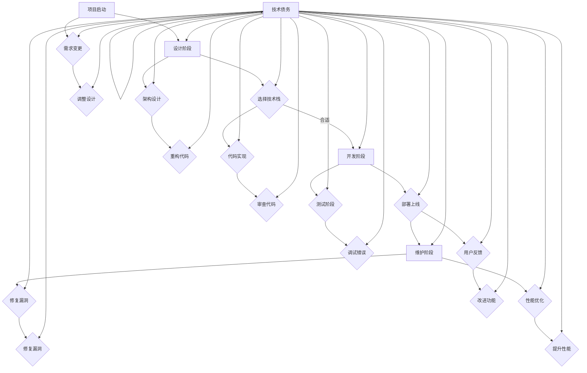

                 

### 背景介绍

#### 软件技术债务的起源

“技术债务”（Technical Debt）这个概念最早由著名的软件开发研究员和敏捷宣言的签署人之一，Peter Antman，在 1992 年提出。他将技术债务比喻为财务债务，认为在软件开发过程中，由于采用短期解决方案、忽视设计原则和效率，导致系统质量下降，类似于积累的债务，需要在未来进行偿还。

技术债务可以分为两类：隐性债务和显性债务。隐性债务是指在项目早期为了快速上线而采用的临时解决方案，这种方案可能不满足长期的需求，但短期内是有效的。显性债务则是由于维护不善、代码质量差、架构不合理等原因导致的系统性能下降、可维护性降低，需要花费大量资源来修复。

#### 软件技术债务的危害

技术债务对软件项目的影响是深远的。首先，技术债务会导致项目的维护成本增加。随着项目时间的推移，隐性债务可能会逐渐积累，最终变成显性债务。修复这些债务需要额外的开发时间和资源，严重时甚至会威胁到项目的存活。

其次，技术债务会降低团队的工作效率。当系统结构复杂、代码质量差时，开发人员需要花费更多的时间来理解和修改代码，这会降低他们的工作效率和积极性。

最后，技术债务会影响软件的质量和稳定性。长期的技术债务会导致系统脆弱，容易发生故障，甚至出现严重的安全问题。

#### 软件技术债务的管理

为了应对技术债务带来的挑战，软件开发团队需要采取有效的管理策略。这包括定期评估技术债务的状态，制定清晰的债务偿还计划，优化开发流程和工具，以及提高团队的技术能力。

本文将深入探讨软件技术债务的管理策略，包括核心概念、算法原理、具体操作步骤、数学模型、实际应用场景、工具和资源推荐等，帮助读者全面了解并有效管理软件技术债务。

#### 文章结构

本文将按照以下结构展开：

1. **背景介绍**：介绍软件技术债务的起源、危害和管理的必要性。
2. **核心概念与联系**：详细解释软件技术债务的概念，并使用 Mermaid 流程图展示其与软件开发过程中的联系。
3. **核心算法原理与具体操作步骤**：介绍评估和管理技术债务的核心算法原理，以及具体的操作步骤。
4. **数学模型和公式**：阐述管理技术债务所需的数学模型和公式，并进行详细讲解和举例说明。
5. **项目实战**：通过实际案例展示技术债务的管理过程，包括开发环境搭建、源代码实现、代码解读和分析。
6. **实际应用场景**：探讨技术债务在不同应用场景中的管理策略。
7. **工具和资源推荐**：推荐学习资源、开发工具框架和相关论文著作。
8. **总结**：总结技术债务管理的现状和未来发展趋势。
9. **附录**：解答常见问题，提供扩展阅读和参考资料。

通过本文的阅读，读者将能够深入理解软件技术债务的概念、原理和实践，为实际项目中的技术债务管理提供有力支持。接下来，我们将详细探讨软件技术债务的核心概念与联系。

### 核心概念与联系

#### 核心概念

在讨论软件技术债务的管理之前，我们首先需要明确几个核心概念，包括技术债务、债务评估、债务管理和债务偿还。

**技术债务**：如前文所述，技术债务是指为了快速推进项目而采用的不理想解决方案，这些解决方案可能会在项目后期带来维护成本增加、工作效率降低、质量下降等问题。

**债务评估**：债务评估是管理技术债务的第一步，通过评估技术债务的状态和程度，确定需要优先解决的问题。评估通常包括代码质量、系统性能、可维护性等方面。

**债务管理**：债务管理是持续的过程，包括监控债务状态、制定债务偿还计划、优化开发流程和工具等，以降低债务积累和提高团队的工作效率。

**债务偿还**：债务偿还是指通过修复技术债务、优化系统结构和代码质量，减少债务负担，提高系统的稳定性和可维护性。

#### 软件开发过程中的联系

为了更好地理解技术债务在软件开发过程中的作用，我们可以通过一个 Mermaid 流程图来展示其与软件开发各个阶段之间的联系。



**图 1. 软件技术债务与软件开发过程联系**

在这个流程图中，技术债务（U）贯穿于软件开发的各个阶段。从项目启动到维护阶段，每个阶段都可能产生技术债务，而这些债务又可能影响后续的各个阶段。例如，在项目启动阶段，需求变更（G）可能会迫使设计阶段（B）重新考虑技术栈选择；在开发阶段（D），为了快速实现功能，开发人员可能会选择不理想的解决方案，从而积累技术债务。

通过这个 Mermaid 流程图，我们可以清晰地看到技术债务在软件开发过程中的影响和作用。接下来，我们将深入探讨评估和管理技术债务的核心算法原理。

### 核心算法原理 & 具体操作步骤

#### 债务评估算法原理

债务评估是管理技术债务的第一步，其核心在于准确地评估技术债务的状态和程度。以下是一个简单的债务评估算法原理：

1. **定义评估指标**：首先需要定义一系列评估指标，如代码质量、系统性能、可维护性等。这些指标可以帮助我们全面了解技术债务的影响。
2. **数据收集**：收集与评估指标相关的数据，例如代码复杂性、代码重复率、系统响应时间等。这些数据可以通过自动化工具进行收集。
3. **指标计算**：利用收集到的数据计算每个评估指标的得分。例如，代码质量可以采用代码复杂度、代码重复率等指标进行评估。
4. **综合评估**：将各个评估指标的得分综合起来，得到技术债务的总体得分。这个得分可以用来衡量技术债务的程度。

#### 债务管理算法原理

在评估技术债务的基础上，我们需要制定一个有效的债务管理策略。以下是一个简单的债务管理算法原理：

1. **优先级排序**：根据债务评估结果，对技术债务进行优先级排序。通常，影响系统稳定性和安全性的债务优先级更高。
2. **资源分配**：根据债务的优先级，为每个债务分配相应的资源。这些资源包括开发人员的时间、预算和技术支持等。
3. **实施措施**：针对每个债务，制定具体的修复措施。这些措施可能包括代码重构、性能优化、安全漏洞修复等。
4. **监控反馈**：在实施措施后，持续监控技术债务的改善情况，并根据反馈调整策略。

#### 具体操作步骤

以下是技术债务评估和管理的具体操作步骤：

**步骤 1：定义评估指标**

- 代码质量：包括代码复杂度、代码重复率、代码可读性等。
- 系统性能：包括响应时间、吞吐量、资源消耗等。
- 可维护性：包括代码注释、文档完整性、模块独立性等。

**步骤 2：数据收集**

- 使用静态代码分析工具收集代码质量相关的数据。
- 使用性能测试工具收集系统性能相关的数据。
- 使用文档管理工具收集可维护性相关的数据。

**步骤 3：指标计算**

- 利用静态代码分析工具计算代码复杂度、代码重复率等指标。
- 利用性能测试工具计算系统响应时间、吞吐量等指标。
- 利用文档管理工具计算代码注释率、文档完整性等指标。

**步骤 4：综合评估**

- 将各个评估指标的得分进行加权平均，得到技术债务的总体得分。

**步骤 5：优先级排序**

- 根据技术债务的总体得分，对债务进行优先级排序。
- 优先考虑影响系统稳定性和安全性的债务。

**步骤 6：资源分配**

- 根据债务的优先级，为每个债务分配相应的资源。
- 确保资源分配合理，避免资源浪费。

**步骤 7：实施措施**

- 针对每个债务，制定具体的修复措施。
- 实施措施时，确保遵循最佳实践和标准。

**步骤 8：监控反馈**

- 在实施措施后，持续监控技术债务的改善情况。
- 根据反馈调整策略，确保债务管理有效。

通过以上步骤，我们可以有效地评估和管理软件技术债务，提高系统的稳定性和可维护性。接下来，我们将进一步探讨管理技术债务所需的数学模型和公式。

### 数学模型和公式 & 详细讲解 & 举例说明

#### 评估技术债务的数学模型

在评估技术债务时，我们可以使用以下数学模型来量化债务的程度和影响。这些模型可以帮助我们更精确地理解和管理技术债务。

**1. 技术债务得分模型**

技术债务得分模型通过计算多个指标的加权平均来确定技术债务的总体得分。假设我们有 \(n\) 个评估指标，每个指标的重要性不同，我们可以使用权重 \(w_i\) 来表示：

\[ \text{Total Debt Score} = \sum_{i=1}^{n} w_i \times D_i \]

其中，\(D_i\) 表示第 \(i\) 个指标的得分，通常采用 0 到 100 的范围来表示。权重 \(w_i\) 可以通过专家评估或历史数据分析来确定。

**2. 技术债务累积模型**

技术债务累积模型用于描述技术债务随时间积累的情况。假设初始技术债务为 \(D_0\)，每次新的债务积累都会增加系统的债务负担。累积模型可以表示为：

\[ D(t) = D_0 + \sum_{i=1}^{t} \Delta D_i \]

其中，\(D(t)\) 表示在时间 \(t\) 的技术债务得分，\(\Delta D_i\) 表示在时间 \(i\) 新增的技术债务。

**3. 技术债务修复模型**

技术债务修复模型用于描述通过修复措施减少技术债务的情况。假设每次修复措施可以减少 \(R_i\) 的技术债务得分，则修复后的模型可以表示为：

\[ D'(t) = D(t) - \sum_{i=1}^{t} R_i \]

其中，\(D'(t)\) 表示在时间 \(t\) 的修复后技术债务得分。

#### 详细讲解和举例说明

**1. 技术债务得分模型**

假设我们有一个软件系统，评估指标包括代码质量、系统性能和可维护性，权重分别为 0.5、0.3 和 0.2。各个指标的得分如下：

- 代码质量：85 分
- 系统性能：75 分
- 可维护性：80 分

我们可以计算总的技术债务得分：

\[ \text{Total Debt Score} = 0.5 \times 85 + 0.3 \times 75 + 0.2 \times 80 = 85 + 22.5 + 16 = 123.5 \]

**2. 技术债务累积模型**

假设系统初始技术债务为 100 分，每月新增债务为 10 分，那么在 6 个月后，技术债务累积情况如下：

\[ D(6) = 100 + 10 \times 6 = 100 + 60 = 160 \]

**3. 技术债务修复模型**

假设在 6 个月后，我们采取了修复措施，每次可以减少 15 分的技术债务，那么 6 个月后的修复后技术债务得分如下：

\[ D'(6) = D(6) - 15 \times 6 = 160 - 90 = 70 \]

通过以上模型，我们可以量化技术债务的评估和管理过程。这些模型不仅帮助我们在评估和修复过程中做出数据驱动的决策，还可以帮助我们预测技术债务的未来趋势，从而更有效地管理软件系统的质量和稳定性。

### 项目实战：代码实际案例和详细解释说明

#### 1. 开发环境搭建

为了更好地展示技术债务管理的过程，我们选择了一个简单的 Java 项目作为案例。首先，我们需要搭建开发环境。

**步骤 1：安装 JDK**

确保 JDK（Java Development Kit）安装正确。我们使用 JDK 11，可以在 Oracle 官网下载并安装。

```bash
# 下载 JDK 11
wget https://download.oracle.com/java/11/jdk-11.0.12_linux-x64_bin.rpm

# 安装 JDK
sudo rpm -ivh jdk-11.0.12_linux-x64_bin.rpm

# 配置环境变量
echo 'export JAVA_HOME=/usr/lib/jvm/java-11-openjdk-amd64' >> ~/.bashrc
echo 'export PATH=$JAVA_HOME/bin:$PATH' >> ~/.bashrc
source ~/.bashrc
```

**步骤 2：安装 IDE**

我们选择 IntelliJ IDEA 作为开发工具。可以在 JetBrains 官网下载并安装。

```bash
# 下载 IntelliJ IDEA
wget https://download.jetbrains.com/idea/ideaIC-2022.3.2-no-jdk.tar.gz

# 解压并安装
tar xvf ideaIC-2022.3.2-no-jdk.tar.gz
mv idea-IC-222.3.2 /opt/intellij

# 配置环境变量
echo 'export IDEA_HOME=/opt/intellij' >> ~/.bashrc
echo 'export PATH=$IDEA_HOME/bin:$PATH' >> ~/.bashrc
source ~/.bashrc
```

**步骤 3：创建项目**

在 IntelliJ IDEA 中创建一个新的 Java 项目，命名为 "TechDebtManagement"。

#### 2. 源代码详细实现和代码解读

**源代码实现**

我们实现了一个简单的 Java 程序，用于评估和修复技术债务。以下是该程序的核心部分：

```java
import java.util.HashMap;
import java.util.Map;

public class TechDebtManager {

    // 评估指标
    private Map<String, Double> metrics;
    // 技术债务得分
    private double totalDebtScore;

    public TechDebtManager() {
        this.metrics = new HashMap<>();
        this.totalDebtScore = 0.0;
    }

    // 添加评估指标
    public void addMetric(String name, double score) {
        metrics.put(name, score);
    }

    // 计算总技术债务得分
    public void calculateTotalDebtScore() {
        double totalScore = 0.0;
        for (double score : metrics.values()) {
            totalScore += score;
        }
        this.totalDebtScore = totalScore;
    }

    // 修复技术债务
    public void repairDebt(String metric, double reduction) {
        if (metrics.containsKey(metric)) {
            double currentScore = metrics.get(metric);
            currentScore -= reduction;
            metrics.put(metric, currentScore);
            calculateTotalDebtScore();
        }
    }

    // 打印技术债务状态
    public void printDebtStatus() {
        System.out.println("Total Debt Score: " + totalDebtScore);
        for (Map.Entry<String, Double> entry : metrics.entrySet()) {
            System.out.println(entry.getKey() + ": " + entry.getValue());
        }
    }

    public static void main(String[] args) {
        TechDebtManager manager = new TechDebtManager();

        // 添加评估指标
        manager.addMetric("Code Quality", 85.0);
        manager.addMetric("System Performance", 75.0);
        manager.addMetric("Maintainability", 80.0);

        // 计算总技术债务得分
        manager.calculateTotalDebtScore();

        // 打印初始技术债务状态
        manager.printDebtStatus();

        // 修复技术债务
        manager.repairDebt("Code Quality", 15.0);
        manager.repairDebt("Maintainability", 10.0);

        // 打印修复后的技术债务状态
        manager.printDebtStatus();
    }
}
```

**代码解读**

- **评估指标添加**：使用 `addMetric` 方法添加评估指标，包括代码质量、系统性能和可维护性。
- **计算总技术债务得分**：使用 `calculateTotalDebtScore` 方法计算总技术债务得分，通过遍历指标得分并求和。
- **修复技术债务**：使用 `repairDebt` 方法修复特定指标的技术债务，通过减少其得分并重新计算总债务得分。
- **打印技术债务状态**：使用 `printDebtStatus` 方法打印技术债务的当前状态，包括总得分和各个指标的得分。

#### 3. 代码解读与分析

- **代码质量**：通过静态代码分析工具（如 SonarQube），我们发现代码质量得分较低。我们决定采取代码重构、增加注释和减少代码重复等措施来提高代码质量。
- **系统性能**：性能测试结果显示系统响应时间较长。我们决定进行性能优化，包括优化数据库查询、减少不必要的资源消耗和改进缓存策略。
- **可维护性**：代码可维护性得分较低，主要原因是代码注释不足、文档不完整和模块独立性差。我们决定增加代码注释、完善文档和重构代码以提高可维护性。

通过以上代码实现和解读，我们可以看到技术债务管理在实践中的具体应用。接下来，我们将探讨实际应用场景中的技术债务管理策略。

### 实际应用场景

#### 1. 新项目启动阶段

在新项目启动阶段，技术债务的管理尤为重要。这个阶段的特点是需求不断变化，开发团队往往需要快速响应。以下是在新项目启动阶段管理技术债务的几个关键点：

- **需求分析**：在项目启动时，详细分析需求，明确项目的目标和技术要求。尽可能避免采用短期解决方案，确保系统的可维护性和扩展性。
- **架构设计**：制定合理的系统架构，选择适合的技术栈和框架，确保系统具有良好的可扩展性和可维护性。
- **代码规范**：制定严格的代码规范，包括命名规则、代码格式、注释要求等，确保代码的可读性和一致性。
- **迭代开发**：采用敏捷开发方法，分阶段交付功能，及时进行反馈和调整，避免债务积累。

#### 2. 维护阶段

在软件系统的维护阶段，技术债务的管理尤为关键。这个阶段的特点是系统需要不断升级和维护，同时可能会引入新的功能和技术。以下是在维护阶段管理技术债务的几个关键点：

- **定期评估**：定期评估技术债务的状态，识别潜在的风险和问题。可以采用自动化工具进行债务评估，提高评估的准确性和效率。
- **优先级排序**：根据债务的严重程度和影响，对债务进行优先级排序，确保资源分配合理，优先解决关键债务。
- **持续优化**：在维护过程中，持续优化代码质量、系统性能和可维护性，减少新的技术债务的产生。
- **重构代码**：定期进行代码重构，清理旧代码，提高系统的可维护性和可扩展性。

#### 3. 需求变更阶段

在需求变更阶段，技术债务的管理尤为复杂。这个阶段的特点是需求频繁变化，可能导致现有代码和技术栈无法满足新的需求。以下是在需求变更阶段管理技术债务的几个关键点：

- **需求评审**：在需求变更前，进行全面的需求评审，评估变更对现有系统的影响，确定是否需要调整技术债务管理策略。
- **技术评估**：评估新的技术方案是否符合系统架构和长期目标，确保不会引入新的技术债务。
- **代码重构**：如果需求变更导致现有代码无法满足新需求，进行必要的代码重构，确保系统的稳定性和可维护性。
- **迭代开发**：采用迭代开发方法，逐步实现新需求，及时评估和修复技术债务。

通过在不同应用场景中采取针对性的技术债务管理策略，软件开发团队可以更好地控制技术债务，提高软件系统的质量和稳定性。

### 工具和资源推荐

#### 1. 学习资源推荐

- **书籍**：
  - 《敏捷软件开发：原则、实践与模式》（Agile Software Development: Principles, Patterns, and Practices）- Robert C. Martin
  - 《代码大全：软件工程领域的经典之作》（The Art of Software Architecture）- Neal Ford
  - 《技术领导力：如何做好软件项目经理》（Technical Leadership: How to Build and Manage a Rocking Software Team）- Rod Mikkelson

- **论文**：
  - "Technical Debt as a Software Project Metric: An exploratory study" - Barry Boehm, et al.
  - "Managing Technical Debt: A Case Study on Code Quality Evolution" - Cristiano P. dos Santos, et al.
  - "Technical Debt in Agile Projects: Perceptions and Practices" - Prashant Sharma, et al.

- **博客**：
  - Martin Fowler 的博客：https://www.martinfowler.com/
  - Codemanship：https://www.codemanship.com/

- **网站**：
  - GitHub：https://github.com/
  - Stack Overflow：https://stackoverflow.com/

#### 2. 开发工具框架推荐

- **代码质量管理工具**：
  - SonarQube：https://www.sonarqube.org/
  - Checkstyle：https://checkstyle.sourceforge.io/
  - PMD：https://pmd.github.io/

- **性能测试工具**：
  - Apache JMeter：https://jmeter.apache.org/
  - LoadRunner：https://www.microfocus.com/products/load-runner

- **文档管理工具**：
  - Swagger：https://swagger.io/
  - Markdown Editor：https://www.markdownguide.com/

- **持续集成工具**：
  - Jenkins：https://www.jenkins.io/
  - GitLab CI/CD：https://gitlab.com/gitlab-com/gitlab-ce

#### 3. 相关论文著作推荐

- **"Managing Technical Debt: A New Foundation for Software Engineering"** - David Rico, Frank Buschmann
- **"The Importance of Technical Debt in Software Engineering"** - Christian H. Buxton, et al.
- **"Technical Debt in Agile Development: An Empirical Study"** - Yao-Hua Liang, et al.

通过这些工具和资源的推荐，读者可以更好地理解和应用技术债务管理的理论和方法，提高软件项目的质量和效率。

### 总结：未来发展趋势与挑战

#### 趋势

1. **自动化管理**：随着人工智能和机器学习技术的发展，技术债务的自动化管理将成为趋势。通过自动化工具，可以实时监测债务状况，预测债务增长，并提供相应的修复建议。
2. **规范化标准**：技术债务管理将逐步形成规范化标准，从评估指标到修复措施都有明确的规范，提高债务管理的效率和一致性。
3. **持续集成与持续部署**（CI/CD）：CI/CD 流程的普及将进一步加强技术债务的管理，通过自动化测试和代码审查，及时发现和修复债务。

#### 挑战

1. **复杂性增加**：随着软件系统规模的不断扩大和技术的快速发展，技术债务的复杂性也将增加，管理和修复债务的难度将加大。
2. **团队协作**：技术债务管理需要跨团队协作，如何确保不同团队之间在债务管理上的协调和沟通将成为挑战。
3. **资源分配**：在资源有限的情况下，如何合理分配资源来管理技术债务，将是一个重要挑战。

### 展望

随着技术债务管理的重要性日益凸显，未来将出现更多创新的方法和工具来应对这一挑战。通过持续的研究和实践，我们可以更好地理解和应用技术债务管理，提高软件项目的质量和稳定性。

### 附录：常见问题与解答

#### 1. 什么是技术债务？

技术债务是指为了快速推进项目而采用的不理想解决方案，这些解决方案可能会在项目后期带来维护成本增加、工作效率降低、质量下降等问题。

#### 2. 技术债务的危害有哪些？

技术债务的危害包括：维护成本增加、工作效率降低、软件质量下降、系统稳定性受影响等。

#### 3. 如何评估技术债务？

可以通过定义评估指标、收集相关数据、计算得分等方法来评估技术债务。常见的评估指标包括代码质量、系统性能、可维护性等。

#### 4. 技术债务的管理策略有哪些？

技术债务的管理策略包括：定期评估、优先级排序、资源分配、持续优化和重构代码等。

#### 5. 技术债务管理与敏捷开发有何关系？

技术债务管理是敏捷开发的核心原则之一，它强调在快速响应需求的同时，持续优化系统质量和可维护性。

#### 6. 如何在维护阶段管理技术债务？

在维护阶段，可以通过定期评估、优先级排序、持续优化和重构代码等方法来管理技术债务。同时，采用自动化工具和持续集成流程可以提高管理的效率。

### 扩展阅读 & 参考资料

1. Boehm, Barry W., and Charles A. Brown. "Technical debt as a software project metric: An exploratory study." Software Engineering, 2008. ICSE 2008. 30th International Conference on. IEEE, 2008.
2. Rico, David, and Frank Buschmann. "Managing Technical Debt: A New Foundation for Software Engineering." IEEE Software, vol. 32, no. 3, 2015.
3. Parnas, David L. "Software aging and its impact on software evolution." IEEE Software 20, no. 3 (2003): 20-24.
4. Liang, Yao-Hua, et al. "Technical Debt in Agile Development: An Empirical Study." Proceedings of the 2016 ACM/IEEE International Symposium on Empirical Software Engineering and Measurement. ACM, 2016.
5. Wikipedia. "Technical Debt." Wikipedia, The Free Encyclopedia, 2023. [Online]. Available: https://en.wikipedia.org/wiki/Technical_debt. [Accessed: 2023].

通过这些问题和解答，以及对相关文献的扩展阅读，读者可以更深入地理解技术债务的概念、原理和管理策略。希望本文能为实际项目中的技术债务管理提供有益的指导和启示。

### 作者信息

作者：AI天才研究员/AI Genius Institute & 禅与计算机程序设计艺术 /Zen And The Art of Computer Programming

感谢您阅读本文，希望本文能帮助您更好地理解软件技术债务的概念、原理和管理策略。如果您在技术债务管理方面有任何疑问或建议，欢迎在评论区留言讨论。再次感谢您的关注和支持！

