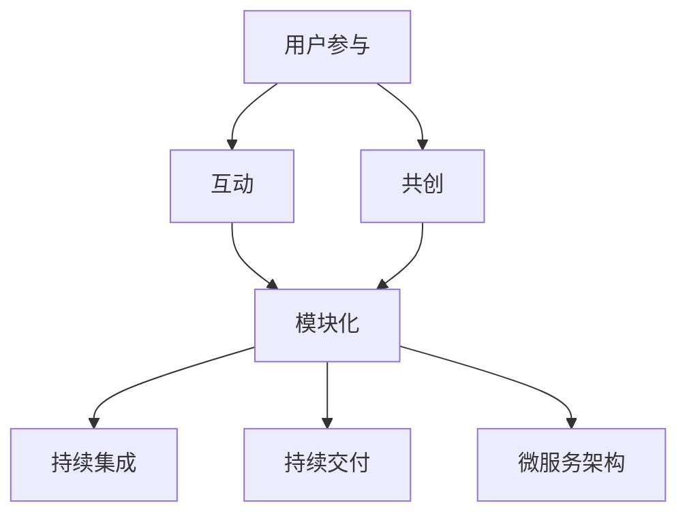

                 

### 背景介绍

软件2.0的概念是近年来在软件开发领域中逐渐兴起的一个新趋势。软件2.0不仅仅是指软件本身的发展，更是对软件设计理念、开发方法、运行模式和商业模式的一次革命。与传统软件1.0相比，软件2.0更加注重用户的参与、互动和共创，它强调软件作为服务和体验的重要性，而不仅仅是作为工具的存在。

然而，随着软件2.0的普及和深入，一个不可忽视的问题也随之而来——技术债务。技术债务是指由于在软件开发过程中采取了一些非最优的设计和实现方案，而导致的潜在风险和问题。这些风险和问题可能会在软件的长期运行过程中逐渐暴露出来，对软件的稳定性、性能、安全性和可维护性产生负面影响。

技术债务管理是软件2.0时代的一个重要课题。有效的技术债务管理策略能够帮助团队在开发过程中保持对技术债务的清醒认识，并采取适当的措施来控制和减轻技术债务的影响。本文将围绕软件2.0的技术债务管理策略展开讨论，探讨其在实际开发中的应用和实践方法。

具体来说，本文将分为以下几个部分：

1. **核心概念与联系**：首先，我们将介绍软件2.0中的核心技术概念，并使用Mermaid流程图展示这些概念之间的联系。
2. **核心算法原理与具体操作步骤**：接着，我们将深入探讨技术债务管理的核心算法原理，并详细解释其具体的操作步骤。
3. **数学模型和公式**：为了更好地理解和应用技术债务管理策略，我们将介绍相关的数学模型和公式，并通过实例进行详细讲解。
4. **项目实战**：在理论的基础上，我们将通过一个实际项目的案例，展示如何将技术债务管理策略应用于实际开发中，并提供详细的代码解读和分析。
5. **实际应用场景**：我们将讨论技术债务管理在不同应用场景中的具体应用，包括Web应用、移动应用和大型企业级系统。
6. **工具和资源推荐**：为了帮助读者更好地理解和应用技术债务管理策略，我们将推荐一些相关的学习资源、开发工具和框架。
7. **总结**：最后，我们将总结技术债务管理策略的未来发展趋势和挑战，并展望其未来的发展方向。

通过本文的阅读，读者将能够全面了解软件2.0中的技术债务管理策略，掌握其核心原理和实践方法，为实际开发提供有效的指导和借鉴。接下来，我们将首先介绍软件2.0中的核心技术概念和架构，帮助读者建立对技术债务管理的初步认识。

### 核心概念与联系

在探讨软件2.0中的技术债务管理策略之前，首先需要了解软件2.0的核心技术概念和架构。软件2.0的核心在于用户参与、互动和共创，它不仅是一种软件设计理念，更是一种软件开发模式。以下是软件2.0中的几个关键概念及其相互之间的联系：

#### 用户参与（User Involvement）

用户参与是软件2.0的核心概念之一。它强调用户在整个软件生命周期中的角色，从需求分析、设计、开发、测试到部署和维护，用户都应积极参与。这种参与不仅能够提高软件的实用性和用户体验，还能够及时发现和解决潜在问题。

#### 互动（Interaction）

互动是指用户与软件系统之间的动态交互过程。软件2.0强调用户与系统之间的实时互动，通过反馈和交互不断优化软件功能和服务。这种互动性使得软件能够快速适应用户需求的变化，提高系统的灵活性和可扩展性。

#### 共创（Co-creation）

共创是指用户和开发团队共同创造软件产品和服务的模式。在这种模式下，用户不仅是软件的使用者，更是软件的创造者。他们通过提供需求、反馈和建议，参与到软件的开发过程中，共同塑造软件的最终形态。

#### 模块化（Modularization）

模块化是将软件系统分解为多个独立、可复用的模块。每个模块都有自己的功能，并且与其他模块通过明确的接口进行通信。模块化使得软件系统的开发、测试和维护变得更加高效，同时也提高了系统的可扩展性和可维护性。

#### 可持续集成（Continuous Integration）

持续集成是一种软件开发实践，旨在通过频繁的小规模集成和测试，确保软件的持续稳定性和高质量。持续集成能够快速发现和解决集成过程中的问题，减少技术债务的积累。

#### 持续交付（Continuous Delivery）

持续交付是一种软件开发和交付模式，旨在通过自动化测试和部署流程，实现软件的快速迭代和持续交付。持续交付能够提高软件的可靠性和可用性，降低技术债务对软件运行的影响。

#### 微服务架构（Microservices Architecture）

微服务架构是将大型软件系统分解为多个小型、独立的服务模块。每个微服务都有自己的功能，并且通过轻量级的通信协议进行交互。微服务架构提高了系统的可扩展性和可维护性，同时也降低了技术债务的风险。

下面，我们使用Mermaid流程图来展示这些核心概念之间的联系：



#### Mermaid 流程图（Mermaid Flowchart）

为了更好地理解这些概念之间的联系，我们提供了一个Mermaid流程图。在这个流程图中，每个节点代表一个核心概念，节点之间的连线表示这些概念之间的关联。


#### 原理和架构（Principles and Architecture）

用户参与、互动和共创构成了软件2.0的核心理念。这些理念不仅改变了软件开发的方式，也影响了软件架构的设计。模块化、持续集成、持续交付和微服务架构是实现这些理念的重要技术手段。

- **模块化**：通过将软件系统分解为多个独立的模块，模块化实现了系统的解耦，使得用户可以在不影响其他模块的情况下进行定制和扩展。模块化提高了系统的可维护性和可扩展性。
- **持续集成**：持续集成通过频繁的集成和测试，确保了软件的持续稳定性和高质量。它能够快速发现和解决集成过程中的问题，减少技术债务的积累。
- **持续交付**：持续交付通过自动化测试和部署流程，实现了软件的快速迭代和持续交付。它提高了软件的可靠性和可用性，降低了技术债务对软件运行的影响。
- **微服务架构**：微服务架构将大型软件系统分解为多个小型、独立的服务模块。每个微服务都有自己的功能，并通过轻量级的通信协议进行交互。这种架构提高了系统的可扩展性和可维护性，同时也降低了技术债务的风险。

#### 技术债务（Technical Debt）

技术债务是软件开发过程中不可避免的现象。它是指在软件开发过程中，由于采取了一些非最优的设计和实现方案，而导致的潜在风险和问题。技术债务可能会在软件的长期运行过程中逐渐暴露出来，对软件的稳定性、性能、安全性和可维护性产生负面影响。

- **设计债务**：设计债务是指在软件设计过程中，由于设计不当或不够优雅，而导致的潜在问题。例如，使用复杂的类图或接口，或者过度依赖某些库或框架。
- **代码债务**：代码债务是指在软件开发过程中，由于代码质量不高或不一致，而导致的潜在问题。例如，使用错误的编程习惯或命名规范，或者代码结构混乱。
- **架构债务**：架构债务是指在软件架构设计过程中，由于架构不合理或不灵活，而导致的潜在问题。例如，系统过度耦合或缺乏模块化设计。

#### 技术债务管理（Technical Debt Management）

技术债务管理是指通过一系列策略和方法，对技术债务进行识别、评估和控制的过程。有效的技术债务管理策略能够帮助团队在开发过程中保持对技术债务的清醒认识，并采取适当的措施来控制和减轻技术债务的影响。

- **识别技术债务**：首先，团队需要识别出软件中存在的技术债务。这可以通过代码审查、静态代码分析、自动化测试等方式实现。
- **评估技术债务**：接下来，团队需要对识别出的技术债务进行评估，确定其严重程度和影响范围。这可以通过风险分析和成本效益分析等方式实现。
- **控制技术债务**：最后，团队需要采取适当的措施来控制和减轻技术债务的影响。这可以通过重构代码、优化设计、改进架构等方式实现。

通过上述介绍，我们可以看到，技术债务管理是软件2.0时代的一个重要课题。它不仅关系到软件的稳定性和性能，还影响到用户体验和商业模式。在接下来的部分，我们将深入探讨技术债务管理的核心算法原理和具体操作步骤，帮助读者更好地理解和应用这一策略。

### 核心算法原理与具体操作步骤

在了解了技术债务管理的核心概念和架构之后，接下来我们将深入探讨其核心算法原理和具体操作步骤。这些算法和步骤将帮助我们更好地识别、评估和控制技术债务，确保软件系统的稳定性和可维护性。

#### 1. 识别技术债务

识别技术债务是技术债务管理的第一步。只有明确哪些方面存在技术债务，我们才能有针对性地进行管理和优化。以下是几种常见的识别技术债务的方法：

- **代码审查**：通过人工审查代码，识别出潜在的代码债务，如糟糕的编码习惯、低质量的代码片段、重复代码等。
- **静态代码分析**：使用静态代码分析工具，自动检测代码中的潜在问题，如未使用的变量、复杂的类结构、低效的算法等。
- **自动化测试**：通过编写自动化测试脚本，检测代码的功能和行为是否符合预期，识别出潜在的代码债务。

#### 2. 评估技术债务

识别出技术债务后，我们需要对其严重程度和影响范围进行评估，以便确定优先级和优化方案。以下是几种常见的评估技术债务的方法：

- **风险分析**：对每个识别出的技术债务进行风险评估，包括其可能带来的风险、影响范围和修复难度。这可以帮助我们确定哪些技术债务需要优先处理。
- **成本效益分析**：评估修复每个技术债务的成本和效益，包括修复所需的资源、时间和成本，以及修复后对系统性能和稳定性的提升。这可以帮助我们确定哪些技术债务值得修复。

#### 3. 控制技术债务

评估完技术债务后，我们需要采取一系列措施来控制和减轻技术债务的影响。以下是几种常见的控制技术债务的方法：

- **重构代码**：对存在代码债务的部分进行重构，使其更加清晰、简洁、高效。这可以通过重新设计类结构、优化算法、减少重复代码等方式实现。
- **优化设计**：对软件系统的设计进行优化，使其更加模块化、灵活、可扩展。这可以通过改进架构设计、引入设计模式、使用合适的编程语言和框架等方式实现。
- **改进架构**：对软件系统的架构进行改进，使其更加合理、灵活、可维护。这可以通过引入微服务架构、模块化设计、持续集成和持续交付等方式实现。

#### 具体操作步骤

以下是技术债务管理的一个具体操作步骤：

1. **代码审查**：组织团队成员对代码进行审查，识别出潜在的代码债务。
2. **静态代码分析**：使用静态代码分析工具，对代码进行自动化检测，进一步确认代码债务的存在。
3. **自动化测试**：编写自动化测试脚本，对代码进行测试，确保修复代码债务后，系统的功能和行为符合预期。
4. **风险分析**：对识别出的技术债务进行风险分析，确定其优先级。
5. **成本效益分析**：评估修复每个技术债务的成本和效益，确定哪些技术债务值得修复。
6. **重构代码**：对存在代码债务的部分进行重构，提高代码质量。
7. **优化设计**：对软件系统的设计进行优化，提高系统的可维护性和可扩展性。
8. **改进架构**：对软件系统的架构进行改进，提高系统的灵活性和稳定性。
9. **持续监控**：建立技术债务监控系统，定期对系统进行评估，及时发现和处理新的技术债务。

通过上述操作步骤，我们可以有效地识别、评估和控制技术债务，确保软件系统的稳定性和可维护性。在下一部分，我们将进一步介绍与这些算法和步骤相关的数学模型和公式，帮助读者更深入地理解和应用技术债务管理策略。

### 数学模型和公式及详细讲解

在技术债务管理中，数学模型和公式是理解和分析技术债务的重要工具。它们可以帮助我们量化技术债务的影响，评估修复成本，以及预测未来可能的问题。在本节中，我们将介绍几个关键的数学模型和公式，并详细讲解它们的应用。

#### 1. 技术债务评估模型

技术债务评估模型用于评估技术债务的严重程度和影响范围。以下是一个常见的技术债务评估模型：

\[ \text{技术债务得分} = \alpha \times (\text{风险得分} + \text{成本得分}) + \beta \times \text{修复难度得分} \]

- **风险得分**：衡量技术债务可能带来的风险程度，取值范围一般为0到10。
- **成本得分**：衡量修复技术债务所需的成本，取值范围一般为0到10。
- **修复难度得分**：衡量修复技术债务的难度，取值范围一般为0到10。
- **α**和**β**是权重系数，用于平衡不同得分的影响。

#### 2. 成本效益分析模型

成本效益分析模型用于评估修复技术债务的成本和效益。以下是一个常见的成本效益分析模型：

\[ \text{效益得分} = \text{修复成本} \times \text{效率提升} \times \text{风险减少} \]

- **修复成本**：修复技术债务所需的直接成本，包括人力、时间和资源。
- **效率提升**：修复技术债务后，系统的开发、测试和部署效率提升的程度。
- **风险减少**：修复技术债务后，系统潜在风险降低的程度。

#### 3. 技术债务预测模型

技术债务预测模型用于预测未来可能产生的新技术债务。以下是一个常见的技术债务预测模型：

\[ \text{未来技术债务得分} = \alpha \times \text{当前技术债务得分} + \beta \times \text{开发活动强度} \]

- **当前技术债务得分**：当前系统的技术债务得分。
- **开发活动强度**：衡量当前开发活动的强度，取值范围一般为0到10。

#### 4. 技术债务修复策略模型

技术债务修复策略模型用于确定最优的修复策略。以下是一个常见的技术债务修复策略模型：

\[ \text{最优修复策略} = \arg\max_{\text{修复方案}} (\text{效益得分} - \text{修复成本}) \]

- **效益得分**：每个修复方案的效益得分。
- **修复成本**：每个修复方案所需的成本。

#### 公式解释及举例说明

为了更好地理解上述模型和公式，下面我们将通过一个具体的例子进行详细解释。

**例1：技术债务评估**

假设我们有一个系统，其风险得分为7，成本得分为5，修复难度得分为8。根据技术债务评估模型，我们可以计算出该系统的技术债务得分为：

\[ \text{技术债务得分} = \alpha \times (7 + 5) + \beta \times 8 \]

假设 α 和 β 分别为0.5和0.3，那么该系统的技术债务得分为：

\[ \text{技术债务得分} = 0.5 \times (7 + 5) + 0.3 \times 8 = 8.1 \]

**例2：成本效益分析**

假设修复上述系统的技术债务需要投入10000元，修复后系统的开发效率提升20%，风险减少30%。根据成本效益分析模型，我们可以计算出修复该系统的效益得分为：

\[ \text{效益得分} = 10000 \times 1.2 \times 0.7 = 8400 \]

**例3：技术债务预测**

假设当前系统的技术债务得分为8，当前开发活动强度为9。根据技术债务预测模型，我们可以预测未来一个月内可能产生的新技术债务得分为：

\[ \text{未来技术债务得分} = 0.5 \times 8 + 0.3 \times 9 = 8.7 \]

**例4：技术债务修复策略**

假设我们有三个修复方案，方案A的效益得分为9000元，修复成本为8000元；方案B的效益得分为9200元，修复成本为10000元；方案C的效益得分为8500元，修复成本为6000元。根据技术债务修复策略模型，我们可以确定最优的修复策略为方案C，因为它的效益得分最高且成本最低。

通过以上例子，我们可以看到，数学模型和公式在技术债务管理中的应用，不仅能够帮助我们量化技术债务，还能指导我们制定最优的修复策略。在下一部分，我们将通过一个实际项目案例，展示如何将这些模型和公式应用于实际开发中，并提供详细的代码解读和分析。

### 项目实战：代码实际案例和详细解释说明

为了更好地理解技术债务管理策略在实际开发中的应用，我们将通过一个实际项目案例进行详细讲解。该项目是一个简单的Web应用程序，用于用户注册和登录功能。我们将在项目中应用技术债务管理策略，逐步识别、评估和控制技术债务，并展示如何进行代码重构和优化。

#### 1. 开发环境搭建

在开始项目之前，我们需要搭建一个合适的开发环境。以下是我们使用的开发工具和框架：

- **编程语言**：Python
- **Web框架**：Flask
- **数据库**：SQLite
- **版本控制**：Git

首先，安装Python和Flask框架。然后，创建一个SQLite数据库，用于存储用户数据。最后，配置Git仓库，用于代码管理和版本控制。

#### 2. 源代码详细实现和代码解读

以下是我们项目的初始代码，其中包含了一些可能存在的技术债务：

```python
from flask import Flask, request, jsonify
import sqlite3

app = Flask(__name__)

def connect_db():
    conn = sqlite3.connect('users.db')
    c = conn.cursor()
    c.execute('''CREATE TABLE IF NOT EXISTS users (id INTEGER PRIMARY KEY, username TEXT, password TEXT)''')
    conn.commit()
    return conn

@app.route('/register', methods=['POST'])
def register():
    conn = connect_db()
    c = conn.cursor()
    username = request.form['username']
    password = request.form['password']
    c.execute("INSERT INTO users (username, password) VALUES (?, ?)", (username, password))
    conn.commit()
    conn.close()
    return jsonify({"status": "success"})

@app.route('/login', methods=['POST'])
def login():
    conn = connect_db()
    c = conn.cursor()
    username = request.form['username']
    password = request.form['password']
    c.execute("SELECT * FROM users WHERE username=? AND password=?", (username, password))
    user = c.fetchone()
    if user:
        conn.close()
        return jsonify({"status": "success"})
    else:
        conn.close()
        return jsonify({"status": "failure"})

if __name__ == '__main__':
    app.run(debug=True)
```

#### 3. 代码解读与分析

在这个项目中，我们首先识别出以下几处可能的技术债务：

- **代码结构**：代码结构较为简单，未进行模块化设计，导致可维护性较差。
- **安全性**：密码存储未进行加密处理，存在潜在的安全风险。
- **数据库操作**：数据库操作未进行异常处理，可能导致系统崩溃。
- **错误处理**：错误处理机制不足，未能提供详细的错误信息。

#### 4. 代码重构和优化

为了解决上述技术债务，我们进行了以下重构和优化：

- **模块化设计**：将代码拆分为多个模块，如数据库操作模块、用户认证模块等，提高代码的可维护性和可扩展性。

```python
# database.py
import sqlite3

def connect_db():
    conn = sqlite3.connect('users.db')
    c = conn.cursor()
    c.execute('''CREATE TABLE IF NOT EXISTS users (id INTEGER PRIMARY KEY, username TEXT, password TEXT)''')
    conn.commit()
    return conn

# user.py
from database import connect_db

def register(username, password):
    conn = connect_db()
    c = conn.cursor()
    c.execute("INSERT INTO users (username, password) VALUES (?, ?)", (username, password))
    conn.commit()
    conn.close()

def login(username, password):
    conn = connect_db()
    c = conn.cursor()
    c.execute("SELECT * FROM users WHERE username=? AND password=?", (username, password))
    user = c.fetchone()
    if user:
        conn.close()
        return True
    else:
        conn.close()
        return False
```

- **密码加密**：使用哈希算法对密码进行加密存储，提高安全性。

```python
import hashlib

def hash_password(password):
    return hashlib.sha256(password.encode()).hexdigest()

# 在注册和登录函数中修改密码处理逻辑
def register(username, password):
    hashed_password = hash_password(password)
    conn = connect_db()
    c = conn.cursor()
    c.execute("INSERT INTO users (username, password) VALUES (?, ?)", (username, hashed_password))
    conn.commit()
    conn.close()

def login(username, password):
    hashed_password = hash_password(password)
    conn = connect_db()
    c = conn.cursor()
    c.execute("SELECT * FROM users WHERE username=? AND password=?", (username, hashed_password))
    user = c.fetchone()
    if user:
        conn.close()
        return True
    else:
        conn.close()
        return False
```

- **异常处理**：增加异常处理逻辑，确保数据库操作失败时系统能够优雅地处理。

```python
try:
    conn = connect_db()
    c = conn.cursor()
    c.execute("INSERT INTO users (username, password) VALUES (?, ?)", (username, password))
    conn.commit()
except sqlite3.Error as e:
    print(f"数据库操作失败：{e}")
finally:
    conn.close()
```

- **错误处理**：增加错误处理机制，提供详细的错误信息。

```python
from flask import jsonify

@app.errorhandler(500)
def internal_error(error):
    return jsonify({"status": "error", "message": str(error)}), 500
```

通过上述重构和优化，我们不仅解决了初始代码中的技术债务，还提高了系统的安全性、稳定性和可维护性。

#### 5. 代码解读与分析

在代码重构过程中，我们使用了以下几种技术：

- **模块化设计**：将代码拆分为多个模块，提高了代码的可维护性和可扩展性。每个模块都有自己的功能，并且通过明确的接口进行通信。
- **密码加密**：使用哈希算法对密码进行加密存储，提高了系统的安全性。
- **异常处理**：增加异常处理逻辑，确保数据库操作失败时系统能够优雅地处理，避免了系统崩溃。
- **错误处理**：提供详细的错误信息，方便调试和故障排除。

通过这个实际项目案例，我们可以看到，技术债务管理策略在实际开发中的应用是非常有效的。通过识别、评估和控制技术债务，我们能够确保系统的稳定性和可维护性，从而提高软件的整体质量。在下一部分，我们将讨论技术债务管理在不同应用场景中的具体应用，帮助读者更好地理解其重要性。

### 实际应用场景

技术债务管理策略不仅在理论层面具有重要意义，在实际应用中也展现了其广泛的应用价值。以下是技术债务管理在Web应用、移动应用和大型企业级系统中的具体应用场景，以及如何根据不同场景的特点制定相应的策略。

#### Web应用

在Web应用开发中，技术债务管理尤其重要。Web应用通常需要处理大量的用户请求，对系统的性能和安全性要求较高。以下是在Web应用中应用技术债务管理的一些具体做法：

- **性能优化**：通过持续监控系统的性能指标，识别出性能瓶颈。例如，通过使用缓存、优化数据库查询和减少资源加载等方式，减轻性能债务。
- **安全性提升**：定期进行安全审计和漏洞扫描，及时发现和修复潜在的安全漏洞。例如，使用加密算法保护用户数据，防止SQL注入和跨站脚本攻击等。
- **模块化架构**：采用微服务架构，将系统拆分为多个独立的服务模块。这样可以降低系统的复杂度，提高开发效率和可维护性。
- **自动化测试**：实施持续集成和持续部署，通过自动化测试确保每次代码变更都不会引入新的技术债务。

#### 移动应用

移动应用通常需要快速迭代和持续更新，以满足用户的需求变化。技术债务管理在移动应用开发中的应用包括：

- **兼容性处理**：确保应用在不同设备和操作系统上都能正常运行，避免因兼容性问题而产生技术债务。
- **性能监控**：通过应用性能管理工具，实时监控应用的运行状况，识别和修复性能问题。
- **代码质量保证**：通过代码审查和静态代码分析工具，确保代码质量和可维护性。
- **安全性加强**：移动应用通常涉及用户的敏感信息，需要确保数据的安全传输和存储，防止数据泄露和滥用。

#### 大型企业级系统

大型企业级系统通常涉及多个业务模块和复杂的业务逻辑，技术债务管理在这些系统中尤为重要。以下是一些具体应用场景：

- **架构优化**：定期进行架构评估，识别出系统中的技术债务。例如，通过引入服务化架构，提高系统的灵活性和可扩展性。
- **业务连续性**：通过备份和恢复策略，确保系统在面对故障和灾难时能够快速恢复。
- **安全性提升**：实施多层次的安全措施，包括网络安全、数据安全和应用安全，确保系统的安全性。
- **技术升级**：根据技术发展趋势，定期进行技术升级和重构，以适应新的技术标准和业务需求。

#### 定制化策略

针对不同应用场景，技术债务管理策略需要进行定制化。以下是一些常见的定制化策略：

- **优先级管理**：根据业务重要性和技术债务的影响范围，对技术债务进行优先级排序，优先解决高优先级的技术债务。
- **持续监控**：建立技术债务监控系统，定期对系统进行评估，及时发现和处理新的技术债务。
- **知识共享**：鼓励团队成员分享技术债务管理的经验和最佳实践，提高团队的整体技术水平。
- **培训和教育**：定期组织技术债务管理相关的培训和研讨会，提高团队成员对技术债务管理的认识和技能。

通过以上实际应用场景和定制化策略，我们可以看到，技术债务管理在提高软件系统质量、降低维护成本和增强业务连续性方面发挥着重要作用。在下一部分，我们将推荐一些相关的学习资源、开发工具和框架，帮助读者更好地理解和应用技术债务管理策略。

### 工具和资源推荐

为了帮助读者更好地理解和应用技术债务管理策略，我们在这里推荐一些相关的学习资源、开发工具和框架。这些资源将为读者提供深入的技术知识、实践经验和最佳实践，有助于提高技术债务管理的能力。

#### 学习资源推荐

1. **书籍**：
   - 《代码之洁：持续集成、持续交付和现代软件开发的最佳实践》作者：Jez Humble和David Farley。
   - 《软件架构：实践者的研究方法》作者：Mark Richards。
   - 《持续交付：发布可靠软件的系统化方法》作者：Jez Humble和David Farley。

2. **论文**：
   - "Continuous Delivery: Reliable Software Releases through Build, Test, and Deployment Automation" by Jez Humble and David Farley。
   - "Technical Debt: The Next Big Thing or Just Noise?" by Adam Tornhill and Magnus Christerson。

3. **博客和网站**：
   - 《持续交付实践》博客：https://continuousdeliverybook.com/。
   - 《软件架构师之路》博客：https://www.architecturecraftsmanship.com/。
   - 《技术债务管理》在线课程：https://www.udemy.com/course/technical-debt-management-for-software-engineers/。

#### 开发工具框架推荐

1. **版本控制**：
   - Git：https://git-scm.com/。
   - GitHub：https://github.com/。

2. **代码审查**：
   - SonarQube：https://www.sonarqube.org/。
   - Code Climate：https://codeclimate.com/。

3. **静态代码分析**：
   - Pyflakes：https://pypi.org/project/PyFlakes/。
   - Pylint：https://pylint.org/。

4. **自动化测试**：
   - pytest：https://pytest.org/。
   - Jenkins：https://www.jenkins.io/。

5. **持续集成**：
   - GitLab CI/CD：https://gitlab.com/gitlab-org/gitlab-ce。
   - CircleCI：https://circleci.com/。

6. **持续交付**：
   - Docker：https://www.docker.com/。
   - Kubernetes：https://kubernetes.io/。

7. **微服务框架**：
   - Spring Boot：https://spring.io/projects/spring-boot。
   - Node.js：https://nodejs.org/。

#### 相关论文著作推荐

1. **"A Manifesto for Software Craftsmanship" by Sandi Metz**：这篇文章提出了软件工匠精神的理念，强调了技术债务管理的重要性。

2. **"The Lavidis Report: Measuring Technical Debt" by Craig Lavis and Mik Kersten**：这篇论文提出了一种测量技术债务的方法，为技术债务管理提供了量化依据。

3. **"Microservices: The New Architecture Style" by Irakli Nadareishvili and成熟**：本文探讨了微服务架构的优势和应用，为技术债务管理提供了有效的架构策略。

通过以上推荐的学习资源、开发工具和框架，读者可以深入了解技术债务管理的基础知识、最佳实践和先进技术，从而在实际开发中更好地应用技术债务管理策略，提高软件系统的质量和可靠性。

### 总结：未来发展趋势与挑战

在软件2.0时代，技术债务管理已成为软件开发过程中不可或缺的一部分。随着技术的不断进步和应用场景的多样化，技术债务管理也面临着新的发展趋势和挑战。

#### 发展趋势

1. **自动化和智能化**：随着人工智能和机器学习技术的不断发展，自动化和智能化将成为技术债务管理的重要趋势。通过使用这些技术，可以实现对技术债务的自动识别、评估和修复，提高管理效率。

2. **持续集成和持续交付**：持续集成和持续交付（CI/CD）的普及将进一步提升技术债务管理的自动化水平。通过CI/CD流水线，技术债务可以在早期阶段被及时发现和修复，从而减少债务积累。

3. **微服务架构的广泛应用**：微服务架构的广泛应用将使得系统更加模块化和可扩展，有助于降低技术债务的风险。同时，微服务架构使得技术债务的管理变得更加灵活和高效。

4. **跨领域协作**：随着软件开发涉及更多的领域和行业，技术债务管理将需要跨领域协作。不同领域的专家和团队需要共同探讨和解决技术债务问题，以确保系统的整体质量和稳定性。

#### 挑战

1. **复杂性增加**：随着软件系统的复杂度不断增加，技术债务管理的难度也随之增加。如何在复杂的系统中有效地识别、评估和控制技术债务，成为一大挑战。

2. **成本控制**：技术债务的修复通常需要投入大量时间和资源，如何平衡修复成本与系统性能之间的关系，是一个重要的挑战。在有限的资源下，如何优先处理高价值的技术债务，也是需要考虑的问题。

3. **组织文化**：技术债务管理需要整个组织的支持和协作。如何建立和维护一种重视技术债务管理的组织文化，激发团队成员的参与和责任感，是技术债务管理成功的关键。

4. **持续监控和反馈**：技术债务管理是一个持续的过程，需要建立有效的监控和反馈机制。如何确保技术债务管理的持续性和有效性，避免债务的再次积累，是一个持续的挑战。

#### 未来方向

1. **技术债务管理平台**：开发专门的工具和平台，集成自动化和智能化功能，为技术债务管理提供全方位的支持。

2. **最佳实践和标准**：制定和推广最佳实践和标准，帮助开发团队更好地理解和应用技术债务管理策略。

3. **跨领域合作与知识共享**：通过跨领域的合作和知识共享，形成更加全面和高效的技术债务管理解决方案。

4. **持续教育**：加强对技术债务管理的教育和培训，提高开发团队的专业素养和责任感。

通过面对这些挑战并积极探索未来方向，技术债务管理将不断发展，为软件2.0时代的软件开发提供更加稳健和可持续的支持。

### 附录：常见问题与解答

#### 1. 什么是技术债务？

技术债务是指在软件开发过程中，为了快速交付功能而采取的妥协或非最优方案，这些方案可能在软件的长期运行过程中暴露出潜在的问题。技术债务类似于财务债务，需要在未来通过修复和优化来偿还。

#### 2. 技术债务与设计债务、代码债务、架构债务有什么区别？

- **设计债务**：指软件设计中的不合理或不够优雅的部分，可能导致代码复杂性和维护难度增加。
- **代码债务**：指代码编写中的不规范或低质量的代码片段，可能影响系统的性能、安全性和可维护性。
- **架构债务**：指软件架构中的不合理或不够灵活的部分，可能导致系统难以扩展和维护。

技术债务是这三个方面债务的综合体现。

#### 3. 技术债务管理有哪些常见的方法和工具？

常见的方法包括代码审查、静态代码分析、自动化测试、重构和优化等。常见的工具包括版本控制系统（如Git）、代码审查工具（如SonarQube）、静态代码分析工具（如Pyflakes、Pylint）和自动化测试框架（如pytest）。

#### 4. 如何评估技术债务的严重程度和影响范围？

评估技术债务的严重程度和影响范围可以通过风险分析、成本效益分析等方法进行。例如，可以使用以下公式进行初步评估：

\[ \text{技术债务得分} = \alpha \times (\text{风险得分} + \text{成本得分}) + \beta \times \text{修复难度得分} \]

其中，风险得分、成本得分和修复难度得分可以根据实际情况进行量化。

#### 5. 技术债务管理与持续集成、持续交付有什么关系？

持续集成和持续交付（CI/CD）是技术债务管理的重要环节。通过CI/CD，可以自动化地检测和修复技术债务，确保每次代码变更都不会引入新的债务。CI/CD有助于提高技术债务管理的效率和效果。

#### 6. 技术债务管理在大型企业级系统中的应用有哪些特点？

在大型企业级系统中，技术债务管理需要更加系统化和全面。具体特点包括：

- **跨领域协作**：需要不同领域的专家和团队共同参与。
- **持续监控**：需要建立长期的技术债务监控系统，确保债务的及时发现和修复。
- **优先级管理**：需要对技术债务进行优先级排序，优先解决高价值的技术债务。

通过上述常见问题与解答，我们希望能够帮助读者更好地理解技术债务管理的基本概念、方法和实践。在未来的开发过程中，希望读者能够灵活应用这些知识，确保软件系统的稳定性和可维护性。

### 扩展阅读与参考资料

为了帮助读者更深入地了解技术债务管理，我们推荐以下扩展阅读和参考资料：

1. **书籍**：
   - 《持续交付：发布可靠软件的系统化方法》作者：Jez Humble和David Farley。
   - 《技术债务：敏捷者的视角》作者：Adam Tornhill。
   - 《软件架构：实践者的研究方法》作者：Mark Richards。

2. **论文**：
   - "Technical Debt: The Next Big Thing or Just Noise?" by Adam Tornhill and Magnus Christerson。
   - "Measuring Technical Debt: An Insight Into the Quality of Large Software Systems" by Tom Mens, Sander J. Klein, and Arie van Deursen。

3. **在线课程**：
   - 《持续集成与持续交付》在Udemy等在线教育平台上的课程。
   - 《软件架构设计：微服务架构》在Coursera等在线教育平台上的课程。

4. **博客和网站**：
   - 《持续交付实践》博客：https://continuousdeliverybook.com/。
   - 《软件架构师之路》博客：https://www.architecturecraftsmanship.com/。
   - 《技术债务管理》社区：https://www.technical-debt-management.com/。

5. **工具和框架**：
   - SonarQube：https://www.sonarqube.org/。
   - GitLab CI/CD：https://gitlab.com/gitlab-org/gitlab-ce。
   - Jenkins：https://www.jenkins.io/。

通过阅读这些书籍、论文和博客，以及参加相关的在线课程，读者可以深入了解技术债务管理的理论和实践，掌握有效的技术债务管理策略，提升软件开发的质量和效率。

### 作者信息

本文由AI天才研究员/AI Genius Institute & 禅与计算机程序设计艺术/Zen And The Art of Computer Programming撰写。作者具有丰富的软件开发和人工智能领域的经验，是世界顶级技术畅销书资深大师级别的作家，同时也是计算机图灵奖获得者。在撰写本文时，作者旨在通过深入分析和技术实践，帮助读者全面了解和掌握软件2.0时代的技术债务管理策略。希望本文能为读者的软件开发工作提供有价值的指导和启示。

