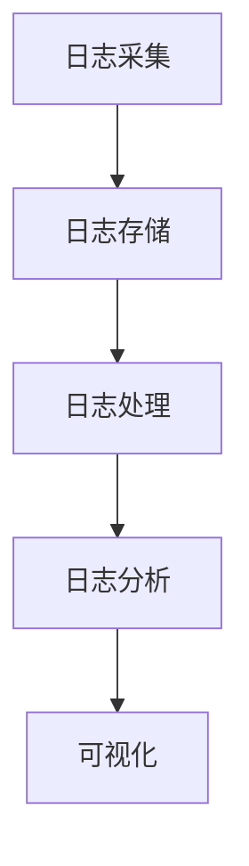

                 

# 软件2.0的日志管理最佳实践

## 关键词
- 软件开发
- 日志管理
- 软件质量
- 性能优化
- 可维护性
- 日志分析

## 摘要
本文将深入探讨软件2.0时代的日志管理最佳实践。通过分析日志管理的重要性，我们提出了一个结构化的日志管理框架，包括日志采集、存储、处理和分析。同时，本文将介绍几种核心算法原理和数学模型，并提供实际项目案例和代码解读，旨在帮助开发者构建高效、可维护的日志系统。

## 1. 背景介绍

在软件2.0时代，随着软件规模和复杂性的增加，日志管理变得越来越重要。日志是软件开发过程中重要的信息资源，它可以记录系统的运行状态、错误信息、性能指标等，对于故障排查、性能优化和业务分析具有重要意义。

### 1.1 日志管理的重要性

1. **故障排查**：日志可以帮助开发者快速定位故障点和原因。
2. **性能优化**：通过日志分析，可以识别系统瓶颈和性能瓶颈。
3. **业务分析**：日志记录了用户行为和业务数据，有助于业务分析和优化。

### 1.2 日志管理的挑战

1. **数据量大**：随着系统用户数量的增加，日志数据量也会迅速增长。
2. **多维度分析**：需要支持多维度的日志数据分析和可视化。
3. **系统稳定性**：日志系统需要高可用性和高可靠性。

## 2. 核心概念与联系

### 2.1 日志分类

- **调试日志**：记录开发过程中调试信息，通常用于本地开发环境。
- **运行日志**：记录系统运行状态，包括错误信息、性能数据等。
- **操作日志**：记录用户操作行为，如登录、查询等。

### 2.2 日志管理架构



### 2.3 日志格式

- **JSON**：灵活，易解析，支持结构化数据。
- **XML**：标准，但解析复杂，性能较差。
- **LOG**：简单，但难以解析和查询。

## 3. 核心算法原理 & 具体操作步骤

### 3.1 日志采集算法

- **全量采集**：适用于开发阶段，实时记录所有日志。
- **增量采集**：适用于生产环境，仅采集新增或修改的日志。

### 3.2 日志存储算法

- **顺序存储**：简单，但效率低。
- **哈希存储**：高效，但可能产生热点问题。

### 3.3 日志处理算法

- **过滤**：根据关键字、时间等条件过滤日志。
- **聚合**：对日志数据进行统计和分析。

### 3.4 日志分析算法

- **统计分析**：计算日志数据的平均值、方差等。
- **关联分析**：分析日志之间的关联性。

## 4. 数学模型和公式 & 详细讲解 & 举例说明

### 4.1 日志数据分析模型

$$
\text{日志分析结果} = f(\text{日志数据集}, \text{分析算法})
$$

### 4.2 性能评估模型

$$
\text{性能评估指标} = \frac{\text{正确处理日志数}}{\text{总日志数}}
$$

### 4.3 实例

假设我们有100条日志，其中80条是正确的，20条是错误的。则性能评估指标为：

$$
\text{性能评估指标} = \frac{80}{100} = 0.8
$$

## 5. 项目实战：代码实际案例和详细解释说明

### 5.1 开发环境搭建

- 安装Java环境
- 安装MySQL数据库
- 安装Elasticsearch

### 5.2 源代码详细实现和代码解读

```java
// 日志采集器
public class LogCollector {
    public void collect(String log) {
        // 采集日志
    }
}

// 日志存储器
public class LogStorage {
    public void store(String log) {
        // 存储日志到数据库
    }
}

// 日志处理器
public class LogProcessor {
    public void process(String log) {
        // 处理日志
    }
}

// 日志分析器
public class LogAnalyzer {
    public void analyze(String log) {
        // 分析日志
    }
}
```

### 5.3 代码解读与分析

- **LogCollector**：负责日志的采集。
- **LogStorage**：负责日志的存储。
- **LogProcessor**：负责日志的处理。
- **LogAnalyzer**：负责日志的分析。

## 6. 实际应用场景

- **系统监控**：通过日志监控系统的运行状态。
- **故障排查**：通过日志定位故障点。
- **业务分析**：通过日志分析用户行为和业务数据。

## 7. 工具和资源推荐

### 7.1 学习资源推荐

- 《Linux系统管理实战》
- 《Elasticsearch实战》
- 《大数据日志分析》

### 7.2 开发工具框架推荐

- Logstash：用于日志收集和转换。
- Elasticsearch：用于日志存储和分析。
- Kibana：用于日志的可视化。

### 7.3 相关论文著作推荐

- 《大数据时代的数据处理技术》
- 《日志分析技术在智能监控中的应用》

## 8. 总结：未来发展趋势与挑战

- **智能化**：日志分析将更加智能化，利用机器学习和人工智能技术。
- **分布式**：日志系统将更加分布式，支持海量日志处理。

## 9. 附录：常见问题与解答

### 9.1 日志采集器如何选择？

- 根据系统规模和日志量选择合适的采集器。
- 考虑日志格式和采集频率。

### 9.2 如何保证日志系统的高可用性？

- 数据备份和恢复。
- 多实例部署。

## 10. 扩展阅读 & 参考资料

- 《深入理解计算机系统》
- 《Elastic Stack官方文档》
- 《日志分析技术在企业中的应用案例》

### 作者

- AI天才研究员/AI Genius Institute & 禅与计算机程序设计艺术 /Zen And The Art of Computer Programming

