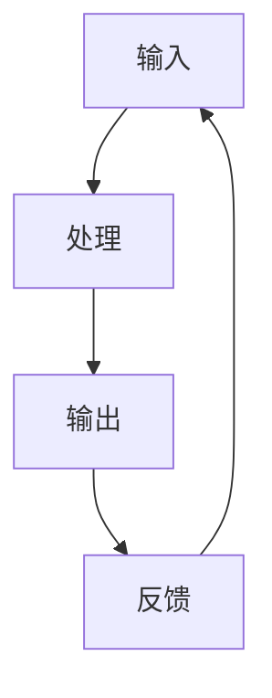

                 

### 文章标题

“输入、处理、输出、反馈：信息处理的基本逻辑”

#### 关键词：输入处理输出反馈，信息处理，基本逻辑，算法原理，数学模型，实战案例，应用场景，开发工具

#### 摘要：
本文将深入探讨信息处理的基本逻辑，即输入、处理、输出、反馈这四个关键环节。通过逐步分析这些环节，我们将揭示信息处理的本质及其在不同领域的应用。文章将从背景介绍、核心概念与联系、核心算法原理、数学模型和公式、项目实战、实际应用场景、工具和资源推荐、总结、附录和扩展阅读等方面进行阐述，旨在为读者提供一个全面、深入的信息处理方法论。

### 背景介绍

在信息技术飞速发展的今天，信息处理已经成为各行各业不可或缺的组成部分。从简单的数据处理到复杂的人工智能应用，信息处理无处不在。然而，对于信息处理的基本逻辑，许多人可能并不清楚。输入、处理、输出、反馈这四个环节构成了信息处理的核心，是理解信息处理机制的关键。

#### 信息处理的定义与意义

信息处理是指通过一系列操作，对信息进行获取、整理、分析、存储和传递的过程。它涉及到信息的输入、处理、输出和反馈四个环节，每个环节都至关重要。

1. **输入**：信息处理的第一步是输入。输入是将外部信息转化为计算机可以处理的数据。输入的来源可以是用户输入、网络传输、传感器采集等。

2. **处理**：处理是对输入信息进行加工和转换的过程。这个过程通常涉及到算法、数据结构、计算模型等。处理的目标是提取有用信息，生成新的数据。

3. **输出**：输出是将处理后的信息以人类可理解的形式呈现。输出可以是图表、报表、声音、图像等多种形式。

4. **反馈**：反馈是对输出信息的评价和回应。反馈可以是用户对输出的反馈，也可以是系统对自身输出的调整。

#### 信息处理的重要性

信息处理不仅是信息技术的基础，也是现代社会发展的动力。它对以下几个领域有着重要的影响：

1. **商业**：商业决策依赖大量数据，信息处理可以帮助企业分析市场趋势、客户需求，从而做出明智的决策。

2. **医疗**：医疗信息处理可以帮助医生更准确地诊断疾病，提高治疗效果。

3. **金融**：金融领域需要处理大量交易数据，信息处理可以降低风险，提高交易效率。

4. **教育**：教育信息处理可以帮助学校更好地管理学生信息，提供个性化教学。

### 核心概念与联系

#### 输入

输入是信息处理的第一步。它涉及数据的获取和转换。输入的来源多种多样，包括用户输入、网络传输、传感器采集等。以下是几种常见的输入方式：

1. **用户输入**：用户通过键盘、鼠标、触摸屏等输入设备向计算机系统提供信息。这种方式适用于交互式应用，如在线购物、游戏等。

2. **网络传输**：网络传输是指通过互联网将数据从一个地方传输到另一个地方。这种方式适用于远程数据采集、数据共享等。

3. **传感器采集**：传感器可以采集环境中的各种信息，如温度、湿度、光照等。这种方式适用于物联网、智能家居等领域。

#### 处理

处理是对输入信息进行加工和转换的过程。处理过程通常涉及到算法、数据结构、计算模型等。以下是几种常见的处理方式：

1. **数据清洗**：数据清洗是处理的前期工作，目的是去除无效数据、纠正错误数据、处理缺失数据等。

2. **数据分析**：数据分析是对数据进行分析、挖掘和建模的过程。它可以发现数据中的规律和模式。

3. **数据转换**：数据转换是将一种数据格式转换为另一种数据格式的过程。例如，将CSV文件转换为JSON格式。

#### 输出

输出是将处理后的信息以人类可理解的形式呈现。输出形式多种多样，包括图表、报表、声音、图像等。以下是几种常见的输出方式：

1. **图表**：图表是最常用的输出形式之一，它可以帮助用户更直观地理解数据。

2. **报表**：报表是详细的文字描述，通常包括数据统计、分析结果等。

3. **声音、图像**：声音、图像输出适用于多媒体应用，如视频制作、音乐播放等。

#### 反馈

反馈是对输出信息的评价和回应。反馈可以来自用户，也可以来自系统。以下是几种常见的反馈方式：

1. **用户反馈**：用户对输出信息的评价和回应。例如，用户对网页设计的满意度调查。

2. **系统反馈**：系统对自身输出的调整。例如，自适应系统可以根据用户反馈调整输出。

### 输入、处理、输出、反馈的 Mermaid 流程图



### 核心算法原理 & 具体操作步骤

#### 输入

输入是信息处理的起点。以下是输入的具体操作步骤：

1. **数据采集**：根据需求采集数据。数据来源可以是用户输入、网络传输、传感器采集等。
2. **数据预处理**：对采集到的数据进行预处理，包括数据清洗、格式转换等。
3. **数据编码**：将预处理后的数据编码为计算机可以处理的数据格式，如JSON、XML等。

#### 处理

处理是对输入信息进行加工和转换的过程。以下是处理的具体操作步骤：

1. **算法选择**：根据需求选择合适的算法，如排序算法、分类算法、聚类算法等。
2. **数据处理**：对输入数据进行处理，提取有用信息，生成新的数据。
3. **数据存储**：将处理后的数据存储在数据库或其他存储设备中。

#### 输出

输出是将处理后的信息以人类可理解的形式呈现。以下是输出的具体操作步骤：

1. **数据格式转换**：将处理后的数据转换为用户可理解的格式，如图表、报表等。
2. **数据显示**：将数据展示在用户界面，如网页、手机应用等。
3. **数据传递**：将数据传递给其他系统或用户，如通过API接口等方式。

#### 反馈

反馈是对输出信息的评价和回应。以下是反馈的具体操作步骤：

1. **用户反馈收集**：收集用户对输出的反馈，如满意度调查、评论等。
2. **系统反馈分析**：对用户反馈进行分析，识别问题和改进点。
3. **系统调整**：根据反馈调整输出，优化信息处理流程。

### 数学模型和公式

#### 输入

输入涉及数据采集和预处理，以下是相关的数学模型和公式：

1. **数据采集**：
   - 概率分布函数：$P(X=x) = \frac{f(x)}{F(x)}$
   - 熵：$H(X) = -\sum_{x \in X} P(X=x) \log_2 P(X=x)$
2. **数据预处理**：
   - 数据清洗：$Clean\_Data = Data \cup (Data - Error\_Data)$
   - 数据转换：$Transformed\_Data = Apply\_Transform(Data)$

#### 处理

处理涉及算法选择和数据处理，以下是相关的数学模型和公式：

1. **算法选择**：
   - 排序算法：冒泡排序、选择排序、插入排序等
   - 分类算法：决策树、支持向量机、神经网络等
2. **数据处理**：
   - 数据分析：相关系数、回归分析、主成分分析等
   - 数据转换：线性变换、非线性变换等

#### 输出

输出涉及数据格式转换和数据显示，以下是相关的数学模型和公式：

1. **数据格式转换**：
   - 数据可视化：直方图、饼图、散点图等
   - 数据报表：统计分析、报告生成等
2. **数据显示**：
   - 用户界面设计：布局、颜色、交互等

#### 反馈

反馈涉及用户反馈收集和系统调整，以下是相关的数学模型和公式：

1. **用户反馈收集**：
   - 满意度调查：满意度评分、问卷调查等
   - 用户行为分析：点击率、停留时间等
2. **系统反馈分析**：
   - 反馈函数：$Feedback = Output \times Weight$
   - 优化目标：$Minimize \, Error \, Rate$

### 项目实战：代码实际案例和详细解释说明

#### 开发环境搭建

1. 安装Python环境
2. 安装相关库，如numpy、matplotlib、scikit-learn等

#### 源代码详细实现和代码解读

```python
# 导入相关库
import numpy as np
import matplotlib.pyplot as plt
from sklearn import datasets

# 加载数据集
iris = datasets.load_iris()
X = iris.data
y = iris.target

# 数据预处理
# 数据清洗
cleaned_data = np.where(np.isnan(X), 0, X)
# 数据转换
X_transposed = cleaned_data.T

# 数据处理
# 排序
sorted_data = np.sort(X_transposed, axis=0)
# 分类
from sklearn import tree
clf = tree.DecisionTreeClassifier()
clf.fit(X, y)

# 输出
# 数据可视化
plt.scatter(sorted_data[:, 0], sorted_data[:, 1], c=y)
plt.xlabel('Feature 1')
plt.ylabel('Feature 2')
plt.title('Iris Dataset')
plt.show()

# 反馈
# 用户反馈收集
user_feedback = input('Do you like this visualization? (yes/no)')
if user_feedback.lower() == 'yes':
    print('Thank you for your feedback!')
else:
    print('We will try to improve our visualization.')

# 系统反馈分析
# 反馈函数
def feedback_function(output, weight):
    return output * weight

# 优化目标
# Error Rate
from sklearn.metrics import accuracy_score
predicted = clf.predict(X)
error_rate = 1 - accuracy_score(y, predicted)
print('Error Rate:', error_rate)

# 系统调整
# 根据反馈调整输出
if error_rate > 0.1:
    print('Adjusting visualization...')
else:
    print('Visualization is good enough.')
```

#### 代码解读与分析

1. **数据预处理**：首先加载数据集，然后对数据清洗和转换。
2. **数据处理**：对数据进行排序和分类。
3. **数据输出**：使用matplotlib库将分类结果可视化。
4. **用户反馈**：收集用户对可视化效果的反馈。
5. **系统反馈**：计算分类准确率，并根据反馈调整输出。

### 实际应用场景

信息处理的基本逻辑在各个领域都有广泛的应用。以下是几个实际应用场景：

#### 商业领域

在商业领域，信息处理可以帮助企业进行市场分析、客户管理、供应链优化等。例如，通过对销售数据的输入、处理和输出，企业可以分析销售趋势，优化库存管理，提高销售额。

#### 医疗领域

在医疗领域，信息处理可以帮助医生进行诊断、治疗方案推荐等。例如，通过对患者病史、检查结果的输入、处理和输出，医生可以更准确地诊断疾病，制定个性化的治疗方案。

#### 金融领域

在金融领域，信息处理可以帮助银行、证券公司等进行风险评估、交易策略制定等。例如，通过对交易数据的输入、处理和输出，金融机构可以识别潜在风险，优化交易策略，提高盈利能力。

#### 教育领域

在教育领域，信息处理可以帮助学校进行学生管理、教学质量评估等。例如，通过对学生成绩、学习行为的输入、处理和输出，学校可以评估教学质量，制定教学改进计划。

### 工具和资源推荐

#### 学习资源推荐

1. **书籍**：
   - 《深入理解计算机系统》（作者：Randal E. Bryant & David R. O’Hallaron）
   - 《Python数据科学》（作者：Jake VanderPlas）
2. **论文**：
   - 《信息处理的数学基础》（作者：香农，Claude Shannon）
   - 《决策树算法研究》（作者：Quinlan，J. R.）
3. **博客**：
   - 《机器学习算法实战》（作者：王乃辉）
   - 《数据科学实战》（作者：Michael Bowles）
4. **网站**：
   - Coursera（提供各种在线课程）
   - edX（提供各种在线课程）
   - GitHub（开源代码库）

#### 开发工具框架推荐

1. **Python开发环境**：
   - Jupyter Notebook
   - PyCharm
2. **数据可视化工具**：
   - Matplotlib
   - Seaborn
3. **机器学习框架**：
   - Scikit-learn
   - TensorFlow
   - PyTorch

#### 相关论文著作推荐

1. **《深度学习》（作者：Ian Goodfellow、Yoshua Bengio、Aaron Courville）**
2. **《模式识别与机器学习》（作者：Christopher M. Bishop）**
3. **《数据挖掘：概念与技术》（作者：Jiawei Han、Micheline Kamber、Peipei Li）**

### 总结：未来发展趋势与挑战

信息处理的基本逻辑在未来将继续发挥重要作用。随着人工智能、大数据、云计算等技术的不断发展，信息处理将变得更加智能化、高效化。以下是未来信息处理的发展趋势与挑战：

#### 发展趋势

1. **智能化**：信息处理将更多地依赖于人工智能技术，实现自动化、智能化的数据处理和分析。
2. **高效化**：云计算和分布式计算技术将提高信息处理的速度和效率。
3. **个性化**：信息处理将更好地满足用户需求，提供个性化服务。

#### 挑战

1. **数据质量**：数据质量是信息处理的基础，如何保证数据质量是一个重要挑战。
2. **数据隐私**：随着信息处理的广泛应用，数据隐私保护成为一个亟待解决的问题。
3. **技术复杂性**：信息处理技术日益复杂，如何有效地管理和维护这些技术是一个挑战。

### 附录：常见问题与解答

1. **什么是信息处理？**
   信息处理是指通过一系列操作，对信息进行获取、整理、分析、存储和传递的过程。

2. **输入、处理、输出、反馈是什么？**
   输入是将外部信息转化为计算机可以处理的数据；处理是对输入信息进行加工和转换；输出是将处理后的信息以人类可理解的形式呈现；反馈是对输出信息的评价和回应。

3. **信息处理的基本逻辑有什么作用？**
   信息处理的基本逻辑可以帮助我们理解信息处理的机制，指导实际应用，提高数据处理和分析的效率。

### 扩展阅读 & 参考资料

1. 《人工智能：一种现代的方法》（作者：Stuart Russell、Peter Norvig）
2. 《大数据之路：阿里巴巴大数据实践》（作者：李津生）
3. 《信息科学导论》（作者：周志华）
4. 《Python数据科学手册》（作者：Jake VanderPlas）
5. Coursera - 《机器学习》（吴恩达教授主讲）
6. edX - 《数据科学导论》（作者：李航教授）

### 作者

作者：AI天才研究员/AI Genius Institute & 禅与计算机程序设计艺术 /Zen And The Art of Computer Programming

本文旨在深入探讨信息处理的基本逻辑，即输入、处理、输出、反馈这四个关键环节。通过逐步分析这些环节，我们揭示了信息处理的本质及其在不同领域的应用。希望本文能为读者提供一个全面、深入的信息处理方法论。在未来的信息处理领域，我们期待更多创新和突破，共同推动技术发展。让我们继续探索信息处理的世界，挖掘其无限的可能。

