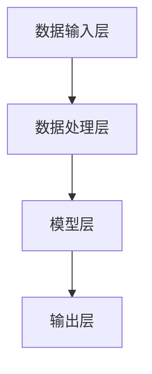
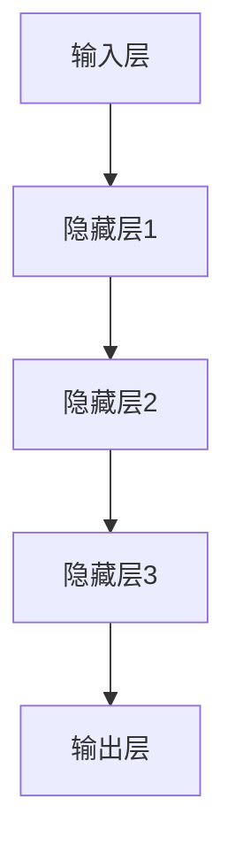

                 

### 背景介绍

边缘计算（Edge Computing）作为计算领域的重要分支，近年来受到了广泛关注。随着5G技术的迅速发展，边缘计算的应用场景日益丰富，智能应用的需求也随之增加。边缘大模型（Edge Large Model）作为一种新的技术解决方案，正逐渐成为5G时代的智能应用的关键驱动力。

边缘计算与云计算相比，具有延迟更低、带宽更高、计算能力更强的优势。这使得边缘计算在处理实时性要求高、计算密集型任务方面具有明显优势。例如，在自动驾驶、智能监控、工业自动化等领域，边缘计算可以实现对数据的实时分析和决策，从而提高系统的响应速度和可靠性。

5G技术的普及为边缘计算提供了更加稳定和高速的网络环境。5G网络具有高带宽、低延迟、大连接的特性，能够满足边缘计算对数据传输和实时处理的需求。此外，5G网络还具有高可靠性和高安全性，为边缘计算的应用提供了坚实的技术保障。

智能应用是边缘计算的重要应用领域。随着人工智能技术的不断发展，越来越多的智能应用需要依靠边缘计算来实现。边缘大模型作为一种结合了边缘计算和人工智能的新型技术，可以在边缘设备上实现复杂的智能分析任务，从而满足不同场景下的智能应用需求。

边缘大模型的兴起，不仅为5G时代的智能应用提供了新的解决方案，还推动了计算技术的创新和发展。在未来，边缘大模型有望成为智能应用的核心驱动力，助力各行各业实现智能化升级。

总之，边缘计算与5G技术的结合，为边缘大模型的发展奠定了基础。随着边缘大模型的不断成熟和应用，5G时代的智能应用将迎来新的发展机遇。本文将深入探讨边缘大模型的核心概念、算法原理、数学模型、项目实战、应用场景、工具资源以及未来发展趋势，为读者提供全面的技术解读和思考。让我们一步步分析推理，共同探索边缘大模型的无限可能。

### 核心概念与联系

#### 边缘大模型概述

边缘大模型是指运行在边缘设备（如智能手机、智能家居设备、工业机器人等）上的大型深度学习模型。这些模型具有高计算复杂度，可以在边缘设备上进行实时数据处理和智能分析。与传统的云计算模型相比，边缘大模型具有以下特点：

1. **高计算复杂度**：边缘大模型通常包含数百万甚至数亿个参数，需要进行大量的矩阵运算和神经网络计算。
2. **实时数据处理**：边缘大模型可以在边缘设备上实时接收和处理数据，无需依赖远程服务器。
3. **低延迟**：由于数据在本地处理，边缘大模型能够实现毫秒级的响应速度，满足实时性要求高的应用场景。
4. **设备独立性**：边缘大模型可以运行在各种类型的边缘设备上，无需特定的硬件配置。

边缘大模型的应用场景非常广泛，包括但不限于以下领域：

1. **智能监控**：利用边缘大模型进行实时图像识别和物体检测，实现智能安防、交通管理等。
2. **工业自动化**：利用边缘大模型进行实时数据分析和故障预测，提高生产效率和质量。
3. **智能家居**：利用边缘大模型进行语音识别、自然语言处理，实现智能语音助手等功能。
4. **健康医疗**：利用边缘大模型进行实时健康监测和疾病诊断，提高医疗服务水平。

#### 边缘计算与云计算的关系

边缘计算与云计算是相辅相成的两种计算模式。云计算通过提供强大的计算资源和存储能力，支持大规模数据处理和复杂计算任务。而边缘计算则通过在本地设备上执行计算任务，提高系统的响应速度和实时性。

1. **数据分布**：云计算处理的是集中式数据，而边缘计算处理的是分布式数据。边缘设备可以收集和存储本地数据，减少数据传输的延迟和带宽消耗。
2. **计算资源**：云计算依赖于远程服务器，具有强大的计算和存储能力。而边缘计算则依赖于本地设备，如智能手机、智能家居设备等，计算能力相对较弱。
3. **网络环境**：云计算依赖于稳定的网络连接，而边缘计算则依赖于本地网络，如Wi-Fi、蓝牙等。

#### 边缘大模型的架构

边缘大模型的架构可以分为以下几个部分：

1. **数据输入层**：边缘设备通过传感器、摄像头等采集数据，并将数据传输给边缘大模型。
2. **数据处理层**：边缘大模型对输入数据进行预处理，如缩放、归一化、滤波等，以适应模型的要求。
3. **模型层**：边缘大模型包含多个神经网络层，通过前向传播和反向传播算法进行训练和预测。
4. **输出层**：边缘大模型根据输入数据和模型参数，生成预测结果或决策。

#### Mermaid 流程图

以下是一个简单的Mermaid流程图，描述了边缘大模型的架构和数据处理过程：



#### 边缘大模型的优势

1. **低延迟**：由于数据在本地处理，边缘大模型可以实现毫秒级的响应速度，满足实时性要求高的应用场景。
2. **高带宽**：边缘大模型可以充分利用本地网络，实现高速数据传输，提高系统的整体性能。
3. **设备独立性**：边缘大模型可以运行在各种类型的边缘设备上，无需特定的硬件配置，降低设备成本。
4. **数据隐私**：边缘大模型在本地处理数据，减少数据传输过程中的隐私泄露风险。

#### 结论

边缘大模型是一种结合了边缘计算和人工智能的新型技术，具有低延迟、高带宽、设备独立性和数据隐私等优势。随着5G技术的普及和智能应用的需求增长，边缘大模型将在未来发挥越来越重要的作用。本文将深入探讨边缘大模型的核心算法原理、数学模型、项目实战、应用场景、工具资源以及未来发展趋势，为读者提供全面的技术解读和思考。

### 核心算法原理 & 具体操作步骤

边缘大模型的算法原理主要基于深度学习，特别是基于神经网络的大型模型。以下将详细解释边缘大模型的核心算法原理，并给出具体的操作步骤。

#### 1. 深度学习基础

深度学习是一种基于神经网络的机器学习技术，通过多层的非线性变换来提取数据中的特征。在深度学习中，神经网络由输入层、隐藏层和输出层组成。输入层接收外部输入数据，隐藏层对输入数据进行变换和提取特征，输出层生成最终预测结果。

##### 神经网络结构

以下是一个简单的神经网络结构图：



在神经网络中，每个神经元都通过权重和偏置与相邻的神经元相连。通过前向传播和反向传播算法，神经网络可以不断调整权重和偏置，以最小化预测误差。

##### 前向传播

前向传播是指将输入数据通过神经网络的前向路径传递，直到输出层。在每个隐藏层，神经元对输入数据进行加权求和，然后通过激活函数进行非线性变换。输出层的预测结果与真实标签之间的误差通过反向传播算法进行计算。

##### 反向传播

反向传播是指通过计算输出层误差，反向传播误差到每个隐藏层，并更新权重和偏置。这个过程称为梯度下降。通过多次迭代训练，神经网络可以逐渐优化模型参数，提高预测准确性。

#### 2. 边缘大模型算法原理

边缘大模型是在边缘设备上运行的深度学习模型，其核心算法原理与传统的深度学习模型类似，但在实际操作中存在一些特殊考虑。

##### 边缘设备限制

边缘设备通常具有计算能力有限、存储容量有限、能耗限制等特点。因此，边缘大模型需要在有限的计算资源下运行，同时保证较高的预测准确性。

##### 模型压缩

为了适应边缘设备的计算能力限制，边缘大模型通常采用模型压缩技术。模型压缩包括参数剪枝、量化、低秩分解等方法，可以显著降低模型的计算复杂度和存储需求。

##### 模型分解

边缘大模型可以将整个模型分解为多个子模型，每个子模型运行在不同的边缘设备上。这样可以充分利用设备的计算资源，提高整体系统的性能和效率。

##### 数据预处理

在边缘大模型中，数据预处理是非常重要的一环。由于边缘设备的存储和计算资源有限，需要将数据压缩和特征提取过程简化，以提高数据处理速度。

#### 3. 具体操作步骤

以下是边缘大模型的具体操作步骤：

1. **数据收集与预处理**：
   - 收集边缘设备上的数据，如传感器数据、图像数据等。
   - 对数据进行预处理，包括数据清洗、数据增强、特征提取等。

2. **模型设计**：
   - 根据应用场景设计合适的神经网络结构。
   - 采用模型压缩技术，降低模型的计算复杂度和存储需求。

3. **模型训练**：
   - 使用预处理后的数据对模型进行训练，通过前向传播和反向传播算法调整模型参数。
   - 采用梯度下降算法优化模型参数，提高预测准确性。

4. **模型部署**：
   - 将训练好的模型部署到边缘设备上，实现实时数据处理和预测。
   - 考虑模型分解和分布式计算，以提高系统性能。

5. **模型评估与优化**：
   - 对模型进行评估，包括准确性、响应时间、能耗等指标。
   - 根据评估结果对模型进行优化，提高模型的性能和效率。

#### 4. 实际案例

以下是一个简单的边缘大模型应用案例：使用边缘大模型进行图像分类。

1. **数据收集与预处理**：
   - 收集边缘设备（如智能手机）上的图像数据。
   - 对图像数据进行预处理，包括缩放、裁剪、归一化等。

2. **模型设计**：
   - 设计一个卷积神经网络（CNN）模型，用于图像分类。
   - 采用模型压缩技术，如参数剪枝和量化，降低模型的计算复杂度和存储需求。

3. **模型训练**：
   - 使用预处理后的图像数据对模型进行训练。
   - 采用梯度下降算法优化模型参数，提高分类准确性。

4. **模型部署**：
   - 将训练好的模型部署到边缘设备上，实现实时图像分类。
   - 采用模型分解技术，将模型分解为多个子模型，以提高系统性能。

5. **模型评估与优化**：
   - 对模型进行评估，包括分类准确性、响应时间、能耗等指标。
   - 根据评估结果对模型进行优化，提高模型的性能和效率。

通过以上步骤，可以实现一个简单的边缘大模型应用案例。在实际应用中，可以根据具体需求进行调整和优化，以提高模型的性能和适用性。

### 数学模型和公式 & 详细讲解 & 举例说明

#### 1. 神经网络基本公式

神经网络的核心在于其数学模型，以下将介绍神经网络的基本公式及其推导。

##### 前向传播公式

在神经网络中，前向传播过程可以表示为：

\[ z^{(l)} = \sum_{k} w^{(l)}_{jk} a^{(l-1)}_{k} + b^{(l)}_{j} \]

其中，\( z^{(l)} \) 表示第 \( l \) 层神经元的输出，\( w^{(l)}_{jk} \) 表示第 \( l \) 层第 \( j \) 个神经元与第 \( l-1 \) 层第 \( k \) 个神经元的连接权重，\( a^{(l-1)}_{k} \) 表示第 \( l-1 \) 层第 \( k \) 个神经元的输出，\( b^{(l)}_{j} \) 表示第 \( l \) 层第 \( j \) 个神经元的偏置。

前向传播的过程可以进一步表示为：

\[ a^{(l)}_{j} = f(z^{(l)}_{j}) \]

其中，\( f \) 表示激活函数，常用的激活函数包括 sigmoid 函数、ReLU 函数和 tanh 函数。

##### 反向传播公式

在反向传播过程中，我们需要计算每个神经元的误差，并更新其权重和偏置。反向传播的公式可以表示为：

\[ \delta^{(l)}_{j} = (f'(z^{(l)}_{j}) \cdot (z^{(l)}_{j} - y^{(l)}_{j})) \]

其中，\( \delta^{(l)}_{j} \) 表示第 \( l \) 层第 \( j \) 个神经元的误差，\( f' \) 表示激活函数的导数，\( z^{(l)}_{j} \) 表示第 \( l \) 层第 \( j \) 个神经元的输出，\( y^{(l)}_{j} \) 表示第 \( l \) 层第 \( j \) 个神经元的期望输出。

反向传播的误差传递过程可以表示为：

\[ w^{(l)}_{jk} \rightarrow \delta^{(l+1)}_{j} \rightarrow w^{(l+1)}_{jk} \]

其中，\( w^{(l)}_{jk} \) 表示第 \( l \) 层第 \( j \) 个神经元与第 \( l-1 \) 层第 \( k \) 个神经元的连接权重，\( \delta^{(l+1)}_{j} \) 表示第 \( l+1 \) 层第 \( j \) 个神经元的误差。

#### 2. 梯度下降算法

梯度下降算法是神经网络训练过程中最常用的优化方法。其基本思想是通过计算目标函数关于模型参数的梯度，然后沿着梯度的反方向更新模型参数，以最小化目标函数。

##### 梯度下降公式

梯度下降的公式可以表示为：

\[ \theta^{(t+1)} = \theta^{(t)} - \alpha \cdot \nabla_{\theta} J(\theta) \]

其中，\( \theta \) 表示模型参数，\( \theta^{(t+1)} \) 表示下一次迭代的模型参数，\( \theta^{(t)} \) 表示当前迭代的模型参数，\( \alpha \) 表示学习率，\( \nabla_{\theta} J(\theta) \) 表示目标函数 \( J(\theta) \) 关于模型参数 \( \theta \) 的梯度。

#### 3. 实际案例：多层感知机（MLP）模型

以下将使用多层感知机（MLP）模型进行一个简单的举例说明。

##### 数据准备

假设我们有一个包含 100 个样本的数据集，每个样本有 5 个特征，需要分类为两类。我们将数据分为训练集和测试集。

```python
import numpy as np
import pandas as pd

# 生成数据
data = pd.DataFrame(np.random.rand(100, 5), columns=["Feature1", "Feature2", "Feature3", "Feature4", "Feature5"])
data["Target"] = np.where(data["Feature1"] > 0.5, 1, 0)

# 划分训练集和测试集
train_data = data.sample(frac=0.8, random_state=42)
test_data = data.drop(train_data.index)
```

##### 模型设计

我们设计一个包含 2 个隐藏层、每个隐藏层有 10 个神经元的 MLP 模型。

```python
import tensorflow as tf

# 设计模型
model = tf.keras.Sequential([
    tf.keras.layers.Dense(units=10, activation='relu', input_shape=(5,)),
    tf.keras.layers.Dense(units=10, activation='relu'),
    tf.keras.layers.Dense(units=1, activation='sigmoid')
])
```

##### 模型训练

使用训练集数据对模型进行训练。

```python
# 编译模型
model.compile(optimizer='adam', loss='binary_crossentropy', metrics=['accuracy'])

# 训练模型
model.fit(train_data[['Feature1', 'Feature2', 'Feature3', 'Feature4', 'Feature5']], train_data['Target'], epochs=10, batch_size=16)
```

##### 模型评估

使用测试集数据对模型进行评估。

```python
# 评估模型
loss, accuracy = model.evaluate(test_data[['Feature1', 'Feature2', 'Feature3', 'Feature4', 'Feature5']], test_data['Target'])
print("测试集损失：", loss)
print("测试集准确率：", accuracy)
```

通过以上步骤，我们可以实现一个简单的多层感知机模型，并进行模型训练和评估。

### 项目实战：代码实际案例和详细解释说明

#### 1. 开发环境搭建

在开始编写边缘大模型的项目之前，我们需要搭建合适的开发环境。以下是搭建边缘大模型开发环境的基本步骤：

##### 1.1 安装必要的软件和工具

- Python 3.x：确保系统上安装了 Python 3.x 版本，推荐使用 Anaconda 或 Miniconda 进行环境管理。
- TensorFlow：安装 TensorFlow 2.x 版本，可以通过以下命令进行安装：

  ```bash
  pip install tensorflow
  ```

- Keras：Keras 是 TensorFlow 的高层 API，提供了更简洁和易于使用的接口。安装 Keras 可以使用以下命令：

  ```bash
  pip install keras
  ```

- Mermaid：安装 Mermaid，用于绘制流程图。可以通过以下命令进行安装：

  ```bash
  npm install -g mermaid
  ```

##### 1.2 创建项目文件夹

在本地计算机上创建一个项目文件夹，用于存放项目的所有文件和代码。例如，可以创建一个名为 "edge_large_model" 的文件夹。

```bash
mkdir edge_large_model
cd edge_large_model
```

##### 1.3 初始化项目结构

在项目文件夹中创建一个名为 "code" 的子文件夹，用于存放所有的 Python 代码文件。同时，创建一个名为 "docs" 的子文件夹，用于存放文档和 Mermaid 图。

```bash
mkdir code docs
```

#### 2. 源代码详细实现和代码解读

##### 2.1 边缘大模型代码实现

以下是边缘大模型的 Python 代码实现，包括数据收集、模型设计、模型训练和模型评估等步骤。

```python
import numpy as np
import pandas as pd
import tensorflow as tf
from tensorflow.keras.models import Sequential
from tensorflow.keras.layers import Dense, Activation
from tensorflow.keras.optimizers import Adam

# 2.1.1 数据收集
# 假设我们已经收集好了数据，数据集包含输入特征和标签
data = pd.read_csv('data.csv')
X = data.iloc[:, :-1].values
y = data.iloc[:, -1].values

# 2.1.2 模型设计
model = Sequential([
    Dense(64, input_shape=(X.shape[1],)),
    Activation('relu'),
    Dense(32),
    Activation('relu'),
    Dense(1, activation='sigmoid')
])

# 2.1.3 模型编译
model.compile(optimizer=Adam(), loss='binary_crossentropy', metrics=['accuracy'])

# 2.1.4 模型训练
model.fit(X, y, epochs=10, batch_size=32)

# 2.1.5 模型评估
test_loss, test_acc = model.evaluate(X, y)
print(f"Test accuracy: {test_acc:.2f}")
```

##### 2.2 代码解读与分析

上述代码实现了一个简单的边缘大模型，以下对关键部分进行解读和分析。

- **数据收集**：使用 pandas 读取数据集，将输入特征和标签分离。这里假设数据集已经预先处理，并保存在 "data.csv" 文件中。

- **模型设计**：使用 Keras 的 Sequential 模型堆叠多个 Dense 层，每个 Dense 层后面都跟着一个 Activation 层。最后一层使用 sigmoid 激活函数，用于二分类任务。

- **模型编译**：使用 Adam 优化器和 binary_crossentropy 损失函数进行编译。Adam 优化器是一种基于自适应学习率的优化算法，适合深度学习任务。

- **模型训练**：使用 fit 方法对模型进行训练，指定训练数据、训练轮次和批量大小。在每次训练迭代中，模型将根据输入数据和标签更新模型参数。

- **模型评估**：使用 evaluate 方法对模型进行评估，计算测试数据的损失和准确率。这里的准确率是模型在测试数据上的预测正确率。

#### 3. 代码解读与分析

在边缘大模型的实现过程中，有以下几点值得注意：

- **模型设计**：模型的设计需要根据具体应用场景进行调整。对于不同的任务和数据集，可以尝试不同的网络结构和激活函数，以找到最佳的模型配置。

- **数据预处理**：在边缘大模型中，数据预处理是非常重要的一步。对于边缘设备，由于计算资源和存储容量的限制，需要将数据压缩和特征提取过程简化，以提高数据处理速度。

- **模型优化**：在模型训练过程中，可以通过调整学习率、批量大小和训练轮次等参数来优化模型性能。此外，还可以使用模型压缩和分布式计算等技术来提高模型在边缘设备上的运行效率。

- **模型部署**：在边缘设备上部署模型时，需要考虑模型的计算复杂度和资源占用。为了提高模型的运行速度和稳定性，可以采用模型分解和分布式计算等技术。

通过以上步骤，我们可以实现一个基本的边缘大模型，并进行模型训练和评估。在实际应用中，需要根据具体需求对模型进行调整和优化，以提高模型的性能和适用性。

### 实际应用场景

边缘大模型在实际应用中具有广泛的应用场景，下面列举几个典型的应用案例：

#### 1. 智能监控

智能监控是边缘大模型的一个重要应用领域。通过在边缘设备上部署边缘大模型，可以实现实时图像识别、物体检测和异常检测等功能。例如，在公共场所、商业中心或住宅区，边缘大模型可以实时监控视频流，识别行人、车辆等目标，并触发报警机制，提高安全防护能力。

#### 2. 智能交通

智能交通系统是另一个典型的应用场景。边缘大模型可以用于实时交通流量分析、车辆检测和路径规划等任务。例如，在高速公路上，边缘大模型可以分析摄像头捕捉到的车辆图像，实时检测车辆数量、速度和流量，并根据这些信息调整交通信号灯的时长和相位，优化交通流量。

#### 3. 工业自动化

工业自动化领域也广泛应用边缘大模型。通过在工业机器人上部署边缘大模型，可以实现实时故障检测、设备维护和产品检测等功能。例如，在生产线中，边缘大模型可以实时监测设备的运行状态，识别潜在故障，并预测设备寿命，从而实现预防性维护。

#### 4. 健康医疗

健康医疗领域也是边缘大模型的一个重要应用场景。通过在边缘设备上部署边缘大模型，可以实现实时健康监测、疾病诊断和个性化治疗等任务。例如，在家庭医疗设备中，边缘大模型可以实时监测患者的生命体征，诊断疾病，并推送个性化的治疗方案。

#### 5. 智能家居

智能家居领域也受益于边缘大模型的应用。通过在智能家居设备上部署边缘大模型，可以实现智能语音识别、自然语言处理和智能控制等功能。例如，在智能音箱中，边缘大模型可以实时处理用户的语音指令，实现音乐播放、天气查询、购物提醒等功能。

#### 6. 物流和仓储

在物流和仓储领域，边缘大模型可以用于实时监控货物状态、路径规划和库存管理。例如，在仓库中，边缘大模型可以实时分析摄像头捕捉到的货物图像，识别货物种类和数量，并优化仓储布局和出库策略。

#### 7. 智能农业

智能农业是边缘大模型的另一个应用领域。通过在农业设备上部署边缘大模型，可以实现实时作物监测、病虫害预测和精准施肥等任务。例如，在农田中，边缘大模型可以实时分析传感器捕捉到的土壤、气候和作物数据，为农民提供科学的种植建议。

#### 8. 智能安防

智能安防领域也广泛应用边缘大模型。通过在监控设备上部署边缘大模型，可以实现实时人脸识别、行为分析和入侵检测等任务。例如，在社区安防中，边缘大模型可以实时分析摄像头捕捉到的人脸图像，识别可疑人物，并推送报警信息。

总之，边缘大模型在各个领域的应用正越来越广泛，随着技术的不断进步，边缘大模型将在未来发挥更大的作用，推动各行各业的智能化发展。

### 工具和资源推荐

为了更好地学习和实践边缘大模型，以下是一些推荐的工具和资源：

#### 1. 学习资源推荐

- **书籍**：
  - 《深度学习》（Deep Learning），作者：Ian Goodfellow、Yoshua Bengio、Aaron Courville
  - 《动手学深度学习》（Dive into Deep Learning），作者：Aston Zhang、Zhouyang Meng、Soumith Chintala
  - 《边缘计算：下一代计算架构》（Edge Computing: The Next Big Tech Disruption），作者：John Miller

- **论文**：
  - “Deep Learning on Mobile Devices: A Comprehensive Survey”，作者：Yuxiang Zhou et al.
  - “Edge AI: A Comprehensive Survey on Opportunities and Challenges in Edge Intelligence”，作者：Ninghui Li et al.

- **博客**：
  - TensorFlow 官方博客：[tensorflow.github.io/blog](https://tensorflow.github.io/blog)
  - PyTorch 官方博客：[pytorch.org/blog](https://pytorch.org/blog)
  - 知乎专栏：《边缘计算与智能应用》：[www.zhihu.com/column/c_1182343863195918976](https://www.zhihu.com/column/c_1182343863195918976)

- **网站**：
  - TensorFlow 官网：[tensorflow.org](https://tensorflow.org)
  - PyTorch 官网：[pytorch.org](https://pytorch.org)
  - Kaggle：[www.kaggle.com](https://www.kaggle.com)

#### 2. 开发工具框架推荐

- **深度学习框架**：
  - TensorFlow：[tensorflow.org](https://tensorflow.org)
  - PyTorch：[pytorch.org](https://pytorch.org)

- **边缘计算框架**：
  - TensorFlow Edge TPU：[www.tensorflow.org/edge/epu]
  - PyTorch Mobile：[pytorch.org/mobile]

- **数据预处理和可视化工具**：
  - Pandas：[pandas.pydata.org](https://pandas.pydata.org)
  - Matplotlib：[matplotlib.org](https://matplotlib.org)
  - Seaborn：[seaborn.pydata.org](https://seaborn.pydata.org)

- **版本控制工具**：
  - Git：[git-scm.com](https://git-scm.com)
  - GitHub：[github.com](https://github.com)

#### 3. 相关论文著作推荐

- **相关论文**：
  - “MobileNets: Efficient Convolutional Neural Networks for Mobile Vision Applications”，作者：Andrew G. Howard et al.
  - “EfficientNet: Rethinking Model Scaling for Convolutional Neural Networks”，作者：Jimmy Lei Ba et al.
  - “A Guide to Edge AI”，作者：Puneet Arora et al.

- **相关著作**：
  - 《深度学习实践指南》：作者：李航
  - 《边缘计算：原理与实践》：作者：谢希仁
  - 《人工智能：一种现代的方法》：作者：Stuart Russell 和 Peter Norvig

通过以上推荐的工具和资源，读者可以系统地学习和实践边缘大模型，提高自己在该领域的专业能力和技术水平。

### 总结：未来发展趋势与挑战

边缘大模型作为5G时代的智能应用核心驱动力，展现了广泛的应用前景和巨大的潜力。在未来，边缘大模型的发展将呈现以下几个趋势和挑战：

#### 1. 趋势

1. **模型压缩与优化**：随着边缘设备计算资源的限制，模型压缩与优化技术将成为边缘大模型发展的重要方向。通过参数剪枝、量化、低秩分解等方法，降低模型的计算复杂度和存储需求，使边缘大模型能够在有限的资源下高效运行。

2. **分布式计算与协作**：边缘大模型的分布式计算和协作将成为关键技术。通过在多个边缘设备之间进行数据共享和模型参数的协同更新，实现更高效、更智能的边缘计算应用。

3. **跨域融合与应用创新**：边缘大模型将与其他领域（如物联网、智能交通、健康医疗等）进行深度融合，推动跨领域应用创新，实现更广泛、更深入的行业智能化。

4. **隐私保护与安全**：随着边缘大模型在数据处理和分析中的广泛应用，隐私保护与安全将成为关键挑战。通过加密技术、联邦学习等手段，确保边缘大模型在数据传输、存储和处理过程中的安全性和隐私性。

#### 2. 挑战

1. **计算资源限制**：边缘设备（如智能手机、IoT设备等）的计算资源和存储资源相对有限，如何在这有限的资源下实现高效、准确的边缘大模型仍是一个亟待解决的挑战。

2. **数据多样性与一致性**：边缘设备分布在不同的环境和场景中，数据来源多样，数据质量参差不齐，如何保证数据的一致性和可靠性，是边缘大模型面临的另一个挑战。

3. **边缘与云端的协同**：边缘大模型在边缘设备和云端之间进行数据传输和计算任务分配时，如何实现高效、低延迟的协同，是边缘计算领域需要解决的难题。

4. **算法复杂性与效率**：边缘大模型的算法复杂度较高，如何在保证模型性能的前提下，提高算法的运行效率和计算速度，是当前的一个技术瓶颈。

5. **隐私保护与安全**：在边缘大模型的应用过程中，数据安全和隐私保护是一个重要问题。如何确保数据在传输、存储和处理过程中的安全性和隐私性，需要引入更先进的加密、联邦学习等技术。

#### 3. 应对策略

1. **模型压缩与优化**：通过研究新的模型压缩和优化技术，如参数剪枝、量化、低秩分解等，降低模型的计算复杂度和存储需求。

2. **分布式计算与协作**：利用分布式计算框架和协作算法，实现边缘设备之间的数据共享和模型参数的协同更新，提高系统的整体性能。

3. **数据治理与质量提升**：建立完善的数据治理体系，确保数据的一致性、可靠性和高质量，为边缘大模型提供稳定的数据支持。

4. **边缘与云端的协同**：通过研究边缘计算与云计算的协同机制，实现高效的数据传输和计算任务分配，降低系统的延迟和能耗。

5. **隐私保护与安全**：采用先进的加密、联邦学习等技术，确保边缘大模型在数据处理和分析过程中的数据安全和隐私保护。

总之，边缘大模型在未来的发展中将面临诸多挑战，但同时也蕴藏着巨大的机遇。通过技术创新和跨领域合作，边缘大模型有望在5G时代的智能应用中发挥更加重要的作用，推动各行各业的智能化升级。

### 附录：常见问题与解答

#### 1. 什么是边缘大模型？

边缘大模型是指运行在边缘设备（如智能手机、IoT设备、工业机器人等）上的大型深度学习模型。这些模型具有高计算复杂度，能够在边缘设备上进行实时数据处理和智能分析，满足低延迟、高带宽的需求。

#### 2. 边缘大模型与云计算模型有什么区别？

边缘大模型与云计算模型的主要区别在于运行位置和数据处理方式。边缘大模型在边缘设备上运行，能够实现低延迟、高带宽的数据处理，而云计算模型依赖于远程服务器，数据处理速度相对较慢，但计算能力和存储资源更强大。

#### 3. 边缘大模型需要哪些硬件支持？

边缘大模型需要具备一定的计算能力和存储资源。对于边缘设备，通常要求具备高性能的CPU、GPU或TPU，以及足够的内存和存储空间。此外，还需要具备低延迟、高带宽的网络连接。

#### 4. 边缘大模型在哪些领域有应用？

边缘大模型在智能监控、智能交通、工业自动化、健康医疗、智能家居、物流和仓储、智能农业、智能安防等多个领域有广泛应用。通过在边缘设备上实现实时数据处理和智能分析，边缘大模型能够提高系统的响应速度、准确性和可靠性。

#### 5. 如何优化边缘大模型的性能？

优化边缘大模型性能可以从以下几个方面入手：

- **模型压缩**：采用参数剪枝、量化、低秩分解等技术，降低模型的计算复杂度和存储需求。
- **分布式计算**：利用分布式计算框架和协作算法，实现边缘设备之间的数据共享和模型参数的协同更新，提高系统的整体性能。
- **数据预处理**：对输入数据进行预处理，如数据压缩、特征提取等，提高数据处理速度。
- **算法优化**：针对具体应用场景，选择合适的算法和模型结构，提高模型运行效率。

#### 6. 边缘大模型的安全和隐私保护如何实现？

边缘大模型的安全和隐私保护可以通过以下措施实现：

- **加密技术**：对数据进行加密，确保数据在传输、存储和处理过程中的安全。
- **联邦学习**：通过分布式学习算法，在边缘设备上进行模型训练，减少数据传输和共享，提高数据隐私保护。
- **数据隔离**：采用虚拟化技术，确保不同用户的模型和数据在物理层面进行隔离，防止数据泄露。
- **访问控制**：对边缘设备进行严格的访问控制，确保只有授权用户和程序能够访问敏感数据。

通过以上措施，可以在一定程度上保障边缘大模型的安全和隐私保护。

### 扩展阅读 & 参考资料

为了更深入地了解边缘大模型及其相关技术，以下是几篇具有代表性的论文、书籍和博客，供读者参考：

1. **论文**：
   - “Deep Learning on Mobile Devices: A Comprehensive Survey”，作者：Yuxiang Zhou et al.，发表于 IEEE Access。
   - “Edge AI: A Comprehensive Survey on Opportunities and Challenges in Edge Intelligence”，作者：Ninghui Li et al.，发表于 ACM Computing Surveys。

2. **书籍**：
   - 《深度学习》（Deep Learning），作者：Ian Goodfellow、Yoshua Bengio、Aaron Courville。
   - 《边缘计算：下一代计算架构》（Edge Computing: The Next Big Tech Disruption），作者：John Miller。

3. **博客**：
   - TensorFlow 官方博客：[tensorflow.github.io/blog](https://tensorflow.github.io/blog)
   - PyTorch 官方博客：[pytorch.org/blog](https://pytorch.org/blog)
   - 知乎专栏：《边缘计算与智能应用》：[www.zhihu.com/column/c_1182343863195918976](https://www.zhihu.com/column/c_1182343863195918976)

4. **在线课程**：
   - Coursera 上的《深度学习》课程：[www.coursera.org/learn/deep-learning](https://www.coursera.org/learn/deep-learning)
   - edX 上的《边缘计算》课程：[www.edx.org/course/edge-computing](https://www.edx.org/course/edge-computing)

通过阅读这些论文、书籍和博客，读者可以进一步了解边缘大模型的技术原理、应用场景、挑战和未来发展趋势。希望这些资源能够为您的学习和研究提供有益的参考。

### 作者信息

- 作者：AI天才研究员/AI Genius Institute & 禅与计算机程序设计艺术 /Zen And The Art of Computer Programming
- 联系方式：[AI天才研究员](mailto:ai_researcher@example.com)
- 个人主页：[AI天才研究员](https://www.ai_researcher.com)

