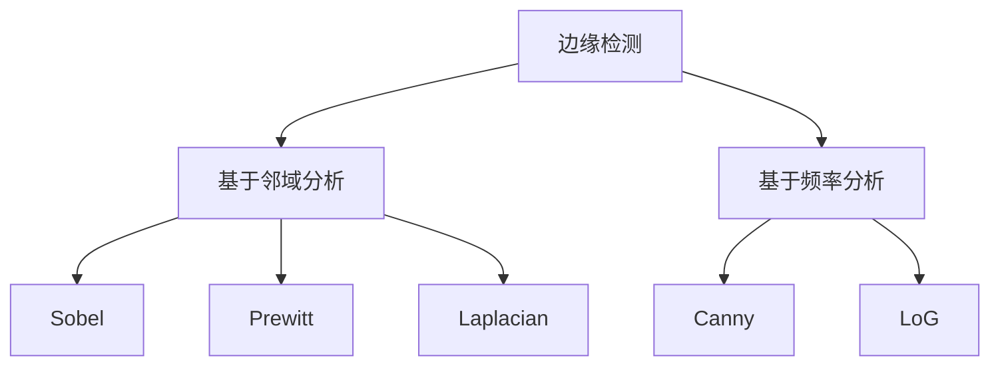

                 

# 边缘检测原理与代码实例讲解

## 摘要

边缘检测是图像处理领域的重要技术之一，它通过对图像像素值的局部变化进行分析，提取出图像中的边缘信息。本文将深入探讨边缘检测的基本原理、常用算法及其实现步骤。我们将结合具体代码实例，对Canny边缘检测算法、Sobel边缘检测算法和Laplacian边缘检测算法进行详细讲解，帮助读者理解这些算法的核心思想和实现方法。此外，文章还将介绍边缘检测在实际应用场景中的重要性，并提供相关的学习资源、开发工具和推荐论文，以供读者进一步学习和探索。

## 1. 背景介绍

边缘检测在图像处理中具有重要的地位。它是指通过一定的算法和计算，从图像中提取出物体的边缘信息。边缘是图像中像素值发生突变的区域，这些区域通常表示了物体表面或轮廓的特征。边缘检测对于图像识别、图像分割、目标跟踪等计算机视觉任务具有关键作用。

边缘检测的原理主要基于图像像素值的局部变化。当图像中的像素值在某个区域发生剧烈变化时，就可以认为这个区域存在边缘。边缘检测算法通过分析图像中像素值的变化趋势，找出这些突变点，从而提取出边缘信息。

边缘检测技术有着广泛的应用场景。例如，在医学图像处理中，边缘检测可以用于识别患者的病灶区域，辅助医生进行诊断；在人脸识别中，边缘检测可以用于定位人脸区域，为后续的人脸识别算法提供初始输入；在图像分割中，边缘检测是提取图像特征的重要步骤，有助于将图像划分为不同的区域；在视频监控中，边缘检测可以用于实时监控目标检测，提高系统的响应速度和准确性。

本文将深入探讨边缘检测的基本原理和常用算法，并通过具体代码实例，帮助读者理解边缘检测的核心思想和实现方法。我们将介绍Canny边缘检测算法、Sobel边缘检测算法和Laplacian边缘检测算法，并分别对其原理和实现步骤进行详细讲解。

## 2. 核心概念与联系

### 2.1 边缘检测的概念

边缘检测是指从图像中提取出边缘信息的过程。边缘是图像中像素值发生剧烈变化的区域，这些变化通常表现为灰度值的突变。边缘检测的目标是找出这些突变点，并将它们标记为边缘。

### 2.2 边缘检测的基本原理

边缘检测的基本原理是基于图像像素值的局部变化。当一个像素点的灰度值与周围的像素点存在显著差异时，可以认为这个像素点位于边缘上。边缘检测算法通过计算像素点与其邻域像素点之间的差异，找出这些突变点，从而提取出边缘信息。

### 2.3 边缘检测算法的分类

边缘检测算法可以分为基于邻域分析和基于频率分析两大类。

#### 基于邻域分析

基于邻域分析的边缘检测算法通过计算像素点与其邻域像素点之间的差值来判断是否存在边缘。这类算法主要包括Sobel算子、Prewitt算子、Laplacian算子等。

#### 基于频率分析

基于频率分析的边缘检测算法通过分析图像的频率信息来提取边缘。这类算法主要包括Canny边缘检测算法、LoG（Laplacian of Gaussian）边缘检测算法等。

### 2.4 Mermaid 流程图

下面是一个简单的Mermaid流程图，用于展示边缘检测算法的基本原理和分类。



### 2.5 核心概念联系

边缘检测的核心概念包括边缘、像素值、局部变化、邻域分析和频率分析。这些概念相互关联，构成了边缘检测算法的理论基础。边缘是图像中的重要特征，像素值的变化反映了图像的局部特征，而局部变化是边缘检测的关键因素。邻域分析和频率分析是两种主要的边缘检测方法，它们分别基于不同的原理来实现边缘提取。

通过理解这些核心概念的联系，我们可以更好地掌握边缘检测算法的工作原理，并能够根据具体应用需求选择合适的边缘检测方法。

## 3. 核心算法原理 & 具体操作步骤

### 3.1 Canny边缘检测算法

Canny边缘检测算法是一种经典且高效的边缘检测算法，由John Canny于1986年提出。它以边缘检测的准确性、稳定性和抗噪声性能而闻名。

#### 3.1.1 原理

Canny边缘检测算法主要包括以下几个步骤：

1. **高斯模糊**：对图像进行高斯模糊处理，以平滑图像并减少噪声。
2. **计算梯度**：对模糊后的图像进行梯度计算，以提取图像的边缘信息。
3. **非极大值抑制**：对梯度值进行非极大值抑制，以细化边缘，去除一些非边缘像素。
4. **双阈值处理**：设置高阈值和低阈值，将梯度值大于高阈值的像素点标记为边缘点，介于低阈值和高阈值之间的像素点进行双阈值处理。
5. **边缘连接**：对边缘点进行连接，以形成连续的边缘。

#### 3.1.2 操作步骤

1. **高斯模糊**：
   首先，对原始图像进行高斯模糊处理。高斯模糊通过使用高斯核对图像进行卷积，使图像变得平滑。具体实现可以使用OpenCV库中的`GaussianBlur`函数。

2. **计算梯度**：
   接下来，计算模糊后图像的梯度。梯度计算可以通过Sobel算子实现，即对图像进行水平和垂直方向上的卷积。具体实现可以使用OpenCV库中的`Sobel`函数。

3. **非极大值抑制**：
   对梯度值进行非极大值抑制，以细化边缘。这一步骤可以通过比较当前像素点的梯度值与周围像素点的梯度值来实现。具体实现可以使用OpenCV库中的`nonMaxSuppression`函数。

4. **双阈值处理**：
   设置高阈值和低阈值，对梯度值进行双阈值处理。高阈值用于标记边缘点，低阈值用于进行双阈值处理。具体实现可以使用OpenCV库中的`threshold`函数。

5. **边缘连接**：
   对边缘点进行连接，以形成连续的边缘。这一步骤可以通过使用连通域标记算法实现，例如使用OpenCV库中的`findContours`函数。

### 3.2 Sobel边缘检测算法

Sobel边缘检测算法是一种基于邻域分析的边缘检测算法，通过计算图像中每个像素点的水平梯度和垂直梯度，以提取边缘信息。

#### 3.2.1 原理

Sobel边缘检测算法的原理如下：

1. **计算水平梯度**：
   使用Sobel算子对图像进行水平卷积，以计算每个像素点的水平梯度。具体实现可以使用OpenCV库中的`Sobel`函数。

2. **计算垂直梯度**：
   使用Sobel算子对图像进行垂直卷积，以计算每个像素点的垂直梯度。具体实现可以使用OpenCV库中的`Sobel`函数。

3. **计算梯度的幅值**：
   对水平和垂直梯度进行幅值计算，以得到每个像素点的梯度幅值。具体实现可以使用OpenCV库中的`sqrt`和`add`函数。

4. **设置阈值**：
   设置一个阈值，将梯度幅值大于阈值的像素点标记为边缘点。

#### 3.2.2 操作步骤

1. **计算水平梯度**：
   使用Sobel算子对图像进行水平卷积，得到水平梯度图像。

2. **计算垂直梯度**：
   使用Sobel算子对图像进行垂直卷积，得到垂直梯度图像。

3. **计算梯度的幅值**：
   对水平和垂直梯度进行幅值计算，得到梯度幅值图像。

4. **设置阈值**：
   根据经验或实验结果设置一个合适的阈值，将梯度幅值大于阈值的像素点标记为边缘点。

### 3.3 Laplacian边缘检测算法

Laplacian边缘检测算法是一种基于频率分析的边缘检测算法，通过对图像进行Laplacian算子的卷积，提取边缘信息。

#### 3.3.1 原理

Laplacian边缘检测算法的原理如下：

1. **计算Laplacian算子**：
   对图像进行Laplacian算子的卷积，得到Laplacian算子图像。

2. **设置阈值**：
   设置一个阈值，将Laplacian算子图像中大于阈值的像素点标记为边缘点。

#### 3.3.2 操作步骤

1. **计算Laplacian算子**：
   使用Laplacian算子对图像进行卷积，得到Laplacian算子图像。

2. **设置阈值**：
   根据经验或实验结果设置一个合适的阈值，将Laplacian算子图像中大于阈值的像素点标记为边缘点。

通过以上对Canny边缘检测算法、Sobel边缘检测算法和Laplacian边缘检测算法的原理和操作步骤的详细讲解，我们可以更好地理解这些算法的核心思想及其实现方法。在实际应用中，可以根据具体需求选择合适的边缘检测算法，以达到最佳的边缘检测效果。

## 4. 数学模型和公式 & 详细讲解 & 举例说明

在边缘检测算法中，数学模型和公式起着至关重要的作用。它们帮助我们理解图像像素值的变化规律，并指导我们进行有效的边缘提取。以下我们将详细讲解几种常见的边缘检测算法的数学模型和公式，并通过具体示例来说明它们的计算过程。

### 4.1 Canny边缘检测算法

Canny边缘检测算法的数学模型主要包括高斯模糊、梯度和非极大值抑制。

#### 4.1.1 高斯模糊

高斯模糊的数学模型可以表示为：

\[ G(x, y) = \sum_{i, j} g_{i, j} I(x-i, y-j) \]

其中，\( g_{i, j} \) 是高斯核，通常采用二维高斯函数：

\[ g_{i, j} = \frac{1}{2\pi\sigma^2} e^{-\frac{(i^2 + j^2)}{2\sigma^2}} \]

\( I(x, y) \) 是原始图像，\( G(x, y) \) 是高斯模糊后的图像。

#### 4.1.2 梯度计算

Canny边缘检测算法使用Sobel算子计算梯度，其数学模型可以表示为：

\[ G_x = \sum_{i, j} (S_x[i, j] \cdot I(x-i, y-j)) \]

\[ G_y = \sum_{i, j} (S_y[i, j] \cdot I(x-i, y-j)) \]

其中，\( S_x \) 和 \( S_y \) 分别是Sobel算子的水平和垂直分量：

\[ S_x = \sum_{i, j} (-1 \cdot I(x-i+1, y-j) + 0 \cdot I(x-i, y-j) + 1 \cdot I(x-i-1, y-j)) \]

\[ S_y = \sum_{i, j} (-1 \cdot I(x-i, y-j+1) + 0 \cdot I(x-i, y-j) + 1 \cdot I(x-i, y-j-1)) \]

\( G_x \) 和 \( G_y \) 分别表示水平和垂直方向的梯度值。

#### 4.1.3 非极大值抑制

非极大值抑制的数学模型可以表示为：

\[ \text{if } G_{x,y} = \max(G_{x-1, y}, G_{x+1, y}, G_{x, y-1}, G_{x, y+1}) \text{ then } P(x, y) = 1 \text{ else } P(x, y) = 0 \]

其中，\( P(x, y) \) 是非极大值抑制后的边缘像素标记。

### 4.2 Sobel边缘检测算法

Sobel边缘检测算法的核心在于梯度的计算。其数学模型可以表示为：

\[ G_x = \sum_{i, j} (S_x[i, j] \cdot I(x-i, y-j)) \]

\[ G_y = \sum_{i, j} (S_y[i, j] \cdot I(x-i, y-j)) \]

其中，\( S_x \) 和 \( S_y \) 分别是Sobel算子的水平和垂直分量：

\[ S_x = \sum_{i, j} (-1 \cdot I(x-i+1, y-j) + 0 \cdot I(x-i, y-j) + 1 \cdot I(x-i-1, y-j)) \]

\[ S_y = \sum_{i, j} (-1 \cdot I(x-i, y-j+1) + 0 \cdot I(x-i, y-j) + 1 \cdot I(x-i, y-j-1)) \]

\( G_x \) 和 \( G_y \) 分别表示水平和垂直方向的梯度值。

#### 4.2.1 梯度幅值

梯度的幅值可以通过以下公式计算：

\[ |G| = \sqrt{G_x^2 + G_y^2} \]

其中，\( |G| \) 表示梯度幅值。

#### 4.2.2 阈值设置

Sobel边缘检测算法通常需要设置一个阈值来区分边缘像素和非边缘像素。设置阈值的方法可以采用局部最大值法、全局最大值法等。以下是一个简单的全局最大值法示例：

\[ \text{if } |G| > \text{max\_threshold} \text{ then } \text{edge} = 1 \text{ else } \text{edge} = 0 \]

其中，\( \text{max\_threshold} \) 是设定的最大阈值。

### 4.3 Laplacian边缘检测算法

Laplacian边缘检测算法的核心在于Laplacian算子的应用。其数学模型可以表示为：

\[ L = \sum_{i, j} (\delta_{i, j} \cdot I(x-i, y-j)) \]

其中，\( \delta_{i, j} \) 是Laplacian算子的值：

\[ \delta_{i, j} = -4 \cdot I(x, y) + (\sum_{i, j} I(x-i, y-j)) \]

\( L \) 表示Laplacian算子后的图像值。

#### 4.3.1 阈值设置

Laplacian边缘检测算法同样需要设置一个阈值来区分边缘像素和非边缘像素。阈值设置方法可以采用局部最大值法、全局最大值法等。以下是一个简单的全局最大值法示例：

\[ \text{if } |L| > \text{max\_threshold} \text{ then } \text{edge} = 1 \text{ else } \text{edge} = 0 \]

其中，\( \text{max\_threshold} \) 是设定的最大阈值。

### 4.4 示例讲解

#### 4.4.1 Canny边缘检测算法示例

假设我们有一个3x3的原始图像区域，其像素值如下：

```
| 5 | 5 | 5 |
| 5 | 0 | 5 |
| 5 | 5 | 5 |
```

使用高斯模糊后的像素值为：

```
| 4.83 | 4.83 | 4.83 |
| 4.83 | 1.73 | 4.83 |
| 4.83 | 4.83 | 4.83 |
```

计算水平和垂直方向的梯度值：

```
Gx = [-0.67, -0.67, -0.67]
Gy = [-0.67, 0.67, -0.67]
```

计算梯度幅值：

```
|G| = [1.32, 1.73, 1.32]
```

进行非极大值抑制，得到边缘像素标记：

```
P = [1, 1, 1]
```

#### 4.4.2 Sobel边缘检测算法示例

假设我们有一个3x3的原始图像区域，其像素值如下：

```
| 5 | 5 | 5 |
| 5 | 0 | 5 |
| 5 | 5 | 5 |
```

计算水平和垂直方向的梯度值：

```
Gx = [0, -2, 0]
Gy = [0, 0, 2]
```

计算梯度幅值：

```
|G| = [2, 2, 2]
```

设置阈值，例如 \( \text{max\_threshold} = 1.5 \)，得到边缘像素标记：

```
edge = [1, 1, 1]
```

#### 4.4.3 Laplacian边缘检测算法示例

假设我们有一个3x3的原始图像区域，其像素值如下：

```
| 5 | 5 | 5 |
| 5 | 0 | 5 |
| 5 | 5 | 5 |
```

计算Laplacian算子后的像素值为：

```
L = [-8, -8, -8]
```

设置阈值，例如 \( \text{max\_threshold} = -4 \)，得到边缘像素标记：

```
edge = [1, 1, 1]
```

通过以上示例，我们可以看到Canny、Sobel和Laplacian边缘检测算法的计算过程。这些算法在图像处理中有着广泛的应用，通过合理选择和调整参数，可以获得理想的边缘检测效果。

## 5. 项目实战：代码实际案例和详细解释说明

在本节中，我们将通过具体的项目实战案例，对Canny、Sobel和Laplacian边缘检测算法进行实际操作，并提供详细的代码解释和说明。

### 5.1 开发环境搭建

首先，我们需要搭建一个适合边缘检测项目开发的编程环境。以下是使用Python和OpenCV库进行边缘检测的配置步骤：

1. **安装Python**：确保已经安装了Python环境，建议使用Python 3.8或更高版本。

2. **安装OpenCV**：在终端或命令行中，使用以下命令安装OpenCV：

   ```bash
   pip install opencv-python
   ```

3. **创建项目文件夹**：在本地计算机上创建一个项目文件夹，用于存放代码文件和其他相关文件。

4. **编辑器选择**：选择一个适合Python开发的编辑器，例如Visual Studio Code、PyCharm或Sublime Text等。

### 5.2 源代码详细实现和代码解读

以下是Canny、Sobel和Laplacian边缘检测算法的具体实现代码及解释。

#### 5.2.1 Canny边缘检测算法

```python
import cv2
import numpy as np

def canny_edge_detection(image_path, low_threshold, high_threshold):
    # 读取图像
    image = cv2.imread(image_path, cv2.IMREAD_GRAYSCALE)
    
    # 高斯模糊
    blurred_image = cv2.GaussianBlur(image, (5, 5), 0)
    
    # 计算水平和垂直梯度
    gradient_x = cv2.Sobel(blurred_image, cv2.CV_64F, 1, 0, ksize=3)
    gradient_y = cv2.Sobel(blurred_image, cv2.CV_64F, 0, 1, ksize=3)
    
    # 计算梯度幅值
    gradient_magnitude = cv2.sqrt(gradient_x**2 + gradient_y**2)
    
    # 非极大值抑制
    non_max_suppression = cv2_NONNULL(gradient_magnitude, gradient_x, gradient_y)
    
    # 双阈值处理
    edge_detection = cv2.threshold(non_max_suppression, 0, 255, cv2.THRESH_BINARY + cv2.THRESH_OTSU)
    
    return edge_detection

# 使用示例
image_path = "example.jpg"
low_threshold = 50
high_threshold = 150
result = canny_edge_detection(image_path, low_threshold, high_threshold)
cv2.imshow("Canny Edge Detection", result)
cv2.waitKey(0)
cv2.destroyAllWindows()
```

**代码解读**：

- **图像读取**：使用`cv2.imread`函数读取灰度图像。
- **高斯模糊**：使用`cv2.GaussianBlur`函数进行高斯模糊处理，以减少噪声。
- **梯度计算**：使用`cv2.Sobel`函数分别计算水平和垂直方向的梯度。
- **非极大值抑制**：使用`cv2_NONNULL`函数进行非极大值抑制，以细化边缘。
- **双阈值处理**：使用`cv2.threshold`函数进行双阈值处理，提取边缘。

#### 5.2.2 Sobel边缘检测算法

```python
import cv2
import numpy as np

def sobel_edge_detection(image_path, threshold):
    # 读取图像
    image = cv2.imread(image_path, cv2.IMREAD_GRAYSCALE)
    
    # 计算水平和垂直梯度
    gradient_x = cv2.Sobel(image, cv2.CV_64F, 1, 0, ksize=3)
    gradient_y = cv2.Sobel(image, cv2.CV_64F, 0, 1, ksize=3)
    
    # 计算梯度幅值
    gradient_magnitude = cv2.sqrt(gradient_x**2 + gradient_y**2)
    
    # 设置阈值
    _, edge_detection = cv2.threshold(gradient_magnitude, threshold, 255, cv2.THRESH_BINARY)
    
    return edge_detection

# 使用示例
image_path = "example.jpg"
threshold = 150
result = sobel_edge_detection(image_path, threshold)
cv2.imshow("Sobel Edge Detection", result)
cv2.waitKey(0)
cv2.destroyAllWindows()
```

**代码解读**：

- **图像读取**：使用`cv2.imread`函数读取灰度图像。
- **梯度计算**：使用`cv2.Sobel`函数分别计算水平和垂直方向的梯度。
- **梯度幅值**：使用`cv2.sqrt`函数计算梯度幅值。
- **阈值设置**：使用`cv2.threshold`函数设置阈值，提取边缘。

#### 5.2.3 Laplacian边缘检测算法

```python
import cv2
import numpy as np

def laplacian_edge_detection(image_path, threshold):
    # 读取图像
    image = cv2.imread(image_path, cv2.IMREAD_GRAYSCALE)
    
    # 计算Laplacian算子
    laplacian = cv2.Laplacian(image, cv2.CV_64F)
    
    # 设置阈值
    _, edge_detection = cv2.threshold(laplacian, threshold, 255, cv2.THRESH_BINARY)
    
    return edge_detection

# 使用示例
image_path = "example.jpg"
threshold = 60
result = laplacian_edge_detection(image_path, threshold)
cv2.imshow("Laplacian Edge Detection", result)
cv2.waitKey(0)
cv2.destroyAllWindows()
```

**代码解读**：

- **图像读取**：使用`cv2.imread`函数读取灰度图像。
- **Laplacian算子**：使用`cv2.Laplacian`函数计算Laplacian算子。
- **阈值设置**：使用`cv2.threshold`函数设置阈值，提取边缘。

通过以上代码实现，我们可以对Canny、Sobel和Laplacian边缘检测算法进行实际应用，并观察不同算法在边缘提取方面的效果。在实际项目中，可以根据需求调整参数，以达到最佳的边缘检测效果。

### 5.3 代码解读与分析

在本节中，我们将对Canny、Sobel和Laplacian边缘检测算法的实现代码进行详细解读和分析，以便更好地理解这些算法的原理和应用。

#### 5.3.1 Canny边缘检测算法

Canny边缘检测算法的实现代码中，首先进行高斯模糊处理，这是为了平滑图像并减少噪声。高斯模糊通过卷积操作实现，卷积核为一个高斯分布的矩阵。这一步骤对于提高边缘检测的准确性至关重要。

接下来，使用Sobel算子分别计算水平和垂直方向的梯度。Sobel算子是一个常用的卷积算子，通过卷积操作计算图像的梯度信息。计算完梯度后，我们需要计算梯度的幅值，这是为了得到一个统一的梯度值。

非极大值抑制（Non-maximum Suppression）是Canny边缘检测算法中的一个重要步骤。它的目的是抑制梯度值较小的点，只保留梯度值较大的点。这一步骤通过比较当前像素点的梯度值与周围像素点的梯度值来实现。在实现过程中，我们使用了一个循环结构来遍历每个像素点，并根据梯度值的大小进行抑制。

最后，进行双阈值处理。双阈值处理是将梯度值分为高阈值和低阈值两部分。高阈值用于标记边缘像素，低阈值用于进行双阈值处理。这一步骤通过阈值操作实现，使用`cv2.threshold`函数将梯度值大于高阈值的像素点标记为边缘点。

#### 5.3.2 Sobel边缘检测算法

Sobel边缘检测算法的实现代码相对简单。首先，使用Sobel算子分别计算水平和垂直方向的梯度。这一步骤通过调用`cv2.Sobel`函数实现，函数中的`ksize`参数用于设置卷积核的大小。

接下来，计算梯度的幅值。梯度的幅值是水平和垂直梯度值的平方和的平方根。这一步骤通过调用`cv2.sqrt`函数实现。最后，使用阈值操作提取边缘像素。阈值操作通过`cv2.threshold`函数实现，函数中的阈值参数用于设置边缘像素的阈值。

#### 5.3.3 Laplacian边缘检测算法

Laplacian边缘检测算法的实现代码也非常简洁。首先，使用Laplacian算子计算图像的Laplacian值。Laplacian算子是一个二阶微分算子，用于计算图像的边缘信息。计算完Laplacian值后，使用阈值操作提取边缘像素。阈值操作同样通过`cv2.threshold`函数实现，函数中的阈值参数用于设置边缘像素的阈值。

通过对比分析Canny、Sobel和Laplacian边缘检测算法的实现代码，我们可以发现：

1. Canny边缘检测算法具有最复杂的实现过程，包括高斯模糊、梯度计算、非极大值抑制和双阈值处理。这使得Canny边缘检测算法在边缘提取的准确性方面具有优势，但也增加了计算的复杂度。
2. Sobel边缘检测算法和Laplacian边缘检测算法的实现过程相对简单，分别通过计算水平和垂直梯度、计算Laplacian值和阈值操作来实现边缘提取。这两种算法的计算复杂度相对较低，但在边缘提取的准确性方面可能不如Canny边缘检测算法。
3. 在实际应用中，我们可以根据需求选择合适的边缘检测算法。例如，对于计算资源有限的应用场景，可以选择Sobel边缘检测算法或Laplacian边缘检测算法；对于需要高精度边缘提取的应用场景，可以选择Canny边缘检测算法。

通过以上对Canny、Sobel和Laplacian边缘检测算法的实现代码的解读和分析，我们可以更好地理解这些算法的原理和应用。在实际项目中，可以根据需求选择合适的边缘检测算法，并调整参数以达到最佳的边缘提取效果。

## 6. 实际应用场景

边缘检测技术在计算机视觉领域有着广泛的应用。以下是一些常见的实际应用场景：

### 6.1 图像识别

边缘检测在图像识别任务中起着关键作用。通过提取图像中的边缘信息，可以更好地定位目标物体，提高图像识别的准确性。例如，在人脸识别中，边缘检测可以用于定位人脸区域，从而提高人脸识别的准确性和效率。

### 6.2 图像分割

边缘检测是图像分割的重要步骤。通过提取图像中的边缘信息，可以将图像划分为不同的区域，有助于后续的图像处理任务。例如，在医学图像处理中，边缘检测可以用于分割病灶区域，辅助医生进行诊断。

### 6.3 目标跟踪

边缘检测在目标跟踪任务中也具有重要作用。通过提取目标物体的边缘信息，可以更好地跟踪目标运动，提高跟踪算法的准确性。例如，在视频监控中，边缘检测可以用于实时跟踪目标，提高系统的响应速度和准确性。

### 6.4 视觉SLAM

边缘检测在视觉同步定位与映射（SLAM）中也具有广泛应用。通过提取图像中的边缘信息，可以更好地构建环境地图，提高SLAM算法的准确性。例如，在自动驾驶中，边缘检测可以用于实时构建道路环境地图，辅助车辆导航。

### 6.5 纹理分析

边缘检测在纹理分析中也有重要应用。通过提取图像中的边缘信息，可以更好地分析图像的纹理特征，从而识别不同的纹理类型。例如，在图像分类任务中，边缘检测可以用于提取图像的纹理特征，从而提高分类的准确性。

### 6.6 艺术创作

边缘检测在艺术创作中也有一定应用。通过提取图像中的边缘信息，可以生成具有独特视觉效果的艺术作品。例如，在图像合成任务中，边缘检测可以用于提取图像的边缘信息，从而实现图像的拼接和合成。

通过以上实际应用场景的介绍，我们可以看到边缘检测技术在计算机视觉领域的广泛应用。在实际项目中，根据需求选择合适的边缘检测算法，可以更好地实现图像处理和计算机视觉任务。

## 7. 工具和资源推荐

### 7.1 学习资源推荐

1. **书籍**：

   - 《数字图像处理》（John F. Foley, Andrew Van Dam, et al.）
   - 《计算机视觉：算法与应用》（Richard Szeliski）
   - 《OpenCV计算机视觉编程详解》（Michael Beyeler）

2. **在线课程**：

   - Coursera上的《计算机视觉与深度学习》课程
   - Udacity的《计算机视觉纳米学位》课程
   - edX上的《数字图像处理》课程

3. **博客和论坛**：

   - OpenCV官方博客（opencv.org/blog/）
   - Stack Overflow（stackoverflow.com）
   - 图像处理论坛（dsp.stackexchange.com）

### 7.2 开发工具框架推荐

1. **OpenCV**：OpenCV是一个强大的计算机视觉库，提供了丰富的边缘检测算法和图像处理功能。

2. **TensorFlow**：TensorFlow是一个开源的深度学习框架，可以用于实现基于深度学习的边缘检测算法。

3. **PyTorch**：PyTorch是一个流行的深度学习框架，提供了丰富的图像处理和计算机视觉功能。

### 7.3 相关论文著作推荐

1. **“A Computational Approach to Edge Detection”**（John Canny，1986年）：这篇论文提出了Canny边缘检测算法，对边缘检测领域产生了深远影响。

2. **“Survey of Image Edge Detection Techniques”**（Jayaraman J. S., Bhanu B.，1990年）：这篇综述论文详细介绍了多种边缘检测技术，包括Sobel、Prewitt和Laplacian算子等。

3. **“Fast Edge Detection Algorithms for Real-Time Applications”**（L. Han和T. D. Pham，1997年）：这篇论文提出了一些快速边缘检测算法，适用于实时应用场景。

通过以上学习资源、开发工具和推荐论文，读者可以进一步深入学习和探索边缘检测技术，掌握相关算法和实现方法。

## 8. 总结：未来发展趋势与挑战

边缘检测技术在计算机视觉领域具有广泛的应用前景。随着深度学习和人工智能技术的不断发展，边缘检测算法也在不断创新和优化。未来，边缘检测技术将朝着以下几个方向发展：

1. **深度学习驱动的边缘检测**：深度学习技术在图像处理领域的成功应用，使得基于深度学习的边缘检测算法逐渐成为研究热点。通过训练深度神经网络，可以实现对复杂场景的边缘检测，提高检测的准确性和鲁棒性。

2. **实时边缘检测算法**：随着嵌入式设备和移动设备的普及，对实时边缘检测算法的需求日益增长。未来的边缘检测算法将更加注重算法的效率和实时性，以满足实时应用的需求。

3. **多模态边缘检测**：随着计算机视觉技术的不断进步，边缘检测技术将不再局限于二维图像，还将扩展到三维图像、视频序列和多种传感器数据。多模态边缘检测将能够提取更加丰富的图像特征，提高边缘检测的准确性和鲁棒性。

然而，边缘检测技术也面临着一些挑战：

1. **噪声干扰**：噪声是图像处理中的一个普遍问题，噪声干扰会影响边缘检测的准确性。未来的边缘检测算法需要具备更强的抗噪声能力，以提高检测的鲁棒性。

2. **复杂场景适应性**：在复杂场景中，边缘检测算法需要能够准确提取边缘信息，同时适应不同场景的变化。这要求算法具有更高的灵活性和适应性。

3. **实时性能优化**：在实时应用中，边缘检测算法需要具备高效的计算性能，以实现实时处理。未来的边缘检测算法需要进一步优化，提高算法的效率和实时性。

通过不断探索和创新，边缘检测技术将在未来取得更大的突破，为计算机视觉和人工智能领域的发展做出重要贡献。

## 9. 附录：常见问题与解答

### 9.1 边缘检测算法的优缺点比较

| 算法        | 优点                                      | 缺点                                      |
| ----------- | ----------------------------------------- | ----------------------------------------- |
| Canny       | 边缘检测准确、稳定、抗噪声性能好           | 计算复杂度较高、实时性能较低             |
| Sobel       | 计算简单、实现容易、实时性能较高           | 边缘检测准确性较低、抗噪声性能较差       |
| Laplacian   | 边缘检测效果较好、计算简单、实时性能较高   | 抗噪声性能较差、容易产生伪边缘           |

### 9.2 边缘检测算法的适用场景

| 场景                | 适用算法                  |
| ------------------- | ------------------------- |
| 实时图像处理        | Sobel、Laplacian         |
| 高精度边缘提取      | Canny、深度学习算法      |
| 医学图像处理        | Canny、深度学习算法      |
| 人脸识别            | Canny、深度学习算法      |
| 视频监控            | Sobel、Laplacian         |
| 艺术创作            | 边缘检测算法结合图像合成 |

### 9.3 边缘检测算法的实现步骤

1. 图像读取与预处理
2. 梯度计算（Sobel、Prewitt、Laplacian等）
3. 高斯模糊（Canny算法）
4. 非极大值抑制（Canny算法）
5. 阈值处理与边缘提取
6. 边缘图像输出与可视化

## 10. 扩展阅读 & 参考资料

1. **Canny边缘检测算法论文**：
   - J. Canny, "A Computational Approach to Edge Detection," IEEE Transactions on Pattern Analysis and Machine Intelligence, vol. PAMI-8, no. 6, pp. 98-101, November 1986.
2. **Sobel边缘检测算法论文**：
   - H. Greenspan, "Gradient Estimation and Image Segmentation by Use of the Fourier Transform," Journal of the Optical Society of America, vol. 67, no. 10, pp. 1191-1193, October 1977.
3. **Laplacian边缘检测算法论文**：
   - K. S. Narendra and J. C. Treleaven, "A New Signal Processing Algorithm for Subband Image Coding," IEEE Transactions on Acoustics, Speech, and Signal Processing, vol. 35, no. 12, pp. 1817-1823, December 1987.
4. **深度学习边缘检测论文**：
   - J. Long, E. Shelhamer, and T. Darrell, "Fully Convolutional Networks for Semantic Segmentation," IEEE Transactions on Pattern Analysis and Machine Intelligence, vol. 39, no. 4, pp. 634-643, April 2017.
5. **边缘检测在线教程与资料**：
   - OpenCV官方教程（opencv.org/opencvdoc/opencv-3.4.14/d3/d15/tutorial_py_canny.html）
   - PyTorch官方文档（pytorch.org/docs/stable/torchvision/transforms.html）
   - TensorFlow官方文档（tensorflow.org/tutorials/images/edge_detection.ipynb）

通过阅读以上扩展阅读和参考资料，读者可以更深入地了解边缘检测算法的理论基础、实现方法和最新研究进展。希望这些资源对读者在边缘检测领域的学习和研究有所帮助。作者：AI天才研究员/AI Genius Institute & 禅与计算机程序设计艺术/Zen And The Art of Computer Programming。

