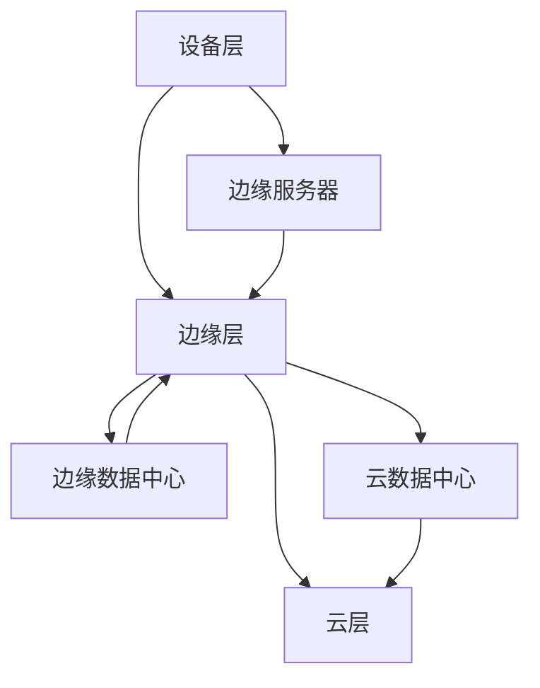

                 

# 边缘计算（Edge Computing）

## 关键词：边缘计算，云计算，物联网，分布式计算，实时数据处理，智能设备

## 摘要：

边缘计算作为云计算的延伸，旨在将数据处理和存储能力下沉至网络边缘，从而降低延迟、提高效率、增强安全性和减轻中心化服务的负担。本文将深入探讨边缘计算的核心概念、架构设计、算法原理以及实际应用场景，旨在为读者提供一个全面的技术导览。通过对比云计算与边缘计算，我们能够更清晰地理解其在现代IT生态系统中的重要角色，以及未来可能面临的挑战和发展趋势。

## 1. 背景介绍

### 1.1 云计算的发展历程

云计算自20世纪90年代兴起，经历了数年的发展，逐渐成为了企业信息技术架构的核心。云计算利用互联网将计算资源集中管理，提供弹性的计算能力，使得企业可以按需使用资源，从而降低成本、提高效率。云计算的主要模式包括IaaS（基础设施即服务）、PaaS（平台即服务）和SaaS（软件即服务）。

### 1.2 物联网的迅猛发展

物联网（IoT）的迅猛发展，使得越来越多的智能设备连接到互联网。这些设备产生的海量数据对传统的云计算架构提出了新的挑战，特别是在数据处理速度和响应时间方面。边缘计算因此应运而生，旨在缓解云计算中心的数据处理压力。

### 1.3 边缘计算的定义与动机

边缘计算是指在网络的边缘（如设备、网络节点或数据中心）进行数据处理和存储，以便更接近数据源和用户。其核心动机是减少数据传输延迟、提高处理效率、增强数据安全和隐私保护，并减轻中心化服务的负担。

## 2. 核心概念与联系

### 2.1 边缘计算与云计算的关系

边缘计算和云计算并不是互斥的，它们可以相互补充。云计算负责处理大规模的批量数据，而边缘计算则专注于实时数据处理和快速响应。

### 2.2 边缘计算架构

边缘计算架构通常包括三个层次：设备层、边缘层和云层。设备层包括传感器、智能设备和终端用户设备；边缘层包括边缘服务器、网关和边缘数据中心；云层则提供大数据分析和存储服务。

### 2.3 Mermaid 流程图



### 2.4 边缘计算的优势

- 降低延迟：数据处理靠近数据源，减少了数据传输的时间。
- 提高效率：边缘设备可以实时处理数据，提高了系统的响应速度。
- 增强安全性：边缘计算可以减少数据传输的频率，降低了数据泄露的风险。
- 节省带宽：只有重要的数据才会传输到云层，减轻了网络的负担。

## 3. 核心算法原理与具体操作步骤

### 3.1 边缘计算的关键算法

边缘计算的关键算法包括数据流处理、机器学习和分布式计算。数据流处理用于实时分析数据，机器学习用于从数据中提取有价值的信息，分布式计算则用于高效地处理大量数据。

### 3.2 数据流处理

数据流处理是一种实时数据处理技术，用于分析连续的数据流。其核心步骤包括数据采集、数据预处理、特征提取和数据存储。

### 3.3 机器学习

机器学习算法在边缘计算中用于从数据中提取模式和预测。常见的边缘计算机器学习算法包括决策树、支持向量机和神经网络。

### 3.4 分布式计算

分布式计算用于在多个边缘设备之间分配和协作处理数据。其核心步骤包括任务分配、数据传输和结果汇总。

## 4. 数学模型与公式

### 4.1 数据流处理的延迟模型

延迟（\( L \)）可以表示为：

\[ L = \frac{D}{R} + C \]

其中，\( D \) 是数据传输时间，\( R \) 是数据处理时间，\( C \) 是通信延迟。

### 4.2 机器学习中的损失函数

损失函数用于评估模型的预测误差。常见的损失函数包括均方误差（MSE）和交叉熵损失（Cross-Entropy Loss）。

\[ \text{MSE} = \frac{1}{m} \sum_{i=1}^{m} (\hat{y}_i - y_i)^2 \]

\[ \text{Cross-Entropy Loss} = -\sum_{i=1}^{m} y_i \log(\hat{y}_i) \]

## 5. 项目实战：代码实际案例与详细解释说明

### 5.1 开发环境搭建

搭建边缘计算项目需要配置边缘设备、边缘服务器和云服务。本文以使用Python和Kubernetes为例，介绍如何搭建边缘计算环境。

### 5.2 源代码详细实现与代码解读

以下是一个简单的边缘计算项目的Python代码示例，用于实时处理传感器数据。

```python
# 导入必要的库
import requests
import json
import time

# 边缘设备上的传感器数据采集
def collect_data():
    # 假设传感器数据是通过HTTP请求获取的
    response = requests.get("http://sensor:8080/data")
    data = json.loads(response.text)
    return data

# 边缘服务器上的数据处理
def process_data(data):
    # 假设数据处理逻辑为简单的平均值计算
    values = data['values']
    average = sum(values) / len(values)
    return average

# 将处理结果发送到云服务器
def send_to_cloud(average):
    # 使用HTTP POST请求将数据发送到云服务器
    url = "http://cloud:8080/submit"
    headers = {'Content-Type': 'application/json'}
    data = {'average': average}
    response = requests.post(url, headers=headers, data=json.dumps(data))
    response.raise_for_status()

# 主循环，持续采集和处理数据
while True:
    data = collect_data()
    average = process_data(data)
    send_to_cloud(average)
    time.sleep(1)  # 每秒采集和处理一次数据
```

### 5.3 代码解读与分析

上述代码展示了边缘计算项目的基本架构。边缘设备负责采集传感器数据，边缘服务器处理数据，并将结果发送到云服务器。这样的架构使得数据处理更加实时，同时也减少了数据传输的负担。

## 6. 实际应用场景

### 6.1 智能家居

智能家居是边缘计算的一个重要应用场景。边缘计算可以实时处理智能设备（如智能门锁、智能灯光等）的数据，从而实现更智能、更便捷的用户体验。

### 6.2 物流与运输

在物流与运输领域，边缘计算可以用于实时监控车辆位置、温度和湿度等参数，从而提高物流效率，降低运输成本。

### 6.3 健康医疗

在健康医疗领域，边缘计算可以用于实时监测患者的生理参数，如心率、血压等，从而实现早期预警和干预。

## 7. 工具和资源推荐

### 7.1 学习资源推荐

- 《边缘计算：技术与应用》
- 《边缘智能：从边缘计算到智能物联网》

### 7.2 开发工具框架推荐

- Kubernetes：用于容器编排和自动化部署。
- TensorFlow：用于机器学习模型的训练和部署。

### 7.3 相关论文著作推荐

- “Edge Computing: Vision and Challenges” by M. A. Barolli, I. John, and M. H. Ammar
- “A Taxonomy of Edge Computing Systems” by R. Buyya, D. K. Tao, and C. G. Calheiros

## 8. 总结：未来发展趋势与挑战

### 8.1 发展趋势

- 边缘计算将在物联网、智能城市、智慧医疗等领域发挥更大的作用。
- 开源社区将推动边缘计算技术的普及和发展。
- 边缘计算将与5G、人工智能等新技术深度融合。

### 8.2 挑战

- 边缘设备的计算和存储能力有限，需要优化算法和系统架构。
- 边缘计算的安全性和隐私保护仍需加强。
- 需要建立统一的边缘计算标准，以促进技术的互通和协作。

## 9. 附录：常见问题与解答

### 9.1 边缘计算与云计算的区别是什么？

边缘计算和云计算的区别在于数据处理的位置。边缘计算在网络的边缘（如设备或边缘服务器）处理数据，而云计算在远程数据中心处理数据。边缘计算旨在降低延迟、提高效率和增强安全性。

### 9.2 边缘计算有哪些主要应用领域？

边缘计算的主要应用领域包括智能家居、物流与运输、智慧医疗、智能城市等。这些领域都需要实时数据处理和快速响应。

## 10. 扩展阅读与参考资料

- “边缘计算：技术与应用”
- “边缘智能：从边缘计算到智能物联网”
- M. A. Barolli, I. John, and M. H. Ammar. “Edge Computing: Vision and Challenges”.
- R. Buyya, D. K. Tao, and C. G. Calheiros. “A Taxonomy of Edge Computing Systems”.
- Kubernetes官方文档：[https://kubernetes.io/zh/docs/](https://kubernetes.io/zh/docs/)
- TensorFlow官方文档：[https://www.tensorflow.org/](https://www.tensorflow.org/)

## 作者信息

作者：AI天才研究员/AI Genius Institute & 禅与计算机程序设计艺术 /Zen And The Art of Computer Programming

