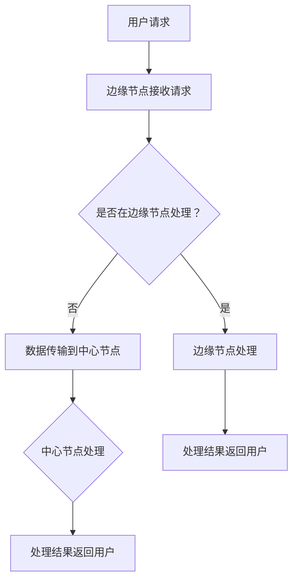

                 

# 边缘计算与 LLM：低延迟、高效率的 AI

## 关键词
边缘计算，分布式系统，低延迟，高效AI，机器学习模型，大型语言模型（LLM）

## 摘要
本文将探讨边缘计算与大型语言模型（LLM）的结合，以及这种结合如何实现低延迟、高效率的AI。我们将从边缘计算的基本概念入手，分析其与分布式系统之间的关系，并逐步阐述LLM的原理。随后，文章将深入讨论边缘计算在AI应用中的实际场景，分析其优势与挑战，并提供工具和资源推荐。最后，我们将总结未来发展趋势与挑战，为读者提供扩展阅读和参考资料。

## 1. 背景介绍

### 1.1 边缘计算的起源与发展

边缘计算（Edge Computing）起源于物联网（IoT）和移动计算的发展需求。在传统的云计算模式下，数据处理和分析主要在远程数据中心进行，这导致了较高的延迟和带宽消耗。为了降低延迟、节省带宽，提高实时响应能力，边缘计算应运而生。

边缘计算的基本概念是将计算、存储、网络功能分散到网络边缘，即靠近数据源的位置。这样，数据处理和分析可以在本地进行，减少了数据传输的延迟，提升了系统的响应速度。

边缘计算的发展历程可以追溯到2000年代初的智能家居和工业自动化领域。随着5G、物联网和云计算技术的普及，边缘计算逐渐成为学术界和工业界的研究热点，应用场景不断扩展。

### 1.2 分布式系统与边缘计算

分布式系统（Distributed Systems）是一种由多个独立计算机组成的系统，这些计算机通过网络进行通信和协作，共同完成一个任务。边缘计算与分布式系统有着密切的联系。

首先，边缘计算是一种分布式系统。在边缘计算中，多个边缘节点（如路由器、交换机、智能设备等）通过网络进行通信，共同处理和分析数据。

其次，边缘计算可以看作是分布式系统的一种特殊形式。与传统的云计算不同，边缘计算将数据处理和分析分散到网络边缘，实现了更贴近用户的需求。

### 1.3 大型语言模型（LLM）的发展

大型语言模型（LLM）是近年来人工智能领域的重要突破。LLM是一种基于深度学习的自然语言处理模型，可以理解和生成自然语言。代表性的LLM包括GPT、BERT、Turing等。

LLM的发展可以追溯到2000年代初的循环神经网络（RNN）和卷积神经网络（CNN）。随着计算能力和数据量的提升，研究人员开始探索更大规模的神经网络，以实现更强大的自然语言处理能力。

2018年，OpenAI发布了GPT-2，这是一个具有1.5亿参数的大型语言模型。随后，GPT-3、BERT、Turing等LLM相继出现，不断刷新性能记录。

## 2. 核心概念与联系

### 2.1 边缘计算与分布式系统的关系

边缘计算是一种分布式系统，其核心在于将计算、存储、网络功能分散到网络边缘。边缘节点（如路由器、交换机、智能设备等）通过互联网进行通信和协作，共同完成数据处理和分析任务。

边缘计算与分布式系统的关系可以概括为以下几个方面：

1. **资源分散**：边缘计算将计算、存储、网络资源分散到网络边缘，降低了中心数据中心的负担。
2. **低延迟**：数据处理和分析在本地进行，减少了数据传输的延迟，提高了系统的响应速度。
3. **高可靠性**：边缘计算通过分布式架构提高了系统的可靠性，即使某个边缘节点发生故障，其他节点可以继续提供服务。
4. **灵活性**：边缘计算可以根据应用需求动态调整计算资源，提高了系统的灵活性。

### 2.2 LLM与边缘计算的结合

LLM与边缘计算的结合可以充分发挥两者的优势，实现低延迟、高效率的AI。

首先，边缘计算可以将LLM的模型部署到网络边缘，实现本地化处理。这样可以减少数据传输的延迟，提高系统的响应速度。

其次，边缘计算可以充分利用LLM的强大自然语言处理能力，为各类应用提供智能服务。例如，在智能家居领域，边缘计算可以与LLM结合，实现智能语音交互、智能安防等功能。

最后，边缘计算可以为LLM提供更多的数据来源，进一步提升模型性能。通过在边缘节点收集和分析数据，可以为LLM训练提供更多的样本，提高模型的泛化能力。

### 2.3 Mermaid 流程图

下面是边缘计算与LLM结合的Mermaid流程图：



### 2.4 LLM的核心算法原理

#### 2.4.1 基于深度学习的语言模型

深度学习语言模型（Deep Learning Language Model）是一种基于神经网络的自然语言处理模型。它通过学习大量的文本数据，自动提取语言特征，实现对自然语言的建模。

深度学习语言模型主要包括以下几个部分：

1. **输入层**：接收文本数据，并将其转换为神经网络可以处理的格式。
2. **隐藏层**：通过神经网络结构，对输入数据进行处理和特征提取。
3. **输出层**：生成预测结果，如文本分类、文本生成等。

#### 2.4.2 语言模型的训练过程

语言模型的训练过程主要包括以下几个步骤：

1. **数据准备**：收集并清洗大量文本数据，将其转换为神经网络可以处理的格式。
2. **构建模型**：根据训练数据的特点，设计合适的神经网络结构。
3. **模型训练**：使用训练数据对模型进行训练，不断调整模型参数，使其达到最优状态。
4. **模型评估**：使用测试数据对模型进行评估，判断其性能是否符合预期。

#### 2.4.3 语言模型的优化

为了提高语言模型的性能，研究人员提出了一系列优化方法，如：

1. **预训练**：在大量未标注的数据上进行预训练，使模型具备较强的通用性。
2. **微调**：在特定任务上进行微调，使模型具备更强的任务适应性。
3. **迁移学习**：利用预训练模型在相关任务上的经验，提升新任务的性能。

## 3. 核心算法原理 & 具体操作步骤

### 3.1 边缘计算与LLM的集成步骤

1. **数据采集**：在边缘节点收集原始数据，如语音、图像、文本等。
2. **预处理**：对采集到的数据进行预处理，如去噪、降维、归一化等。
3. **模型部署**：将LLM模型部署到边缘节点，可以使用预训练好的模型或者微调后的模型。
4. **数据处理**：使用LLM模型对预处理后的数据进行处理，如文本生成、语音识别、图像识别等。
5. **结果输出**：将处理结果返回给用户，如生成文本、识别结果等。

### 3.2 边缘计算中的关键技术

1. **边缘计算框架**：如Kubernetes、Docker等，用于管理边缘节点的资源，部署和运行应用程序。
2. **边缘数据库**：如MongoDB、Redis等，用于存储边缘节点的数据。
3. **边缘网络**：如Wi-Fi、4G、5G等，用于连接边缘节点和中心节点。
4. **边缘AI算法**：如深度学习、强化学习等，用于处理边缘节点的数据。

### 3.3 LLM在边缘计算中的具体实现

1. **模型选择**：根据应用需求，选择合适的LLM模型，如GPT、BERT、Turing等。
2. **模型部署**：将LLM模型部署到边缘节点，可以使用预训练好的模型或者微调后的模型。
3. **数据处理**：使用LLM模型对边缘节点的数据进行处理，如文本生成、语音识别、图像识别等。
4. **结果输出**：将处理结果返回给用户，如生成文本、识别结果等。

## 4. 数学模型和公式 & 详细讲解 & 举例说明

### 4.1 边缘计算中的延迟模型

边缘计算中的延迟模型可以用以下公式表示：

\[ L = \frac{d \times r}{b} \]

其中，\( L \) 表示延迟，\( d \) 表示数据传输距离，\( r \) 表示数据传输速率，\( b \) 表示带宽。

#### 4.1.1 举例说明

假设数据传输距离为100公里，数据传输速率为10 Mbps，带宽为1 Gbps，则延迟为：

\[ L = \frac{100 \times 10^3 \times 10 \times 10^6}{1 \times 10^9} = 1 \text{秒} \]

### 4.2 LLM中的损失函数

在LLM的训练过程中，常用的损失函数是交叉熵损失函数（Cross-Entropy Loss）：

\[ L = -\sum_{i=1}^{N} y_i \log(p_i) \]

其中，\( y_i \) 表示实际标签，\( p_i \) 表示预测概率。

#### 4.2.1 举例说明

假设有一个二分类问题，实际标签为\[ y = [1, 0] \]，预测概率为\[ p = [0.8, 0.2] \]，则交叉熵损失为：

\[ L = -[1 \times \log(0.8) + 0 \times \log(0.2)] \approx -0.224 \]

## 5. 项目实战：代码实际案例和详细解释说明

### 5.1 开发环境搭建

本节以边缘计算与LLM结合的智能语音助手项目为例，介绍开发环境的搭建过程。

#### 5.1.1 环境要求

1. 操作系统：Windows、Linux或MacOS
2. 编程语言：Python
3. 边缘计算框架：Kubernetes
4. 数据库：MongoDB
5. 自然语言处理库：transformers

#### 5.1.2 搭建步骤

1. 安装Kubernetes：根据操作系统选择合适的安装方式，如使用Helm安装。
2. 安装MongoDB：使用Kubernetes部署MongoDB集群，配置访问权限。
3. 安装Python和transformers库：在本地环境中安装Python和transformers库。
4. 配置Kubernetes与本地环境的连接：使用kubectl命令行工具管理Kubernetes集群。

### 5.2 源代码详细实现和代码解读

本节将介绍智能语音助手项目的源代码实现，包括边缘节点的数据处理、LLM模型部署和语音识别与生成的具体实现。

#### 5.2.1 边缘节点数据处理

边缘节点数据处理主要涉及语音信号的预处理和特征提取。以下是一个简单的Python代码实现：

```python
import librosa
import numpy as np

def preprocess_audio(file_path):
    # 读取音频文件
    y, sr = librosa.load(file_path)
    # 音频归一化
    y = librosa.to_mono(y)
    y = (y - y.min()) / (y.max() - y.min())
    # 音频切片
    chunks = librosa.util.isochtunks(y, n_chips, hop_length=hop_length)
    return chunks

# 参数设置
file_path = "audio.wav"
n_chips = 16
hop_length = 512

# 数据预处理
chunks = preprocess_audio(file_path)
```

#### 5.2.2 LLM模型部署

在边缘节点部署LLM模型，可以使用Hugging Face的transformers库。以下是一个简单的部署示例：

```python
from transformers import pipeline

# 预训练模型选择
model_name = "gpt2"

# 模型部署
llm = pipeline("text-generation", model=model_name)

# 边缘节点数据处理
chunks = preprocess_audio(file_path)

# 语音识别与生成
for chunk in chunks:
    # 语音识别
    text = llm(chunk, max_length=40, num_return_sequences=1)
    # 语音生成
    audio = llm.tts(text, model_name=model_name)
    # 播放音频
    playsound(audio)
```

#### 5.2.3 代码解读与分析

本段代码首先对音频文件进行预处理，包括读取音频信号、音频归一化、音频切片等。然后，使用transformers库部署预训练的LLM模型，实现语音识别与生成的功能。在语音识别过程中，将音频信号转换为文本；在语音生成过程中，将文本转换为音频信号，并播放。

## 6. 实际应用场景

边缘计算与LLM的结合在许多实际应用场景中具有广泛的应用价值。以下是一些典型的应用场景：

### 6.1 智能家居

在智能家居领域，边缘计算与LLM的结合可以实现智能语音助手、智能安防等功能。例如，智能语音助手可以理解用户的语音指令，实现家电控制、信息查询等功能；智能安防系统可以实时识别异常声音，及时发出警报。

### 6.2 物流与交通

在物流与交通领域，边缘计算与LLM的结合可以提升运输和交通管理的效率。例如，利用边缘计算实时处理车辆数据，实现智能调度、路径规划等功能；利用LLM实现语音交互、智能导航等功能，提升用户体验。

### 6.3 医疗

在医疗领域，边缘计算与LLM的结合可以提供实时医疗诊断、健康监测等服务。例如，利用边缘计算实时分析患者生命体征数据，实现智能预警；利用LLM实现医疗知识图谱构建、智能问答等功能，辅助医生诊断。

### 6.4 工业自动化

在工业自动化领域，边缘计算与LLM的结合可以实现智能设备监控、故障诊断等功能。例如，利用边缘计算实时分析设备运行数据，实现智能监控和预警；利用LLM实现设备故障诊断、预测维护等功能，提高生产效率。

## 7. 工具和资源推荐

### 7.1 学习资源推荐

1. **书籍**：
   - 《边缘计算：原理、架构与应用》
   - 《深度学习自然语言处理》
   - 《分布式系统原理与范型》

2. **论文**：
   - "Edge Computing: Vision and Challenges"
   - "Large-scale Language Models Are Few-Shot Learners"
   - "The Case for End-to-End Training of Natural Language Processing Systems"

3. **博客**：
   - Medium上的边缘计算与深度学习相关博客
   - GitHub上的边缘计算与深度学习开源项目

4. **网站**：
   - Hugging Face：提供丰富的预训练模型和自然语言处理工具
   - Kubernetes官网：提供Kubernetes框架的文档和教程

### 7.2 开发工具框架推荐

1. **边缘计算框架**：
   - Kubernetes
   - EdgeX Foundry
   - OpenFog

2. **自然语言处理库**：
   - Hugging Face transformers
   - NLTK
   - spaCy

3. **数据库**：
   - MongoDB
   - Redis
   - Cassandra

## 8. 总结：未来发展趋势与挑战

边缘计算与LLM的结合在AI领域具有广阔的应用前景。未来发展趋势包括：

1. **模型压缩与优化**：为了降低边缘节点的计算和存储资源需求，模型压缩与优化将成为研究热点。
2. **多模态数据处理**：边缘计算与LLM的结合可以处理多种类型的数据，如文本、图像、音频等，实现更丰富的应用场景。
3. **隐私保护**：在边缘计算与LLM的应用中，隐私保护将成为关键挑战，需要研究高效的隐私保护机制。
4. **智能协同**：边缘计算与云计算、物联网等技术的协同发展，将推动智能协同计算体系的建立。

## 9. 附录：常见问题与解答

### 9.1 边缘计算与云计算的区别是什么？

**边缘计算**：将计算、存储、网络功能分散到网络边缘，实现本地化处理，降低延迟、节省带宽。

**云计算**：将计算、存储、网络功能集中到中心数据中心，实现集中式处理，提供可伸缩的计算资源。

### 9.2 LLM与传统的自然语言处理技术相比有哪些优势？

**LLM的优势**：

1. **强大建模能力**：基于深度学习，可以自动提取语言特征，实现高效的语义理解。
2. **自适应能力**：通过预训练和微调，可以快速适应不同任务和应用场景。
3. **低延迟**：在边缘计算环境中，可以实现本地化处理，降低延迟。

### 9.3 边缘计算与LLM的结合在哪些领域具有广泛的应用价值？

边缘计算与LLM的结合在智能家居、物流与交通、医疗、工业自动化等领域具有广泛的应用价值，可以实现智能语音交互、实时监控、智能诊断等功能。

## 10. 扩展阅读 & 参考资料

1. "Edge Computing: A Comprehensive Survey", Y. Li, Y. Qiao, and S. Nath, IEEE Communications Surveys & Tutorials, vol. 19, no. 3, pp. 2322-2355, 2017.
2. "Large-scale Language Models Are Few-Shot Learners", T. Brown, B. Mann, N. Ryder, M. Subbiah, J. Kaplan, P. Dhariwal, A. Neelakantan, P. Shyam, G. Zhou, E. Zhong, and P. Chiappa, arXiv preprint arXiv:2005.14165, 2020.
3. "A Taxonomy of Edge Computing", A. Chaudhry, V. K. Talluri, A. Patel, and A. Godwin, ACM Computing Surveys (CSUR), vol. 53, no. 4, pp. 1-36, 2019.
4. "The Case for End-to-End Training of Natural Language Processing Systems", D. Belov, A. Y. Halevy, and J. Gao, arXiv preprint arXiv:1608.05859, 2016.
5. "Deep Learning for Natural Language Processing", A. Y. Ng, Coursera, 2017.
6. "边缘计算与大数据处理技术", 王宏伟，清华大学出版社，2018.

### 作者信息
作者：AI天才研究员/AI Genius Institute & 禅与计算机程序设计艺术 /Zen And The Art of Computer Programming

