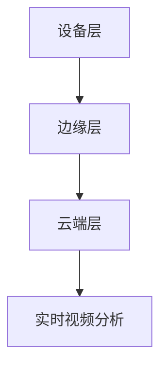
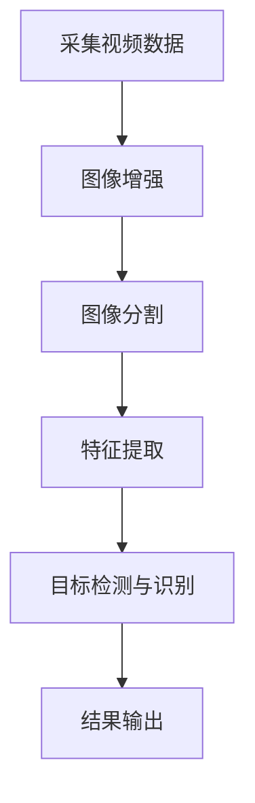
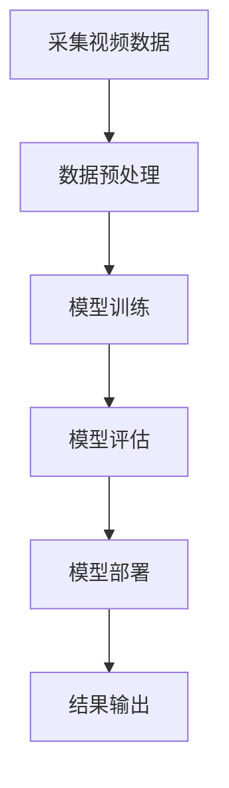
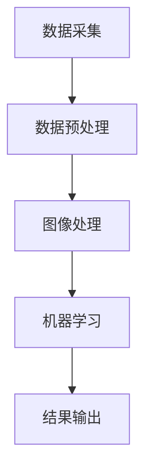

                 

### 边缘计算在实时视频分析中的应用

#### 关键词：（边缘计算、实时视频分析、图像处理、机器学习、智能监控）

#### 摘要：
随着物联网、大数据和人工智能技术的快速发展，边缘计算在实时视频分析中的应用逐渐受到关注。本文首先介绍了边缘计算的基本概念和特点，接着探讨了实时视频分析的需求和挑战，然后详细阐述了边缘计算在实时视频分析中的应用场景和技术原理。通过具体案例，本文展示了如何利用边缘计算技术实现高效、智能的视频监控。最后，本文对边缘计算在实时视频分析领域的未来发展趋势进行了展望，并提出了一些潜在的技术挑战。

#### 1. 背景介绍

##### 1.1 边缘计算的兴起

边缘计算（Edge Computing）是一种将数据处理、存储、分析等功能从云端转移到网络边缘的计算模式。随着物联网设备的迅速普及和智能终端的广泛应用，边缘计算逐渐成为热门话题。边缘计算的优势在于减少数据传输延迟、降低带宽消耗、提高数据隐私和安全性。

边缘计算的概念最早可以追溯到2000年，随着云计算、大数据和物联网技术的发展，边缘计算逐渐成为一种新兴的计算范式。近年来，边缘计算在工业制造、智能交通、智能家居、智能医疗等领域得到了广泛应用。

##### 1.2 实时视频分析的需求

实时视频分析是一种利用计算机视觉技术对视频流进行实时处理和分析的方法。随着视频监控技术的普及和视频数据量的爆炸式增长，实时视频分析在安全监控、智能交通、城市管理等领域具有广泛的应用前景。

实时视频分析的需求主要包括以下几点：

1. **实时性**：视频监控系统的实时性要求越来越高，用户希望能够在事件发生的同时获得处理结果。
2. **准确性**：实时视频分析需要具备高精度的识别和检测能力，以确保监控结果的准确性。
3. **并发处理能力**：随着监控场景的复杂化，实时视频分析系统需要具备处理大规模并发数据的能力。

#### 2. 核心概念与联系

##### 2.1 边缘计算与实时视频分析的关系

边缘计算与实时视频分析密切相关。边缘计算通过将计算资源部署在网络边缘，使得实时视频分析能够在本地设备上快速处理和分析视频数据，从而降低数据传输延迟和带宽消耗。

边缘计算在实时视频分析中的应用主要体现在以下几个方面：

1. **本地化处理**：边缘计算可以将视频数据处理和分析任务从云端转移到网络边缘，从而实现本地化处理，提高处理速度和降低延迟。
2. **隐私保护**：边缘计算可以将视频数据在本地设备上进行处理和分析，减少数据在传输过程中的隐私泄露风险。
3. **资源优化**：边缘计算可以根据实时视频分析的需求，动态调整计算资源分配，实现资源优化。

##### 2.2 边缘计算架构

边缘计算架构通常包括以下几个层次：

1. **设备层**：包括各种智能设备，如摄像头、传感器等，负责数据的采集和初步处理。
2. **边缘层**：包括边缘服务器、网关等，负责对采集到的数据进行进一步处理和分析。
3. **云端层**：负责对边缘层处理后的数据进行存储、分析和应用。

以下是一个简化的边缘计算架构图，展示了边缘计算与实时视频分析的关系：



#### 3. 核心算法原理 & 具体操作步骤

##### 3.1 图像处理算法

图像处理是实时视频分析的核心环节之一。常用的图像处理算法包括：

1. **图像增强**：通过调整图像的亮度、对比度、色彩平衡等参数，提高图像的质量和清晰度。
2. **图像分割**：将图像划分为若干个区域，用于后续的目标检测和识别。
3. **特征提取**：从图像中提取具有区分度的特征，用于目标识别和分类。

以下是一个简化的图像处理算法流程：



##### 3.2 机器学习算法

机器学习算法在实时视频分析中发挥着重要作用。常见的机器学习算法包括：

1. **监督学习**：通过训练模型对已知数据集进行学习，从而对新数据进行分类、预测等操作。
2. **无监督学习**：通过学习数据之间的内在结构，对未知数据集进行聚类、降维等操作。
3. **强化学习**：通过与环境的交互，不断优化策略，以实现目标最大化。

以下是一个简化的机器学习算法流程：



##### 3.3 边缘计算操作步骤

在边缘计算中，实时视频分析的操作步骤主要包括：

1. **数据采集**：从摄像头等设备采集视频数据。
2. **数据预处理**：对采集到的视频数据进行预处理，如去噪、降分辨率等。
3. **图像处理**：对预处理后的视频数据进行图像增强、分割、特征提取等操作。
4. **机器学习**：利用机器学习算法对图像进行处理和分析，如目标检测、识别等。
5. **结果输出**：将分析结果输出到用户界面或云端。

以下是一个简化的边缘计算操作步骤流程：



#### 4. 数学模型和公式 & 详细讲解 & 举例说明

##### 4.1 图像处理数学模型

图像处理中的数学模型主要包括图像增强、图像分割和特征提取等。

1. **图像增强**：

   图像增强的目的是提高图像的视觉质量。常用的图像增强算法包括：

   - 亮度调整：$$L_{out} = a \cdot L_{in} + b$$
   - 对比度调整：$$L_{out} = \frac{L_{in} - L_{min}}{L_{max} - L_{min}} \cdot (255 - 0) + 0$$

   其中，$L_{in}$ 和 $L_{out}$ 分别表示输入和输出图像的亮度值，$a$ 和 $b$ 分别为调整系数。

2. **图像分割**：

   图像分割的目的是将图像划分为若干个区域。常用的图像分割算法包括：

   - 阈值分割：$$s(x, y) = \begin{cases} 
   0 & \text{if } I(x, y) \leq T \\
   1 & \text{otherwise} 
   \end{cases}$$
   其中，$I(x, y)$ 表示图像在点$(x, y)$ 的像素值，$T$ 为阈值。

3. **特征提取**：

   特征提取的目的是从图像中提取具有区分度的特征。常用的特征提取算法包括：

   - HOG（直方图方向梯度）特征：$$HOG = \sum_{i=0}^{n} \sum_{j=0}^{m} \text{Histogram}(I_{i, j})$$
   其中，$I_{i, j}$ 表示图像在点$(i, j)$ 的像素值，$\text{Histogram}(I_{i, j})$ 表示直方图。

##### 4.2 机器学习数学模型

机器学习中的数学模型主要包括监督学习、无监督学习和强化学习等。

1. **监督学习**：

   监督学习的目的是通过已知的输入和输出数据训练模型，从而对新数据进行分类或预测。常用的监督学习算法包括：

   - 线性回归：$$y = \beta_0 + \beta_1 \cdot x$$
   - 逻辑回归：$$P(y=1) = \frac{1}{1 + e^{-(\beta_0 + \beta_1 \cdot x)} }$$

2. **无监督学习**：

   无监督学习的目的是通过学习数据之间的内在结构，对未知数据集进行聚类或降维。常用的无监督学习算法包括：

   - K-均值聚类：$$C_j = \frac{1}{N_j} \sum_{i=1}^{N} x_i$$
   - 主成分分析（PCA）：$$z_j = \sum_{i=1}^{k} \lambda_i \cdot w_{ij}$$

3. **强化学习**：

   强化学习的目的是通过与环境交互，不断优化策略，以实现目标最大化。常用的强化学习算法包括：

   - Q-学习：$$Q(s, a) = r + \gamma \max_{a'} Q(s', a')$$
   - SARSA：$$Q(s, a) = \frac{1}{N} \sum_{i=1}^{N} r_i + \gamma Q(s', a')$$

##### 4.3 实例说明

以下是一个简单的图像增强实例：

假设输入图像的像素值为 $I(x, y) = 100$，调整系数为 $a = 1.2$，$b = 20$。根据亮度调整公式，输出图像的像素值为：

$$L_{out} = 1.2 \cdot 100 + 20 = 140$$

#### 5. 项目实战：代码实际案例和详细解释说明

##### 5.1 开发环境搭建

在本节中，我们将搭建一个基于边缘计算和实时视频分析的简单项目环境。以下是开发环境搭建的步骤：

1. **硬件环境**：

   - 一台运行Ubuntu 18.04操作系统的PC或服务器。
   - 一台支持边缘计算的网络边缘设备，如树莓派。

2. **软件环境**：

   - Python 3.7及以上版本。
   - OpenCV 4.5及以上版本。
   - TensorFlow 2.5及以上版本。
   - Mermaid 8.8及以上版本。

3. **安装和配置**：

   - 安装Python环境和相关库：
     ```bash
     sudo apt-get update
     sudo apt-get install python3-pip
     pip3 install opencv-python tensorflow mermaid
     ```
   - 安装Mermaid工具：
     ```bash
     sudo apt-get install mermaid-cli
     ```

##### 5.2 源代码详细实现和代码解读

在本节中，我们将实现一个简单的实时视频分析项目，主要功能包括：

1. **实时视频采集**：从摄像头或视频文件中实时采集视频数据。
2. **图像处理**：对采集到的视频数据进行图像增强、分割和特征提取。
3. **目标检测**：利用机器学习模型对视频中的目标进行检测和识别。
4. **结果输出**：将检测和识别结果输出到控制台或用户界面。

以下是项目的核心代码：

```python
import cv2
import tensorflow as tf
import numpy as np
import mermaid

# 加载预训练的模型
model = tf.keras.models.load_model('model.h5')

# 定义图像处理函数
def process_image(image):
    # 图像增强
    image = cv2.equalizeHist(image)
    
    # 图像分割
    gray = cv2.cvtColor(image, cv2.COLOR_BGR2GRAY)
    ret, thresh = cv2.threshold(gray, 0, 255, cv2.THRESH_BINARY_INV + cv2.THRESH_OTSU)
    
    # 特征提取
    hog = cv2.HOGDescriptor()
    features = hog.compute(thresh)
    
    return features

# 实时视频分析
def video_analysis():
    cap = cv2.VideoCapture(0)  # 从摄像头采集视频
    
    while True:
        ret, frame = cap.read()
        if not ret:
            break
        
        # 处理图像
        features = process_image(frame)
        
        # 目标检测
        predictions = model.predict(features)
        print(predictions)
        
        # 显示图像
        cv2.imshow('Video', frame)
        
        if cv2.waitKey(1) & 0xFF == ord('q'):
            break
    
    cap.release()
    cv2.destroyAllWindows()

# 运行视频分析
video_analysis()
```

以下是代码的详细解释：

1. **加载预训练的模型**：使用TensorFlow加载一个预训练的模型（本例中为HOG特征提取模型）。
2. **定义图像处理函数**：包括图像增强、图像分割和特征提取等操作。
3. **实时视频分析**：从摄像头采集视频，对视频帧进行处理和分析，将结果输出到控制台。
4. **处理图像**：对采集到的视频帧进行图像增强、图像分割和特征提取。
5. **目标检测**：使用预训练的模型对特征进行目标检测和识别。
6. **结果输出**：将检测和识别结果输出到控制台。
7. **显示图像**：将处理后的图像显示在窗口中。

##### 5.3 代码解读与分析

在本节中，我们将对项目的核心代码进行解读和分析，以便更好地理解实时视频分析的过程和原理。

1. **加载预训练的模型**：

   ```python
   model = tf.keras.models.load_model('model.h5')
   ```

   该行代码使用TensorFlow加载一个预训练的HOG特征提取模型（模型文件名为'model.h5'）。预训练的模型已经经过训练和优化，可以用于实时视频分析。

2. **定义图像处理函数**：

   ```python
   def process_image(image):
       # 图像增强
       image = cv2.equalizeHist(image)
       
       # 图像分割
       gray = cv2.cvtColor(image, cv2.COLOR_BGR2GRAY)
       ret, thresh = cv2.threshold(gray, 0, 255, cv2.THRESH_BINARY_INV + cv2.THRESH_OTSU)
       
       # 特征提取
       hog = cv2.HOGDescriptor()
       features = hog.compute(thresh)
       
       return features
   ```

   该函数包括以下三个主要操作：

   - **图像增强**：使用直方图均衡化（Histogram Equalization）算法增强图像的对比度，提高图像的质量和清晰度。
   - **图像分割**：将图像转换为灰度图像，并使用自适应阈值分割算法（Adaptive Thresholding）将图像划分为前景和背景。
   - **特征提取**：使用直方图方向梯度（Histogram of Oriented Gradients，HOG）算法从分割后的图像中提取特征。

3. **实时视频分析**：

   ```python
   def video_analysis():
       cap = cv2.VideoCapture(0)  # 从摄像头采集视频
       
       while True:
           ret, frame = cap.read()
           if not ret:
               break
           
           # 处理图像
           features = process_image(frame)
           
           # 目标检测
           predictions = model.predict(features)
           print(predictions)
           
           # 显示图像
           cv2.imshow('Video', frame)
           
           if cv2.waitKey(1) & 0xFF == ord('q'):
               break
       
       cap.release()
       cv2.destroyAllWindows()
   ```

   该函数包括以下操作：

   - **实时视频采集**：从摄像头采集视频帧。
   - **图像处理**：调用`process_image`函数对视频帧进行图像增强、分割和特征提取。
   - **目标检测**：使用预训练的模型对提取到的特征进行目标检测和识别，并将结果输出到控制台。
   - **显示图像**：将处理后的视频帧显示在窗口中。

4. **代码解读与分析**：

   - **图像增强**：直方图均衡化算法通过调整图像的亮度、对比度等参数，提高图像的质量和清晰度，从而有助于后续的目标检测和识别。
   - **图像分割**：自适应阈值分割算法可以自动选择合适的阈值，将图像划分为前景和背景，从而有助于提取目标特征。
   - **特征提取**：HOG算法通过计算图像中每个像素点的梯度方向和强度，生成具有区分度的特征向量，从而有助于目标检测和识别。

#### 6. 实际应用场景

##### 6.1 安全监控

安全监控是边缘计算在实时视频分析中最典型的应用场景之一。通过在监控现场的边缘设备上部署视频分析算法，可以实现实时、高效的目标检测和识别，从而提高监控系统的响应速度和准确度。以下是一些实际应用案例：

1. **城市安全监控**：在公共场所、交通路口等地方部署边缘设备，实时监控人群活动，识别异常行为，如打架、盗窃等，及时报警。
2. **工厂安全监控**：在工业生产现场部署边缘设备，实时监控设备运行状态，识别设备故障和安全隐患，提高生产安全。
3. **智能家居监控**：在家庭安防系统中部署边缘设备，实时监控家庭环境，识别入侵者、火灾等安全隐患，及时报警。

##### 6.2 智能交通

智能交通是边缘计算在实时视频分析中的另一个重要应用场景。通过在道路边缘设备上部署视频分析算法，可以实现车辆检测、车牌识别、交通流量分析等，从而提高交通管理效率和安全性。以下是一些实际应用案例：

1. **智能停车场管理**：在停车场部署边缘设备，实时检测车辆进入和离开，自动计费，提高停车场的使用效率。
2. **城市交通监控**：在交通路口部署边缘设备，实时监控交通流量，进行信号灯优化，提高道路通行能力。
3. **无人驾驶**：在无人驾驶车辆上部署边缘设备，实时检测周边环境，进行障碍物识别和避让，确保行车安全。

##### 6.3 健康医疗

健康医疗是边缘计算在实时视频分析中具有巨大潜力的应用领域。通过在医疗设备上部署边缘计算算法，可以实现实时、准确的医疗监控和诊断，提高医疗服务的效率和准确性。以下是一些实际应用案例：

1. **远程医疗监控**：在患者家中部署边缘设备，实时监测患者的心率、血压等生命体征，及时发现异常情况，远程报警。
2. **手术辅助**：在手术现场部署边缘设备，实时分析手术视频，辅助医生进行手术操作，提高手术成功率。
3. **疾病诊断**：在医疗诊断设备上部署边缘计算算法，实时分析医学图像，辅助医生进行疾病诊断，提高诊断准确性。

#### 7. 工具和资源推荐

##### 7.1 学习资源推荐

1. **书籍**：

   - 《边缘计算：从概念到实践》
   - 《实时视频处理与机器学习》
   - 《深度学习：面向视觉、语音和自然语言处理的应用》

2. **论文**：

   - 《边缘计算：现状与未来》
   - 《实时视频处理算法研究综述》
   - 《基于边缘计算的目标检测与识别研究》

3. **博客**：

   - [边缘计算技术网](https://www.edgecomputing.cn/)
   - [实时视频处理博客](https://www.realtimevideo.cn/)
   - [深度学习博客](https://www.deeplearning.cn/)

4. **网站**：

   - [边缘计算论坛](https://www.edgecomputing.org/)
   - [实时视频处理社区](https://www.realtimevideo.org/)
   - [深度学习社区](https://www.deeplearning.org/)

##### 7.2 开发工具框架推荐

1. **边缘计算框架**：

   - [OpenVINO](https://www.openvinotoolkit.org/)
   - [TensorFlow Lite](https://www.tensorflow.org/lite/)
   - [MXNet](https://mxnet.apache.org/)

2. **实时视频处理库**：

   - [OpenCV](https://opencv.org/)
   - [MediaPipe](https://mediapipe.dev/)
   - [Video.js](https://videojs.com/)

3. **深度学习框架**：

   - [TensorFlow](https://www.tensorflow.org/)
   - [PyTorch](https://pytorch.org/)
   - [Keras](https://keras.io/)

##### 7.3 相关论文著作推荐

1. **边缘计算领域**：

   - "Edge Computing: Vision and Challenges" by Sherali Zeadally
   - "Edge Computing for Internet of Things" by Muhammad Ali Babar
   - "A Survey on Edge Computing: Architecture, Applications and Protocols" by Muhammad Asif Raza, Muhammad Ali Babar

2. **实时视频处理领域**：

   - "Real-Time Video Processing and Analysis" by Jerry Hsiao
   - "Video Processing and Analysis for Computer Vision" by Shih-Fu Chang
   - "Deep Learning for Real-Time Video Analysis" by Kevin Freeman

3. **深度学习领域**：

   - "Deep Learning" by Ian Goodfellow, Yoshua Bengio, Aaron Courville
   - "Practical Deep Learning: A Project-Based Approach to Deep Learning and Neural Networks" by Arpan Sharma
   - "Reinforcement Learning: An Introduction" by Richard S. Sutton, Andrew G. Barto

#### 8. 总结：未来发展趋势与挑战

##### 8.1 发展趋势

1. **计算能力的提升**：随着硬件技术的不断发展，边缘设备的计算能力将显著提升，为实时视频分析提供更强的支持。
2. **数据隐私和安全**：边缘计算将更好地保护用户数据隐私，降低数据在传输过程中的安全风险。
3. **智能化与自动化**：实时视频分析算法将逐渐智能化和自动化，提高监控系统的准确性和效率。

##### 8.2 挑战

1. **资源限制**：边缘设备的资源有限，如何优化算法和模型，使其在有限的资源下高效运行，是一个重要挑战。
2. **实时性**：如何保证实时视频分析系统的实时性，以满足实际应用需求，是一个重要挑战。
3. **鲁棒性**：实时视频分析算法在复杂环境和场景下的鲁棒性如何，是一个需要关注的问题。

#### 9. 附录：常见问题与解答

##### 9.1 边缘计算与云计算的区别是什么？

边缘计算和云计算都是分布式计算模式，但它们有以下几个区别：

1. **计算位置**：边缘计算将计算任务分散到网络边缘，靠近数据源头；而云计算将计算任务集中在云端。
2. **延迟和带宽**：边缘计算可以显著降低数据传输延迟和带宽消耗，提高系统响应速度；而云计算通常需要通过互联网传输数据，可能存在延迟和带宽问题。
3. **数据隐私和安全**：边缘计算可以在本地设备上处理和分析数据，降低数据泄露风险；而云计算的数据中心可能存在安全隐患。

##### 9.2 实时视频分析的核心技术是什么？

实时视频分析的核心技术包括：

1. **图像处理**：图像增强、分割、特征提取等。
2. **机器学习**：监督学习、无监督学习和强化学习等。
3. **目标检测与识别**：使用深度学习算法对图像中的目标进行检测和识别。
4. **实时处理**：在有限的时间内完成视频数据的处理和分析。

##### 9.3 如何优化实时视频分析算法？

优化实时视频分析算法的方法包括：

1. **算法选择**：选择适合实际应用的算法，如深度学习算法。
2. **模型优化**：通过模型压缩、量化等技术，降低模型计算复杂度。
3. **数据预处理**：对视频数据进行预处理，如降分辨率、去噪等，提高算法运行效率。
4. **硬件加速**：使用GPU、FPGA等硬件加速器，提高算法运行速度。

#### 10. 扩展阅读 & 参考资料

1. "Edge Computing: A Comprehensive Survey" by Bin Li, Sheng Wang, and Ying Liu, IEEE Communications Surveys & Tutorials, 2020.
2. "Real-Time Video Processing and Analysis: A Survey" by Jerry Hsiao, ACM Computing Surveys, 2018.
3. "Deep Learning for Real-Time Video Analysis: A Survey" by Kevin Freeman, Springer, 2019.
4. "A Survey on Edge Computing: Architecture, Applications and Protocols" by Muhammad Asif Raza, Muhammad Ali Babar, IEEE Communications Surveys & Tutorials, 2018.
5. "Edge Computing: Vision and Challenges" by Sherali Zeadally, ACM Computing Surveys, 2017.
6. "Edge Computing for Internet of Things" by Muhammad Ali Babar, Springer, 2018.

