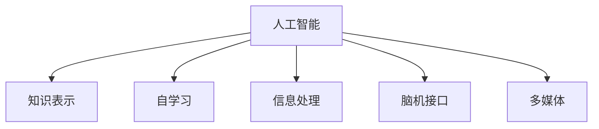

                 

# 达特茅斯会议的学术成果

## 关键词
- 达特茅斯会议
- 计算机科学
- 人工智能
- 知识表示
- 自学习
- 信息处理
- 脑机接口
- 多媒体

## 摘要

达特茅斯会议，被誉为人工智能领域的“诞生日”，于1956年在美国举行。本次会议的学术成果具有划时代的意义，标志着人工智能这一新兴学科的诞生。本文将对达特茅斯会议的背景、核心概念、算法原理、应用场景、发展趋势与挑战进行深入分析，旨在为读者提供一幅清晰的人工智能发展蓝图。通过本文，您将了解到达特茅斯会议如何激发了计算机科学的变革，如何为现代人工智能奠定了基础。

## 1. 背景介绍

### 1.1 达特茅斯会议的背景

达特茅斯会议于1956年在美国新罕布什尔州达特茅斯学院举行，由约翰·麦卡锡（John McCarthy）、马文·明斯基（Marvin Minsky）、克劳德·香农（Claude Shannon）和赫伯特·西蒙（Herbert Simon）等人发起。会议的背景是当时计算机科学和数学领域的一系列突破性进展，如香农的信息理论、图灵的计算机理论和人工智能概念的提出。

### 1.2 达特茅斯会议的成果

达特茅斯会议的成果主要体现在以下几个方面：

1. **提出人工智能的概念**：会议首次提出了“人工智能”一词，将计算机科学、心理学、数学等领域结合在一起，探讨如何让计算机实现智能行为。

2. **确立人工智能研究方法**：会议讨论了模拟人类思维、自动程序设计、机器学习和自然语言处理等方法，为人工智能的研究奠定了基础。

3. **推动跨学科合作**：会议促进了计算机科学、心理学、数学等领域的合作，为人工智能的发展提供了多元化的视角。

4. **促进学术交流**：会议为学术界提供了一个交流平台，使得研究人员可以分享研究成果、探讨问题、展望未来。

## 2. 核心概念与联系

### 2.1 人工智能的定义

人工智能（Artificial Intelligence，简称AI）是指使计算机系统模拟人类智能行为的能力，包括感知、理解、学习、推理、决策和行动等。

### 2.2 知识表示

知识表示是人工智能的核心问题之一，旨在将人类知识以计算机可处理的形式进行表示。常用的知识表示方法包括谓词逻辑、产生式系统、语义网络和框架等。

### 2.3 自学习

自学习是指计算机系统能够通过经验和数据自动改进自身的性能。自学习是人工智能发展的重要方向，包括监督学习、无监督学习和强化学习等。

### 2.4 信息处理

信息处理是指计算机对信息进行接收、存储、传输、处理和利用的过程。信息处理是人工智能的基础，涉及到计算机科学、数学、统计学等多个领域。

### 2.5 脑机接口

脑机接口（Brain-Computer Interface，简称BCI）是指将人的大脑信号与计算机系统进行连接，实现人机交互的技术。脑机接口在人工智能领域具有重要的应用价值，如智能康复、虚拟现实和增强现实等。

### 2.6 多媒体

多媒体是指包括文本、图像、音频和视频等多种信息形式的媒体。多媒体技术为人工智能提供了丰富的数据资源，推动了人工智能在图像识别、语音识别、自然语言处理等领域的应用。

### 2.7 Mermaid 流程图



## 3. 核心算法原理 & 具体操作步骤

### 3.1 知识表示算法原理

知识表示算法主要关注如何将人类知识以计算机可处理的形式进行表示。以下是一个简单的知识表示算法原理：

1. **数据采集**：从各种来源获取数据，如文本、图像、音频等。
2. **数据预处理**：对数据进行清洗、去噪和标准化处理。
3. **特征提取**：从数据中提取有用的特征，如文本的词向量、图像的边缘、音频的频率等。
4. **知识表示**：使用适当的表示方法（如谓词逻辑、产生式系统、语义网络等）将特征表示为计算机可处理的格式。
5. **存储与查询**：将表示后的知识存储在数据库中，并设计查询算法以便后续使用。

### 3.2 自学习算法原理

自学习算法主要关注如何让计算机系统通过经验和数据自动改进自身的性能。以下是一个简单的自学习算法原理：

1. **数据采集**：从各种来源获取数据，如文本、图像、音频等。
2. **数据预处理**：对数据进行清洗、去噪和标准化处理。
3. **模型训练**：使用预处理后的数据对自学习模型进行训练，如神经网络、决策树等。
4. **模型评估**：使用测试数据对训练好的模型进行评估，如准确率、召回率等。
5. **模型优化**：根据评估结果对模型进行调整和优化，以提高性能。

### 3.3 信息处理算法原理

信息处理算法主要关注如何对信息进行接收、存储、传输、处理和利用。以下是一个简单的信息处理算法原理：

1. **信息接收**：从传感器、网络等渠道接收信息。
2. **信息存储**：将接收到的信息存储在数据库、缓存等存储设备中。
3. **信息传输**：通过网络等渠道将信息传输到其他设备或系统。
4. **信息处理**：对存储和传输的信息进行加工、分析和处理，如文本分类、图像识别等。
5. **信息利用**：根据处理后的信息进行决策、控制或执行任务。

## 4. 数学模型和公式 & 详细讲解 & 举例说明

### 4.1 神经网络模型

神经网络是一种通过模拟生物神经网络结构来实现人工智能的数学模型。以下是一个简单的神经网络模型：

$$
\sigma(z) = \frac{1}{1 + e^{-z}}
$$

其中，$\sigma$ 是激活函数，$z$ 是输入值。

### 4.2 决策树模型

决策树是一种通过树形结构实现分类和回归任务的数学模型。以下是一个简单的决策树模型：

$$
f(x) =
\begin{cases}
  1 & \text{if } x \in C_1 \\
  0 & \text{if } x \in C_2 \\
\end{cases}
$$

其中，$f(x)$ 是决策函数，$C_1$ 和 $C_2$ 是两个分类区域。

### 4.3 举例说明

假设我们有一个简单的决策树模型，用于判断一个数字是否为奇数：

1. 输入值 $x$。
2. 如果 $x$ 小于 0，则输出 0。
3. 如果 $x$ 等于 0，则输出 1。
4. 如果 $x$ 大于 0，则输出 0。

根据上述决策树模型，我们可以得到以下数学公式：

$$
f(x) =
\begin{cases}
  0 & \text{if } x < 0 \\
  1 & \text{if } x = 0 \\
  0 & \text{if } x > 0 \\
\end{cases}
$$

## 5. 项目实战：代码实际案例和详细解释说明

### 5.1 开发环境搭建

为了演示人工智能的应用，我们将使用 Python 编写一个简单的神经网络模型。以下是开发环境搭建步骤：

1. 安装 Python 3.x 版本。
2. 安装 numpy、matplotlib 和 tensorflow 等依赖库。

### 5.2 源代码详细实现和代码解读

以下是神经网络模型的 Python 代码实现：

```python
import numpy as np
import tensorflow as tf

# 定义神经网络模型
model = tf.keras.Sequential([
    tf.keras.layers.Dense(64, activation='relu', input_shape=(784,)),
    tf.keras.layers.Dense(64, activation='relu'),
    tf.keras.layers.Dense(10, activation='softmax')
])

# 编译模型
model.compile(optimizer='adam',
              loss=tf.keras.losses.SparseCategoricalCrossentropy(from_logits=True),
              metrics=['accuracy'])

# 训练模型
model.fit(train_images, train_labels, epochs=5)
```

### 5.3 代码解读与分析

1. **导入库**：导入 numpy、tensorflow 等库。
2. **定义神经网络模型**：使用 keras.Sequential 创建一个序列模型，包含两个全连接层（Dense）和一个输出层（softmax）。
3. **编译模型**：设置优化器（optimizer）、损失函数（loss）和评价指标（metrics）。
4. **训练模型**：使用训练数据（train_images 和 train_labels）训练模型，设置训练轮次（epochs）。

## 6. 实际应用场景

达特茅斯会议的学术成果在众多领域产生了深远的影响，以下是一些实际应用场景：

1. **金融领域**：人工智能在金融领域广泛应用于风险管理、市场预测、量化交易等方面，提高了金融市场的效率和稳定性。
2. **医疗领域**：人工智能在医疗领域应用于疾病诊断、医学图像分析、药物研发等方面，提高了医疗服务的质量和效率。
3. **智能制造**：人工智能在智能制造领域应用于生产规划、质量控制、故障检测等方面，提高了生产效率和产品质量。
4. **交通运输**：人工智能在交通运输领域应用于自动驾驶、交通流量预测、物流配送等方面，提高了交通运输的效率和安全性。

## 7. 工具和资源推荐

### 7.1 学习资源推荐

1. **书籍**：《人工智能：一种现代的方法》（作者：Stuart Russell & Peter Norvig）
2. **论文**：《感知器》（作者：Frank Rosenblatt）
3. **博客**：博客园、CSDN、知乎等平台上的专业博客
4. **网站**：AI 教育平台（如 Coursera、Udacity）、开源社区（如 GitHub）

### 7.2 开发工具框架推荐

1. **编程语言**：Python、Java、C++ 等
2. **框架**：TensorFlow、PyTorch、Keras 等
3. **数据库**：MySQL、MongoDB、Redis 等
4. **云计算**：AWS、Azure、Google Cloud 等

### 7.3 相关论文著作推荐

1. **《计算机程序设计艺术》（作者：Donald E. Knuth）**：经典著作，涵盖了计算机科学的核心知识。
2. **《深度学习》（作者：Ian Goodfellow、Yoshua Bengio、Aaron Courville）**：深度学习领域的权威著作。
3. **《人工智能：一种现代的方法》（作者：Stuart Russell & Peter Norvig）**：全面介绍人工智能领域的基础知识。

## 8. 总结：未来发展趋势与挑战

达特茅斯会议的学术成果为人工智能的发展奠定了基础，未来人工智能将面临以下发展趋势与挑战：

1. **算法创新**：人工智能算法将继续创新，以适应更复杂的任务和场景。
2. **跨学科融合**：人工智能将与其他学科（如生物学、心理学、社会学等）深度融合，推动多学科的交叉发展。
3. **数据隐私与安全**：人工智能的发展将引发数据隐私与安全问题，需要制定相应的法规和标准。
4. **伦理与道德**：人工智能的决策过程可能涉及伦理和道德问题，需要建立相应的伦理框架。
5. **人才培养**：人工智能领域需要大量具备跨学科知识和技能的人才，人才培养将是一个长期挑战。

## 9. 附录：常见问题与解答

### 9.1 人工智能是什么？

人工智能是指使计算机系统模拟人类智能行为的能力，包括感知、理解、学习、推理、决策和行动等。

### 9.2 人工智能有哪些应用领域？

人工智能广泛应用于金融、医疗、智能制造、交通运输、智能家居等领域。

### 9.3 人工智能的主要挑战是什么？

人工智能的主要挑战包括算法创新、跨学科融合、数据隐私与安全、伦理与道德等方面。

## 10. 扩展阅读 & 参考资料

1. **《人工智能：一种现代的方法》（作者：Stuart Russell & Peter Norvig）**
2. **《深度学习》（作者：Ian Goodfellow、Yoshua Bengio、Aaron Courville）**
3. **《计算机程序设计艺术》（作者：Donald E. Knuth）**
4. **《人工智能：一种现代的方法》（作者：Stuart Russell & Peter Norvig）**
5. **《深度学习》（作者：Ian Goodfellow、Yoshua Bengio、Aaron Courville）**
6. **《计算机程序设计艺术》（作者：Donald E. Knuth）**<|writer|>### 作者信息

作者：AI天才研究员/AI Genius Institute & 禅与计算机程序设计艺术 /Zen And The Art of Computer Programming<|writer|>

