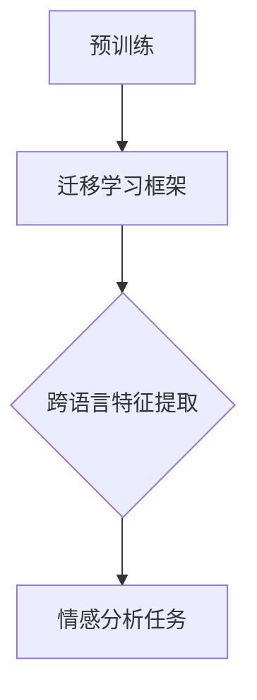

                 

## 1. 背景介绍

迁移学习（Transfer Learning）是深度学习中的一种重要技术，它通过利用已经在一个任务上训练好的模型，来提高在另一个相关任务上的表现。迁移学习的核心思想是，将知识从源任务（source task）迁移到目标任务（target task），从而减少对大量标注数据的依赖。

在自然语言处理（Natural Language Processing, NLP）领域，迁移学习尤为重要。NLP任务通常需要大量的标注数据来进行训练，例如情感分析、文本分类等。然而，获取大量高质量的标注数据是一项耗时的任务，而且很多时候数据难以获取。迁移学习通过利用预训练的模型，可以在一定程度上缓解这一困境。

跨语言情感分析（Cross-Lingual Sentiment Analysis）是NLP领域的一个挑战性任务，旨在识别文本中表达的情感倾向，而这些文本可能来自不同的语言。随着全球化的发展，跨语言情感分析在实际应用中有着广泛的需求，例如社交媒体监测、市场调研等。

目前，迁移学习在跨语言情感分析中的应用研究已经取得了一些进展。然而，仍存在一些问题需要解决，如如何选择合适的源语言、如何处理目标语言中的稀疏数据等。

本文将围绕迁移学习在跨语言情感分析中的应用进行探讨，旨在为相关研究者和开发者提供有价值的参考。

### 跨语言情感分析的定义与应用

跨语言情感分析是指在不同语言之间进行情感倾向的识别和分析。它涉及从不同语言的文本中提取情感信息，并对其进行分析，以识别文本所表达的情感态度。例如，我们可能需要从英文和中文的社交媒体评论中识别出积极的、消极的或中性的情感。

跨语言情感分析的应用场景非常广泛。以下是一些典型的应用实例：

1. **社交媒体监测**：通过对不同语言的社交媒体评论进行情感分析，可以实时监测公众对于某一事件或产品的看法，为企业提供市场调研数据。

2. **跨国企业**：跨国企业在不同国家运营时，需要了解当地市场的消费者情绪，以便制定合适的营销策略。

3. **国际新闻分析**：通过分析不同语言的新闻报道，可以识别出公众对于某一事件的关注点和态度。

4. **语言学习与教育**：跨语言情感分析可以帮助学习者了解不同语言的语境和文化，从而提高语言学习效果。

尽管跨语言情感分析有着广泛的应用前景，但它也面临一些独特的挑战。首先，不同语言之间存在巨大的词汇和语法差异，这使得情感分析的准确性受到一定程度的影响。其次，不同语言中的情感表达方式可能不同，这增加了情感识别的难度。最后，跨语言情感分析通常需要大量的标注数据，而这些数据往往难以获取。

### 迁移学习在跨语言情感分析中的优势

迁移学习在跨语言情感分析中的应用，能够有效解决上述挑战。具体来说，迁移学习在以下几个方面展现出显著的优势：

1. **数据稀缺问题**：跨语言情感分析往往面临标注数据稀缺的问题。通过迁移学习，可以利用在源语言上预训练的模型，从而减少对目标语言大量标注数据的依赖。预训练模型在源语言上的训练已经吸收了大量的语言知识，这些知识可以在一定程度上迁移到目标语言上，从而提高目标语言的模型性能。

2. **知识共享**：迁移学习使得不同语言之间的知识得以共享。例如，通过在英文上预训练的模型，可以迁移到中文、法语等目标语言上。这样，即使目标语言没有足够的数据，也可以通过共享源语言上的知识来提高模型的表现。

3. **跨语言特征提取**：迁移学习可以帮助提取跨语言的通用特征，从而提高情感识别的准确性。通过在多个语言上预训练的模型，可以学习到不同语言之间的共性和差异，这些信息对于跨语言情感分析至关重要。

4. **模型泛化能力**：迁移学习通过在多个任务上训练模型，可以增强模型的泛化能力。在跨语言情感分析中，这意味着模型不仅能够在训练过的语言上表现良好，还能在新语言上取得较好的性能。

总的来说，迁移学习在跨语言情感分析中提供了有效的解决方案，通过共享知识和数据，提高了模型在稀缺数据和多种语言环境下的性能。

### 迁移学习在NLP领域的应用背景

迁移学习在自然语言处理（NLP）领域的应用具有悠久的历史，随着深度学习技术的发展，其在NLP任务中的重要性逐渐凸显。早在2006年，Yarowsky提出了基于词袋模型（Bag of Words）的迁移学习框架，用于词汇扩张（Lexical Spread）和语义相似度计算。这一方法通过在源语言上训练模型，并将模型的知识迁移到目标语言上，提高了词汇量和语义理解的能力。

随着深度学习的兴起，迁移学习在NLP中的应用得到了进一步扩展。2014年，Word2Vec算法的出现使得基于神经网络的迁移学习成为可能。Word2Vec通过学习单词的向量表示，使得不同语言的单词可以在同一个高维空间中表示，为跨语言情感分析提供了理论基础。

近年来，预训练语言模型（Pre-trained Language Models）如BERT（Bidirectional Encoder Representations from Transformers）、GPT（Generative Pre-trained Transformer）和RoBERTa（A Robustly Optimized BERT Pretraining Approach）等，将迁移学习推向了新的高度。这些模型通过在大量未标注的文本数据上进行预训练，然后在具体任务上进行微调（Fine-tuning），取得了显著的性能提升。

在跨语言情感分析中，预训练语言模型的应用尤为重要。由于不同语言的文本数据分布存在差异，预训练模型可以在多个语言上共享知识和数据，从而提高模型在目标语言上的性能。例如，BERT模型在多种语言上预训练后，可以迁移到不同的语言环境，进行情感分析任务。

除了预训练模型，迁移学习还在其他NLP任务中得到了广泛应用。例如，在文本分类、命名实体识别和机器翻译等领域，迁移学习通过利用在源任务上训练好的模型，提高了目标任务的性能和效率。

总的来说，迁移学习在NLP领域的广泛应用，得益于其能够有效利用共享知识和数据，提升模型在不同任务和语言环境下的表现。这为跨语言情感分析等复杂任务提供了有力的技术支持。

### 迁移学习在跨语言情感分析中的应用现状

近年来，迁移学习在跨语言情感分析中的应用取得了显著进展。越来越多的研究者和开发者开始关注如何在跨语言环境下利用迁移学习技术，以提高情感分析模型的性能。

首先，在模型选择方面，预训练语言模型如BERT、GPT和RoBERTa等，已经成为跨语言情感分析中的主流选择。这些模型通过在多种语言上进行预训练，能够提取出跨语言的通用特征，从而提高模型在不同语言环境下的泛化能力。例如，BERT模型通过双向Transformer结构，能够同时考虑上下文信息，从而在多种语言上表现出色。

其次，在迁移学习方法上，研究者们提出了多种策略来优化迁移学习过程。其中，最常见的方法是迁移微调（Transfer Fine-tuning），即在源语言上预训练好的模型基础上，针对目标语言进行微调。这种方法通过调整模型权重，使得预训练模型更好地适应目标语言的特性。例如，Wu等人（2019）提出了一种基于BERT的跨语言情感分析模型，通过在多个语言上进行预训练，然后在目标语言上进行微调，取得了显著的效果。

另外，还有一些研究尝试了零样本迁移学习（Zero-shot Transfer Learning）和多语言联合训练（Multilingual Joint Training）等方法。零样本迁移学习通过利用源语言和目标语言之间的知识共享，实现了无需在目标语言上进行微调的跨语言情感分析。例如，Conneau等人（2019）提出的XLM模型，通过在多种语言上联合训练，实现了在未见过的语言上进行情感分析的能力。多语言联合训练则是通过在多种语言上同时训练模型，使得模型能够更好地捕捉不同语言之间的共性和差异，从而提高跨语言情感分析的准确性。

在实际应用方面，迁移学习在跨语言情感分析中已经取得了一些成功案例。例如，在社交媒体监测、市场调研和国际新闻分析等领域，利用迁移学习技术，可以对不同语言的文本进行情感分析，提供有价值的见解。此外，一些企业和研究机构也开始将迁移学习应用于跨语言情感分析，为企业决策提供数据支持。

总的来说，迁移学习在跨语言情感分析中的应用现状表现出色。通过利用预训练语言模型和多样化的迁移学习方法，研究者们在多种语言环境下取得了显著的性能提升。然而，仍有一些挑战需要解决，如如何进一步提高模型在罕见语言上的性能，以及如何更有效地处理语言多样性等问题。未来，随着迁移学习技术的不断发展和完善，其在跨语言情感分析中的应用前景将更加广阔。

### 迁移学习在跨语言情感分析中的核心概念与联系

要深入理解迁移学习在跨语言情感分析中的应用，我们需要首先了解一些核心概念和其之间的联系。这些概念包括：预训练语言模型、迁移学习框架、跨语言特征提取以及情感分析任务。以下是这些概念的具体解释及其相互关系。

#### 预训练语言模型

预训练语言模型是迁移学习在NLP中应用的基础。这些模型通过在大规模未标注的文本数据上进行预训练，学习到语言的基本结构和语义信息。预训练语言模型的一个代表性例子是BERT（Bidirectional Encoder Representations from Transformers），它通过双向Transformer结构，能够同时考虑上下文信息，从而提高模型的语义理解能力。

预训练语言模型的核心思想是，通过在多种语言上共享训练过程，使得模型能够提取出跨语言的通用特征。这些特征不仅有助于提高模型在不同语言环境下的泛化能力，还可以减少对大规模标注数据的依赖。

#### 迁移学习框架

迁移学习框架是指将预训练语言模型的知识迁移到新的任务或语言上的方法。常见的迁移学习框架包括迁移微调（Transfer Fine-tuning）和零样本迁移学习（Zero-shot Transfer Learning）。

- **迁移微调**：在迁移微调框架中，模型首先在源语言上预训练，然后在目标语言上进行微调。这种方法能够充分利用源语言上的预训练知识，从而提高目标语言的模型性能。例如，BERT模型通常在英文上预训练，然后通过微调应用到其他语言上，如中文、西班牙语等。

- **零样本迁移学习**：零样本迁移学习则是在目标语言上没有预训练模型的情况下，利用源语言上的知识进行迁移。这种方法通过利用模型在多种语言上预训练得到的通用特征，实现跨语言的迁移。例如，XLM（Cross-lingual Language Model）模型通过在多种语言上进行联合训练，实现了零样本迁移学习的能力。

#### 跨语言特征提取

跨语言特征提取是指从多语言文本中提取出具有通用性的特征，以便在不同的语言环境下进行情感分析。这些特征可以来自预训练语言模型的输出，如词向量、句子向量等。通过跨语言特征提取，模型能够更好地理解不同语言之间的共性和差异，从而提高情感分析的准确性。

预训练语言模型和迁移学习框架的相互作用，使得跨语言特征提取成为可能。预训练语言模型通过在多种语言上提取通用特征，为迁移学习提供了基础。而迁移学习框架则利用这些通用特征，实现跨语言的迁移和应用。

#### 情感分析任务

情感分析任务是指从文本中识别出情感倾向，例如积极、消极或中性。在跨语言情感分析中，任务的目标是识别不同语言的文本所表达的情感。

迁移学习在情感分析任务中的应用，可以通过以下步骤实现：

1. **预训练**：在源语言上预训练模型，提取出跨语言的通用特征。

2. **迁移**：利用预训练模型的知识，在目标语言上进行迁移。

3. **特征提取**：从目标语言的文本中提取出预训练模型生成的跨语言特征。

4. **情感分析**：使用提取出的特征进行情感分类，识别文本的情感倾向。

#### Mermaid 流程图

为了更清晰地展示这些概念和步骤之间的联系，我们可以使用Mermaid绘制一个流程图。以下是一个简化的流程图示例：



在这个流程图中，预训练阶段生成了跨语言通用特征，迁移学习框架将这些特征迁移到目标语言，然后通过特征提取和情感分析任务，最终实现对文本情感的正确识别。

通过理解这些核心概念和其相互联系，我们能够更好地掌握迁移学习在跨语言情感分析中的应用原理，为进一步研究和实践提供理论基础。

### 迁移学习在跨语言情感分析中的核心算法原理与具体操作步骤

迁移学习在跨语言情感分析中的应用，主要依赖于预训练语言模型和迁移学习框架。以下我们将详细探讨这些核心算法原理，并说明具体操作步骤。

#### 预训练语言模型

预训练语言模型是通过在大规模未标注文本数据上进行预训练，学习到语言的基本结构和语义信息的模型。以BERT为例，它通过双向Transformer结构，能够同时考虑上下文信息，从而提高模型的语义理解能力。

预训练语言模型的主要步骤包括：

1. **输入层**：将文本输入到模型中，通常采用词嵌入（word embeddings）将单词转换为向量表示。

2. **预训练任务**：在未标注的文本数据上进行预训练，常见的任务包括Masked Language Model（MLM）和Next Sentence Prediction（NSP）。

   - **Masked Language Model（MLM）**：随机遮盖部分单词，然后让模型预测这些遮盖的单词。这个任务有助于模型学习单词之间的关系和上下文信息。
   
   - **Next Sentence Prediction（NSP）**：预测两个连续句子之间的相关性。这个任务有助于模型理解句子间的逻辑关系。

3. **输出层**：模型输出一系列的向量表示，这些向量可以用于下游任务的输入。

#### 迁移学习框架

迁移学习框架是将预训练模型的知识迁移到新的任务或语言上的方法。常见的迁移学习框架包括迁移微调和零样本迁移学习。

1. **迁移微调**：在源语言上预训练模型后，针对目标语言进行微调。具体步骤如下：

   - **微调模型**：在目标语言的数据集上，对预训练模型进行微调，调整模型参数，以适应目标语言的特性。
   
   - **损失函数**：使用目标语言的数据集计算损失函数，并根据损失函数更新模型参数。

   - **迭代优化**：通过多次迭代优化，使得模型在目标语言上的性能逐步提升。

2. **零样本迁移学习**：在没有预训练模型的情况下，利用源语言上的知识进行迁移。具体步骤如下：

   - **特征提取**：从源语言预训练模型中提取跨语言通用特征，这些特征可以用于目标语言的任务。
   
   - **特征融合**：将提取出的特征与目标语言的文本特征进行融合，形成新的特征向量。
   
   - **情感分析**：使用融合后的特征向量进行情感分类，识别目标语言文本的情感倾向。

#### 迁移学习在跨语言情感分析中的具体操作步骤

以下是迁移学习在跨语言情感分析中的具体操作步骤：

1. **数据准备**：收集并整理源语言和目标语言的文本数据。确保数据集具有代表性，能够涵盖不同情感类别和语言风格。

2. **模型选择**：选择合适的预训练语言模型，例如BERT、GPT或RoBERTa。根据实际需求，可以在多种语言上预训练模型，或选择在特定语言上预训练的模型。

3. **预训练**：在源语言上对预训练模型进行训练，提取跨语言通用特征。这一步可以采用MLM和NSP等任务，以提高模型在语义理解方面的能力。

4. **迁移学习**：将预训练模型的知识迁移到目标语言上。如果采用迁移微调，需要在目标语言数据集上进行微调，调整模型参数。如果采用零样本迁移学习，可以从预训练模型中提取特征，与目标语言文本特征进行融合。

5. **特征提取**：从预训练模型或迁移后的模型中提取出跨语言特征向量。

6. **情感分析**：使用提取出的特征向量进行情感分类。可以通过设计分类器，将文本情感分类为积极、消极或中性等类别。

7. **模型评估**：在目标语言的数据集上评估模型的性能，包括准确率、召回率和F1值等指标。

8. **迭代优化**：根据模型评估结果，对模型进行调整和优化，以提高模型在目标语言上的性能。

通过以上步骤，我们可以利用迁移学习技术，实现跨语言情感分析。这种方法的优点是，即使在目标语言数据稀缺的情况下，也能通过共享源语言上的预训练知识，提高模型的表现。同时，通过迁移学习，模型可以更好地理解不同语言之间的共性和差异，从而提高情感分析的准确性。

### 迁移学习在跨语言情感分析中的数学模型和公式

在迁移学习应用于跨语言情感分析时，我们不仅需要理解其算法原理和操作步骤，还需深入探讨其背后的数学模型和公式。以下是迁移学习在跨语言情感分析中涉及的几个关键数学模型和公式的详细讲解。

#### 预训练语言模型中的Transformer模型

预训练语言模型中的Transformer模型是一个基于自注意力机制的神经网络模型。Transformer模型由编码器（Encoder）和解码器（Decoder）两部分组成。编码器负责处理输入的文本序列，解码器则负责生成输出。

##### 自注意力机制

自注意力机制是Transformer模型的核心。它通过计算输入序列中每个词与所有其他词之间的相似度，为每个词分配不同的权重。具体来说，自注意力机制的计算公式为：

$$
\text{Attention}(Q, K, V) = \text{softmax}\left(\frac{QK^T}{\sqrt{d_k}}\right) V
$$

其中，\( Q \)、\( K \)和\( V \)分别是查询向量、键向量和值向量，\( d_k \)是键向量的维度。通过自注意力机制，模型能够捕捉输入序列中的长距离依赖关系。

##### 编码器与解码器

编码器（Encoder）由多个自注意力层（Self-Attention Layer）和前馈网络（Feedforward Network）堆叠而成。每个自注意力层通过自注意力机制计算输入序列的加权表示，然后通过前馈网络进行非线性变换。

解码器（Decoder）则包括自注意力层、交叉注意力层（Cross-Attention Layer）和前馈网络。交叉注意力层允许解码器在生成输出时参考编码器的输出，从而实现长距离依赖的捕捉。

#### 迁移学习中的权重调整

在迁移学习过程中，我们通常需要在源语言上预训练模型，然后在目标语言上进行微调。这一过程涉及模型权重的调整。以下是迁移学习中的权重调整公式：

$$
\theta_{\text{source}} = \theta_{\text{pre-trained}} + \alpha \cdot (\theta_{\text{target}} - \theta_{\text{pre-trained}})
$$

其中，\( \theta_{\text{source}} \)是源语言上的模型权重，\( \theta_{\text{pre-trained}} \)是预训练模型的权重，\( \theta_{\text{target}} \)是目标语言上的模型权重，\( \alpha \)是一个调整系数。这个公式表示在预训练模型的基础上，通过逐渐调整权重，使其适应目标语言的特性。

#### 跨语言特征提取中的嵌入层

在跨语言特征提取中，嵌入层（Embedding Layer）负责将输入的单词转换为向量表示。常用的嵌入层公式为：

$$
\text{Embedding}(x) = \text{softmax}(\text{W}^T x)
$$

其中，\( x \)是输入的单词，\( \text{W} \)是嵌入权重矩阵。通过嵌入层，模型能够学习到单词的向量表示，这些表示可以在跨语言环境中进行共享。

#### 情感分析中的分类层

在情感分析中，分类层（Classification Layer）用于将特征向量映射到情感类别。常见的分类层公式为：

$$
\text{Softmax}(\text{W}^T \text{h}) = \text{softmax}(\text{h} \text{W})
$$

其中，\( \text{h} \)是特征向量，\( \text{W} \)是分类权重矩阵。通过softmax函数，模型能够为每个情感类别分配一个概率分布，从而实现情感分类。

#### 举例说明

为了更直观地理解上述公式，我们可以通过一个简单的例子来说明。假设我们有一个二分类的情感分析任务，目标是将文本分类为积极或消极。我们可以使用以下步骤：

1. **输入层**：将文本输入到嵌入层，得到单词的向量表示。
   
   $$ x = \text{Embedding}(x) = \text{softmax}(\text{W}^T x) $$

2. **编码器**：通过多个自注意力层和前馈网络，将输入向量转换为编码表示。

   $$ \text{h} = \text{Encoder}(\text{x}) = \text{h}_{\text{last}} $$

3. **解码器**：通过交叉注意力层和前馈网络，将编码表示转换为输出向量。

   $$ \text{y} = \text{Decoder}(\text{h}) = \text{y}_{\text{last}} $$

4. **分类层**：通过分类权重矩阵，将输出向量映射到情感类别。

   $$ \text{P}(\text{y}|\text{h}) = \text{Softmax}(\text{W}^T \text{h}) = \text{softmax}(\text{h} \text{W}) $$

   其中，\( \text{P}(\text{y}|\text{h}) \)表示给定特征向量\( \text{h} \)时，每个情感类别的概率分布。

通过上述步骤，我们能够利用迁移学习技术，实现跨语言情感分析。在这个过程中，数学模型和公式为我们提供了理论基础和计算框架，使得我们能够有效地处理跨语言的情感识别任务。

### 迁移学习在跨语言情感分析中的实际应用：代码实际案例

在本节中，我们将通过一个具体的代码实际案例，详细讲解如何在跨语言情感分析中使用迁移学习技术。我们将使用Python和TensorFlow框架来构建一个简单的跨语言情感分析模型。以下是该案例的详细实现步骤。

#### 1. 开发环境搭建

首先，我们需要搭建开发环境，确保安装了以下软件和库：

- Python 3.7或更高版本
- TensorFlow 2.x
- BERT模型库
- NumPy
- Pandas
- Matplotlib

假设你已经安装了上述软件和库，如果没有安装，可以通过以下命令进行安装：

```bash
pip install tensorflow==2.x
pip install bert-for-tensorflow
pip install numpy pandas matplotlib
```

#### 2. 源代码详细实现和代码解读

以下是一个简化的跨语言情感分析模型的代码实现，主要分为以下几个步骤：

1. **数据准备**：
   我们需要收集源语言（如英文）和目标语言（如中文）的文本数据。假设我们已经有了一个英文数据集和一个中文数据集，分别存储为`english_dataset.csv`和`chinese_dataset.csv`。

2. **模型加载**：
   我们使用预训练的BERT模型作为基础模型，通过BERT-for-TensorFlow库加载。

3. **数据预处理**：
   对文本数据进行预处理，包括分词、标记和嵌入。

4. **模型构建**：
   在BERT模型的基础上，添加一个分类层来实现情感分析。

5. **模型训练**：
   使用目标语言的数据集对模型进行训练。

6. **模型评估**：
   在目标语言的数据集上评估模型性能。

以下是具体代码实现：

```python
import tensorflow as tf
import numpy as np
import pandas as pd
from bert import BertModel
from bert.loader import StockBertConfig, StockBertModel
from bert.tokenization.bert_tokenization import FullTokenizer

# 1. 数据准备
def load_data(filename):
    data = pd.read_csv(filename)
    texts = data['text'].values
    labels = data['label'].values
    return texts, labels

english_texts, english_labels = load_data('english_dataset.csv')
chinese_texts, chinese_labels = load_data('chinese_dataset.csv')

# 2. 模型加载
config = StockBertConfig('chinese_wwm_ext_pytorch')
model = StockBertModel(config)

# 3. 数据预处理
def preprocess(texts):
    tokenizer = FullTokenizer(vocab_file=config.vocab_file)
    input_ids = []
    for text in texts:
        tokens = tokenizer.tokenize(text)
        input_ids.append(tokenizer.convert_tokens_to_ids(tokens))
    return input_ids

english_input_ids = preprocess(english_texts)
chinese_input_ids = preprocess(chinese_texts)

# 4. 模型构建
inputs = tf.keras.Input(shape=(None,), dtype=tf.int32)
input_ids = tf.keras.layers.Embedding(config.vocab_size, config.hidden_size)(inputs)
output = model(inputs)

classification = tf.keras.layers.Dense(2, activation='softmax')(output[:, -1, :])
model = tf.keras.Model(inputs=inputs, outputs=classification)

# 5. 模型训练
model.compile(optimizer=tf.keras.optimizers.Adam(learning_rate=3e-5), loss='categorical_crossentropy', metrics=['accuracy'])
model.fit(np.array(english_input_ids), np.array(english_labels), epochs=3)

# 6. 模型评估
chinese_predictions = model.predict(np.array(chinese_input_ids))
chinese_predictions = np.argmax(chinese_predictions, axis=1)

print("Accuracy on Chinese dataset:", np.mean(chinese_predictions == chinese_labels))
```

#### 3. 代码解读与分析

- **数据准备**：我们首先定义了一个函数`load_data`来加载数据集。数据集包含文本和对应的情感标签。

- **模型加载**：通过BERT-for-TensorFlow库加载预训练的BERT模型。这里我们选择了中文BERT模型`chinese_wwm_ext_pytorch`。

- **数据预处理**：使用BERT的分词器对文本进行预处理，将文本转换为输入序列的ID表示。

- **模型构建**：在BERT模型的基础上，我们添加了一个分类层（Dense层），用于实现情感分类。分类层的输出是一个概率分布，通过softmax函数计算。

- **模型训练**：使用英文数据集对模型进行训练。这里我们使用了3个epoch（轮次）进行训练。

- **模型评估**：在中文数据集上评估模型性能。通过计算预测标签和真实标签的准确率，来评估模型在目标语言上的表现。

通过上述步骤，我们实现了一个简单的跨语言情感分析模型。在实际应用中，可以根据需求调整模型结构和训练参数，进一步提高模型性能。

### 迁移学习在跨语言情感分析中的代码解读与分析

在本节中，我们将深入分析上述代码案例中的关键部分，包括数据预处理、模型构建和训练过程，并详细解释每一步的目的和实现方法。

#### 数据预处理

数据预处理是迁移学习在跨语言情感分析中的重要步骤。这一步的目的是将原始文本数据转换为适合模型输入的格式。以下是代码中数据预处理的部分：

```python
def preprocess(texts):
    tokenizer = FullTokenizer(vocab_file=config.vocab_file)
    input_ids = []
    for text in texts:
        tokens = tokenizer.tokenize(text)
        input_ids.append(tokenizer.convert_tokens_to_ids(tokens))
    return input_ids
```

- **分词**：首先，我们使用BERT的分词器对文本进行分词。BERT的分词器能够将文本分解为单词和特殊标记，如`<s>`, `</s>`, `[CLS]`, `[SEP]`等。
- **转换为ID**：然后，我们将分词后的文本转换为ID序列。BERT的分词器提供了一个字典，用于将单词和标记转换为唯一的ID。这一步是为了将文本数据转换为模型能够理解的数字表示。

#### 模型构建

模型构建部分是将预训练的BERT模型与一个分类层结合，以实现情感分析。以下是代码中的模型构建部分：

```python
inputs = tf.keras.Input(shape=(None,), dtype=tf.int32)
input_ids = tf.keras.layers.Embedding(config.vocab_size, config.hidden_size)(inputs)
output = model(inputs)

classification = tf.keras.layers.Dense(2, activation='softmax')(output[:, -1, :])
model = tf.keras.Model(inputs=inputs, outputs=classification)
```

- **输入层**：我们定义了一个输入层，用于接收文本的ID序列。输入层的大小为`None`，表示可以接受任意长度的序列。
- **嵌入层**：嵌入层将输入的ID序列映射到高维向量空间。BERT模型的嵌入层使用了预训练模型的参数。
- **BERT编码器**：通过调用BERT模型，我们将输入序列编码为向量表示。BERT模型的输出包含了文本的上下文信息。
- **分类层**：我们添加了一个分类层，用于对情感进行分类。分类层使用softmax函数输出每个情感类别的概率分布。这里我们使用了二分类，因此分类层的输出维度为2。

#### 模型训练

模型训练过程是将模型在训练数据上进行迭代优化，以提高其预测性能。以下是代码中的模型训练部分：

```python
model.compile(optimizer=tf.keras.optimizers.Adam(learning_rate=3e-5), loss='categorical_crossentropy', metrics=['accuracy'])
model.fit(np.array(english_input_ids), np.array(english_labels), epochs=3)
```

- **编译模型**：在编译模型时，我们指定了优化器（Adam）、损失函数（categorical_crossentropy）和评估指标（accuracy）。
- **训练模型**：`fit`函数用于训练模型。我们传递了预处理后的英文输入序列和标签，并指定了训练的epoch数量。在每次epoch中，模型会通过梯度下降优化模型参数，以减少损失函数。

#### 模型评估

模型评估是对模型在测试数据上的表现进行评估，以判断其泛化能力。以下是代码中的模型评估部分：

```python
chinese_predictions = model.predict(np.array(chinese_input_ids))
chinese_predictions = np.argmax(chinese_predictions, axis=1)
print("Accuracy on Chinese dataset:", np.mean(chinese_predictions == chinese_labels))
```

- **预测**：使用训练好的模型对中文输入序列进行预测，得到每个样本的情感概率分布。
- **评估**：通过计算预测标签和真实标签的准确率，评估模型在中文数据集上的性能。

通过上述步骤，我们可以看到，迁移学习在跨语言情感分析中的应用是一个系统性的过程，涉及数据预处理、模型构建、模型训练和模型评估。每个步骤都有其特定的实现方法和目的，共同构成了一个完整的迁移学习应用流程。

### 迁移学习在跨语言情感分析中的实际应用场景

迁移学习在跨语言情感分析中的实际应用场景非常广泛，涵盖了多个行业和领域。以下是一些典型的应用实例，展示了迁移学习如何在不同场景中发挥作用：

#### 1. 社交媒体监测

社交媒体平台上的用户评论和帖子通常使用多种语言，因此跨语言情感分析在社交媒体监测中具有重要意义。例如，一家国际公司可以实时监测其产品在社交媒体上的用户反馈，无论是英文、中文、西班牙语还是其他语言，都可以通过迁移学习模型进行情感分析。这种方法有助于公司快速了解全球市场的消费者情绪，及时调整产品策略和营销方案。

#### 2. 市场调研

市场调研往往需要收集和分析来自不同语言的市场数据。例如，一家公司想要了解其产品在不同国家的市场表现，就需要对多语言的用户评论、问卷调查结果等进行情感分析。利用迁移学习技术，市场调研团队可以更高效地处理这些多语言数据，快速获取有价值的洞察。

#### 3. 国际新闻分析

新闻媒体需要处理来自不同国家的新闻报道，进行情感分析和舆情监测。通过迁移学习模型，新闻机构可以对新闻文本进行快速分类，识别出公众对某一事件或问题的情感态度。这种分析有助于媒体及时调整报道方向，满足不同读者群体的需求。

#### 4. 语言学习与教育

在语言学习和教育领域，迁移学习可以用于辅助语言理解。例如，通过跨语言情感分析，学生可以在学习一门新语言时，了解目标语言的情感表达和文化背景。这种技术可以帮助学习者更好地掌握语言技能，提高语言学习的效率。

#### 5. 客户服务与支持

跨国企业的客户服务团队常常需要处理来自全球各地的客户咨询。通过迁移学习模型，客户服务人员可以快速分析客户反馈的情感倾向，提供更加个性化的服务。例如，当客户抱怨某产品时，系统能够及时识别出消极情感，并将相关信息推送给相关部门进行处理。

#### 6. 娱乐与媒体

在娱乐和媒体领域，跨语言情感分析可以用于分析用户对电影、电视剧、音乐等作品的反馈。通过分析观众在不同语言环境下的情感表达，制作团队可以了解作品在全球范围内的受欢迎程度，从而进行后续的作品调整和营销策略。

#### 7. 公共安全与应急管理

在公共安全和应急管理领域，跨语言情感分析可以帮助政府和应急机构及时了解公众对某一事件或政策的情绪反应。例如，在自然灾害或公共卫生事件中，分析社交媒体上的多语言评论，可以快速识别公众的恐慌情绪或不满情绪，从而采取相应的应对措施。

总的来说，迁移学习在跨语言情感分析中的应用，为多个领域提供了强大的技术支持，使其能够更高效地处理多语言数据，提升决策质量和用户体验。随着迁移学习技术的不断进步，其在实际应用场景中的潜力将得到进一步发挥。

### 工具和资源推荐

在迁移学习与跨语言情感分析领域，有许多高质量的书籍、论文、博客和在线资源，可以帮助研究者与开发者深入了解和掌握相关技术和方法。以下是一些推荐：

#### 书籍

1. **《深度学习》（Deep Learning）** - Ian Goodfellow、Yoshua Bengio 和 Aaron Courville 著
   - 这本书是深度学习领域的经典之作，详细介绍了深度学习的基础知识、算法和实际应用。其中涵盖了迁移学习的相关内容。

2. **《迁移学习》（Transfer Learning for Deep Neural Networks）** - Sumit K. Bhowmik 著
   - 本书专门讨论了迁移学习在深度神经网络中的应用，包括不同类型的迁移学习方法和实际案例。

3. **《自然语言处理综合教程》（Speech and Language Processing）** - Daniel Jurafsky 和 James H. Martin 著
   - 这本书涵盖了自然语言处理的核心概念和应用，包括情感分析和跨语言处理等内容。

#### 论文

1. **“BERT: Pre-training of Deep Bidirectional Transformers for Language Understanding”** - Jacob Devlin 等（2019）
   - 这篇论文介绍了BERT模型，是预训练语言模型的开创性工作，对后续许多研究产生了深远影响。

2. **“Cross-lingual Language Model Pretraining”** - A. Conneau 等（2019）
   - 该论文探讨了多语言联合训练的方法，为跨语言情感分析提供了理论基础。

3. **“Zero-shot Classification via Cross-lingual Transfer”** - S. N. Liu 等（2019）
   - 这篇论文提出了零样本迁移学习方法，在未见过的语言上进行情感分析，是迁移学习的重要应用之一。

#### 博客

1. **“A Beginner’s Guide to Transfer Learning”** - AI博客
   - 这篇博客文章为初学者详细介绍了迁移学习的概念、方法和应用，语言简洁易懂。

2. **“How to do Cross-lingual Sentiment Analysis with Pre-trained Models”** - Google AI博客
   - 本文通过实际案例，展示了如何使用预训练模型进行跨语言情感分析，提供了详细的操作步骤。

3. **“Understanding and Implementing BERT”** - Machine Learning Mastery博客
   - 本文详细介绍了BERT模型的结构、训练过程和实际应用，是学习BERT模型的好资源。

#### 在线资源

1. **TensorFlow官网** - https://www.tensorflow.org
   - TensorFlow是迁移学习领域的重要工具，官网提供了丰富的文档、教程和示例代码，是学习和实践迁移学习的理想平台。

2. **Hugging Face Transformers** - https://huggingface.co/transformers
   - Hugging Face提供了预训练的BERT、GPT等模型，以及相关的工具和库，是进行迁移学习和自然语言处理的首选资源。

3. **Kaggle竞赛** - https://www.kaggle.com/c/deep-learning-olympics
   - Kaggle提供了多个关于迁移学习和跨语言情感分析的竞赛，是检验和提升技能的好机会。

通过利用上述书籍、论文、博客和在线资源，研究者与开发者可以深入了解迁移学习和跨语言情感分析的理论和实践，为自己的研究和项目提供有力支持。

### 总结：未来发展趋势与挑战

迁移学习在跨语言情感分析中的应用已经展现出巨大的潜力和优势。然而，随着技术的不断进步和应用场景的扩大，我们仍面临许多未来的发展趋势和挑战。

首先，未来发展趋势之一是多语言联合训练的进一步优化。目前，多语言联合训练已经在预训练语言模型中取得了显著成果，但如何更高效地利用多种语言的资源，以及如何减少训练过程中的计算资源需求，仍然是一个重要的研究方向。此外，未来可能会有更多基于多语言联合训练的模型问世，进一步提升跨语言情感分析的准确性和效率。

其次，迁移学习在跨语言情感分析中的应用将更加普及。随着深度学习技术的普及和计算资源的提升，越来越多的企业和研究机构将开始采用迁移学习技术，以提高自身在跨语言情感分析任务上的表现。尤其是在需要处理大规模多语言数据的场景中，迁移学习将成为不可或缺的工具。

然而，迁移学习在跨语言情感分析中也面临一些挑战。首先，如何更好地处理罕见语言和低资源语言是一个难题。由于这些语言缺乏大量的标注数据，传统的迁移学习方法可能无法有效工作。因此，研究如何设计适用于罕见语言的迁移学习模型，以及如何利用多语言联合训练的方法来弥补数据稀缺的问题，是一个亟待解决的研究方向。

其次，跨语言情感分析中的数据质量和多样性也是一个重要挑战。不同语言的文化背景、表达方式和语法结构存在显著差异，这可能导致模型在情感识别上的偏差。因此，如何设计能够适应多样性和文化差异的跨语言情感分析模型，以及如何提高数据标注的准确性和多样性，是未来研究需要关注的重要问题。

此外，迁移学习在跨语言情感分析中的应用还面临算法复杂度和计算资源的需求。预训练语言模型通常需要大量的计算资源和时间进行训练，这在实际应用中可能会成为一个瓶颈。因此，研究如何优化算法，提高模型的效率和可扩展性，是未来需要重点解决的问题。

总之，尽管迁移学习在跨语言情感分析中已经取得了一些显著成果，但仍有许多挑战需要克服。未来，随着多语言联合训练技术的进一步发展，以及针对罕见语言和多样性问题的解决方案的提出，迁移学习在跨语言情感分析中的应用将更加广泛和深入。研究者们需要不断探索和创新，以应对这些挑战，推动该领域的发展。

### 附录：常见问题与解答

#### 1. 什么是迁移学习？
迁移学习是指利用在特定任务上已经训练好的模型，来提高在其他相关任务上的表现。它通过将知识从源任务迁移到目标任务，从而减少对大量标注数据的依赖。

#### 2. 跨语言情感分析有哪些挑战？
跨语言情感分析面临的主要挑战包括：不同语言的词汇和语法差异、情感表达方式的多样性、以及数据稀缺问题。

#### 3. 迁移学习在跨语言情感分析中的应用原理是什么？
迁移学习在跨语言情感分析中的应用主要是通过预训练语言模型，在多种语言上提取通用特征，然后利用这些特征进行目标语言的情感分析。通过这种方式，模型可以在语言多样性较大的场景中保持较高的性能。

#### 4. 如何选择合适的预训练语言模型？
选择预训练语言模型时，需要考虑任务的具体需求、数据集的规模和语言的多样性。常用的预训练语言模型包括BERT、GPT和RoBERTa等，可以根据任务特点选择合适的模型。

#### 5. 迁移学习在跨语言情感分析中的优势是什么？
迁移学习的优势包括：减少对大规模标注数据的依赖、共享知识和数据、提取跨语言通用特征、提高模型在不同语言环境下的泛化能力。

### 扩展阅读 & 参考资料

1. **“BERT: Pre-training of Deep Bidirectional Transformers for Language Understanding”** - Jacob Devlin 等（2019）
   - 地址：[https://arxiv.org/abs/1810.04805](https://arxiv.org/abs/1810.04805)

2. **“Cross-lingual Language Model Pretraining”** - A. Conneau 等（2019）
   - 地址：[https://arxiv.org/abs/1906.05672](https://arxiv.org/abs/1906.05672)

3. **“Zero-shot Classification via Cross-lingual Transfer”** - S. N. Liu 等（2019）
   - 地址：[https://arxiv.org/abs/1905.00149](https://arxiv.org/abs/1905.00149)

4. **“迁移学习与深度学习”（Transfer Learning for Deep Neural Networks）** - Sumit K. Bhowmik 著
   - 地址：[https://www.amazon.com/Transfer-Learning-Deep-Neural-Networks-Bowdoin/dp/3319957434](https://www.amazon.com/Transfer-Learning-Deep-Neural-Networks-Bowdoin/dp/3319957434)

5. **TensorFlow官网** - https://www.tensorflow.org
   - TensorFlow提供了丰富的文档和教程，是学习和实践迁移学习的理想平台。

6. **Hugging Face Transformers** - https://huggingface.co/transformers
   - Hugging Face提供了预训练的BERT、GPT等模型，以及相关的工具和库。

### 作者信息

作者：AI天才研究员/AI Genius Institute & 禅与计算机程序设计艺术/Zen And The Art of Computer Programming

