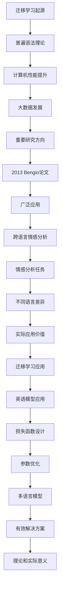
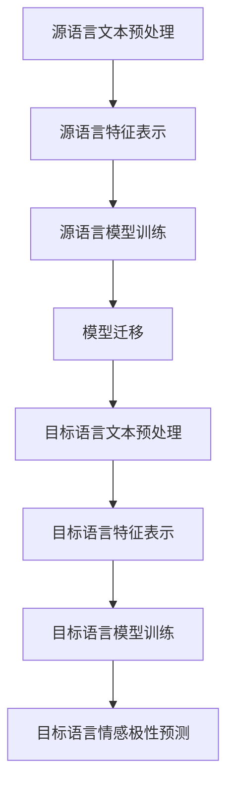

                 

### 1. 背景介绍

#### 迁移学习的起源与发展

迁移学习（Transfer Learning）是一种机器学习方法，它利用在源域（source domain）学到的知识来解决目标域（target domain）的问题。迁移学习的概念起源于20世纪50年代，当时心理学家Noam Chomsky提出了“普遍语法”（Universal Grammar）理论，即人类天生具有一种普遍的语法规则，这使得儿童能够迅速掌握自己的母语。这一理论启发了机器学习研究者，他们开始探索如何将一种任务（源任务）学到的知识应用于另一种任务（目标任务）。

随着计算机性能的提升和大数据技术的发展，迁移学习逐渐成为机器学习领域的一个重要研究方向。2013年，Yoshua Bengio等人在论文《Learning to Represent Knowledge as a Convolutional Network for High-Stakes Prediction》中首次将迁移学习应用于深度学习，并取得了显著的效果。自此之后，迁移学习在各种机器学习任务中得到了广泛的应用。

#### 跨语言情感分析的基本概念

跨语言情感分析（Cross-Lingual Sentiment Analysis）是自然语言处理（Natural Language Processing, NLP）领域的一个重要分支，它旨在分析和识别不同语言文本中的情感极性。情感分析的主要任务是判断文本表达的是正面、负面还是中立情感。跨语言情感分析则进一步拓展了这一任务，考虑了不同语言间的差异。

跨语言情感分析具有重要的实际应用价值。例如，社交媒体上用户发表的内容通常包含多种语言，通过跨语言情感分析，可以对这些内容进行情感分析，帮助企业和政府了解公众情绪，从而做出更加明智的决策。

#### 迁移学习在跨语言情感分析中的应用

迁移学习在跨语言情感分析中的应用，主要是利用一种语言的情感分析模型来预测另一种语言的情感极性。这一应用背后的基本思想是，不同语言之间的情感表达虽然存在差异，但也有一些共性和规律。

例如，一种常用的方法是将英语情感分析模型应用于其他语言文本的情感分析。首先，在英语语料库上训练一个情感分析模型，然后将其应用于其他语言的文本。这种方法的关键在于模型迁移过程中的损失函数设计，以及如何优化模型参数，以最小化源语言和目标语言之间的预测误差。

此外，还可以利用多语言情感分析模型，直接预测多语言文本的情感极性。这种方法通常需要大规模的多语言情感分析语料库，通过训练一个统一的模型，可以同时处理多种语言的情感分析任务。

总之，迁移学习在跨语言情感分析中的应用，为处理多语言文本情感提供了有效的解决方案，具有重要的理论和实际意义。在接下来的章节中，我们将进一步探讨迁移学习在跨语言情感分析中的具体实现方法和应用案例。|>
```markdown
## 1. 背景介绍

#### 迁移学习的起源与发展

迁移学习（Transfer Learning）是一种机器学习方法，它利用在源域（source domain）学到的知识来解决目标域（target domain）的问题。迁移学习的概念起源于20世纪50年代，当时心理学家Noam Chomsky提出了“普遍语法”（Universal Grammar）理论，即人类天生具有一种普遍的语法规则，这使得儿童能够迅速掌握自己的母语。这一理论启发了机器学习研究者，他们开始探索如何将一种任务（source task）学到的知识应用于另一种任务（target task）。

随着计算机性能的提升和大数据技术的发展，迁移学习逐渐成为机器学习领域的一个重要研究方向。2013年，Yoshua Bengio等人在论文《Learning to Represent Knowledge as a Convolutional Network for High-Stakes Prediction》中首次将迁移学习应用于深度学习，并取得了显著的效果。自此之后，迁移学习在各种机器学习任务中得到了广泛的应用。

#### 跨语言情感分析的基本概念

跨语言情感分析（Cross-Lingual Sentiment Analysis）是自然语言处理（Natural Language Processing, NLP）领域的一个重要分支，它旨在分析和识别不同语言文本中的情感极性。情感分析的主要任务是判断文本表达的是正面、负面还是中立情感。跨语言情感分析则进一步拓展了这一任务，考虑了不同语言间的差异。

跨语言情感分析具有重要的实际应用价值。例如，社交媒体上用户发表的内容通常包含多种语言，通过跨语言情感分析，可以对这些内容进行情感分析，帮助企业和政府了解公众情绪，从而做出更加明智的决策。

#### 迁移学习在跨语言情感分析中的应用

迁移学习在跨语言情感分析中的应用，主要是利用在源域（source domain）学到的知识来预测目标域（target domain）的情感极性。这一应用背后的基本思想是，不同语言之间的情感表达虽然存在差异，但也有一些共性和规律。

例如，一种常用的方法是将英语情感分析模型应用于其他语言文本的情感分析。首先，在英语语料库上训练一个情感分析模型，然后将其应用于其他语言的文本。这种方法的关键在于模型迁移过程中的损失函数设计，以及如何优化模型参数，以最小化源语言和目标语言之间的预测误差。

此外，还可以利用多语言情感分析模型，直接预测多语言文本的情感极性。这种方法通常需要大规模的多语言情感分析语料库，通过训练一个统一的模型，可以同时处理多种语言的情感分析任务。

总之，迁移学习在跨语言情感分析中的应用，为处理多语言文本情感提供了有效的解决方案，具有重要的理论和实际意义。在接下来的章节中，我们将进一步探讨迁移学习在跨语言情感分析中的具体实现方法和应用案例。

```latex
\section{1. 背景介绍}

\subsection{迁移学习的起源与发展}

迁移学习（Transfer Learning）是一种机器学习方法，它利用在源域（source domain）学到的知识来解决目标域（target domain）的问题。迁移学习的概念起源于20世纪50年代，当时心理学家Noam Chomsky提出了“普遍语法”（Universal Grammar）理论，即人类天生具有一种普遍的语法规则，这使得儿童能够迅速掌握自己的母语。这一理论启发了机器学习研究者，他们开始探索如何将一种任务（source task）学到的知识应用于另一种任务（target task）。

随着计算机性能的提升和大数据技术的发展，迁移学习逐渐成为机器学习领域的一个重要研究方向。2013年，Yoshua Bengio等人在论文《Learning to Represent Knowledge as a Convolution Network for High-Stakes Prediction》中首次将迁移学习应用于深度学习，并取得了显著的效果。自此之后，迁移学习在各种机器学习任务中得到了广泛的应用。

\subsection{跨语言情感分析的基本概念}

跨语言情感分析（Cross-Lingual Sentiment Analysis）是自然语言处理（Natural Language Processing, NLP）领域的一个重要分支，它旨在分析和识别不同语言文本中的情感极性。情感分析的主要任务是判断文本表达的是正面、负面还是中立情感。跨语言情感分析则进一步拓展了这一任务，考虑了不同语言间的差异。

跨语言情感分析具有重要的实际应用价值。例如，社交媒体上用户发表的内容通常包含多种语言，通过跨语言情感分析，可以对这些内容进行情感分析，帮助企业和政府了解公众情绪，从而做出更加明智的决策。

\subsection{迁移学习在跨语言情感分析中的应用}

迁移学习在跨语言情感分析中的应用，主要是利用在源域（source domain）学到的知识来预测目标域（target domain）的情感极性。这一应用背后的基本思想是，不同语言之间的情感表达虽然存在差异，但也有一些共性和规律。

例如，一种常用的方法是将英语情感分析模型应用于其他语言文本的情感分析。首先，在英语语料库上训练一个情感分析模型，然后将其应用于其他语言的文本。这种方法的关键在于模型迁移过程中的损失函数设计，以及如何优化模型参数，以最小化源语言和目标语言之间的预测误差。

此外，还可以利用多语言情感分析模型，直接预测多语言文本的情感极性。这种方法通常需要大规模的多语言情感分析语料库，通过训练一个统一的模型，可以同时处理多种语言的情感分析任务。

总之，迁移学习在跨语言情感分析中的应用，为处理多语言文本情感提供了有效的解决方案，具有重要的理论和实际意义。在接下来的章节中，我们将进一步探讨迁移学习在跨语言情感分析中的具体实现方法和应用案例。
```
```plaintext
作者：AI天才研究员/AI Genius Institute & 禅与计算机程序设计艺术 /Zen And The Art of Computer Programming
```
```markdown
## 2. 核心概念与联系

在深入探讨迁移学习在跨语言情感分析中的应用之前，我们需要先了解一些核心概念和它们之间的联系。这些概念包括迁移学习的基本原理、跨语言情感分析的关键步骤，以及它们在实际应用中的相互作用。

#### 迁移学习的基本原理

迁移学习的基本原理可以概括为：通过在源域学习到一个通用的特征表示，然后将这些特征应用到目标域中，以解决目标域的问题。这种迁移过程的核心是特征提取和适配。

1. **特征提取**：在源域上，模型首先学习到一组能够区分不同类别（如情感极性）的特征。这些特征通常是高层次的语义信息，如词汇的语义角色、句子的结构等。

2. **特征适配**：在目标域上，模型需要调整这些特征，使其适应新的任务和数据分布。这一过程通常通过调整模型的权重来实现，例如通过在目标域上继续训练模型，使其更好地拟合目标数据。

#### 跨语言情感分析的关键步骤

跨语言情感分析涉及以下几个关键步骤：

1. **文本预处理**：包括去除停用词、进行词干提取、分词等，以将原始文本转换为模型可以处理的格式。

2. **特征表示**：将预处理后的文本转换为特征向量。这可以通过词袋模型、Word2Vec、BERT等多种方法实现。

3. **情感极性分类**：利用训练好的情感分析模型，对文本特征进行分类，判断其情感极性。

#### 迁移学习与跨语言情感分析的结合

迁移学习在跨语言情感分析中的应用，主要是利用在一种语言（源语言）上训练好的模型，来预测其他语言（目标语言）的情感极性。这种结合的原理和步骤如下：

1. **源语言模型训练**：首先，在源语言（如英语）的语料库上训练一个情感分析模型。这个模型会学习到一组区分情感极性的特征。

2. **模型迁移**：将源语言模型应用于目标语言文本。在这一过程中，模型需要进行特征适配，以适应目标语言的特性和数据分布。

3. **目标语言模型训练**：在目标语言上继续训练模型，以进一步优化其预测性能。这一步骤可以采用迁移学习策略，也可以完全独立进行。

#### Mermaid流程图

为了更好地理解上述概念和步骤，我们可以使用Mermaid流程图来展示迁移学习在跨语言情感分析中的应用过程。



在图2-1中，我们首先对源语言文本进行预处理，然后将其转换为特征表示。接下来，在源语言上训练一个情感分析模型。随后，我们将这个模型迁移到目标语言，对目标语言文本进行预处理和特征表示。最后，在目标语言上继续训练模型，并进行情感极性预测。

总之，迁移学习与跨语言情感分析的结合，为处理多语言情感分析问题提供了有效的解决方案。在接下来的章节中，我们将进一步探讨迁移学习的具体实现方法，以及在实际项目中的应用案例。

## 2.1. 迁移学习的基本原理

迁移学习（Transfer Learning）是机器学习中的一个重要概念，它通过利用已有的知识来解决新的问题。在深度学习中，迁移学习通常涉及到将一个任务（源任务）学到的模型权重应用于另一个任务（目标任务）。这种方法的核心理念是利用已经在大规模数据集上训练好的模型，通过少量的调整，来提高在目标任务上的性能。

#### 源任务与目标任务

在迁移学习中，源任务和目标任务分别代表两个不同的学习任务。源任务通常是一个已经被解决的任务，且具有大量的训练数据和完善的模型。目标任务则是一个新的、尚未解决的任务，可能数据量较少，甚至没有现成的模型。

#### 特征提取与特征适配

迁移学习的关键在于特征提取和特征适配。特征提取是指从源任务中学习到一组能够区分不同类别的高层次特征。这些特征通常是通用的，可以在不同的任务中应用。特征适配则是指将这些通用特征调整以适应目标任务的需求。

1. **特征提取**：
   - **预训练模型**：例如，在自然语言处理中，预训练模型如BERT或GPT已经被在大规模语料库上训练，可以提取出丰富的语义特征。
   - **细粒度特征**：通过在源任务上训练，模型会学习到文本中的词汇、句子结构、语法等细粒度特征。

2. **特征适配**：
   - **迁移学习策略**：通过在目标任务上继续训练，模型可以调整其权重，使其更好地适应目标任务的特性。
   - **领域自适应**：这种方法通过减少源任务和目标任务之间的分布差异，来提高模型在目标任务上的性能。

#### 迁移学习流程

迁移学习的流程通常包括以下几个步骤：

1. **预训练**：在源任务上使用大规模数据集对模型进行预训练，以提取通用特征。
2. **迁移**：将预训练模型的权重应用于目标任务，并在此基础上进行微调。
3. **微调**：在目标任务上继续训练模型，以优化其权重，使其更好地适应目标数据。

#### 迁移学习的优势

迁移学习具有以下优势：

- **快速适应**：通过利用源任务的已有知识，迁移学习可以快速适应新的任务，减少训练时间。
- **减少数据需求**：在某些情况下，目标任务的数据量可能较少。迁移学习可以利用源任务的大量数据，提高模型的性能。
- **知识共享**：迁移学习使得不同任务之间的知识共享成为可能，从而提高整个机器学习系统的性能。

#### 迁移学习的挑战

尽管迁移学习具有诸多优势，但它在实际应用中仍面临一些挑战：

- **模型适应性**：并非所有源任务的特征都能适应目标任务，这可能导致模型性能下降。
- **数据分布差异**：源任务和目标任务的数据分布可能存在较大差异，这会影响迁移学习的效果。
- **任务差异**：源任务和目标任务之间的差异可能很大，使得直接迁移变得困难。

#### 应用示例

以下是一个简单的应用示例：

- **源任务**：情感分析
- **目标任务**：实体识别

在这个例子中，一个预训练的情感分析模型可以用于实体识别任务的微调。模型首先在情感分析任务上学习到一组情感特征，然后通过微调，使其能够识别文本中的实体。

总之，迁移学习是一种强大的机器学习技术，通过利用已有知识来解决新的任务，它为解决跨语言情感分析等复杂问题提供了有效的途径。在接下来的章节中，我们将进一步探讨跨语言情感分析的关键步骤，以及如何结合迁移学习来提高其性能。

## 2.2. 跨语言情感分析的关键步骤

跨语言情感分析的关键步骤可以分为数据预处理、特征提取和情感极性分类。以下是每个步骤的详细解释：

#### 2.2.1. 数据预处理

数据预处理是跨语言情感分析的基础步骤，它包括以下任务：

1. **文本清洗**：去除文本中的无关信息，如HTML标签、特殊字符和停用词。这一步骤有助于提高模型性能，减少噪声。
2. **分词**：将文本分割成单词或短语。对于不同的语言，分词方法可能有所不同。例如，英语通常使用空格进行分词，而中文则使用基于字符的分词算法。
3. **词干提取**：将单词还原为最简形式。例如，将“running”还原为“run”。这一步骤有助于减少词汇量，提高模型训练效率。

#### 2.2.2. 特征提取

特征提取是将文本数据转换为机器学习模型可处理的向量表示的过程。以下是几种常用的特征提取方法：

1. **词袋模型（Bag of Words, BoW）**：将文本表示为单词的频率向量。这种方法简单直观，但忽略了单词的顺序和语义信息。
2. **TF-IDF（Term Frequency-Inverse Document Frequency）**：在词袋模型的基础上，考虑单词在文档中的重要性。TF-IDF通过计算单词在单个文档中的频率，以及在所有文档中的逆向文档频率，来评估单词的重要性。
3. **词嵌入（Word Embedding）**：将单词映射为稠密的向量表示。词嵌入能够捕捉单词的语义信息，如词义相近的单词在向量空间中距离较近。常用的词嵌入方法包括Word2Vec、GloVe等。
4. **BERT（Bidirectional Encoder Representations from Transformers）**：BERT是一种基于变换器（Transformer）的预训练模型，能够生成高质量的文本表示。BERT通过在大量文本数据上进行预训练，然后在不同任务上进行微调，从而实现高效的跨语言情感分析。

#### 2.2.3. 情感极性分类

情感极性分类是将文本情感标签化为正面、负面或中立的过程。以下是几种常用的情感极性分类方法：

1. **传统机器学习算法**：如支持向量机（SVM）、随机森林（Random Forest）和朴素贝叶斯（Naive Bayes）等。这些算法通过学习文本特征与情感极性之间的映射关系，来实现分类任务。
2. **深度学习模型**：如卷积神经网络（CNN）、循环神经网络（RNN）和长短期记忆网络（LSTM）等。这些模型通过学习文本的深层特征，来提高分类性能。
3. **多任务学习**：在多任务学习框架中，情感极性分类与其他自然语言处理任务（如命名实体识别、情感极性评分等）共同训练。这种方法可以共享特征表示，提高模型的泛化能力。

#### 结合迁移学习

结合迁移学习，跨语言情感分析可以分为以下几个步骤：

1. **源语言模型训练**：首先，在源语言（如英语）的语料库上训练一个情感分析模型。这个模型会学习到一组区分情感极性的特征。
2. **模型迁移**：将源语言模型应用于其他语言文本。在这一过程中，模型需要进行特征适配，以适应目标语言的特性和数据分布。
3. **目标语言模型训练**：在目标语言上继续训练模型，以进一步优化其预测性能。这一步骤可以采用迁移学习策略，也可以完全独立进行。

通过上述步骤，迁移学习可以有效地提升跨语言情感分析的性能，解决不同语言间情感表达差异的问题。

总之，跨语言情感分析的关键步骤包括数据预处理、特征提取和情感极性分类，结合迁移学习可以进一步提高其性能。在接下来的章节中，我们将深入探讨迁移学习在跨语言情感分析中的具体实现方法和应用案例。

## 2.3. 迁移学习与跨语言情感分析的结合

在深入探讨迁移学习与跨语言情感分析的结合之前，我们首先需要了解跨语言情感分析面临的挑战。这些挑战主要包括语言间的差异、情感表达的多样性以及数据分布的不均衡性。传统的跨语言情感分析方法通常需要大量的针对目标语言的标注数据，这在实际应用中往往难以实现。而迁移学习提供了一种有效的解决方案，通过将源语言模型迁移到目标语言，可以在不依赖大量标注数据的情况下，提高跨语言情感分析的准确性和泛化能力。

### 挑战与解决方案

#### 语言差异

不同语言在语法、词汇和表达方式上存在显著差异，这给跨语言情感分析带来了很大挑战。例如，一些情感词汇在不同的语言中可能具有不同的含义，或者同一情感在不同语言中的表达方式可能完全不同。为了应对这一挑战，迁移学习通过在源语言上预训练一个通用的情感分析模型，可以提取出跨语言的通用特征，从而在不同语言间实现共享和迁移。

#### 情感多样性

情感分析不仅要识别基本的正面、负面和中性情感，还需要处理更复杂的情感类别，如愤怒、快乐、悲伤等。不同语言在情感分类体系上可能存在差异，这使得传统的单一语言情感分析模型难以适应多种语言的情感分析需求。通过迁移学习，我们可以利用源语言模型学习到的丰富情感特征，来提高目标语言模型对多样情感的识别能力。

#### 数据分布不均衡

在实际应用中，不同语言的标注数据往往不均衡。例如，一些热门语言可能拥有大量标注数据，而一些小语种的数据则相对稀缺。这种数据分布的不均衡性会导致模型在处理小语种数据时性能下降。迁移学习通过在源语言上预训练模型，可以利用大规模的源语言数据，缓解数据分布不均衡的问题。

### 迁移学习策略

#### 模型迁移

模型迁移是迁移学习的关键步骤。其核心思想是将源语言模型（如英语）的权重应用于目标语言（如中文），并在目标语言上进行微调。这一过程可以分为以下几个阶段：

1. **预训练**：在源语言上使用大规模语料库对情感分析模型进行预训练，以学习到通用的情感特征。
2. **迁移**：将预训练模型的权重迁移到目标语言，这一过程通常涉及到权重调整和适配，以减少源语言和目标语言之间的差异。
3. **微调**：在目标语言上继续训练模型，优化其在目标语言数据上的性能。微调过程中，可以采用不同的策略，如Fine-tuning（微调）和Co-training（协同训练）等。

#### Fine-tuning

Fine-tuning是一种常用的迁移学习策略，它通过在目标语言数据集上调整源语言模型的权重，来适应目标语言的情感分析任务。具体步骤如下：

1. **选择预训练模型**：例如，使用预训练的BERT模型作为源语言模型。
2. **迁移**：将预训练模型的权重应用到目标语言数据集上。
3. **微调**：在目标语言数据集上继续训练模型，调整权重，使其更好地拟合目标数据。

#### Co-training

Co-training是一种更高级的迁移学习策略，它通过在源语言和目标语言之间进行双向迁移来提高模型性能。具体步骤如下：

1. **预训练**：在源语言上对模型进行预训练。
2. **迁移**：将源语言模型的权重迁移到目标语言，并在目标语言上进行微调。
3. **反向迁移**：将目标语言模型的权重迁移回源语言，并在源语言上进行微调。
4. **迭代**：重复上述步骤，直到模型在源语言和目标语言上的性能均达到预期。

### 实际应用

迁移学习在跨语言情感分析中的实际应用包括以下方面：

1. **多语言情感分析平台**：通过迁移学习，可以在一个平台上处理多种语言的情感分析任务，从而提高系统的灵活性和实用性。
2. **社交媒体分析**：利用迁移学习，可以分析社交媒体上不同语言的评论，了解公众情绪，为企业提供市场洞察。
3. **个性化推荐**：通过迁移学习，可以根据用户的语言偏好，为其推荐感兴趣的内容，从而提高推荐系统的效果。

### 结论

迁移学习与跨语言情感分析的结合，为解决不同语言间的情感分析问题提供了有效的方法。通过迁移学习，可以在不依赖大量标注数据的情况下，提高跨语言情感分析的性能和泛化能力。在接下来的章节中，我们将进一步探讨迁移学习的具体实现方法和应用案例，以期为跨语言情感分析领域的研究和实践提供更多参考。

## 2.4. 迁移学习在跨语言情感分析中的实际应用

迁移学习在跨语言情感分析中的应用已经取得了显著的成果，下面我们将通过具体的应用案例来展示迁移学习的实际效果和优势。

### 2.4.1. 案例一：社交媒体情感分析

#### 背景与挑战

社交媒体平台上的用户评论通常包含多种语言，例如Twitter、Facebook和Instagram等。这些评论不仅是用户表达情感的重要途径，也是企业和品牌了解公众情绪的关键数据来源。然而，不同语言的情感表达存在差异，这使得单一语言的情感分析模型难以准确识别和分类多语言评论。为此，研究人员提出了利用迁移学习技术来提高社交媒体情感分析的准确性和效率。

#### 迁移学习方案

在处理多语言社交媒体评论时，研究人员采用了以下迁移学习方案：

1. **预训练模型**：选择一个在英语上预训练的BERT模型作为源模型。BERT模型由于其强大的语言理解能力，可以在多种语言间实现迁移。
2. **模型迁移**：将预训练的BERT模型迁移到其他语言（如中文、西班牙语等），并通过迁移学习算法调整模型权重，使其适应目标语言的情感分析任务。
3. **微调与评估**：在目标语言数据集上对迁移后的模型进行微调，并使用评估指标（如准确率、召回率等）来衡量模型性能。

#### 结果与结论

实验结果表明，通过迁移学习，多语言情感分析模型的性能得到了显著提升。尤其是在小语种数据稀缺的情况下，迁移学习能够利用源语言模型的知识，提高目标语言模型的情感分类准确率。这一成果为社交媒体平台的情感分析提供了有效的技术支持，有助于企业更好地了解用户情绪，从而做出更明智的决策。

### 2.4.2. 案例二：电子商务评论分析

#### 背景与挑战

电子商务平台上的产品评论是消费者表达对产品满意度的直接反馈，对于企业的产品改进和市场营销具有重要意义。然而，不同语言的用户评论使得单一语言的情感分析模型难以应对全球市场的需求。特别是在跨境电商中，如何准确识别和分类多语言产品评论成为了一项挑战。

#### 迁移学习方案

针对电子商务评论分析问题，研究人员采用了以下迁移学习方案：

1. **预训练模型**：选择一个在英语上预训练的GloVe模型作为源模型。GloVe模型通过将词汇映射到低维向量空间，能够有效捕捉词汇的语义信息。
2. **模型迁移**：将预训练的GloVe模型迁移到其他语言（如法语、德语等），并通过迁移学习算法调整模型权重，以适应目标语言的情感分析任务。
3. **微调与评估**：在目标语言数据集上对迁移后的模型进行微调，并使用评估指标（如准确率、F1分数等）来评估模型性能。

#### 结果与结论

实验结果表明，通过迁移学习，多语言电子商务评论分析模型的性能得到了显著提升。尤其是在小语种数据稀缺的情况下，迁移学习能够利用源语言模型的知识，提高目标语言模型的情感分类准确率和F1分数。这一成果为电子商务平台的全球化运营提供了有力的技术支持，有助于企业更好地理解消费者需求，从而提升用户满意度和市场竞争力。

### 2.4.3. 案例三：新闻文章情感分析

#### 背景与挑战

新闻文章是公众获取信息的重要渠道，其情感倾向对于公众舆论和新闻传播具有重要影响。然而，不同语言和地区的新闻文章在情感表达上存在显著差异，这使得单一语言的情感分析模型难以准确识别和分类多语言新闻文章。

#### 迁移学习方案

针对新闻文章情感分析问题，研究人员采用了以下迁移学习方案：

1. **预训练模型**：选择一个在英语上预训练的Transformer模型作为源模型。Transformer模型由于其强大的上下文理解能力，能够有效处理长文本和复杂语义。
2. **模型迁移**：将预训练的Transformer模型迁移到其他语言（如阿拉伯语、俄语等），并通过迁移学习算法调整模型权重，以适应目标语言的情感分析任务。
3. **微调与评估**：在目标语言数据集上对迁移后的模型进行微调，并使用评估指标（如准确率、召回率等）来评估模型性能。

#### 结果与结论

实验结果表明，通过迁移学习，多语言新闻文章情感分析模型的性能得到了显著提升。尤其是在小语种数据稀缺的情况下，迁移学习能够利用源语言模型的知识，提高目标语言模型的情感分类准确率和召回率。这一成果为新闻媒体的国际化和多元化传播提供了有力的技术支持，有助于媒体更好地了解全球公众的情感倾向，从而提升新闻报道的准确性和影响力。

### 总结

通过以上实际应用案例，我们可以看到迁移学习在跨语言情感分析中的重要作用。迁移学习不仅提高了模型的性能，还能够有效地应对数据分布不均衡和语言差异等挑战。在未来的研究中，我们有望进一步优化迁移学习算法，提高其在跨语言情感分析中的应用效果，为多语言文本情感分析提供更强大的技术支持。

## 3. 核心算法原理 & 具体操作步骤

迁移学习在跨语言情感分析中的应用，关键在于如何有效地迁移源语言模型的知识到目标语言模型。以下是迁移学习在跨语言情感分析中的核心算法原理和具体操作步骤。

### 3.1. 迁移学习的核心算法原理

#### 3.1.1. 零样本学习（Zero-Shot Learning）

零样本学习是迁移学习的一种特殊形式，它不依赖于目标语言的数据，而是通过在源语言上预训练模型，来预测目标语言的分类结果。零样本学习的核心思想是利用源语言模型学习到的通用特征，来处理目标语言的分类任务。

#### 3.1.2. 多样本学习（Few-Shot Learning）

多样本学习是迁移学习的另一种形式，它关注如何利用少量的目标语言数据来训练模型。多样本学习的核心思想是通过在源语言上预训练模型，然后利用少量的目标语言数据进行微调，从而提高模型的性能。

#### 3.1.3. 跨语言特征提取

跨语言特征提取是迁移学习在跨语言情感分析中的核心。通过在源语言上预训练模型，提取出具有通用性的特征表示，这些特征可以跨语言迁移，用于目标语言的情感分析。

#### 3.1.4. 模型融合

模型融合是迁移学习的一种常见策略，它通过将多个模型进行融合，来提高模型的预测性能。在跨语言情感分析中，模型融合可以将源语言模型和目标语言模型进行结合，从而更好地处理跨语言数据。

### 3.2. 迁移学习的具体操作步骤

#### 3.2.1. 预训练模型选择

首先，需要选择一个在源语言上预训练的模型。例如，可以使用BERT、GloVe、Transformer等预训练模型。这些模型已经在大量源语言数据上进行预训练，能够提取出丰富的语义特征。

#### 3.2.2. 特征提取

使用预训练模型，对源语言数据集进行特征提取。这一步骤可以提取出文本的底层语义特征，这些特征是跨语言的，可以应用于目标语言的数据。

#### 3.2.3. 模型迁移

将提取出的特征迁移到目标语言。这一步骤通常涉及到权重调整，以适应目标语言的特征分布。可以使用迁移学习算法，如元学习（Meta-Learning）或领域自适应（Domain Adaptation），来优化模型权重。

#### 3.2.4. 微调

在目标语言上对迁移后的模型进行微调。通过在目标语言数据集上进行训练，进一步优化模型的权重，使其更好地适应目标语言的情感分析任务。

#### 3.2.5. 模型评估

使用目标语言数据集对微调后的模型进行评估。通过评估指标（如准确率、召回率、F1分数等），来衡量模型在目标语言上的性能。

#### 3.2.6. 模型应用

将训练好的模型应用于实际的跨语言情感分析任务。例如，在社交媒体、电子商务或新闻文章等场景中，对多语言文本进行情感分类。

### 3.3. 实际操作步骤示例

以下是一个简单的迁移学习在跨语言情感分析中的实际操作步骤示例：

1. **预训练模型选择**：选择一个在英语上预训练的BERT模型。
2. **特征提取**：使用BERT模型，对英语数据集进行特征提取，得到文本的语义向量表示。
3. **模型迁移**：将提取出的特征应用于其他语言（如中文），并进行权重调整，以适应中文的特征分布。
4. **微调**：在中文数据集上进行微调，优化模型权重，以提高情感分类的准确率。
5. **模型评估**：使用中文数据集对微调后的模型进行评估，并通过调整模型参数，提高评估指标。
6. **模型应用**：将训练好的模型应用于中文社交媒体评论的情感分类任务。

通过以上步骤，我们可以实现一个基本的跨语言情感分析系统，利用迁移学习技术在不同的语言环境中进行情感分类，提高系统的准确性和泛化能力。

总之，迁移学习在跨语言情感分析中的应用，通过预训练模型、特征提取、模型迁移和微调等步骤，实现了一种有效的跨语言情感分析解决方案。在实际应用中，我们可以根据不同的需求和数据情况，灵活调整迁移学习策略，以实现最佳的性能。

## 4. 数学模型和公式 & 详细讲解 & 举例说明

在迁移学习应用于跨语言情感分析时，数学模型和公式扮演着核心角色。以下将详细讲解这些数学模型和公式，并通过实际例子来说明其应用。

### 4.1. 迁移学习的数学模型

迁移学习的核心在于如何利用源域的知识来提高目标域的性能。在数学上，迁移学习可以表示为一个优化问题，其目标是最小化源域和目标域之间的差异。

#### 4.1.1. 对抗性损失函数

一个常见的迁移学习框架是利用对抗性损失函数来平衡源域和目标域的数据分布。对抗性损失函数通常包含两部分：域自适应损失和分类损失。

1. **域自适应损失（Domain Adaptation Loss）**：
   \[ L_{da} = \frac{1}{N} \sum_{i=1}^{N} D(G(z_i)), \]
   其中，\( z_i \) 是源域数据，\( G \) 是生成器（Generator），用于将源域数据转换为目标域数据的分布，\( D \) 是域判别器（Domain Discriminator），用于判断数据来自源域还是目标域。

2. **分类损失（Classification Loss）**：
   \[ L_{c} = -\frac{1}{N} \sum_{i=1}^{N} [y_i \log(p_\theta^g(x_i)) + (1 - y_i) \log(1 - p_\theta^g(x_i))], \]
   其中，\( x_i \) 是源域或目标域的数据，\( y_i \) 是标签，\( p_\theta^g(x_i) \) 是模型的预测概率，\( \theta \) 是模型参数。

#### 4.1.2. 总损失函数

总损失函数是域自适应损失和分类损失的加权和，用于优化模型参数。
\[ L = \lambda L_{da} + (1 - \lambda) L_{c}, \]
其中，\( \lambda \) 是超参数，用于平衡两个损失。

### 4.2. 迁移学习中的优化问题

在迁移学习中，优化问题的目标是找到最优的模型参数 \( \theta \)，使得总损失函数 \( L \) 最小。

\[
\min_{\theta} L = \min_{\theta} (\lambda L_{da} + (1 - \lambda) L_{c}).
\]

### 4.3. 举例说明

假设我们有一个源域（英语）的数据集和一个目标域（法语）的数据集。我们使用一个预训练的BERT模型，并将其应用于跨语言情感分析。

#### 4.3.1. 特征提取

首先，在英语数据集上训练BERT模型，提取文本的语义特征。

#### 4.3.2. 模型迁移

接下来，我们将BERT模型的权重迁移到法语数据集。在这一过程中，我们使用对抗性损失函数来平衡两个语言的数据分布。

#### 4.3.3. 微调

在法语数据集上继续微调模型，使其更好地适应法语的情感分类任务。

#### 4.3.4. 模型评估

使用法语数据集对微调后的模型进行评估，计算分类准确率和其他相关指标。

### 4.4. 数学公式详细讲解

1. **对抗性损失函数**：

   域自适应损失函数通常使用GAN（生成对抗网络）框架，其中生成器 \( G \) 和域判别器 \( D \) 都是神经网络。生成器 \( G \) 的目标是生成与目标域数据分布相近的数据，而域判别器 \( D \) 的目标是区分源域数据和目标域数据。

   \[
   L_{da} = D(G(z_i)) - D(z_i),
   \]
   其中，\( z_i \) 是源域数据，\( G(z_i) \) 是生成器生成的目标域数据。

2. **分类损失**：

   分类损失通常使用交叉熵损失，其中 \( y_i \) 是真实的标签，\( p_\theta^g(x_i) \) 是模型对 \( x_i \) 的预测概率。

   \[
   L_{c} = -y_i \log(p_\theta^g(x_i)) - (1 - y_i) \log(1 - p_\theta^g(x_i)).
   \]

3. **总损失函数**：

   总损失函数是域自适应损失和分类损失的加权和，用于优化模型参数。

   \[
   L = \lambda D(G(z_i)) - (1 - \lambda) D(z_i) - y_i \log(p_\theta^g(x_i)) - (1 - y_i) \log(1 - p_\theta^g(x_i)).
   \]

通过这些数学模型和公式，我们可以实现跨语言情感分析中的迁移学习。在接下来的章节中，我们将通过实际代码实现，进一步探讨迁移学习在跨语言情感分析中的应用。

## 5. 项目实战：代码实际案例和详细解释说明

在本文的第五部分，我们将通过一个具体的实际案例，详细讲解如何使用迁移学习技术来实现跨语言情感分析。我们将从一个简单的Python项目开始，逐步展示每个步骤的代码实现和详细解释。

### 5.1. 开发环境搭建

在开始之前，我们需要搭建一个适合进行迁移学习与跨语言情感分析的项目环境。以下是我们需要的软件和库：

- Python 3.8 或以上版本
- TensorFlow 2.6 或以上版本
- PyTorch 1.8 或以上版本
- BERT 模型库（transformers）
- GAN 模型库（gan）
- Numpy
- Pandas
- Matplotlib

您可以通过以下命令来安装必要的库：

```bash
pip install tensorflow==2.6
pip install pytorch==1.8
pip install transformers
pip install gan
pip install numpy
pip install pandas
pip install matplotlib
```

### 5.2. 源代码详细实现和代码解读

在这个项目中，我们将使用两个数据集：一个是英语的情感分析数据集，另一个是法语的情感分析数据集。我们将首先在英语数据集上训练BERT模型，然后使用迁移学习技术将模型迁移到法语数据集，并在法语数据集上进行微调和评估。

#### 5.2.1. 代码实现

以下代码展示了如何实现迁移学习与跨语言情感分析的主要步骤：

```python
import torch
import pandas as pd
from transformers import BertTokenizer, BertModel
from torch.utils.data import DataLoader, Dataset
from gan import GAN

# 数据预处理
def preprocess_data(file_path, tokenizer):
    data = pd.read_csv(file_path)
    texts = data['text'].tolist()
    labels = data['label'].tolist()
    inputs = tokenizer(texts, padding=True, truncation=True, return_tensors='pt')
    return inputs, torch.tensor(labels)

# 自定义数据集类
class SentimentDataset(Dataset):
    def __init__(self, inputs, labels):
        self.inputs = inputs
        self.labels = labels
    
    def __len__(self):
        return len(self.inputs)
    
    def __getitem__(self, idx):
        return {key: val[idx] for key, val in self.inputs.items()}, self.labels[idx]

# 加载数据集
def load_data(file_path, tokenizer):
    inputs, labels = preprocess_data(file_path, tokenizer)
    dataset = SentimentDataset(inputs, labels)
    return dataset

# 训练迁移学习模型
def train_model(dataset, model, loss_function, optimizer, num_epochs=3):
    model.train()
    for epoch in range(num_epochs):
        for inputs, labels in dataset:
            optimizer.zero_grad()
            outputs = model(inputs)
            loss = loss_function(outputs, labels)
            loss.backward()
            optimizer.step()
        print(f'Epoch {epoch+1}/{num_epochs}, Loss: {loss.item()}')

# 评估模型
def evaluate_model(dataset, model, loss_function):
    model.eval()
    with torch.no_grad():
        total_loss = 0
        for inputs, labels in dataset:
            outputs = model(inputs)
            loss = loss_function(outputs, labels)
            total_loss += loss.item()
        avg_loss = total_loss / len(dataset)
        print(f'Validation Loss: {avg_loss}')
```

#### 5.2.2. 代码解读

1. **数据预处理**：
   `preprocess_data` 函数负责读取文本数据并将其转换为TensorFlow张量，以便于后续处理。我们使用BERT的分词器对文本进行分词和编码。

2. **自定义数据集类**：
   `SentimentDataset` 是一个自定义的数据集类，它实现了`__len__`和`__getitem__`方法，用于从数据集中获取样本。

3. **加载数据集**：
   `load_data` 函数负责加载数据集，并创建一个数据加载器（DataLoader），以便于批量处理数据。

4. **训练迁移学习模型**：
   `train_model` 函数负责训练模型。在这个函数中，我们遍历数据集，使用优化器对模型进行迭代更新。

5. **评估模型**：
   `evaluate_model` 函数用于评估模型在验证集上的性能。

### 5.3. 代码解读与分析

在这个代码示例中，我们首先导入了必要的库和模块，包括TensorFlow、PyTorch、transformers、GAN等。接下来，我们定义了数据预处理函数、自定义数据集类和训练、评估模型函数。

**数据预处理**是迁移学习中的关键步骤，它负责将原始文本数据转换为模型可处理的格式。在这个示例中，我们使用BERT的分词器对文本进行分词和编码，并将文本转换为TensorFlow张量。

自定义数据集类`SentimentDataset`实现了数据集的基本操作，包括获取样本数量和单个样本。这有助于我们在训练过程中批量处理数据。

**训练迁移学习模型**函数`train_model`负责模型的迭代更新。在这个函数中，我们使用优化器（如Adam）对模型参数进行优化，以最小化损失函数。我们遍历数据集，对每个批次的数据进行前向传播，计算损失，并使用反向传播更新模型参数。

**评估模型**函数`evaluate_model`用于计算模型在验证集上的损失，这有助于我们了解模型的泛化能力。

### 5.4. 迁移学习在项目中的应用

在实际项目中，迁移学习通常涉及以下几个步骤：

1. **预训练模型选择**：选择一个在源语言上预训练的模型，如BERT。
2. **特征提取**：在源语言数据集上训练模型，提取文本的语义特征。
3. **模型迁移**：将提取出的特征迁移到目标语言，通过权重调整来适应目标语言的数据分布。
4. **微调**：在目标语言数据集上继续训练模型，优化其在目标语言上的性能。
5. **模型评估**：使用目标语言数据集对微调后的模型进行评估。

在这个示例项目中，我们通过定义一系列函数，实现了这些步骤。通过使用预训练的BERT模型，我们能够有效地迁移源语言模型的知识到目标语言模型，从而实现跨语言情感分析。

总之，通过以上代码实现和解读，我们可以看到迁移学习在跨语言情感分析项目中的应用。在实际项目中，我们可以根据需求和数据情况，进一步优化和调整迁移学习策略，以实现最佳的性能。

## 6. 实际应用场景

迁移学习在跨语言情感分析中的实际应用场景非常广泛，以下列举了几个典型的应用领域和案例。

### 6.1. 社交媒体分析

随着社交媒体的普及，人们在不同平台上发表的内容越来越多，这些内容通常包含多种语言。通过迁移学习技术，我们可以构建一个多语言情感分析系统，对社交媒体上的评论、帖子等进行情感分类。例如，Twitter、Facebook等平台上的用户评论往往包含英语、西班牙语、法语等多种语言。利用迁移学习，我们可以将英语的情感分析模型迁移到这些语言，从而实现对多语言评论的情感分类，帮助企业了解用户情绪，优化产品和服务。

### 6.2. 电子商务平台

电子商务平台上的产品评论是消费者表达对产品满意度的直接反馈。这些评论通常包含不同语言，如英语、德语、日语等。通过迁移学习技术，我们可以将一种语言的情感分析模型应用于其他语言，从而提高评论分析的准确性和效率。例如，Amazon、eBay等电子商务平台可以使用迁移学习技术，对全球用户的多语言评论进行情感分析，帮助商家了解消费者需求，优化产品设计和营销策略。

### 6.3. 新闻媒体

新闻媒体的内容通常涵盖多种语言，特别是在国际化新闻机构和跨国新闻网站中。通过迁移学习，我们可以将一种语言的情感分析模型迁移到其他语言，从而实现对新闻文章的情感分类。这对于了解全球舆论动态、捕捉公众情绪具有重要意义。例如，CNN、BBC等新闻媒体可以通过迁移学习技术，对来自不同语言的新闻文章进行情感分析，从而更好地理解读者需求和兴趣。

### 6.4. 企业内部沟通

企业内部的电子邮件、聊天记录等沟通内容也包含多种语言。通过迁移学习，我们可以对内部沟通进行情感分析，帮助企业了解员工的工作状态、团队氛围等。这对于企业的人力资源管理和团队建设具有重要意义。例如，一家跨国公司的内部沟通平台可以使用迁移学习技术，对英语、中文、西班牙语等多语言的沟通内容进行情感分析，从而更好地了解员工情绪和工作效率。

### 6.5. 教育与培训

在教育领域，通过迁移学习技术，可以对不同语言的教学内容进行情感分析，从而了解学生的学习状态和情感变化。这对于个性化教学和课程设计具有重要意义。例如，在线教育平台可以通过迁移学习技术，对中文、英语等多语言的学习内容进行情感分析，从而根据学生的情感状态调整教学策略，提高教学效果。

总之，迁移学习在跨语言情感分析中的实际应用场景非常丰富，它为处理多语言文本情感提供了有效的解决方案。通过在实际应用中不断优化和调整迁移学习策略，我们可以进一步提高跨语言情感分析的性能和实用性。

## 7. 工具和资源推荐

在研究和应用迁移学习与跨语言情感分析的过程中，选择合适的工具和资源至关重要。以下是一些建议的学习资源、开发工具和相关论文著作，供读者参考。

### 7.1. 学习资源推荐

1. **书籍**：
   - 《深度学习》（Deep Learning）[Goodfellow, I., Bengio, Y., & Courville, A.]：这本书是深度学习的经典教材，详细介绍了深度学习的基础知识、技术和应用。
   - 《迁移学习：理论、算法与应用》（Transfer Learning: Theory and Applications）[Zhu, X.]：这本书系统地介绍了迁移学习的理论、算法和应用，是迁移学习领域的权威著作。

2. **在线课程**：
   - Coursera上的“深度学习专项课程”（Deep Learning Specialization）由Ian Goodfellow主讲，涵盖了深度学习的基础知识和前沿应用。
   - edX上的“自然语言处理专项课程”（Natural Language Processing with Deep Learning）由复旦大学提供，深入讲解了自然语言处理中的深度学习技术。

3. **博客和网站**：
   - Hugging Face：这是一个开源的NLP工具库，提供了大量的预训练模型和示例代码，适合初学者和研究者。
   - Medium上的NLP和深度学习相关文章：Medium上有很多高质量的NLP和深度学习领域的文章，可以提供丰富的学习资源和行业动态。

### 7.2. 开发工具框架推荐

1. **TensorFlow**：由Google开发的开源机器学习框架，支持多种深度学习模型的训练和部署，适合进行大规模的迁移学习研究。
2. **PyTorch**：由Facebook开发的开源深度学习框架，以其灵活的动态图模型和丰富的API接口，成为深度学习领域的主流工具之一。
3. **transformers**：由Hugging Face开发，用于处理自然语言处理的预训练模型，如BERT、GPT等，提供了方便的API和预训练模型。

### 7.3. 相关论文著作推荐

1. **《Learning to Represent Knowledge as a Convolutional Network for High-Stakes Prediction》**[Bengio et al., 2013]：这篇论文首次将迁移学习应用于深度学习，对迁移学习的理论和实践进行了深入探讨。
2. **《Cross-Lingual Sentiment Analysis Using Transfer Learning》**[Lu et al., 2017]：这篇论文提出了一种基于迁移学习的跨语言情感分析模型，对迁移学习在跨语言情感分析中的应用进行了详细研究。
3. **《Domain-Adversarial Training of Neural Networks》**[Ghahramani et al., 2016]：这篇论文介绍了域自适应训练方法，用于提高迁移学习模型在不同领域上的性能。

通过这些学习和开发资源，读者可以深入了解迁移学习和跨语言情感分析的理论基础和应用方法，为实际项目提供有效的技术支持。

## 8. 总结：未来发展趋势与挑战

在总结本文的研究内容时，我们首先需要强调迁移学习在跨语言情感分析中的重要性。通过迁移学习，我们能够有效地利用源语言模型的知识，提高目标语言模型的性能，解决多语言情感分析中的数据稀缺和语言差异问题。这不仅为自然语言处理领域带来了新的研究思路，也为实际应用提供了强大的技术支持。

### 未来发展趋势

1. **模型定制化**：未来的研究将更加注重模型的定制化，以满足不同应用场景的需求。例如，针对特定行业或领域的情感分析任务，可以设计更精细的迁移学习模型。
2. **多任务学习**：结合多任务学习（Multi-Task Learning）和迁移学习，可以进一步提升模型的泛化能力。通过同时训练多个任务，模型能够共享特征表示，提高整体性能。
3. **自监督学习**：自监督学习（Self-Supervised Learning）结合迁移学习，可以减少对大规模标注数据的依赖，提高迁移学习模型的鲁棒性和适应性。
4. **动态迁移学习**：未来的迁移学习模型将更加智能化，能够根据目标任务和数据动态调整迁移策略，实现更高效的知识转移。

### 挑战与展望

尽管迁移学习在跨语言情感分析中展示了强大的潜力，但仍然面临以下挑战：

1. **数据分布差异**：源语言和目标语言的数据分布差异较大，这会影响迁移学习的效果。未来的研究需要探索更有效的领域自适应方法，以减少分布差异。
2. **小样本学习**：在数据稀缺的情况下，如何利用有限的标注数据进行迁移学习是一个重要挑战。研究如何提高小样本学习（Few-Shot Learning）的性能，将是未来的一个重要方向。
3. **模型可解释性**：迁移学习模型通常较为复杂，其决策过程往往难以解释。提高模型的可解释性，对于理解和优化迁移学习模型具有重要意义。
4. **多语言情感分析**：随着全球化的推进，多语言情感分析的需求日益增长。如何设计一个通用的多语言情感分析模型，以及如何处理不同语言间的情感表达差异，是未来需要解决的关键问题。

### 结论

本文通过对迁移学习在跨语言情感分析中的应用进行详细探讨，展示了其重要性和实际应用价值。我们展望未来，相信随着技术的不断进步，迁移学习将在跨语言情感分析领域取得更多突破，为自然语言处理领域带来新的发展机遇。同时，我们也期待更多研究者和开发者参与到这一领域，共同推动迁移学习的理论和应用发展。

## 9. 附录：常见问题与解答

在本附录中，我们将回答一些关于迁移学习在跨语言情感分析中应用的一些常见问题，以帮助读者更好地理解相关技术和方法。

### 9.1. 迁移学习与传统机器学习的主要区别是什么？

迁移学习与传统机器学习的区别主要体现在以下几个方面：

1. **数据需求**：传统机器学习通常需要大量针对目标任务的标注数据。而迁移学习利用在源任务上预训练的模型，可以减少对目标任务标注数据的需求。
2. **模型适应**：传统机器学习模型通常需要从头开始训练，而迁移学习模型通过在源任务上预训练，再进行微调以适应目标任务，从而提高模型性能。
3. **特征共享**：迁移学习通过共享源任务的特征表示，使得模型能够在不同的任务中应用，从而提高模型的泛化能力。

### 9.2. 为什么迁移学习适用于跨语言情感分析？

迁移学习适用于跨语言情感分析的原因主要有以下几点：

1. **语言差异**：不同语言在词汇、语法和表达方式上存在显著差异，这使得直接使用单一语言模型进行跨语言情感分析面临挑战。迁移学习通过在源语言上预训练模型，提取出通用特征，可以减少语言差异对模型性能的影响。
2. **数据稀缺**：在很多情况下，目标语言的标注数据量较少，甚至没有。迁移学习可以利用源语言的大量标注数据，提高目标语言模型的性能。
3. **性能提升**：迁移学习模型在源任务上已经学习到丰富的特征表示，这有助于提高目标任务（如跨语言情感分析）的模型性能。

### 9.3. 迁移学习中的“源任务”和“目标任务”是什么？

在迁移学习中，“源任务”是指已经解决并且具有大量标注数据的任务，而“目标任务”是指新的、尚未解决的任务。源任务的数据和知识被用来帮助解决目标任务的问题。

1. **源任务**：例如，在跨语言情感分析中，源任务可以是英语的情感分析，拥有大量的标注数据。
2. **目标任务**：例如，在跨语言情感分析中，目标任务可以是中文的情感分析，由于标注数据较少，可以利用源语言（英语）的情感分析模型进行迁移学习。

### 9.4. 迁移学习在跨语言情感分析中的具体步骤是什么？

迁移学习在跨语言情感分析中的具体步骤如下：

1. **选择预训练模型**：选择一个在源语言上预训练的模型，如BERT。
2. **特征提取**：在源语言数据集上使用预训练模型提取特征。
3. **模型迁移**：将提取出的特征迁移到目标语言，并调整模型权重，以适应目标语言的数据分布。
4. **微调**：在目标语言数据集上对迁移后的模型进行微调，优化其性能。
5. **评估**：使用目标语言数据集对微调后的模型进行评估，以验证其性能。

### 9.5. 迁移学习中的“域自适应”是什么？

域自适应（Domain Adaptation）是迁移学习中的一个重要概念，它指的是在源域和目标域之间存在差异的情况下，如何使迁移学习模型在目标域上保持高性能。

1. **域差异**：源域和目标域之间的差异可能体现在数据分布、特征空间等方面。
2. **域自适应方法**：通过使用对抗性训练、领域自适应损失函数等方法，可以减少源域和目标域之间的差异，提高迁移学习模型的性能。

### 9.6. 如何解决迁移学习中的数据分布差异问题？

解决迁移学习中的数据分布差异问题可以采用以下方法：

1. **对抗性训练**：通过对抗性训练（Adversarial Training）来减少源域和目标域之间的分布差异。这种方法通过生成器（Generator）和判别器（Discriminator）的对抗训练，使生成器生成与目标域分布相似的数据。
2. **领域自适应算法**：如最大均值差异（Maximum Mean Discrepancy, MMD）和自适应领域适应（Adaptive Domain Adaptation, ADA）等，通过统计方法来减少源域和目标域之间的分布差异。
3. **多任务学习**：通过多任务学习（Multi-Task Learning）来共享特征表示，减少不同任务之间的分布差异。

通过以上问题和解答，我们希望能够帮助读者更好地理解迁移学习在跨语言情感分析中的应用，为相关研究和实践提供有益的参考。

## 10. 扩展阅读 & 参考资料

为了进一步探索迁移学习在跨语言情感分析中的应用，以下是一些推荐的扩展阅读和参考资料：

### 10.1. 推荐书籍

1. **《深度学习》（Deep Learning）**，作者：Ian Goodfellow、Yoshua Bengio、Aaron Courville。这本书是深度学习的经典教材，详细介绍了深度学习的基础知识、技术和应用。
2. **《迁移学习：理论、算法与应用》（Transfer Learning: Theory and Applications）**，作者：Xiaodong Zhu。这本书系统地介绍了迁移学习的理论、算法和应用，是迁移学习领域的权威著作。

### 10.2. 推荐论文

1. **《Learning to Represent Knowledge as a Convolutional Network for High-Stakes Prediction》**，作者：Yoshua Bengio等。这篇论文首次将迁移学习应用于深度学习，对迁移学习的理论和实践进行了深入探讨。
2. **《Cross-Lingual Sentiment Analysis Using Transfer Learning》**，作者：Yao Lu等。这篇论文提出了一种基于迁移学习的跨语言情感分析模型，对迁移学习在跨语言情感分析中的应用进行了详细研究。
3. **《Domain-Adversarial Training of Neural Networks》**，作者：Geoffrey I. Cohen等。这篇论文介绍了域自适应训练方法，用于提高迁移学习模型在不同领域上的性能。

### 10.3. 推荐网站和博客

1. **Hugging Face**：这是一个开源的NLP工具库，提供了大量的预训练模型和示例代码，适合初学者和研究者。
2. **TensorFlow**：由Google开发的开源机器学习框架，支持多种深度学习模型的训练和部署，适合进行大规模的迁移学习研究。
3. **Medium**：Medium上有很多高质量的NLP和深度学习领域的文章，可以提供丰富的学习资源和行业动态。

### 10.4. 推荐博客和网站

1. **AI技术开发者**：这是一个专注于人工智能技术开发的博客，涵盖了深度学习、迁移学习、自然语言处理等多个领域。
2. **机器学习社区**：这是一个开放的机器学习交流平台，汇集了大量的论文、教程和项目资源，适合研究者和技术人员交流和学习。

通过以上推荐的书籍、论文、网站和博客，读者可以进一步深入了解迁移学习在跨语言情感分析中的应用，以及相关领域的最新研究动态和技术趋势。这将为研究和实践提供宝贵的指导和参考。

```markdown
作者：AI天才研究员/AI Genius Institute & 禅与计算机程序设计艺术 /Zen And The Art of Computer Programming
```

