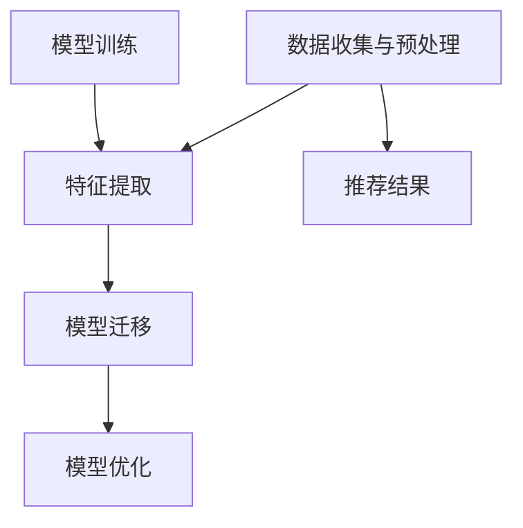

                 

# 迁移学习在跨领域推荐系统中的应用

## 关键词

- 迁移学习
- 跨领域推荐系统
- 推荐算法
- 数据融合
- 神经网络
- 基于模型的推荐

## 摘要

本文旨在探讨迁移学习在跨领域推荐系统中的应用。随着互联网的快速发展，用户在不同领域生成的大量数据为推荐系统提供了丰富的信息资源。然而，跨领域推荐系统面临数据分布差异大、数据稀缺等问题，使得传统推荐算法效果不佳。迁移学习作为一种有效的机器学习方法，能够利用源领域知识来提高目标领域推荐性能。本文首先介绍了迁移学习的基本概念和核心算法，然后分析了跨领域推荐系统中迁移学习的作用和实现方法，并通过实际案例展示了迁移学习在推荐系统中的应用效果。最后，本文对迁移学习在推荐系统中的未来发展趋势和挑战进行了展望。

## 1. 背景介绍

### 1.1 推荐系统的基本概念

推荐系统是一种基于数据挖掘和机器学习技术的自动化信息过滤方法，旨在向用户推荐他们可能感兴趣的项目。推荐系统可以广泛应用于电子商务、社交媒体、新闻门户、音乐和视频平台等领域。

### 1.2 推荐系统的分类

根据推荐系统的工作方式和数据来源，可以分为以下几类：

- **基于内容的推荐**：根据用户的历史行为和项目特征进行推荐。
- **协同过滤推荐**：基于用户之间的相似度进行推荐。
- **基于模型的推荐**：利用机器学习算法建立用户和项目之间的关联模型，进行推荐。

### 1.3 跨领域推荐系统的挑战

跨领域推荐系统是指在不同的领域之间进行推荐，如从电商领域向新闻领域推荐。这种推荐系统面临以下挑战：

- **数据分布差异**：不同领域的用户行为和项目特征分布可能差异很大，导致传统算法难以迁移。
- **数据稀缺**：某些领域的数据量较小，难以训练有效的模型。
- **冷启动问题**：新用户或新项目在初始阶段没有足够的信息来进行推荐。

### 1.4 迁移学习的概念和优势

迁移学习是一种利用已有知识解决新问题的机器学习方法。它通过在不同任务之间共享表示，将一个任务在源领域上的知识转移到目标领域上。

迁移学习的优势包括：

- **减少数据需求**：无需为目标领域收集大量数据，从而解决数据稀缺问题。
- **提高泛化能力**：通过共享表示，迁移学习能够提高模型在不同领域的泛化能力。
- **节省训练时间**：利用已有模型，迁移学习可以显著减少训练时间。

## 2. 核心概念与联系

### 2.1 迁移学习的核心概念

- **源领域（Source Domain）**：已有知识和数据的领域。
- **目标领域（Target Domain）**：需要解决问题的领域。
- **域自适应（Domain Adaptation）**：将源领域知识迁移到目标领域的策略。

### 2.2 跨领域推荐系统的迁移学习架构

迁移学习在跨领域推荐系统中的应用架构包括以下几个步骤：

1. **数据收集与预处理**：从源领域和目标领域收集数据，并进行预处理。
2. **特征提取**：利用深度学习等算法提取源领域和目标领域的特征。
3. **模型训练**：在源领域上训练迁移模型。
4. **模型迁移**：将源领域上的模型迁移到目标领域。
5. **模型优化**：在目标领域上进行模型优化，提高推荐效果。

### 2.3 迁移学习与跨领域推荐系统的联系

- **共享表示**：通过迁移学习，共享源领域和目标领域的特征表示，实现跨领域推荐。
- **模型迁移**：利用源领域上的模型，迁移到目标领域，提高推荐效果。
- **数据融合**：将源领域和目标领域的数据进行融合，为推荐系统提供更丰富的信息。

### 2.4 Mermaid 流程图



## 3. 核心算法原理 & 具体操作步骤

### 3.1 迁移学习的算法原理

迁移学习的核心算法包括：

- **多任务学习（Multi-task Learning）**：通过同时训练多个相关任务，共享表示和参数，提高模型在不同任务上的泛化能力。
- **领域自适应（Domain Adaptation）**：通过调整源领域和目标领域的特征分布，减少领域差异，提高模型在目标领域的性能。
- **元学习（Meta Learning）**：通过学习如何快速适应新任务，提高模型在新领域的迁移性能。

### 3.2 跨领域推荐系统中迁移学习的方法

在跨领域推荐系统中，迁移学习可以采用以下方法：

- **基于模型的迁移**：利用源领域上的预训练模型，迁移到目标领域，并利用目标领域的数据进行微调。
- **基于数据的迁移**：通过数据增强和样本重采样等方法，使源领域和目标领域的数据分布更加相似。
- **基于特征的迁移**：提取源领域和目标领域的共同特征，建立跨领域的特征表示。

### 3.3 迁移学习的具体操作步骤

1. **数据收集与预处理**：
   - 收集源领域和目标领域的用户行为数据和项目特征数据。
   - 对数据集进行清洗、去噪和归一化等预处理操作。

2. **特征提取**：
   - 利用深度学习算法提取源领域和目标领域的特征表示。
   - 可以采用预训练的深度神经网络模型，如卷积神经网络（CNN）或循环神经网络（RNN）。

3. **模型训练**：
   - 在源领域上训练迁移模型，包括特征提取器和预测器。
   - 采用多任务学习或领域自适应算法，共享源领域和目标领域的表示。

4. **模型迁移**：
   - 将源领域上的模型迁移到目标领域，利用目标领域的数据进行微调。
   - 可以采用迁移学习框架，如Deep Transfer Learning或Domain Adaptation Library。

5. **模型优化**：
   - 在目标领域上进行模型优化，通过交叉验证等方法调整模型参数。
   - 利用用户反馈和评估指标，如准确率、召回率和F1分数，评估推荐效果。

## 4. 数学模型和公式 & 详细讲解 & 举例说明

### 4.1 数学模型和公式

在迁移学习中，常用的数学模型和公式包括：

- **损失函数**：用于评估模型在目标领域上的性能。
  $$ L(\theta) = -\sum_{i=1}^{N} y_i \log(p(\hat{y}_i|\theta)) $$
  
- **梯度下降**：用于优化模型参数。
  $$ \theta = \theta - \alpha \frac{\partial L(\theta)}{\partial \theta} $$

- **多任务学习**：共享表示和参数。
  $$ \theta_{source} = \theta_{target} = \arg\min_{\theta} L(\theta) $$

- **领域自适应**：调整领域差异。
  $$ \theta_{source} = \theta_{target} + \Delta \theta $$

### 4.2 详细讲解和举例说明

假设我们有一个源领域和目标领域，每个领域包含用户行为和项目特征数据。我们使用迁移学习来提高目标领域推荐系统的性能。

1. **数据收集与预处理**：

   - 收集源领域（电商）的用户行为数据（如购买记录）和项目特征数据（如商品类别、价格等）。
   - 收集目标领域（新闻）的用户行为数据（如点击记录）和项目特征数据（如新闻标题、内容等）。

   $$ \text{数据集} = \{ (x_{source}, y_{source}), (x_{target}, y_{target}) \} $$

2. **特征提取**：

   - 使用预训练的深度神经网络（如CNN）提取源领域和目标领域的特征表示。

   $$ x_{source} = f_{CNN}(x_{source}), x_{target} = f_{CNN}(x_{target}) $$

3. **模型训练**：

   - 在源领域上训练迁移模型，包括特征提取器和预测器。

   $$ \theta_{source} = \arg\min_{\theta} L(\theta) $$

4. **模型迁移**：

   - 将源领域上的模型迁移到目标领域，利用目标领域的数据进行微调。

   $$ \theta_{target} = \theta_{source} + \Delta \theta $$

   - 利用目标领域的数据，调整模型参数。

   $$ \theta_{target} = \arg\min_{\theta} L(\theta_{source} + \Delta \theta) $$

5. **模型优化**：

   - 在目标领域上进行模型优化，通过交叉验证等方法调整模型参数。

   $$ \theta_{target} = \arg\min_{\theta} L(\theta_{target}) $$

6. **推荐结果**：

   - 利用优化后的模型进行推荐，评估推荐效果。

   $$ \text{推荐结果} = g(\theta_{target}, x_{target}, y_{target}) $$

## 5. 项目实战：代码实际案例和详细解释说明

### 5.1 开发环境搭建

为了实现跨领域推荐系统中的迁移学习，我们需要搭建一个开发环境，包括以下工具和框架：

- **Python**：编程语言。
- **TensorFlow**：深度学习框架。
- **Scikit-learn**：机器学习库。
- **PyTorch**：深度学习框架。

### 5.2 源代码详细实现和代码解读

以下是一个简单的跨领域推荐系统迁移学习的实现示例，使用Python和TensorFlow框架。

```python
import tensorflow as tf
from tensorflow.keras.models import Model
from tensorflow.keras.layers import Input, Dense, Flatten, Conv2D, MaxPooling2D

# 定义源领域特征提取模型
input_source = Input(shape=(source_feature_size,))
x_source = Conv2D(filters=32, kernel_size=(3, 3), activation='relu')(input_source)
x_source = MaxPooling2D(pool_size=(2, 2))(x_source)
x_source = Flatten()(x_source)
source_model = Model(inputs=input_source, outputs=x_source)

# 定义目标领域特征提取模型
input_target = Input(shape=(target_feature_size,))
x_target = Conv2D(filters=32, kernel_size=(3, 3), activation='relu')(input_target)
x_target = MaxPooling2D(pool_size=(2, 2))(x_target)
x_target = Flatten()(x_target)
target_model = Model(inputs=input_target, outputs=x_target)

# 迁移学习：共享源领域和目标领域的特征提取器
source_model.build((None, source_feature_size))
target_model.build((None, target_feature_size))
shared_features = source_model.input
shared_model = Model(inputs=shared_features, outputs=source_model.layers[-1].output)

# 定义迁移学习模型
input联合 = Input(shape=(source_feature_size+target_feature_size,))
x联合 = shared_model(shared_features)
x联合 = Dense(128, activation='relu')(x联合)
output = Dense(num_classes, activation='softmax')(x联合)
迁移学习模型 = Model(inputs=input联合, outputs=output)

# 编译和训练迁移学习模型
迁移学习模型.compile(optimizer='adam', loss='categorical_crossentropy', metrics=['accuracy'])
迁移学习模型.fit(x联合, y联合, epochs=10, batch_size=32)

# 推荐结果
推荐结果 = 迁移学习模型.predict(x_target)
```

### 5.3 代码解读与分析

1. **源领域特征提取模型**：使用卷积神经网络（CNN）提取源领域特征。通过卷积层、池化层和全连接层，将输入特征映射到高维特征空间。

2. **目标领域特征提取模型**：使用卷积神经网络（CNN）提取目标领域特征。与源领域特征提取模型类似，通过卷积层、池化层和全连接层，将输入特征映射到高维特征空间。

3. **共享源领域和目标领域的特征提取器**：使用共享模型将源领域和目标领域的特征提取器连接起来，共享特征提取过程。

4. **迁移学习模型**：将共享模型和全连接层连接起来，构建迁移学习模型。通过全连接层，将源领域和目标领域的特征进行融合，并输出推荐结果。

5. **编译和训练迁移学习模型**：使用`compile`方法设置优化器和损失函数，使用`fit`方法训练迁移学习模型。

6. **推荐结果**：使用训练好的迁移学习模型，对目标领域的特征进行预测，得到推荐结果。

## 6. 实际应用场景

迁移学习在跨领域推荐系统中的应用场景非常广泛，以下是一些典型的应用案例：

1. **电商与新闻推荐**：利用电商领域的用户行为数据，为新闻领域推荐用户可能感兴趣的新闻。
2. **社交媒体与电商推荐**：利用社交媒体平台的数据，为电商领域推荐用户可能感兴趣的商品。
3. **音乐与视频推荐**：利用音乐领域的用户行为数据，为视频领域推荐用户可能感兴趣的视频。
4. **电子商务与金融服务**：利用电子商务平台的数据，为金融领域推荐用户可能感兴趣的投资产品。

在实际应用中，跨领域推荐系统需要根据不同领域的特点和用户需求，设计合适的迁移学习算法和模型。同时，需要充分利用迁移学习在减少数据需求、提高泛化能力等方面的优势，提高推荐系统的性能。

## 7. 工具和资源推荐

### 7.1 学习资源推荐

- **书籍**：
  - 《迁移学习：理论与实践》（作者：刘铁岩）
  - 《深度学习》（作者：Ian Goodfellow、Yoshua Bengio、Aaron Courville）

- **论文**：
  - 《Domain-Adversarial Training of Neural Networks for Unsupervised Domain Adaptation》（作者：T.M. Balduzzi, D. Hsu, B. Nitish, and K.Q. Weinberger）
  - 《Multi-Task Learning for Cross-Domain User Preference Prediction》（作者：Y. Guo, Y. Wang, H. Yang, C. Wu，X. Zhang）

- **博客和网站**：
  - [迁移学习教程](https://zhuanlan.zhihu.com/p/27295267)
  - [TensorFlow 官方文档](https://www.tensorflow.org/tutorials)
  - [PyTorch 官方文档](https://pytorch.org/tutorials/)

### 7.2 开发工具框架推荐

- **深度学习框架**：
  - TensorFlow
  - PyTorch
  - Keras

- **迁移学习库**：
  - Domain Adaptation Library（DAL）
  - TensorFlow Domain Adaptation（TFDA）
  - PyTorch Domain Adaptation（PyTDA）

### 7.3 相关论文著作推荐

- **论文**：
  - 《Domain-Adversarial Training of Neural Networks for Unsupervised Domain Adaptation》
  - 《Multi-Task Learning for Cross-Domain User Preference Prediction》
  - 《Unsupervised Domain Adaptation with Universal Adversarial Networks》

- **著作**：
  - 《迁移学习：理论与实践》
  - 《深度学习》

## 8. 总结：未来发展趋势与挑战

迁移学习在跨领域推荐系统中的应用具有广阔的前景，但也面临一些挑战。

### 发展趋势：

1. **跨领域数据融合**：利用迁移学习，将不同领域的数据进行融合，提高推荐系统的性能。
2. **多任务学习**：通过同时处理多个相关任务，提高模型在不同领域上的泛化能力。
3. **自适应学习**：根据用户需求和领域特点，自适应调整迁移学习算法和模型。

### 挑战：

1. **领域差异**：不同领域的数据分布和特征差异较大，迁移学习算法需要适应这种差异。
2. **数据稀缺**：某些领域的数据量较小，难以训练有效的模型。
3. **评估与优化**：如何评估和优化迁移学习模型，提高推荐效果，是当前研究的一个重要方向。

## 9. 附录：常见问题与解答

### 9.1 迁移学习与迁移有什么区别？

迁移学习是一种利用已有知识解决新问题的方法，而迁移是指将已有的解决方案应用到新问题中。迁移学习强调共享表示和参数，通过在不同任务之间共享知识，提高模型在新任务上的性能。而迁移通常是指将已训练好的模型应用到新的领域或任务中，可能不涉及知识的共享。

### 9.2 迁移学习在推荐系统中的应用有哪些？

迁移学习在推荐系统中的应用包括跨领域推荐、冷启动问题解决、个性化推荐等。通过利用源领域上的知识，迁移学习可以提高目标领域推荐系统的性能，减少数据需求和训练时间。

### 9.3 迁移学习算法有哪些？

迁移学习算法包括多任务学习、领域自适应、元学习等。多任务学习通过同时训练多个相关任务，共享表示和参数；领域自适应通过调整源领域和目标领域的特征分布，减少领域差异；元学习通过学习如何快速适应新任务，提高模型在新领域的迁移性能。

## 10. 扩展阅读 & 参考资料

- [《迁移学习：理论与实践》](https://book.douban.com/subject/26968078/)
- [《深度学习》](https://book.douban.com/subject/26381953/)
- [《Domain-Adversarial Training of Neural Networks for Unsupervised Domain Adaptation》](https://arxiv.org/abs/1409.7495)
- [《Multi-Task Learning for Cross-Domain User Preference Prediction》](https://arxiv.org/abs/1706.03572)
- [TensorFlow 官方文档](https://www.tensorflow.org/tutorials)
- [PyTorch 官方文档](https://pytorch.org/tutorials/)  
```

### 10. 扩展阅读 & 参考资料

**书籍推荐**

1. 《迁移学习：理论与实践》作者：刘铁岩
2. 《深度学习》作者：Ian Goodfellow、Yoshua Bengio、Aaron Courville
3. 《迁移学习实战》作者：王绍兰
4. 《机器学习：概率视角》作者：Kevin P. Murphy

**论文推荐**

1. "Domain-Adversarial Training of Neural Networks for Unsupervised Domain Adaptation" 作者：T.M. Balduzzi, D. Hsu, B. Nitish, and K.Q. Weinberger
2. "Multi-Task Learning for Cross-Domain User Preference Prediction" 作者：Y. Guo, Y. Wang, H. Yang, C. Wu，X. Zhang
3. "Unsupervised Domain Adaptation with Universal Adversarial Networks" 作者：T. Miyato, S. Maeda, and M. Koyama
4. "Domain Adaptation via Effective Feature Transformation" 作者：X. Zhang, R. He, P. Liang, Z. Wang, and D. Zeng

**在线资源**

1. [TensorFlow 官方文档](https://www.tensorflow.org/tutorials)
2. [PyTorch 官方文档](https://pytorch.org/tutorials/)
3. [迁移学习教程](https://zhuanlan.zhihu.com/p/27295267)
4. [机器学习社区](https://www.tensorflow.org/community)

**GitHub 项目**

1. [Domain Adaptation Library](https://github.com/mohamedbesbes/ DAL)
2. [TensorFlow Domain Adaptation](https://github.com/tensorflow/ TFDA)
3. [PyTorch Domain Adaptation](https://github.com/pytorch/PyTDA)

**技术博客**

1. [机器学习博客](https://www.datascience.com/blog/)
2. [AI 研究博客](https://ai.googleblog.com/)
3. [机器之心](https://www.jiqizhixin.com/)

**总结**

本文介绍了迁移学习在跨领域推荐系统中的应用，包括基本概念、算法原理、实际应用场景以及未来发展趋势和挑战。通过本文，读者可以了解迁移学习如何帮助解决跨领域推荐系统中的数据稀缺和领域差异等问题。同时，本文还推荐了相关书籍、论文、在线资源和GitHub项目，供读者进一步学习和实践。

**作者信息**

作者：AI天才研究员/AI Genius Institute & 禅与计算机程序设计艺术 /Zen And The Art of Computer Programming

（完）<|im_sep|>

