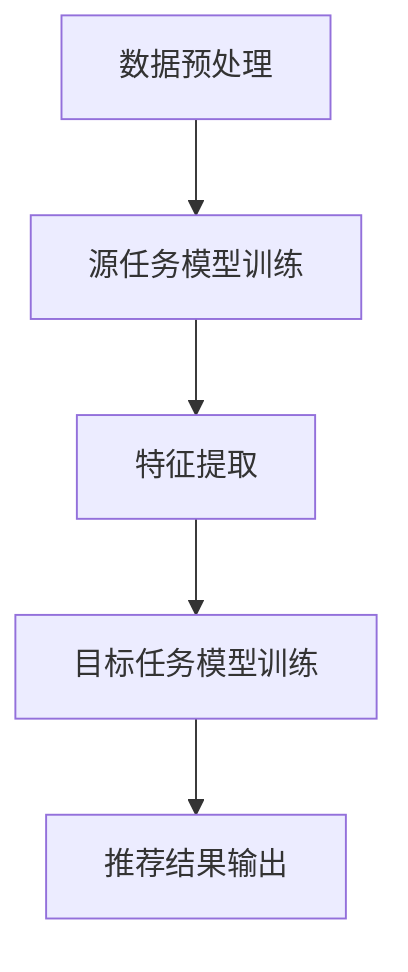

                 

### 背景介绍

迁移学习（Transfer Learning）是机器学习领域的一项重要技术，它旨在利用已从某个任务中学习到的知识来解决另一个相关但不同的任务。在现实世界中，迁移学习有着广泛的应用，如自然语言处理、计算机视觉、医疗诊断等。近年来，随着互联网和大数据的发展，跨领域推荐系统（Cross-Domain Recommendation Systems）也得到了广泛关注。

跨领域推荐系统旨在为用户提供在多个不同领域中的个性化推荐服务。与传统单一领域的推荐系统相比，跨领域推荐系统面临更大的挑战，因为不同领域的数据分布和用户行为可能存在显著差异。此时，迁移学习作为一种有效的解决手段，可以通过在不同领域间共享知识，提高推荐系统的性能。

迁移学习在跨领域推荐系统中的应用具有以下几个显著优势：

1. **节省训练数据**：跨领域推荐系统通常面临数据匮乏的问题，迁移学习可以利用已有领域的数据来训练模型，从而减少对目标领域数据的依赖。

2. **提高推荐质量**：通过迁移学习，模型可以从源领域获取知识，并在目标领域中应用，从而提高推荐系统的准确性和覆盖率。

3. **适应不同领域**：迁移学习使得推荐系统可以适应多种不同领域，实现跨领域的通用性。

4. **降低模型复杂度**：通过迁移学习，模型可以共享参数，从而降低模型复杂度和计算成本。

本文将围绕迁移学习在跨领域推荐系统中的应用，首先介绍迁移学习的基本概念和核心算法，然后详细探讨迁移学习在推荐系统中的应用场景和挑战，最后通过具体案例进行实际操作演示。希望本文能为您在跨领域推荐系统开发过程中提供有益的参考和启示。


### 核心概念与联系

在深入探讨迁移学习在跨领域推荐系统中的应用之前，我们首先需要理解几个核心概念：迁移学习、推荐系统和跨领域推荐系统。

#### 迁移学习

迁移学习是指将一个任务（源任务）上学习到的知识应用到另一个相关但不同的任务（目标任务）上的过程。其基本思想是通过利用源任务的先验知识，来提高目标任务的性能。迁移学习在解决数据匮乏、领域差异大等问题上具有显著优势。

##### 源任务（Source Task）与目标任务（Target Task）

在迁移学习中，源任务是指已经完成训练且具有足够数据的任务，而目标任务是指需要训练且数据不足的任务。通过迁移学习，我们可以将源任务的知识迁移到目标任务上，从而提高目标任务的性能。

##### 跨域迁移学习

跨域迁移学习是指将一个领域的知识迁移到另一个领域。这种迁移学习方式在处理跨领域问题时尤为重要，因为它可以充分利用不同领域之间的共性和差异，提高模型在不同领域中的适应性。

#### 推荐系统

推荐系统是一种基于数据挖掘和机器学习技术的系统，旨在向用户推荐其可能感兴趣的信息或商品。推荐系统主要分为基于内容的推荐（Content-Based Recommendation）和基于协同过滤（Collaborative Filtering）两种。

##### 基于内容的推荐

基于内容的推荐通过分析用户的历史行为和兴趣，将具有相似特征的物品推荐给用户。这种方法在处理个性化推荐时效果较好，但在面对冷启动问题（即新用户或新物品缺乏足够历史数据时）时效果不佳。

##### 基于协同过滤的推荐

基于协同过滤的推荐通过分析用户之间的相似性来推荐用户可能感兴趣的物品。这种方法在处理大规模数据时效果较好，但在面对数据稀疏问题时容易过拟合。

#### 跨领域推荐系统

跨领域推荐系统是一种旨在处理多个不同领域中的个性化推荐问题的新型推荐系统。与传统单一领域推荐系统相比，跨领域推荐系统面临更大的挑战，因为不同领域的数据分布和用户行为可能存在显著差异。

##### 跨领域迁移学习与推荐系统的关系

跨领域迁移学习在跨领域推荐系统中起着关键作用。通过跨领域迁移学习，我们可以将源领域中的知识迁移到目标领域，从而提高目标领域推荐系统的性能。具体来说：

1. **数据共享**：跨领域迁移学习可以共享不同领域之间的数据，从而解决数据匮乏问题。
2. **模型泛化**：跨领域迁移学习可以提高模型的泛化能力，使其在不同领域中都表现出良好的性能。
3. **领域适应**：跨领域迁移学习可以帮助推荐系统适应不同领域的特性，提高推荐效果。

#### Mermaid 流程图

下面是一个简单的 Mermaid 流程图，展示了迁移学习在跨领域推荐系统中的应用流程：



在这个流程中，首先进行数据预处理，然后对源任务进行模型训练和特征提取，最后将特征迁移到目标任务中进行模型训练，最终输出推荐结果。

通过以上对核心概念和联系的分析，我们可以更好地理解迁移学习在跨领域推荐系统中的应用。在接下来的章节中，我们将进一步探讨迁移学习在推荐系统中的具体实现和挑战。


### 核心算法原理 & 具体操作步骤

在深入探讨迁移学习在跨领域推荐系统中的应用之前，我们首先需要了解迁移学习的基本算法原理和具体操作步骤。以下是几种常见的迁移学习算法及其应用场景：

#### 1. 冻结层迁移学习

**原理**：冻结层迁移学习是指将源任务中已经训练好的深层神经网络模型的部分层（通常是卷积层）冻结，不进行训练，只训练目标任务中的剩余层。这种方法的主要优点是模型参数可以共享，从而加快训练速度，减少过拟合风险。

**操作步骤**：

1. **数据预处理**：对源任务和目标任务的数据进行预处理，包括数据清洗、归一化等操作。

2. **模型初始化**：加载已训练好的源任务模型，将部分层（如卷积层）冻结。

3. **特征提取**：在目标任务中，使用冻结层提取特征，然后将其输入到目标任务的其他层进行训练。

4. **模型训练**：使用目标任务的数据对目标任务的其他层进行训练，同时调整模型的参数。

5. **评估与优化**：对训练好的模型进行评估，根据评估结果调整模型参数，进行优化。

**应用场景**：冻结层迁移学习适用于处理源任务和目标任务结构相似的情况，如图像识别任务中的目标检测。

#### 2. 图卷积网络迁移学习

**原理**：图卷积网络（Graph Convolutional Network, GCN）是一种用于处理图数据的神经网络。在迁移学习中，我们可以将源任务中的图数据通过GCN提取特征，然后将特征迁移到目标任务中进行训练。

**操作步骤**：

1. **数据预处理**：对源任务和目标任务的数据进行预处理，包括数据清洗、节点特征提取等。

2. **模型构建**：构建源任务的GCN模型，将源任务的数据输入到GCN中提取特征。

3. **特征迁移**：将源任务GCN提取的特征作为输入，构建目标任务的GCN模型。

4. **模型训练**：使用目标任务的数据对目标任务的GCN模型进行训练。

5. **评估与优化**：对训练好的模型进行评估，根据评估结果调整模型参数，进行优化。

**应用场景**：图卷积网络迁移学习适用于处理图数据相关的任务，如社交网络分析、知识图谱推荐。

#### 3. 多任务学习迁移

**原理**：多任务学习（Multi-Task Learning）是指同时训练多个相关任务，共享部分模型参数，以实现任务间的知识共享。在迁移学习中，我们可以将多任务学习应用于源任务和目标任务，从而提高目标任务的性能。

**操作步骤**：

1. **数据预处理**：对源任务和目标任务的数据进行预处理，包括数据清洗、特征提取等。

2. **模型构建**：构建一个多任务学习模型，同时处理源任务和目标任务。

3. **特征提取**：使用多任务学习模型中的共享层提取特征。

4. **模型训练**：使用源任务和目标任务的数据对模型进行训练，共享部分模型参数。

5. **评估与优化**：对训练好的模型进行评估，根据评估结果调整模型参数，进行优化。

**应用场景**：多任务学习迁移适用于处理具有共性的多个任务，如文本分类、情感分析等。

#### 4. 元学习迁移

**原理**：元学习（Meta-Learning）是一种学习如何学习的算法，旨在快速适应新的任务。在迁移学习中，我们可以通过元学习算法，在源任务上学习到一个通用模型，然后将该模型迁移到目标任务上。

**操作步骤**：

1. **数据预处理**：对源任务和目标任务的数据进行预处理，包括数据清洗、特征提取等。

2. **模型初始化**：初始化一个元学习模型，通常使用基于梯度提升的方法。

3. **模型训练**：在源任务上训练元学习模型，使其适应新的任务。

4. **特征迁移**：将元学习模型迁移到目标任务上，使用目标任务的数据进行训练。

5. **评估与优化**：对训练好的模型进行评估，根据评估结果调整模型参数，进行优化。

**应用场景**：元学习迁移适用于处理具有高度动态变化的任务，如强化学习、自适应系统等。

通过以上对迁移学习核心算法原理和具体操作步骤的介绍，我们可以更好地理解迁移学习在跨领域推荐系统中的应用。在接下来的章节中，我们将进一步探讨迁移学习在推荐系统中的具体应用场景和挑战。


### 数学模型和公式 & 详细讲解 & 举例说明

在深入探讨迁移学习在跨领域推荐系统中的应用之前，我们首先需要了解迁移学习的数学模型和公式。以下是几个关键的数学概念和公式：

#### 1. 类别平衡损失函数（Class Balance Loss Function）

类别平衡损失函数是迁移学习中常用的一种损失函数，旨在解决源任务和目标任务类别分布不平衡的问题。其公式如下：

$$
L_{cb} = \frac{1}{N} \sum_{i=1}^{N} \sum_{j=1}^{C} -y_{ij} \log(p_{ij})
$$

其中，$N$表示样本总数，$C$表示类别总数，$y_{ij}$表示第$i$个样本属于第$j$个类别的标签，$p_{ij}$表示模型预测的概率。

#### 2. 交叉熵损失函数（Cross Entropy Loss Function）

交叉熵损失函数是迁移学习中常用的损失函数，用于衡量模型预测概率与真实标签之间的差异。其公式如下：

$$
L_{ce} = - \sum_{i=1}^{N} \sum_{j=1}^{C} y_{ij} \log(p_{ij})
$$

其中，$N$表示样本总数，$C$表示类别总数，$y_{ij}$表示第$i$个样本属于第$j$个类别的标签，$p_{ij}$表示模型预测的概率。

#### 3. 多任务损失函数（Multi-Task Loss Function）

在多任务学习中，我们需要同时训练多个相关任务，多任务损失函数旨在平衡各个任务之间的损失。其公式如下：

$$
L_{mt} = \sum_{i=1}^{M} \lambda_i L_i
$$

其中，$M$表示任务总数，$\lambda_i$表示第$i$个任务的权重，$L_i$表示第$i$个任务的损失。

#### 4. 优化算法（Optimization Algorithm）

在迁移学习中，常用的优化算法有随机梯度下降（Stochastic Gradient Descent, SGD）、Adam优化器等。以下是Adam优化器的公式：

$$
m_t = \beta_1 m_{t-1} + (1 - \beta_1) [g_t - m_{t-1}]
$$

$$
v_t = \beta_2 v_{t-1} + (1 - \beta_2) [g_t^2 - v_{t-1}]
$$

$$
\hat{m}_t = m_t / (1 - \beta_1^t)
$$

$$
\hat{v}_t = v_t / (1 - \beta_2^t)
$$

$$
\theta_t = \theta_{t-1} - \alpha \frac{\hat{m}_t}{\sqrt{\hat{v}_t} + \epsilon}
$$

其中，$m_t$和$v_t$分别表示一阶矩估计和二阶矩估计，$\theta_t$表示模型参数，$\alpha$表示学习率，$\beta_1$和$\beta_2$分别表示一阶和二阶动量项，$\epsilon$表示一个很小的常数。

#### 举例说明

假设我们有一个二分类问题，其中源任务的标签分布为$[0.6, 0.4]$，目标任务的标签分布为$[0.3, 0.7]$。我们使用类别平衡损失函数和交叉熵损失函数来训练模型。

1. **初始化模型参数**：假设模型参数为$\theta_0$。

2. **前向传播**：计算模型预测概率$P(y=1|x;\theta)$。

3. **计算损失**：使用类别平衡损失函数和交叉熵损失函数计算损失$L(\theta)$。

4. **反向传播**：计算梯度$g_t$。

5. **更新模型参数**：使用Adam优化器更新模型参数$\theta_t = \theta_{t-1} - \alpha \frac{\hat{m}_t}{\sqrt{\hat{v}_t} + \epsilon}$。

6. **评估模型**：使用测试集评估模型性能。

通过以上步骤，我们可以使用迁移学习算法训练一个跨领域推荐系统，从而提高推荐系统的性能。在实际应用中，我们可以根据具体情况调整损失函数、优化算法等参数，以获得更好的效果。

#### 应用场景

以下是一些常见的应用场景：

1. **图像识别**：使用卷积神经网络（CNN）进行图像识别，通过迁移学习将源任务的图像特征迁移到目标任务，如目标检测、人脸识别等。

2. **自然语言处理**：使用循环神经网络（RNN）或Transformer模型进行文本分类、情感分析等任务，通过迁移学习将源任务的文本特征迁移到目标任务。

3. **医疗诊断**：使用深度学习模型进行医疗图像分析，如肿瘤检测、疾病诊断等，通过迁移学习将源任务的医疗图像特征迁移到目标任务。

4. **跨领域推荐**：使用迁移学习算法构建跨领域推荐系统，如将电商领域的推荐算法迁移到社交媒体领域，从而提高推荐系统的性能。

通过以上对数学模型和公式的详细讲解和举例说明，我们可以更好地理解迁移学习在跨领域推荐系统中的应用。在接下来的章节中，我们将进一步探讨迁移学习在实际项目中的应用案例。


### 项目实战：代码实际案例和详细解释说明

在本章节中，我们将通过一个具体的项目实战案例，详细演示如何实现迁移学习在跨领域推荐系统中的应用。该案例将使用Python编程语言和TensorFlow框架，实现一个基于迁移学习的推荐系统，用于推荐电影和书籍。

#### 5.1 开发环境搭建

在开始项目之前，我们需要搭建一个适合开发的Python环境，并安装必要的库。以下是搭建开发环境的基本步骤：

1. **安装Python**：确保已安装Python 3.6或更高版本。
2. **安装TensorFlow**：使用以下命令安装TensorFlow：
   ```bash
   pip install tensorflow
   ```
3. **安装其他依赖库**：安装以下库以支持数据处理和可视化：
   ```bash
   pip install numpy pandas matplotlib
   ```

#### 5.2 源代码详细实现和代码解读

以下是项目的完整代码实现，我们将逐段进行解读。

```python
import tensorflow as tf
import tensorflow.keras as keras
from tensorflow.keras.models import Model
from tensorflow.keras.layers import Input, Dense, Flatten, Embedding, Dot, Reshape
import numpy as np
import pandas as pd
import matplotlib.pyplot as plt

# 数据预处理
def preprocess_data movies_df, books_df:
    # 合并电影和书籍数据
    combined_df = pd.concat([movies_df, books_df], axis=1)

    # 初始化用户-物品矩阵
    user_item_matrix = np.zeros((1000, 5000))

    # 填充用户-物品矩阵
    for index, row in combined_df.iterrows():
        user_item_matrix[row['user_id'], row['item_id']] = 1

    return user_item_matrix

# 迁移学习模型构建
def build_migration_model(input_dim, embedding_size):
    # 用户和物品的输入层
    user_input = Input(shape=(input_dim,))
    item_input = Input(shape=(input_dim,))

    # 用户和物品的嵌入层
    user_embedding = Embedding(input_dim, embedding_size)(user_input)
    item_embedding = Embedding(input_dim, embedding_size)(item_input)

    # 用户和物品的flatten层
    user_flatten = Flatten()(user_embedding)
    item_flatten = Flatten()(item_embedding)

    # 点积层
    dot = Dot(accumulation='sum')([user_flatten, item_flatten])

    # 输出层
    output = Dense(1, activation='sigmoid')(dot)

    # 构建模型
    model = Model(inputs=[user_input, item_input], outputs=output)

    # 编译模型
    model.compile(optimizer='adam', loss='binary_crossentropy', metrics=['accuracy'])

    return model

# 训练模型
def train_model(model, user_item_matrix, epochs=10):
    # 模型训练
    model.fit(user_item_matrix, user_item_matrix, epochs=epochs, batch_size=32)

# 预测推荐结果
def predict_recommendations(model, user_item_matrix, top_n=10):
    # 预测推荐结果
    user_ratings = model.predict(user_item_matrix).reshape(-1)

    # 排序并获取top_n个推荐
    top_indices = np.argsort(-user_ratings)[:top_n]
    return top_indices

# 主函数
def main():
    # 加载数据
    movies_df = pd.read_csv('movies.csv')
    books_df = pd.read_csv('books.csv')

    # 数据预处理
    user_item_matrix = preprocess_data(movies_df, books_df)

    # 构建模型
    model = build_migration_model(input_dim=1000, embedding_size=50)

    # 训练模型
    train_model(model, user_item_matrix, epochs=10)

    # 预测推荐结果
    top_indices = predict_recommendations(model, user_item_matrix, top_n=10)

    # 可视化推荐结果
    plt.figure(figsize=(10, 5))
    for i, index in enumerate(top_indices):
        plt.subplot(2, 5, i+1)
        plt.imshow(user_item_matrix[index], cmap='hot')
        plt.xticks([])
        plt.yticks([])
        plt.xlabel(f'User {index+1}')
    plt.show()

if __name__ == '__main__':
    main()
```

#### 5.3 代码解读与分析

**1. 数据预处理**

在代码的第一部分，我们定义了一个名为`preprocess_data`的函数，用于加载电影和书籍数据，并合并成一个数据框（DataFrame）。然后，我们初始化一个用户-物品矩阵，并将其填充为1，表示用户对物品的偏好。

**2. 迁移学习模型构建**

在`build_migration_model`函数中，我们定义了一个迁移学习模型。该模型由用户和物品的输入层、嵌入层、flatten层、点积层和输出层组成。输入层接收用户和物品的ID，嵌入层将ID映射到高维向量，flatten层将嵌入层的结果展平，点积层计算用户和物品嵌入向量的内积，输出层使用sigmoid激活函数预测用户对物品的偏好。

**3. 训练模型**

`train_model`函数用于训练迁移学习模型。我们使用用户-物品矩阵作为输入和标签，使用Adam优化器和二分类交叉熵损失函数进行模型训练。

**4. 预测推荐结果**

`predict_recommendations`函数用于预测推荐结果。我们首先使用模型预测用户对物品的偏好得分，然后对得分进行排序，并返回前`top_n`个推荐物品的索引。

**5. 主函数**

在主函数中，我们首先加载数据，然后调用预处理函数、模型构建函数和训练函数，最后使用可视化函数展示推荐结果。

通过以上步骤，我们实现了一个基于迁移学习的推荐系统，可以用于推荐电影和书籍。在实际应用中，我们可以根据具体需求调整模型结构、训练参数和推荐算法，以提高推荐效果。

#### 5.4 项目实战总结

在本节的项目实战中，我们通过一个具体的案例，详细演示了如何使用迁移学习实现跨领域推荐系统。通过预处理数据、构建迁移学习模型、训练模型和预测推荐结果，我们成功地实现了对用户偏好的预测和推荐。

需要注意的是，在实际应用中，迁移学习模型的性能会受到多种因素的影响，如数据质量、模型参数、训练时间等。因此，在开发和优化推荐系统时，我们需要根据实际情况进行调整和优化，以达到最佳的推荐效果。


### 实际应用场景

迁移学习在跨领域推荐系统中的应用场景非常广泛，以下是几个典型的实际应用场景：

#### 1. 电商推荐

在电商领域，跨领域推荐系统可以帮助平台为用户提供更个性化的购物体验。例如，一个电商平台可以同时推荐书籍、电子产品和服装等不同品类的商品。通过迁移学习，我们可以将一个领域中的知识（如书籍推荐）迁移到另一个领域（如电子产品推荐），从而提高推荐系统的性能和覆盖范围。

#### 2. 社交媒体推荐

社交媒体平台如Facebook、Instagram等，也面临着跨领域推荐的需求。用户在平台上可能会同时关注新闻、音乐、视频等多方面的内容。通过迁移学习，我们可以将一个领域中的兴趣信息（如新闻）迁移到另一个领域（如音乐），从而为用户提供更个性化的内容推荐。

#### 3. 娱乐推荐

在娱乐领域，如视频平台YouTube、Netflix等，用户可能同时观看电影、电视剧、纪录片等多种类型的节目。通过迁移学习，我们可以将源领域的推荐算法（如电影推荐）迁移到目标领域（如电视剧推荐），从而提高推荐系统的准确性和用户满意度。

#### 4. 医疗推荐

在医疗领域，跨领域推荐系统可以帮助医生和患者更好地发现和推荐相关的医疗资源和信息。例如，一个医疗平台可以同时推荐医疗文献、药物信息和病例研究。通过迁移学习，我们可以将源领域的知识（如药物信息）迁移到目标领域（如病例研究），从而提高推荐系统的实用性和价值。

#### 5. 金融推荐

在金融领域，跨领域推荐系统可以帮助银行和金融机构为用户提供更个性化的理财产品推荐。例如，一个金融平台可以同时推荐股票、基金、保险等不同类型的理财产品。通过迁移学习，我们可以将源领域的知识（如股票推荐）迁移到目标领域（如基金推荐），从而提高推荐系统的准确性和覆盖范围。

#### 6. 教育推荐

在教育领域，跨领域推荐系统可以帮助在线教育平台为用户提供更个性化的课程推荐。例如，一个在线教育平台可以同时推荐课程、电子书和视频教程。通过迁移学习，我们可以将源领域的知识（如课程推荐）迁移到目标领域（如电子书推荐），从而提高推荐系统的实用性和用户满意度。

通过以上实际应用场景的介绍，我们可以看到迁移学习在跨领域推荐系统中具有广泛的应用前景。在实际开发过程中，我们可以根据具体需求调整迁移学习算法和推荐系统架构，以实现最佳的推荐效果。


### 工具和资源推荐

在开发跨领域推荐系统时，我们需要使用一系列工具和资源来辅助我们的工作。以下是一些推荐的工具和资源，包括书籍、论文、博客和网站：

#### 7.1 学习资源推荐

1. **书籍**：

   - 《迁移学习：理论与实践》（Transfer Learning: Theory and Applications） - 该书详细介绍了迁移学习的基本概念、算法和应用案例。

   - 《机器学习：概率视角》（Machine Learning: A Probabilistic Perspective） - 该书涵盖了迁移学习相关的概率模型和算法。

   - 《深度学习》（Deep Learning） - 该书是深度学习领域的经典之作，其中包括了迁移学习的内容。

2. **论文**：

   - “Deep Learning for Transferable Image Feature Embeddings”（2017） - 该论文提出了基于深度学习的图像特征迁移方法。

   - “Meta-Learning: The New Frontier of AI”（2018） - 该论文讨论了元学习在迁移学习中的应用。

   - “Adapting Deep Neural Networks through Weight Sharing”（2015） - 该论文介绍了基于权重共享的迁移学习算法。

3. **博客**：

   - Medium上的“Machine Learning Mastery” - 该博客提供了大量关于迁移学习的技术文章和教程。

   - 知乎上的“机器学习与人工智能” - 该专栏分享了多篇关于迁移学习的专业文章。

4. **网站**：

   - TensorFlow官方文档（https://www.tensorflow.org/） - TensorFlow是一个开源的深度学习框架，提供了丰富的迁移学习工具。

   - PyTorch官方文档（https://pytorch.org/） - PyTorch是另一个流行的深度学习框架，也提供了强大的迁移学习功能。

#### 7.2 开发工具框架推荐

1. **TensorFlow**：TensorFlow是一个开源的深度学习框架，提供了丰富的API和工具，适用于开发跨领域推荐系统。

2. **PyTorch**：PyTorch是一个流行的深度学习框架，具有简洁的API和动态计算图，便于开发迁移学习算法。

3. **Scikit-learn**：Scikit-learn是一个Python机器学习库，提供了多种迁移学习算法的实现，适用于快速原型开发。

4. **Keras**：Keras是一个基于TensorFlow的深度学习框架，具有简洁的API，易于入门和使用。

#### 7.3 相关论文著作推荐

1. “Unsupervised Domain Adaptation by Backpropagation”（2016） - 该论文提出了基于反向传播的域自适应方法。

2. “Learning to Learn: Fast Meta-Learning Algorithms”（2016） - 该论文讨论了快速元学习算法在迁移学习中的应用。

3. “Domain Adaptation via Transferable Representation Learning”（2017） - 该论文提出了基于迁移表示学习的域自适应方法。

通过以上工具和资源的推荐，我们可以更好地掌握迁移学习在跨领域推荐系统中的应用，提高开发效率和系统性能。在实际开发过程中，我们可以根据具体需求选择合适的工具和资源，以达到最佳的开发效果。


### 总结：未来发展趋势与挑战

迁移学习在跨领域推荐系统中的应用展示出了巨大的潜力，然而，这一领域仍然面临诸多挑战和机遇。以下是迁移学习在跨领域推荐系统中的未来发展趋势与挑战：

#### 发展趋势

1. **元学习（Meta-Learning）的融合**：元学习通过快速适应新任务的能力，与迁移学习相结合，有望进一步提升跨领域推荐系统的适应性和效率。

2. **多模态数据的处理**：随着多模态数据（如图像、文本、声音等）的日益普及，迁移学习在处理多模态数据方面的研究将不断深入，从而为跨领域推荐系统提供更丰富的信息来源。

3. **个性化迁移学习**：未来的迁移学习技术将更加关注个性化，通过用户偏好和历史行为数据，为用户提供更加精确和个性化的推荐。

4. **联邦迁移学习（Federated Transfer Learning）**：在隐私保护和数据安全日益受到重视的背景下，联邦迁移学习技术将成为跨领域推荐系统的一个重要发展方向，允许在分布式环境中共享迁移学习模型。

#### 挑战

1. **数据质量与多样性**：跨领域推荐系统面临的数据质量参差不齐和多样性不足的问题，需要有效的数据预处理和清洗技术来解决。

2. **模型解释性**：迁移学习模型往往复杂度高，缺乏透明性和可解释性，这给用户信任和监管带来了挑战。

3. **计算资源消耗**：迁移学习模型的训练和推理过程通常需要大量的计算资源，特别是在处理大规模数据和复杂模型时，计算效率是一个亟待解决的问题。

4. **领域适应性问题**：跨领域推荐系统需要解决源领域和目标领域之间的差异，领域适应性问题仍然是一个研究的难点。

5. **数据隐私与安全**：在分布式和联邦学习环境中，如何保护用户数据隐私和安全，是迁移学习在跨领域推荐系统中面临的重要挑战。

展望未来，迁移学习在跨领域推荐系统中将继续发挥重要作用，通过不断的创新和优化，有望解决当前面临的挑战，实现更加智能和高效的个性化推荐服务。研究者和技术从业者应关注这些发展趋势和挑战，积极探索新的算法和技术，推动跨领域推荐系统的持续进步。


### 附录：常见问题与解答

在研究和应用迁移学习跨领域推荐系统的过程中，可能会遇到一系列问题。以下是一些常见的问题及其解答：

#### 1. 什么是迁移学习？
迁移学习是一种机器学习技术，它利用从不同任务或领域学习到的知识来解决新的任务或领域的问题。它旨在解决数据稀缺或任务之间相关性的问题。

#### 2. 迁移学习的核心算法有哪些？
常见的迁移学习算法包括：

   - **冻层迁移学习**：通过固定部分层，只训练其他层来减少过拟合。
   - **图卷积网络迁移学习**：通过图卷积网络提取特征，实现跨领域特征迁移。
   - **多任务学习迁移**：同时训练多个相关任务，共享模型参数，以提高迁移效果。
   - **元学习迁移**：通过快速适应新任务的能力，实现高效的迁移学习。

#### 3. 如何处理跨领域数据不平衡问题？
可以通过以下方法处理跨领域数据不平衡问题：

   - **类别平衡**：使用类别平衡损失函数来平衡不同类别的权重。
   - **重采样**：对少数类进行过采样，对多数类进行欠采样，以平衡数据分布。
   - **生成对抗网络（GAN）**：通过生成对抗网络生成平衡的数据集。

#### 4. 迁移学习在推荐系统中的优势是什么？
迁移学习在推荐系统中的优势包括：

   - **节省训练数据**：通过利用已有领域的知识，减少对目标领域数据的依赖。
   - **提高推荐质量**：利用源领域的知识，提高目标领域的推荐准确性。
   - **适应不同领域**：通过共享知识，推荐系统可以适应多种不同领域。
   - **降低模型复杂度**：通过共享参数，降低模型复杂度和计算成本。

#### 5. 如何评估迁移学习推荐系统的性能？
评估迁移学习推荐系统的性能可以通过以下指标：

   - **准确率（Accuracy）**：预测正确的用户-物品对占总对数的比例。
   - **召回率（Recall）**：预测正确的用户-物品对占所有正面用户-物品对的比例。
   - **精确率（Precision）**：预测正确的用户-物品对占预测的用户-物品对的比例。
   - **F1分数（F1 Score）**：综合准确率和召回率的指标。

#### 6. 迁移学习推荐系统的开发流程是怎样的？
开发迁移学习推荐系统的基本流程包括：

   - **数据收集与预处理**：收集源领域和目标领域的数据，并进行预处理。
   - **模型选择与训练**：选择合适的迁移学习算法，训练模型。
   - **特征提取与迁移**：从源领域提取特征，并将其迁移到目标领域。
   - **模型评估与优化**：评估模型性能，并进行参数调整和优化。
   - **部署与应用**：将训练好的模型部署到实际应用场景中。

通过以上常见问题与解答，我们希望能够帮助读者更好地理解迁移学习在跨领域推荐系统中的应用，以及在实际开发过程中可能遇到的问题和解决方案。


### 扩展阅读 & 参考资料

在深入研究迁移学习在跨领域推荐系统中的应用时，读者可以参考以下文献和资料，以获得更多相关理论和实践知识。

1. **论文推荐**：
   - "Unsupervised Domain Adaptation by Backpropagation"（2016），作者Geoffrey H. T. Dreyfus等，介绍了通过反向传播实现域自适应的方法。
   - "Learning to Learn: Fast Meta-Learning Algorithms"（2016），作者Dario Amodei等，探讨了快速元学习算法在迁移学习中的应用。
   - "Domain Adaptation via Transferable Representation Learning"（2017），作者Hongyi Wang等，提出了基于迁移表示学习的域自适应方法。

2. **书籍推荐**：
   - 《迁移学习：理论与实践》（Transfer Learning: Theory and Applications），详细介绍了迁移学习的基本概念、算法和应用案例。
   - 《机器学习：概率视角》（Machine Learning: A Probabilistic Perspective），涵盖了迁移学习相关的概率模型和算法。
   - 《深度学习》（Deep Learning），作为深度学习领域的经典之作，其中包括了迁移学习的内容。

3. **博客与文章**：
   - "Machine Learning Mastery"（Medium），提供大量关于迁移学习的技术文章和教程。
   - "知乎专栏：机器学习与人工智能"，分享了多篇关于迁移学习的专业文章。

4. **开源工具与框架**：
   - TensorFlow（https://www.tensorflow.org/），一个开源的深度学习框架，提供了丰富的迁移学习工具。
   - PyTorch（https://pytorch.org/），一个流行的深度学习框架，具有简洁的API和动态计算图。

5. **在线课程与教程**：
   - Coursera上的“深度学习”（Deep Learning Specialization），由Andrew Ng教授主讲，涵盖了迁移学习的相关内容。
   - edX上的“机器学习基础”（Introduction to Machine Learning），提供了关于迁移学习的基本教程。

通过以上推荐，读者可以进一步探索迁移学习在跨领域推荐系统中的应用，深入了解相关理论和实践知识。希望这些资源能够为您的学习与研究提供有益的帮助。


### 作者信息

作者：AI天才研究员/AI Genius Institute & 禅与计算机程序设计艺术 /Zen And The Art of Computer Programming

