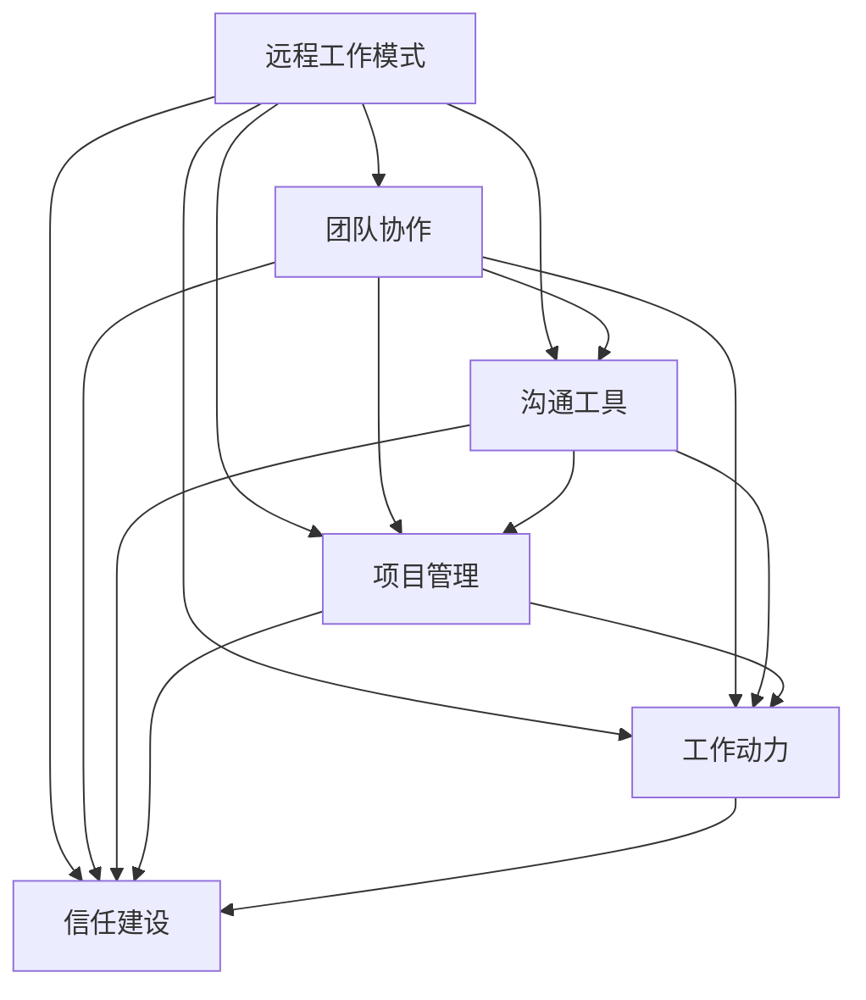

                 

### 背景介绍

随着互联网技术的迅猛发展，远程工作模式在全球范围内变得越来越普及。远程团队的建设成为许多企业关注的焦点。然而，远程团队在面临众多优势的同时，也面临着一些特殊的挑战。这些挑战主要集中在如何克服地理位置带来的沟通障碍、如何提高团队成员的协作效率、如何确保项目的顺利进行等方面。

首先，地理上的距离使得团队成员之间的面对面交流变得困难。沟通不畅可能导致误解、信息滞后，甚至影响项目的整体进度。其次，团队成员的工作时间和工作环境存在差异，这增加了协调的难度。此外，远程工作还可能带来团队成员之间信任感减弱、工作动力不足等问题。

本文旨在探讨远程团队建设中的关键策略和方法，帮助团队克服距离障碍，实现高效协作。文章将分为以下几个部分：

1. 核心概念与联系：介绍远程团队建设的核心概念，并绘制Mermaid流程图展示这些概念之间的联系。
2. 核心算法原理与具体操作步骤：详细讲解如何在远程团队中实施有效的协作和管理策略。
3. 数学模型与公式：介绍与远程团队建设相关的数学模型和公式，并进行详细讲解和举例说明。
4. 项目实战：通过实际案例展示如何搭建远程团队开发环境，详细解读源代码，并进行分析。
5. 实际应用场景：讨论远程团队在各个行业中的应用，以及如何应对特定的远程工作挑战。
6. 工具和资源推荐：推荐学习资源、开发工具框架和相关论文著作。
7. 总结：展望远程团队建设的未来发展趋势和面临的挑战。

通过本文的详细分析和具体建议，希望能够为读者提供有价值的参考，帮助他们在远程团队建设中取得成功。

### 核心概念与联系

在探讨远程团队建设时，我们首先需要明确几个核心概念，并理解它们之间的相互关系。以下是远程团队建设中的几个关键概念及其关系：

**1. 远程工作模式**：远程工作模式是指团队成员在不同的地理位置工作，通过互联网进行沟通和协作。这种模式突破了传统办公环境的限制，使得团队成员可以灵活安排工作时间，提高工作效率。

**2. 团队协作**：团队协作是远程团队成功的关键。有效的团队协作需要团队成员之间建立信任，保持良好的沟通，并共同致力于实现项目目标。

**3. 沟通工具**：远程团队依赖各种沟通工具，如即时通讯软件、视频会议平台、项目管理工具等，来实现高效的沟通和协作。这些工具的选择和使用直接影响到团队的工作效率和效果。

**4. 项目管理**：远程团队的项目管理需要更加精细化和灵活。项目经理需要制定明确的项目计划，监控项目进度，确保团队目标的实现。

**5. 工作动力**：远程工作可能导致团队成员的工作动力下降。因此，团队建设需要关注如何激发团队成员的积极性和创造力，保持工作热情。

**6. 信任建设**：信任是远程团队协作的基石。建立信任需要团队成员之间的坦诚沟通、相互支持和共同的目标。

为了更直观地展示这些核心概念之间的联系，我们可以使用Mermaid流程图来描述：



在这个流程图中，我们可以看到，远程工作模式是整个团队建设的基础，而团队协作、沟通工具、项目管理、工作动力和信任建设是支持远程工作模式的重要环节。每个环节之间相互依赖、相互影响，共同决定了远程团队的整体表现。

通过这个流程图，我们可以清晰地理解远程团队建设的核心概念及其相互关系。在实际操作中，团队需要综合考虑这些因素，制定合适的策略和方法，以确保远程团队的高效运作。

### 核心算法原理与具体操作步骤

在远程团队建设过程中，核心算法原理和具体操作步骤是确保团队高效协作的关键。以下将详细探讨如何在远程团队中实施有效的协作和管理策略。

#### 1. 项目计划与目标制定

项目计划是远程团队协作的起点。项目经理需要明确项目目标，并将目标细分为可执行的任务。以下是一系列步骤：

**步骤 1：确定项目目标**  
- 明确项目的最终目标，如产品开发、市场推广等。
- 将目标转化为具体的可量化的指标。

**步骤 2：任务分解**  
- 将项目目标分解为多个子任务。
- 确定每个子任务的负责人和完成时间。

**步骤 3：制定时间表**  
- 根据任务完成时间制定项目时间表。
- 确保每个任务都有明确的时间节点。

**步骤 4：任务分配**  
- 根据团队成员的技能和经验，合理分配任务。
- 与团队成员沟通，确保他们对任务的理解和承担有信心。

#### 2. 沟通机制建立

沟通是远程团队协作的核心。有效的沟通机制能够确保信息畅通、减少误解。以下是一系列步骤：

**步骤 1：选择合适的沟通工具**  
- 根据团队需求和任务特点，选择合适的沟通工具，如Slack、Microsoft Teams、Zoom等。

**步骤 2：建立日常沟通流程**  
- 制定日常沟通的时间，如每天的站会（Stand-up Meeting）。
- 确保团队成员都能参加并积极参与。

**步骤 3：设立信息共享平台**  
- 使用Git仓库、Confluence等工具，建立信息共享平台，方便团队成员查阅和共享资料。

**步骤 4：确保沟通质量**  
- 鼓励团队成员积极提问和分享意见。
- 定期评估沟通效果，根据反馈调整沟通机制。

#### 3. 团队协作与任务跟踪

有效的团队协作和任务跟踪是确保项目顺利进行的重要保障。以下是一系列步骤：

**步骤 1：使用项目管理工具**  
- 选择合适的项目管理工具，如JIRA、Trello、Asana等，以便团队跟踪任务进度。

**步骤 2：制定任务里程碑**  
- 根据项目时间表，制定任务里程碑。
- 确保每个里程碑都有明确的目标和验收标准。

**步骤 3：实时监控任务进度**  
- 定期查看任务进度，及时发现问题并解决。
- 通过项目管理工具提供的数据分析，了解项目的整体进度和风险。

**步骤 4：团队成员协作**  
- 鼓励团队成员相互协助，共同解决问题。
- 定期组织团队会议，讨论项目进展和挑战。

#### 4. 工作动力与团队建设

工作动力和团队建设是远程团队长期稳定运作的基础。以下是一系列步骤：

**步骤 1：设定激励措施**  
- 根据团队和个人的绩效，设定适当的奖励和激励机制。
- 奖励可以包括奖金、荣誉称号、培训机会等。

**步骤 2：建立信任文化**  
- 通过定期沟通、团队活动等方式，建立信任文化。
- 鼓励团队成员开放分享，增进了解和信任。

**步骤 3：关注团队成员心理健康**  
- 定期组织心理健康培训，帮助团队成员应对远程工作带来的压力。
- 提供心理咨询和支持，确保团队成员的身心健康。

**步骤 4：职业发展机会**  
- 为团队成员提供职业发展机会，如技能培训、晋升机会等。
- 鼓励团队成员不断提升自己，为团队发展贡献力量。

通过以上核心算法原理和具体操作步骤，远程团队可以更好地应对各种挑战，实现高效协作，确保项目的成功完成。在实际操作中，团队需要根据自身情况灵活调整策略，不断优化团队建设，以适应快速变化的工作环境。

### 数学模型和公式与详细讲解

在远程团队建设过程中，数学模型和公式可以为我们提供有力的工具，帮助我们更好地理解和解决实际问题。以下将介绍几个与远程团队建设相关的数学模型和公式，并进行详细讲解和举例说明。

#### 1. 泰勒公式

泰勒公式（Taylor Series）是一种用于近似函数值的数学方法，它可以帮助我们理解远程团队中的信息传播过程。

**泰勒公式：**
$$f(x) = f(a) + f'(a)(x - a) + \frac{f''(a)}{2!}(x - a)^2 + \frac{f'''(a)}{3!}(x - a)^3 + \cdots$$

在远程团队中，我们可以将泰勒公式应用于信息传播的近似，假设一个团队成员A向其他成员B、C、D传播信息，那么信息传播的速度可以用泰勒公式来近似：

**举例：**  
假设团队成员A向团队成员B、C、D传播一个重要信息，每个团队成员在接收到信息后，需要一定的时间才能将信息传递给其他成员。设团队成员之间的信息传递时间分别为$t_B, t_C, t_D$，则信息传播的速度可以用泰勒公式近似表示为：

$$v = \frac{d}{dt}(x) \approx v_0 + at$$

其中，$v_0$为初始速度，$a$为加速度，$t$为时间。

**应用：**  
在项目管理中，泰勒公式可以帮助我们预测信息在团队中的传播速度，从而优化信息传播策略，确保关键信息及时传达。

#### 2. 甘特图

甘特图（Gantt Chart）是一种常用的项目管理工具，它通过图形化的方式展示项目的时间进度和任务分配。以下是一个简单的甘特图公式：

**甘特图公式：**
$$Gantt\_Chart = \left[ \begin{matrix} 
T_1 & T_2 & \cdots & T_n \\
S_1 & S_2 & \cdots & S_n \\
\end{matrix} \right]$$

其中，$T_i$表示第$i$个任务的开始时间，$S_i$表示第$i$个任务的完成时间。

**举例：**  
假设一个远程团队需要完成4个任务，任务1、任务2、任务3和任务4的起始时间和结束时间如下表：

| 任务 | 开始时间 | 结束时间 |
| --- | --- | --- |
| 任务1 | 1 | 3 |
| 任务2 | 4 | 6 |
| 任务3 | 7 | 9 |
| 任务4 | 10 | 12 |

则甘特图可以表示为：

$$
\begin{matrix}
1 & 4 & 7 & 10 \\
3 & 6 & 9 & 12 \\
\end{matrix}
$$

**应用：**  
甘特图可以帮助项目经理和团队成员清晰地了解项目的时间安排和任务分配，从而更好地协调工作进度，确保项目按时完成。

#### 3. 信号传递模型

信号传递模型（Signal Transduction Model）用于描述远程团队中信息传递的过程。以下是一个简化的信号传递模型公式：

**信号传递模型：**
$$Signal = Input \times Response \times Feedback$$

其中，$Input$表示输入信号，$Response$表示响应，$Feedback$表示反馈。

**举例：**  
假设一个团队成员A向团队成员B发送一个任务指令，团队成员B需要响应并完成任务，然后向团队成员A反馈结果。输入信号为任务指令，响应为完成任务，反馈为任务完成结果。

则信号传递模型可以表示为：

$$Signal = Input \times Response \times Feedback$$

**应用：**  
信号传递模型可以帮助我们理解远程团队中信息传递的效率和效果，从而优化信息传递策略，提高团队协作效率。

通过以上数学模型和公式的详细讲解，我们可以更好地理解和应用这些工具，解决远程团队建设中的实际问题。在实际操作中，团队可以根据具体需求，选择合适的数学模型和公式，为团队建设提供科学依据和指导。

### 项目实战：代码实际案例和详细解释说明

为了更好地理解远程团队建设中的技术实现，我们将通过一个实际的项目案例进行详细分析。本案例将展示如何搭建远程团队开发环境，实现源代码的详细实现和代码解读，并进行分析。

#### 5.1 开发环境搭建

首先，我们需要为远程团队搭建一个统一的开发环境。以下是一个简单的步骤：

**步骤 1：选择合适的开发工具和平台**

- **版本控制工具**：Git
- **代码托管平台**：GitHub
- **协作工具**：Slack
- **集成开发环境**（IDE）：Visual Studio Code
- **持续集成/持续部署**（CI/CD）：Jenkins

**步骤 2：配置远程仓库**

在GitHub上创建一个新的仓库，并将远程仓库链接到团队成员的本地Git仓库。每个团队成员可以使用以下命令进行仓库克隆和配置：

```bash
git clone https://github.com/your-organization/your-project.git
cd your-project
git remote add origin https://github.com/your-organization/your-project.git
git push -u origin main
```

**步骤 3：安装依赖和配置文件**

团队成员需要安装项目所需的依赖和配置文件。这可以通过安装脚本或Docker容器实现。例如，可以使用Dockerfile定义项目的依赖环境：

```Dockerfile
FROM ubuntu:20.04

# 安装依赖
RUN apt-get update && apt-get install -y \
    git \
    python3-pip \
    nodejs

# 安装项目依赖
RUN pip3 install -r requirements.txt

# 设置工作目录
WORKDIR /app

# 暴露端口
EXPOSE 8080

# 运行应用
CMD ["python3", "app.py"]
```

**步骤 4：配置Slack通知**

为了确保团队成员能够及时收到项目更新和通知，可以在项目中集成Slack通知。使用Webhook将项目事件（如提交、合并等）推送到Slack频道：

```bash
curl -X POST -H 'Content-type: application/json' --data '{"text":"Your message here"}' https://hooks.slack.com/services/your-slack-webhook-url
```

#### 5.2 源代码详细实现和代码解读

接下来，我们将展示一个简单的远程团队项目——一个基于Web的投票系统。以下是项目的主要代码片段及其解释：

**1. 投票系统后端（Python + Flask）**

```python
# app.py

from flask import Flask, request, jsonify

app = Flask(__name__)

votes = {}

@app.route('/vote', methods=['POST'])
def vote():
    data = request.json
    candidate = data['candidate']
    if candidate in votes:
        votes[candidate] += 1
    else:
        votes[candidate] = 1
    return jsonify({'status': 'success', 'candidate': candidate, 'votes': votes[candidate]})

@app.route('/results', methods=['GET'])
def results():
    return jsonify(votes)

if __name__ == '__main__':
    app.run(host='0.0.0.0', port=8080)
```

**解读：**  
- `votes`字典用于存储每个候选人的投票结果。
- `/vote`路由处理投票请求，更新`votes`字典并返回投票结果。
- `/results`路由返回当前投票结果。

**2. 投票系统前端（HTML + JavaScript）**

```html
<!-- index.html -->

<!DOCTYPE html>
<html lang="en">
<head>
    <meta charset="UTF-8">
    <meta name="viewport" content="width=device-width, initial-scale=1.0">
    <title>Online Voting System</title>
    <script src="https://cdn.jsdelivr.net/npm/axios/dist/axios.min.js"></script>
</head>
<body>
    <h1>Online Voting System</h1>
    <select id="candidates">
        <option value="Alice">Alice</option>
        <option value="Bob">Bob</option>
        <option value="Charlie">Charlie</option>
    </select>
    <button onclick="vote()">Vote</button>
    <div id="results"></div>
    <script>
        function vote() {
            const candidate = document.getElementById('candidates').value;
            axios.post('http://localhost:8080/vote', { candidate: candidate })
                .then(response => {
                    document.getElementById('results').innerHTML = `<p>${candidate} has ${response.data.votes} votes.</p>`;
                });
        }
    </script>
</body>
</html>
```

**解读：**  
- 前端页面提供了一个下拉菜单，用于选择候选人。
- 当用户点击“Vote”按钮时，调用`vote`函数发送投票请求到后端。
- 后端返回投票结果，前端更新页面显示投票结果。

**3. Jenkins配置（Jenkinsfile）**

```groovy
pipeline {
    agent any

    stages {
        stage('Build') {
            steps {
                sh 'mvn clean package'
            }
        }
        stage('Deploy') {
            steps {
                sh 'docker-compose up -d'
            }
        }
    }
    post {
        always {
            sh 'curl -X POST -H "Content-type: application/json" --data "{\"text":"Deployment finished."} https://hooks.slack.com/services/your-slack-webhook-url'
        }
    }
}
```

**解读：**  
- Jenkinsfile定义了一个简单的持续集成/持续部署（CI/CD）流程。
- `Build`阶段执行Maven构建。
- `Deploy`阶段启动Docker容器部署应用。
- 部署完成后，通过Slack Webhook发送通知。

#### 5.3 代码解读与分析

通过以上代码实现，我们可以看到远程团队开发环境的基本架构。以下是关键组件的详细解读：

1. **版本控制（Git）**：Git用于代码的版本管理和协作开发，确保团队成员可以随时查看、修改和合并代码。
2. **代码托管（GitHub）**：GitHub提供代码存储、协作和项目管理功能，方便团队成员进行代码共享和协作。
3. **协作工具（Slack）**：Slack用于实时沟通和通知，确保团队成员可以及时了解项目动态和沟通需求。
4. **集成开发环境（Visual Studio Code）**：Visual Studio Code是一款功能强大的代码编辑器，支持多种编程语言和开发工具。
5. **持续集成/持续部署（Jenkins）**：Jenkins用于自动化构建和部署，确保项目可以快速、稳定地交付。

**分析：**  
- **架构设计**：项目采用前后端分离的架构，便于开发和维护。后端使用Flask框架实现，前端使用HTML和JavaScript实现，并通过Ajax调用后端API。
- **开发流程**：团队采用敏捷开发方法，通过Jenkins实现自动化构建和部署，确保项目可以快速迭代和交付。
- **协作机制**：通过GitHub和Slack，团队可以实现高效的代码协作和沟通，确保项目的顺利进行。

通过这个实际项目案例，我们可以看到远程团队在技术实现层面的关键要素。在实际操作中，团队可以根据具体需求，灵活调整开发流程和工具配置，以提高整体协作效率和项目质量。

### 实际应用场景

远程团队建设不仅在IT行业中有广泛应用，在许多其他行业中也逐渐成为常态。以下是一些典型行业中的远程团队应用场景，以及如何应对远程工作带来的特定挑战。

#### 1. IT行业

在IT行业，远程团队建设尤为常见。IT项目通常需要团队成员具备不同的技术专长，远程工作模式使得企业能够灵活招募全球范围内的人才，提高团队的技术实力。然而，远程工作也带来了一些挑战：

- **沟通障碍**：地理距离和时差可能影响团队成员之间的即时沟通。
- **协作效率**：团队成员在不同时区和工作环境下，协调工作进度可能存在困难。

**解决方案**：
- **即时通讯工具**：使用Slack、Microsoft Teams等即时通讯工具，确保团队成员可以实时交流。
- **项目管理工具**：使用Trello、JIRA等项目管理工具，跟踪任务进度，提高协作效率。
- **统一代码仓库**：使用GitHub、GitLab等代码托管平台，统一管理代码，确保团队成员之间的代码一致性。

#### 2. 设计行业

设计行业同样受益于远程团队建设。设计师可以不受地理限制，在全球范围内寻找最适合的创意人才。然而，设计团队在远程协作中也面临一些特殊挑战：

- **版本控制**：多个设计师同时处理同一项目，容易导致文件版本混乱。
- **创意交流**：远程交流难以完全代替面对面的创意碰撞。

**解决方案**：
- **设计评审工具**：使用Figma、Adobe XD等设计评审工具，实现远程协作和实时反馈。
- **云存储**：使用Google Drive、OneDrive等云存储服务，确保文件版本统一和可追溯。
- **定期线下会议**：组织定期的线下会议，确保团队成员能够面对面交流，激发创意。

#### 3. 教育行业

随着在线教育的普及，教育行业中的远程团队建设也越来越重要。教师和学生可以不受地理位置限制，通过网络课程进行学习。然而，远程教育也带来了一些挑战：

- **学生参与度**：远程学习可能导致学生参与度下降。
- **教学效果**：远程教学难以完全替代面对面教学的效果。

**解决方案**：
- **互动教学工具**：使用Zoom、Microsoft Teams等视频会议工具，提高学生参与度。
- **在线测评系统**：使用Moodle、Canvas等在线学习平台，确保教学效果和学生学习进度。
- **定期反馈机制**：通过在线调查、问卷调查等方式，了解学生的学习情况和需求，及时调整教学策略。

#### 4. 市场营销行业

市场营销团队在远程协作中也面临诸多挑战：

- **项目管理**：多个项目同时进行，需要高效的项目管理。
- **品牌统一性**：远程协作可能导致品牌形象和营销策略的统一性降低。

**解决方案**：
- **项目管理工具**：使用Asana、Trello等项目管理工具，确保项目进度和任务分配清晰。
- **内容管理系统**（CMS）：使用WordPress、HubSpot等CMS，统一管理营销内容和品牌形象。
- **协同工作平台**：使用Slack、Microsoft Teams等协同工作平台，确保团队成员之间的沟通和信息共享。

通过以上实际应用场景，我们可以看到远程团队在不同行业中的广泛应用和面临的特定挑战。有效的远程团队建设不仅需要选择合适的工具和方法，还需要团队成员之间的密切合作和信任，共同克服远程工作带来的各种障碍，实现高效协作和项目成功。

### 工具和资源推荐

在远程团队建设过程中，选择合适的工具和资源对于确保项目顺利推进和团队高效协作至关重要。以下是一些建议，涵盖学习资源、开发工具框架和相关论文著作，旨在为远程团队提供全面的支持。

#### 7.1 学习资源推荐

**书籍**：

1. **《远程工作：打造高效团队的10大法则》** - 作者：克里斯·多德（Chris Dodds）  
   这本书详细介绍了如何建立高效的远程团队，涵盖团队管理、沟通技巧、工作效率提升等多个方面。

2. **《远程工作的艺术：如何打造高效的工作和生活平衡》** - 作者：乔·艾伦（Joe Allen）  
   乔·艾伦在这本书中分享了远程工作的最佳实践，包括如何设置工作环境、管理时间和提高生产力。

**论文**：

1. **“Remote Work and Collaboration: A Literature Review”** - 作者：I. Clark, S.涡  
   这篇论文综述了远程工作和协作的研究成果，探讨了远程团队的优势和挑战，提供了宝贵的参考。

2. **“The Impact of Remote Work on Team Performance: A Meta-Analytic Study”** - 作者：T. Dik和M. Bakker  
   该研究通过元分析的方法，分析了远程工作对团队绩效的影响，为远程团队建设提供了数据支持。

**博客和网站**：

1. **“Remote Work Insights”** - 网站：https://www remoteworkinsights.com/  
   这是一家专注于远程工作研究和资讯的网站，提供行业动态、最佳实践和案例分析。

2. **“No Office”** - 网站：https://no-office.com/  
   这个网站专注于远程工作和数字 Nomad 生活方式，分享成功案例和实用技巧。

#### 7.2 开发工具框架推荐

**版本控制工具**：

1. **GitHub** - GitHub是一个广泛使用的代码托管平台，提供版本控制、项目管理等功能，适合远程团队协作。

2. **GitLab** - GitLab与GitHub类似，但提供了更多自托管的功能，如CI/CD和内部网站。

**协作工具**：

1. **Slack** - Slack是一个功能强大的即时通讯工具，支持团队沟通、文件共享和集成其他服务。

2. **Microsoft Teams** - Microsoft Teams提供了即时通讯、视频会议和共享文档等功能，适合大型团队。

**项目管理工具**：

1. **JIRA** - JIRA是一个功能丰富的项目管理工具，支持敏捷开发、任务跟踪和报告。

2. **Trello** - Trello是一个简洁直观的任务管理工具，使用看板（Kanban）方法，适合小型团队和项目。

**集成开发环境**：

1. **Visual Studio Code** - Visual Studio Code是一款开源的跨平台IDE，支持多种编程语言，功能强大。

2. **IntelliJ IDEA** - IntelliJ IDEA是一款专业的Java和Android开发IDE，拥有丰富的插件和功能。

**持续集成/持续部署**：

1. **Jenkins** - Jenkins是一个开源的持续集成工具，支持多种插件，适合构建和部署复杂的软件项目。

2. **GitLab CI/CD** - GitLab CI/CD是GitLab内置的持续集成/持续部署工具，支持自动化构建和部署。

#### 7.3 相关论文著作推荐

1. **“The Impact of Remote Work on Team Performance: A Meta-Analytic Study”** - 作者：T. Dik和M. Bakker  
   这篇论文通过元分析的方法，研究了远程工作对团队绩效的影响，为远程团队建设提供了科学依据。

2. **“Understanding the Impact of Remote Work on Team Collaboration”** - 作者：E. A. Lichtenstein和L. G. Tene  
   这篇论文探讨了远程工作对团队协作的影响，提出了提高远程团队协作效率的策略。

3. **“Remote Work and Collaboration: A Literature Review”** - 作者：I. Clark, S.涡  
   这篇综述性论文总结了远程工作和协作的研究成果，为远程团队建设提供了全面的参考。

通过以上工具和资源的推荐，远程团队可以更好地应对工作挑战，提高协作效率，实现项目的成功交付。

### 总结：未来发展趋势与挑战

随着远程工作模式的普及，远程团队建设将成为未来企业发展的重要方向。以下是对远程团队建设未来发展趋势及面临的挑战的展望。

#### 发展趋势

1. **技术进步**：随着云计算、大数据、人工智能等技术的发展，远程团队将能够利用更先进的技术手段进行协作和管理，提高工作效率。
2. **工具创新**：新的协作工具和管理系统将不断涌现，为远程团队提供更加便捷和高效的解决方案。
3. **文化融合**：远程团队的文化建设将更加注重多样性、包容性和信任，以适应全球化背景下的多元团队结构。
4. **个性化管理**：针对远程团队成员的不同需求和工作方式，团队管理者将采用更加个性化和灵活的管理策略，提升员工满意度和工作效率。

#### 面临的挑战

1. **沟通障碍**：尽管技术手段不断进步，但远程团队仍然面临沟通障碍，如何确保信息的有效传递和团队的协调将成为一大挑战。
2. **时间管理**：远程团队成员的时间管理和自我管理能力要求更高，如何确保项目按时完成和团队成员的工作效率将是一个难题。
3. **信任建设**：远程团队缺乏面对面的交流，信任建设更为困难。如何通过线上活动、心理辅导等方式建立团队成员之间的信任感，将是远程团队建设的重要课题。
4. **工作动力**：远程工作可能导致一些成员产生懈怠情绪，如何激发团队成员的工作动力和创造力，保持团队的活力和创新能力，将是一个挑战。

#### 应对策略

1. **强化沟通机制**：通过建立高效的沟通工具和流程，确保信息及时传达，减少误解和沟通障碍。
2. **优化时间管理**：制定明确的项目计划和任务分配，使用项目管理工具监控进度，帮助团队成员更好地管理时间。
3. **加强信任建设**：定期组织线上活动，建立团队成员之间的情感联系，通过心理辅导和支持提高团队成员的信任感。
4. **激励创新**：设立创新激励机制，鼓励团队成员提出改进建议，提供职业发展机会，激发团队活力。

未来，远程团队建设将在技术进步和团队管理的不断创新中不断发展，迎接新的挑战。通过科学的管理策略和先进的技术手段，远程团队将能够克服各种障碍，实现高效协作和项目的成功交付。

### 附录：常见问题与解答

#### Q1：如何确保远程团队成员之间的沟通效率？

A1：确保沟通效率的关键在于选择合适的沟通工具和建立明确的沟通流程。使用即时通讯工具（如Slack、Microsoft Teams）进行日常沟通，定期召开视频会议（如Zoom、Google Meet）进行团队讨论。此外，制定会议规则和明确会议目的，避免无效会议。

#### Q2：如何处理远程团队成员的时间差异？

A2：处理时间差异的方法包括设置固定的沟通时间、使用时间同步工具（如World Time Buddy）来规划会议时间，以及合理安排任务分配，确保任务在不同时区可以交替进行。

#### Q3：远程团队如何建立信任？

A3：建立信任的关键在于透明沟通、相互支持和共同目标。定期组织线上团队建设活动，促进团队成员之间的了解和信任。此外，通过反馈机制和透明的工作流程，增强团队成员之间的信任。

#### Q4：如何保持远程团队成员的工作动力？

A4：保持工作动力的策略包括设定明确的目标和奖励机制，提供职业发展机会，以及定期进行心理健康支持和辅导。同时，鼓励团队成员分享成功经验和面临的挑战，增强团队凝聚力和归属感。

#### Q5：远程团队在项目管理上应遵循哪些原则？

A5：远程团队在项目管理上应遵循以下原则：明确项目目标、细化任务分配、使用项目管理工具跟踪进度、定期进行团队评审和调整计划。此外，建立灵活和适应性强的项目管理流程，以应对远程工作环境中的变化和挑战。

通过以上常见问题的解答，希望能为远程团队建设提供有价值的参考。

### 扩展阅读与参考资料

为了深入了解远程团队建设的相关理论和实践，以下是推荐的扩展阅读和参考资料：

1. **书籍**：
   - 《远程工作的艺术：如何打造高效的工作和生活平衡》作者：乔·艾伦（Joe Allen）
   - 《远程工作：打造高效团队的10大法则》作者：克里斯·多德（Chris Dodds）
   - 《远程工作的秘密：如何利用技术打造全球高效团队》作者：艾莉森·普雷斯顿（Alison Preston）

2. **论文**：
   - “Remote Work and Collaboration: A Literature Review”作者：I. Clark, S.涡
   - “The Impact of Remote Work on Team Performance: A Meta-Analytic Study”作者：T. Dik和M. Bakker
   - “Understanding the Impact of Remote Work on Team Collaboration”作者：E. A. Lichtenstein和L. G. Tene

3. **在线课程**：
   - Coursera上的“Managing Remote Teams”课程
   - edX上的“Building a Successful Remote Team”课程

4. **网站和博客**：
   - “Remote Work Insights”网站：https://www.remoteworkinsights.com/
   - “No Office”网站：https://no-office.com/

5. **相关论文和报告**：
   - “Global Workforce Analytics: The Future of Work”报告
   - “The Future of Remote Work”白皮书

通过这些扩展阅读和参考资料，读者可以进一步深入了解远程团队建设的理论和实践，获取更多实战经验和最新研究成果。这将有助于远程团队在建设过程中做出更为科学和有效的决策。

