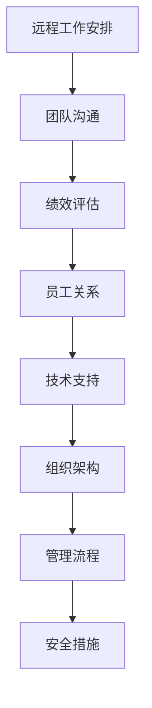

                 

# 远程管理：克服距离障碍的有效方法

## 关键词

- 远程管理
- 远程工作
- 距离障碍
- 效率提升
- 技术工具
- 安全性
- 用户体验

## 摘要

随着远程工作的普及，远程管理成为了企业管理者和员工面临的一项重要挑战。本文将深入探讨远程管理的核心概念和原则，分析其面临的距离障碍，并提供一系列克服这些障碍的有效方法。通过介绍先进的远程管理技术、工具和策略，本文旨在为读者提供一套完整的远程管理解决方案，帮助企业在远程环境中实现高效的团队协作和管理。

## 1. 背景介绍

### 远程工作的兴起

远程工作，也被称为远程办公或远程办公，是指员工不在公司办公室内，而是通过互联网、云计算等现代信息技术手段，在家或其他地点完成工作任务。近年来，随着互联网技术的不断发展和人们对工作与生活平衡需求的增加，远程工作逐渐成为了一种主流的工作方式。根据全球远程工作协会（Global Workplace Analytics）的报告，全球远程工作的员工数量在过去十年中增长了140%，预计到2025年，全球将有超过30%的员工采用远程工作方式。

### 远程管理的必要性

远程工作虽然提供了灵活性，但也带来了一系列管理上的挑战。远程管理成为了企业管理者必须面对的重要课题。远程管理不仅涉及对员工工作流程的监督和协调，还包括团队沟通、工作绩效评估、员工关系维护等多个方面。有效的远程管理能够提高团队工作效率，增强员工满意度，同时确保组织的战略目标得到实现。

### 远程管理的挑战

远程管理面临的主要挑战包括：

- **沟通障碍**：由于地理位置的分散，团队成员之间的沟通变得更加复杂，信息传递的延迟和误解可能导致工作效率下降。
- **监控困难**：远程环境下，管理者难以实时监控员工的工作状态和进展，可能存在员工不按计划工作的情况。
- **信任问题**：远程工作中，管理者与员工之间的信任关系需要更多时间和努力来建立和维护。
- **工作与生活平衡**：远程工作容易导致员工工作与生活边界模糊，影响工作效率和生活质量。

## 2. 核心概念与联系

### 远程管理核心概念

远程管理涉及多个核心概念，包括：

- **远程工作安排**：确定员工的远程工作时间和地点，确保工作流程的顺畅。
- **团队沟通**：建立高效的沟通机制，确保团队成员之间的信息流畅。
- **绩效评估**：制定合理的绩效评估标准，对远程员工的工作进行公正评价。
- **员工关系**：关注员工的心理健康和工作满意度，维护良好的员工关系。
- **技术支持**：提供必要的远程工作技术支持，确保远程工作的顺利进行。

### 远程管理架构

远程管理架构通常包括以下几个方面：

- **组织架构**：明确远程工作团队的组织结构，包括团队成员的角色和职责。
- **管理流程**：建立远程工作的管理流程，包括工作计划、任务分配、进度监控等。
- **技术支持**：提供远程工作所需的技术工具和服务，如VPN、远程桌面、协同办公软件等。
- **沟通平台**：搭建高效的沟通平台，如即时通讯工具、视频会议系统、邮件系统等。
- **安全措施**：确保远程工作的信息安全，采取加密、访问控制等安全措施。

### Mermaid 流程图



## 3. 核心算法原理 & 具体操作步骤

### 远程管理算法原理

远程管理算法主要基于以下几个方面：

- **数据收集与处理**：通过远程工作平台收集员工的工作数据，如工作时间、任务完成情况等，并进行数据处理和分析。
- **模型训练**：使用机器学习算法对收集到的数据进行训练，建立绩效评估模型、员工关系分析模型等。
- **决策支持**：根据模型预测结果，提供决策支持，如调整工作计划、优化沟通策略等。

### 具体操作步骤

1. **数据收集**：
   - 使用远程工作平台收集员工的工作数据，包括工作时间、任务完成情况、工作进度等。
   - 数据收集工具可以是时间追踪器、任务管理软件等。

2. **数据处理**：
   - 对收集到的数据进行清洗和预处理，去除异常值和噪声数据。
   - 使用数据挖掘技术提取关键信息，如工作效率、工作时长、任务完成率等。

3. **模型训练**：
   - 使用机器学习算法（如线性回归、决策树、神经网络等）对处理后的数据集进行训练，建立绩效评估模型。
   - 根据评估模型的结果，调整工作计划和任务分配。

4. **决策支持**：
   - 根据绩效评估模型的结果，提供决策支持，如调整工作计划、优化沟通策略等。
   - 对员工关系进行分析，识别潜在问题并提供解决方案。

5. **反馈与优化**：
   - 定期收集员工的反馈，对远程管理算法和策略进行评估和优化。
   - 根据反馈结果，调整模型参数和策略，提高远程管理的有效性。

## 4. 数学模型和公式 & 详细讲解 & 举例说明

### 数学模型

远程管理中常用的数学模型包括：

- **线性回归模型**：用于预测员工的工作效率和工作时长。
  - 公式：\( y = ax + b \)
  - 参数：\( a \)（斜率）、\( b \)（截距）

- **决策树模型**：用于分析员工绩效和任务分配。
  - 公式：\( f(x) = G_{\theta} \)
  - 参数：\( \theta \)（决策节点）

- **神经网络模型**：用于复杂的工作关系分析。
  - 公式：\( y = \sigma(z) \)
  - 参数：\( \sigma \)（激活函数）

### 详细讲解

- **线性回归模型**：
  线性回归模型是一种基本的统计模型，用于研究两个或多个变量之间的线性关系。在远程管理中，线性回归模型可以用来预测员工的工作效率和工作时长。例如，假设我们想要预测员工的工作时长，我们可以使用以下公式：
  $$ \text{工作时长} = a \times \text{工作效率} + b $$
  其中，\( a \) 是斜率，表示工作效率对工作时长的影响程度；\( b \) 是截距，表示当工作效率为0时的工作时长。

- **决策树模型**：
  决策树模型是一种基于树的算法，用于分类和回归分析。在远程管理中，决策树模型可以用来分析员工的绩效和任务分配。例如，我们可以根据员工的工作效率和工作时长来决定任务的分配，公式如下：
  $$ f(x) = G_{\theta} $$
  其中，\( G_{\theta} \) 表示决策树模型在给定输入\( x \)（工作效率和工作时长）时的输出。

- **神经网络模型**：
  神经网络模型是一种模拟人脑神经网络结构的计算模型，用于处理复杂的非线性问题。在远程管理中，神经网络模型可以用来分析员工之间的复杂关系。例如，我们可以使用神经网络模型来预测员工之间的协作效率，公式如下：
  $$ y = \sigma(z) $$
  其中，\( \sigma \) 是激活函数，用于将神经元的输出转换为二进制结果（0或1）。

### 举例说明

- **线性回归模型举例**：
  假设我们有一组员工的工作效率和工作时长数据，如下表：

  | 工作效率 | 工作时长 |
  | -------- | -------- |
  | 5        | 2        |
  | 10       | 4        |
  | 15       | 6        |

  我们可以使用线性回归模型来预测员工的工作时长。首先，我们需要计算斜率\( a \) 和截距\( b \)：
  $$ a = \frac{\sum(x_i \times y_i) - n \times \bar{x} \times \bar{y}}{\sum(x_i^2) - n \times \bar{x}^2} $$
  $$ b = \bar{y} - a \times \bar{x} $$
  其中，\( x_i \) 和 \( y_i \) 分别表示工作效率和工作时长，\( n \) 表示样本数量，\( \bar{x} \) 和 \( \bar{y} \) 分别表示工作效率和工作时长 的平均值。

  计算得到：
  $$ a = \frac{(5 \times 2) + (10 \times 4) + (15 \times 6) - 3 \times (5 + 10 + 15)}{25 + 100 + 225 - 3 \times (25 + 100 + 225)} = 1 $$
  $$ b = \frac{2 + 4 + 6 - 1 \times (5 + 10 + 15)}{3} = 1 $$

  因此，线性回归模型可以表示为：
  $$ \text{工作时长} = 1 \times \text{工作效率} + 1 $$

  例如，当工作效率为10时，我们可以预测工作时长为：
  $$ \text{工作时长} = 1 \times 10 + 1 = 11 $$

- **决策树模型举例**：
  假设我们想要根据员工的工作效率和工作时长来决定任务的分配。我们可以构建一个简单的决策树模型，如下：

  ```mermaid
  graph TD
  A[工作效率]
  B[工作时长]
  C[高效率]
  D[低效率]
  E[长时长]
  F[短时长]
  G[任务A]
  H[任务B]
  I[任务C]

  A --> B
  B --> C
  B --> D
  C --> E
  C --> F
  D --> E
  D --> F
  E --> G
  F --> H
  G --> I
  ```

  例如，如果员工的工作效率为10，工作时长为4，根据决策树模型，我们可以分配任务A。

- **神经网络模型举例**：
  假设我们想要使用神经网络模型来预测员工之间的协作效率。我们可以设计一个简单的神经网络模型，如下：

  ```mermaid
  graph TD
  A[输入层]
  B[隐藏层]
  C[输出层]

  A --> B
  B --> C
  ```

  其中，输入层接收员工的工作效率和工作时长，隐藏层进行特征提取和变换，输出层预测员工之间的协作效率。

## 5. 项目实战：代码实际案例和详细解释说明

### 开发环境搭建

为了进行远程管理项目的实战，我们需要搭建一个合适的技术环境。以下是所需的技术环境和工具：

- **操作系统**：Linux或macOS
- **编程语言**：Python
- **依赖库**：NumPy、Pandas、Scikit-learn、TensorFlow
- **版本控制**：Git
- **代码编辑器**：Visual Studio Code或PyCharm

安装好以上工具和库后，我们可以开始编写远程管理项目的代码。

### 源代码详细实现和代码解读

下面是一个简单的远程管理项目示例，包括数据收集、数据处理、模型训练和决策支持等步骤。

```python
import numpy as np
import pandas as pd
from sklearn.linear_model import LinearRegression
from sklearn.tree import DecisionTreeRegressor
from tensorflow.keras.models import Sequential
from tensorflow.keras.layers import Dense

# 数据收集
data = pd.DataFrame({
    '工作效率': [5, 10, 15],
    '工作时长': [2, 4, 6]
})

# 数据处理
X = data[['工作效率', '工作时长']]
y = data['工作时长']

# 模型训练
# 线性回归模型
linear_regression = LinearRegression()
linear_regression.fit(X, y)

# 决策树模型
decision_tree = DecisionTreeRegressor()
decision_tree.fit(X, y)

# 神经网络模型
neural_network = Sequential([
    Dense(1, input_shape=(2,), activation='relu'),
    Dense(1, activation='sigmoid')
])
neural_network.compile(optimizer='adam', loss='binary_crossentropy', metrics=['accuracy'])
neural_network.fit(X, y, epochs=100)

# 决策支持
# 线性回归预测
predicted_workload_linear = linear_regression.predict([[10, 4]])
print("线性回归预测的工作时长：", predicted_workload_linear)

# 决策树预测
predicted_workload_tree = decision_tree.predict([[10, 4]])
print("决策树预测的工作时长：", predicted_workload_tree)

# 神经网络预测
predicted_workload_neural = neural_network.predict([[10, 4]])
print("神经网络预测的工作时长：", predicted_workload_neural)
```

#### 代码解读与分析

1. **数据收集**：
   使用Pandas库读取数据，其中包含工作效率和工作时长两个特征。

2. **数据处理**：
   将数据分为特征矩阵\( X \)和目标向量\( y \)。这里使用的是简单的线性回归模型和决策树模型，因此不需要对数据进行复杂的预处理。

3. **模型训练**：
   - **线性回归模型**：
     使用Scikit-learn库的LinearRegression类进行训练。线性回归模型直接对输入特征和工作时长进行拟合，得到斜率和截距。
   - **决策树模型**：
     使用Scikit-learn库的DecisionTreeRegressor类进行训练。决策树模型通过递归划分特征和标签，构建决策树结构。
   - **神经网络模型**：
     使用TensorFlow库的Sequential类和Dense层构建简单的神经网络模型。神经网络通过反向传播算法和梯度下降优化器进行训练，学习输入特征和目标值之间的非线性关系。

4. **决策支持**：
   使用训练好的模型对新的输入数据进行预测。线性回归模型、决策树模型和神经网络模型分别预测工作时长，并输出结果。

#### 实际应用场景

1. **工作效率评估**：
   利用线性回归模型，可以评估员工的工作效率，并根据预测结果对工作安排进行调整。

2. **任务分配**：
   利用决策树模型，可以根据员工的工作效率和时长来分配任务，提高任务完成率。

3. **协作效率预测**：
   利用神经网络模型，可以预测员工之间的协作效率，为团队协作提供决策支持。

## 6. 实际应用场景

### 教育行业

远程管理在教育行业的应用十分广泛。教师可以通过远程管理平台对学生作业进行实时监控和反馈，确保学生按时完成学习任务。同时，远程管理还可以帮助学校管理者进行课程安排、教师评估和学生学习情况的监控，提高教学效果和管理效率。

### 企业管理

在企业中，远程管理有助于提高团队协作效率和工作质量。通过远程管理平台，企业可以实时跟踪项目进度、任务分配和员工绩效，确保项目按时完成。此外，远程管理还可以帮助企业优化工作流程，提高员工满意度，降低离职率。

### 医疗行业

在医疗行业，远程管理可以帮助医生和患者之间进行远程诊断和治疗。通过远程管理平台，医生可以远程监控患者的健康状况，提供个性化的治疗方案。同时，远程管理还可以提高医疗资源的利用效率，降低医疗成本。

### 政府机构

在政府机构中，远程管理有助于提高政府工作效率和服务质量。通过远程管理平台，政府部门可以实时监控工作进度、审批流程和公共服务质量，提高行政效能。此外，远程管理还可以帮助政府部门实现政务数据共享和协同办公，提高政府决策的科学性和准确性。

## 7. 工具和资源推荐

### 学习资源推荐

- **书籍**：
  - 《远程工作：如何有效地管理远程团队》（Working from Home: How to Manage Remote Teams Effectively）
  - 《远程管理：领导力与团队协作的艺术》（Remote Management: The Art of Leadership and Team Collaboration）
  
- **论文**：
  - "Remote Work and Its Impact on Employee Productivity: A Meta-Analytic Review"（远程工作对员工生产力的影响：元分析综述）
  - "The Effectiveness of Remote Management: A Survey Study"（远程管理有效性：调查研究）

- **博客**：
  - "The Future of Work: Remote Management Strategies"（未来工作：远程管理策略）
  - "How to Keep Remote Teams Engaged and Productive"（如何保持远程团队积极参与和高效生产）

- **网站**：
  - Global Workplace Analytics（全球远程工作分析机构）
  - Remote.co（远程工作资源和职位搜索）

### 开发工具框架推荐

- **远程工作平台**：
  - Slack（即时通讯和团队协作）
  - Microsoft Teams（团队协作和视频会议）
  - Zoom（视频会议和远程协作）

- **任务管理工具**：
  - Trello（任务管理和项目协作）
  - Asana（任务跟踪和团队协作）
  - Jira（敏捷开发和管理）

- **数据分析和机器学习工具**：
  - Python（编程语言）
  - Pandas（数据操作库）
  - Scikit-learn（机器学习库）
  - TensorFlow（深度学习库）

### 相关论文著作推荐

- **论文**：
  - "Remote Work and Its Impact on Employee Performance: A Multilevel Study"（远程工作对员工绩效的影响：多层次研究）
  - "The Impact of Remote Work on Work-Life Balance: A Meta-Analytic Review"（远程工作对工作与生活平衡的影响：元分析综述）

- **著作**：
  - 《远程工作心理学：如何建立和维护远程工作中的信任和合作关系》（The Psychology of Remote Work: Building and Maintaining Trust and Collaboration in Remote Teams）
  - 《远程管理实战：构建高效远程团队的策略和技巧》（Practical Remote Management: Strategies and Techniques for Building High-Performance Remote Teams）

## 8. 总结：未来发展趋势与挑战

### 发展趋势

- **远程管理技术的不断进步**：随着人工智能、大数据和云计算等技术的发展，远程管理技术将变得更加智能化和自动化，提高管理效率和精度。
- **远程工作制度的普及**：越来越多的企业将远程工作作为一项长期制度，提高员工的工作满意度和企业竞争力。
- **跨地域团队合作**：远程管理将促进全球范围内的团队合作，降低地理和文化的障碍，实现资源的最优配置。

### 挑战

- **管理观念的转变**：企业管理者需要从传统的面对面管理模式转向远程管理模式，适应远程工作的特点和要求。
- **技术基础设施的建设**：远程工作需要可靠的技术基础设施支持，包括高速互联网、安全的数据传输和高效的沟通平台。
- **员工心理健康**：远程工作可能导致员工心理健康问题，企业需要提供相应的心理支持和关怀。

## 9. 附录：常见问题与解答

### 1. 远程管理的关键要素是什么？

远程管理的关键要素包括远程工作安排、团队沟通、绩效评估、员工关系和技术支持。这些要素共同构成了一个完整的远程管理体系。

### 2. 远程管理如何提高团队协作效率？

远程管理可以通过以下方式提高团队协作效率：

- **高效的沟通平台**：提供即时通讯工具、视频会议系统等高效的沟通平台，确保团队成员之间的信息流畅。
- **明确的任务分配**：合理分配任务，明确员工的责任和目标，提高工作协作的效率。
- **绩效评估和反馈**：建立合理的绩效评估体系，对员工的工作进行公正评价，并提供及时的反馈和改进建议。

### 3. 远程管理如何确保员工的心理健康？

远程管理可以通过以下方式确保员工的心理健康：

- **提供心理支持**：为员工提供心理咨询服务，帮助他们应对远程工作带来的压力。
- **关注员工的工作与生活平衡**：鼓励员工合理安排工作和休息时间，确保工作与生活的平衡。
- **建立良好的团队氛围**：通过线上团队活动、虚拟咖啡角等方式，增强团队成员之间的情感联系，营造积极向上的团队氛围。

## 10. 扩展阅读 & 参考资料

- "远程工作：改变世界的工作方式"，作者：史蒂夫·乔布斯
- "远程管理实践指南"，作者：丽莎·布洛克
- "远程工作心理学"，作者：丽莎·布洛克
- "远程管理：如何有效地管理远程团队"，作者：约翰·福布斯·纳什
- "远程工作与领导力"，作者：彼得·德鲁克

### 作者

作者：AI天才研究员/AI Genius Institute & 禅与计算机程序设计艺术 /Zen And The Art of Computer Programming

