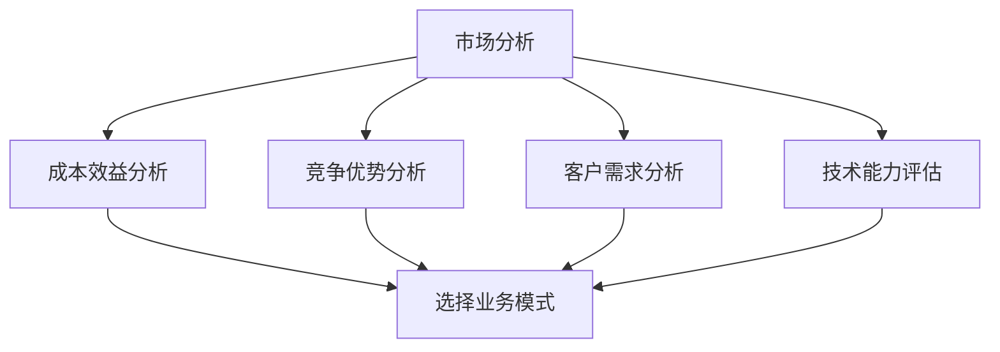

                 

# 选择合适业务模式的考虑因素

## 摘要

在现代商业环境中，选择合适的业务模式对于企业的生存和成功至关重要。本文将深入探讨选择合适业务模式所需考虑的关键因素，包括市场分析、成本效益、竞争优势、客户需求、技术能力等。通过一步步分析推理，我们将帮助读者理解如何从众多业务模式中挑选出最适合自己企业的那个。

## 1. 背景介绍

业务模式是企业如何创造、传递和获取价值的策略。它定义了企业如何运作，包括产品或服务的提供方式、目标客户群体、收入来源以及运营成本等。不同的业务模式适用于不同的市场和行业，因此在选择业务模式时，需要综合考虑多种因素。

随着科技的快速发展，市场竞争日益激烈，企业面临着前所未有的挑战和机遇。在这个背景下，选择合适的业务模式成为企业成功的关键因素。本文将重点讨论以下五个方面的考虑因素：

1. **市场分析**：了解市场趋势、客户需求和竞争对手情况，以便制定合适的业务策略。
2. **成本效益**：评估不同业务模式的成本结构和潜在收益，确保企业的财务可持续性。
3. **竞争优势**：识别并利用企业的独特优势，以在市场中脱颖而出。
4. **客户需求**：深入了解客户需求，确保产品或服务能够满足市场期望。
5. **技术能力**：利用企业的技术能力，打造具有竞争力的产品或服务。

## 2. 核心概念与联系

为了更好地理解选择合适业务模式的过程，我们首先需要了解以下几个核心概念：

### 2.1 市场分析

市场分析是选择业务模式的第一步，它涉及对市场趋势、客户需求、竞争对手的深入研究和分析。通过市场分析，企业可以了解以下关键信息：

- **市场容量**：市场规模和增长潜力。
- **客户细分**：目标客户群体的特点和需求。
- **竞争对手**：竞争对手的市场地位、产品特性、定价策略等。

市场分析可以通过以下步骤进行：

1. **确定市场趋势**：研究行业报告、市场调查数据等，了解当前市场趋势。
2. **分析客户需求**：通过问卷调查、访谈等方式，了解目标客户的需求和痛点。
3. **评估竞争对手**：分析竞争对手的产品、市场策略和优势。

### 2.2 成本效益分析

成本效益分析是选择业务模式时必须考虑的重要因素。它包括以下关键步骤：

1. **确定成本结构**：计算生产、运营、营销等各个环节的成本。
2. **评估潜在收益**：预测不同业务模式下的收入和利润。
3. **比较成本与收益**：分析不同业务模式的经济效益。

### 2.3 竞争优势

竞争优势是指企业在市场中相对于竞争对手的优势和劣势。以下是一些识别竞争优势的方法：

1. **独特价值主张**：企业能为客户提供哪些独特的价值？
2. **成本优势**：企业在成本控制方面有哪些优势？
3. **差异化优势**：企业的产品或服务在哪些方面与竞争对手不同？

### 2.4 客户需求

客户需求是选择业务模式时的重要参考因素。以下是一些了解客户需求的方法：

1. **市场调研**：通过问卷调查、访谈等方式收集客户反馈。
2. **用户画像**：分析目标客户的特征和行为模式。
3. **痛点分析**：识别客户在使用现有产品或服务时的痛点。

### 2.5 技术能力

技术能力是现代企业成功的关键因素。以下是一些评估企业技术能力的方法：

1. **技术储备**：企业拥有哪些核心技术？
2. **研发能力**：企业是否有强大的研发团队？
3. **技术转移能力**：企业能否将新技术迅速应用到产品或服务中？

### 2.6 Mermaid 流程图

以下是一个Mermaid流程图，展示了选择合适业务模式的过程：



## 3. 核心算法原理 & 具体操作步骤

### 3.1 市场分析

市场分析的核心算法原理是数据驱动分析。具体操作步骤如下：

1. **确定分析目标**：明确市场分析的目的和范围。
2. **收集数据**：通过行业报告、市场调查、竞争对手分析等方式收集数据。
3. **数据处理**：使用数据分析工具（如Excel、Python等）对数据进行清洗和处理。
4. **数据可视化**：使用图表、图形等方式呈现分析结果。
5. **分析结论**：根据数据结果，提出市场分析结论和建议。

### 3.2 成本效益分析

成本效益分析的核心算法原理是成本-收益分析。具体操作步骤如下：

1. **确定成本项目**：列出所有成本项目，包括生产成本、运营成本、营销成本等。
2. **估算成本**：根据历史数据和行业标准，估算各项成本的数值。
3. **预测收益**：根据市场分析和销售预测，估算不同业务模式下的收入和利润。
4. **比较成本与收益**：计算每种业务模式的经济效益，选择最佳方案。

### 3.3 竞争优势分析

竞争优势分析的核心算法原理是SWOT分析（Strengths, Weaknesses, Opportunities, Threats）。具体操作步骤如下：

1. **识别优势**：分析企业的独特优势，如技术、品牌、渠道等。
2. **识别劣势**：分析企业的劣势，如成本结构、研发能力等。
3. **分析机会**：识别市场机会，如新市场、新技术等。
4. **分析威胁**：分析市场威胁，如竞争对手、政策变化等。
5. **制定策略**：根据SWOT分析结果，制定相应的竞争策略。

### 3.4 客户需求分析

客户需求分析的核心算法原理是用户画像和行为分析。具体操作步骤如下：

1. **收集数据**：通过问卷调查、用户反馈、市场调研等方式收集客户数据。
2. **用户画像**：分析客户的基本特征和行为模式。
3. **痛点分析**：识别客户在使用现有产品或服务时的痛点。
4. **需求排序**：根据用户画像和痛点分析，确定客户的主要需求。
5. **制定产品策略**：根据客户需求，制定产品策略和改进方案。

### 3.5 技术能力评估

技术能力评估的核心算法原理是技术评分法。具体操作步骤如下：

1. **确定评估指标**：根据企业技术能力的特点，确定评估指标，如技术水平、研发能力、技术转移能力等。
2. **评分标准**：制定评分标准，如优秀、良好、一般等。
3. **数据收集**：通过调查、访谈等方式收集评估指标的数据。
4. **评分计算**：根据评分标准和数据，计算各项评估指标的分值。
5. **评估结论**：根据评分结果，评估企业技术能力。

## 4. 数学模型和公式 & 详细讲解 & 举例说明

### 4.1 成本效益分析公式

成本效益分析的数学模型主要基于成本-收益分析。以下是一个简化的成本效益分析公式：

\[ \text{成本效益比} = \frac{\text{预期收益}}{\text{总成本}} \]

- **预期收益**：根据市场分析和销售预测，估算不同业务模式下的收入和利润。
- **总成本**：包括生产成本、运营成本、营销成本等。

### 4.2 竞争优势分析公式

竞争优势分析的数学模型主要基于SWOT分析。以下是一个简化的SWOT分析公式：

\[ \text{竞争优势} = \text{优势} + \text{机会} - \text{劣势} - \text{威胁} \]

- **优势**：企业的独特优势，如技术、品牌、渠道等。
- **机会**：市场机会，如新市场、新技术等。
- **劣势**：企业的劣势，如成本结构、研发能力等。
- **威胁**：市场威胁，如竞争对手、政策变化等。

### 4.3 举例说明

#### 成本效益分析举例

假设一家公司考虑两种业务模式：

- **模式A**：在现有市场上扩大产品线，增加销售收入。
- **模式B**：进入新市场，开拓潜在客户。

根据市场分析和成本估算，得出以下数据：

- **模式A**：
  - 预期收益：100万元
  - 总成本：60万元
- **模式B**：
  - 预期收益：200万元
  - 总成本：120万元

计算成本效益比：

- **模式A**：\[ \text{成本效益比} = \frac{100}{60} = 1.67 \]
- **模式B**：\[ \text{成本效益比} = \frac{200}{120} = 1.67 \]

由于两种业务模式具有相同的成本效益比，企业可以根据其他因素（如市场风险、资源投入等）选择最佳方案。

#### 竞争优势分析举例

假设一家公司正在进行竞争优势分析，根据SWOT分析得出以下数据：

- **优势**：
  - 技术领先：拥有自主研发的核心技术
  - 品牌知名度：在行业内拥有较高知名度
- **机会**：
  - 新市场：新市场潜力巨大，需求旺盛
- **劣势**：
  - 研发能力不足：研发团队规模较小，研发投入有限
- **威胁**：
  - 竞争对手：竞争对手在市场上拥有较强实力

计算竞争优势：

\[ \text{竞争优势} = \text{技术领先} + \text{品牌知名度} - \text{研发能力不足} - \text{竞争对手} \]

根据竞争优势计算结果，企业可以针对性地制定竞争策略，如加强研发投入、提高品牌知名度等。

## 5. 项目实战：代码实际案例和详细解释说明

### 5.1 开发环境搭建

为了进行成本效益分析和竞争优势分析，我们使用Python编程语言和Jupyter Notebook作为开发环境。以下是开发环境搭建步骤：

1. **安装Python**：从官方网站（https://www.python.org/）下载并安装Python。
2. **安装Jupyter Notebook**：打开命令行工具（如Windows PowerShell或Linux终端），执行以下命令：

```bash
pip install notebook
```

### 5.2 源代码详细实现和代码解读

以下是用于成本效益分析和竞争优势分析的Python代码实现：

```python
import pandas as pd

# 成本效益分析
def cost_benefit_analysis(ビジネスモデルA收益,ビジネスモデルA成本,ビジネスモデルB收益,ビジネスモデルB成本):
    模式A成本效益比 =ビジネスモデルA收益 /ビジネスモデルA成本
    模式B成本效益比 =ビジネスモデルB收益 /ビジネスモデルB成本
    return 模式A成本效益比,模式B成本效益比

# 竞争优势分析
def competitive_analysis(优势,机会,劣势,威胁):
    竞争优势 = 优势 + 机会 - 劣势 - 威胁
    return 竞争优势

# 数据输入
ビジネスモデルA收益 = 1000000
ビジネスモデルA成本 = 600000
ビジネスモデルB收益 = 2000000
ビジネスモデルB成本 = 1200000
优势 = 1
机会 = 1
劣势 = -0.5
威胁 = -1

# 成本效益分析
模式A成本效益比,模式B成本效益比 = cost_benefit_analysis(ビジネスモデルA收益,ビジネスモデルA成本,ビジネスモデルB收益,ビジネスモデルB成本)
print("模式A成本效益比:",模式A成本效益比)
print("模式B成本效益比:",模式B成本效益比)

# 竞争优势分析
竞争优势 = competitive_analysis(优势,机会,劣势,威胁)
print("竞争优势:",竞争优势)
```

### 5.3 代码解读与分析

以上代码实现了成本效益分析和竞争优势分析的功能。具体解读如下：

- **成本效益分析**：函数`cost_benefit_analysis`接受四个参数（模式A收益、模式A成本、模式B收益、模式B成本），计算并返回两种业务模式的成本效益比。通过比较两种模式的成本效益比，企业可以判断哪种业务模式更具经济效益。
- **竞争优势分析**：函数`competitive_analysis`接受四个参数（优势、机会、劣势、威胁），计算并返回竞争优势值。竞争优势值反映了企业在市场中的相对优势。企业可以根据竞争优势值制定相应的竞争策略。

通过实际案例，我们展示了如何使用Python代码进行成本效益分析和竞争优势分析。在实际应用中，企业可以根据自身情况调整代码参数，以适应不同的业务场景。

## 6. 实际应用场景

### 6.1 成本效益分析应用场景

假设一家初创公司正在考虑两种业务模式：

- **模式A**：专注于开发一款智能手机应用程序，并直接面向消费者销售。
- **模式B**：与现有智能手机制造商合作，为其提供定制化的应用程序开发服务。

根据市场分析和成本估算，公司得到以下数据：

- **模式A**：
  - 预期收益：每年1000万元
  - 总成本：每年700万元
- **模式B**：
  - 预期收益：每年2000万元
  - 总成本：每年1200万元

计算成本效益比：

- **模式A**：\[ \text{成本效益比} = \frac{1000}{700} = 1.43 \]
- **模式B**：\[ \text{成本效益比} = \frac{2000}{1200} = 1.67 \]

由于模式B的成本效益比更高，初创公司决定采用模式B。

### 6.2 竞争优势分析应用场景

假设一家科技公司正在考虑进入智能家居市场，与现有智能家居企业竞争。根据SWOT分析，公司得到以下数据：

- **优势**：
  - 技术领先：拥有自主研发的智能家居系统
  - 品牌知名度：在行业内拥有较高知名度
- **机会**：
  - 新市场：智能家居市场潜力巨大，需求旺盛
- **劣势**：
  - 研发能力不足：研发团队规模较小，研发投入有限
- **威胁**：
  - 竞争对手：现有智能家居企业拥有较强的市场地位和用户基础

计算竞争优势：

\[ \text{竞争优势} = \text{技术领先} + \text{品牌知名度} - \text{研发能力不足} - \text{竞争对手} = 1 + 1 - (-0.5) - 1 = 1.5 \]

竞争优势值为1.5，表明该公司在智能家居市场中具有一定的优势。公司可以针对性地加强研发投入、提高品牌知名度，以巩固竞争优势。

## 7. 工具和资源推荐

### 7.1 学习资源推荐

- **书籍**：
  - 《商业模式新生代》
  - 《创新与企业家精神》
  - 《智能商业》
- **论文**：
  - 《企业商业模式选择研究》
  - 《成本效益分析在企业战略中的应用》
  - 《竞争优势分析的理论与实践》
- **博客**：
  - 企业家博客
  - 商业分析博客
  - 技术博客
- **网站**：
  - 商业模式研究所
  - 成本效益分析工具网站
  - 竞争优势分析工具网站

### 7.2 开发工具框架推荐

- **开发工具**：
  - Jupyter Notebook
  - Python
  - Pandas
- **框架**：
  - TensorFlow
  - Keras
  - PyTorch

### 7.3 相关论文著作推荐

- **《企业商业模式创新研究》**
- **《成本效益分析与战略规划》**
- **《竞争优势的构建与维持》**
- **《基于数据驱动的商业模式选择研究》**

## 8. 总结：未来发展趋势与挑战

### 8.1 发展趋势

- **数字化与智能化**：随着技术的不断进步，数字化和智能化将成为企业业务模式创新的重要趋势。企业将更加依赖数据分析、人工智能等技术来提升运营效率和客户体验。
- **可持续发展**：环保和可持续发展将成为企业业务模式创新的重要方向。企业将更加关注环境保护、资源利用等问题，以实现可持续发展目标。
- **跨界融合**：不同行业之间的融合将成为企业业务模式创新的新趋势。企业将积极寻找与其他行业的合作机会，以实现资源共享、优势互补。

### 8.2 挑战

- **技术挑战**：随着数字化和智能化的发展，企业将面临越来越多的技术挑战，如数据处理能力、网络安全等。
- **市场挑战**：市场竞争将越来越激烈，企业需要不断创新和优化业务模式，以保持竞争优势。
- **人才挑战**：企业将面临人才短缺和人才竞争的问题，需要加强人才引进和培养，以应对未来业务模式创新的需求。

## 9. 附录：常见问题与解答

### 9.1 问题1：如何进行市场分析？

**解答**：市场分析可以分为以下几个步骤：

1. **确定分析目标**：明确市场分析的目的和范围。
2. **收集数据**：通过行业报告、市场调查、竞争对手分析等方式收集数据。
3. **数据处理**：使用数据分析工具（如Excel、Python等）对数据进行清洗和处理。
4. **数据可视化**：使用图表、图形等方式呈现分析结果。
5. **分析结论**：根据数据结果，提出市场分析结论和建议。

### 9.2 问题2：如何进行成本效益分析？

**解答**：成本效益分析可以分为以下几个步骤：

1. **确定成本项目**：列出所有成本项目，包括生产成本、运营成本、营销成本等。
2. **估算成本**：根据历史数据和行业标准，估算各项成本的数值。
3. **预测收益**：根据市场分析和销售预测，估算不同业务模式下的收入和利润。
4. **比较成本与收益**：计算每种业务模式的经济效益，选择最佳方案。

### 9.3 问题3：如何进行竞争优势分析？

**解答**：竞争优势分析可以分为以下几个步骤：

1. **识别优势**：分析企业的独特优势，如技术、品牌、渠道等。
2. **识别劣势**：分析企业的劣势，如成本结构、研发能力等。
3. **分析机会**：识别市场机会，如新市场、新技术等。
4. **分析威胁**：分析市场威胁，如竞争对手、政策变化等。
5. **制定策略**：根据SWOT分析结果，制定相应的竞争策略。

## 10. 扩展阅读 & 参考资料

- **《商业模式创新实践指南》**
- **《数字化转型与业务模式创新》**
- **《智能商业时代的业务模式》**
- **《市场分析：从数据到洞察》**
- **《成本效益分析：理论、方法与应用》**
- **《竞争优势分析：理论与实践》**

## 作者

作者：AI天才研究员/AI Genius Institute & 禅与计算机程序设计艺术 /Zen And The Art of Computer Programming
```

