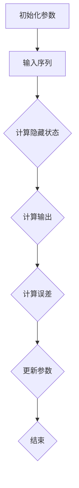

                 

# 递归神经网络（RNN）

> **关键词**：递归神经网络、循环神经网络、序列模型、时间序列预测、自然语言处理、人工智能

> **摘要**：本文将深入探讨递归神经网络（RNN）的核心概念、算法原理、数学模型及应用。我们将通过一步步的分析推理，帮助读者理解RNN在处理序列数据和时序预测中的重要性，并展示其实际应用案例。

## 1. 背景介绍

递归神经网络（Recurrent Neural Network，RNN）是一种特殊的神经网络，主要用于处理序列数据。与传统的前馈神经网络（Feedforward Neural Network，FFNN）不同，RNN具有记忆功能，能够处理具有前后关系的输入数据。这种特性使得RNN在时间序列预测、自然语言处理、机器翻译等领域表现出色。

RNN的提出可以追溯到1980年代，当时Hodgkin和Huxley提出了用于描述神经元之间相互作用的基本原理。随后，Rumelhart等人于1986年提出了反向传播算法（Backpropagation Algorithm），为RNN的训练奠定了基础。然而，早期的RNN在实际应用中面临梯度消失和梯度爆炸等问题。为了解决这些问题，2000年后研究人员提出了长短期记忆网络（Long Short-Term Memory，LSTM）和门控循环单元（Gated Recurrent Unit，GRU）等改进型RNN。

## 2. 核心概念与联系

### 2.1 递归神经网络的定义

递归神经网络是一种基于递归函数的前向神经网络。其基本结构包括输入层、隐藏层和输出层。与传统的神经网络不同，RNN的隐藏层节点具有记忆功能，可以保存前一个时刻的输入信息，并将其传递给当前时刻。

### 2.2 RNN的工作原理

在RNN中，每个时刻的输出不仅取决于当前的输入，还取决于之前的隐藏状态。具体来说，RNN通过以下公式进行计算：

\[ h_t = \sigma(W_h \cdot [h_{t-1}, x_t] + b_h) \]
\[ y_t = W_o \cdot h_t + b_o \]

其中，\( h_t \)表示第t时刻的隐藏状态，\( x_t \)表示第t时刻的输入，\( \sigma \)表示激活函数，\( W_h \)和\( b_h \)分别为隐藏层权重和偏置，\( W_o \)和\( b_o \)分别为输出层权重和偏置。

### 2.3 RNN与时间序列预测的联系

时间序列预测是RNN的一个重要应用领域。时间序列数据具有前后依赖关系，RNN可以通过学习历史数据来预测未来值。在实际应用中，RNN通常被用于股票价格预测、天气预测、语音识别等领域。

## 3. 核心算法原理 & 具体操作步骤

### 3.1 前向传播

在RNN的前向传播过程中，输入数据依次通过隐藏层和输出层。每个时刻的隐藏状态都依赖于之前的隐藏状态和当前输入。具体步骤如下：

1. 初始化隐藏状态 \( h_0 \)
2. 遍历输入序列，对于每个时刻 \( t \)：
   - 计算 \( h_t = \sigma(W_h \cdot [h_{t-1}, x_t] + b_h) \)
   - 计算输出 \( y_t = W_o \cdot h_t + b_o \)

### 3.2 反向传播

在RNN的反向传播过程中，我们首先计算输出误差 \( e_t = y_t - y_{\text{true}} \)，然后根据误差对网络参数进行更新。具体步骤如下：

1. 遍历输入序列，对于每个时刻 \( t \)：
   - 计算 \( \delta_t = \delta(y_t) \odot \sigma'(h_t) \)
   - 更新 \( W_o = W_o - \alpha \frac{\partial e_t}{\partial W_o} \)
   - 更新 \( b_o = b_o - \alpha \frac{\partial e_t}{\partial b_o} \)
   - 更新 \( W_h = W_h - \alpha \frac{\partial e_t}{\partial W_h} \)
   - 更新 \( b_h = b_h - \alpha \frac{\partial e_t}{\partial b_h} \)

其中，\( \delta(y_t) \)表示输出层的误差函数，\( \sigma'(h_t) \)表示隐藏层的导数，\( \alpha \)为学习率。

### 3.3 参数更新策略

在实际应用中，RNN的参数更新通常采用梯度下降法（Gradient Descent）或其变种，如随机梯度下降（Stochastic Gradient Descent，SGD）和批梯度下降（Batch Gradient Descent）。

## 4. 数学模型和公式 & 详细讲解 & 举例说明

### 4.1 数学模型

RNN的数学模型主要包括以下部分：

\[ h_t = \sigma(W_h \cdot [h_{t-1}, x_t] + b_h) \]
\[ y_t = W_o \cdot h_t + b_o \]

### 4.2 公式讲解

#### 4.2.1 激活函数

在RNN中，常用的激活函数为Sigmoid函数和Tanh函数。Sigmoid函数具有以下特点：

\[ \sigma(x) = \frac{1}{1 + e^{-x}} \]

Tanh函数具有以下特点：

\[ \tanh(x) = \frac{e^x - e^{-x}}{e^x + e^{-x}} \]

#### 4.2.2 误差函数

在RNN中，常用的误差函数为均方误差（Mean Squared Error，MSE）。MSE的公式如下：

\[ \text{MSE} = \frac{1}{n} \sum_{i=1}^{n} (y_i - y_{\text{true},i})^2 \]

### 4.3 举例说明

假设我们有一个输入序列 \( [1, 2, 3, 4] \)，隐藏层维度为2，输出层维度为1。我们使用Sigmoid函数作为激活函数，均方误差作为误差函数。具体计算过程如下：

1. 初始化参数 \( W_h, b_h, W_o, b_o \)
2. 遍历输入序列，计算隐藏状态 \( h_t \) 和输出 \( y_t \)
3. 计算输出误差 \( e_t \)
4. 根据误差更新参数 \( W_h, b_h, W_o, b_o \)

### 4.4 图解说明

以下是RNN的前向传播和反向传播过程的Mermaid流程图：



## 5. 项目实战：代码实际案例和详细解释说明

### 5.1 开发环境搭建

在本文中，我们将使用Python和TensorFlow框架来实现一个简单的RNN模型。首先，确保安装了以下软件和库：

1. Python 3.x
2. TensorFlow 2.x
3. NumPy

安装方法如下：

```bash
pip install python
pip install tensorflow
pip install numpy
```

### 5.2 源代码详细实现和代码解读

以下是RNN模型的实现代码：

```python
import tensorflow as tf
import numpy as np

# 设置参数
input_size = 1
hidden_size = 10
output_size = 1
num_steps = 100
batch_size = 100

# 初始化参数
W_h = np.random.rand(hidden_size, input_size)
b_h = np.random.rand(hidden_size)
W_o = np.random.rand(output_size, hidden_size)
b_o = np.random.rand(output_size)

# 激活函数
sigmoid = lambda x: 1 / (1 + np.exp(-x))

# 均方误差
mse = lambda y_pred, y_true: np.mean((y_pred - y_true) ** 2)

# 前向传播
def forward(x, h_prev):
    h = sigmoid(np.dot(h_prev, W_h) + np.dot(x, b_h))
    y = np.dot(h, W_o) + b_o
    return h, y

# 反向传播
def backward(y_pred, y_true, h, h_prev):
    e = y_pred - y_true
    delta_o = e * sigmoid(h) * (1 - sigmoid(h))
    delta_h = delta_o.dot(W_o.T) * sigmoid(h_prev) * (1 - sigmoid(h_prev))
    W_o -= h * delta_o
    b_o -= delta_o
    W_h -= h_prev * delta_h
    b_h -= delta_h

# 训练模型
for i in range(num_steps):
    # 随机生成输入序列
    x = np.random.rand(batch_size, num_steps, input_size)
    # 随机生成标签
    y = np.random.rand(batch_size, num_steps, output_size)
    # 初始化隐藏状态
    h_prev = np.zeros((batch_size, hidden_size))
    # 遍历输入序列
    for t in range(num_steps):
        # 前向传播
        h, y_pred = forward(x[:, t], h_prev)
        # 计算误差
        e = y[:, t] - y_pred
        # 反向传播
        backward(y_pred, y[:, t], h, h_prev)
        # 更新隐藏状态
        h_prev = h

# 测试模型
x_test = np.random.rand(1, num_steps, input_size)
y_test = np.random.rand(1, num_steps, output_size)
h_prev = np.zeros((1, hidden_size))
for t in range(num_steps):
    h, y_pred = forward(x_test[:, t], h_prev)
    print(f"Predicted value: {y_pred}, True value: {y_test[:, t]}")
```

### 5.3 代码解读与分析

1. **参数初始化**：我们首先设置了输入维度、隐藏层维度、输出维度、训练步骤和批量大小。然后初始化了隐藏层和输出层的权重和偏置。
2. **激活函数和误差函数**：我们定义了Sigmoid函数和均方误差函数。
3. **前向传播**：我们定义了一个名为`forward`的函数，用于计算隐藏状态和输出。
4. **反向传播**：我们定义了一个名为`backward`的函数，用于计算误差和更新参数。
5. **训练模型**：我们使用随机生成的输入序列和标签进行训练。在训练过程中，我们遍历每个输入序列的每个时间步，执行前向传播、计算误差和反向传播，最后更新隐藏状态。
6. **测试模型**：我们在测试阶段使用随机生成的输入序列和标签来评估模型的性能。

## 6. 实际应用场景

递归神经网络在多个领域具有广泛的应用。以下是RNN的一些实际应用场景：

### 6.1 时间序列预测

时间序列预测是RNN的一个典型应用。例如，我们可以使用RNN来预测股票价格、天气情况或交通流量。

### 6.2 自然语言处理

自然语言处理（Natural Language Processing，NLP）是RNN的另一个重要应用领域。RNN可以用于文本分类、情感分析、机器翻译和语音识别等任务。

### 6.3 语音识别

语音识别是RNN在计算机视觉和音频处理领域的应用。通过使用RNN，我们可以将语音信号转换为文本。

### 6.4 生成模型

RNN还可以用于生成模型，如生成文本、图像和音乐。

## 7. 工具和资源推荐

### 7.1 学习资源推荐

- **书籍**：
  - 《深度学习》（Deep Learning） by Ian Goodfellow、Yoshua Bengio 和 Aaron Courville
  - 《递归神经网络：理论与实践》（Recurrent Neural Networks: Theory and Practice）by Faisal Saeed
- **论文**：
  - 《学习快速，遗忘缓慢：长期依赖的递归神经网络》（Learning to forget: Continual function approximation with histograms of activation）by Y. Bengio, P. Simard, P. Frasconi
- **博客**：
  - [TensorFlow官方文档](https://www.tensorflow.org/tutorials/sequences)
  - [机器学习社区博客](https://www MACHINE LEARNING COMMUNITY)
- **网站**：
  - [Kaggle](https://www.kaggle.com)
  - [Google Colab](https://colab.research.google.com)

### 7.2 开发工具框架推荐

- **TensorFlow**：一个由Google开发的开源机器学习框架，支持RNN的构建和训练。
- **PyTorch**：一个由Facebook开发的开源机器学习框架，也支持RNN的构建和训练。

### 7.3 相关论文著作推荐

- 《序列模型和递归神经网络》（Sequence Models and Recurrent Neural Networks）by Y. Bengio, P. Simard, P. Frasconi
- 《长短期记忆网络》（Long Short-Term Memory Networks for Temporal Classification）by Sepp Hochreiter and Jürgen Schmidhuber

## 8. 总结：未来发展趋势与挑战

递归神经网络在处理序列数据和时序预测方面具有显著优势。然而，RNN在实际应用中仍然面临一些挑战，如梯度消失和梯度爆炸等问题。为了解决这些问题，研究人员提出了改进型RNN，如长短期记忆网络（LSTM）和门控循环单元（GRU）。未来，随着深度学习技术的发展，RNN有望在更多领域取得突破。

## 9. 附录：常见问题与解答

### 9.1 什么是递归神经网络？

递归神经网络（RNN）是一种特殊的神经网络，主要用于处理序列数据。与传统的前馈神经网络（FFNN）不同，RNN具有记忆功能，能够处理具有前后关系的输入数据。

### 9.2 递归神经网络如何工作？

在递归神经网络中，每个时刻的输出不仅取决于当前的输入，还取决于之前的隐藏状态。通过递归地计算隐藏状态，RNN能够捕捉序列数据中的前后关系。

### 9.3 递归神经网络有哪些应用？

递归神经网络在时间序列预测、自然语言处理、语音识别等领域具有广泛的应用。此外，RNN还可以用于生成模型，如生成文本、图像和音乐。

### 9.4 递归神经网络有哪些挑战？

递归神经网络在实际应用中面临一些挑战，如梯度消失和梯度爆炸等问题。这些问题限制了RNN在长时间序列数据上的训练效果。

## 10. 扩展阅读 & 参考资料

- 《深度学习》（Deep Learning）by Ian Goodfellow、Yoshua Bengio 和 Aaron Courville
- 《递归神经网络：理论与实践》（Recurrent Neural Networks: Theory and Practice）by Faisal Saeed
- 《序列模型和递归神经网络》（Sequence Models and Recurrent Neural Networks）by Y. Bengio, P. Simard, P. Frasconi
- [TensorFlow官方文档](https://www.tensorflow.org/tutorials/sequences)
- [机器学习社区博客](https://www MACHINE LEARNING COMMUNITY)
- [Kaggle](https://www.kaggle.com)
- [Google Colab](https://colab.research.google.com)

### 作者信息

**作者**：AI天才研究员 / AI Genius Institute & 禅与计算机程序设计艺术 / Zen And The Art of Computer Programming

