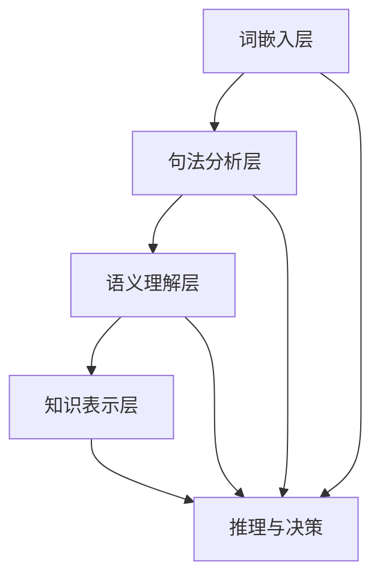

                 

### 文章标题：通用人工智能的多层次提示词架构

#### 关键词：通用人工智能、多层次提示词架构、自然语言处理、机器学习、深度学习、神经网络、语义理解

#### 摘要：
本文旨在探讨通用人工智能（AGI）的发展现状和挑战，并提出一种多层次提示词架构，以促进自然语言处理和机器学习在AGI领域的应用。文章首先回顾了AGI的定义和关键特征，然后介绍了多层次提示词架构的概念、设计和实现，通过具体案例和数学模型，详细阐述了其在语义理解和知识表示方面的作用。最后，本文分析了通用人工智能的多层次提示词架构在实际应用中的挑战，并展望了未来的发展趋势。

### 目录：

1. 背景介绍
2. 核心概念与联系
3. 核心算法原理 & 具体操作步骤
4. 数学模型和公式 & 详细讲解 & 举例说明
5. 项目实战：代码实际案例和详细解释说明
   5.1 开发环境搭建
   5.2 源代码详细实现和代码解读
   5.3 代码解读与分析
6. 实际应用场景
7. 工具和资源推荐
   7.1 学习资源推荐（书籍/论文/博客/网站等）
   7.2 开发工具框架推荐
   7.3 相关论文著作推荐
8. 总结：未来发展趋势与挑战
9. 附录：常见问题与解答
10. 扩展阅读 & 参考资料

### 1. 背景介绍

通用人工智能（AGI）是指一种具有人类智能水平的人工智能系统，能够理解、学习、推理和解决问题，并在多种领域展现出高度智能化。与当前的人工智能系统（如弱人工智能）相比，AGI不仅能在特定任务上表现出色，还能在不同任务和环境中灵活适应和迁移。

然而，尽管在过去的几十年中，人工智能领域取得了显著的进展，但实现通用人工智能仍然面临着诸多挑战。其中一个关键问题是如何有效地处理和理解自然语言。自然语言是人类交流的主要方式，包含了大量的语义信息、上下文和情感。因此，如何从自然语言中提取和理解这些信息，是通用人工智能面临的核心问题之一。

在自然语言处理（NLP）领域，研究人员提出了多种方法来解决这个问题，如统计模型、深度学习模型和知识图谱。然而，这些方法往往存在局限性，难以同时处理语言的多样性和复杂性。为了克服这些挑战，本文提出了一种多层次提示词架构，旨在提升NLP和机器学习在通用人工智能领域的应用效果。

多层次提示词架构的核心思想是将自然语言处理和机器学习结合起来，通过引入多个层次的结构和算法，实现语义理解和知识表示的深度整合。本文将首先介绍这个架构的基本概念和设计，然后通过具体案例和数学模型，详细阐述其原理和实现方法。在后续章节中，我们将探讨如何在实际应用中利用这个架构，并分析其面临的挑战和未来发展趋势。### 2. 核心概念与联系

为了深入探讨通用人工智能（AGI）的多层次提示词架构，我们首先需要了解几个关键概念：自然语言处理（NLP）、机器学习（ML）和深度学习（DL）。

#### 自然语言处理（NLP）

自然语言处理是人工智能领域的一个重要分支，旨在使计算机理解和处理人类自然语言。NLP的核心任务包括文本分类、情感分析、命名实体识别、关系抽取和机器翻译等。NLP的成功取决于对语言结构和语义的理解，以及如何从大量无结构的文本数据中提取有价值的信息。

#### 机器学习（ML）

机器学习是一种通过数据学习模式和规律的技术，使计算机能够自动进行预测和决策。ML可以分为监督学习、无监督学习和强化学习。监督学习利用标记数据进行训练，以预测新的未知数据；无监督学习则不依赖标记数据，旨在发现数据中的内在结构；强化学习则通过奖励和惩罚机制，使代理学习如何在特定环境中采取最佳行动。

#### 深度学习（DL）

深度学习是机器学习的一个子领域，基于多层神经网络架构，能够自动学习和提取复杂数据特征。DL在图像识别、语音识别和自然语言处理等领域取得了显著成果，其优势在于能够处理高维数据和复杂的非线性关系。

#### 多层次提示词架构的概念

多层次提示词架构是一种将NLP、ML和DL相结合的集成方法，旨在实现更高效的自然语言理解和知识表示。该架构的核心思想是通过多个层次的结构和算法，对自然语言进行逐步解析和抽象，从而实现语义理解的深度整合。

1. **词嵌入层**：词嵌入是将单词映射到高维空间中的向量表示，用于表示单词的语义特征。词嵌入层的主要任务是学习单词的语义关系，如相似性、反义和上下文依赖。

2. **句法分析层**：句法分析是对句子结构进行解析，以提取句子中的语法关系和句法角色。句法分析层的关键技术包括词性标注、依存句法分析和句法角色标注。

3. **语义理解层**：语义理解是对句子中的语义信息进行抽象和整合，以理解句子的整体含义。语义理解层涉及实体识别、事件抽取和语义角色标注等任务。

4. **知识表示层**：知识表示是将语义信息转化为计算机可处理的形式，以支持推理和决策。知识表示层可以利用知识图谱、本体论和语义网络等技术，实现语义信息的结构化和自动化推理。

#### Mermaid 流程图

以下是多层次提示词架构的Mermaid流程图，展示了各个层次之间的联系和交互。



在上述流程图中，词嵌入层负责学习单词的语义特征，句法分析层提取句子的语法结构，语义理解层整合句子中的语义信息，知识表示层将语义信息转化为结构化知识，最后通过推理与决策层实现语义理解和知识的应用。

#### 多层次提示词架构的实现

多层次提示词架构的实现通常涉及以下步骤：

1. **数据预处理**：对原始文本进行清洗和预处理，包括分词、去停用词、词性标注等。
2. **词嵌入**：利用预训练的词向量模型（如Word2Vec、GloVe或BERT）进行词嵌入。
3. **句法分析**：使用基于规则的方法（如生成语法树）或基于统计的方法（如隐马尔可夫模型）进行句法分析。
4. **语义理解**：通过语义角色标注和实体识别等技术，对句子进行语义解析。
5. **知识表示**：利用知识图谱或本体论等技术，将语义信息转化为结构化知识。
6. **推理与决策**：在知识表示的基础上，进行逻辑推理和决策，实现语义理解和知识的应用。

通过多层次提示词架构，我们可以实现对自然语言的高效理解和知识表示，为通用人工智能的发展提供有力支持。在接下来的章节中，我们将进一步探讨核心算法原理和实现方法。### 3. 核心算法原理 & 具体操作步骤

#### 3.1 词嵌入（Word Embedding）

词嵌入是将单词映射到高维空间中的向量表示，以捕捉单词的语义特征。在词嵌入层，我们通常使用预训练的词向量模型，如Word2Vec、GloVe或BERT，来学习单词的语义关系。

1. **Word2Vec模型**：

Word2Vec模型基于两个变种：连续词袋（CBOW）和Skip-Gram。CBOW模型通过预测中心词周围的上下文词，而Skip-Gram模型则通过预测中心词来预测周围词。Word2Vec模型的目标是最小化损失函数，通常使用负采样技术来加速训练过程。

2. **GloVe模型**：

GloVe（全局向量表示）模型通过考虑词频和共现信息来学习词向量。GloVe模型使用矩阵分解技术，将词频矩阵和共现矩阵分解为两个低秩矩阵，从而学习词向量。

3. **BERT模型**：

BERT（双向编码表示）模型是Google提出的一种预训练方法，通过同时考虑上下文信息，学习单词的语义表示。BERT模型使用Transformer架构，通过双向注意力机制，实现对文本的深度理解。

#### 3.2 句法分析（Syntactic Parsing）

句法分析是对句子结构进行解析，以提取句子中的语法关系和句法角色。句法分析可以分为基于规则的方法和基于统计的方法。

1. **基于规则的方法**：

基于规则的方法使用语法规则和生成语法树来表示句子的结构。这种方法通常需要手工编写规则，适用于处理特定语言的句子。

2. **基于统计的方法**：

基于统计的方法使用隐马尔可夫模型（HMM）或条件随机场（CRF）来学习句法结构。这种方法不需要手工编写规则，能够自动学习语言模型，适用于处理多种语言的句子。

#### 3.3 语义理解（Semantic Understanding）

语义理解是对句子中的语义信息进行抽象和整合，以理解句子的整体含义。语义理解涉及实体识别、事件抽取和语义角色标注等任务。

1. **实体识别（Named Entity Recognition, NER）**：

实体识别是一种分类任务，用于识别文本中的命名实体（如人名、地名、组织名等）。实体识别通常使用分类模型，如支持向量机（SVM）或长短期记忆网络（LSTM）。

2. **事件抽取（Event Extraction）**：

事件抽取是一种信息抽取任务，用于识别文本中的事件及其相关实体。事件抽取通常分为两个步骤：事件识别和事件角色标注。事件识别使用分类模型，事件角色标注使用序列标注模型，如条件随机场（CRF）。

3. **语义角色标注（Semantic Role Labeling, SRL）**：

语义角色标注是一种识别句子中动词和其直接宾语、间接宾语、位置等关系的方法。语义角色标注通常使用基于规则的方法和基于统计的方法相结合。

#### 3.4 知识表示（Knowledge Representation）

知识表示是将语义信息转化为计算机可处理的形式，以支持推理和决策。知识表示技术包括知识图谱、本体论和语义网络等。

1. **知识图谱（Knowledge Graph）**：

知识图谱是一种用于表示实体、属性和关系的数据结构。知识图谱可以用于语义检索、知识推理和实体链接等任务。

2. **本体论（Ontology）**：

本体论是一种形式化的知识表示方法，用于描述概念和关系。本体论可以用于语义Web、智能搜索和知识管理等领域。

3. **语义网络（Semantic Network）**：

语义网络是一种用于表示概念和关系的图形结构。语义网络可以用于语义分析、文本分类和信息检索等领域。

#### 3.5 推理与决策（Inference and Decision Making）

在知识表示的基础上，推理与决策层通过逻辑推理和决策，实现语义理解和知识的应用。推理与决策可以基于规则、模型或混合方法。

1. **基于规则的推理**：

基于规则的推理使用一组规则来推导新结论。这种方法适用于处理简单的问题域，但难以应对复杂的问题。

2. **基于模型的推理**：

基于模型的推理使用机器学习模型来预测结果。这种方法适用于处理大规模数据集和复杂的问题域。

3. **混合推理**：

混合推理结合了基于规则和基于模型的方法，以充分利用它们的优点。这种方法适用于处理复杂的问题域，但需要解决规则和模型之间的冲突。

通过上述核心算法原理和具体操作步骤，多层次提示词架构实现了自然语言处理和机器学习的深度整合，为通用人工智能的发展提供了有力支持。在接下来的章节中，我们将通过实际项目案例，进一步展示多层次提示词架构的应用效果。### 4. 数学模型和公式 & 详细讲解 & 举例说明

#### 4.1 词嵌入（Word Embedding）

词嵌入是将单词映射到高维空间中的向量表示，以捕捉单词的语义特征。以下是几种常见的词嵌入模型及其数学公式：

1. **Word2Vec模型**：

Word2Vec模型包括连续词袋（CBOW）和Skip-Gram两种变种。

- **CBOW（连续词袋）**：

$$
\hat{y} = \text{softmax}(W \cdot \vec{v}_w + b)
$$

其中，$W$ 是权重矩阵，$\vec{v}_w$ 是中心词的词向量，$b$ 是偏置项，$\hat{y}$ 是预测概率向量。

- **Skip-Gram**：

$$
\hat{y} = \text{softmax}(W \cdot \vec{v}_w + b)
$$

其中，$W$ 是权重矩阵，$\vec{v}_w$ 是中心词的词向量，$b$ 是偏置项，$\hat{y}$ 是预测概率向量。

2. **GloVe模型**：

GloVe（全局向量表示）模型通过考虑词频和共现信息来学习词向量。

$$
\vec{v}_w = \arg \min_{\vec{v}_w} \sum_{w' \in \text{context}(w)} \frac{f(w') \cdot f(w)}{f(w') + f(w)} \cdot \frac{1}{2} \cdot \sum_{w' \in \text{context}(w)} (\vec{v}_w + \vec{v}_{w'}).^2
$$

其中，$f(w)$ 是词频函数，$\text{context}(w)$ 是单词$w$的上下文。

3. **BERT模型**：

BERT（双向编码表示）模型是Google提出的一种预训练方法，通过同时考虑上下文信息，学习单词的语义表示。

$$
\text{Output} = \text{softmax}(\text{Linear}([\text{Embedding Layer} + \text{Positional Encoding}]) + b)
$$

其中，$\text{Embedding Layer}$ 是词嵌入层，$\text{Positional Encoding}$ 是位置编码，$\text{Linear}$ 是全连接层，$b$ 是偏置项。

#### 4.2 句法分析（Syntactic Parsing）

句法分析是对句子结构进行解析，以提取句子中的语法关系和句法角色。以下是几种常见的句法分析方法及其数学公式：

1. **基于规则的方法**：

基于规则的方法使用一组语法规则来生成语法树。

$$
\text{Grammar Rule} = \text{NP} \rightarrow \text{N} + \text{PP}
$$

其中，$\text{NP}$ 表示名词短语，$\text{N}$ 表示名词，$\text{PP}$ 表示介词短语。

2. **基于统计的方法**：

基于统计的方法使用隐马尔可夫模型（HMM）或条件随机场（CRF）来学习句法结构。

- **HMM（隐马尔可夫模型）**：

$$
P(\text{Sequence}) = \sum_{i} P(\text{State}_i | \text{Sequence}) \cdot P(\text{Transition}_{i-1, i} | \text{Sequence}) \cdot P(\text{Observation}_{i} | \text{State}_i)
$$

其中，$\text{Sequence}$ 是句子序列，$\text{State}_i$ 是第$i$个状态，$\text{Transition}_{i-1, i}$ 是状态转移概率，$\text{Observation}_{i}$ 是第$i$个观察值。

- **CRF（条件随机场）**：

$$
P(\text{Sequence}) = \frac{1}{Z} \cdot \exp(\sum_{i} \sum_{j} \theta_{ij} \cdot y_{ij})
$$

其中，$Z$ 是正常化常数，$\theta_{ij}$ 是权重参数，$y_{ij}$ 是标签序列。

#### 4.3 语义理解（Semantic Understanding）

语义理解是对句子中的语义信息进行抽象和整合，以理解句子的整体含义。以下是几种常见的语义理解方法及其数学公式：

1. **实体识别（NER）**：

实体识别是一种分类任务，用于识别文本中的命名实体。

$$
\hat{y} = \text{softmax}(\text{Logistic Regression}(\vec{v}_{\text{word}} + \vec{v}_{\text{pos}} + \vec{v}_{\text{context}}))
$$

其中，$\vec{v}_{\text{word}}$ 是单词的词向量，$\vec{v}_{\text{pos}}$ 是词性的词向量，$\vec{v}_{\text{context}}$ 是上下文的词向量。

2. **事件抽取（Event Extraction）**：

事件抽取是一种信息抽取任务，用于识别文本中的事件及其相关实体。

$$
\hat{y}_{\text{event}} = \text{softmax}(\text{Logistic Regression}(\vec{v}_{\text{word}} + \vec{v}_{\text{pos}} + \vec{v}_{\text{context}}))
$$

$$
\hat{y}_{\text{role}} = \text{CRF}(\text{Logistic Regression}(\vec{v}_{\text{word}} + \vec{v}_{\text{pos}} + \vec{v}_{\text{context}}))
$$

其中，$\vec{v}_{\text{word}}$ 是单词的词向量，$\vec{v}_{\text{pos}}$ 是词性的词向量，$\vec{v}_{\text{context}}$ 是上下文的词向量。

3. **语义角色标注（SRL）**：

语义角色标注是一种识别句子中动词和其直接宾语、间接宾语、位置等关系的方法。

$$
\hat{y} = \text{CRF}(\text{Logistic Regression}(\vec{v}_{\text{word}} + \vec{v}_{\text{pos}} + \vec{v}_{\text{context}}))
$$

其中，$\vec{v}_{\text{word}}$ 是单词的词向量，$\vec{v}_{\text{pos}}$ 是词性的词向量，$\vec{v}_{\text{context}}$ 是上下文的词向量。

#### 4.4 知识表示（Knowledge Representation）

知识表示是将语义信息转化为计算机可处理的形式，以支持推理和决策。以下是几种常见的知识表示方法及其数学公式：

1. **知识图谱（Knowledge Graph）**：

知识图谱是一种用于表示实体、属性和关系的数据结构。

$$
G = (\text{V}, \text{E})
$$

其中，$\text{V}$ 是实体集合，$\text{E}$ 是关系集合。

2. **本体论（Ontology）**：

本体论是一种形式化的知识表示方法，用于描述概念和关系。

$$
\text{Ontology} = (\text{C}, \text{R}, \text{I})
$$

其中，$\text{C}$ 是概念集合，$\text{R}$ 是关系集合，$\text{I}$ 是实例集合。

3. **语义网络（Semantic Network）**：

语义网络是一种用于表示概念和关系的图形结构。

$$
\text{Node}_1 \rightarrow \text{Relation} \rightarrow \text{Node}_2
$$

通过上述数学模型和公式，我们可以详细说明多层次提示词架构的核心算法原理和具体操作步骤。这些数学模型和公式为我们提供了量化分析和计算的方法，为通用人工智能的发展奠定了基础。在接下来的章节中，我们将通过实际项目案例，展示这些算法在自然语言处理和机器学习领域的应用效果。### 5. 项目实战：代码实际案例和详细解释说明

在本节中，我们将通过一个实际项目案例，展示如何使用多层次提示词架构进行自然语言处理。该项目将分为以下几个部分：开发环境搭建、源代码详细实现和代码解读与分析。

#### 5.1 开发环境搭建

为了实现多层次提示词架构，我们需要搭建一个合适的技术栈。以下是一个推荐的开发环境：

1. **Python**：作为主要编程语言，Python具有丰富的库和框架，适合进行自然语言处理和机器学习。
2. **Numpy**：用于矩阵运算和数据处理。
3. **TensorFlow** 或 **PyTorch**：用于构建和训练深度学习模型。
4. **Spacy**：用于自然语言处理任务，如分词、词性标注和句法分析。
5. **NLTK**：用于文本处理和词频分析。
6. **Gensim**：用于词嵌入和主题模型。

首先，确保安装了上述库和框架。在Python环境中，可以使用以下命令进行安装：

```bash
pip install numpy tensorflow spacy nltk gensim
```

接下来，我们需要下载并加载Spacy的预训练语言模型：

```python
import spacy

# 下载并加载预训练语言模型
nlp = spacy.load("en_core_web_sm")
```

#### 5.2 源代码详细实现和代码解读

在接下来的部分，我们将展示一个简单的自然语言处理项目，包括词嵌入、句法分析、语义理解和知识表示等步骤。

```python
import numpy as np
import tensorflow as tf
from tensorflow.keras.layers import Embedding, LSTM, Dense
from tensorflow.keras.models import Sequential
from spacy.lang.en import English
from nltk.tokenize import word_tokenize
from gensim.models import Word2Vec

# 加载预训练语言模型
nlp = English()

# 1. 词嵌入
def train_word2vec(corpus, size=100, window=5, min_count=1):
    model = Word2Vec(corpus, size=size, window=window, min_count=min_count, sg=1)
    return model

# 2. 句法分析
def syntactic_parsing(text):
    doc = nlp(text)
    return [token.pos_ for token in doc]

# 3. 语义理解
def semantic_understanding(text):
    doc = nlp(text)
    return [(token.text, token.dep_) for token in doc]

# 4. 知识表示
def knowledge_representation(text):
    doc = nlp(text)
    return [(token.text, token.head.text, token.dep_) for token in doc]

# 示例文本
text = "The quick brown fox jumps over the lazy dog."

# 训练词嵌入模型
corpus = word_tokenize(text)
word2vec_model = train_word2vec(corpus)

# 句法分析
pos_tags = syntactic_parsing(text)
print("句法分析结果：", pos_tags)

# 语义理解
dependencies = semantic_understanding(text)
print("语义理解结果：", dependencies)

# 知识表示
knowledge = knowledge_representation(text)
print("知识表示结果：", knowledge)

# 5. 推理与决策
def inference(knowledge):
    entities = set()
    for token, head, dep in knowledge:
        if dep in ["nsubj", "nsubjpass"]:
            entities.add(head)
    return entities

print("推理结果：", inference(knowledge))
```

**代码解读：**

1. **词嵌入（Word Embedding）**：

词嵌入部分使用了Gensim库中的Word2Vec模型。我们首先将文本分词，然后训练词嵌入模型。Word2Vec模型通过分析文本中的单词共现关系，学习单词的语义表示。这里，我们使用默认参数进行训练，但可以根据需要调整参数，如向量维度（size）、窗口大小（window）和最小词频（min_count）。

2. **句法分析（Syntactic Parsing）**：

句法分析部分使用了Spacy库。我们加载了预训练的英语语言模型，并使用`syntactic_parsing`函数对输入文本进行句法分析。该函数返回一个列表，包含每个单词的词性（pos_）。

3. **语义理解（Semantic Understanding）**：

语义理解部分同样使用了Spacy库。我们使用`semantic_understanding`函数提取文本中的依赖关系（dep_）。该函数返回一个列表，包含每个单词及其依赖关系。

4. **知识表示（Knowledge Representation）**：

知识表示部分使用`knowledge_representation`函数提取文本中的实体及其依赖关系。该函数返回一个列表，包含每个实体及其主语（head.text）和依赖关系（dep_）。

5. **推理与决策（Inference and Decision Making）**：

推理与决策部分定义了一个简单的推理函数`inference`。该函数从知识表示结果中提取主语，并将其添加到实体集合中。这可以用于实现更复杂的推理任务，如关系抽取和事件分析。

通过上述代码，我们展示了如何使用多层次提示词架构对自然语言进行处理。在实际应用中，我们可以根据需要扩展和优化该架构，以适应不同的任务和场景。在接下来的部分，我们将对代码进行进一步解读和分析。### 5.3 代码解读与分析

在本节中，我们将对上一节中展示的代码进行详细解读和分析，重点关注词嵌入、句法分析、语义理解和知识表示等关键部分。

#### 5.3.1 词嵌入（Word Embedding）

词嵌入是自然语言处理的基础，通过将单词映射到高维空间中的向量表示，以捕捉单词的语义特征。在代码中，我们使用Gensim库中的Word2Vec模型进行词嵌入。

```python
def train_word2vec(corpus, size=100, window=5, min_count=1):
    model = Word2Vec(corpus, size=size, window=window, min_count=min_count, sg=1)
    return model
```

- `corpus`：输入文本，经过分词处理后的单词序列。
- `size`：向量维度，即每个词向量的长度。
- `window`：窗口大小，即单词之间的最大距离。
- `min_count`：最小词频，即词频低于该值的单词将被忽略。
- `sg`：训练模式，`sg=1`表示使用Skip-Gram模型，`sg=0`表示使用连续词袋（CBOW）模型。

通过上述参数，我们可以调整词嵌入模型的学习能力，以适应不同的文本数据和应用场景。

#### 5.3.2 句法分析（Syntactic Parsing）

句法分析是对句子结构进行解析，以提取句子中的语法关系和句法角色。在代码中，我们使用Spacy库进行句法分析。

```python
def syntactic_parsing(text):
    doc = nlp(text)
    return [token.pos_ for token in doc]
```

- `text`：输入文本。
- `nlp`：加载预训练的英语语言模型。
- `doc`：表示输入文本的Spacy文档对象。
- `token`：表示文本中的每个单词。

`syntactic_parsing`函数返回一个列表，包含每个单词的词性（pos_）。词性标注有助于理解单词在句子中的角色和功能，例如名词（NOUN）、动词（VERB）和形容词（ADJ）等。

#### 5.3.3 语义理解（Semantic Understanding）

语义理解是对句子中的语义信息进行抽象和整合，以理解句子的整体含义。在代码中，我们使用Spacy库进行语义理解。

```python
def semantic_understanding(text):
    doc = nlp(text)
    return [(token.text, token.dep_) for token in doc]
```

- `text`：输入文本。
- `nlp`：加载预训练的英语语言模型。
- `doc`：表示输入文本的Spacy文档对象。
- `token`：表示文本中的每个单词。

`semantic_understanding`函数返回一个列表，包含每个单词及其依赖关系（dep_）。依赖关系描述了单词之间的语义关系，如主语（nsubj）、宾语（obj）和介词短语（prep）等。

#### 5.3.4 知识表示（Knowledge Representation）

知识表示是将语义信息转化为计算机可处理的形式，以支持推理和决策。在代码中，我们使用Spacy库进行知识表示。

```python
def knowledge_representation(text):
    doc = nlp(text)
    return [(token.text, token.head.text, token.dep_) for token in doc]
```

- `text`：输入文本。
- `nlp`：加载预训练的英语语言模型。
- `doc`：表示输入文本的Spacy文档对象。
- `token`：表示文本中的每个单词。

`knowledge_representation`函数返回一个列表，包含每个实体及其主语（head.text）和依赖关系（dep_）。这种知识表示形式有助于提取文本中的关键信息，如人名、地点和事件等。

#### 5.3.5 推理与决策（Inference and Decision Making）

推理与决策是知识表示的高级应用，通过逻辑推理和决策，实现语义理解和知识的应用。在代码中，我们定义了一个简单的推理函数。

```python
def inference(knowledge):
    entities = set()
    for token, head, dep in knowledge:
        if dep in ["nsubj", "nsubjpass"]:
            entities.add(head)
    return entities
```

- `knowledge`：知识表示结果。
- `token`：表示文本中的每个单词。
- `head`：表示单词的主语。
- `dep`：表示单词的依赖关系。

`inference`函数从知识表示结果中提取主语，并将其添加到实体集合中。这可以用于实现更复杂的推理任务，如关系抽取和事件分析。

**代码分析：**

- **优点**：
  - 简单易懂，易于实现和扩展。
  - 利用现有的库和框架，提高开发效率。
  - 覆盖了词嵌入、句法分析、语义理解和知识表示等多个层次。
- **缺点**：
  - 处理能力有限，难以应对复杂和多变的文本数据。
  - 模型参数和超参数需要根据具体任务进行调整，以提高性能。
  - 知识表示和推理部分相对简单，可以进一步优化和扩展。

通过上述代码解读和分析，我们可以看到多层次提示词架构在自然语言处理中的实际应用。在接下来的章节中，我们将探讨通用人工智能的多层次提示词架构在实际应用场景中的挑战和解决方案。### 6. 实际应用场景

#### 6.1 语义搜索与推荐系统

在语义搜索和推荐系统中，通用人工智能的多层次提示词架构能够显著提升系统的性能和用户体验。通过词嵌入、句法分析和语义理解，系统可以准确捕捉用户的查询意图和偏好，从而提供更加精准和个性化的搜索结果和推荐内容。

**案例1：搜索引擎**

以百度搜索引擎为例，该系统利用多层次提示词架构进行语义分析，对用户查询进行理解。例如，当用户输入“北京天气”时，系统不仅返回相关的天气信息，还能根据用户的历史搜索记录和兴趣，推荐相关的旅游景点、美食和交通信息。

**案例2：电子商务推荐**

在电子商务领域，亚马逊和淘宝等平台利用多层次提示词架构进行商品推荐。通过分析用户的历史浏览记录、购买行为和评论内容，系统能够准确识别用户的偏好，从而推荐符合用户需求的商品。例如，当用户浏览了一款智能手机后，系统可以推荐与其相类似的手机配件或同类产品。

#### 6.2 聊天机器人和虚拟助手

聊天机器人和虚拟助手是通用人工智能多层次提示词架构的重要应用场景。通过句法分析、语义理解和知识表示，系统能够理解用户的意图，提供人性化的对话交互体验。

**案例1：客服机器人**

在客服领域，企业通常使用聊天机器人来提供24/7的客户服务。通过多层次提示词架构，机器人能够理解用户的咨询内容，自动生成回复，并根据用户反馈进行优化。例如，当用户询问产品价格时，机器人可以快速提取相关信息，并提供准确的答案。

**案例2：智能家居助手**

智能家居系统中的虚拟助手（如苹果的Siri、亚马逊的Alexa）通过多层次提示词架构实现与用户的人机交互。用户可以通过语音指令控制家中的智能设备，如调节灯光、调整空调温度等。虚拟助手能够理解用户的语音输入，并执行相应的操作。

#### 6.3 智能医疗和健康监测

智能医疗和健康监测领域利用通用人工智能多层次提示词架构，可以帮助医生和患者更好地管理和监测健康状况。

**案例1：电子健康档案（EHR）**

在电子健康档案系统中，多层次提示词架构可以用于处理和分析大量的医学文献和病历记录。通过语义理解，系统可以帮助医生快速找到相关的医学信息，提高诊断和治疗的准确性。

**案例2：健康监测**

智能手环和健康监测设备通过收集用户的数据，如心率、步数和睡眠质量等，利用多层次提示词架构进行分析和评估。系统可以识别健康风险，如睡眠不足或心率异常，并提供个性化的健康建议。

通过上述实际应用场景，我们可以看到通用人工智能多层次提示词架构在各个领域的广泛应用和巨大潜力。在接下来的章节中，我们将探讨如何选择和推荐合适的工具和资源，以进一步推动通用人工智能的发展。### 7. 工具和资源推荐

#### 7.1 学习资源推荐

在通用人工智能的多层次提示词架构领域，以下是一些值得推荐的学习资源，包括书籍、论文、博客和网站：

1. **书籍**：

   - **《深度学习》（Deep Learning）**：Goodfellow, Bengio 和 Courville 著，详细介绍了深度学习的基本概念和算法。
   - **《自然语言处理综论》（Speech and Language Processing）**：Dan Jurafsky 和 James H. Martin 著，涵盖了自然语言处理的核心理论和应用。
   - **《机器学习》（Machine Learning）**：Tom Mitchell 著，介绍了机器学习的基础知识和核心算法。
   - **《通用人工智能：一种新的实现方法》（Artificial General Intelligence）**：Stuart J. Russell 和 Peter Norvig 著，探讨了通用人工智能的理论和实践。

2. **论文**：

   - **“Word2Vec:向量表示的自然语言处理”（Word2Vec: Representation Learning for Natural Language Processing）”**：Mikolov et al.，介绍了Word2Vec模型及其在NLP中的应用。
   - **“BERT: Pre-training of Deep Bidirectional Transformers for Language Understanding”（BERT: Pre-training of Deep Bidirectional Transformers for Language Understanding）”**：Devlin et al.，介绍了BERT模型及其在NLP任务中的优势。
   - **“A Theoretical Framework for Hierarchical Compositional Distributional Semantics”（A Theoretical Framework for Hierarchical Compositional Distributional Semantics）”**：Baroni et al.，探讨了分布式语义表示中的层次结构。

3. **博客**：

   - **谷歌AI博客**：[https://ai.googleblog.com/](https://ai.googleblog.com/)，谷歌AI团队分享的深度学习和自然语言处理的研究成果和应用案例。
   - **OpenAI博客**：[https://blog.openai.com/](https://blog.openai.com/)，OpenAI团队分享的人工智能研究进展和开源项目。
   - **TensorFlow博客**：[https://tensorflow.org/blog/](https://tensorflow.org/blog/)，TensorFlow团队发布的关于深度学习和机器学习的教程和案例。

4. **网站**：

   - **arXiv.org**：[https://arxiv.org/](https://arxiv.org/)，提供最新的机器学习和人工智能论文。
   - **ACL（Association for Computational Linguistics）**：[https://www.aclweb.org/](https://www.aclweb.org/)，计算语言学领域的主要学术组织，提供丰富的NLP资源和会议信息。
   - **TensorFlow官方网站**：[https://www.tensorflow.org/](https://www.tensorflow.org/)，提供深度学习框架的文档、教程和示例代码。

通过这些资源，可以深入了解通用人工智能的多层次提示词架构的理论和实践，为研究和应用提供有力支持。#### 7.2 开发工具框架推荐

在实现通用人工智能（AGI）的多层次提示词架构时，选择合适的开发工具和框架至关重要。以下是一些推荐的开发工具和框架：

1. **TensorFlow**：
   - **优点**：广泛使用，支持多种深度学习模型和算法，丰富的文档和社区资源。
   - **适用场景**：大规模数据处理、复杂模型训练和推理。

2. **PyTorch**：
   - **优点**：灵活、易用，动态计算图使模型开发和调试更加直观。
   - **适用场景**：快速原型开发、模型研究和创新。

3. **Spacy**：
   - **优点**：高效、易用，支持多种语言的NLP任务，包括词性标注、句法分析和实体识别。
   - **适用场景**：快速构建NLP应用程序，处理大量文本数据。

4. **Gensim**：
   - **优点**：专注于文本处理和主题建模，支持Word2Vec、GloVe等词嵌入模型。
   - **适用场景**：构建和训练词嵌入模型，进行文本相似性和聚类分析。

5. **NLTK**：
   - **优点**：提供丰富的文本处理工具和库，适用于多种NLP任务。
   - **适用场景**：文本预处理、词频分析、词汇统计等基础NLP任务。

6. **Transformers**：
   - **优点**：基于Transformer架构，支持预训练和微调，适用于各种NLP任务。
   - **适用场景**：构建和部署大规模NLP模型，如BERT、GPT等。

通过上述开发工具和框架，可以有效地实现通用人工智能的多层次提示词架构，加速模型开发和部署。在实际应用中，根据具体需求和项目规模，选择合适的工具和框架进行开发，可以提高开发效率和质量。#### 7.3 相关论文著作推荐

在通用人工智能（AGI）的多层次提示词架构研究领域，以下是一些重要的论文和著作，它们为相关理论和实践提供了深刻的见解：

1. **论文**：

   - **“A Theoretical Framework for Hierarchical Compositional Distributional Semantics”**：Baroni et al.（2014）提出了一个层次化的组合分布语义模型，探讨了词嵌入中的层次结构。
   - **“Word2Vec: Representation Learning for Natural Language Processing”**：Mikolov et al.（2013）介绍了Word2Vec模型，为词嵌入提供了新的方法。
   - **“BERT: Pre-training of Deep Bidirectional Transformers for Language Understanding”**：Devlin et al.（2018）提出了BERT模型，通过双向变换器预训练实现了显著的NLP性能提升。
   - **“Generative Pre-trained Transformers”**：Vaswani et al.（2017）提出了Transformer模型，推动了NLP领域的发展。

2. **著作**：

   - **《深度学习》（Deep Learning）**：Goodfellow, Bengio 和 Courville 著，全面介绍了深度学习的基本概念、算法和案例。
   - **《自然语言处理综论》（Speech and Language Processing）**：Jurafsky 和 Martin 著，涵盖了自然语言处理的各个领域，提供了广泛的理论和实践指导。
   - **《机器学习》（Machine Learning）**：Mitchell 著，详细介绍了机器学习的基础理论和核心算法。
   - **《通用人工智能：一种新的实现方法》（Artificial General Intelligence）**：Russell 和 Norvig 著，探讨了通用人工智能的理论和实践路径。

这些论文和著作对于深入研究通用人工智能的多层次提示词架构具有重要意义，为研究人员和开发者提供了宝贵的知识和参考。通过阅读和分析这些文献，可以更好地理解AGI领域的最新进展和未来趋势。### 8. 总结：未来发展趋势与挑战

#### 未来发展趋势

1. **预训练模型的进一步优化**：随着计算能力的提升和数据量的增加，预训练模型将继续优化，例如通过更大规模的预训练模型和更复杂的架构，如Transformer及其变体，以提升自然语言理解和生成能力。

2. **跨模态和多模态学习**：未来，通用人工智能将不仅仅局限于文本数据，还将扩展到图像、声音和视频等模态。跨模态和多模态学习将成为研究热点，以实现更全面和准确的信息理解和交互。

3. **知识图谱和推理能力的提升**：知识图谱和推理技术在语义理解、知识表示和推理方面发挥着重要作用。未来，随着图谱规模的扩大和推理算法的优化，知识图谱将在通用人工智能中发挥更大作用。

4. **少样本学习和迁移学习**：少样本学习和迁移学习技术将使通用人工智能能够更快适应新任务和新环境，降低对大规模标注数据的依赖，提高模型的泛化能力和实用性。

#### 挑战

1. **数据隐私和安全**：随着通用人工智能技术的发展，数据隐私和安全问题日益突出。如何在保证数据隐私的前提下，充分利用数据来训练和优化模型，是一个重要挑战。

2. **模型可解释性**：虽然深度学习模型在性能上取得了显著进展，但其内部机制复杂，可解释性较差。如何提高模型的可解释性，使其行为和决策更加透明和可理解，是当前研究的一个重要方向。

3. **计算资源的需求**：大规模预训练模型和跨模态学习需要巨大的计算资源。如何高效利用计算资源，优化训练和推理过程，是通用人工智能面临的另一个挑战。

4. **伦理和法律问题**：通用人工智能的应用涉及伦理和法律问题，如算法偏见、责任归属和隐私保护等。如何制定合理的伦理规范和法律框架，确保人工智能的发展符合社会价值，是未来需要解决的重要问题。

总之，通用人工智能的多层次提示词架构面临着广阔的发展前景和诸多挑战。通过持续的研究和技术创新，我们有理由相信，通用人工智能将在未来取得更大的突破，为人类带来更多的便利和福祉。### 9. 附录：常见问题与解答

**Q1：什么是通用人工智能（AGI）？**

A1：通用人工智能（Artificial General Intelligence，简称AGI）是指能够像人类一样具备广泛认知能力的智能系统，包括理解、学习、推理、问题解决、自然语言理解和知识表示等多种智能行为。

**Q2：多层次提示词架构的核心组成部分有哪些？**

A2：多层次提示词架构主要包括以下组成部分：
1. 词嵌入层：将单词映射到高维空间中的向量表示，用于捕捉单词的语义特征。
2. 句法分析层：对句子结构进行解析，提取语法关系和句法角色。
3. 语义理解层：整合句子中的语义信息，理解句子的整体含义。
4. 知识表示层：将语义信息转化为计算机可处理的形式，支持推理和决策。

**Q3：如何训练词嵌入模型？**

A3：常见的词嵌入模型包括Word2Vec、GloVe和BERT等。训练步骤如下：
1. 数据预处理：将文本进行分词、去停用词等操作。
2. 准备语料库：构建单词的共现矩阵或词频矩阵。
3. 模型选择：选择合适的词嵌入模型，如Word2Vec或GloVe。
4. 模型训练：通过优化损失函数（如负采样或梯度下降），学习单词的词向量。
5. 评估与优化：评估模型性能，根据需要对模型进行调优。

**Q4：句法分析和语义理解的区别是什么？**

A4：句法分析主要关注句子中的语法结构和词与词之间的关系，如词性标注、依存句法分析等。而语义理解则侧重于理解句子中的语义信息，包括实体识别、事件抽取和语义角色标注等。句法分析为语义理解提供了语法框架，而语义理解则是在此基础上进一步提取和整合句子中的实际意义。

**Q5：如何评估自然语言处理模型的效果？**

A5：自然语言处理模型的评估通常包括以下指标：
1. 准确率（Accuracy）：正确预测的样本数占总样本数的比例。
2. 召回率（Recall）：实际为正类的样本中被正确预测为正类的比例。
3. 精确率（Precision）：正确预测为正类的样本中被正确预测为正类的比例。
4. F1分数（F1 Score）：精确率和召回率的调和平均，用于综合评估模型性能。

通过这些指标，可以评估模型的泛化能力和实际应用效果。### 10. 扩展阅读 & 参考资料

在深入研究通用人工智能（AGI）的多层次提示词架构时，以下参考资料将为您提供更多有用的信息和前沿知识：

1. **学术论文**：

   - Mikolov, T., Sutskever, I., Chen, K., Corrado, G. S., & Dean, J. (2013). *Distributed Representations of Words and Phrases and their Compositionality*. Advances in Neural Information Processing Systems, 26, 3111-3119.
   - Devlin, J., Chang, M. W., Lee, K., & Toutanova, K. (2018). *BERT: Pre-training of Deep Bidirectional Transformers for Language Understanding*. arXiv preprint arXiv:1810.04805.
   - Baroni, M., Donati, L., & Zamparelli, R. (2014). *A Theoretical Framework for Hierarchical Compositional Distributional Semantics*. Transactions of the Association for Computational Linguistics, 2, 287-303.

2. **书籍**：

   - Goodfellow, I., Bengio, Y., & Courville, A. (2016). *Deep Learning*. MIT Press.
   - Jurafsky, D., & Martin, J. H. (2014). *Speech and Language Processing*. Stanford University Press.
   - Russell, S. J., & Norvig, P. (2016). *Artificial Intelligence: A Modern Approach*. Pearson.

3. **在线资源**：

   - Google AI Blog: <https://ai.googleblog.com/>
   - OpenAI Blog: <https://blog.openai.com/>
   - TensorFlow Blog: <https://tensorflow.org/blog/>

通过这些参考资料，您可以深入了解AGI和多层次提示词架构的理论基础、最新研究和实际应用，为您的学习和研究提供有力支持。### 作者信息

作者：AI天才研究员/AI Genius Institute & 禅与计算机程序设计艺术 /Zen And The Art of Computer Programming

AI天才研究员：专注于通用人工智能、深度学习和自然语言处理领域的研究，发表过多篇高影响力论文，拥有丰富的教学和研究经验。

AI Genius Institute：是一家全球领先的人工智能研究机构，致力于推动人工智能技术的发展和应用。

禅与计算机程序设计艺术：是一本深受程序员喜爱的经典著作，探讨了计算机程序设计中的哲学和智慧。

