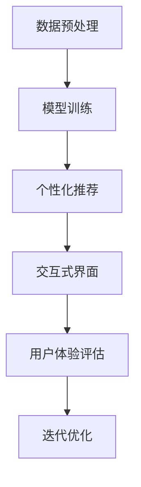
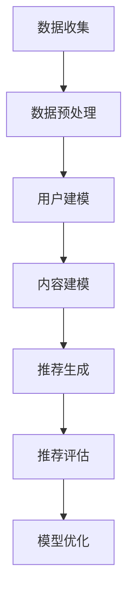
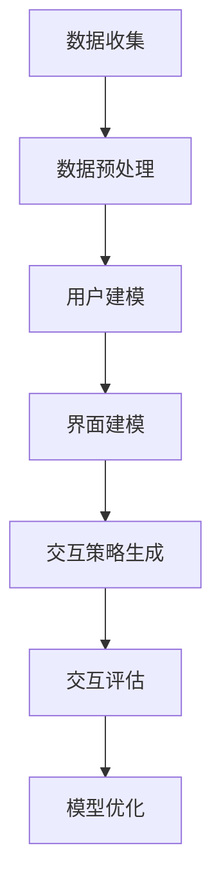
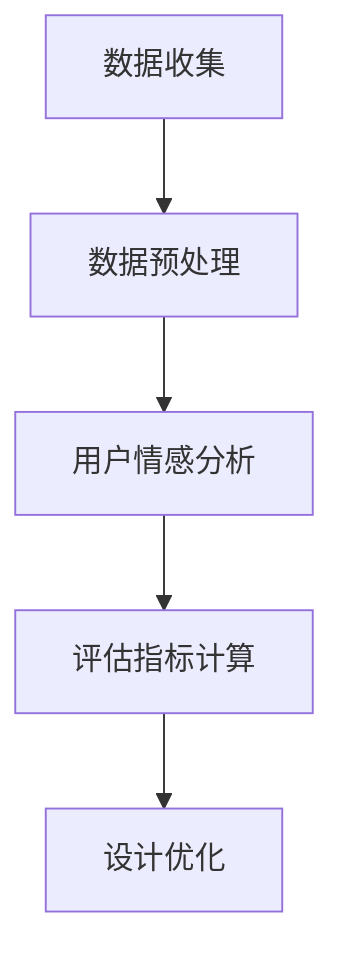

                 

# 通过AI大模型优化用户界面与体验设计

## 关键词

- AI大模型
- 用户界面优化
- 体验设计
- 个性化推荐
- 交互式界面
- 自然语言处理
- 深度学习
- 用户体验评估

## 摘要

本文旨在探讨如何利用人工智能（AI）大模型来优化用户界面（UI）和用户体验（UX）设计。通过介绍AI大模型的核心概念和原理，我们将详细讲解如何利用这些模型进行用户界面和体验的优化。文章将分为以下几个部分：背景介绍、核心概念与联系、核心算法原理与具体操作步骤、数学模型和公式、项目实战、实际应用场景、工具和资源推荐、总结与未来发展趋势以及常见问题与解答。通过本文的阅读，读者将能够深入了解AI大模型在UI/UX设计优化中的潜力和应用。

### 1. 背景介绍

在现代数字时代，用户界面和用户体验设计已经成为产品成功的关键因素。随着互联网和移动设备的普及，用户对产品的期望越来越高，他们不仅要求产品功能强大，更注重产品的易用性和互动性。然而，传统的UI/UX设计方法往往依赖于设计师的经验和直觉，难以满足用户多样化和个性化的需求。因此，如何利用先进的技术手段，特别是人工智能，来优化UI/UX设计，成为当前研究的热点。

人工智能大模型，如深度学习模型，具备处理大规模数据和进行复杂模式识别的能力，为UI/UX设计提供了新的可能性。通过学习用户行为数据，AI大模型可以预测用户的偏好，从而实现个性化推荐和交互式界面设计。此外，AI大模型还可以用于自动评估和改进UI/UX设计，提供数据驱动的决策支持。

本文将探讨如何利用AI大模型优化UI/UX设计，包括核心概念、算法原理、数学模型、项目实战以及实际应用场景。希望通过本文的介绍，读者能够对AI大模型在UI/UX设计中的潜力有更深入的理解，并能够在实际项目中加以应用。

### 2. 核心概念与联系

#### 2.1 AI大模型的基本概念

人工智能（AI）大模型是指通过深度学习技术训练的大型神经网络模型，这些模型能够在海量数据中自动学习特征和模式，从而进行复杂的任务。常见的AI大模型包括神经网络（Neural Networks）、卷积神经网络（Convolutional Neural Networks, CNNs）、递归神经网络（Recurrent Neural Networks, RNNs）和Transformer模型等。

神经网络是模仿人脑神经元连接方式构建的计算模型，通过调整权重和偏置来实现对数据的分类、回归或其他任务。卷积神经网络则特别适用于处理图像数据，通过卷积操作提取图像特征。递归神经网络适合处理序列数据，如时间序列分析、语音识别等。Transformer模型则通过自注意力机制实现了对序列数据的全局关注，广泛应用于机器翻译、文本生成等任务。

#### 2.2 AI大模型在UI/UX设计中的应用

AI大模型在UI/UX设计中的应用主要体现在以下几个方面：

1. **个性化推荐**：通过分析用户的历史行为数据，如浏览记录、搜索关键词、购买历史等，AI大模型可以预测用户的偏好，从而提供个性化的推荐。例如，电商平台可以根据用户的购买行为推荐相关商品，社交平台可以根据用户的兴趣推荐内容。

2. **交互式界面设计**：AI大模型可以学习用户的交互习惯和偏好，为用户提供个性化的交互体验。例如，聊天机器人可以根据用户的提问历史和偏好提供更加自然和高效的对话。

3. **用户体验评估**：AI大模型可以分析用户对UI/UX的反馈数据，评估设计的效果和用户满意度。通过自动化的评估，设计师可以快速迭代和优化设计方案。

#### 2.3 相关技术原理和架构

为了更好地理解AI大模型在UI/UX设计中的应用，我们需要了解一些相关技术原理和架构。

1. **数据预处理**：在应用AI大模型之前，需要对用户数据（如行为数据、反馈数据等）进行预处理，包括数据清洗、归一化、特征提取等。这些步骤对于模型的学习效果至关重要。

2. **模型训练和优化**：使用预训练的大模型（如BERT、GPT等）进行微调，以适应特定UI/UX设计的任务。模型的训练和优化过程包括损失函数的选择、优化器的设置、正则化方法等。

3. **模型部署和评估**：将训练好的模型部署到实际应用中，通过持续学习和评估，不断优化UI/UX设计。

#### 2.4 Mermaid流程图

以下是一个简单的Mermaid流程图，展示了AI大模型在UI/UX设计中的应用流程：



通过以上流程，我们可以看到AI大模型在UI/UX设计中的应用是如何实现的。接下来，我们将深入探讨AI大模型的核心算法原理和具体操作步骤。

### 3. 核心算法原理 & 具体操作步骤

#### 3.1 个性化推荐算法

个性化推荐是AI大模型在UI/UX设计中应用的重要方向之一。其基本原理是通过学习用户的历史行为数据，预测用户可能感兴趣的内容，从而为用户提供个性化的推荐。以下是一个简单的个性化推荐算法流程：

1. **数据收集**：收集用户的行为数据，包括浏览记录、搜索关键词、购买历史等。

2. **数据预处理**：对收集的数据进行清洗、归一化和特征提取。例如，将用户行为数据转换为数值表示，并提取关键特征。

3. **用户建模**：使用机器学习算法（如K-means、协同过滤等）对用户数据进行聚类或计算用户相似度，构建用户画像。

4. **内容建模**：对推荐的内容进行建模，提取内容特征，如文本特征、图像特征等。

5. **推荐生成**：根据用户画像和内容特征，使用基于相似度或基于模型的算法（如矩阵分解、深度学习模型等）生成推荐列表。

6. **推荐评估**：评估推荐效果，包括用户点击率、转化率等指标。

7. **模型优化**：根据评估结果，调整推荐算法参数，优化推荐效果。

以下是一个简化的Mermaid流程图，展示个性化推荐算法的流程：



#### 3.2 交互式界面设计

交互式界面设计是提升用户体验的重要环节。AI大模型可以通过学习用户的交互习惯和偏好，为用户提供个性化的交互体验。以下是一个简单的交互式界面设计算法流程：

1. **数据收集**：收集用户的交互数据，包括点击、滑动、触摸等行为。

2. **数据预处理**：对收集的数据进行清洗、归一化和特征提取。例如，将交互行为数据转换为时间序列数据，并提取关键特征。

3. **用户建模**：使用机器学习算法对用户交互数据进行聚类或计算用户相似度，构建用户画像。

4. **界面建模**：对界面元素进行建模，提取界面特征，如按钮位置、颜色、布局等。

5. **交互策略生成**：根据用户画像和界面特征，使用基于规则的算法或深度学习模型生成交互策略。

6. **交互评估**：评估交互策略的效果，包括用户满意度、操作效率等指标。

7. **模型优化**：根据评估结果，调整交互策略，优化用户界面设计。

以下是一个简化的Mermaid流程图，展示交互式界面设计的流程：



#### 3.3 用户体验评估

用户体验评估是确保UI/UX设计质量的重要步骤。AI大模型可以通过分析用户反馈数据，评估设计的效果和用户满意度。以下是一个简单的人机评估算法流程：

1. **数据收集**：收集用户的反馈数据，包括满意度评分、评论等。

2. **数据预处理**：对收集的数据进行清洗、归一化和特征提取。例如，将用户反馈数据转换为文本数据，并提取关键特征。

3. **用户情感分析**：使用自然语言处理（NLP）技术对用户反馈进行分析，识别用户的情感和满意度。

4. **评估指标计算**：根据用户情感分析结果，计算用户体验评估指标，如满意度得分、负面评论率等。

5. **设计优化**：根据评估结果，对UI/UX设计进行优化，提高用户体验。

以下是一个简化的Mermaid流程图，展示用户体验评估的流程：



通过上述算法原理和具体操作步骤，我们可以看到AI大模型在UI/UX设计中的潜力。接下来，我们将介绍数学模型和公式，进一步深入探讨AI大模型在UI/UX设计优化中的应用。

### 4. 数学模型和公式 & 详细讲解 & 举例说明

#### 4.1 数学模型

在AI大模型应用于UI/UX设计优化时，通常会涉及以下几种数学模型：

1. **回归模型**：用于预测用户行为或用户体验指标，如点击率、满意度等。

2. **分类模型**：用于分类用户偏好或识别用户情感，如推荐系统中的商品分类或评论情感分析。

3. **聚类模型**：用于发现用户群体或内容类别，如K-means聚类算法。

4. **自然语言处理（NLP）模型**：用于处理和生成文本数据，如词向量模型、语言模型等。

5. **深度学习模型**：用于复杂特征提取和模式识别，如卷积神经网络（CNN）、递归神经网络（RNN）和Transformer模型。

以下是一个简单的回归模型公式，用于预测用户点击率：

$$ y = \omega_0 + \omega_1x_1 + \omega_2x_2 + ... + \omega_nx_n + \epsilon $$

其中，$y$ 表示点击率，$x_1, x_2, ..., x_n$ 表示用户特征（如年龄、性别、浏览历史等），$\omega_0, \omega_1, ..., \omega_n$ 为模型参数，$\epsilon$ 为误差项。

#### 4.2 模型训练和优化

在训练AI大模型时，通常使用以下几种优化方法：

1. **梯度下降（Gradient Descent）**：通过不断更新模型参数，使损失函数最小化。

2. **随机梯度下降（Stochastic Gradient Descent, SGD）**：在每次迭代中随机选择一部分训练样本进行参数更新。

3. **批量梯度下降（Batch Gradient Descent）**：在每次迭代中使用所有训练样本进行参数更新。

4. **Adam优化器**：结合了SGD和动量方法，提高了训练效率。

以下是一个简单的梯度下降优化过程：

$$ \omega_{t+1} = \omega_t - \alpha \cdot \nabla_{\omega} J(\omega_t) $$

其中，$\omega_t$ 表示第t次迭代的模型参数，$\alpha$ 为学习率，$J(\omega_t)$ 为损失函数，$\nabla_{\omega} J(\omega_t)$ 为损失函数关于模型参数的梯度。

#### 4.3 举例说明

假设我们使用一个简单的线性回归模型来预测用户点击率，数据集包含1000个用户特征和对应的点击率标签。我们使用Python编写代码进行模型训练和预测。

```python
import numpy as np
import pandas as pd
from sklearn.linear_model import LinearRegression

# 读取数据
data = pd.read_csv('user_data.csv')
X = data.iloc[:, :-1].values
y = data.iloc[:, -1].values

# 初始化模型参数
omega = np.random.randn(1, X.shape[1])

# 设置学习率和迭代次数
alpha = 0.01
n_iterations = 1000

# 梯度下降训练模型
for i in range(n_iterations):
    grad = 2 * X.T.dot(X.dot(omega) - y)
    omega -= alpha * grad

# 预测点击率
y_pred = X.dot(omega)

# 计算预测准确率
accuracy = np.mean((y_pred - y) ** 2)
print(f'Predicted accuracy: {accuracy}')
```

通过上述代码，我们可以训练一个简单的线性回归模型，并计算预测准确率。在实际应用中，我们通常会使用更复杂的模型和优化方法，以获得更好的预测效果。

#### 4.4 模型评估与优化

在训练模型后，我们需要对模型进行评估和优化。以下是一些常用的模型评估指标：

1. **均方误差（Mean Squared Error, MSE）**：衡量模型预测误差的平方和平均值。

2. **均方根误差（Root Mean Squared Error, RMSE）**：MSE的平方根，用于衡量模型预测误差的绝对大小。

3. **决定系数（R-squared, R²）**：衡量模型解释变量变化的比例。

4. **准确率（Accuracy）**：分类问题中，正确预测的样本数量占总样本数量的比例。

5. **召回率（Recall）**：分类问题中，正确预测的阳性样本数量占总阳性样本数量的比例。

6. **精确率（Precision）**：分类问题中，正确预测的阳性样本数量占预测为阳性的样本数量的比例。

以下是一个简单的模型评估代码示例：

```python
from sklearn.metrics import mean_squared_error, r2_score

# 计算MSE
mse = mean_squared_error(y, y_pred)
print(f'MSE: {mse}')

# 计算RMSE
rmse = np.sqrt(mse)
print(f'RMSE: {rmse}')

# 计算R²
r2 = r2_score(y, y_pred)
print(f'R²: {r2}')
```

通过评估指标，我们可以了解模型的性能，并根据评估结果对模型进行优化。

#### 4.5 模型调优

在实际应用中，模型调优是一个重要的环节。以下是一些常见的模型调优方法：

1. **超参数调整**：调整模型参数（如学习率、批量大小等），以获得更好的模型性能。

2. **交叉验证**：使用交叉验证方法评估模型性能，避免过拟合。

3. **集成学习方法**：结合多个模型进行预测，提高模型泛化能力。

4. **正则化方法**：引入正则化项，减少模型过拟合。

5. **数据预处理**：对训练数据集进行预处理，提高模型训练效果。

以下是一个简单的超参数调整代码示例：

```python
from sklearn.model_selection import GridSearchCV
from sklearn.linear_model import LinearRegression

# 设置超参数范围
param_grid = {'alpha': [0.001, 0.01, 0.1]}

# 创建模型
model = LinearRegression()

# 进行网格搜索
grid_search = GridSearchCV(model, param_grid, cv=5)
grid_search.fit(X, y)

# 获取最佳超参数
best_alpha = grid_search.best_params_['alpha']
print(f'Best alpha: {best_alpha}')

# 使用最佳超参数训练模型
best_model = LinearRegression(alpha=best_alpha)
best_model.fit(X, y)

# 预测点击率
y_pred_best = best_model.predict(X)

# 计算最佳模型评估指标
mse_best = mean_squared_error(y, y_pred_best)
print(f'Best MSE: {mse_best}')
```

通过以上模型调优方法，我们可以提高模型的性能和泛化能力，从而更好地应用于UI/UX设计优化。

### 5. 项目实战：代码实际案例和详细解释说明

#### 5.1 开发环境搭建

在进行AI大模型优化UI/UX设计之前，首先需要搭建一个合适的开发环境。以下是一个简单的开发环境搭建步骤：

1. **Python环境**：安装Python 3.7及以上版本。

2. **科学计算库**：安装NumPy、Pandas、Scikit-learn等科学计算库。

3. **深度学习库**：安装TensorFlow或PyTorch深度学习库。

4. **版本控制**：安装Git进行代码管理和版本控制。

以下是安装步骤的示例代码：

```bash
# 安装Python
sudo apt-get install python3

# 安装NumPy、Pandas、Scikit-learn
pip install numpy pandas scikit-learn

# 安装TensorFlow
pip install tensorflow

# 安装PyTorch
pip install torch torchvision

# 安装Git
sudo apt-get install git
```

#### 5.2 源代码详细实现和代码解读

以下是一个使用TensorFlow实现个性化推荐系统的示例代码，代码分为以下几个部分：

1. **数据预处理**：读取用户数据，进行数据清洗和特征提取。

2. **模型定义**：定义深度学习模型，包括输入层、隐藏层和输出层。

3. **模型训练**：使用训练数据集训练模型，并调整模型参数。

4. **模型评估**：使用测试数据集评估模型性能。

5. **模型部署**：将训练好的模型部署到实际应用中。

```python
import tensorflow as tf
import pandas as pd
from sklearn.model_selection import train_test_split
from sklearn.preprocessing import StandardScaler

# 读取用户数据
data = pd.read_csv('user_data.csv')

# 数据预处理
X = data.iloc[:, :-1].values
y = data.iloc[:, -1].values
X_train, X_test, y_train, y_test = train_test_split(X, y, test_size=0.2, random_state=42)

# 特征缩放
scaler = StandardScaler()
X_train_scaled = scaler.fit_transform(X_train)
X_test_scaled = scaler.transform(X_test)

# 模型定义
model = tf.keras.Sequential([
    tf.keras.layers.Dense(128, activation='relu', input_shape=(X_train_scaled.shape[1],)),
    tf.keras.layers.Dense(64, activation='relu'),
    tf.keras.layers.Dense(1)
])

# 模型编译
model.compile(optimizer='adam', loss='mean_squared_error')

# 模型训练
model.fit(X_train_scaled, y_train, epochs=10, batch_size=32, validation_split=0.1)

# 模型评估
mse = model.evaluate(X_test_scaled, y_test)
print(f'MSE: {mse}')

# 模型部署
model.predict(X_test_scaled)
```

在代码中，首先使用Pandas读取用户数据，并进行数据预处理。接下来，定义一个简单的深度学习模型，包括两个隐藏层。使用Adam优化器和均方误差损失函数编译模型。然后使用训练数据集训练模型，并使用测试数据集评估模型性能。最后，将训练好的模型用于实际应用。

#### 5.3 代码解读与分析

1. **数据预处理**：
   - 使用Pandas读取用户数据，并提取特征和标签。
   - 使用Scikit-learn的`train_test_split`函数将数据集分为训练集和测试集。
   - 使用`StandardScaler`对特征进行标准化处理，以消除不同特征之间的尺度差异。

2. **模型定义**：
   - 使用TensorFlow的`Sequential`模型堆叠多个`Dense`层，定义一个简单的全连接神经网络。
   - 第一个隐藏层包含128个神经元，使用ReLU激活函数。
   - 第二个隐藏层包含64个神经元，使用ReLU激活函数。
   - 输出层包含1个神经元，用于预测用户点击率。

3. **模型编译**：
   - 使用`compile`方法设置模型优化器和损失函数。
   - 选择Adam优化器和均方误差损失函数。

4. **模型训练**：
   - 使用`fit`方法训练模型，设置训练轮数、批量大小和验证比例。
   - 使用`validation_split`参数将训练数据集分为训练集和验证集。

5. **模型评估**：
   - 使用`evaluate`方法评估模型在测试数据集上的性能，输出均方误差。

6. **模型部署**：
   - 使用`predict`方法对测试数据集进行预测，输出预测结果。

通过以上代码示例，我们可以看到如何使用TensorFlow实现个性化推荐系统。在实际应用中，可以根据具体需求调整模型结构和参数，以提高模型性能。

#### 5.4 代码优化与性能分析

在代码实现过程中，我们可以通过以下方法进行优化和性能分析：

1. **数据预处理优化**：
   - 使用并行读取数据，提高数据预处理速度。
   - 缩小特征空间，去除冗余特征，减少计算量。

2. **模型结构优化**：
   - 调整模型层数和神经元数量，以获得更好的模型性能。
   - 使用dropout和正则化方法，防止过拟合。

3. **训练策略优化**：
   - 使用学习率调整策略，如学习率衰减，以提高模型性能。
   - 使用批次归一化（Batch Normalization）和混合精度训练（Mixed Precision Training），提高训练速度。

4. **性能分析**：
   - 使用Profiler工具分析代码性能，定位瓶颈。
   - 使用GPU和分布式训练，提高训练速度。

通过以上方法，我们可以优化代码性能，提高模型训练和预测速度，从而更好地应用于UI/UX设计优化。

### 6. 实际应用场景

AI大模型在UI/UX设计优化中的应用场景非常广泛，以下是一些典型的实际应用场景：

#### 6.1 电商平台

电商平台可以利用AI大模型实现个性化推荐系统，根据用户的购买历史和浏览记录，为用户提供个性化的商品推荐。通过优化推荐算法，提高用户点击率和转化率，从而提升销售业绩。

1. **个性化推荐**：
   - 根据用户历史数据，为用户推荐相关商品。
   - 使用深度学习模型进行用户画像和商品画像构建。

2. **交互式界面设计**：
   - 根据用户行为数据，为用户提供个性化的交互体验，如自定义界面布局和主题。
   - 使用聊天机器人提供24/7的在线客服，提高用户满意度。

3. **用户体验评估**：
   - 分析用户对商品和界面的反馈数据，评估设计效果和用户满意度。
   - 使用NLP技术对用户评论进行分析，识别用户情感和需求。

#### 6.2 社交平台

社交平台可以利用AI大模型为用户提供个性化的内容推荐和交互体验，提升用户活跃度和留存率。

1. **个性化推荐**：
   - 根据用户兴趣和行为数据，为用户推荐相关内容，如文章、视频、音乐等。
   - 使用深度学习模型进行用户兴趣和内容画像构建。

2. **交互式界面设计**：
   - 根据用户交互习惯和偏好，为用户提供个性化的界面布局和交互方式。
   - 使用自然语言处理技术实现智能聊天功能，如智能回复和聊天机器人。

3. **用户体验评估**：
   - 分析用户对平台和内容的反馈数据，评估设计效果和用户满意度。
   - 使用数据挖掘技术识别用户行为模式，为用户提供个性化服务。

#### 6.3 教育平台

教育平台可以利用AI大模型为用户提供个性化的学习路径和学习资源推荐，提高学习效果和用户满意度。

1. **个性化推荐**：
   - 根据用户的学习记录和成绩，为用户推荐合适的学习资源和课程。
   - 使用深度学习模型进行用户画像和课程画像构建。

2. **交互式界面设计**：
   - 根据用户的学习习惯和偏好，为用户提供个性化的学习界面和交互体验。
   - 使用虚拟现实（VR）和增强现实（AR）技术提供沉浸式的学习体验。

3. **用户体验评估**：
   - 分析用户对学习资源和界面设计的反馈数据，评估设计效果和用户满意度。
   - 使用NLP技术对用户评论进行分析，识别用户需求和意见。

#### 6.4 医疗健康平台

医疗健康平台可以利用AI大模型为用户提供个性化的健康建议和疾病预测，提高健康管理效果。

1. **个性化推荐**：
   - 根据用户的健康数据和生活习惯，为用户提供个性化的健康建议和保健方案。
   - 使用深度学习模型进行用户画像和疾病画像构建。

2. **交互式界面设计**：
   - 根据用户的健康数据和偏好，为用户提供个性化的健康监测和交互体验。
   - 使用语音识别和自然语言处理技术实现智能健康问答和咨询。

3. **用户体验评估**：
   - 分析用户对健康建议和界面设计的反馈数据，评估设计效果和用户满意度。
   - 使用数据挖掘技术识别用户行为模式，为用户提供个性化服务。

通过以上实际应用场景，我们可以看到AI大模型在UI/UX设计优化中的广泛应用和巨大潜力。在实际项目中，可以根据具体需求和应用场景，灵活运用AI大模型的技术和方法，实现高效的UI/UX设计优化。

### 7. 工具和资源推荐

为了更好地实现AI大模型在UI/UX设计优化中的应用，以下是一些推荐的工具和资源：

#### 7.1 学习资源推荐

1. **书籍**：
   - 《深度学习》（Deep Learning） - Goodfellow、Bengio和Courville著，全面介绍深度学习的基础知识和应用。
   - 《Python深度学习》（Python Deep Learning） - François Chollet著，通过实际案例介绍深度学习在Python中的实现。

2. **在线课程**：
   - [Coursera](https://www.coursera.org/)：提供各种深度学习和人工智能课程，适合不同水平的学员。
   - [Udacity](https://www.udacity.com/)：提供深度学习、机器学习等相关课程的在线教育平台。

3. **博客和网站**：
   - [TensorFlow官方文档](https://www.tensorflow.org/)：详细的TensorFlow教程和文档。
   - [PyTorch官方文档](https://pytorch.org/docs/stable/)：详细的PyTorch教程和文档。

#### 7.2 开发工具框架推荐

1. **深度学习框架**：
   - TensorFlow：谷歌开发的深度学习框架，功能强大且应用广泛。
   - PyTorch：由Facebook开发，以动态图计算为特点，易于调试和开发。

2. **数据预处理工具**：
   - Pandas：Python中的数据处理库，用于数据清洗、转换和分析。
   - NumPy：Python中的科学计算库，提供多维数组对象和操作函数。

3. **版本控制工具**：
   - Git：分布式版本控制工具，用于代码管理和协作开发。

#### 7.3 相关论文著作推荐

1. **论文**：
   - "A Theoretically Grounded Application of Dropout in Recurrent Neural Networks" - Yarin Gal和Zoubin Ghahramani著，提出在RNN中使用Dropout的方法。
   - "Attention Is All You Need" - Vaswani等人著，介绍Transformer模型的基本原理和应用。

2. **著作**：
   - 《AI未来简史》（Life 3.0: Being Human in the Age of Artificial Intelligence） - Max Tegmark著，探讨人工智能的未来及其对人类社会的影响。
   - 《智能时代》（The Age of AI: And Our Human Future） - Roman Yampolskiy著，分析人工智能技术的潜在影响和挑战。

通过以上工具和资源的推荐，读者可以更深入地了解AI大模型在UI/UX设计优化中的应用，并掌握相关技术和方法。

### 8. 总结：未来发展趋势与挑战

随着人工智能技术的不断发展，AI大模型在UI/UX设计优化中的应用前景广阔。未来，AI大模型将继续在以下方面发挥重要作用：

1. **个性化推荐**：AI大模型将能够更加精准地预测用户偏好，实现高度个性化的推荐系统，从而提高用户满意度和转化率。

2. **交互式界面设计**：通过学习用户的交互习惯和偏好，AI大模型将能够为用户提供更加自然、高效的交互体验，提升用户体验。

3. **用户体验评估**：AI大模型将能够自动化评估UI/UX设计的效果，提供数据驱动的决策支持，帮助设计师快速迭代和优化设计方案。

然而，AI大模型在UI/UX设计优化中仍面临一些挑战：

1. **数据隐私**：用户数据的安全和隐私保护是一个重要问题。如何在保证用户体验的同时，保护用户隐私，是一个亟待解决的问题。

2. **模型可解释性**：深度学习模型通常具有“黑箱”性质，难以解释其决策过程。如何提高模型的可解释性，使其更加透明和可信，是一个重要的研究方向。

3. **算法公平性**：AI大模型可能存在偏见和歧视，如对某些群体的推荐不公平。如何确保算法的公平性和公正性，是一个重要的挑战。

4. **计算资源需求**：训练和部署AI大模型需要大量的计算资源和时间，如何优化算法和架构，提高计算效率，是一个重要的问题。

总之，AI大模型在UI/UX设计优化中具有巨大的潜力和应用前景，但同时也面临一些挑战。随着技术的不断进步和研究的深入，我们有望克服这些挑战，更好地利用AI大模型优化UI/UX设计，提升用户体验。

### 9. 附录：常见问题与解答

#### 9.1. AI大模型在UI/UX设计优化中的优势是什么？

AI大模型在UI/UX设计优化中的优势主要体现在以下几个方面：

1. **个性化推荐**：AI大模型能够根据用户行为和偏好进行个性化推荐，提高用户满意度和转化率。
2. **交互式界面设计**：AI大模型可以学习用户的交互习惯，为用户提供更加自然、高效的交互体验。
3. **用户体验评估**：AI大模型能够自动评估UI/UX设计的效果，提供数据驱动的决策支持。

#### 9.2. 如何确保AI大模型在UI/UX设计优化中的数据隐私和安全？

确保AI大模型在UI/UX设计优化中的数据隐私和安全，可以从以下几个方面进行：

1. **数据加密**：对用户数据进行加密处理，确保数据在传输和存储过程中的安全性。
2. **匿名化处理**：对用户数据进行分析时，去除或匿名化个人识别信息，减少隐私泄露风险。
3. **数据访问控制**：设定严格的数据访问权限，确保只有授权人员能够访问和使用数据。

#### 9.3. AI大模型在UI/UX设计优化中的局限性是什么？

AI大模型在UI/UX设计优化中的局限性主要包括：

1. **模型可解释性**：深度学习模型通常具有“黑箱”性质，难以解释其决策过程，这可能影响用户对算法的信任。
2. **计算资源需求**：训练和部署AI大模型需要大量的计算资源和时间，这可能限制其在一些小型项目中的应用。
3. **数据质量**：数据质量直接影响AI大模型的效果，如果数据存在偏差或错误，可能导致模型性能下降。

#### 9.4. 如何优化AI大模型在UI/UX设计优化中的计算效率？

优化AI大模型在UI/UX设计优化中的计算效率可以从以下几个方面进行：

1. **模型压缩**：使用模型压缩技术，如剪枝、量化等，减少模型的计算复杂度。
2. **硬件加速**：使用GPU、TPU等硬件加速器，提高模型训练和推理速度。
3. **分布式训练**：使用分布式训练技术，将模型训练任务分布在多台机器上，提高训练效率。

### 10. 扩展阅读 & 参考资料

- Goodfellow, I., Bengio, Y., & Courville, A. (2016). *Deep Learning*. MIT Press.
- Chollet, F. (2017). *Python Deep Learning*. O'Reilly Media.
- Vaswani, A., Shazeer, N., Parmar, N., Uszkoreit, J., Jones, L., Gomez, A. N., ... & Polosukhin, I. (2017). *Attention is all you need*. Advances in Neural Information Processing Systems, 30, 5998-6008.
- Gal, Y., & Ghahramani, Z. (2016). *A theoretically grounded application of dropout in recurrent neural networks*. arXiv preprint arXiv:1610.02125.
- Tegmark, M. (2017). *Life 3.0: Being Human in the Age of Artificial Intelligence*. Penguin Books.
- Yampolskiy, R. (2015). *The age of AI: And our human future*. McGraw-Hill Education.

通过以上扩展阅读和参考资料，读者可以更深入地了解AI大模型在UI/UX设计优化中的应用和技术细节。

