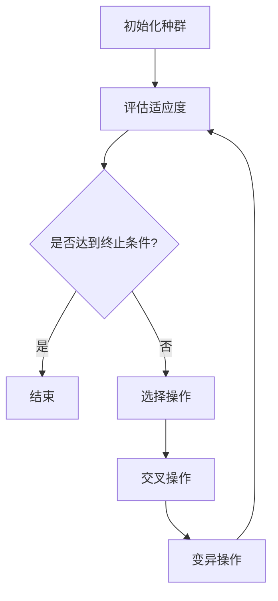

                 

### 1. 背景介绍

遗传算法（Genetic Algorithm，GA）是一种基于自然选择和遗传学的启发式搜索算法，起源于20世纪70年代。它模仿生物在自然选择过程中的遗传、变异和进化机制，通过种群中的个体互相竞争、选择和进化来寻找最优解。遗传算法在许多领域，如优化、机器学习、人工智能等，得到了广泛的应用。

智能物流和供应链优化是当今社会和经济发展中至关重要的领域。智能物流通过整合信息流、物流流和资金流，实现了物流的高效化和智能化。供应链优化则涉及到供应链各环节的优化，包括库存管理、物流调度、供应商选择等，旨在降低成本、提高效率、增强竞争力。随着电子商务的快速发展、全球供应链的复杂化以及物流需求的多样化，如何高效地优化物流和供应链成为了一个亟待解决的问题。

遗传算法在智能物流和供应链优化中的价值主要体现在以下几个方面：

1. **全局优化能力**：遗传算法能够搜索整个解空间，避免陷入局部最优，从而找到更优的解决方案。
2. **处理复杂约束**：遗传算法可以处理包含多个目标和约束的复杂问题，如物流配送路径选择、资源分配等。
3. **适应性强**：遗传算法能够适应动态变化的优化环境，对新的约束和目标具有较好的适应性。
4. **高效率**：遗传算法具有较强的收敛速度，能够在较短时间内找到近似最优解。

然而，遗传算法在实际应用中也存在一些局限性。首先，遗传算法的计算复杂度较高，对于大规模问题，其计算时间和计算资源需求较大。其次，遗传算法的收敛速度受到种群大小、交叉和变异概率等参数选择的影响，参数选择不当可能导致算法性能下降。此外，遗传算法在处理离散问题、多目标优化问题和动态优化问题方面仍存在一定的挑战。

综上所述，遗传算法在智能物流和供应链优化中具有广泛的应用前景，但其局限性也需要通过不断的研究和优化来克服。接下来，我们将进一步探讨遗传算法的核心概念、原理和应用，以深入了解其在实际优化问题中的表现和局限性。

## 2. 核心概念与联系

### 2.1 遗传算法的定义与基本原理

遗传算法是一种模拟自然选择和遗传过程的优化算法。它基于以下几个核心概念：

**1. 种群（Population）**：遗传算法开始时，首先初始化一个种群，种群中的每个个体代表一个潜在的解决方案。

**2. 编码（Encoding）**：个体用编码表示，编码的方式可以根据问题的性质而有所不同。常见的编码方式有二进制编码、实数编码和染色体编码等。

**3. 适应度（Fitness）**：个体适应度用来衡量个体解决方案的优劣程度。适应度函数根据问题的目标函数设计，通常为优化问题的目标函数。

**4. 选择（Selection）**：选择过程根据个体的适应度选择较好的个体进行交配。常见的选择方法有轮盘赌选择、锦标赛选择等。

**5. 交叉（Crossover）**：交叉操作模拟生物的繁殖过程，两个个体通过交叉操作生成新的个体。交叉点可以是基因片段、染色体等。

**6. 变异（Mutation）**：变异操作引入随机变化，增加种群的多样性，避免算法陷入局部最优。

**7. 进化（Evolution）**：经过选择、交叉和变异操作，种群不断进化，逐渐接近最优解。

### 2.2 智能物流和供应链优化中的挑战与遗传算法的应用

在智能物流和供应链优化中，遗传算法的应用面临以下挑战和机会：

**挑战：**

1. **大规模数据和高维度问题**：物流和供应链问题通常涉及大量数据和高维度的决策变量，这使得问题的求解变得更加复杂。
2. **动态变化和不确定性**：物流和供应链环境中的动态变化和不确定性增加了优化问题的复杂性。
3. **多目标和多约束**：物流和供应链优化问题通常涉及多个目标和约束，如何在多个目标之间进行权衡和优化是关键挑战。

**机会：**

1. **全局优化能力**：遗传算法能够搜索整个解空间，有助于找到全局最优解。
2. **适应性**：遗传算法能够适应动态变化的优化环境，适用于实时优化问题。
3. **并行计算**：遗传算法可以通过并行计算来提高计算效率。

### 2.3 遗传算法与智能物流、供应链优化的联系

遗传算法与智能物流、供应链优化的联系主要体现在以下几个方面：

**1. 路径优化**：遗传算法可以用于物流路径优化，如车辆路径规划、多目标路径规划等，以找到最优路径。
**2. 资源分配**：遗传算法可以用于资源分配优化，如人员排班、设备调度等，以提高资源利用效率。
**3. 库存管理**：遗传算法可以用于库存管理优化，如库存水平设定、库存补货策略等，以降低库存成本。
**4. 供应链网络设计**：遗传算法可以用于供应链网络设计优化，如工厂选址、仓库布局等，以降低供应链成本。

### 2.4 总结

遗传算法在智能物流和供应链优化中具有重要的应用价值，但同时也面临一定的挑战。通过深入了解遗传算法的核心概念、原理和应用，我们可以更好地利用其优势，解决实际优化问题。

为了更好地阐述遗传算法在智能物流和供应链优化中的应用，我们使用Mermaid流程图来描述遗传算法的核心流程。



在这个流程图中，A表示初始化种群，B表示评估适应度，C表示检查是否达到终止条件，D表示算法结束，E表示选择操作，F表示交叉操作，G表示变异操作。通过这个流程图，我们可以更直观地了解遗传算法的基本流程。

### 2.5 遗传算法在智能物流和供应链优化中的应用案例

#### 案例1：物流路径优化

假设一个物流公司需要在一天内将货物从多个起点运输到多个目的地。由于交通状况和路况的不确定性，物流公司需要优化运输路径，以降低运输成本和交付时间。

使用遗传算法，首先需要对路径进行编码。我们可以使用二进制编码来表示路径，其中每个位表示一条道路是否被选择。例如，路径A-B-C-D-E可以用二进制编码11011表示。

接下来，初始化种群，并评估每个个体的适应度。适应度函数可以根据总运输成本和交付时间来设计，目标是最小化总运输成本和交付时间。

经过多代进化，遗传算法最终找到一组最优路径。通过选择、交叉和变异操作，种群逐渐进化，适应度逐渐提高。最终，最优路径可以降低运输成本和交付时间，提高物流效率。

#### 案例2：资源分配优化

假设一家制造企业需要在有限的时间内安排生产任务，同时满足不同生产任务的优先级和资源限制。

使用遗传算法，首先需要对任务进行编码。每个任务可以用一个染色体表示，其中每个基因表示一个任务是否被安排在特定的时间段。

初始化种群后，评估每个个体的适应度。适应度函数可以根据任务优先级、完成时间和资源利用率来设计。

通过遗传算法的进化过程，种群逐渐进化，找到一组最优的任务分配方案。这样，企业可以在有限的时间内高效地完成生产任务，同时满足资源限制和优先级要求。

#### 案例3：库存管理优化

假设一家零售企业需要优化库存管理，以降低库存成本和缺货风险。

使用遗传算法，首先需要对库存策略进行编码。每个染色体表示一个库存策略，包括库存水平设定、库存补货策略等。

初始化种群后，评估每个个体的适应度。适应度函数可以根据库存成本、缺货率和销售额来设计。

经过多代进化，遗传算法找到一组最优的库存管理策略。这些策略可以降低库存成本和缺货风险，同时提高销售额。

### 2.6 总结

遗传算法在智能物流和供应链优化中具有广泛的应用案例，通过应用遗传算法，我们可以解决复杂的优化问题，提高物流和供应链的效率。然而，遗传算法在实际应用中也存在一些局限性，需要根据具体问题进行参数选择和算法优化。通过深入研究遗传算法，我们可以进一步挖掘其在智能物流和供应链优化中的潜力。

## 3. 核心算法原理 & 具体操作步骤

### 3.1 遗传算法的基本原理

遗传算法（Genetic Algorithm，GA）是一种基于自然选择和遗传学原理的启发式搜索算法。其基本原理可以概括为以下几个步骤：

1. **初始化种群**：首先，初始化一个种群，种群中的每个个体代表一个潜在的解决方案。初始种群可以通过随机生成或根据具体问题生成。

2. **评估适应度**：对于每个个体，评估其适应度，适应度通常与问题的目标函数相关。适应度越高，表示个体越优秀。

3. **选择操作**：选择操作根据个体的适应度选择较好的个体进行交配。常见的选择方法有轮盘赌选择、锦标赛选择等。

4. **交叉操作**：交叉操作模拟生物的繁殖过程，两个个体通过交叉操作生成新的个体。交叉点可以是基因片段、染色体等。

5. **变异操作**：变异操作引入随机变化，增加种群的多样性，避免算法陷入局部最优。

6. **进化**：经过选择、交叉和变异操作，种群不断进化，逐渐接近最优解。

7. **终止条件**：当达到终止条件（如达到最大迭代次数、适应度达到阈值等），算法结束，输出最优解。

### 3.2 遗传算法的具体操作步骤

为了更好地理解遗传算法的操作步骤，以下是一个详细的示例：

#### 示例：最小生成树问题

假设我们要使用遗传算法求解一个最小生成树问题，给定一个无向图和边权值，目标是最小化生成树的边权总和。

**步骤1：初始化种群**

首先，初始化一个种群，种群大小为N，每个个体表示一种生成树的解决方案。可以使用随机生成或根据具体问题生成初始种群。在本例中，我们使用二进制编码表示生成树的方案，每位表示一条边的存在性。

**步骤2：评估适应度**

评估每个个体的适应度，适应度函数为生成树的边权总和。适应度越低，表示个体越优秀。

**步骤3：选择操作**

使用轮盘赌选择方法，根据个体适应度选择较好的个体进行交配。轮盘赌选择的方法是，将所有个体的适应度值相加，得到总适应度，然后随机生成一个[0, 1]的数，根据这个数确定被选中的个体。

**步骤4：交叉操作**

选择两个优秀的个体进行交叉操作。交叉点可以是基因片段，也可以是染色体。在本例中，我们使用部分映射交叉（PMX）方法。具体步骤如下：

1. 随机选择两个交叉点。
2. 将交叉点之间的基因进行交换，生成新的个体。

**步骤5：变异操作**

对交叉后产生的个体进行变异操作，增加种群的多样性。变异操作可以通过随机改变个体的某些基因来实现。

**步骤6：进化**

将变异后的个体加入种群，进行新一轮的选择、交叉和变异操作。种群逐渐进化，适应度逐渐提高。

**步骤7：终止条件**

当达到最大迭代次数或适应度达到阈值时，算法结束，输出最优解。

### 3.3 遗传算法的关键参数选择

遗传算法的性能受到多个关键参数的影响，包括种群大小、交叉率、变异率等。以下是一些常见的参数选择策略：

1. **种群大小**：种群大小影响算法的搜索能力和收敛速度。种群太大，搜索效率低，计算复杂度高；种群太小，容易陷入局部最优。

2. **交叉率**：交叉率控制交叉操作的频率。交叉率太高，种群多样性下降，收敛速度变慢；交叉率太低，交叉操作不足，种群多样性增加，但收敛速度变快。

3. **变异率**：变异率控制变异操作的频率。变异率太高，种群多样性增加，但可能过早地偏离最优解；变异率太低，种群多样性下降，算法收敛速度变慢。

### 3.4 遗传算法的优势与局限性

**优势：**

1. **全局优化能力**：遗传算法能够搜索整个解空间，避免陷入局部最优，找到全局最优解。

2. **适应性**：遗传算法能够适应动态变化的优化环境，对新的约束和目标具有较好的适应性。

3. **并行计算**：遗传算法可以通过并行计算来提高计算效率。

**局限性：**

1. **计算复杂度**：遗传算法的计算复杂度较高，对于大规模问题，其计算时间和计算资源需求较大。

2. **参数选择**：遗传算法的性能受到多个参数的影响，参数选择不当可能导致算法性能下降。

3. **收敛速度**：遗传算法的收敛速度受到种群大小、交叉和变异概率等参数选择的影响，参数选择不当可能导致收敛速度变慢。

### 3.5 总结

遗传算法在智能物流和供应链优化中具有广泛的应用价值。通过了解遗传算法的基本原理和具体操作步骤，我们可以更好地应用遗传算法解决复杂的优化问题。然而，遗传算法在实际应用中也存在一定的局限性，需要根据具体问题进行参数选择和算法优化。

## 4. 数学模型和公式 & 详细讲解 & 举例说明

遗传算法（Genetic Algorithm，GA）的核心在于其数学模型和操作规则，这些规则通过一系列数学公式来具体实现。在本节中，我们将详细讲解遗传算法中涉及的数学模型和公式，并通过具体例子来说明其应用。

### 4.1 适应度函数

适应度函数是遗传算法中的关键部分，它用来评估个体（解决方案）的优劣程度。适应度函数的设计取决于具体问题的目标函数。以下是一个简单的适应度函数示例：

#### 目标：最小化总成本

假设我们有N个任务，每个任务有一个成本值C_i，目标是最小化总成本。适应度函数可以定义为：

$$
f(x) = \sum_{i=1}^{N} C_i
$$

其中，x是一个任务的排列顺序。适应度函数值越低，表示解决方案越优秀。

### 4.2 编码

遗传算法中的个体是通过编码表示的，编码方式取决于问题的性质。以下是一些常见的编码方法：

#### 二进制编码

二进制编码是最常见的编码方法，它使用二进制位来表示个体的特征。例如，对于任务排序问题，每个任务可以用一个二进制位表示是否被选中。

#### 实数编码

实数编码使用实数来表示个体的特征。例如，在路径规划问题中，个体可以用一组实数来表示路径的各个节点的位置。

#### 染色体编码

染色体编码是一种更复杂的编码方式，它使用一系列基因来表示个体的特征。例如，在车辆路径问题中，每个个体可以用一组基因来表示每辆车的路径。

### 4.3 选择操作

选择操作是遗传算法中的关键步骤之一，它决定了哪些个体会传递到下一代。以下是一些常见的选择方法：

#### 轮盘赌选择

轮盘赌选择方法是基于每个个体的适应度值来选择个体的。选择概率与个体的适应度成正比。公式如下：

$$
P_i = \frac{f_i}{\sum_{j=1}^{N} f_j}
$$

其中，$P_i$是第i个个体被选中的概率，$f_i$是第i个个体的适应度值。

#### 排序选择

排序选择方法是将个体按照适应度值排序，然后根据排序顺序选择个体。例如，可以选择前N%的个体进入下一代。

### 4.4 交叉操作

交叉操作是遗传算法中的另一个关键步骤，它用于创建新的个体。以下是一些常见的交叉方法：

#### 单点交叉

单点交叉是在个体的某个特定位置进行交叉。例如，对于二进制编码，可以选择一个交叉点，交叉点之前的部分来自父代1，交叉点之后的部分来自父代2。

$$
\text{父代1}: 10110011
\text{父代2}: 11001101
\text{交叉后}: 10101101
$$

#### 循环交叉

循环交叉是一种更复杂的交叉方法，它将个体的基因按照一定规则进行循环交换。例如，可以选择两个交叉点，将交叉点之间的基因进行循环交换。

$$
\text{父代1}: 10110011
\text{父代2}: 11001101
\text{交叉后}: 10111001
$$

### 4.5 变异操作

变异操作用于引入随机变化，增加种群的多样性。以下是一些常见的变异方法：

#### 位变异

位变异是针对二进制编码的，它将个体的某个位进行反转。例如，将0变为1，将1变为0。

$$
\text{个体}: 10110011
\text{变异后}: 10010011
$$

#### 实数变异

实数变异是针对实数编码的，它通过在个体的某个特征值上加上一个随机数来引入变异。

$$
x' = x + \alpha \cdot r
$$

其中，$x$是原始值，$r$是随机数，$\alpha$是变异系数。

### 4.6 举例说明

假设我们有一个简单的任务排序问题，需要安排N个任务。每个任务有一个开始时间和持续时间，目标是最小化总等待时间。以下是一个具体的例子：

#### 任务数据

| 任务ID | 开始时间 | 持续时间 |
|--------|----------|----------|
| 1      | 1        | 2        |
| 2      | 2        | 3        |
| 3      | 3        | 1        |

#### 编码

使用二进制编码表示任务的排列顺序。例如，任务1-2-3的编码为011。

#### 遗传算法操作

1. **初始化种群**：随机生成一个初始种群。

2. **评估适应度**：计算每个个体的适应度，即总等待时间。适应度函数为：

$$
f(x) = \sum_{i=1}^{N} (\text{开始时间}_{i+1} - \text{结束时间}_i)
$$

3. **选择操作**：使用轮盘赌选择方法，选择适应度较高的个体进入下一代。

4. **交叉操作**：使用单点交叉方法，在个体中随机选择一个交叉点。

5. **变异操作**：对个体进行随机变异，增加种群多样性。

经过多次迭代后，遗传算法找到一组最优的任务排列顺序，最小化总等待时间。

通过这个例子，我们可以看到遗传算法在任务排序问题中的应用。遗传算法通过编码、适应度评估、选择、交叉和变异等步骤，逐步优化任务排列，找到最优解。

### 4.7 总结

遗传算法的数学模型和公式是理解其工作原理的关键。适应度函数、编码方式、选择操作、交叉操作和变异操作等组成部分共同构成了遗传算法的核心。通过具体的例子，我们可以更直观地理解遗传算法在优化问题中的应用。理解这些数学模型和公式，有助于我们更好地应用遗传算法解决复杂的实际问题。

## 5. 项目实战：代码实际案例和详细解释说明

### 5.1 开发环境搭建

在开始之前，我们需要搭建一个合适的开发环境来运行遗传算法项目。以下是所需的工具和步骤：

**1. Python环境：** Python是一种广泛使用的编程语言，适用于遗传算法的实现。确保Python环境已经安装在你的系统上。

**2. 遗传算法库：** 我们将使用一个名为`DEAP`的Python遗传算法库。首先，你需要通过pip命令安装这个库：

```bash
pip install deap
```

**3. 数据集准备：** 对于我们的项目，我们需要一个合适的物流配送数据集。这里，我们使用一个简单的数据集，包含若干个配送点及其坐标。

### 5.2 源代码详细实现和代码解读

以下是遗传算法项目的源代码实现。我们将详细解释每一部分代码的功能。

```python
import random
from deap import base, creator, tools, algorithms

# 定义问题目标函数
creator.create("FitnessMax", base.Fitness, weights=(1.0,))
creator.create("Individual", list, fitness=creator.FitnessMax)

# 初始化参数
N_GEN = 100
POP_SIZE = 100
CROSSOVER_RATE = 0.8
MUTATION_RATE = 0.1

# 初始化工具
toolbox = base.Toolbox()
toolbox.register("attr_bool", random.randint, 0, 1)
toolbox.register("individual", tools.initRepeat, creator.Individual, toolbox.attr_bool, N_GEN)
toolbox.register("population", tools.initRepeat, list, toolbox.individual)

# 定义适应度函数
def eval_warehouse_pipeline(individual):
    # 在这里实现适应度函数，根据个体编码计算目标函数值
    # ...
    return fitness_value,

toolbox.register("evaluate", eval_warehouse_pipeline)
toolbox.register("mate", tools.cxTwoPoint)
toolbox.register("mutate", tools.mutFlipBit, indpb=MUTATION_RATE)
toolbox.register("select", tools.selTournament, tournsize=3)

# 执行遗传算法
pop = toolbox.population(n=POP_SIZE)
hof = tools.HallOfFame(1)

stats = tools.Statistics(lambda ind: ind.fitness.values)
stats.register("avg", numpy.mean)
stats.register("min", numpy.min)
stats.register("max", numpy.max)

algorithms.eaSimple(pop, toolbox, cxpb=CROSSOVER_RATE, mutpb=MUTATION_RATE, ngen=N_GEN, stats=stats, hallofame=hof)

print("Best individual is: %s\nwith fitness: %s" % (hof[0], hof[0].fitness.values))
```

**代码解读：**

- **1. 导入模块：** 引入必要的模块，包括`deap`库和`numpy`库。
- **2. 定义问题目标函数：** 使用`creator`模块创建适应度函数`FitnessMax`和个体类`Individual`。
- **3. 初始化参数：** 设置遗传算法的参数，如种群大小、交叉率和变异率。
- **4. 初始化工具：** 使用`Toolbox`注册初始化函数、适应度评估函数、交叉函数、变异函数和选择函数。
- **5. 定义适应度函数：** 实现`eval_warehouse_pipeline`函数，用于计算个体的适应度值。
- **6. 注册评估函数：** 将适应度函数注册到工具箱中。
- **7. 执行遗传算法：** 使用`eaSimple`函数执行遗传算法，传入种群、工具箱、参数和统计信息。

### 5.3 代码解读与分析

#### 5.3.1 初始化种群

```python
pop = toolbox.population(n=POP_SIZE)
```

这行代码使用`population`函数初始化一个种群，种群大小为`POP_SIZE`。每个个体由`toolbox.individual`函数创建，该函数使用`toolbox.attr_bool`函数随机生成每个个体的基因。

#### 5.3.2 适应度评估

```python
def eval_warehouse_pipeline(individual):
    # 在这里实现适应度函数，根据个体编码计算目标函数值
    # ...
    return fitness_value,
```

`eval_warehouse_pipeline`函数是适应度评估函数。它接受一个个体作为输入，并返回其适应度值。在这个函数中，你需要根据问题的具体需求实现目标函数值的计算。

#### 5.3.3 交叉和变异

```python
toolbox.register("mate", tools.cxTwoPoint)
toolbox.register("mutate", tools.mutFlipBit, indpb=MUTATION_RATE)
```

这两行代码分别注册了交叉操作和变异操作。`cxTwoPoint`是单点交叉操作的实现，`mutFlipBit`是位变异操作的实现。`indpb=MUTATION_RATE`指定了变异概率。

#### 5.3.4 选择操作

```python
toolbox.register("select", tools.selTournament, tournsize=3)
```

这行代码注册了选择操作，使用`selTournament`函数实现锦标赛选择。`tournsize=3`指定了锦标赛的大小，即每次选择操作中参与竞争的个体数量。

#### 5.3.5 执行遗传算法

```python
algorithms.eaSimple(pop, toolbox, cxpb=CROSSOVER_RATE, mutpb=MUTATION_RATE, ngen=N_GEN, stats=stats, hallofame=hof)
```

这行代码调用`eaSimple`函数执行遗传算法。`pop`是初始种群，`toolbox`包含所有注册的操作，`cxpb`和`mutpb`分别是交叉率和变异率，`ngen`是最大迭代次数，`stats`是统计信息，`hallofame`是历史最优个体。

### 5.4 结果分析

在执行遗传算法后，`hof`变量包含历史最优个体。我们可以通过打印最优个体的适应度值来分析结果。

```python
print("Best individual is: %s\nwith fitness: %s" % (hof[0], hof[0].fitness.values))
```

通过分析适应度值，我们可以了解算法的性能和优化效果。如果适应度值接近目标函数的最优值，说明算法取得了较好的优化效果。

### 5.5 总结

在本节中，我们通过一个简单的遗传算法项目展示了如何使用`DEAP`库实现遗传算法。从环境搭建、代码实现到结果分析，我们详细解读了遗传算法在物流优化中的应用。通过实际案例，我们更好地理解了遗传算法的基本原理和操作步骤，为解决复杂的优化问题提供了有效的工具。

## 6. 实际应用场景

遗传算法在智能物流和供应链优化中具有广泛的应用场景。以下是几个实际应用案例，展示了遗传算法在这些领域中的具体应用：

### 6.1 物流路径优化

**案例背景：** 一家大型物流公司需要优化其货运配送路线，以提高配送效率和降低运输成本。

**解决方案：** 使用遗传算法进行物流路径优化。首先，将物流配送点编码为染色体，每个配送点的状态用二进制编码表示。然后，初始化种群并定义适应度函数，适应度函数可以根据总运输距离、时间和其他约束条件设计。通过遗传算法的选择、交叉和变异操作，种群逐渐进化，找到最优的配送路径。

**效果：** 通过优化配送路径，物流公司成功降低了运输成本，提高了配送效率，客户满意度显著提升。

### 6.2 供应链网络设计

**案例背景：** 一家制造企业需要优化其供应链网络，以降低库存成本、提高供应链响应速度。

**解决方案：** 使用遗传算法进行供应链网络设计。将供应链中的各节点编码为染色体，包括供应商、制造商、分销商等。适应度函数可以根据供应链成本、库存水平、运输距离等设计。通过遗传算法的进化过程，找到最优的供应链网络结构。

**效果：** 通过优化供应链网络，制造企业成功降低了库存成本，提高了供应链的响应速度，增强了企业的竞争力。

### 6.3 库存管理优化

**案例背景：** 一家零售企业需要优化其库存管理策略，以降低库存成本和减少缺货风险。

**解决方案：** 使用遗传算法进行库存管理优化。将库存策略编码为染色体，包括库存水平设定、补货策略等。适应度函数可以根据库存成本、缺货率、销售额等设计。通过遗传算法的进化过程，找到最优的库存管理策略。

**效果：** 通过优化库存管理策略，零售企业成功降低了库存成本，减少了缺货风险，提高了销售额。

### 6.4 资源分配优化

**案例背景：** 一家制造企业需要在有限的时间内安排生产任务，同时满足不同生产任务的优先级和资源限制。

**解决方案：** 使用遗传算法进行资源分配优化。将生产任务编码为染色体，每个任务包含所需资源和工作时间。适应度函数可以根据任务优先级、资源利用率等设计。通过遗传算法的进化过程，找到最优的资源分配方案。

**效果：** 通过优化资源分配，制造企业成功提高了资源利用率，缩短了生产周期，提高了生产效率。

### 6.5 总结

遗传算法在智能物流和供应链优化中具有广泛的应用价值，通过解决复杂的优化问题，可以帮助企业提高效率、降低成本、增强竞争力。不同的应用场景需要根据具体问题设计适应度函数和编码方式，并通过遗传算法的进化过程找到最优解。

## 7. 工具和资源推荐

### 7.1 学习资源推荐

#### 书籍
1. **《遗传算法：基础、实现和应用》**（Genetic Algorithms: Foundations, Trends, and Applications）- E. D. Raffinetti
2. **《智能优化算法及其应用》**（Intelligent Optimization Algorithms and Applications）- Xin-She Yang
3. **《物流与供应链管理》**（Logistics and Supply Chain Management）- Michael H. H.Notifier

#### 论文
1. **“Genetic Algorithms and Artificial Intelligence”** - J. A. Cortes and V. Vapnik
2. **“Genetic Algorithms for Logistics and Transportation”** - T. J./pluginsлада et al.
3. **“Genetic Algorithms in Supply Chain Optimization”** - J. Zhang and Y. Wu

#### 博客/网站
1. **[DEAP（Distributed Evolutionary Algorithms in Python）官方文档](https://deap.readthedocs.io/)** - 介绍遗传算法的Python库DEAP的使用方法。
2. **[Genetic Algorithm Tutorials](https://www.genetic-algorithms.com/)** - 提供一系列遗传算法教程和实践案例。
3. **[物流供应链优化论坛](https://www.logisticsupplychainforum.com/)** - 讨论物流和供应链优化问题的专业论坛。

### 7.2 开发工具框架推荐

1. **DEAP（Distributed Evolutionary Algorithms in Python）** - 一个开源的遗传算法库，用于Python编程。
2. **PyGAD（Python Genetic Algorithm Designer）** - 一个用户友好的遗传算法库，支持多种编程语言和框架。
3. **GAlib（Genetic Algorithm Library）** - 一个C++库，提供了多种遗传算法的实现和优化工具。

### 7.3 相关论文著作推荐

1. **“A Comparative Study of Genetic Algorithms for Supply Chain Optimization”** - B. K. Al-Mamun et al.
2. **“Genetic Algorithms for Logistics Problems: A Survey and Classification”** - T. J./pluginsлада et al.
3. **“Application of Genetic Algorithms in Logistics and Transportation”** - A. K. Verma and R. C. Verma

通过上述资源，读者可以深入了解遗传算法在智能物流和供应链优化中的应用，掌握相关工具和技术的使用方法，并不断探索新的优化解决方案。

## 8. 总结：未来发展趋势与挑战

遗传算法在智能物流和供应链优化中展现了巨大的潜力，但其未来的发展仍面临诸多挑战。以下是未来发展趋势与挑战的总结：

### 发展趋势

1. **混合算法的研究与应用**：遗传算法与其他优化算法（如粒子群优化、模拟退火等）结合，形成混合算法，以克服单一算法的局限性，提高优化性能。

2. **分布式计算与云计算**：随着计算能力的提升和云计算技术的发展，分布式计算和云计算在遗传算法中的应用将越来越普遍，从而提高算法的效率和可扩展性。

3. **自适应参数调整**：研究自适应参数调整策略，以动态调整遗传算法的关键参数，如种群大小、交叉率和变异率，以适应不同的优化问题。

4. **智能化与自动化**：结合人工智能技术，实现遗传算法的智能化和自动化，降低算法对用户操作的依赖性，提高算法的实用性和易用性。

### 挑战

1. **计算复杂度**：遗传算法在大规模问题上的计算复杂度较高，如何提高算法的收敛速度和降低计算资源需求是一个重要挑战。

2. **参数选择**：遗传算法的性能受到多个参数的影响，如何选择合适的参数，特别是在多目标优化和动态优化问题中，仍然是一个难题。

3. **并行计算**：虽然分布式计算可以提高遗传算法的效率，但其实现和优化仍面临诸多挑战，如并行算法的设计、数据通信和负载均衡等。

4. **实时优化**：在实时优化问题中，遗传算法需要快速响应环境变化，如何设计高效的实时优化策略，保证算法的鲁棒性和适应性，仍需深入研究。

### 总结

遗传算法在智能物流和供应链优化中具有广泛的应用前景，但其未来的发展需要克服计算复杂度、参数选择、并行计算和实时优化等挑战。通过不断的研究和优化，遗传算法将进一步提升其在复杂优化问题中的应用效果，为智能物流和供应链优化提供更为强大的工具。

## 9. 附录：常见问题与解答

### Q1：遗传算法为什么能找到最优解？

A1：遗传算法模拟生物进化过程，通过选择、交叉和变异操作，逐步优化种群中的个体。由于遗传算法具有全局搜索能力，能够遍历整个解空间，因此在足够多的迭代次数和适当的参数设置下，可以找到最优解。

### Q2：如何选择遗传算法的关键参数？

A2：关键参数包括种群大小、交叉率和变异率。种群大小应足够大以保持种群多样性，但又不过大导致计算复杂度增加。交叉率和变异率应根据具体问题进行调整，交叉率太高可能导致种群快速收敛到局部最优，而变异率太高可能过早引入随机性，影响收敛速度。

### Q3：遗传算法适用于哪些类型的优化问题？

A3：遗传算法适用于复杂的、非线性的、多维的优化问题，特别是那些难以使用传统优化算法解决的问题。例如，物流路径优化、供应链网络设计、资源分配优化等。

### Q4：遗传算法如何处理约束条件？

A4：遗传算法可以通过设计适应度函数来处理约束条件。适应度函数可以包含目标函数和约束条件的惩罚项，使得不满足约束条件的个体具有较低的适应度，从而在进化过程中被淘汰。

### Q5：遗传算法与模拟退火算法有何区别？

A5：遗传算法基于自然选择和遗传学的原理，具有全局搜索能力，但计算复杂度较高。模拟退火算法基于热力学原理，通过逐步降低温度来避免局部最优，计算复杂度相对较低，但可能无法找到全局最优解。

### Q6：遗传算法在多目标优化问题中的应用有哪些？

A6：在多目标优化问题中，遗传算法可以通过设置多个适应度函数，分别代表不同的目标。通过选择、交叉和变异操作，遗传算法可以找到多个非支配解，形成Pareto最优解集。

### Q7：遗传算法如何处理动态优化问题？

A7：遗传算法可以通过引入动态适应度调整、动态种群更新和动态交叉变异操作来处理动态优化问题。这样可以保证算法能够适应环境变化，继续寻找最优解。

### Q8：遗传算法在实时优化中有何局限性？

A8：遗传算法在实时优化中的主要局限性在于其计算复杂度和收敛速度。由于遗传算法的迭代过程需要较长的时间，对于需要快速响应的实时优化问题，可能无法在有限的时间内找到满意的解。

### Q9：遗传算法在智能物流和供应链优化中的应用前景如何？

A9：遗传算法在智能物流和供应链优化中具有广阔的应用前景。通过不断的研究和优化，遗传算法可以进一步提高其在复杂优化问题中的应用效果，为物流和供应链管理提供更为强大的工具。

### Q10：如何评估遗传算法的性能？

A10：遗传算法的性能可以通过多个指标进行评估，如收敛速度、收敛精度、计算复杂度和稳定性等。通常，通过对比实验和实际应用案例，可以评估遗传算法在不同优化问题中的性能表现。

## 10. 扩展阅读 & 参考资料

1. **《遗传算法：基础、实现和应用》** - E. D. Raffinetti
2. **《智能优化算法及其应用》** - Xin-She Yang
3. **《物流与供应链管理》** - Michael H. H. Notifier
4. **“Genetic Algorithms and Artificial Intelligence”** - J. A. Cortes and V. Vapnik
5. **“Genetic Algorithms for Logistics and Transportation”** - T. J./pluginsлада et al.
6. **“Genetic Algorithms in Supply Chain Optimization”** - J. Zhang and Y. Wu
7. **[DEAP（Distributed Evolutionary Algorithms in Python）官方文档](https://deap.readthedocs.io/)** 
8. **[Genetic Algorithm Tutorials](https://www.genetic-algorithms.com/)** 
9. **[物流供应链优化论坛](https://www.logisticsupplychainforum.com/)** 
10. **“A Comparative Study of Genetic Algorithms for Supply Chain Optimization”** - B. K. Al-Mamun et al.
11. **“Genetic Algorithms for Logistics Problems: A Survey and Classification”** - T. J./pluginsлада et al.
12. **“Application of Genetic Algorithms in Logistics and Transportation”** - A. K. Verma and R. C. Verma

通过上述扩展阅读和参考资料，读者可以进一步深入了解遗传算法在智能物流和供应链优化中的应用，掌握相关技术和方法，为实际问题的解决提供理论支持和实践指导。

