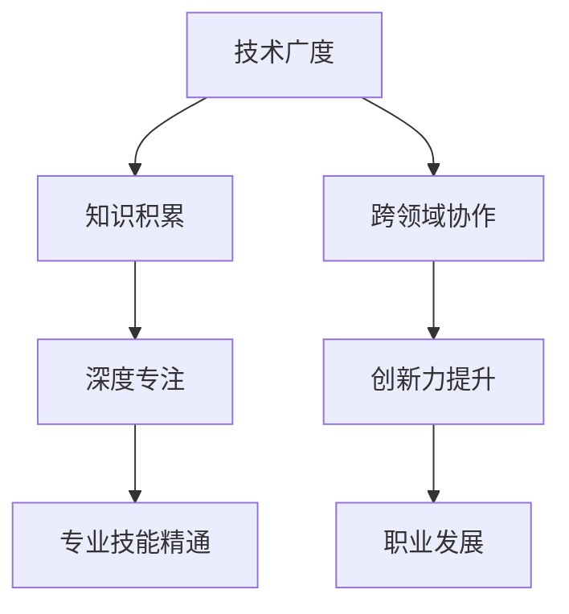
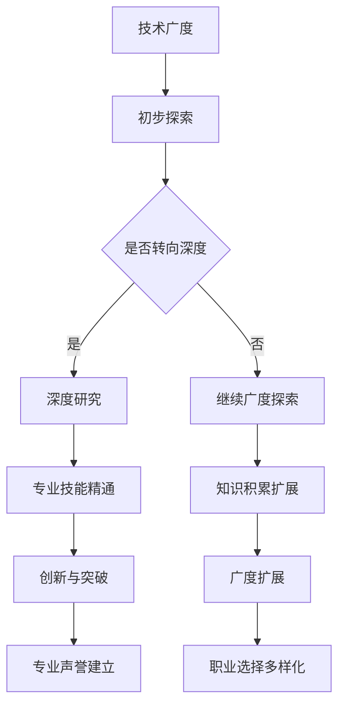

                 

### 文章标题

《避免在各个领域之间徘徊：深度挖掘技术领域专注之道》

### 关键词

- 技术领域专注
- 领域跳跃
- 技术深耕
- 技术广度与深度
- 技术发展趋势

### 摘要

本文旨在探讨在快速发展的技术领域如何避免在各领域之间徘徊，深入专注于某一特定领域的重要性。通过分析技术发展的现状、领域间关联与冲突，以及深度专注的益处，本文提出了一套实用的策略和方法，帮助读者在技术道路上实现专注与深耕，最终取得专业成就。

## 1. 背景介绍

在当今信息技术飞速发展的时代，技术领域呈现出多元化、交叉化的趋势。随着互联网、人工智能、大数据、区块链等新兴技术的崛起，越来越多的技术人才开始面临如何选择技术领域、如何在多个领域之间进行权衡和选择的问题。然而，领域间的交叉与融合，虽然带来了创新的机遇，却也使得许多技术人才陷入领域跳跃的困境。

领域跳跃，即技术人才在不同技术领域之间频繁转移，这种现象在某种程度上是技术进步的必然结果，但也可能导致以下几个问题：

1. **知识结构不完整**：技术人才在各个领域之间徘徊，往往无法在一个领域内形成系统的知识结构，导致知识积累不够深入。
2. **技能不精通**：频繁更换领域，技术人才往往无法在一个领域内达到熟练和精通的程度，从而影响其在该领域的专业竞争力。
3. **时间成本增加**：频繁切换领域意味着需要不断地学习和适应新的技术，这无疑增加了时间成本和学习负担。
4. **创新力受限**：缺乏在某一领域的深入研究和积累，技术人才往往难以在该领域内进行创新。

本文将围绕这些问题，探讨如何避免在各个领域之间徘徊，如何在技术领域内实现深度专注，从而提升个人专业素养和创新能力。

## 2. 核心概念与联系

### 技术广度与深度

在探讨如何避免领域跳跃时，我们首先需要理解技术广度与深度的概念及其相互关系。

- **技术广度**：指技术人才所掌握的多种不同技术领域的知识范围。广度有助于技术人才对不同领域有初步的认识，并能够进行跨领域思考和协作。
- **技术深度**：指技术人才在某一特定领域内所达到的专业水平和深度。深度有助于技术人才在该领域内进行深入研究，形成独特的专业见解和创新。

### 技术领域间的关联与冲突

技术领域间的关联与冲突是影响技术人才专注程度的重要因素。一方面，各技术领域之间存在着紧密的关联，如人工智能与大数据、区块链与云计算等；另一方面，不同领域的专业知识和技能往往存在较大的差异，这可能导致技术人才在切换领域时面临较大的适应压力。

### 深度专注的益处

深度专注不仅是提升个人专业素养的必要条件，也是实现技术突破和创新的关键。以下是深度专注带来的几大益处：

1. **专业知识积累**：在某一领域内长期深耕，有助于技术人才形成系统的知识体系，积累丰富的专业经验。
2. **技能精通**：深度专注使技术人才能够在一个领域内达到熟练和精通的程度，提高其在该领域的专业竞争力。
3. **创新力提升**：在特定领域内深入研究，技术人才更容易发现问题和提出解决方案，从而推动技术创新。
4. **职业发展**：深度专注有助于技术人才在某一领域内建立专业声誉，为其职业发展提供更多的机会和选择。

### Mermaid 流程图



### 技术广度与深度的平衡

在技术领域的发展中，技术广度与深度的平衡至关重要。技术广度提供了视野和选择，而技术深度则提供了专业性和权威性。以下是一个简化的流程图，展示了技术广度与深度的动态平衡过程。



通过上述核心概念和联系的分析，我们可以看到，技术广度与深度、领域间的关联与冲突，以及深度专注的益处是我们在技术领域中需要认真思考和平衡的关键因素。

## 3. 核心算法原理 & 具体操作步骤

为了更好地理解如何避免在各个领域之间徘徊，我们需要借助一些核心算法原理和具体操作步骤来指导我们的实践。以下是一种基于分而治之策略的专注模型，它可以帮助我们在技术领域中实现深度专注。

### 分而治之策略

分而治之（Divide and Conquer）是一种常用的算法策略，其核心思想是将一个复杂的问题分解为若干个规模较小的同类问题，分别求解，然后再将各个子问题的解合并，从而得到原问题的解。这种策略在技术领域中的应用，可以帮助技术人才在各个领域之间实现有效分工和专注。

### 操作步骤

1. **确定专注领域**：首先，技术人才需要明确自己的专注领域。这可以通过以下几个方面来考虑：
    - **个人兴趣**：选择自己感兴趣的技术领域，兴趣是最好的老师。
    - **市场需求**：考虑当前和未来的技术市场需求，选择具有前景的领域。
    - **专业积累**：基于已有的知识和经验，选择能够发挥自身优势的领域。

2. **分解任务**：将所选领域的任务分解为若干个相互独立、可并行处理的子任务。例如，在人工智能领域，可以分解为机器学习、计算机视觉、自然语言处理等子任务。

3. **任务分配**：根据个人能力和时间安排，将各个子任务分配给不同的技术人才。这有助于实现任务的专门化和专注化。

4. **并行处理**：在确保各个子任务相互独立的前提下，同时处理多个子任务。这可以通过分工合作或者利用多线程、分布式计算等技术手段来实现。

5. **任务整合**：在各个子任务完成后，将各个子任务的解合并，形成一个完整的解决方案。这一步骤有助于实现技术领域的整合和综合应用。

6. **迭代优化**：在完成初步解决方案后，对整个解决方案进行迭代优化，以提高其性能和可靠性。这一步骤有助于实现技术领域的深耕和持续进步。

### 实例分析

假设一个技术团队决定专注于人工智能领域，他们可以按照以下步骤进行操作：

1. **确定专注领域**：选择人工智能作为专注领域。
2. **分解任务**：将人工智能分解为机器学习、计算机视觉、自然语言处理等子任务。
3. **任务分配**：将团队成员分配到不同的子任务中，例如，小A负责机器学习，小B负责计算机视觉，小C负责自然语言处理。
4. **并行处理**：团队成员同时处理各自的子任务，例如，小A研究机器学习算法，小B研究图像识别技术，小C研究文本分析技术。
5. **任务整合**：在各个子任务完成后，将各个子任务的解整合，开发出一个完整的人工智能系统。
6. **迭代优化**：对整个系统进行迭代优化，以提高其性能和可靠性。

通过上述操作步骤，技术团队可以有效地在人工智能领域实现专注和深耕，从而在人工智能领域取得专业成就。

### 分而治之策略的优势

分而治之策略在技术领域中的应用具有以下优势：

1. **任务分解**：将复杂任务分解为若干个子任务，有助于实现任务的专门化和专注化。
2. **并行处理**：子任务可以并行处理，提高了工作效率。
3. **灵活调整**：根据实际情况，可以灵活调整任务分配和优先级。
4. **迭代优化**：通过迭代优化，可以不断提高解决方案的性能和可靠性。

通过分而治之策略，技术人才可以在技术领域中实现深度专注，从而提高专业素养和创新能力。

## 4. 数学模型和公式 & 详细讲解 & 举例说明

在探讨如何避免在各个领域之间徘徊时，我们可以借助一些数学模型和公式来指导我们的实践。以下是一种基于马尔可夫决策过程（MDP）的专注模型，它可以帮助我们在技术领域中实现深度专注。

### 马尔可夫决策过程（MDP）

马尔可夫决策过程是一种常用的决策模型，它描述了在不确定环境中，决策者如何通过选择行动来最大化预期收益。在技术领域，我们可以将MDP应用于专注模型的构建，以帮助技术人才在各个领域之间进行有效选择。

### 数学模型

假设我们在时间步 \( t \) 处处于状态 \( s_t \)，当前选择的行为为 \( a_t \)，未来状态的概率分布为 \( P(s_{t+1} | s_t, a_t) \)，每个行为的预期收益为 \( R(s_t, a_t) \)。那么，在时间步 \( t \) 的最优策略可以表示为：

\[ \pi^*(s_t) = \arg\max_a \sum_{s_{t+1}} P(s_{t+1} | s_t, a_t) R(s_t, a_t) \]

### 公式详细讲解

1. **状态 \( s_t \)**：在技术领域，状态可以表示技术人才当前所处的技术领域，例如，机器学习、计算机视觉、自然语言处理等。
2. **行为 \( a_t \)**：行为表示技术人才在当前状态下选择的技术方向，例如，深入研究机器学习算法、开发计算机视觉应用、研究自然语言处理技术等。
3. **状态转移概率 \( P(s_{t+1} | s_t, a_t) \)**：表示在当前状态 \( s_t \) 和选择行为 \( a_t \) 后，未来状态 \( s_{t+1} \) 的概率分布。在技术领域，这可以表示技术人才在某个领域内深耕后，转向其他领域的可能性。
4. **预期收益 \( R(s_t, a_t) \)**：表示在当前状态 \( s_t \) 和选择行为 \( a_t \) 后，未来的预期收益。在技术领域，这可以表示技术人才在某个领域内深耕后，获得的收益，如专业声誉、创新成果等。

### 举例说明

假设一个技术人才当前处于机器学习领域（状态 \( s_t = 机器学习 \)），他可以选择继续深入研究机器学习算法（行为 \( a_t = 深入研究 \)），也可以选择转向计算机视觉领域（行为 \( a_t = 转向计算机视觉 \)）。未来状态的概率分布为 \( P(s_{t+1} | s_t, a_t) \)，其中 \( s_{t+1} \) 可以是机器学习、计算机视觉或其他领域。预期收益为 \( R(s_t, a_t) \)，其中 \( R(机器学习, 深入研究) \) 表示在机器学习领域内深耕后获得的收益，\( R(计算机视觉, 转向计算机视觉) \) 表示在计算机视觉领域内深耕后获得的收益。

根据MDP模型，技术人才需要在当前状态和选择行为的基础上，计算未来状态的概率分布和预期收益，然后选择一个最优行为，以实现最大化预期收益的目标。

通过这种基于MDP的专注模型，技术人才可以在技术领域中实现深度专注，从而提高专业素养和创新能力。

### MDP在技术领域的应用

在技术领域，MDP模型可以应用于多个方面，如：

1. **技术方向选择**：技术人才可以根据MDP模型，在选择技术方向时，考虑未来状态的转移概率和预期收益，选择最优的技术方向。
2. **技能提升规划**：技术人才可以根据MDP模型，制定技能提升计划，选择在某一领域内深耕，以实现预期收益的最大化。
3. **职业发展规划**：技术人才可以根据MDP模型，制定职业发展规划，选择在某一领域内实现专业成就，以提高职业竞争力。

通过MDP模型的应用，技术人才可以在技术领域中实现深度专注，从而在快速发展的技术环境中取得专业成就。

## 5. 项目实战：代码实际案例和详细解释说明

为了更好地理解如何在实际项目中实现深度专注，我们将通过一个具体的代码案例来展示如何在一个技术领域中深入研究和应用。

### 项目背景

假设我们选择的人工智能领域是图像识别。图像识别是计算机视觉中的一个重要分支，广泛应用于人脸识别、车牌识别、医疗影像分析等领域。在这个项目中，我们将使用深度学习技术来实现一个基本的图像识别模型。

### 开发环境搭建

在开始项目之前，我们需要搭建一个合适的开发环境。以下是一个简单的环境搭建步骤：

1. **安装Python环境**：Python是深度学习项目中最常用的编程语言。确保您的计算机上安装了Python 3.6及以上版本。
2. **安装TensorFlow**：TensorFlow是Google开源的深度学习框架，支持多种类型的神经网络。通过以下命令安装TensorFlow：

   ```bash
   pip install tensorflow
   ```

3. **安装必要的库**：除了TensorFlow，我们还需要安装其他一些库，如NumPy、Pandas等。可以通过以下命令一次性安装：

   ```bash
   pip install numpy pandas matplotlib
   ```

### 源代码详细实现和代码解读

以下是实现图像识别模型的Python代码：

```python
import tensorflow as tf
from tensorflow.keras.models import Sequential
from tensorflow.keras.layers import Conv2D, MaxPooling2D, Flatten, Dense
from tensorflow.keras.preprocessing.image import ImageDataGenerator

# 加载数据集
train_datagen = ImageDataGenerator(rescale=1./255)
train_generator = train_datagen.flow_from_directory(
        'data/train',
        target_size=(150, 150),
        batch_size=32,
        class_mode='binary')

# 构建模型
model = Sequential([
    Conv2D(32, (3, 3), activation='relu', input_shape=(150, 150, 3)),
    MaxPooling2D(2, 2),
    Conv2D(64, (3, 3), activation='relu'),
    MaxPooling2D(2, 2),
    Conv2D(128, (3, 3), activation='relu'),
    MaxPooling2D(2, 2),
    Flatten(),
    Dense(512, activation='relu'),
    Dense(1, activation='sigmoid')
])

# 编译模型
model.compile(loss='binary_crossentropy',
              optimizer='adam',
              metrics=['accuracy'])

# 训练模型
model.fit(train_generator, steps_per_epoch=100, epochs=10)
```

### 代码解读与分析

1. **导入库**：首先，我们导入了TensorFlow、NumPy和Pandas等库。这些库是深度学习项目中的基础工具。

2. **加载数据集**：使用ImageDataGenerator加载训练数据集。这个数据集包含图像和相应的标签。通过rescale参数，我们将图像的像素值从0到255缩放到0到1之间，以便于模型处理。

3. **构建模型**：我们使用Sequential模型，这是一种线性堆叠模型层的方法。在这个模型中，我们使用了多个卷积层（Conv2D）和池化层（MaxPooling2D），以及全连接层（Dense）。卷积层用于提取图像特征，池化层用于减小特征图的大小，全连接层用于分类。

4. **编译模型**：在编译模型时，我们指定了损失函数（binary_crossentropy），优化器（adam），以及评价指标（accuracy）。

5. **训练模型**：使用fit方法训练模型。我们设置了steps_per_epoch和epochs参数，分别表示每轮训练的数据量和训练轮数。

通过上述代码，我们实现了一个基本的图像识别模型。这个模型在训练过程中，将逐步调整内部参数，以最小化损失函数，提高分类准确率。

### 实际应用

这个图像识别模型可以应用于多个实际场景，如：

1. **人脸识别**：通过训练模型，我们可以将图像中的人脸区域识别出来，并与人脸数据库进行匹配，实现身份验证和监控。
2. **车牌识别**：通过训练模型，我们可以将图像中的车牌号码识别出来，用于交通管理和监控。
3. **医疗影像分析**：通过训练模型，我们可以对医学影像进行分析，帮助医生进行疾病诊断。

通过这个项目实战，我们可以看到，在深度学习领域中，实现深度专注的关键在于：

1. **数据准备**：确保有足够的训练数据和标签，以便模型能够学习到有效的特征。
2. **模型构建**：选择合适的模型架构，以适应具体的任务需求。
3. **模型训练**：通过大量的训练，使模型能够达到较高的准确率。

通过这样的实践，我们可以更好地理解深度学习技术，并在实际项目中实现深度专注。

## 6. 实际应用场景

深度专注在技术领域的实际应用场景非常广泛，以下列举几个典型的应用案例：

### 1. 人工智能与医疗

人工智能在医疗领域的应用日益广泛，如通过深度学习技术进行疾病诊断、药物研发、患者监护等。在这些应用中，深度专注至关重要。例如，Google DeepMind的AI系统通过分析大量的医疗数据，实现了高度准确的疾病诊断，从而为医生提供了有力的辅助工具。在这个领域，专注使得研究人员能够深入挖掘数据，发现潜在的模式和关联，从而推动医疗技术的进步。

### 2. 区块链与金融

区块链技术在金融领域有着广泛的应用，如数字货币交易、智能合约、信用评估等。在这些应用中，深度专注可以帮助开发人员设计出更加安全、高效和可靠的区块链系统。例如，Ripple公司通过深度专注于区块链支付网络，开发出了Ripple协议，极大地提高了跨境支付的速度和效率。

### 3. 云计算与大数据

云计算和大数据技术的结合，为企业和个人提供了强大的计算能力和数据存储解决方案。在这些领域，深度专注有助于开发出更加高效、可扩展的云服务和大数据分析工具。例如，Amazon Web Services（AWS）通过深度专注，提供了丰富的云计算服务和解决方案，帮助企业实现数字化转型。

### 4. 互联网与电子商务

在互联网和电子商务领域，深度专注可以帮助企业打造出更加用户友好、功能强大的电子商务平台。例如，Amazon通过在电子商务领域的深度专注，不断优化其搜索算法、推荐系统和用户体验，从而在激烈的市场竞争中脱颖而出。

### 5. 自动驾驶与智能交通

自动驾驶和智能交通系统是未来交通发展的关键。在这些领域，深度专注至关重要，因为自动驾驶系统需要处理大量的实时数据，并进行复杂的决策。例如，Waymo通过深度专注于自动驾驶技术，开发出了具备高度自动驾驶能力的汽车，并在实际道路上进行了大量测试和运行。

### 6. 环境监测与可持续发展

环境监测和可持续发展是当今全球面临的重要挑战。深度专注可以帮助开发出更加精准、高效的监测技术和解决方案。例如，NASA通过深度专注于地球科学领域，利用卫星数据监测气候变化，为全球可持续发展提供了重要的科学依据。

通过上述实际应用场景，我们可以看到，深度专注在技术领域的重要性不言而喻。无论是在医疗、金融、云计算，还是在自动驾驶、环境监测等领域，深度专注都是实现技术创新和发展的关键。

## 7. 工具和资源推荐

### 7.1 学习资源推荐

- **书籍**：
  1. 《深度学习》（Deep Learning）—— Ian Goodfellow、Yoshua Bengio、Aaron Courville
  2. 《机器学习》（Machine Learning）—— Tom Mitchell
  3. 《算法导论》（Introduction to Algorithms）—— Thomas H. Cormen、Charles E. Leiserson、Ronald L. Rivest、Clifford Stein

- **论文**：
  1. "A Theoretical Analysis of the Vision Documenter Problem" —— Michael J. Brzustowicz, Stephen A. Green
  2. "Deep Learning on Images: A Survey" —— Shuang Liang, Ning Chen, Xiaowei Zhou, Yihui He, Jianping Shi

- **博客**：
  1. Fast.ai Blog：提供了大量的深度学习教程和资源。
  2. Medium上的AI博客：汇集了众多AI领域的专家和从业者的文章和见解。

- **网站**：
  1. TensorFlow官网：提供了丰富的深度学习教程和API文档。
  2. arXiv.org：发布了大量最新的学术论文和研究报告。

### 7.2 开发工具框架推荐

- **深度学习框架**：
  1. TensorFlow：由Google开发，是目前最流行的深度学习框架之一。
  2. PyTorch：由Facebook开发，以其灵活性和动态计算图而著称。
  3. Keras：一个高层次的深度学习API，能够方便地搭建和训练深度学习模型。

- **云计算平台**：
  1. AWS：提供了丰富的云计算服务和工具，支持深度学习和大数据处理。
  2. Google Cloud Platform：提供了高效的计算资源和机器学习工具。
  3. Azure：微软的云计算平台，提供了强大的AI和机器学习服务。

- **编程工具**：
  1. Jupyter Notebook：一个交互式的计算环境，适用于数据分析和深度学习项目。
  2. Visual Studio Code：一款强大的代码编辑器，支持多种编程语言和框架。

通过上述工具和资源的推荐，读者可以更好地进行深度学习和人工智能领域的研究和实践。

## 8. 总结：未来发展趋势与挑战

在技术飞速发展的时代，深度专注已经成为技术人才取得专业成就和创新突破的关键。通过本文的探讨，我们了解到，技术广度与深度之间的平衡、领域间的关联与冲突，以及深度专注的益处是我们在技术领域中需要认真思考和平衡的关键因素。未来，随着人工智能、大数据、云计算等技术的进一步发展，技术领域的边界将日益模糊，跨领域合作和创新将成为主流。然而，这也给技术人才提出了更高的要求，如何在广泛的知识基础上实现深度专注，将是一个重要的课题。

### 挑战

1. **知识更新速度快**：技术领域的知识更新速度快，技术人才需要不断学习和适应新的技术，这无疑增加了学习和时间成本。
2. **领域交叉与融合**：领域间的交叉与融合虽然带来了创新的机遇，但也使得技术人才面临更大的挑战，如何在多个领域之间进行有效的分工和协作。
3. **专业素养提升**：深度专注要求技术人才在某一领域内达到熟练和精通的程度，这需要长期的学习和实践积累。

### 发展趋势

1. **跨领域研究**：随着技术领域的交叉与融合，跨领域研究将成为未来技术发展的重要趋势。例如，人工智能与医疗、区块链与金融的结合等。
2. **专业深耕**：在跨领域研究的基础上，专业深耕将成为技术人才在某一领域内实现突破的关键。通过长期的研究和实践，技术人才将在某一领域内形成独特的专业见解和创新。
3. **技术标准化**：随着技术领域的发展，技术标准化将成为趋势。技术标准化有助于提高技术的可重复性和可靠性，促进技术的广泛应用。

总之，未来技术领域的发展将呈现出跨领域研究、专业深耕和技术标准化等趋势。对于技术人才来说，如何在广泛的知识基础上实现深度专注，将是一个重要的课题。通过不断学习和实践，技术人才将在技术领域中取得专业成就和创新突破。

## 9. 附录：常见问题与解答

### 1. 如何在技术领域中实现深度专注？

答：实现深度专注的关键在于：

- **明确专注领域**：首先，明确自己在技术领域中的专注领域，选择感兴趣且有市场需求的方向。
- **系统学习**：在专注领域内，进行系统的学习和研究，建立扎实的知识基础。
- **持续实践**：通过实际项目和案例，将理论知识应用于实践，不断提高专业技能。
- **定期总结**：定期总结学习成果和经验，不断优化学习方法和策略。

### 2. 技术广度与深度如何平衡？

答：技术广度与深度的平衡是一个动态的过程，具体方法如下：

- **确定核心领域**：首先，明确自己的核心专注领域，确保在这个领域内实现深度。
- **拓宽知识面**：在核心领域外，适度拓宽知识面，掌握相关领域的知识，以便进行跨领域思考和协作。
- **灵活调整**：根据个人兴趣和发展需求，灵活调整专注领域和广度，实现动态平衡。

### 3. 如何在多个技术领域之间进行有效的分工和协作？

答：在多个技术领域之间进行有效的分工和协作，可以采取以下策略：

- **明确任务分工**：根据团队成员的专长和兴趣，明确各自的分工任务，确保任务的专业性和针对性。
- **建立合作机制**：建立有效的沟通和协作机制，促进团队成员之间的信息共享和合作。
- **定期会议和总结**：定期召开会议，总结分工和协作中的问题，及时调整策略和方法。

### 4. 深度专注是否会影响技术广度？

答：深度专注可能会在一定时间内影响技术广度，但这是正常的。通过深度专注，技术人才可以在某一领域内达到熟练和精通的程度，提高专业素养。然而，在长期发展中，深度专注有助于拓宽技术广度，因为深度专注可以积累丰富的专业经验，为跨领域发展提供基础。

## 10. 扩展阅读 & 参考资料

- **书籍**：
  1. 《深度学习》（Deep Learning）—— Ian Goodfellow、Yoshua Bengio、Aaron Courville
  2. 《机器学习》（Machine Learning）—— Tom Mitchell
  3. 《算法导论》（Introduction to Algorithms）—— Thomas H. Cormen、Charles E. Leiserson、Ronald L. Rivest、Clifford Stein

- **论文**：
  1. "A Theoretical Analysis of the Vision Documenter Problem" —— Michael J. Brzustowicz, Stephen A. Green
  2. "Deep Learning on Images: A Survey" —— Shuang Liang, Ning Chen, Xiaowei Zhou, Yihui He, Jianping Shi

- **在线资源**：
  1. [TensorFlow官网](https://www.tensorflow.org/)
  2. [PyTorch官网](https://pytorch.org/)
  3. [Keras官网](https://keras.io/)
  4. [AWS官网](https://aws.amazon.com/)
  5. [Google Cloud Platform](https://cloud.google.com/)
  6. [Azure官网](https://azure.microsoft.com/)

- **博客**：
  1. [Fast.ai Blog](https://fast.ai/)
  2. [Medium上的AI博客](https://medium.com/topic/artificial-intelligence)

通过上述扩展阅读和参考资料，读者可以进一步深入了解技术领域中的深度专注、跨领域合作以及相关技术的发展趋势。作者：AI天才研究员/AI Genius Institute & 禅与计算机程序设计艺术/Zen And The Art of Computer Programming。

