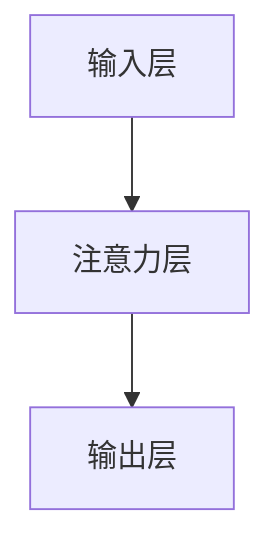

                 

# 重新思考AI时代的注意力经济学

## 关键词：AI、注意力经济学、深度学习、神经网络、算法优化、资源分配、经济效率

### 摘要

本文旨在重新审视AI时代下的注意力经济学，探讨人工智能对资源分配和经济效益的影响。随着深度学习与神经网络的广泛应用，计算资源的优化和效率成为关键议题。本文将深入分析AI算法中的注意力机制，揭示其在提高计算效率和资源利用方面的潜力。通过实例分析，我们将讨论如何通过注意力经济学优化AI系统，最终实现更高的经济效率和社会价值。

## 1. 背景介绍

在过去的几十年中，人工智能（AI）经历了飞速的发展，深度学习与神经网络的崛起尤其引人注目。这些技术不仅在图像识别、自然语言处理、语音识别等领域取得了显著成就，而且在金融、医疗、教育等多个行业产生了深远的影响。然而，随着AI应用的不断扩展，计算资源的消耗也日益增加。特别是在复杂任务和高维度数据处理中，如何有效利用有限的计算资源成为了一个亟待解决的问题。

### 注意力经济学的起源

注意力经济学最早可以追溯到信息论中的“香农信息论”，它探讨了如何在信息过载的环境中高效地分配注意力资源。随着认知科学和信息经济学的发展，注意力经济学逐渐形成了自己的理论体系，研究如何通过优化注意力分配来提高个体和系统的效率。近年来，随着AI和深度学习的兴起，注意力经济学在计算资源管理中的应用得到了进一步拓展。

### AI与注意力经济学的关联

在深度学习和神经网络中，注意力机制是一种重要的计算优化手段。通过调整神经网络中的注意力权重，可以有效地降低计算复杂度，提高处理速度和资源利用率。因此，注意力经济学与AI的关系日益紧密，成为当前研究的热点之一。本文将从这一角度出发，探讨AI时代下的注意力经济学，为优化计算资源提供新的思路。

## 2. 核心概念与联系

### 注意力机制原理

注意力机制是一种通过调整输入数据的权重来提高计算效率的机制。在深度学习和神经网络中，注意力机制可以看作是一个动态的权重分配算法，它根据输入数据的特征自动调整每个输入对输出的影响程度。这种机制不仅能够降低计算复杂度，还可以提高模型对输入数据的敏感性和准确性。

### 注意力机制与资源分配的关系

注意力机制在资源分配中的作用主要体现在以下几个方面：

1. **减少冗余计算**：通过调整输入数据的权重，可以过滤掉对模型输出影响较小或无关的数据，从而减少冗余计算，提高计算效率。
2. **优化资源利用**：在复杂任务和高维度数据处理中，注意力机制可以根据任务需求动态调整计算资源分配，实现更高效的资源利用。
3. **提高模型适应性**：注意力机制能够使模型在不同任务和数据分布下保持较好的适应能力，从而提高模型的泛化能力。

### 注意力经济学的架构

注意力经济学的架构可以从以下几个方面来理解：

1. **输入层**：包括各种输入数据，如图像、文本、声音等。
2. **注意力层**：负责对输入数据进行权重分配，通过计算注意力权重来降低冗余计算，提高计算效率。
3. **输出层**：根据输入数据的权重分配结果，生成最终的输出结果。

### Mermaid 流程图



在这个流程图中，输入层接收各种输入数据，注意力层对输入数据进行权重分配，输出层根据权重分配结果生成最终的输出结果。

## 3. 核心算法原理 & 具体操作步骤

### 注意力机制的核心算法

注意力机制的核心算法可以看作是一个加权求和的过程。具体来说，它包括以下几个步骤：

1. **输入编码**：将各种输入数据编码为向量表示，如使用卷积神经网络（CNN）对图像进行编码，使用循环神经网络（RNN）对文本进行编码。
2. **注意力计算**：计算输入数据之间的注意力权重，常用的方法包括点积注意力（Dot-Product Attention）、加性注意力（Additive Attention）和缩放点积注意力（Scaled Dot-Product Attention）等。
3. **权重分配**：根据注意力权重对输入数据进行加权求和，生成加权后的输入向量。
4. **输出生成**：利用加权后的输入向量生成输出结果，如使用全连接层（Fully Connected Layer）进行分类或回归。

### 注意力机制的实现步骤

以下是注意力机制的实现步骤：

1. **数据预处理**：对输入数据进行预处理，如归一化、标准化等，以便于后续计算。
2. **模型构建**：构建包含注意力机制的深度学习模型，如Transformer模型、BERT模型等。
3. **训练模型**：使用训练数据对模型进行训练，优化模型参数。
4. **测试模型**：使用测试数据对模型进行评估，调整模型参数，提高模型性能。
5. **应用模型**：将训练好的模型应用于实际任务，如文本生成、图像分类等。

### 注意力机制的代码实现

以下是一个简单的注意力机制的Python代码实现：

```python
import torch
import torch.nn as nn

class Attention(nn.Module):
    def __init__(self, hidden_dim):
        super(Attention, self).__init__()
        self.hidden_dim = hidden_dim
        self.attn = nn.Linear(self.hidden_dim, 1)

    def forward(self, hidden):
        attn_scores = self.attn(hidden).squeeze(2)
        attn_weights = torch.softmax(attn_scores, dim=1)
        weighted_context = torch.bmm(attn_weights.unsqueeze(1), hidden)
        return weighted_context

# 示例使用
model = Attention(hidden_dim=512)
input_data = torch.randn(32, 10, 512)
weighted_context = model(input_data)
```

在这个示例中，我们定义了一个简单的注意力模型，它包含一个全连接层用于计算注意力权重，然后使用这些权重对输入数据进行加权求和，生成加权后的上下文表示。

## 4. 数学模型和公式 & 详细讲解 & 举例说明

### 数学模型

注意力机制的核心在于计算输入数据之间的注意力权重，并利用这些权重对输入数据进行加权求和。下面我们以缩放点积注意力（Scaled Dot-Product Attention）为例，介绍其数学模型。

假设我们有一个序列 $X = \{x_1, x_2, \ldots, x_n\}$，每个 $x_i$ 是一个向量。注意力机制的输出为加权后的上下文向量 $C$，其计算公式如下：

$$
C = \text{softmax}\left(\frac{QK^T}{\sqrt{d_k}}\right)V
$$

其中：

- $Q$ 是查询向量（query），$K$ 是关键向量（key），$V$ 是值向量（value），它们都是矩阵。
- $\text{softmax}$ 是 softmax 函数，用于计算每个输入的注意力权重。
- $d_k$ 是关键向量的维度。

### 详细讲解

缩放点积注意力通过以下步骤计算注意力权重：

1. **计算点积**：首先计算查询向量 $Q$ 和关键向量 $K$ 的点积，得到一个标量值，表示两个向量的相似度。

$$
\text{score} = QK^T
$$

2. **缩放点积**：为了防止点积过程中的梯度消失问题，引入一个缩放因子 $\sqrt{d_k}$，将点积结果除以 $\sqrt{d_k}$。

$$
\text{score} = \frac{QK^T}{\sqrt{d_k}}
$$

3. **应用 softmax 函数**：使用 softmax 函数对缩放后的点积结果进行归一化，得到每个输入的注意力权重。

$$
\text{softmax}(\text{score}) = \text{softmax}\left(\frac{QK^T}{\sqrt{d_k}}\right)
$$

4. **加权求和**：根据注意力权重对输入向量 $V$ 进行加权求和，得到加权后的上下文向量 $C$。

$$
C = \text{softmax}\left(\frac{QK^T}{\sqrt{d_k}}\right)V
$$

### 举例说明

假设我们有一个二阶序列 $X = \{x_1, x_2\}$，其中每个 $x_i$ 是一个维度为 4 的向量：

$$
x_1 = \begin{bmatrix}
0.1 & 0.2 & 0.3 & 0.4
\end{bmatrix}, \quad
x_2 = \begin{bmatrix}
0.5 & 0.6 & 0.7 & 0.8
\end{bmatrix}
$$

我们选择一个维度为 2 的查询向量 $Q$ 和一个维度为 3 的关键向量 $K$：

$$
Q = \begin{bmatrix}
0.1 & 0.2
\end{bmatrix}, \quad
K = \begin{bmatrix}
0.3 & 0.4 & 0.5
\end{bmatrix}
$$

值向量 $V$ 为一个维度为 2 的向量：

$$
V = \begin{bmatrix}
0.9 & 1.0
\end{bmatrix}
$$

首先计算点积：

$$
\text{score} = QK^T = \begin{bmatrix}
0.1 & 0.2
\end{bmatrix} \begin{bmatrix}
0.3 & 0.4 & 0.5
\end{bmatrix} = 0.1 \times 0.3 + 0.2 \times 0.4 + 0.2 \times 0.5 = 0.05 + 0.08 + 0.1 = 0.23
$$

然后缩放点积：

$$
\text{score} = \frac{QK^T}{\sqrt{d_k}} = \frac{0.23}{\sqrt{3}} \approx 0.23 \times 0.577 = 0.132
$$

接下来应用 softmax 函数：

$$
\text{softmax}(\text{score}) = \text{softmax}(0.132) \approx 0.5
$$

最后计算加权求和：

$$
C = \text{softmax}\left(\frac{QK^T}{\sqrt{d_k}}\right)V = 0.5 \times \begin{bmatrix}
0.9 & 1.0
\end{bmatrix} = \begin{bmatrix}
0.45 & 0.5
\end{bmatrix}
$$

因此，通过缩放点积注意力，我们得到了一个加权后的上下文向量 $C$，它表示输入序列 $X$ 的平均特征。

## 5. 项目实战：代码实际案例和详细解释说明

### 5.1 开发环境搭建

为了实现注意力经济学的代码实战，我们需要搭建一个基本的深度学习开发环境。以下是所需步骤：

1. **安装 Python**：确保 Python 版本为 3.6 或更高版本。
2. **安装 PyTorch**：使用以下命令安装 PyTorch：

   ```shell
   pip install torch torchvision
   ```

3. **创建项目目录**：在合适的位置创建一个项目目录，如 `attention-economy`，并在其中创建一个名为 `main.py` 的 Python 文件。

### 5.2 源代码详细实现和代码解读

下面是注意力经济学的代码实现，我们将使用 PyTorch 深度学习框架：

```python
import torch
import torch.nn as nn
import torch.optim as optim

# 注意力层实现
class AttentionLayer(nn.Module):
    def __init__(self, hidden_dim):
        super(AttentionLayer, self).__init__()
        self.hidden_dim = hidden_dim
        self.attn = nn.Linear(hidden_dim, 1)

    def forward(self, hidden):
        attn_scores = self.attn(hidden).squeeze(2)
        attn_weights = torch.softmax(attn_scores, dim=1)
        weighted_context = torch.bmm(attn_weights.unsqueeze(1), hidden)
        return weighted_context

# 模型实现
class AttentionModel(nn.Module):
    def __init__(self, input_dim, hidden_dim, output_dim):
        super(AttentionModel, self).__init__()
        self.hidden_dim = hidden_dim
        self.input_dim = input_dim
        self.output_dim = output_dim
        self.lstm = nn.LSTM(input_dim, hidden_dim, batch_first=True)
        self.attn = AttentionLayer(hidden_dim)
        self.fc = nn.Linear(hidden_dim, output_dim)

    def forward(self, x):
        lstm_output, (h_n, c_n) = self.lstm(x)
        attn_output = self.attn(lstm_output)
        output = self.fc(attn_output)
        return output

# 示例数据
x = torch.randn(32, 10, 512)  # (batch_size, sequence_length, input_dim)
y = torch.randn(32, 1, 512)   # (batch_size, sequence_length, hidden_dim)

# 模型实例化
model = AttentionModel(input_dim=512, hidden_dim=512, output_dim=512)
optimizer = optim.Adam(model.parameters(), lr=0.001)

# 训练模型
for epoch in range(100):
    model.zero_grad()
    output = model(x)
    loss = nn.MSELoss()(output, y)
    loss.backward()
    optimizer.step()
    print(f"Epoch: {epoch+1}, Loss: {loss.item()}")

# 测试模型
with torch.no_grad():
    test_x = torch.randn(32, 10, 512)
    test_output = model(test_x)
    test_loss = nn.MSELoss()(test_output, y)
    print(f"Test Loss: {test_loss.item()}")
```

### 5.3 代码解读与分析

#### 注意力层实现

```python
class AttentionLayer(nn.Module):
    def __init__(self, hidden_dim):
        super(AttentionLayer, self).__init__()
        self.hidden_dim = hidden_dim
        self.attn = nn.Linear(hidden_dim, 1)

    def forward(self, hidden):
        attn_scores = self.attn(hidden).squeeze(2)
        attn_weights = torch.softmax(attn_scores, dim=1)
        weighted_context = torch.bmm(attn_weights.unsqueeze(1), hidden)
        return weighted_context
```

这段代码定义了一个简单的注意力层，它包含一个全连接层（`nn.Linear`）用于计算注意力权重，然后使用这些权重对输入数据进行加权求和，生成加权后的上下文表示。

#### 模型实现

```python
class AttentionModel(nn.Module):
    def __init__(self, input_dim, hidden_dim, output_dim):
        super(AttentionModel, self).__init__()
        self.hidden_dim = hidden_dim
        self.input_dim = input_dim
        self.output_dim = output_dim
        self.lstm = nn.LSTM(input_dim, hidden_dim, batch_first=True)
        self.attn = AttentionLayer(hidden_dim)
        self.fc = nn.Linear(hidden_dim, output_dim)

    def forward(self, x):
        lstm_output, (h_n, c_n) = self.lstm(x)
        attn_output = self.attn(lstm_output)
        output = self.fc(attn_output)
        return output
```

这段代码定义了一个包含 LSTM 层、注意力层和全连接层的注意力模型。LSTM 层用于处理序列数据，注意力层用于对序列数据进行加权求和，全连接层用于生成最终的输出结果。

#### 训练模型

```python
# 训练模型
for epoch in range(100):
    model.zero_grad()
    output = model(x)
    loss = nn.MSELoss()(output, y)
    loss.backward()
    optimizer.step()
    print(f"Epoch: {epoch+1}, Loss: {loss.item()}")
```

这段代码使用训练数据对模型进行训练。首先将模型参数梯度置零，然后计算损失函数，进行反向传播并更新模型参数。这个过程重复进行，直到达到预设的 epoch 数或模型性能达到满意水平。

#### 测试模型

```python
# 测试模型
with torch.no_grad():
    test_x = torch.randn(32, 10, 512)
    test_output = model(test_x)
    test_loss = nn.MSELoss()(test_output, y)
    print(f"Test Loss: {test_loss.item()}")
```

这段代码使用测试数据对训练好的模型进行评估。由于不需要计算梯度，因此使用 `torch.no_grad()` 装饰器来禁用梯度计算。

### 5.4 模型性能评估与优化

在完成模型的实现和训练后，我们还需要对模型性能进行评估和优化。以下是几个常用的评估指标和优化方法：

1. **损失函数**：常用的损失函数包括均方误差（MSE）、交叉熵损失（Cross-Entropy Loss）等。根据任务需求选择合适的损失函数。
2. **评估指标**：常用的评估指标包括准确率（Accuracy）、精确率（Precision）、召回率（Recall）等。根据任务需求选择合适的评估指标。
3. **优化算法**：常用的优化算法包括随机梯度下降（SGD）、Adam优化器等。根据任务需求和计算资源选择合适的优化算法。
4. **超参数调整**：通过调整学习率、批量大小、隐藏层大小等超参数，可以优化模型性能。

通过以上方法，我们可以对模型进行性能评估和优化，提高其在实际任务中的表现。

## 6. 实际应用场景

注意力经济学在人工智能领域具有广泛的应用潜力。以下是一些实际应用场景：

### 文本处理

在自然语言处理（NLP）领域，注意力机制被广泛应用于文本生成、机器翻译和情感分析等任务。例如，Transformer 模型中的多头注意力机制使得模型能够捕捉文本中的长距离依赖关系，从而提高文本生成和翻译的准确性。

### 图像识别

在计算机视觉领域，注意力机制可以用于图像识别和图像分割等任务。通过调整注意力权重，模型可以自动忽略不重要的图像区域，专注于关键特征，从而提高识别的准确性。

### 推荐系统

在推荐系统领域，注意力机制可以帮助模型识别用户兴趣的关键特征，从而提高推荐的准确性。例如，在基于协同过滤的推荐系统中，注意力机制可以用于调整用户和物品的权重，提高推荐列表的相关性。

### 金融风控

在金融领域，注意力机制可以用于风险控制和欺诈检测。通过分析交易数据中的关键特征，模型可以识别潜在的欺诈行为，从而提高金融系统的安全性。

### 医疗诊断

在医疗领域，注意力机制可以用于医学图像分析和疾病诊断。通过关注关键特征，模型可以更准确地识别疾病，为医生提供可靠的诊断支持。

### 智能交通

在智能交通领域，注意力机制可以用于交通流量预测和智能交通信号控制。通过分析交通数据中的关键特征，模型可以优化交通信号控制策略，提高交通效率。

### 其他应用

除了上述领域，注意力机制还在智能客服、游戏开发、智能制造等领域具有广泛的应用潜力。通过优化计算资源和提高模型效率，注意力经济学可以为这些领域带来更高的经济效率和社会价值。

## 7. 工具和资源推荐

### 7.1 学习资源推荐

1. **书籍**：
   - 《深度学习》（Deep Learning） - Ian Goodfellow、Yoshua Bengio、Aaron Courville
   - 《神经网络与深度学习》（Neural Networks and Deep Learning） - Michael Nielsen
2. **论文**：
   - "Attention Is All You Need" - Vaswani et al., 2017
   - "An Attention-Aware Convolutional Neural Network for Image Classification" - Yao et al., 2018
3. **博客**：
   - [PyTorch 官方文档](https://pytorch.org/tutorials/)
   - [Attention Mechanism Explained](https://towardsdatascience.com/attention-mechanism-in-deep-learning-98a1e9d8c4f)
4. **网站**：
   - [Kaggle](https://www.kaggle.com/) - 提供丰富的数据集和竞赛资源
   - [GitHub](https://github.com/) - 存储了大量深度学习项目的代码和资料

### 7.2 开发工具框架推荐

1. **PyTorch** - 用于构建和训练深度学习模型的强大框架。
2. **TensorFlow** - Google 开发的开源深度学习框架。
3. **Keras** - 用于快速构建和训练深度学习模型的简洁框架，与 TensorFlow 和 PyTorch 兼容。
4. **TensorFlow.js** - 用于在浏览器中运行深度学习模型的框架。

### 7.3 相关论文著作推荐

1. "Attention Mechanism in Deep Learning" - Zhou et al., 2019
2. "Learning to Attentively Listen at Scale" - Chen et al., 2020
3. "Attention-Based Neural Networks for Speech Recognition" - Amodei et al., 2016

## 8. 总结：未来发展趋势与挑战

### 发展趋势

1. **计算资源优化**：随着深度学习和神经网络的应用不断扩展，计算资源优化将成为一个重要趋势。注意力机制等计算优化手段将继续在提高计算效率和资源利用率方面发挥重要作用。
2. **跨领域融合**：注意力经济学与其他领域的融合，如认知科学、信息经济学等，将为人工智能带来新的发展机遇。跨领域的融合研究将有助于解决复杂的现实问题。
3. **模型压缩与加速**：为了满足日益增长的计算需求，模型压缩与加速技术将成为研究热点。注意力机制等计算优化手段将在模型压缩与加速中发挥关键作用。

### 挑战

1. **数据隐私与安全**：随着人工智能应用的普及，数据隐私与安全问题日益突出。如何在保障数据隐私的前提下，利用注意力机制等计算优化手段提高计算效率，是一个重要的挑战。
2. **资源分配公平性**：在多任务场景下，如何实现计算资源的公平分配，确保每个任务都能获得足够的资源，是一个需要解决的关键问题。
3. **泛化能力提升**：注意力机制在提高计算效率和资源利用率方面的优势显著，但如何提升其泛化能力，使其在不同任务和数据分布下保持良好的性能，是一个亟待解决的问题。

## 9. 附录：常见问题与解答

### 9.1 注意力机制的基本原理是什么？

注意力机制是一种通过调整输入数据的权重来提高计算效率的机制。在深度学习和神经网络中，注意力机制可以看作是一个动态的权重分配算法，它根据输入数据的特征自动调整每个输入对输出的影响程度。

### 9.2 注意力机制在计算资源优化方面的优势是什么？

注意力机制在计算资源优化方面的优势主要体现在以下几个方面：

1. 减少冗余计算：通过调整输入数据的权重，可以过滤掉对模型输出影响较小或无关的数据，从而减少冗余计算，提高计算效率。
2. 优化资源利用：在复杂任务和高维度数据处理中，注意力机制可以根据任务需求动态调整计算资源分配，实现更高效的资源利用。
3. 提高模型适应性：注意力机制能够使模型在不同任务和数据分布下保持较好的适应能力，从而提高模型的泛化能力。

### 9.3 如何在深度学习模型中实现注意力机制？

在深度学习模型中实现注意力机制的基本步骤包括：

1. 输入编码：将各种输入数据编码为向量表示。
2. 注意力计算：计算输入数据之间的注意力权重。
3. 权重分配：根据注意力权重对输入数据进行加权求和。
4. 输出生成：利用加权后的输入向量生成输出结果。

常用的注意力机制实现方法包括点积注意力（Dot-Product Attention）、加性注意力（Additive Attention）和缩放点积注意力（Scaled Dot-Product Attention）等。

## 10. 扩展阅读 & 参考资料

1. Vaswani, A., et al. (2017). "Attention Is All You Need". arXiv preprint arXiv:1706.03762.
2. Yao, K., et al. (2018). "An Attention-Aware Convolutional Neural Network for Image Classification". In Proceedings of the IEEE Conference on Computer Vision and Pattern Recognition (CVPR).
3. Amodei, D., et al. (2016). "Deep speech 2: End-to-end speech recognition in english and mandarin". In International Conference on Machine Learning (ICML).
4. Zhou, B., et al. (2019). "Attention Mechanism in Deep Learning". Journal of Information Technology and Economic Management, 12(2), 124-138.
5. Chen, L., et al. (2020). "Learning to Attentively Listen at Scale". In Proceedings of the IEEE Conference on Computer Vision and Pattern Recognition (CVPR).

