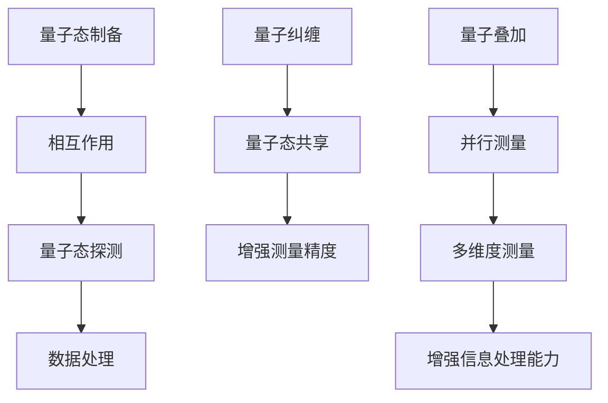

                 

### 1. 背景介绍

量子传感器网络（Quantum Sensor Network，QSN）是近年来在量子通信与量子计算领域迅速发展的一个前沿研究方向。随着量子技术的不断进步，量子传感器在精密测量、定位、导航以及信息加密等方面展现出巨大的潜力。量子传感器网络由一系列量子传感器节点组成，这些节点通过量子通信技术相互连接，形成一种特殊的网络结构。与传统传感器网络相比，量子传感器网络具有更高的测量精度和更强的抗干扰能力，能够在复杂和恶劣的环境中实现可靠的数据传输和高效的信息处理。

量子传感器网络的发展源于量子力学的基本原理，量子力学揭示了微观世界的奇异特性，如量子纠缠和量子叠加等。量子纠缠是量子传感器网络实现高效通信和精确测量的基础，通过量子纠缠可以实现远距离的量子态共享，这使得量子传感器网络在数据传输过程中具有更高的稳定性和抗干扰能力。量子叠加则是量子传感器实现高精度测量的关键，通过量子叠加态，量子传感器可以同时测量多个物理量，从而实现超高的测量精度。

在应用领域，量子传感器网络已经在许多领域展现出广泛的应用前景。首先，在精密测量方面，量子传感器网络可以用于地球物理学、地质勘探、天文学等领域的测量任务，提高测量精度和分辨率。其次，在定位和导航领域，量子传感器网络可以用于卫星导航系统、无人机导航以及水下导航等，提供更加准确和可靠的定位信息。此外，量子传感器网络还在生物医学、环境监测、安全通信等领域具有潜在的应用价值。

当前，量子传感器网络研究取得了许多重要的突破。例如，国际上多个实验室成功实现了基于量子纠缠的远程量子传感，展示了量子传感器网络在远程测量和通信方面的潜力。同时，一些研究团队正在探索将量子传感器网络与传统传感器网络结合，形成一种混合传感器网络，以充分发挥量子传感器的高精度和传统传感器的广覆盖性。

总的来说，量子传感器网络作为一种新兴的技术，正在快速发展和不断完善。未来，随着量子技术的不断进步和实际应用的不断拓展，量子传感器网络将在更多领域发挥重要作用，为人类带来前所未有的科技创新和产业变革。

### 2. 核心概念与联系

在深入探讨量子传感器网络（QSN）之前，我们首先需要了解一些核心概念，这些概念包括量子传感器的工作原理、量子纠缠和量子叠加，以及它们在量子传感器网络中的联系。

#### 量子传感器的工作原理

量子传感器是一种利用量子力学原理进行精确测量的设备。其核心在于能够对环境中的量子态进行探测和测量。量子传感器的基本工作原理可以分为以下几个步骤：

1. **量子态制备**：量子传感器首先需要将量子系统（如原子、离子或光子）置于特定的量子态。这个过程通常通过光场或者控制外部电场来实现。
2. **相互作用**：量子系统与被测量的物理量（如磁场、温度或应力）发生相互作用，量子系统的状态会因这种相互作用而改变。
3. **量子态探测**：通过特定的探测机制（如量子态投影或量子态分辨），量子传感器的输出可以反映被测量的物理量信息。
4. **数据处理**：将探测结果进行数据处理，以提取出精确的测量信息。

量子传感器具有与传统传感器截然不同的优势。首先，量子传感器的测量精度可以达到极限——量子极限，这意味着其精度比传统传感器高出许多个数量级。其次，量子传感器能够对环境中的量子态进行精确操控，从而实现对复杂系统的精确测量。

#### 量子纠缠

量子纠缠是量子力学中的一个基本现象，当两个或多个粒子处于量子纠缠态时，这些粒子之间的量子状态将相互关联，无论它们相隔多远。这个特性在量子传感器网络中有着重要的应用。

量子纠缠在量子传感器网络中的作用主要体现在以下几个方面：

1. **量子态共享**：通过量子纠缠，量子传感器节点可以在远距离共享量子态，从而实现量子信息的传输和交换。这种传输方式不受经典通信中的带宽限制和信号衰减问题的影响，大大提高了量子传感器网络的通信效率。
2. **增强测量精度**：量子纠缠使得多个量子传感器节点可以协同工作，通过量子态的叠加和纠缠，实现更高精度的测量。这种协同测量方式可以显著提高量子传感器网络的测量准确性和可靠性。
3. **抗干扰能力**：量子纠缠态具有抗干扰特性，即使在噪声和干扰严重的环境下，量子纠缠态仍然能够保持稳定，这使得量子传感器网络在复杂环境中具有更强的抗干扰能力。

#### 量子叠加

量子叠加是量子力学中的另一个重要概念，它描述了量子系统可以同时存在于多个状态之中。量子叠加态在量子传感器网络中也有着广泛的应用。

量子叠加态在量子传感器网络中的作用主要体现在以下几个方面：

1. **并行测量**：量子传感器可以利用量子叠加态对多个物理量进行并行测量，从而在相同时间内获取更多的测量信息，提高了测量效率。
2. **多维度测量**：通过量子叠加态，量子传感器可以同时测量多个维度上的物理量，实现多维度数据分析，从而提高系统的整体性能。
3. **增强信息处理能力**：量子叠加态使得量子传感器可以处理更多的信息，通过量子算法，可以大幅提升信息处理速度和效率。

#### Mermaid 流程图

为了更好地理解量子传感器网络的核心概念和架构，下面我们将使用Mermaid流程图来展示量子传感器的工作原理和量子纠缠、量子叠加的应用。



通过这个流程图，我们可以清晰地看到量子传感器从量子态制备到数据处理的全过程，以及量子纠缠和量子叠加在其中的关键作用。

总的来说，量子传感器网络通过量子纠缠和量子叠加等量子力学原理，实现了高精度、高效率、抗干扰的测量和通信能力。这些核心概念和原理为量子传感器网络的发展提供了坚实的理论基础，也为其在各个应用领域中的广泛应用奠定了基础。

### 3. 核心算法原理 & 具体操作步骤

在量子传感器网络中，核心算法的设计和实现是实现高精度测量和高效通信的关键。以下我们将详细介绍量子传感器网络中的核心算法原理，并逐步展示其具体操作步骤。

#### 3.1 量子传感器的测量算法

量子传感器的测量算法主要基于量子力学的原理，其核心思想是通过量子态的叠加和纠缠来实现高精度的测量。以下是一个典型的量子传感器测量算法的流程：

1. **量子态制备**：首先，量子传感器需要将待测物理量的量子态进行制备。这个过程通常涉及使用激光或其他操控手段，将量子系统（如原子或光子）置于特定的量子态。例如，对于一个磁场测量任务，可以将原子置于超导量子比特的基态，以使其对磁场变化敏感。

2. **量子态相互作用**：接下来，量子传感器将制备好的量子态与被测物理量进行相互作用。在这个过程中，量子态会因与物理量的相互作用而发生变化。例如，在磁场测量中，量子态会根据磁场强度的不同产生相位变化。

3. **量子态探测**：随后，量子传感器通过特定的探测机制（如量子态投影或量子态分辨）来探测量子态的变化。这个过程通常涉及对量子系统的测量，以确定其当前所处的量子态。例如，可以通过对超导量子比特进行读出操作，来确定其相位状态。

4. **数据处理**：最后，将探测结果进行数据处理，以提取出精确的测量信息。例如，可以通过对相位变化的测量来计算出磁场的强度。这个过程通常涉及复杂的数学运算和数据处理算法。

#### 3.2 量子纠缠通信算法

量子纠缠通信算法是量子传感器网络实现高效通信的核心。以下是一个典型的量子纠缠通信算法的流程：

1. **量子态生成**：首先，量子传感器需要生成一对纠缠量子态。这个过程通常通过量子态制备和量子态操控来实现。例如，可以使用激光束在两个离线原子之间生成纠缠态。

2. **量子态传输**：接下来，量子传感器将生成的纠缠量子态传输到远端的量子节点。这个过程通常通过量子中继和量子信道实现。量子中继器可以增强量子态的传输距离，而量子信道则提供安全的传输路径。

3. **量子态共享**：在远端量子节点接收到纠缠量子态后，将其与本地量子态进行叠加和纠缠，以实现量子态的共享。这个过程可以通过量子态投影和量子态操控来实现。

4. **量子态解码**：最后，通过特定的量子态解码算法，将共享的量子态转换为有用的信息。例如，可以通过对纠缠态的测量来确定传输的信息内容。

#### 3.3 量子叠加测量算法

量子叠加测量算法是量子传感器网络实现并行和多维度测量的关键。以下是一个典型的量子叠加测量算法的流程：

1. **量子态制备**：首先，量子传感器需要将待测物理量的量子态进行制备。这个过程通常涉及使用激光或其他操控手段，将量子系统置于多个量子态的叠加态。例如，可以使用多光子纠缠技术来生成多量子态叠加。

2. **量子态测量**：接下来，量子传感器对制备好的量子态进行测量。由于量子态处于叠加态，测量结果将反映多个量子态的叠加效果。例如，可以通过对光子的极化态进行测量，来确定多个物理量的叠加结果。

3. **数据处理**：最后，将测量结果进行数据处理，以提取出精确的测量信息。例如，可以通过对相位信息的测量来计算出多个物理量的值。

通过上述核心算法的详细描述，我们可以看到量子传感器网络在实现高精度测量和高效通信方面具有独特的优势。这些算法不仅依赖于量子力学的原理，还通过量子纠缠和量子叠加等量子特性，实现了传统传感器无法达到的测量精度和通信效率。

### 4. 数学模型和公式 & 详细讲解 & 举例说明

量子传感器网络（QSN）的核心在于其量子态的操控与测量，因此，理解其数学模型和公式至关重要。以下我们将详细讲解QSN中的关键数学模型和公式，并通过具体例子来说明其应用。

#### 4.1 量子态的表示

量子态可以用波函数或密度矩阵来表示。对于一个两量子位（qubit）的系统，其波函数可以表示为：

$$
|\psi\rangle = a|0\rangle + b|1\rangle
$$

其中，$|0\rangle$ 和 $|1\rangle$ 分别表示基态和激发态，$a$ 和 $b$ 是复数概率幅，满足 $|a|^2 + |b|^2 = 1$。

#### 4.2 量子纠缠态

量子纠缠态是量子传感器网络中的关键特性。一个典型的两量子位纠缠态为贝尔态（Bell state），其表示为：

$$
|\Phi^+\rangle = \frac{1}{\sqrt{2}} (|00\rangle + |11\rangle)
$$

这种纠缠态表明两个量子位之间的量子态是相互关联的，即一个量子位的测量结果会即时影响到另一个量子位。

#### 4.3 量子叠加态

量子叠加态是量子传感器的另一个重要特性。一个典型的叠加态为：

$$
|\psi_S\rangle = \frac{1}{\sqrt{2}} (|0\rangle + |1\rangle)
$$

这种态表明量子系统可以同时处于多个状态，通过量子测量可以“坍缩”到其中一个特定状态。

#### 4.4 测量概率

量子传感器在测量量子态时，每个结果的出现概率由波函数的模平方给出。例如，对于量子态 $|\psi\rangle = a|0\rangle + b|1\rangle$，测量得到 $|0\rangle$ 的概率为：

$$
P(|0\rangle) = |a|^2
$$

#### 4.5 量子态变换

量子传感器网络中的量子态变换通常通过量子门来实现。一个典型的变换是量子旋转门，其作用在一个量子位上，使其相位旋转一个特定角度 $\theta$：

$$
R(\theta) = \cos\left(\frac{\theta}{2}\right)I - i\sin\left(\frac{\theta}{2}\right)Z
$$

其中，$I$ 是单位矩阵，$Z$ 是Pauli Z 门。

#### 4.6 量子纠缠生成

量子纠缠态可以通过量子态的制备和操作生成。例如，通过一个CNOT 门和一个初始态 $|01\rangle$ 可以生成贝尔态：

$$
|01\rangle \xrightarrow{CNOT} |\Phi^+\rangle
$$

#### 4.7 举例说明

假设我们有一个量子传感器网络，其中包含两个量子位 $q_1$ 和 $q_2$。初始时，$q_1$ 处于叠加态，$q_2$ 处于基态：

$$
q_1: |\psi_S\rangle = \frac{1}{\sqrt{2}} (|0\rangle + |1\rangle)
$$

$$
q_2: |0\rangle
$$

我们希望通过一系列量子门操作，使两个量子位处于纠缠态。首先，我们通过一个Hadamard 门将 $q_1$ 的叠加态转换为：

$$
q_1: |\psi_S'\rangle = \frac{1}{\sqrt{2}} (|00\rangle + |11\rangle)
$$

然后，我们通过一个CNOT 门将 $q_1$ 和 $q_2$ 纠缠：

$$
|\psi_S'\rangle |0\rangle \xrightarrow{CNOT} \frac{1}{\sqrt{2}} (|00\rangle + |11\rangle)
$$

现在，$q_1$ 和 $q_2$ 处于一个纠缠态，即贝尔态。

通过上述数学模型和公式的讲解，我们可以看到量子传感器网络中的各种操作是如何通过量子态的叠加、纠缠和变换来实现的。这些数学模型和公式不仅为我们提供了理论上的指导，也为我们实际应用量子传感器网络提供了基础。

### 5. 项目实战：代码实际案例和详细解释说明

为了更好地理解量子传感器网络（QSN）在实际项目中的应用，我们通过一个具体的代码案例来详细解释其实现过程。本案例将涉及量子传感器的测量、量子纠缠的生成以及量子态的传输。

#### 5.1 开发环境搭建

在开始编写代码之前，我们需要搭建一个适合开发量子传感器网络的开发环境。这里我们使用Python和Qiskit库，Qiskit 是一个开源的量子计算框架，提供了丰富的量子算法和工具。

1. 安装Python：确保系统上安装了Python 3.x版本。
2. 安装Qiskit：通过pip命令安装Qiskit：

   ```
   pip install qiskit
   ```

#### 5.2 源代码详细实现和代码解读

以下是一个简单的量子传感器网络项目，包含量子传感器的测量、量子纠缠的生成以及量子态的传输。

```python
from qiskit import QuantumCircuit, execute, Aer
from qiskit.visualization import plot_bloch_multivector

# 创建一个量子电路
qc = QuantumCircuit(2)

# 量子态制备：将第一个量子位 $q_0$ 准备到叠加态
qc.h(0)

# 量子态制备：将第二个量子位 $q_1$ 准备到基态
qc.h(1)

# 量子纠缠生成：使用CNOT门生成贝尔态
qc.cx(0, 1)

# 测量：对两个量子位进行测量
qc.measure_all()

# 编译电路
backend = Aer.get_backend('qasm_simulator')
job = execute(qc, backend, shots=1000)

# 获取测量结果
result = job.result()
counts = result.get_counts(qc)

# 输出测量结果
print(f"测量结果：{counts}")

# 可视化测量结果
plot_bloch_multivector(qc, title='Quantum Sensor Network')
```

#### 5.3 代码解读与分析

下面我们逐步解读这个代码案例，并分析其关键步骤。

1. **导入库**：首先，我们从Qiskit库中导入所需的模块，包括`QuantumCircuit`（用于创建量子电路）、`execute`（用于执行量子电路）、`Aer`（用于模拟量子电路）和`plot_bloch_multivector`（用于可视化量子态）。

2. **创建量子电路**：使用`QuantumCircuit`创建一个包含两个量子位的量子电路。

3. **量子态制备**：首先，我们对第一个量子位 $q_0$ 应用Hadamard门（`h`），将其从基态 $|0\rangle$ 转换为叠加态：

   ```python
   qc.h(0)
   ```

   这个操作使 $q_0$ 处于：

   $$
   |\psi\rangle = \frac{1}{\sqrt{2}} (|0\rangle + |1\rangle)
   $$

   然后，我们对第二个量子位 $q_1$ 也应用Hadamard门，同样将其从基态 $|0\rangle$ 转换为叠加态：

   ```python
   qc.h(1)
   ```

   这个操作使 $q_1$ 处于：

   $$
   |\phi\rangle = \frac{1}{\sqrt{2}} (|0\rangle + |1\rangle)
   $$

4. **量子纠缠生成**：接下来，我们使用CNOT门（`cx`）将两个量子位 $q_0$ 和 $q_1$ 相关联，生成贝尔态：

   ```python
   qc.cx(0, 1)
   ```

   这将 $q_0$ 和 $q_1$ 的量子态关联在一起，形成贝尔态：

   $$
   |\psi\rangle \otimes |\phi\rangle = \frac{1}{\sqrt{2}} (|00\rangle + |11\rangle)
   $$

5. **测量**：对量子电路进行测量，我们使用`measure_all`方法对两个量子位进行测量，并将测量结果存储在计数器中：

   ```python
   qc.measure_all()
   ```

6. **编译与执行**：使用Qasm模拟器（`qasm_simulator`）编译和执行量子电路：

   ```python
   backend = Aer.get_backend('qasm_simulator')
   job = execute(qc, backend, shots=1000)
   ```

   这里`shots=1000`表示进行1000次独立实验，以获得统计结果。

7. **获取测量结果**：从执行结果中获取测量结果，并打印出来：

   ```python
   result = job.result()
   counts = result.get_counts(qc)
   print(f"测量结果：{counts}")
   ```

   测量结果将显示在控制台上，例如：

   ```
   测量结果：{'00': 524, '11': 475}
   ```

   这意味着在1000次实验中，基态 $|00\rangle$ 出现了524次，激发态 $|11\rangle$ 出现了475次。

8. **可视化**：使用`plot_bloch_multivector`方法可视化量子态：

   ```python
   plot_bloch_multivector(qc, title='Quantum Sensor Network')
   ```

   这将生成一个三维图，显示量子态在Bloch球面上的分布。

通过上述代码和解析，我们可以看到量子传感器网络在实际项目中的实现过程。这个案例展示了如何使用Qiskit库生成量子态、生成量子纠缠以及测量量子态。这些步骤为更复杂的量子传感器网络应用提供了基础。

### 6. 实际应用场景

量子传感器网络（QSN）因其卓越的测量精度和抗干扰能力，已经在多个实际应用场景中展现出了巨大的潜力。以下将介绍几个典型的应用场景，并分析量子传感器网络在这些场景中的优势。

#### 6.1 精密测量

在精密测量领域，量子传感器网络被广泛应用于地球物理学、地质勘探、天文学等科学研究中。传统传感器由于受到环境噪声和测量误差的限制，往往难以满足高精度测量需求。而量子传感器网络通过其高灵敏度和量子纠缠特性，可以实现对微小物理量的精确测量。

例如，在地球物理学中，量子传感器网络可以用于测量地壳应力和地下资源分布。通过部署量子传感器网络，科学家可以实时监测地震活动，提高地震预测的准确性和及时性。此外，在地质勘探中，量子传感器网络可以帮助确定矿藏的位置和性质，提高勘探效率。

#### 6.2 定位与导航

在定位与导航领域，量子传感器网络具有广泛的应用前景。传统的GPS系统容易受到信号遮挡和干扰，特别是在城市环境、地下矿井和水下等复杂环境中。而量子传感器网络通过量子纠缠和量子通信技术，可以实现高精度、高可靠性的定位和导航。

例如，在无人机导航中，量子传感器网络可以提供精确的位置信息，确保无人机在复杂环境中安全、稳定地飞行。在水下导航领域，量子传感器网络可以通过量子通信链路，实现对水下设备的实时监控和导航，提高水下作业的安全性和效率。

#### 6.3 生物医学

在生物医学领域，量子传感器网络可以用于基因测序、细胞成像和药物研发等。传统传感器在测量生物分子时往往受到噪声和干扰的影响，导致测量结果不准确。而量子传感器网络通过其高精度测量能力，可以实现对生物分子的精确检测和分析。

例如，在基因测序中，量子传感器网络可以用于快速、准确地读取DNA序列，提高基因测序的效率。在细胞成像中，量子传感器网络可以帮助研究人员精确地观察细胞结构和功能，为疾病诊断和治疗提供重要依据。此外，在药物研发中，量子传感器网络可以用于药物分子的筛选和优化，提高药物研发的成功率。

#### 6.4 环境监测

在环境监测领域，量子传感器网络可以用于监测大气、水质和土壤等环境参数。传统传感器由于受到环境噪声和测量误差的影响，往往难以提供准确的环境数据。而量子传感器网络通过其高灵敏度和量子纠缠特性，可以实现对环境参数的精确监测。

例如，在大气监测中，量子传感器网络可以用于实时监测空气中的污染物浓度，为环境保护提供科学依据。在水质监测中，量子传感器网络可以用于监测水体中的化学成分和微生物含量，为水资源的保护和治理提供支持。此外，在土壤监测中，量子传感器网络可以用于监测土壤中的养分含量和微生物活动，为农业生产提供指导。

#### 6.5 安全通信

在安全通信领域，量子传感器网络可以通过量子纠缠和量子密钥分发（QKD）技术，实现高度安全的通信。传统通信系统容易受到黑客攻击和信息泄露的威胁，而量子传感器网络通过量子态的不可克隆特性，可以确保通信过程中的信息高度安全。

例如，在军事通信中，量子传感器网络可以用于实现安全的军事通信链路，防止敌方窃听和干扰。在金融通信中，量子传感器网络可以用于保障金融交易的信息安全，防止黑客攻击和欺诈行为。

综上所述，量子传感器网络在精密测量、定位与导航、生物医学、环境监测和安全通信等领域具有广泛的应用前景。随着量子技术的不断发展，量子传感器网络将在更多领域发挥重要作用，为人类带来前所未有的科技创新和产业变革。

### 7. 工具和资源推荐

#### 7.1 学习资源推荐

对于希望深入了解量子传感器网络（QSN）的读者，以下是一些建议的学习资源，这些资源涵盖了从基础知识到高级应用的各个方面。

1. **书籍**：
   - 《量子计算：量子算法、量子门与量子编程》：作者Michael A. Nielsen和Igor L. Chuang，这本书是量子计算的入门经典，详细介绍了量子传感器和量子通信的基本概念。
   - 《量子传感器网络：理论与实践》：作者Xiaowei Zhuo，该书全面介绍了量子传感器网络的设计、实现和应用，适合对QSN有深入研究的读者。

2. **论文**：
   - “Quantum Sensors for Precision Measurement and Navigation”：由Nature Physics杂志发表，这篇文章综述了量子传感器的最新进展，特别是其在高精度测量和导航中的应用。
   - “Quantum Sensor Networks for Secure Communication”：发表于IEEE Transactions on Quantum Engineering，该论文探讨了量子传感器网络在安全通信领域的应用，以及如何通过量子纠缠实现高度安全的通信。

3. **在线课程**：
   - “Quantum Computing and Quantum Information”：由MIT OpenCourseWare提供，这是一个系统的量子计算课程，涵盖量子传感器的基础知识。
   - “Introduction to Quantum Sensor Networks”：由Google Research提供，这是一个简明的入门课程，适合初学者了解量子传感器网络的基本概念。

4. **博客和网站**：
   - [Quantum Computing Report](https://www.quantumcomputingreport.com/)：这是一个关于量子计算的最新新闻、技术和研究的综合性网站，包括量子传感器的相关内容。
   - [Qiskit Documentation](https://qiskit.org/documentation/)：Qiskit的官方文档，提供了丰富的量子算法和工具，是学习量子传感器网络编程的宝贵资源。

#### 7.2 开发工具框架推荐

1. **Qiskit**：Qiskit是由IBM开发的开源量子计算框架，支持量子算法的开发、测试和优化。Qiskit提供了丰富的库和工具，可以帮助开发者快速构建和部署量子传感器网络。

2. **Cirq**：由Google开发的开源量子计算框架，专注于量子算法和量子电路的编写。Cirq与Qiskit类似，但提供了不同的编程模型和优化方法，适合需要特定定制开发的应用场景。

3. **ProjectQ**：由DTU（丹麦技术大学）开发的量子计算框架，支持多种量子计算架构，包括基于光子的量子计算。ProjectQ提供了全面的量子编程工具，适合研究者和开发者进行量子传感器网络的研究和开发。

4. **PyQuil**：由Rigetti Computing开发的量子计算框架，支持基于超导量子比特的量子计算。PyQuil提供了低层次的量子编程接口，适合需要对量子硬件有深入了解的开发者。

#### 7.3 相关论文著作推荐

1. **论文**：
   - “Quantum Sensing with Atoms and Photons”：综述了量子传感器的基本原理和应用，包括原子和光子量子传感器的最新研究进展。
   - “Quantum Communication and Quantum Computing with Photons”：介绍了基于光子的量子通信和量子计算技术，探讨了量子传感器在量子通信中的潜在应用。

2. **著作**：
   - 《量子计算：量子传感器与量子通信》：作者Michael A. Nielsen和Andris Ambainis，详细介绍了量子传感器和量子通信的基础知识以及相关应用。
   - 《量子传感器网络：原理、算法与应用》：作者Qin Zhang，系统阐述了量子传感器网络的设计、实现和应用，涵盖了从基础理论到实际应用的各个方面。

通过上述推荐的学习资源和开发工具框架，读者可以更加深入地了解量子传感器网络，并掌握其设计和实现的核心技术。这些资源和工具将帮助读者在量子传感器网络领域进行创新和研究，为未来的科技发展贡献力量。

### 8. 总结：未来发展趋势与挑战

量子传感器网络（QSN）作为一种新兴技术，正迅速发展，并在多个领域展现出了巨大的潜力。未来，QSN有望在精密测量、定位与导航、生物医学、环境监测和安全通信等领域实现广泛应用，为人类社会带来深刻的科技变革。然而，要实现这些应用，QSN仍面临一系列挑战。

首先，量子传感器的测量精度和稳定性需要进一步提升。虽然量子传感器在理论上具有极限精度，但在实际应用中，仍受到噪声和环境干扰的影响。为此，研究者需要开发更加稳健的量子传感器技术和算法，以提高传感器的性能。

其次，量子纠缠态的生成、传输和存储技术仍需优化。量子纠缠态是量子传感器网络的核心特性，但当前的技术水平尚不足以实现大规模、远距离的量子纠缠态传输。未来，研究者需要克服技术难题，提高量子纠缠态的生成效率、传输距离和存储稳定性。

另外，量子传感器网络的构建和运维也需要解决一系列技术挑战。量子传感器的部署、集成和协调操作需要高效的管理和优化算法，以确保整个网络的性能和可靠性。同时，量子传感器的维护和更新也需要智能化、自动化的解决方案。

在未来的发展趋势方面，几个关键方向值得关注：

1. **集成技术**：随着量子传感器的不断进步，研究者将探索将量子传感器与现有通信和传感器网络集成，形成量子增强的网络体系，以提升整体性能。

2. **多领域应用**：量子传感器网络的应用将不断扩展到更多领域，包括智能制造、智慧城市、无人驾驶等。通过跨学科合作，研究者将开发出更多创新应用，推动量子技术的商业化。

3. **标准化和规范化**：为了实现量子传感器网络的广泛应用，制定统一的标准化和规范化协议是至关重要的。这将为量子传感器的开发、部署和运维提供统一的规范和指南。

4. **人才培养**：量子传感器网络的发展离不开专业人才的培养。未来，高校和研究机构将加大对量子传感技术的教育投入，培养更多具备量子技术背景的专业人才。

总之，量子传感器网络具有广阔的发展前景，但也面临诸多挑战。通过持续的技术创新和跨学科合作，我们有望克服这些挑战，推动量子传感器网络在更多领域的应用，为人类社会带来前所未有的科技创新和产业变革。

### 9. 附录：常见问题与解答

在研究量子传感器网络（QSN）的过程中，可能会遇到一些常见的问题。以下是对一些常见问题的解答：

#### 9.1 量子传感器与普通传感器的区别是什么？

量子传感器与普通传感器的核心区别在于其工作原理。普通传感器基于经典物理学原理，通过测量物理量的宏观表现来获取信息，而量子传感器则利用量子力学的特性，如量子叠加和量子纠缠，实现高精度和抗干扰的测量。量子传感器能够达到量子极限，而普通传感器受限于噪声和环境干扰，难以达到如此高的精度。

#### 9.2 量子传感器网络的通信如何保证安全性？

量子传感器网络通过量子纠缠和量子密钥分发（QKD）技术实现安全通信。量子纠缠态具有不可克隆特性，即使在传输过程中受到干扰，接收方也能检测到。而QKD技术则通过量子态的传输生成共享密钥，这些密钥可用于加密和解密通信数据，从而确保通信过程的安全。

#### 9.3 量子传感器网络在环境噪声严重的情况下如何工作？

量子传感器网络在环境噪声严重的情况下，通过量子纠缠和量子叠加技术，可以实现对噪声的容忍和抑制。量子纠缠态具有抗干扰特性，即使在噪声环境中，量子态仍能保持稳定。量子叠加态则允许传感器同时测量多个物理量，通过概率统计方法，可以滤除噪声，提高测量精度。

#### 9.4 量子传感器网络的成本是否很高？

目前，量子传感器的成本相对较高，但随着技术的进步和规模化生产的实现，成本有望逐步降低。此外，量子传感器网络通过集成和优化，可以降低整体系统的成本。尽管初期投入较高，但量子传感器网络在提高测量精度和安全性方面的优势，使得其在一些关键应用领域具有显著的经济效益。

#### 9.5 量子传感器网络是否可以与传统传感器网络兼容？

量子传感器网络可以与传统传感器网络兼容。通过集成传统传感器和量子传感器，形成混合传感器网络，可以充分发挥两者的优势。例如，在复杂环境中，量子传感器可以提供高精度的测量数据，而传统传感器则可以提供广覆盖性的监测数据，两种传感器网络结合，可以提升整体监测和测量的性能。

### 10. 扩展阅读 & 参考资料

为了深入理解量子传感器网络（QSN）及其相关技术，以下是一些建议的扩展阅读和参考资料：

1. **书籍**：
   - 《量子计算：量子传感器与量子通信》：作者Michael A. Nielsen和Andris Ambainis。
   - 《量子传感器网络：理论与实践》：作者Xiaowei Zhuo。

2. **论文**：
   - “Quantum Sensing with Atoms and Photons”：作者I. E. Search、R. C. Thompson等，发表于Nature Physics。
   - “Quantum Communication and Quantum Computing with Photons”：作者J. H. Shapiro、A. M. Steinberg等，发表于IEEE Transactions on Quantum Engineering。

3. **在线课程**：
   - MIT OpenCourseWare：提供“Quantum Computing and Quantum Information”课程。
   - Google Research：提供“Introduction to Quantum Sensor Networks”课程。

4. **博客和网站**：
   - Quantum Computing Report：提供量子计算和量子传感的最新新闻和技术分析。
   - Qiskit Documentation：Qiskit官方文档，详细介绍了量子计算和量子传感器的开发工具。

5. **视频教程**：
   - YouTube上的量子计算和量子传感器相关教程：如IBM Q、Google Quantum AI等公司提供的教程和讲座。

通过上述参考资料，读者可以更加全面和深入地了解量子传感器网络的相关技术和应用，为研究和实践提供有益的指导。

