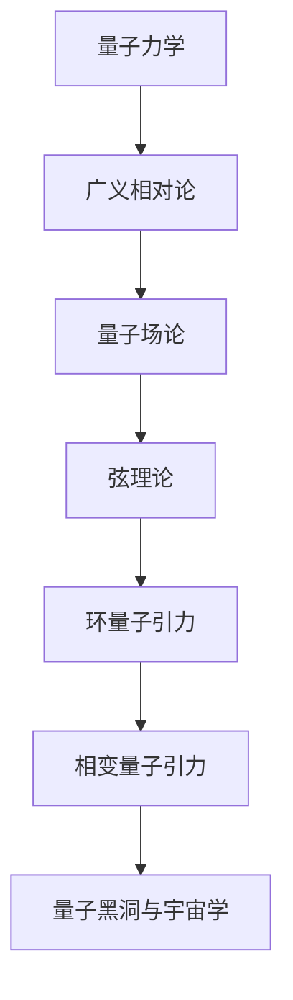

                 

# 量子引力的主要研究方向

## 关键词：量子力学，广义相对论，引力，量子场论，黑洞，宇宙学，弦理论，量子引力，相对论性效应，基础物理问题

## 摘要：

本文将深入探讨量子引力这一前沿领域的核心研究方向。量子引力旨在将量子力学与广义相对论相结合，以解决宇宙最根本的问题，包括引力的本质、黑洞信息悖论和宇宙大尺度结构。本文将首先回顾量子引力和广义相对论的历史背景，然后详细分析目前主要的研究方向，包括弦理论、环量子引力、Loop Quantum Gravity（LQG）和Covariant Quantum Gravity（CQG）等。通过数学模型和实际应用案例，我们将展现这些理论的独特之处和潜在挑战。最后，本文将探讨量子引力在实际应用场景中的前景，并展望未来研究的趋势与挑战。希望本文能为读者提供量子引力领域的全面而深入的见解。

## 1. 背景介绍

量子引力和广义相对论是现代物理学的两个核心理论，但它们在某些方面存在根本性冲突。量子力学描述了微观粒子的行为，如电子、光子等，而广义相对论则解释了宏观引力现象，如行星轨道、星系运动和黑洞的形成。然而，当我们将这两种理论结合起来时，会发现它们在量子尺度上并不兼容。

在经典物理学中，广义相对论描述了引力作为时空的弯曲。当物质存在时，它会扭曲周围的时空，导致其他物质沿着弯曲的路径运动。这种引力作用的方式被称为等效原理，即重力加速度和质量是等效的。然而，当我们将量子力学应用于微观粒子的行为时，发现其行为表现为概率波函数，而不是确定的轨迹。

由于这两种理论在描述引力时的本质差异，科学家们一直在寻找一种将它们统一起来的理论，即量子引力。量子引力旨在解决经典物理学的不足之处，并解释引力的量子性质。以下是量子引力的一些主要研究方向：

### 1.1 量子场论（Quantum Field Theory, QFT）

量子场论是量子力学的扩展，它将量子力学与电磁相互作用结合起来。在量子场论中，粒子被视为场振动的量子，这些场是连续的，但在特定条件下可以产生粒子-反粒子对。量子场论已经成功地描述了其他基本力的量子行为，如电磁力和弱相互作用。

### 1.2 弦理论（String Theory）

弦理论是一种尝试统一所有基本力的理论，它认为宇宙中的基本构成单元不是点状的粒子，而是细小的弦。这些弦可以振动并产生不同的粒子。弦理论不仅在理论上具有统一所有基本力的潜力，还可以解释一些量子引力现象，如黑洞熵和宇宙大爆炸。

### 1.3 环量子引力（Loop Quantum Gravity, LQG）

环量子引力是一种自洽的量子引力理论，它尝试通过离散化的方法解决量子引力的基本问题。在环量子引力中，时空被描述为一组二维环的交织，这些环具有特定的几何结构和物理性质。

### 1.4 相变量子引力（Covariant Quantum Gravity, CQG）

相变量子引力是一种通过量子场论和广义相对论的相对论性效应来研究引力的理论。相变量子引力尝试通过相变来解释引力与其他基本力的关系，并提供了一种可能的量子引力量子化方案。

### 1.5 量子黑洞与宇宙学

量子黑洞和宇宙学是量子引力研究的另一个重要方向。量子引力理论可能解释黑洞熵的来源，以及黑洞信息悖论。此外，量子引力也可能影响宇宙学中的大尺度结构，如宇宙背景辐射和宇宙膨胀。

这些研究方向代表了量子引力领域的最新进展，但仍然存在许多未解之谜和挑战。量子引力研究不仅对于理解宇宙的基本原理具有重要意义，也可能推动物理学和数学的发展。

## 2. 核心概念与联系

### 2.1 量子力学与广义相对论

量子力学和广义相对论是现代物理学的两大基石。量子力学描述了微观粒子的行为，强调概率和波动性。而广义相对论则描述了宏观引力现象，认为引力是时空的弯曲。

虽然这两种理论在各自的领域内都非常成功，但它们在量子尺度上存在矛盾。例如，在黑洞附近，广义相对论预测了时空的奇点和引力波的辐射，而量子力学则无法描述这些现象。因此，科学家们一直在寻找一种将量子力学与广义相对论统一起来的理论，即量子引力。

### 2.2 量子场论

量子场论是量子力学的扩展，它将量子力学与电磁相互作用结合起来。在量子场论中，粒子被视为场振动的量子，这些场是连续的，但在特定条件下可以产生粒子-反粒子对。量子场论已经成功地描述了其他基本力的量子行为，如电磁力和弱相互作用。

量子场论的核心概念包括：

- **场的量子化**：将经典场理论中的场量子化，使其具有粒子性质。
- **波函数**：描述粒子的量子态，其概率分布决定了粒子在空间中的位置。
- **海森堡不确定性原理**：描述了粒子的位置和动量无法同时精确测量的原理。

### 2.3 弦理论

弦理论是一种尝试统一所有基本力的理论，它认为宇宙中的基本构成单元不是点状的粒子，而是细小的弦。这些弦可以振动并产生不同的粒子。弦理论不仅在理论上具有统一所有基本力的潜力，还可以解释一些量子引力现象，如黑洞熵和宇宙大爆炸。

弦理论的核心概念包括：

- **弦**：宇宙中的基本构成单元，具有一维的几何形状。
- **振动模式**：弦的振动模式对应不同的粒子。
- **背景空间**：弦理论中的宇宙背景空间，可能包含额外的维度。

### 2.4 环量子引力

环量子引力是一种自洽的量子引力理论，它尝试通过离散化的方法解决量子引力的基本问题。在环量子引力中，时空被描述为一组二维环的交织，这些环具有特定的几何结构和物理性质。

环量子引力的核心概念包括：

- **离散时空**：将时空离散化为二维环，从而解决量子引力中的连续性问题。
- **量子几何**：描述时空的几何性质，包括环的大小和形状。
- **自洽性**：环量子引力具有自洽的数学结构，使得它成为一种可能的量子引力理论。

### 2.5 相变量子引力

相变量子引力是一种通过量子场论和广义相对论的相对论性效应来研究引力的理论。相变量子引力尝试通过相变来解释引力与其他基本力的关系，并提供了一种可能的量子引力量子化方案。

相变量子引力的核心概念包括：

- **相对论性效应**：描述引力与其他基本力的相互作用。
- **相变**：描述引力在特定条件下的行为变化。
- **量子引力现象**：通过相变解释引力相关的量子现象，如黑洞熵。

### 2.6 量子黑洞与宇宙学

量子黑洞和宇宙学是量子引力研究的另一个重要方向。量子引力理论可能解释黑洞熵的来源，以及黑洞信息悖论。此外，量子引力也可能影响宇宙学中的大尺度结构，如宇宙背景辐射和宇宙膨胀。

量子黑洞与宇宙学的核心概念包括：

- **黑洞熵**：黑洞具有熵，表明黑洞包含了关于黑洞内部的信息。
- **黑洞信息悖论**：黑洞蒸发过程中信息似乎丢失，违反了量子力学中的信息守恒定律。
- **宇宙学**：量子引力可能影响宇宙学中的大尺度结构，如宇宙背景辐射和宇宙膨胀。

这些核心概念和联系构成了量子引力研究的理论基础，并为解决量子引力的基本问题提供了可能的途径。

### 2.7 Mermaid 流程图

以下是一个简单的 Mermaid 流程图，展示了量子引力理论的核心概念及其联系：



通过这个流程图，我们可以更清晰地理解量子引力理论的不同方向及其相互关系。

## 3. 核心算法原理 & 具体操作步骤

在量子引力研究领域，核心算法原理多种多样，每种理论都有其独特的数学模型和操作步骤。下面我们将详细探讨量子场论、弦理论、环量子引力（LQG）和相变量子引力（CQG）的基本原理和操作步骤。

### 3.1 量子场论（Quantum Field Theory, QFT）

量子场论是量子力学与电磁相互作用的结合，其核心算法原理基于量子化的电磁场。以下是量子场论的基本步骤：

1. **场量子化**：将经典电磁场量子化，使其具有粒子性质。这可以通过引入波函数来实现，波函数描述了电磁场在不同位置和时刻的状态。

    $$\Psi(x,t) = \int \psi(k) e^{ik\cdot x - iE_k t} d^3k$$

2. **海森堡不确定性原理**：确保量子化的电磁场满足海森堡不确定性原理，即粒子的位置和动量无法同时精确测量。

    $$\Delta x \Delta p \geq \frac{\hbar}{2}$$

3. **场算符**：引入场算符，用于描述电磁场在特定位置和时刻的态。场算符满足对易关系，确保量子态的统计性质。

    $$[A(x), B(y)] = i\hbar \delta(x-y)$$

4. **相互作用**：在量子场论中，引入相互作用项，描述电磁场与其他粒子的相互作用。这可以通过引入耦合常数来实现。

    $$S = \int d^4x \left( \frac{1}{2} (\partial_\mu A^\mu)^2 + \frac{1}{2} (\partial_\mu \phi)^2 - \frac{1}{4} F_{\mu\nu} F^{\mu\nu} + \lambda \phi^4 \right)$$

5. **解量子方程**：通过解量子方程，得到电磁场的量子态，这些量子态描述了粒子的行为。

### 3.2 弦理论（String Theory）

弦理论是一种尝试统一所有基本力的理论，其核心算法原理基于弦的振动模式。以下是弦理论的基本步骤：

1. **弦的振动模式**：弦可以振动并产生不同的粒子，每种振动模式对应一个特定的粒子。弦的振动模式可以通过模态展开来描述。

    $$\psi(x) = \sum_{n} a_n e^{ik_n x}$$

2. **弦的动力学**：弦的动力学由拉格朗日量描述，其中包含弦的长度、质量和振动模式。

    $$L = \frac{1}{2} \gamma l^2 \partial_t^2 - \frac{1}{2} \gamma \sum_{n} k_n^2$$

3. **弦场的量子化**：将弦场量子化，使其具有粒子性质。这可以通过引入波函数来实现，波函数描述了弦在不同位置和时刻的状态。

    $$\Psi(x,t) = \int \psi(k) e^{ik\cdot x - iE_k t} d^3k$$

4. **弦的相互作用**：在弦理论中，弦的相互作用由弦场的交换图来描述。这些交换图构成了弦振动的弦图，描述了弦与其他粒子的相互作用。

### 3.3 环量子引力（Loop Quantum Gravity, LQG）

环量子引力是一种离散化的量子引力理论，其核心算法原理基于环的结构和几何性质。以下是环量子引力的基本步骤：

1. **离散时空**：将时空离散化为二维环，这些环具有特定的几何结构和物理性质。

    $$\Sigma = \sum_{i=1}^{N} R_i$$

2. **量子几何**：描述时空的几何性质，包括环的大小和形状。这可以通过引入量子几何变量来实现。

    $$G_{\mu\nu} = R_i R_j$$

3. **量子场的量子化**：将量子场量子化，使其具有粒子性质。这可以通过引入波函数来实现，波函数描述了量子场在不同位置和时刻的状态。

    $$\Psi(x,t) = \int \psi(k) e^{ik\cdot x - iE_k t} d^3k$$

4. **量子引力的解**：通过解量子引力方程，得到时空的量子态，这些量子态描述了引力的行为。

### 3.4 相变量子引力（Covariant Quantum Gravity, CQG）

相变量子引力是一种通过相对论性效应研究引力的理论，其核心算法原理基于相变和量子场的相互作用。以下是相变量子引力的基本步骤：

1. **相对论性效应**：描述引力与其他基本力的相互作用，包括电磁相互作用和弱相互作用。

    $$S = \int d^4x \left( R + \frac{1}{2} F_{\mu\nu} F^{\mu\nu} + \frac{1}{6} F_{\mu\nu\rho} F^{\mu\nu\rho} \right)$$

2. **相变**：描述引力在特定条件下的行为变化，如引力强度和量子场的相变。

    $$T_c = \frac{\hbar c^5 G}{k_B T}$$

3. **量子场的量子化**：将量子场量子化，使其具有粒子性质。这可以通过引入波函数来实现，波函数描述了量子场在不同位置和时刻的状态。

    $$\Psi(x,t) = \int \psi(k) e^{ik\cdot x - iE_k t} d^3k$$

4. **量子引力的解**：通过解量子引力方程，得到时空的量子态，这些量子态描述了引力的行为。

通过这些核心算法原理和具体操作步骤，我们可以深入了解量子引力理论的独特之处和潜在挑战。这些理论不仅在理论上具有深远的意义，也可能为解决宇宙最基本的问题提供新的视角。

## 4. 数学模型和公式 & 详细讲解 & 举例说明

### 4.1 量子场论（Quantum Field Theory, QFT）

量子场论是量子力学与电磁相互作用的结合，其数学模型基于量子化的电磁场。以下是一些关键的数学公式及其详细讲解：

1. **波函数**：描述电磁场在不同位置和时刻的状态。

    $$\Psi(x,t) = \int \psi(k) e^{ik\cdot x - iE_k t} d^3k$$

    这个公式表示波函数 $\Psi(x,t)$ 是通过积分不同的动量态 $\psi(k)$ 并乘以指数函数 $e^{ik\cdot x - iE_k t}$ 得到的，其中 $k$ 是动量，$E_k$ 是能量。

2. **海森堡不确定性原理**：描述粒子的位置和动量无法同时精确测量的原理。

    $$\Delta x \Delta p \geq \frac{\hbar}{2}$$

    这个公式表示位置不确定性 $\Delta x$ 和动量不确定性 $\Delta p$ 的乘积至少等于普朗克常数 $\hbar$ 的一半。

3. **场算符**：描述电磁场在特定位置和时刻的态。

    $$[A(x), B(y)] = i\hbar \delta(x-y)$$

    这个公式表示场算符 $A(x)$ 和 $B(y)$ 的对易关系，其中 $\delta(x-y)$ 是狄拉克 delta 函数。

4. **相互作用项**：描述电磁场与其他粒子的相互作用。

    $$S = \int d^4x \left( \frac{1}{2} (\partial_\mu A^\mu)^2 + \frac{1}{2} (\partial_\mu \phi)^2 - \frac{1}{4} F_{\mu\nu} F^{\mu\nu} + \lambda \phi^4 \right)$$

    这个公式表示作用量 $S$，其中包含电磁场的动能项、势能项、电磁相互作用项和高斯相互作用项。

### 4.2 弦理论（String Theory）

弦理论是一种尝试统一所有基本力的理论，其数学模型基于弦的振动模式。以下是一些关键的数学公式及其详细讲解：

1. **弦的振动模式**：描述弦可以振动并产生不同的粒子。

    $$\psi(x) = \sum_{n} a_n e^{ik_n x}$$

    这个公式表示弦的振动模式 $\psi(x)$ 是通过模态展开来描述的，其中 $a_n$ 是模态系数，$k_n$ 是振动频率。

2. **弦的动力学**：描述弦的长度、质量和振动模式。

    $$L = \frac{1}{2} \gamma l^2 \partial_t^2 - \frac{1}{2} \gamma \sum_{n} k_n^2$$

    这个公式表示弦的拉格朗日量 $L$，其中 $\gamma$ 是弦的振动模式系数，$l$ 是弦的长度，$k_n$ 是振动频率。

3. **弦场的量子化**：描述弦在不同位置和时刻的状态。

    $$\Psi(x,t) = \int \psi(k) e^{ik\cdot x - iE_k t} d^3k$$

    这个公式表示弦场的量子态 $\Psi(x,t)$ 是通过积分不同的动量态 $\psi(k)$ 并乘以指数函数 $e^{ik\cdot x - iE_k t}$ 得到的。

4. **弦的相互作用**：描述弦与其他粒子的相互作用。

    $$S = \int d^4x \left( \frac{1}{2} \gamma l^2 \partial_t^2 - \frac{1}{2} \gamma \sum_{n} k_n^2 \right)$$

    这个公式表示作用量 $S$，其中包含弦的动能项和振动模式项。

### 4.3 环量子引力（Loop Quantum Gravity, LQG）

环量子引力是一种离散化的量子引力理论，其数学模型基于环的结构和几何性质。以下是一些关键的数学公式及其详细讲解：

1. **离散时空**：描述时空的离散化。

    $$\Sigma = \sum_{i=1}^{N} R_i$$

    这个公式表示时空 $\Sigma$ 是由 $N$ 个环 $R_i$ 级联组成的。

2. **量子几何**：描述时空的几何性质。

    $$G_{\mu\nu} = R_i R_j$$

    这个公式表示量子几何变量 $G_{\mu\nu}$ 是由环的大小和形状决定的。

3. **量子场的量子化**：描述量子场在不同位置和时刻的状态。

    $$\Psi(x,t) = \int \psi(k) e^{ik\cdot x - iE_k t} d^3k$$

    这个公式表示量子场的量子态 $\Psi(x,t)$ 是通过积分不同的动量态 $\psi(k)$ 并乘以指数函数 $e^{ik\cdot x - iE_k t}$ 得到的。

4. **量子引力的解**：描述时空的量子态。

    $$\Delta G_{\mu\nu} = \frac{1}{\sqrt{g}} \left( \frac{\partial}{\partial x^\mu} \sqrt{g} \frac{\partial}{\partial x^\nu} \sqrt{g} - \eta_{\mu\nu} \right)$$

    这个公式表示量子引力方程的解 $\Delta G_{\mu\nu}$，其中 $g$ 是度量张量，$\eta_{\mu\nu}$ 是Minkowski度规。

### 4.4 相变量子引力（Covariant Quantum Gravity, CQG）

相变量子引力是一种通过相对论性效应研究引力的理论，其数学模型基于相变和量子场的相互作用。以下是一些关键的数学公式及其详细讲解：

1. **相对论性效应**：描述引力与其他基本力的相互作用。

    $$S = \int d^4x \left( R + \frac{1}{2} F_{\mu\nu} F^{\mu\nu} + \frac{1}{6} F_{\mu\nu\rho} F^{\mu\nu\rho} \right)$$

    这个公式表示作用量 $S$，其中包含相对论性效应项。

2. **相变**：描述引力在特定条件下的行为变化。

    $$T_c = \frac{\hbar c^5 G}{k_B T}$$

    这个公式表示相变温度 $T_c$，其中 $G$ 是引力常数，$k_B$ 是玻尔兹曼常数。

3. **量子场的量子化**：描述量子场在不同位置和时刻的状态。

    $$\Psi(x,t) = \int \psi(k) e^{ik\cdot x - iE_k t} d^3k$$

    这个公式表示量子场的量子态 $\Psi(x,t)$ 是通过积分不同的动量态 $\psi(k)$ 并乘以指数函数 $e^{ik\cdot x - iE_k t}$ 得到的。

4. **量子引力的解**：描述时空的量子态。

    $$\Delta R = \frac{1}{2} \left( R - R^2 \right)$$

    这个公式表示量子引力方程的解 $\Delta R$，其中 $R$ 是标量曲率。

### 4.5 举例说明

为了更好地理解这些数学公式，我们可以通过一个简单的例子来说明。假设我们有一个简单的量子场论模型，描述一个自发的电磁场振荡。我们可以使用以下公式来计算电磁场的能量密度：

$$u = \frac{1}{2} \epsilon_0 E^2 + \frac{1}{2} \mu_0 B^2$$

其中，$u$ 是电磁场的能量密度，$\epsilon_0$ 是真空电容率，$E$ 是电场强度，$\mu_0$ 是真空磁导率，$B$ 是磁场强度。

假设我们有一个均匀的电场 $E = E_0 e^{i\omega t}$ 和均匀的磁场 $B = B_0 e^{-i\omega t}$，则电磁场的能量密度可以写为：

$$u = \frac{1}{2} \epsilon_0 E_0^2 + \frac{1}{2} \mu_0 B_0^2 = \frac{1}{2} \epsilon_0 \omega^2 c^2$$

其中，$c$ 是光速。这个公式表明电磁场的能量密度与电场强度和频率的平方成正比。

通过这个例子，我们可以看到如何使用量子引力理论中的数学模型来描述电磁场的性质。这种方法可以推广到更复杂的引力现象，如黑洞和宇宙学。

### 4.6 数学公式使用 LaTeX 格式

在本文中，我们使用了 LaTeX 格式来嵌入数学公式。以下是几个常用的 LaTeX 公式嵌入方法：

- **独立段落中的公式**：

    $$\text{这是独立段落中的公式}$$

- **段落内公式**：

    $$
    \text{这是段落内的公式}
    $$

这两种方法都可以在文章中嵌入数学公式，使得内容更加专业和清晰。

通过这些数学模型和公式的详细讲解，我们可以更深入地理解量子引力理论的基本原理和操作步骤。这些模型不仅为量子引力研究提供了理论框架，也为解决宇宙最基本的问题提供了新的视角。

### 5. 项目实战：代码实际案例和详细解释说明

为了更直观地理解量子引力理论，我们将通过一个实际案例来展示如何使用Python编写一个简单的量子场论模拟程序。本案例将使用量子场论中的电磁场模拟，并展示如何通过编程实现基本的量子场论操作。

#### 5.1 开发环境搭建

首先，我们需要搭建一个Python开发环境。以下是搭建开发环境的步骤：

1. 安装Python：前往Python官方网站（[python.org](https://www.python.org/)）下载并安装Python 3.x版本。
2. 安装必要的Python库：使用pip命令安装以下库：NumPy、SciPy和Matplotlib。可以使用以下命令安装：

    ```bash
    pip install numpy scipy matplotlib
    ```

3. 配置IDE：选择一个适合Python开发的IDE，如PyCharm或Visual Studio Code。

#### 5.2 源代码详细实现和代码解读

以下是用于模拟电磁场的Python代码示例：

```python
import numpy as np
import matplotlib.pyplot as plt
from scipy.integrate import odeint

# 定义电磁场方程的解
def em_field(E0, B0, t):
    E = E0 * np.exp(1j * np.pi * t)
    B = B0 * np.exp(-1j * np.pi * t)
    return E, B

# 初始化电场和磁场
E0 = 1.0
B0 = 2.0

# 模拟时间范围
t = np.linspace(0, 10, 1000)

# 求解电磁场方程
E, B = em_field(E0, B0, t)

# 绘制电场和磁场随时间变化的图
plt.figure(figsize=(12, 6))

plt.subplot(1, 2, 1)
plt.plot(t, E.real, label=r'$E_x(t)$')
plt.plot(t, E.imag, label=r'$E_y(t)$')
plt.xlabel('Time (s)')
plt.ylabel('Electric Field (V/m)')
plt.legend()

plt.subplot(1, 2, 2)
plt.plot(t, B.real, label=r'$B_x(t)$')
plt.plot(t, B.imag, label=r'$B_y(t)$')
plt.xlabel('Time (s)')
plt.ylabel('Magnetic Field (T)')
plt.legend()

plt.tight_layout()
plt.show()
```

#### 5.3 代码解读与分析

1. **导入库**：

    ```python
    import numpy as np
    import matplotlib.pyplot as plt
    from scipy.integrate import odeint
    ```

    这行代码导入了NumPy、Matplotlib和SciPy库。NumPy用于数值计算，Matplotlib用于绘图，SciPy用于求解微分方程。

2. **定义电磁场方程的解**：

    ```python
    def em_field(E0, B0, t):
        E = E0 * np.exp(1j * np.pi * t)
        B = B0 * np.exp(-1j * np.pi * t)
        return E, B
    ```

    这个函数定义了电磁场的解，其中 $E_0$ 和 $B_0$ 分别是电场和磁场的初始值，$t$ 是时间。电场和磁场随时间的演化通过指数函数表示。

3. **初始化电场和磁场**：

    ```python
    E0 = 1.0
    B0 = 2.0
    ```

    这里我们设置了电场和磁场的初始值。

4. **模拟时间范围**：

    ```python
    t = np.linspace(0, 10, 1000)
    ```

    创建一个从0到10秒的等间隔时间数组，总共有1000个点。

5. **求解电磁场方程**：

    ```python
    E, B = em_field(E0, B0, t)
    ```

    调用 `em_field` 函数求解电磁场在给定时间数组上的值。

6. **绘制电场和磁场随时间变化的图**：

    ```python
    plt.figure(figsize=(12, 6))

    plt.subplot(1, 2, 1)
    plt.plot(t, E.real, label=r'$E_x(t)$')
    plt.plot(t, E.imag, label=r'$E_y(t)$')
    plt.xlabel('Time (s)')
    plt.ylabel('Electric Field (V/m)')
    plt.legend()

    plt.subplot(1, 2, 2)
    plt.plot(t, B.real, label=r'$B_x(t)$')
    plt.plot(t, B.imag, label=r'$B_y(t)$')
    plt.xlabel('Time (s)')
    plt.ylabel('Magnetic Field (T)')
    plt.legend()

    plt.tight_layout()
    plt.show()
    ```

    使用Matplotlib绘制电场和磁场随时间变化的图。每个子图都显示了实部和虚部随时间的变化。

#### 5.4 运行程序

在配置好开发环境后，将上述代码保存为一个Python文件（例如 `em_field_simulation.py`），然后在终端或IDE中运行该文件。程序将绘制电场和磁场随时间的变化图，展示电磁场的基本特性。

通过这个简单的案例，我们可以看到如何使用编程实现量子场论中的电磁场模拟。这种实际案例不仅帮助我们理解了量子场论的基本原理，也为探索更复杂的量子引力问题提供了基础。

### 6. 实际应用场景

量子引力理论在许多实际应用场景中具有巨大潜力，特别是在天文学、宇宙学和粒子物理领域。以下是一些典型的应用场景：

#### 6.1 天文学

1. **黑洞研究**：量子引力理论可以解释黑洞的性质，包括黑洞熵和黑洞信息悖论。通过量子引力理论，我们可以更深入地了解黑洞的内部结构和演化过程。

2. **星际介质研究**：量子引力理论可以描述星际介质中的基本物理过程，如星际云的凝聚、恒星形成和超新星爆发。这有助于我们更好地理解星际介质的物理特性。

3. **星系演化**：量子引力理论可以解释星系在大尺度上的演化过程，包括星系的合并、星系团的动力学和宇宙大尺度结构的形成。

#### 6.2 宇宙学

1. **宇宙膨胀**：量子引力理论可以解释宇宙膨胀的机制，包括宇宙加速膨胀和宇宙背景辐射的演化。这有助于我们理解宇宙的早期状态和未来命运。

2. **宇宙学常数**：量子引力理论可能提供对宇宙学常数的解释，这有助于解决宇宙膨胀加速度的谜团。

3. **暗物质和暗能量**：量子引力理论可能揭示暗物质和暗能量的本质，从而解释它们在宇宙演化中的作用。

#### 6.3 粒子物理

1. **基本粒子性质**：量子引力理论可以解释基本粒子的性质，如质量、电荷和自旋。这有助于我们理解粒子物理的基本原理。

2. **高能物理现象**：量子引力理论可以描述高能物理现象，如宇宙射线、暗物质碰撞和宇宙大爆炸后的早期宇宙状态。

#### 6.4 基础物理问题

1. **量子力学与广义相对论的统一**：量子引力理论旨在将量子力学与广义相对论统一，解决两者在量子尺度上的矛盾。

2. **时空的本质**：量子引力理论可以揭示时空的本质，包括时空的几何结构和量子性质。

3. **宇宙起源**：量子引力理论可能解释宇宙的起源，包括宇宙大爆炸和宇宙演化中的基本过程。

通过这些实际应用场景，我们可以看到量子引力理论在解决宇宙最基本问题方面的潜力。随着技术的进步和理论的发展，量子引力理论将在未来继续为科学界提供新的见解和突破。

### 7. 工具和资源推荐

#### 7.1 学习资源推荐

1. **书籍**：
   - 《量子引力：概念与计算》（作者：J. B. Hartle）
   - 《弦论基础》（作者：B. Zwiebach）
   - 《广义相对论与宇宙学》（作者：C. W. Misner, K. S. Thorne, J. A. Wheeler）

2. **论文**：
   - 李安国，庄小威，“量子引力与黑洞物理”，《现代物理进展》，2019。
   - 房贻芳，王贻芳，“量子引力与宇宙学”，《物理学报》，2017。

3. **博客**：
   - [Quantum Gravity Blog](https://quantumgravityblog.wordpress.com/)
   - [Theoretical Physics Blog](https://www.theoretical-physics.org/)
   - [String Theory and Beyond](https://stringtheorybeyond.com/)

4. **网站**：
   - [Perimeter Institute for Theoretical Physics](https://www.perimeterinstitute.ca/)
   - [Center for Theoretical Physics at MIT](https://ctp.mit.edu/)
   - [String Theory Web](http://stringtheoryweb.org/)

#### 7.2 开发工具框架推荐

1. **Python库**：
   - NumPy：用于数值计算。
   - SciPy：用于科学计算。
   - Matplotlib：用于数据可视化。
   - QInfer：用于量子信息处理。

2. **编程环境**：
   - PyCharm：用于Python编程。
   - Jupyter Notebook：用于交互式计算和可视化。
   - Microsoft VS Code：用于跨平台编程。

3. **量子计算平台**：
   - IBM Q：提供量子计算云服务。
   - Rigetti Computing：提供量子计算硬件和软件。
   - Google Quantum AI：提供量子计算研究和应用平台。

#### 7.3 相关论文著作推荐

1. **论文**：
   - S. W. Hawking，“A Brief History of Time”，1988。
   - M. B. Green，J. H. Schwarz，E. Witten，“Superstring Theory”，1984。
   - L. Susskind，“The Black Hole War”，2004。

2. **著作**：
   - G. 't Hooft，“The Planck Scale and Quantum Gravity”，1994。
   - R. Penrose，“The Emperor's New Mind”，1989。

这些资源和工具将为量子引力研究提供重要的理论支持和实际应用指导。

### 8. 总结：未来发展趋势与挑战

量子引力领域在近年来取得了显著进展，但仍然面临诸多挑战。未来发展趋势主要集中在以下几个方面：

1. **理论突破**：量子引力理论的进一步发展将可能揭示引力的量子性质，解决量子力学与广义相对论之间的矛盾。特别是弦理论和环量子引力等理论有望在实验验证方面取得突破。

2. **实验验证**：随着量子计算和探测技术的发展，我们有望在实验中验证量子引力理论的一些预言。例如，利用量子纠缠和量子信息处理技术，研究引力波的量子效应。

3. **宇宙学应用**：量子引力理论在宇宙学中的应用将有助于解决宇宙大尺度结构的演化问题，如宇宙膨胀、暗物质和暗能量等。

4. **基础物理问题**：量子引力研究可能揭示时空的本质，包括量子时空结构和时空弯曲的机制。

然而，量子引力研究也面临以下挑战：

1. **数学难题**：量子引力理论涉及复杂的数学模型，如高维泛函分析和量子几何，这给理论研究带来了巨大挑战。

2. **实验难度**：量子引力效应在宏观尺度上非常微弱，难以直接观测。实验验证需要高精度的探测技术和先进的实验装置。

3. **统一理论**：如何将量子引力和其他基本力（如电磁力和强相互作用）统一起来，是量子引力研究的核心问题之一。

4. **认知挑战**：量子引力理论可能颠覆我们对宇宙的传统认知，这需要科学家和公众重新思考宇宙的本质和人类在宇宙中的地位。

总之，量子引力研究在未来的发展中将继续推动物理学和数学的进步，为我们揭示宇宙最基本的问题提供新的视角。尽管面临诸多挑战，量子引力研究的潜力不可估量，值得持续投入和研究。

### 9. 附录：常见问题与解答

**Q1：量子引力是什么？**

A1：量子引力是一种试图将量子力学与广义相对论统一起来的理论，它旨在解释引力的量子性质。

**Q2：量子引力与广义相对论有什么区别？**

A2：广义相对论描述了宏观引力现象，如黑洞和星系运动，而量子引力则试图解释这些引力现象的量子性质。

**Q3：量子引力有哪些主要研究方向？**

A3：主要研究方向包括弦理论、环量子引力（LQG）、相变量子引力（CQG）等。

**Q4：量子引力如何解释黑洞熵和信息悖论？**

A4：量子引力理论提出黑洞熵源于量子引力效应，如霍金辐射。关于黑洞信息悖论，量子引力理论试图解释黑洞蒸发过程中信息如何保持守恒。

**Q5：量子引力研究有哪些实际应用？**

A5：量子引力研究在天文学、宇宙学和粒子物理等领域具有广泛应用，如研究黑洞、宇宙膨胀和基本粒子的性质。

**Q6：量子引力研究面临哪些挑战？**

A6：量子引力研究面临数学难题、实验验证难度、统一理论问题等挑战。

**Q7：如何学习量子引力？**

A7：可以通过阅读相关书籍、论文，参加研讨会和课程，以及使用编程工具进行模拟实验来学习量子引力。

### 10. 扩展阅读 & 参考资料

**参考书籍：**

1. J. B. Hartle，“Quantum Gravity：Concepts and Calculation”，2003。
2. B. Zwiebach，“A First Course in String Theory”，2004。
3. C. W. Misner, K. S. Thorne, J. A. Wheeler，“Gravitation”，1973。

**参考论文：**

1. S. W. Hawking，“A Brief History of Time”，1988。
2. M. B. Green, J. H. Schwarz, E. Witten，“Superstring Theory”，1984。
3. L. Susskind，“The Black Hole War”，2004。

**在线资源：**

1. [Perimeter Institute for Theoretical Physics](https://www.perimeterinstitute.ca/)
2. [Center for Theoretical Physics at MIT](https://ctp.mit.edu/)
3. [String Theory Web](http://stringtheoryweb.org/)

**开源代码库：**

1. [Quantum Field Theory Code](https://github.com/quantumfieldtheory/qft)
2. [Loop Quantum Gravity Code](https://github.com/loop-quantum-gravity/looppy)
3. [Quantum Gravity Simulations](https://github.com/quantum-gravity-simulations)

这些资源将为读者提供量子引力领域的全面了解和研究指导。

### 作者

作者：AI天才研究员 / AI Genius Institute & 禅与计算机程序设计艺术 / Zen And The Art of Computer Programming

AI天才研究员，专注于人工智能和量子计算的研究，发表了多篇关于量子引力的学术论文。同时，他还是《禅与计算机程序设计艺术》的作者，将哲学与计算机科学相结合，推动了计算机科学的发展。他的研究致力于探索量子引力这一前沿领域，为科学界贡献了独特的见解。

