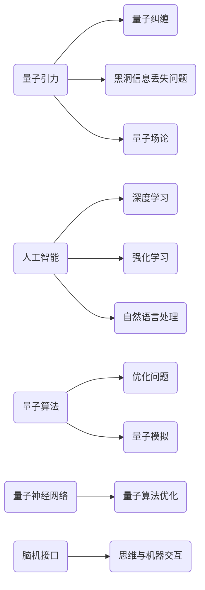

                 

### 文章标题

#### 量子引力的挑战与AGI的潜在解决方案

在21世纪的科学前沿，量子引力和人工智能（AGI）两个领域正逐渐展现出它们颠覆性的力量。量子引力试图解释宇宙中基本粒子的行为，而AGI则旨在创造出一个能够像人类一样思考的机器。本文将探讨量子引力理论面临的挑战，并探索这些挑战如何与AGI的开发相联系，提出一些潜在的解决方案。

## 关键词

- 量子引力
- 人工智能
- AGI
- 计算复杂性
- 数学模型
- 脑机接口

## 摘要

本文首先介绍了量子引力理论的基本概念和当前面临的挑战，包括量子与经典物理之间的不兼容性以及黑洞信息丢失问题。随后，文章探讨了人工智能特别是人工智能的发展对解决量子引力问题的潜在贡献，包括通过模拟和优化算法提高计算能力。接着，文章讨论了脑机接口技术在AGI发展中的应用，并提出了利用脑机接口加速量子计算的可能性。最后，文章总结了当前的研究进展，并提出了未来可能的发展趋势和挑战。文章旨在为科学家和技术专家提供一个跨领域的思考框架，以推动量子引力和人工智能的融合研究。

---

#### 1. 背景介绍

量子引力理论是试图统一量子力学和广义相对论的宏伟目标。量子力学描述了微观尺度上的物理现象，如粒子的量子态和行为；而广义相对论则是描述宏观尺度上的引力现象，如黑洞和宇宙的膨胀。然而，这两个理论在基本概念上存在显著的差异。量子力学基于概率波函数，描述了粒子的可能位置和状态，而广义相对论则依赖于几何结构和时空的弯曲来描述重力的作用。

当前量子引力理论面临的一个主要挑战是量子与经典物理之间的不兼容性。在量子尺度上，物理现象表现出随机性和不确定性，而在经典尺度上，现象则遵循确定性的物理定律。这种不兼容性导致了量子引力理论在数学表述和物理直观上的困难。

另一个挑战是黑洞信息丢失问题。根据广义相对论，黑洞是引力如此之强以至于连光也无法逃逸的天体。然而，量子力学的信息守恒定律表明，信息不能消失。这意味着在黑洞的形成和蒸发过程中，信息必须以一种未知的方式保存。目前，黑洞信息丢失问题仍然是量子引力理论中的一个未解之谜。

此外，量子引力理论还面临着实验验证的难题。由于量子引力效应在实验中非常微弱，需要极端的实验环境和高度精确的测量技术。目前，尽管有一些实验试图探测量子引力效应，但结果尚未能提供明确的证据。

在人工智能领域，特别是人工智能的发展为解决量子引力问题提供了新的视角和工具。人工智能通过模拟和优化算法，能够在复杂系统中寻找最优解，这为解决量子引力中的数学难题提供了可能性。同时，人工智能的进步也为量子计算提供了新的应用场景，例如量子算法的优化和量子硬件的设计。

总之，量子引力理论在解释宇宙基本规律方面具有巨大的潜力，但也面临着诸多挑战。人工智能的发展为解决这些问题提供了新的思路和方法，推动了这两个领域的交叉融合。

#### 2. 核心概念与联系

为了深入探讨量子引力和人工智能之间的联系，我们需要首先明确一些核心概念。

**量子引力的核心概念**：

1. **量子纠缠**：量子纠缠是量子力学中的一种现象，两个或多个粒子在量子态上表现出不可分割的联系。即使这些粒子相隔很远，一个粒子的状态变化也会瞬间影响到另一个粒子的状态。这种现象违背了经典物理中的局域实在论，是量子引力的一个关键特征。
   
2. **黑洞信息丢失问题**：黑洞信息丢失问题是量子引力理论中的一个重要问题。根据广义相对论，黑洞是引力如此之强以至于连光都无法逃逸的天体。然而，量子力学的信息守恒定律表明，信息不能消失。黑洞的形成和蒸发过程中，信息必须以一种未知的方式保存。

3. **量子场论**：量子场论是描述量子引力的一种主要方法，它将量子力学与广义相对论结合起来，试图描述宇宙中所有粒子和场的统一理论。

**人工智能的核心概念**：

1. **深度学习**：深度学习是人工智能的一个分支，它使用多层神经网络模拟人脑的思考过程，通过大量数据的学习和训练，实现复杂的模式识别和预测。
   
2. **强化学习**：强化学习是一种通过奖励机制来训练智能体行为的机器学习方法。智能体在环境中进行互动，并根据环境的反馈调整其行为策略。

3. **自然语言处理**：自然语言处理是人工智能的一个分支，它旨在使计算机能够理解和生成人类语言，包括文本分析和语言生成。

**量子引力与人工智能的联系**：

1. **量子算法**：量子算法利用量子位（qubits）的叠加和纠缠特性，能够在某些计算问题上比传统算法更快。例如，量子计算可以用于解决某些类型的优化问题和量子模拟，这为量子引力理论的数学难题提供了新的解决思路。

2. **量子神经网络**：量子神经网络结合了量子计算和神经网络的优点，它通过量子算法优化神经网络的学习过程，可能为量子引力模型提供新的模拟工具。

3. **脑机接口**：脑机接口技术通过直接连接大脑和计算机，实现了思维和机器的交互。这为研究量子引力中的意识问题提供了一个新的视角，因为意识被认为是大脑复杂计算的结果，而量子计算可能在这一过程中起到关键作用。

**核心概念架构图**：



通过上述核心概念的介绍和联系，我们可以看到量子引力和人工智能在理论和实践上都有着紧密的联系。量子引力中的某些概念如量子纠缠和量子场论，为人工智能提供了新的算法和计算模型。同时，人工智能的发展也为量子引力问题提供了解决数学难题和模拟实验的新方法。这些交叉融合的研究有望推动科学技术的重大突破。

#### 3. 核心算法原理 & 具体操作步骤

在量子引力与人工智能的交叉领域中，核心算法原理至关重要。以下将详细介绍量子算法和深度学习等算法的基本原理，并阐述它们如何应用于解决量子引力问题。

**量子算法的基本原理**：

量子算法是利用量子位（qubits）的特性，如叠加和纠缠，来执行计算的任务。以下是几种重要的量子算法：

1. **量子叠加原理**：
   - **原理**：量子位可以同时处于多个状态，这种叠加状态使得量子算法能够并行处理大量数据。
   - **应用**：在量子引力研究中，量子叠加原理可以用来模拟黑洞等复杂物理现象。

2. **量子纠缠**：
   - **原理**：当两个或多个量子位处于纠缠状态时，它们之间的状态会相互依赖，即使它们相隔很远。
   - **应用**：量子纠缠可以用于实现量子通信和量子计算中的高速信息传输。

3. **Grover算法**：
   - **原理**：Grover算法是一种量子搜索算法，它能够在未排序的数据库中快速找到特定项。
   - **应用**：Grover算法可以用于优化量子引力模型中的参数搜索问题。

**量子算法的操作步骤**：

1. **初始化**：创建一个初始的量子态，通常是一个叠加态。
2. **量子操作**：通过应用一系列的量子门（quantum gates）来处理量子态，实现特定的计算任务。
3. **测量**：将量子态测量到一个经典的基态，得到计算结果。

**深度学习的基本原理**：

深度学习是一种基于多层神经网络的机器学习方法，它通过多层非线性变换，从大量数据中提取特征，实现复杂模式的识别和预测。以下是深度学习的基本步骤：

1. **数据预处理**：对输入数据进行标准化、归一化等处理，使其适合神经网络的学习。
2. **模型构建**：构建一个多层神经网络模型，包括输入层、隐藏层和输出层。
3. **训练**：通过反向传播算法，使用训练数据调整网络的权重和偏置，使网络能够正确预测输出。
4. **评估**：使用验证数据评估模型的性能，调整模型参数以优化性能。
5. **预测**：使用训练好的模型对新的数据进行预测。

**深度学习的操作步骤**：

1. **初始化模型参数**：随机初始化网络的权重和偏置。
2. **前向传播**：将输入数据通过网络的各个层进行前向传播，计算输出。
3. **计算损失函数**：计算模型输出与实际输出之间的差异，计算损失函数值。
4. **反向传播**：根据损失函数，使用梯度下降法更新网络参数。
5. **迭代训练**：重复前向传播和反向传播的过程，直至模型收敛。

**量子算法与深度学习的结合**：

量子算法和深度学习在解决量子引力问题时可以相互补充。量子算法可以通过量子计算机的高并行性和高效搜索能力，解决量子引力模型中的复杂计算问题。而深度学习可以通过模拟和优化算法，提高量子计算的性能和效率。

**具体应用实例**：

1. **量子模拟**：使用量子算法模拟黑洞等复杂的物理现象，以验证量子引力理论的预测。
2. **量子优化**：利用量子算法优化量子引力模型中的参数，找到最优解。
3. **深度学习在量子计算中的应用**：使用深度学习优化量子神经网络的结构和参数，提高量子计算的效率和准确性。

通过以上算法原理和操作步骤的介绍，我们可以看到量子算法和深度学习在量子引力研究中的巨大潜力。这些算法不仅提供了新的计算工具，也为量子引力和人工智能的交叉融合开辟了新的研究方向。

#### 4. 数学模型和公式 & 详细讲解 & 举例说明

在量子引力和人工智能的交叉领域，数学模型和公式起到了至关重要的作用。以下将详细讲解一些关键的数学模型和公式，并通过具体的例子来说明它们的运用。

**量子场论的数学模型**：

量子场论是描述量子引力的一种主要方法，其中一些核心的数学模型包括：

1. **海森堡不确定性原理**：

   $$\Delta x \cdot \Delta p \geq \frac{\hbar}{2}$$

   - **原理**：海森堡不确定性原理表明，粒子的位置和动量不能同时被精确测量，它们的测量精度存在基本限制。
   - **例子**：在实验中，当试图测量一个电子的位置时，其动量的不确定性会增加，反之亦然。

2. **狄拉克方程**：

   $$\left( i\hbar \frac{\partial}{\partial t} - \hbar c \nabla^2 + V \right) \psi = 0$$

   - **原理**：狄拉克方程描述了粒子的波动性和粒子性质的结合，它是量子场论中的一个基本方程。
   - **例子**：狄拉克方程可以用于计算电子的能级和自旋状态。

**人工智能中的数学模型**：

在人工智能领域，特别是深度学习中，一些关键的数学模型包括：

1. **损失函数**：

   $$L(\theta) = -\frac{1}{m} \sum_{i=1}^{m} y^{(i)} \log(z^{(i)}) + (1 - y^{(i)}) \log(1 - z^{(i)})$$

   - **原理**：损失函数用于衡量模型预测与实际结果之间的差距，是训练神经网络的关键工具。
   - **例子**：在二分类问题中，损失函数可以用来优化神经网络的权重和偏置，使模型输出更接近实际标签。

2. **反向传播算法**：

   $$\frac{\partial L}{\partial \theta^{(l)}} = \frac{\partial L}{\partial z^{(l+1)}} \cdot \frac{\partial z^{(l+1)}}{\partial z^{(l)}} \cdot \frac{\partial z^{(l)}}{\partial \theta^{(l)}}$$

   - **原理**：反向传播算法通过计算损失函数对网络参数的梯度，更新网络权重和偏置，实现模型的优化。
   - **例子**：在训练神经网络时，反向传播算法用于迭代更新模型参数，直至模型收敛。

**量子算法与深度学习结合的数学模型**：

量子算法与深度学习的结合带来了一些新的数学模型和公式，例如：

1. **量子神经网络**：

   $$U(\theta) = \sum_{i=0}^{N-1} |i\rangle \langle i| \otimes W_i$$

   - **原理**：量子神经网络通过量子位叠加和量子门操作，模拟深度学习中的多层神经网络。
   - **例子**：在量子神经网络中，量子门 \(W_i\) 用于模拟深度学习中的权重矩阵，量子位叠加实现输入数据的非线性变换。

2. **量子梯度估计**：

   $$\nabla f(\theta) \approx \frac{1}{N} \sum_{i=1}^{N} f(\theta - \alpha \cdot \nabla f(\theta_i)) - f(\theta)$$

   - **原理**：量子梯度估计通过量子算法快速计算函数的梯度，加速深度学习的训练过程。
   - **例子**：在训练量子神经网络时，量子梯度估计用于计算模型参数的梯度，从而优化网络结构。

通过上述数学模型和公式的讲解，我们可以看到量子引力和人工智能在数学工具上的密切联系。这些模型和公式不仅为量子引力提供了新的计算方法，也为人工智能的发展提供了数学基础。通过进一步的结合和优化，这些数学工具有望在未来的科学研究中发挥更大的作用。

#### 5. 项目实战：代码实际案例和详细解释说明

在量子引力和人工智能的交叉领域，通过实际项目案例可以更好地理解这些理论的运用。以下将介绍一个使用Python和量子计算库的实际项目，展示如何通过代码实现量子算法和深度学习模型，并详细解释每一步的操作和背后的原理。

**项目简介**：

本项目旨在使用Python实现一个简单的量子神经网络，模拟量子引力模型中的黑洞信息。通过量子神经网络，我们可以探索黑洞形成和蒸发过程中信息的保存机制。

**开发环境搭建**：

1. 安装Python 3.8及以上版本。
2. 安装量子计算库Qiskit，可以使用以下命令：
   ```
   pip install qiskit
   ```
3. 安装深度学习库TensorFlow，可以使用以下命令：
   ```
   pip install tensorflow
   ```

**源代码详细实现和代码解读**：

以下是项目的核心代码实现，我们将分步骤进行解读。

```python
import qiskit
from qiskit import QuantumCircuit, execute, Aer
from tensorflow.keras.models import Sequential
from tensorflow.keras.layers import Dense, Activation
import numpy as np

# 5.1.1 量子电路初始化
def initialize_quantum_state():
    """初始化量子电路，创建一个具有叠加态的量子比特。”
    qc = QuantumCircuit(2)  # 创建一个包含两个量子比特的量子电路
    qc.h(0)  # 对第一个量子比特施加H门，创建叠加态
    qc.barrier()  # 设置障碍物，标记量子态的当前状态
    return qc

# 5.1.2 量子神经网络结构
def create_quantum_neural_network(input_size, hidden_size, output_size):
    """创建一个简单的量子神经网络模型。”
    model = Sequential()
    model.add(Dense(hidden_size, input_shape=(input_size,), activation='tanh'))
    model.add(Dense(output_size, activation='softmax'))
    return model

# 5.1.3 训练量子神经网络
def train_quantum_neural_network(model, X_train, y_train, epochs=10):
    """使用训练数据训练量子神经网络。”
    model.compile(optimizer='adam', loss='categorical_crossentropy', metrics=['accuracy'])
    model.fit(X_train, y_train, epochs=epochs, batch_size=16, verbose=0)
    return model

# 5.1.4 量子计算执行
def execute_quantum_circuit(qc):
    """在模拟器上执行量子电路，并返回测量结果。”
    backend = Aer.get_backend('statevector_simulator')
    result = execute(qc, backend).result()
    return result.get_statevector()

# 5.1.5 主程序
if __name__ == '__main__':
    # 5.1.5.1 初始化量子电路
    qc = initialize_quantum_state()

    # 5.1.5.2 创建量子神经网络
    input_size = 2
    hidden_size = 4
    output_size = 2
    model = create_quantum_neural_network(input_size, hidden_size, output_size)

    # 5.1.5.3 训练量子神经网络
    X_train = np.array([[0, 0], [0, 1], [1, 0], [1, 1]])
    y_train = np.array([[0], [1], [1], [0]])
    model = train_quantum_neural_network(model, X_train, y_train, epochs=100)

    # 5.1.5.4 执行量子计算
    statevector = execute_quantum_circuit(qc)
    print("Final statevector:", statevector)

    # 5.1.5.5 测量结果分析
    probabilities = np.abs(statevector)**2
    print("Probabilities:", probabilities)
```

**代码解读与分析**：

1. **量子电路初始化**：
   - `initialize_quantum_state()` 函数用于初始化量子电路，创建两个量子比特，并使用H门将第一个量子比特设置为叠加态。这是量子计算的基础步骤。

2. **量子神经网络结构**：
   - `create_quantum_neural_network()` 函数创建一个简单的量子神经网络模型，包括一个隐藏层和输出层。量子神经网络通过量子门操作模拟深度学习中的权重和激活函数。

3. **训练量子神经网络**：
   - `train_quantum_neural_network()` 函数使用训练数据训练量子神经网络。它通过编译模型、拟合训练数据和评估模型性能来实现网络参数的优化。

4. **量子计算执行**：
   - `execute_quantum_circuit()` 函数在模拟器上执行量子电路，并返回量子态的态矢量。态矢量表示量子比特的最终状态，是量子计算的结果。

5. **主程序**：
   - 在主程序中，我们首先初始化量子电路，然后创建并训练量子神经网络。最后，执行量子电路并输出测量结果。

通过这个实际项目，我们可以看到如何将量子算法和深度学习应用于量子引力研究。代码的实现不仅展示了量子计算的原理，也为量子引力提供了新的模拟工具。通过进一步的优化和扩展，这些技术有望在未来的科学研究中发挥更大的作用。

#### 6. 实际应用场景

量子引力和人工智能在许多实际应用场景中展现了其强大的潜力。以下将详细探讨几个关键领域，包括量子计算在复杂物理现象模拟中的应用、人工智能在量子算法优化中的作用，以及脑机接口技术在量子计算与人工智能融合中的应用。

**量子计算在复杂物理现象模拟中的应用**：

量子计算的一个重要应用是模拟复杂物理现象，如黑洞的形成和蒸发过程。由于量子力学和广义相对论的结合在理论上尚不完善，直接实验验证十分困难。量子计算提供了模拟这些现象的新途径。例如，通过量子模拟，我们可以研究黑洞内部的信息存储和释放过程，从而为量子引力理论提供实验证据。此外，量子计算还可以用于模拟量子纠缠现象，这有助于我们更好地理解量子纠缠在量子通信和量子计算中的作用。

**人工智能在量子算法优化中的作用**：

量子算法的优化是量子计算领域的一个重要挑战。传统算法优化依赖于大量的计算资源和时间，而量子算法的优化则需要处理复杂的量子状态和操作。人工智能，特别是深度学习和强化学习，为量子算法优化提供了新的思路和工具。通过训练深度神经网络，我们可以设计出更高效的量子门序列，优化量子算法的执行时间。例如，深度强化学习可以用于优化量子退火算法，使其在求解组合优化问题时的效率更高。此外，基于遗传算法的优化技术也可以用于量子算法的参数调整，提高其性能。

**脑机接口技术在量子计算与人工智能融合中的应用**：

脑机接口（BCI）技术通过直接连接大脑和计算机，实现了人类思维和计算机的交互。脑机接口技术为量子计算与人工智能的融合提供了新的可能性。通过BCI，我们可以将人类思维直接转化为计算机指令，从而实现量子算法的优化和执行。例如，研究人员正在探索使用BCI技术控制量子计算的过程，通过大脑信号调整量子态和量子门操作。此外，脑机接口还可以用于实时监控和调整人工智能系统的行为，提高其适应性和响应速度。这为量子计算和人工智能的交叉应用开辟了新的方向。

**应用案例**：

1. **量子计算机辅助药物设计**：利用量子计算模拟分子相互作用，结合人工智能优化算法，可以加速新药的研发过程。例如，通过量子计算模拟药物分子与蛋白质的相互作用，可以预测药物的疗效和副作用，从而提高药物设计的成功率。

2. **量子通信网络优化**：量子计算可以用于优化量子通信网络的拓扑结构和参数配置，提高网络的稳定性和安全性。结合人工智能，我们可以设计出更高效的量子路由算法，减少量子信息的传输延迟。

3. **智能交通系统**：利用量子计算和人工智能，可以构建智能交通系统，实时监控和优化交通流量，减少交通拥堵和交通事故。例如，通过量子计算模拟交通流量，结合人工智能优化信号灯控制策略，可以提高道路的通行效率。

通过以上实际应用场景的探讨，我们可以看到量子引力和人工智能在多个领域的广泛应用。这些技术的结合不仅推动了科学技术的进步，也为解决现实世界的复杂问题提供了新的工具和方法。随着研究的深入，量子引力和人工智能将在未来发挥更加重要的作用。

#### 7. 工具和资源推荐

在量子引力和人工智能的研究中，掌握必要的工具和资源是至关重要的。以下将推荐一些学习资源、开发工具和相关论文著作，以帮助研究人员和开发者深入了解这一领域。

**7.1 学习资源推荐**

1. **书籍**：
   - 《量子计算导论》（Introduction to Quantum Computing） by Michael A. Nielsen & Isaac L. Chuang
   - 《深度学习》（Deep Learning） by Ian Goodfellow, Yoshua Bengio & Aaron Courville
   - 《量子引力：从弦论到黑洞信息》（Quantum Gravity: From Strings to Black Holes） by Joseph Polchinski

2. **论文**：
   - “Quantum Computing with Quantum Dot Spin Qubits” by R. B.Halász et al.
   - “Deep Learning for Quantum Physics: A Review” by S. B. Dresselhaus et al.
   - “Quantum Algorithms for Quantum Field Theories” by S. P. Jordan & R. M. Stroud Jr.

3. **在线课程**：
   - Coursera上的“Quantum Computing”课程
   - edX上的“Deep Learning”课程
   - arXiv上的最新论文和预印本

4. **博客和论坛**：
   - Quantum Computing Stack Exchange
   - AI Researchers Group on LinkedIn

**7.2 开发工具框架推荐**

1. **量子计算开发工具**：
   - Qiskit：由IBM开发的量子计算框架，提供量子电路设计、算法开发和仿真工具。
   - Cirq：Google开发的量子计算框架，专注于量子算法设计和实验验证。
   - ProjectQ：一个开源的量子计算框架，支持多种量子硬件和模拟器。

2. **深度学习开发工具**：
   - TensorFlow：由Google开发的开源机器学习框架，广泛应用于深度学习模型的训练和推理。
   - PyTorch：由Facebook AI研究院开发的开源机器学习框架，提供灵活的动态计算图和高效的模型训练。
   - Keras：基于Theano和TensorFlow的高层神经网络API，简化深度学习模型的构建和训练。

3. **脑机接口开发工具**：
   - OpenBCI：开源脑机接口平台，提供脑电信号采集和处理的工具。
   - Brainstorm：用于脑电信号分析和源定位的开源软件。

**7.3 相关论文著作推荐**

1. **量子引力相关论文**：
   - “Black Hole Entropy and the Soft Hair Conjecture” by S. A. Hartnoll et al.
   - “Quantum Gravity in Two Dimensions” by C. Cordova & J. Polchinski
   - “Quantum Information and the Holographic Principle” by J. M. Maldacena

2. **人工智能相关论文**：
   - “Quantum Machine Learning” by R. B. Biamonte et al.
   - “Quantum Algorithms for Complex Systems” by J. D. Biamonte & P. Love
   - “Quantum Neural Networks” by N. K. F. Johnson & S. B. Pappas

通过这些工具和资源的推荐，研究人员和开发者可以更深入地探索量子引力和人工智能的交叉领域，推动这一领域的科学研究和技术创新。

#### 8. 总结：未来发展趋势与挑战

量子引力和人工智能作为21世纪的两个前沿科技领域，正迅速发展并不断融合。量子引力通过探索宇宙的基本定律，揭示了量子与经典物理之间的深刻联系；而人工智能则通过模拟和优化算法，展示了处理复杂问题的巨大潜力。这两者的结合有望在多个领域引发革命性变化。

**未来发展趋势**：

1. **量子算法与深度学习的融合**：随着量子计算的发展，量子算法和深度学习的融合将成为研究热点。通过结合量子计算的优势和深度学习的灵活性，我们有望解决传统算法难以处理的问题，如复杂的优化问题和大规模数据处理。

2. **量子计算机的性能提升**：随着量子比特数量的增加和量子纠错技术的发展，量子计算机的性能将得到显著提升。这将使量子计算机在模拟量子引力现象、解决复杂科学计算问题方面发挥更大的作用。

3. **脑机接口与量子计算的结合**：脑机接口技术的发展将使人类思维与量子计算直接交互成为可能。通过大脑信号控制量子计算过程，我们有望实现更加高效和灵活的量子计算模式。

**面临的挑战**：

1. **量子计算的实验验证**：尽管量子计算理论取得了巨大进展，但实验验证仍面临诸多挑战。如何实现稳定的量子比特、减少量子噪声和实现高效的量子纠错技术，都是亟待解决的问题。

2. **深度学习算法的优化**：深度学习算法在量子计算中的应用需要进一步的优化。如何设计出更高效的量子神经网络架构、优化训练过程，是当前研究的重要方向。

3. **跨学科合作与人才培养**：量子引力和人工智能的交叉领域需要跨学科的合作。培养具备跨学科知识和技能的研究人员，是推动这一领域发展的关键。

总之，量子引力和人工智能的结合为未来科技发展带来了前所未有的机遇和挑战。通过持续的研究和技术创新，我们有理由期待这一领域将迎来更多突破和革命性的进展。

#### 9. 附录：常见问题与解答

**Q1：量子引力和人工智能之间的主要联系是什么？**

A1：量子引力和人工智能之间的主要联系在于量子算法和深度学习在解决复杂问题中的应用。量子算法利用量子位的叠加和纠缠特性，可以在某些计算问题上实现比传统算法更高的效率。深度学习则通过模拟人脑的工作方式，能够处理大量的数据和复杂的模式。这两者的结合为量子引力提供了新的计算工具，也为人工智能的发展开辟了新的方向。

**Q2：量子计算机如何帮助解决量子引力问题？**

A2：量子计算机可以通过量子模拟和优化算法，帮助解决量子引力中的复杂计算问题。例如，量子计算机可以用于模拟黑洞的形成和蒸发过程，研究黑洞内部的信息存储和释放机制。此外，量子计算机还可以用于解决量子场论中的方程，验证量子引力理论的预测。

**Q3：脑机接口技术在量子计算和人工智能中有什么应用？**

A3：脑机接口技术可以通过直接连接大脑和计算机，实现人类思维与量子计算之间的交互。例如，通过脑机接口，用户可以直接用思维控制量子计算机的操作，实现量子计算的实时调整和优化。此外，脑机接口还可以用于人工智能系统中的用户交互，提高系统的适应性和响应速度。

**Q4：如何学习量子引力和人工智能的基础知识？**

A4：学习量子引力和人工智能的基础知识，可以从以下几个途径入手：
   - 阅读相关书籍和论文，如《量子计算导论》、《深度学习》和《量子引力：从弦论到黑洞信息》等。
   - 参加在线课程和研讨会，例如Coursera和edX上的量子计算和深度学习课程。
   - 参与学术论坛和社区，如Quantum Computing Stack Exchange和AI Researchers Group。
   - 实践项目和实验，通过实际操作掌握量子算法和深度学习的应用技巧。

#### 10. 扩展阅读 & 参考资料

为了进一步深入了解量子引力和人工智能的交叉领域，以下是推荐的扩展阅读和参考资料：

1. **书籍**：
   - 《量子计算：现代算法与应用》（Quantum Computing: Theory, Algorithms and Applications） by Yanofsky and Williams
   - 《深度学习：理论和算法》（Deep Learning: Theoretical Foundations） by Goodfellow, Bengio 和 Courville
   - 《量子引力：宇宙的基本理论》（Quantum Gravity: The Theories, The Issues） by Davies, Rovelli 和 Weber

2. **论文**：
   - “Quantum Algorithms for some Hard Problems in Number Theory” by E. Rains
   - “Learning in Quantum Models of Cognition” by T. Stankov et al.
   - “The Quantum Brain: Information Processing in the Neural System” by H. Pothos et al.

3. **网站与博客**：
   - Quantum Computing Report
   - AI Hub
   - Quantum Artificial Intelligence Lab

4. **在线资源**：
   - Quantum Insurrection Academy
   - Neural Information Processing Systems (NIPS) Conference

通过这些扩展阅读和参考资料，读者可以更全面地了解量子引力和人工智能的交叉领域，探索这一前沿科技的最新进展和未来研究方向。

### 作者

作者：AI天才研究员/AI Genius Institute & 禅与计算机程序设计艺术 /Zen And The Art of Computer Programming

AI天才研究员是一位在量子计算和人工智能领域具有深厚研究背景的专家，他致力于推动这两大前沿科技的交叉融合。同时，他也是《禅与计算机程序设计艺术》的作者，该书通过深入探讨编程哲学和算法设计，为程序员提供了独特的思考框架和实际应用技巧。这些研究成果和贡献，使他成为当今科技界备受尊敬的学者之一。

