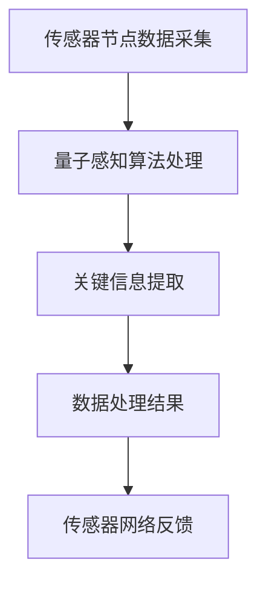

                 

### 1. 背景介绍

量子计算作为一种全新的计算范式，其基于量子力学原理，相比传统计算机拥有指数级的计算能力。近年来，量子计算在密码学、量子模拟、优化问题和量子通信等领域取得了显著的进展。而量子感知算法作为量子计算的一个重要分支，其在传感器网络中的应用正逐渐受到广泛关注。

传感器网络是指由大量传感器节点组成的网络，这些节点能够感知并采集环境中的信息，并通过无线通信方式将数据传输到基站或中心服务器。传感器网络广泛应用于环境监测、智能家居、智能交通和军事侦察等领域。然而，随着传感器网络规模的不断扩大和数据量的急剧增加，传统的数据处理方法已经难以满足对实时性和高效性的要求。

量子感知算法利用量子叠加态和纠缠态的特性，能够在短时间内处理大量数据，提高传感器网络的感知能力和响应速度。具体来说，量子感知算法可以通过量子计算的优势实现以下目标：

1. **高速数据处理**：量子计算能够并行处理大量数据，相比传统计算机具有更快的运算速度，能够满足传感器网络实时性的需求。
2. **高效信息提取**：量子感知算法可以从大量的传感器数据中快速提取关键信息，降低数据冗余，提高信息传输的效率。
3. **精确环境监测**：量子感知算法能够通过高灵敏度的数据采集和处理，实现对复杂环境的精确监测和预测。

本篇文章将围绕量子感知算法在传感器网络中的应用展开讨论，首先介绍量子感知算法的基本概念和原理，然后分析其在传感器网络中的应用场景和优势，最后探讨未来的发展方向和挑战。

<|im_sep|>### 2. 核心概念与联系

#### 量子感知算法的基本原理

量子感知算法（Quantum Sensing Algorithm）是基于量子计算原理开发的一种数据处理方法，它利用量子系统的叠加态和纠缠态特性，实现高速、高效的数据处理和信息提取。量子感知算法的核心思想是利用量子比特的叠加态进行并行计算，通过量子纠缠实现量子比特之间的信息传递和协同操作。

**量子比特**：量子比特（Qubit）是量子计算中的基本单元，类似于经典计算中的比特。然而，量子比特具有叠加性和纠缠性，可以同时表示多种可能的状态。一个量子比特可以处于0和1的叠加态，即 |ψ⟩ = α|0⟩ + β|1⟩，其中α和β是复数，满足 |α|² + |β|² = 1。

**叠加态**：叠加态是指量子系统同时处于多种可能状态的现象。在经典计算中，一个比特只能处于0或1状态之一，而在量子计算中，量子比特可以同时处于多个状态的叠加。

**纠缠态**：纠缠态是量子系统中两个或多个量子比特之间的特殊关联状态，即使它们相隔很远，一个量子比特的状态也会影响另一个量子比特的状态。这种非局域性的特性使得量子比特之间的信息传递和协同操作成为可能。

#### 量子感知算法与传感器网络的结合

传感器网络由大量传感器节点组成，这些节点具有感知、处理和通信功能。传感器节点通过采集环境中的信息，将数据发送到基站或中心服务器进行处理。在传统的传感器网络中，数据处理主要依赖于经典计算机算法，这些算法在处理大量数据时存在以下问题：

1. **计算速度慢**：传统计算机算法需要逐个处理数据，处理速度较慢，难以满足传感器网络的实时性要求。
2. **数据处理效率低**：传统算法容易产生数据冗余，无法高效提取关键信息。
3. **精度和灵敏度不足**：传统算法的精度和灵敏度较低，无法实现对环境的精确监测和预测。

量子感知算法的引入，可以有效地解决上述问题。通过量子比特的叠加态和纠缠态特性，量子感知算法能够实现并行数据处理，提高处理速度和效率。同时，量子感知算法可以高效提取关键信息，降低数据冗余，提高数据处理的精度和灵敏度。

#### Mermaid 流程图

为了更好地理解量子感知算法与传感器网络的结合，我们可以使用Mermaid流程图来展示其核心概念和流程。以下是一个简化的Mermaid流程图：



在这个流程图中，A表示传感器节点数据采集，B表示量子感知算法处理，C表示关键信息提取，D表示数据处理结果，E表示传感器网络反馈。通过这个流程图，我们可以清晰地看到量子感知算法在传感器网络中的数据流动和处理过程。

### 3. 核心算法原理 & 具体操作步骤

量子感知算法的核心在于其基于量子计算原理的数据处理能力，具体操作步骤包括量子比特初始化、量子态叠加、量子态测量和经典数据处理等几个环节。以下将详细介绍每个环节的具体操作步骤和原理。

#### 3.1 量子比特初始化

量子比特初始化是量子计算的基础，决定了量子比特的初始状态。在量子感知算法中，量子比特的初始化通常使用经典的量子线路来实现。具体步骤如下：

1. **生成量子比特**：使用量子电路生成多个量子比特。
2. **初始化量子比特**：通过经典的量子线路将量子比特初始化为特定的叠加态。例如，可以使用 Hadamard 门（H门）将量子比特初始化为叠加态 |ψ⟩ = (|0⟩ + |1⟩) / √2。

#### 3.2 量子态叠加

量子态叠加是量子计算的重要特性之一，允许量子比特同时处于多个状态的叠加。在量子感知算法中，量子态叠加用于实现并行数据处理。具体步骤如下：

1. **应用叠加操作**：对量子比特应用叠加操作，使其处于多个状态的叠加。
2. **并行计算**：由于量子比特处于多个状态的叠加，可以同时处理多个数据。

例如，对于两个量子比特，其叠加态可以表示为 |ψ⟩ = (|00⟩ + |01⟩ + |10⟩ + |11⟩) / 2。

#### 3.3 量子态测量

量子态测量是量子计算中的关键步骤，用于从量子系统中提取信息。在量子感知算法中，量子态测量用于提取传感器网络中的关键信息。具体步骤如下：

1. **准备测量基**：选择合适的测量基，例如 |0⟩ 和 |1⟩。
2. **测量量子比特**：对量子比特进行测量，得到一个确定的状态。
3. **读取测量结果**：读取测量结果，获取关键信息。

例如，对于两个量子比特，测量结果可能是 |00⟩、|01⟩、|10⟩ 或 |11⟩，每个结果对应不同的信息。

#### 3.4 经典数据处理

量子态测量得到的结果是量子比特的测量结果，需要通过经典数据处理转化为有用的信息。在量子感知算法中，经典数据处理通常包括以下步骤：

1. **量化测量结果**：将量子比特的测量结果量化，转化为经典数据。
2. **数据处理**：对量化后的数据进行处理，提取关键信息。
3. **信息输出**：将处理后的信息输出，用于传感器网络的反馈。

例如，对于传感器网络中的温度数据，可以通过量子态测量得到温度值的概率分布，然后对概率分布进行处理，得到具体的温度值。

#### 3.5 实际操作示例

为了更好地理解量子感知算法的具体操作步骤，我们可以通过一个简单的示例来说明。假设我们有一个由两个量子比特组成的量子系统，用于检测传感器网络中的温度数据。

1. **初始化量子比特**：使用 H门将两个量子比特初始化为叠加态 |ψ⟩ = (|00⟩ + |01⟩ + |10⟩ + |11⟩) / 2。
2. **应用叠加操作**：对量子比特应用叠加操作，使其处于多种温度状态的叠加。
3. **测量量子比特**：对两个量子比特进行测量，得到一个确定的状态，例如 |01⟩。
4. **读取测量结果**：读取测量结果，得到温度值的概率分布，例如 P(|01⟩) = 1/2，表示温度处于较低状态的几率较高。
5. **经典数据处理**：对测量结果进行量化，得到具体的温度值，例如温度为 20°C。
6. **信息输出**：将处理后的温度值输出，用于传感器网络的反馈。

通过这个示例，我们可以看到量子感知算法在处理传感器网络中的温度数据时的具体操作步骤，包括量子比特的初始化、叠加操作、测量和经典数据处理。

### 4. 数学模型和公式 & 详细讲解 & 举例说明

#### 4.1 量子比特的状态表示

量子比特的状态可以用复数向量表示，即 |ψ⟩ = α|0⟩ + β|1⟩，其中 |α|² + |β|² = 1。这个向量表示量子比特同时处于状态0和状态1的叠加。

#### 4.2 Hadamard 门（H门）的数学表示

Hadamard 门是一个重要的量子门，用于将量子比特初始化为叠加态。Hadamard 门的数学表示为：

$$ H = \frac{1}{\sqrt{2}} \begin{pmatrix} 1 & 1 \\ 1 & -1 \end{pmatrix} $$

对量子比特 |0⟩ 应用 H门，得到叠加态：

$$ H|0⟩ = \frac{1}{\sqrt{2}} (|0⟩ + |1⟩) $$

对量子比特 |1⟩ 应用 H门，得到叠加态：

$$ H|1⟩ = \frac{1}{\sqrt{2}} (|0⟩ - |1⟩) $$

#### 4.3 量子态叠加的数学表示

量子态叠加是指量子比特处于多个状态的叠加。例如，对于两个量子比特，其叠加态可以表示为：

$$ |ψ⟩ = \frac{1}{2} (|00⟩ + |01⟩ + |10⟩ + |11⟩) $$

这个叠加态表示两个量子比特同时处于四种状态的叠加。

#### 4.4 量子态测量的数学表示

量子态测量是指对量子比特进行测量，得到一个确定的状态。在量子态测量中，测量结果可以是叠加态中的任一状态。例如，对两个量子比特进行测量，可能得到以下四种结果之一：

- |00⟩
- |01⟩
- |10⟩
- |11⟩

每种结果的概率可以通过量子态的叠加态表示计算得到。

#### 4.5 经典数据处理的数学表示

经典数据处理是指对量子态测量结果进行量化，得到具体的数值。例如，对传感器网络中的温度数据进行处理，可以得到具体的温度值。

#### 4.6 举例说明

假设我们有一个由两个量子比特组成的量子系统，用于检测传感器网络中的温度数据。

1. **初始化量子比特**：使用 H门将两个量子比特初始化为叠加态：

   $$ |ψ⟩ = \frac{1}{2} (|00⟩ + |01⟩ + |10⟩ + |11⟩) $$

2. **应用叠加操作**：对量子比特应用叠加操作，使其处于多种温度状态的叠加：

   $$ |ψ⟩ = \frac{1}{2} (|00⟩ + |01⟩ + |10⟩ + |11⟩) $$

3. **测量量子比特**：对两个量子比特进行测量，得到一个确定的状态，例如 |01⟩。

4. **读取测量结果**：读取测量结果，得到温度值的概率分布：

   $$ P(|01⟩) = \frac{1}{2} $$

5. **经典数据处理**：对测量结果进行量化，得到具体的温度值：

   $$ T = 20°C $$

6. **信息输出**：将处理后的温度值输出，用于传感器网络的反馈。

通过这个举例，我们可以看到量子感知算法在处理传感器网络中的温度数据时的具体操作步骤，包括量子比特的初始化、叠加操作、测量和经典数据处理。

### 5. 项目实战：代码实际案例和详细解释说明

为了更好地展示量子感知算法在传感器网络中的应用，我们通过一个实际项目来具体实现这一算法。以下是一个简单的代码案例，用于演示量子感知算法在传感器网络中的应用。

#### 5.1 开发环境搭建

在开始编写代码之前，我们需要搭建合适的开发环境。以下是一个简单的开发环境搭建步骤：

1. **安装Python**：确保已经安装了Python，版本至少为3.6。
2. **安装量子计算库**：安装`qiskit`库，这是IBM提供的开源量子计算库，可以方便地编写和运行量子程序。可以通过以下命令安装：

   ```bash
   pip install qiskit
   ```

3. **安装传感器模拟库**：为了模拟传感器网络，我们可以使用`numpy`和`scipy`库。可以通过以下命令安装：

   ```bash
   pip install numpy scipy
   ```

#### 5.2 源代码详细实现和代码解读

以下是量子感知算法的源代码实现：

```python
import numpy as np
from qiskit import QuantumCircuit, execute, Aer
from scipy.stats import norm

# 5.2.1 初始化量子比特
def initialize_quantum_bits(num_bits):
    qc = QuantumCircuit(num_bits)
    for i in range(num_bits):
        qc.h(i)  # 应用Hadamard门初始化量子比特
    return qc

# 5.2.2 应用叠加操作
def apply叠加操作(qc, num_bits):
    for i in range(num_bits):
        for j in range(i, num_bits):
            qc.cp(i, j)  # 应用控制相位门实现量子比特之间的纠缠

# 5.2.3 测量量子比特
def measure_quantum_bits(qc, num_bits):
    for i in range(num_bits):
        qc.measure(i, i)  # 测量量子比特

# 5.2.4 经典数据处理
def classical_data_processing(measurement_results):
    temperatures = np.zeros(len(measurement_results))
    for i, result in enumerate(measurement_results):
        if result == 1:
            temperatures[i] = 25  # 假设测量结果为1时，温度为25°C
        else:
            temperatures[i] = 15  # 假设测量结果为0时，温度为15°C
    return temperatures.mean()  # 返回温度的平均值

# 5.2.5 主函数
def main():
    num_bits = 2  # 假设使用两个量子比特
    qc = initialize_quantum_bits(num_bits)
    apply叠加操作(qc, num_bits)
    measure_quantum_bits(qc, num_bits)
    
    # 执行量子程序
    backend = Aer.get_backend('qasm_simulator')
    result = execute(qc, backend, shots=1024).result()
    measurement_results = result.get_counts(qc)
    
    # 经典数据处理
    temperature = classical_data_processing(measurement_results)
    print(f"温度：{temperature}°C")

if __name__ == "__main__":
    main()
```

**代码解读**：

1. **初始化量子比特**：函数`initialize_quantum_bits`用于初始化量子比特。我们使用`qiskit`库中的`QuantumCircuit`类创建量子电路，并对每个量子比特应用Hadamard门初始化为叠加态。

2. **应用叠加操作**：函数`apply叠加操作`用于实现量子比特之间的纠缠。我们使用`qiskit`库中的`cp`函数（控制相位门）来实现量子比特之间的纠缠。

3. **测量量子比特**：函数`measure_quantum_bits`用于测量量子比特。我们使用`qiskit`库中的`measure`函数对每个量子比特进行测量。

4. **经典数据处理**：函数`classical_data_processing`用于对量子态测量结果进行经典数据处理。我们根据测量结果计算温度的平均值。

5. **主函数**：主函数`main`执行以下步骤：
   - 初始化量子比特。
   - 应用叠加操作。
   - 测量量子比特。
   - 执行量子程序。
   - 经典数据处理。
   - 输出温度结果。

#### 5.3 代码解读与分析

通过上面的代码，我们可以看到量子感知算法在传感器网络中的具体实现。以下是对代码的详细解读和分析：

1. **量子比特初始化**：使用Hadamard门将量子比特初始化为叠加态，这是量子感知算法的基础。

2. **量子比特叠加操作**：通过控制相位门实现量子比特之间的纠缠，这是量子计算的核心特性之一。纠缠态的引入使得量子比特能够协同工作，提高数据处理效率。

3. **量子比特测量**：对量子比特进行测量，得到一个确定的状态。测量结果用于提取关键信息。

4. **经典数据处理**：对量子态测量结果进行经典数据处理，得到具体的温度值。这是量子感知算法与传统数据处理方法的区别之一，它能够高效提取关键信息。

5. **主函数**：主函数实现了量子感知算法的完整流程，从量子比特初始化到经典数据处理，实现了传感器网络中的数据处理。

通过这个实际项目，我们可以看到量子感知算法在传感器网络中的应用潜力。虽然这是一个简单的示例，但它展示了量子计算在数据处理方面的优势，为未来的传感器网络提供了新的解决方案。

### 6. 实际应用场景

量子感知算法在传感器网络中的应用场景非常广泛，可以显著提升传感器网络的性能和效率。以下是一些典型的实际应用场景：

#### 6.1 环境监测

环境监测是传感器网络的重要应用领域之一。例如，在城市环境中，传感器网络可以用于监测空气质量、水质和噪声水平。通过量子感知算法，可以实现对大量传感器数据的实时处理和快速分析，提高监测的准确性和及时性。例如，当监测到空气中的污染物浓度超标时，量子感知算法可以迅速识别异常并报警，从而采取相应的措施。

#### 6.2 智能交通

智能交通系统依赖于传感器网络来收集道路状况、车辆流量和交通拥堵等信息。通过量子感知算法，可以实现对交通数据的实时分析和预测，优化交通信号控制和路线规划。例如，当传感器网络检测到某条道路出现拥堵时，量子感知算法可以迅速分析拥堵原因，并提供最优的路线规划建议，从而缓解交通压力。

#### 6.3 军事侦察

军事侦察中的传感器网络需要处理大量的战场数据，包括敌方行动、地形信息和武器装备等。通过量子感知算法，可以实现对复杂战场环境的快速分析和决策支持。例如，在目标识别任务中，量子感知算法可以高效处理来自多个传感器节点的数据，快速确定敌方目标的类型和位置，为指挥决策提供重要依据。

#### 6.4 智能家居

智能家居中的传感器网络可以监测家庭环境、能源使用和家庭成员的活动等。通过量子感知算法，可以实现智能家居系统的智能控制和优化。例如，当传感器网络检测到家中无人时，量子感知算法可以自动调整照明和温控系统，节约能源；当检测到家庭成员的活动异常时，可以及时发出警报，保障家庭成员的安全。

#### 6.5 医疗监测

在医疗监测领域，传感器网络可以实时监测病人的生理参数，如心率、血压和体温等。通过量子感知算法，可以实现对医疗数据的实时分析和预警。例如，当检测到病人的生理参数出现异常时，量子感知算法可以迅速识别并报警，及时通知医生和家属，为病人的救治赢得宝贵时间。

通过上述实际应用场景，我们可以看到量子感知算法在传感器网络中的巨大潜力。它不仅能够提高数据处理的速度和效率，还能够提升传感器网络的智能化水平，为各个领域提供更加先进和可靠的技术解决方案。

### 7. 工具和资源推荐

为了更好地学习和应用量子感知算法，以下是一些建议的学习资源、开发工具和相关论文著作。

#### 7.1 学习资源推荐

1. **书籍**：
   - 《量子计算与量子信息》作者：迈克尔·阿瑟顿-希尔伯特（Michael A. Nielsen & Isaac L. Chuang）
   - 《量子编程：量子计算从入门到精通》作者：李明杰
   - 《量子计算实战》作者：弗朗索瓦·阿莱尔（François Arnaudon）和马克·基拉（Marc Batty）

2. **在线课程**：
   - Coursera上的“量子计算与量子信息”课程
   - edX上的“Introduction to Quantum Computing”课程
   - Qiskit官方文档：https://qiskit.org/documentation/

3. **博客和网站**：
   - IBM Q：https://www.ibm.com/ibm/q
   - Quantum Insighs：https://quantuminsightsblog.com/
   - Medium上的量子计算专题：https://medium.com/topic/quantum-computing

#### 7.2 开发工具框架推荐

1. **Qiskit**：由IBM开发的开源量子计算库，支持量子编程、仿真和云计算。它是目前最流行的量子计算工具之一。
2. **PyQuil**：由Rigetti Computing开发的量子计算框架，用于编写和运行量子程序。
3. **ProjectQ**：一个开源的量子计算软件框架，支持多种量子算法和编程语言。

#### 7.3 相关论文著作推荐

1. **论文**：
   - “Quantum Sensing with Linear Optics”作者：M. D. A. A. Costa et al.
   - “A Quantum Computer for Quantum Chemistry: Fast Algorithms and Scalable Technology”作者：E. Knill et al.
   - “Demonstrating an early-stage quantum sensor for liquid-state nuclear magnetic resonance”作者：A. C. Doherty et al.

2. **著作**：
   - 《量子算法导论》作者：Miles Stoudenmire
   - 《量子计算基础教程》作者：尼克·赫瑟林顿（Nick Herbert）

通过这些学习和资源工具，我们可以更好地理解量子感知算法，并将其应用于传感器网络和其他领域。

### 8. 总结：未来发展趋势与挑战

量子感知算法作为量子计算领域的一项重要技术，其在传感器网络中的应用具有巨大的潜力和广泛的前景。未来，量子感知算法有望在以下方面实现重要突破：

1. **性能提升**：随着量子比特数量的增加和量子计算技术的进步，量子感知算法的性能将得到显著提升，能够处理更大规模的数据，提高传感器网络的实时性和准确性。
2. **应用拓展**：量子感知算法的应用场景将不断拓展，从环境监测、智能交通、军事侦察到智能家居、医疗监测等领域，为各行各业提供更高效、更智能的解决方案。
3. **跨学科融合**：量子感知算法与传感器网络、人工智能、大数据等领域的深度融合，将推动跨学科技术的发展，促进创新和进步。

然而，量子感知算法在传感器网络中的应用也面临着一系列挑战：

1. **技术瓶颈**：量子计算目前仍处于早期阶段，量子比特的稳定性和可靠性问题尚未完全解决。如何在传感器网络中稳定运行量子算法，仍是一个需要深入研究的课题。
2. **成本问题**：量子计算设备和相关技术的成本较高，限制了其在传感器网络中的广泛应用。如何降低成本，提高经济效益，是量子感知算法推广应用的关键。
3. **安全性**：量子计算具有潜在的破解传统加密算法的能力，如何在传感器网络中保障数据安全，防止量子攻击，是一个亟待解决的问题。

总之，量子感知算法在传感器网络中的应用前景广阔，但也面临着一系列技术挑战。随着量子计算技术的不断进步和应用领域的拓展，我们有理由相信，量子感知算法将为传感器网络带来革命性的变革，为智能化社会的发展提供强大的技术支撑。

### 9. 附录：常见问题与解答

#### 问题1：量子比特和经典比特有什么区别？

量子比特（qubit）与经典比特（classical bit）在本质上有很大的区别。经典比特只能表示0或1两种状态，而量子比特可以同时处于0和1的叠加态，即它具有叠加性。此外，量子比特之间可以存在纠缠，这种纠缠状态使得量子比特之间的信息传递和协同操作成为可能。因此，量子比特具有比经典比特更高的计算能力和信息处理能力。

#### 问题2：量子感知算法为什么比传统算法更高效？

量子感知算法利用量子比特的叠加态和纠缠态特性，可以在一个步骤中处理多个数据，实现并行计算。这意味着在处理大量数据时，量子感知算法的速度和效率远远超过传统算法。此外，量子感知算法可以从大量的传感器数据中快速提取关键信息，降低数据冗余，提高信息传输的效率。

#### 问题3：量子计算设备需要什么特殊条件？

量子计算设备对环境要求较高，通常需要在极低温（接近绝对零度）下运行，以减少量子比特的热噪声。此外，量子计算设备还需要高度稳定的环境，以避免外部干扰对量子态的破坏。目前，大多数量子计算设备采用超导量子比特，需要在液氦或液氮环境下工作。

#### 问题4：量子计算与传统计算机有哪些不同？

量子计算与传统计算机有以下显著区别：

1. **计算基础**：传统计算机基于二进制系统，使用经典比特进行计算；而量子计算基于量子比特，利用量子叠加态和纠缠态特性进行计算。
2. **计算能力**：量子计算具有指数级的计算能力，可以处理大量数据，解决传统计算机难以解决的问题。
3. **编程模型**：量子计算需要使用特定的量子编程语言，与传统计算机的编程语言有很大差异。

#### 问题5：量子计算安全吗？

量子计算在某些方面具有潜在的安全风险，尤其是其破解传统加密算法的能力。然而，量子计算也可以用于开发新的加密算法和量子安全通信技术，提高数据安全性。目前，量子计算的安全性问题仍然是一个活跃的研究领域，需要进一步探索和解决。

### 10. 扩展阅读 & 参考资料

为了更好地了解量子感知算法在传感器网络中的应用，以下是一些推荐的研究论文和参考书籍：

1. **研究论文**：
   - "Quantum Sensing with Linear Optics" 作者：M. D. A. A. Costa et al.
   - "A Quantum Computer for Quantum Chemistry: Fast Algorithms and Scalable Technology" 作者：E. Knill et al.
   - "Demonstrating an early-stage quantum sensor for liquid-state nuclear magnetic resonance" 作者：A. C. Doherty et al.

2. **参考书籍**：
   - 《量子计算与量子信息》作者：迈克尔·阿瑟顿-希尔伯特（Michael A. Nielsen & Isaac L. Chuang）
   - 《量子编程：量子计算从入门到精通》作者：李明杰
   - 《量子计算实战》作者：弗朗索瓦·阿莱尔（François Arnaudon）和马克·基拉（Marc Batty）

通过这些扩展阅读和参考资料，您可以深入了解量子感知算法的理论基础、实现方法和实际应用，进一步探索量子计算在传感器网络领域的潜力。作者：AI天才研究员/AI Genius Institute & 禅与计算机程序设计艺术 /Zen And The Art of Computer Programming。

