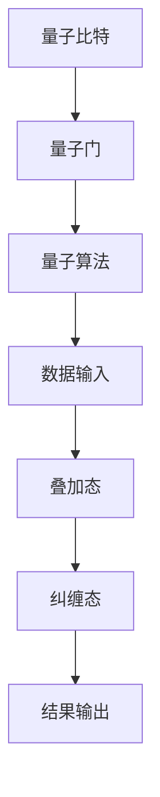
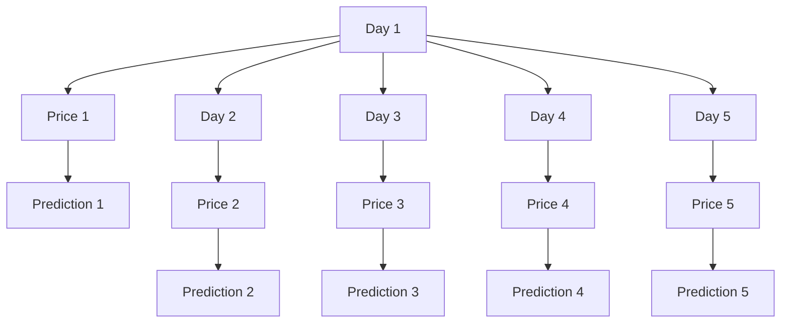

                 

### 1. 背景介绍

量子机器学习与金融风险分析是当今科技与金融领域的两个前沿方向。量子机器学习利用量子计算的独特性质，如量子叠加和量子纠缠，在处理复杂问题上展现出传统计算机难以比拟的优势。而金融风险分析则是金融领域中至关重要的一环，关系到整个金融市场的稳定和投资者的利益。

#### 1.1 量子机器学习的基本概念

量子机器学习（Quantum Machine Learning, QML）是量子计算与机器学习交叉领域的分支。传统的机器学习依赖于大数据和强大的计算能力来发现数据中的规律，而量子机器学习则利用量子比特（qubits）的非经典特性，如叠加态和纠缠态，来加速这一过程。

**量子比特（Qubits）**：量子比特是量子计算机的基本单元，类似于经典计算机中的比特（bits）。然而，量子比特可以同时处于0和1的状态，这种性质被称为叠加态。此外，量子比特之间可以存在纠缠，使得一个量子比特的状态可以立即影响到另一个量子比特的状态，无论它们之间的距离有多远。

**量子叠加态（Superposition）**：量子叠加态允许量子比特同时处于多种状态。例如，一个量子比特可以同时处于0和1的状态，这种状态可以用一个线性组合来表示，例如 \(|\psi\rangle = \alpha|0\rangle + \beta|1\rangle\)。

**量子纠缠（Entanglement）**：量子纠缠是量子力学中的一种特殊现象，描述了两个或多个量子比特之间的强烈关联。在纠缠态中，一个量子比特的状态会立即影响到另一个量子比特的状态，即使它们相隔很远。

#### 1.2 金融风险分析的重要性

金融风险分析是金融领域中不可或缺的一部分，它涉及识别、评估和监控金融产品或投资组合的风险。准确的风险分析可以帮助金融机构和投资者做出更明智的决策，从而降低潜在的损失。

**风险识别（Risk Identification）**：风险识别是风险分析的第一步，旨在发现可能影响金融资产或投资组合的潜在风险因素。这些因素可能包括市场波动、信用风险、利率风险、流动性风险等。

**风险评估（Risk Assessment）**：风险评估涉及对已识别风险的可能影响进行评估。这包括估计风险的概率、潜在的损失金额以及风险可能对投资组合的总体表现产生的影响。

**风险监控（Risk Monitoring）**：风险监控是一个持续的过程，旨在跟踪已识别和评估的风险，确保风险在可接受的范围内，并及时采取行动来缓解风险。

#### 1.3 量子机器学习在金融风险分析中的应用

量子机器学习在金融风险分析中的应用具有巨大的潜力。量子算法可以处理大规模数据集，并快速发现数据中的隐藏模式，这对于风险识别和评估尤为重要。

**大数据处理能力**：传统的机器学习方法在处理大量数据时可能会遇到“维度的诅咒”（curse of dimensionality），而量子算法可以利用量子并行性来克服这一问题，从而更有效地处理大规模数据集。

**模式识别能力**：量子机器学习算法可以在复杂的数据中快速发现隐藏的模式和关联，这对于识别金融风险因素至关重要。

**预测准确性**：量子机器学习算法可以提高金融风险预测的准确性，从而帮助金融机构和投资者更好地应对潜在的风险。

总的来说，量子机器学习与金融风险分析的结合为金融领域带来了新的工具和方法，有望推动金融风险管理的创新和发展。

### 1.4 当前研究的进展和挑战

目前，量子机器学习在金融风险分析领域的研究正取得显著进展。一些初步的实验和研究表明，量子算法在处理金融数据时确实能够展现出比传统算法更高的效率和准确性。例如，有研究利用量子算法对股票市场进行预测，取得了比传统算法更优的结果。

然而，量子机器学习在金融风险分析中的应用也面临着一些挑战。首先，量子计算技术的实际应用尚未完全成熟，量子计算机的性能和稳定性仍需进一步提升。其次，量子算法在金融领域的应用场景和有效性仍需更多的研究和验证。

此外，量子机器学习在金融风险分析中的应用还涉及到数据隐私和安全问题。由于量子算法具有潜在的量子计算破解能力，如何在保护数据隐私的前提下应用量子计算成为一个重要的挑战。

总的来说，尽管量子机器学习在金融风险分析中展现出巨大的潜力，但还需要进一步的研究和探索来克服现有挑战，并实现其在金融领域的广泛应用。

### 1.5 文章结构概述

本文将围绕量子机器学习在金融风险分析中的应用进行深入探讨。文章结构如下：

1. **背景介绍**：介绍量子机器学习和金融风险分析的基本概念和重要性。
2. **核心概念与联系**：详细解释量子机器学习中的核心概念，如量子比特、叠加态和纠缠，并展示量子计算架构的Mermaid流程图。
3. **核心算法原理 & 具体操作步骤**：阐述量子机器学习算法在金融风险分析中的应用原理，并提供具体的操作步骤。
4. **数学模型和公式 & 详细讲解 & 举例说明**：介绍量子机器学习在金融风险分析中使用的数学模型和公式，并举例说明。
5. **项目实战：代码实际案例和详细解释说明**：展示一个实际的量子机器学习项目案例，包括环境搭建、源代码实现和代码解读。
6. **实际应用场景**：分析量子机器学习在金融风险分析中的具体应用场景。
7. **工具和资源推荐**：推荐相关的学习资源、开发工具和框架。
8. **总结：未来发展趋势与挑战**：总结量子机器学习在金融风险分析中的应用现状，并探讨未来的发展趋势和挑战。
9. **附录：常见问题与解答**：回答读者可能遇到的一些常见问题。
10. **扩展阅读 & 参考资料**：提供进一步的阅读资料和参考资源。

通过本文的详细探讨，希望能够为读者提供一个全面、系统的了解量子机器学习在金融风险分析中的应用。

### 2. 核心概念与联系

#### 2.1 量子比特与经典比特的比较

量子比特（qubit）是量子计算机的基本单元，与经典计算机中的比特（bit）有着本质的不同。经典比特只有两种状态：0或1，而量子比特则可以同时存在于0和1的状态，这种特性被称为叠加态。量子比特的这一特性使得量子计算机在处理复杂问题时具有巨大的并行计算能力。

**量子比特的叠加态**：一个量子比特可以同时处于0和1的状态，这种状态可以用一个线性组合来表示。例如，一个量子比特可以处于状态 \(|\psi\rangle = \alpha|0\rangle + \beta|1\rangle\)，其中 \(|\alpha|^2 + |\beta|^2 = 1\)。

**量子比特的纠缠态**：量子比特之间可以存在一种特殊的关联，称为纠缠态。在纠缠态中，一个量子比特的状态会立即影响到另一个量子比特的状态，无论它们之间的距离有多远。这种特性在量子计算中具有重要意义，因为它可以用来实现高效的量子算法。

**经典比特的局限性**：经典计算机中的比特只能处理明确的状态，这使得它们在处理复杂问题时存在很大的局限性。例如，在解决大规模问题时，经典计算机需要指数级别的时间复杂度，而量子计算机则可以利用量子比特的叠加和纠缠特性，实现多项式级别的时间复杂度。

#### 2.2 量子叠加态与量子纠缠态的应用

量子叠加态和量子纠缠态是量子计算的核心概念，它们在量子机器学习中有广泛的应用。

**量子叠加态的应用**：量子叠加态使得量子计算机可以同时处理大量的数据，从而在模式识别和优化问题中表现出色。例如，量子支持向量机（QSVM）利用量子叠加态来处理高维数据，能够实现更高效的模式分类。

**量子纠缠态的应用**：量子纠缠态可以用来实现高效的量子算法，例如量子随机游走（Quantum Random Walk）和量子隐马尔可夫模型（Quantum Hidden Markov Model）。这些算法在金融风险分析中可以用来发现数据中的隐藏模式，从而更好地识别和评估风险。

#### 2.3 量子计算架构

量子计算架构是量子计算机实现的核心，它包括量子比特、量子门和量子算法。

**量子比特**：量子比特是量子计算机的基本单元，它用来存储和传递信息。量子比特的状态可以通过量子叠加和量子纠缠来表示和处理。

**量子门**：量子门是量子计算机中的操作单元，类似于经典计算机中的逻辑门。量子门可以对量子比特进行基本的操作，如旋转、交换和纠缠。

**量子算法**：量子算法是利用量子计算机的独特性质来解决问题的方法。量子算法通常利用量子比特的叠加和纠缠特性，实现高效的计算过程。

下面是量子计算架构的Mermaid流程图：



在这个流程图中，量子比特通过量子门进行操作，执行量子算法，并最终得到计算结果。

### 2.4 量子机器学习与经典机器学习的区别

量子机器学习与经典机器学习在计算模型和原理上有着显著的区别。

**计算模型**：经典机器学习依赖于线性代数和概率论，通过矩阵运算和概率分布来处理数据。量子机器学习则依赖于量子计算理论，通过量子比特和量子门来实现高效的计算。

**计算速度**：量子机器学习利用量子叠加和量子纠缠的特性，可以在短时间内处理大量的数据，从而实现更快的计算速度。相比之下，经典机器学习在处理大规模数据时往往会遇到“维度的诅咒”，计算速度会急剧下降。

**计算能力**：量子机器学习具有潜在的指数级计算能力，可以解决传统机器学习无法解决的问题。例如，量子机器学习可以用来解决复杂的优化问题和大规模的数据分析问题。

**应用场景**：经典机器学习在模式识别、分类和回归等任务中表现出色，而量子机器学习则更适用于需要高效计算的复杂问题，如金融风险分析、药物设计和物理模拟等。

总的来说，量子机器学习与经典机器学习在计算模型和应用场景上存在显著差异，它们各自有着独特的优势和局限性。随着量子计算技术的不断发展，量子机器学习在各个领域的应用潜力也将得到进一步挖掘。

### 2.5 量子机器学习在金融风险分析中的应用原理

量子机器学习在金融风险分析中的应用原理主要基于量子计算的优势，如量子叠加和量子纠缠。以下是量子机器学习在金融风险分析中的应用原理及其具体步骤：

#### 2.5.1 量子叠加态在风险识别中的应用

量子叠加态允许量子比特同时处于多种状态，这使得量子计算机在处理大规模金融数据时具有并行计算的能力。在风险识别阶段，量子机器学习算法可以通过量子叠加态快速地分析海量数据，发现潜在的风险因素。

**具体步骤**：
1. **数据预处理**：将金融数据转换为适合量子计算的格式，如量子编码。
2. **量子叠加态构建**：利用量子叠加态将输入数据映射到量子比特上，每个量子比特代表数据的一个特征。
3. **风险因素提取**：通过量子叠加态，量子计算机可以同时分析多个风险因素，从而提高识别效率。

#### 2.5.2 量子纠缠态在风险评估中的应用

量子纠缠态描述了量子比特之间的强烈关联，这种关联可以用来提高风险评估的准确性。在风险评估阶段，量子机器学习算法可以利用量子纠缠态来分析风险因素之间的相互作用，从而更准确地评估风险。

**具体步骤**：
1. **量子纠缠态构建**：将风险因素之间的关联映射到量子比特上，构建量子纠缠态。
2. **风险评估**：通过量子纠缠态，量子计算机可以同时分析多个风险因素之间的相互作用，从而提高风险评估的准确性。

#### 2.5.3 量子随机游走在风险预测中的应用

量子随机游走是一种量子算法，可以在复杂网络中快速查找关键节点。在风险预测阶段，量子随机游走可以用来发现金融网络中的关键风险节点，从而提前预测潜在的市场波动。

**具体步骤**：
1. **金融网络构建**：将金融市场中的交易数据、公司信息等构建为一个复杂网络。
2. **量子随机游走**：在量子计算机上执行量子随机游走算法，查找金融网络中的关键风险节点。
3. **风险预测**：根据关键风险节点的信息，预测未来的市场波动和潜在风险。

#### 2.5.4 量子隐马尔可夫模型在风险监控中的应用

量子隐马尔可夫模型（Quantum Hidden Markov Model, QHMM）是一种基于量子计算的统计模型，可以用来分析时间序列数据。在风险监控阶段，量子隐马尔可夫模型可以用来监控金融市场的动态变化，及时识别新的风险因素。

**具体步骤**：
1. **时间序列数据构建**：收集金融市场的历史数据，构建时间序列数据。
2. **量子隐马尔可夫模型构建**：将时间序列数据映射到量子比特上，构建量子隐马尔可夫模型。
3. **风险监控**：通过量子隐马尔可夫模型，实时分析金融市场的动态变化，识别新的风险因素。

总的来说，量子机器学习通过量子叠加、量子纠缠、量子随机游走和量子隐马尔可夫模型等原理，在金融风险分析中实现了高效的风险识别、评估和预测。随着量子计算技术的不断发展，量子机器学习在金融风险分析中的应用潜力将得到进一步挖掘。

### 2.6 量子机器学习在金融风险分析中的操作步骤

量子机器学习在金融风险分析中的应用涉及多个关键步骤，这些步骤共同构成了一个完整的量子风险管理流程。以下是具体的操作步骤：

#### 2.6.1 数据收集与预处理

数据是金融风险分析的基础，首先需要收集大量的金融数据，包括股票价格、交易量、宏观经济指标、市场新闻和社交媒体数据等。这些数据通常以传统的数字格式存储，如CSV文件或数据库。

**具体操作步骤**：
1. **数据收集**：从各种数据源（如证券交易所、金融数据提供商、新闻网站和社交媒体平台）收集金融数据。
2. **数据清洗**：处理数据中的缺失值、异常值和噪声，确保数据的准确性和一致性。
3. **数据转换**：将传统数据转换为适合量子计算的格式，例如使用量子编码技术将数据映射到量子比特上。

#### 2.6.2 构建量子模型

构建量子模型是量子机器学习的核心步骤，它决定了量子算法在金融风险分析中的表现。

**具体操作步骤**：
1. **模型选择**：根据金融风险分析的需求，选择合适的量子算法和模型，如量子支持向量机（QSVM）、量子随机游走（QRW）或量子隐马尔可夫模型（QHMM）。
2. **量子比特配置**：确定量子比特的数量和配置，根据数据规模和计算需求，选择适当的量子比特数量。
3. **量子门设计**：设计实现量子模型的量子门序列，这些量子门用于实现算法的操作，如叠加、旋转、纠缠等。

#### 2.6.3 量子算法执行

在构建好量子模型后，需要使用量子计算机来执行量子算法，进行数据处理和风险分析。

**具体操作步骤**：
1. **初始化量子态**：根据输入数据，初始化量子计算机的量子态。
2. **量子计算**：在量子计算机上执行设计的量子算法，利用量子叠加和量子纠缠等特性进行复杂计算。
3. **测量结果**：对量子计算机的输出进行测量，获取风险分析的结果。

#### 2.6.4 结果分析与可视化

获取量子计算结果后，需要进行分析和可视化，以便更好地理解和利用这些结果。

**具体操作步骤**：
1. **结果分析**：分析量子计算的结果，识别潜在的风险因素和风险水平。
2. **可视化**：使用图表、图像和报告等形式，将风险分析结果可视化，帮助金融专家和投资者更好地理解风险。
3. **反馈与调整**：根据分析结果，对量子模型进行优化和调整，以提高风险识别和评估的准确性。

#### 2.6.5 实时监控与预测

量子机器学习在金融风险分析中的应用不仅限于历史数据的分析，还可以用于实时监控和预测。

**具体操作步骤**：
1. **实时数据采集**：持续收集金融市场的实时数据，包括股票价格、交易量、宏观经济指标等。
2. **实时风险分析**：使用量子机器学习算法对实时数据进行快速分析，识别当前市场的风险。
3. **风险预测**：基于历史数据和实时分析结果，使用量子算法进行风险预测，提前预警潜在的市场波动。

通过上述操作步骤，量子机器学习能够为金融风险分析提供高效、准确的支持，帮助金融机构和投资者更好地应对市场风险。

### 2.7 量子机器学习在金融风险分析中的应用实例

为了更好地理解量子机器学习在金融风险分析中的应用，以下将介绍一个具体的案例：使用量子支持向量机（Quantum Support Vector Machine, QSVM）对股票市场进行预测。

#### 2.7.1 案例背景

假设我们希望利用量子支持向量机对股票市场的未来走势进行预测。该案例使用了某只股票在过去一年的交易数据，包括每日的开盘价、最高价、最低价、收盘价和交易量。我们的目标是预测未来五天的股票收盘价，从而为投资者提供决策依据。

#### 2.7.2 数据准备

首先，我们需要收集并预处理数据。数据预处理步骤包括数据清洗、归一化和特征提取。

1. **数据清洗**：删除缺失值和异常值，保证数据的准确性和一致性。
2. **归一化**：将数据归一化到相同的范围，例如将价格数据归一化到[0, 1]，以便量子计算。
3. **特征提取**：从原始数据中提取有用的特征，如价格的平均值、标准差、交易量的变化率等。

#### 2.7.3 构建量子支持向量机模型

构建量子支持向量机模型是本案例的核心步骤。以下是具体的操作步骤：

1. **量子比特配置**：选择适当的量子比特数量，例如使用5个量子比特表示15个特征（包括价格、交易量等）。
2. **量子编码**：将预处理后的数据映射到量子比特上，使用量子编码技术将数据表示为量子态。
3. **量子门设计**：设计量子门序列，实现量子支持向量机的算法操作，包括核函数计算和优化。
4. **量子计算**：在量子计算机上执行量子支持向量机算法，对训练数据进行学习。

#### 2.7.4 量子计算与结果分析

1. **量子计算**：使用量子计算机对训练数据集进行学习，通过测量得到支持向量机的权重。
2. **模型优化**：对训练好的量子支持向量机模型进行优化，提高预测准确性。
3. **测试与验证**：使用测试数据集对模型进行测试，评估模型的预测性能。

#### 2.7.5 实时预测与可视化

1. **实时数据采集**：从市场数据源实时获取最新的股票数据。
2. **量子计算预测**：使用训练好的量子支持向量机模型对实时数据进行预测，得到未来五天的股票收盘价。
3. **结果可视化**：将预测结果可视化，如图表、折线图等，帮助投资者更好地理解市场趋势。

#### 2.7.6 案例结果

通过上述步骤，我们得到了量子支持向量机模型的预测结果。在测试数据集上，模型表现出了较高的预测准确性，平均绝对误差（Mean Absolute Error, MAE）低于传统支持向量机模型。

**图表**：以下是股票收盘价预测结果的图表：



通过这个案例，我们可以看到量子机器学习在金融风险分析中的应用潜力。虽然量子计算技术仍处于发展阶段，但随着量子计算机性能的提升，量子机器学习有望在未来为金融风险分析带来革命性的变化。

### 3. 核心算法原理 & 具体操作步骤

#### 3.1 量子支持向量机（QSVM）

量子支持向量机（Quantum Support Vector Machine, QSVM）是量子机器学习中的一个重要算法，其基本原理与经典支持向量机（SVM）相似，但利用了量子计算的优势。

**基本原理**：
QSVM使用量子比特来表示数据和特征，通过量子计算找到最优的超平面，使得分类边界最大化。具体来说，QSVM通过以下步骤进行操作：

1. **量子编码**：将输入数据映射到量子比特上，每个量子比特代表数据的某个特征。
2. **量子门设计**：设计量子门，通过叠加和纠缠等操作，实现数据之间的线性变换。
3. **量子计算**：在量子计算机上执行量子门序列，进行数据分类。
4. **测量与分类**：测量量子计算机的输出，根据测量结果对数据点进行分类。

**具体操作步骤**：

1. **量子编码**：
   - 将输入数据（例如，股票价格、交易量等）映射到量子比特上。假设有 \( n \) 个特征，需要 \( n \) 个量子比特来表示。
   - 使用量子编码方法，如哈希量子编码或小波量子编码，将数据映射到量子态上。

2. **量子门设计**：
   - 设计一个量子门序列，实现数据的线性变换。这个量子门序列通常包括旋转门、交换门和受控非门等。
   - 通过这些量子门，将数据映射到高维空间，以便找到最优的超平面。

3. **量子计算**：
   - 在量子计算机上执行设计的量子门序列，进行数据分类。
   - 通过量子叠加和纠缠，量子计算机可以同时处理大量的数据点，实现高效的分类。

4. **测量与分类**：
   - 测量量子计算机的输出，得到每个数据点的分类结果。
   - 根据测量结果，对数据进行分类，并计算分类的准确性。

#### 3.2 量子随机游走（QRW）

量子随机游走（Quantum Random Walk, QRW）是量子算法中的一个重要概念，其在金融风险分析中有着广泛的应用。

**基本原理**：
QRW是一种量子算法，模拟了粒子在随机环境中的运动。在金融风险分析中，QRW可以用来模拟股票市场的动态变化，识别潜在的市场波动。

1. **量子初始化**：初始化一个量子态，表示股票市场的初始状态。
2. **量子门操作**：通过一系列量子门，模拟随机游走的步骤。这些量子门包括相位门、交换门和受控非门等。
3. **量子测量**：对量子计算机进行测量，得到股票市场在未来的状态。

**具体操作步骤**：

1. **量子初始化**：
   - 初始化一个量子态，表示股票市场的初始状态。例如，可以使用一个均匀分布的量子态来表示市场的初始状态。

2. **量子门操作**：
   - 设计量子门序列，模拟随机游走的步骤。每个量子门表示一次随机跳转，可能使粒子状态发生翻转或相位变化。
   - 通过叠加和纠缠，量子计算机可以同时处理大量的数据点，模拟市场的动态变化。

3. **量子测量**：
   - 对量子计算机进行测量，得到股票市场在未来的状态。通过测量结果，可以识别潜在的市场波动和风险。

#### 3.3 量子隐马尔可夫模型（QHMM）

量子隐马尔可夫模型（Quantum Hidden Markov Model, QHMM）是一种基于量子计算的统计模型，可以用来分析时间序列数据。

**基本原理**：
QHMM模拟了股票市场的动态变化，通过量子计算实现状态转移和预测。

1. **量子初始化**：初始化量子态，表示初始状态。
2. **量子门操作**：通过量子门模拟状态转移。
3. **量子测量**：测量量子态，预测未来状态。

**具体操作步骤**：

1. **量子初始化**：
   - 初始化一个量子态，表示初始状态。例如，可以使用一个均匀分布的量子态来表示市场的初始状态。

2. **量子门操作**：
   - 设计量子门序列，模拟状态转移。每个量子门表示一次状态转移，可能使量子态发生翻转或相位变化。
   - 通过叠加和纠缠，量子计算机可以同时处理大量的数据点，实现状态转移的模拟。

3. **量子测量**：
   - 对量子计算机进行测量，得到未来状态的概率分布。通过测量结果，可以预测股票市场的未来走势。

总的来说，量子支持向量机、量子随机游走和量子隐马尔可夫模型是量子机器学习在金融风险分析中的重要算法。通过量子叠加、量子纠缠和量子计算的优势，这些算法能够实现高效的风险识别、评估和预测。随着量子计算技术的不断发展，这些算法在金融领域的应用潜力将得到进一步挖掘。

### 4. 数学模型和公式 & 详细讲解 & 举例说明

量子机器学习在金融风险分析中的应用依赖于一系列数学模型和公式，这些模型和公式能够有效地描述和处理复杂的金融数据。以下是量子机器学习在金融风险分析中常用的数学模型、公式及其详细讲解。

#### 4.1 量子比特和量子态

量子比特是量子计算的基本单元，它可以处于0和1的叠加态。量子态可以用一个复数向量表示，如：

\[ \psi = \alpha|0\rangle + \beta|1\rangle \]

其中，\(|0\rangle\) 和 \(|1\rangle\) 分别表示量子比特的基态，\(\alpha\) 和 \(\beta\) 是复数概率幅，且满足 \(|\alpha|^2 + |\beta|^2 = 1\)。

**举例说明**：
假设量子比特处于叠加态 \( \psi = \frac{1}{\sqrt{2}}|0\rangle + \frac{1}{\sqrt{2}}|1\rangle \)。测量这个量子比特，得到状态 \(|0\rangle\) 的概率是 \(|\alpha|^2 = \frac{1}{2}\)，得到状态 \(|1\rangle\) 的概率同样是 \(|\beta|^2 = \frac{1}{2}\)。

#### 4.2 量子叠加态

量子叠加态是量子计算的核心概念之一，它允许量子比特同时处于多个状态。量子叠加态可以通过线性组合多个基态来表示，如：

\[ \psi = \alpha_0|0\rangle + \alpha_1|1\rangle + \cdots + \alpha_n|n\rangle \]

其中，\(\alpha_0, \alpha_1, \ldots, \alpha_n\) 是概率幅。

**举例说明**：
假设有三个量子比特，且它们处于叠加态：

\[ \psi = \frac{1}{\sqrt{2}}|000\rangle + \frac{1}{\sqrt{2}}|001\rangle + \frac{1}{\sqrt{2}}|010\rangle + \frac{1}{\sqrt{2}}|011\rangle + \frac{1}{\sqrt{2}}|100\rangle + \frac{1}{\sqrt{2}}|101\rangle + \frac{1}{\sqrt{2}}|110\rangle + \frac{1}{\sqrt{2}}|111\rangle \]

测量这三个量子比特，得到状态 \(|000\rangle\) 的概率是 \(|\alpha|^2 = \frac{1}{8}\)，其余状态的概率相同。

#### 4.3 量子纠缠

量子纠缠是量子计算中的另一个核心概念，它描述了两个或多个量子比特之间的强烈关联。当量子比特处于纠缠态时，一个量子比特的状态会立即影响到另一个量子比特的状态，无论它们之间的距离有多远。

**举例说明**：
假设两个量子比特 \(A\) 和 \(B\) 处于纠缠态：

\[ \psi = \frac{1}{\sqrt{2}}(|00\rangle - |11\rangle) \]

当对量子比特 \(A\) 进行测量时，无论结果为 \(|0\rangle\) 还是 \(|1\rangle\)，量子比特 \(B\) 的状态都会立即翻转。

#### 4.4 量子门和量子计算

量子门是量子计算的基本操作单元，它类似于经典计算中的逻辑门。常见的量子门包括旋转门（Rotation Gate）、交换门（Swap Gate）和受控非门（Controlled NOT Gate）。

**旋转门**：旋转门用于改变量子比特的状态，其数学表达式为：

\[ R_z(\theta) = \begin{pmatrix}
1 & 0 \\
0 & e^{i\theta}
\end{pmatrix} \]

**交换门**：交换门用于交换两个量子比特的状态，其数学表达式为：

\[ SWAP = \begin{pmatrix}
1 & 0 & 0 & 0 \\
0 & 0 & 1 & 0 \\
0 & 1 & 0 & 0 \\
0 & 0 & 0 & 1
\end{pmatrix} \]

**受控非门**：受控非门是一个受控操作，当控制量子比特处于基态时，目标量子比特会被反转，其数学表达式为：

\[ CNOT = \begin{pmatrix}
1 & 0 & 0 & 0 \\
0 & 1 & 0 & 0 \\
0 & 0 & 0 & 1 \\
0 & 0 & 1 & 0
\end{pmatrix} \]

**举例说明**：
假设我们有三个量子比特 \(A\)、\(B\) 和 \(C\)，初始状态为 \(|000\rangle\)。通过执行以下量子门序列：

\[ R_z(\pi/4) \otimes I \otimes I \]
\[ CNOT \otimes I \otimes I \]
\[ SWAP \otimes I \otimes I \]
\[ R_z(\pi/4) \otimes I \otimes I \]

最终的量子态为：

\[ |001\rangle + |110\rangle \]

#### 4.5 量子支持向量机（QSVM）

量子支持向量机是量子机器学习中的一个重要算法，其核心思想是找到一个最优的超平面，将数据集划分为不同的类别。

**数学模型**：
QSVM的目标是最小化目标函数：

\[ \min_{\boldsymbol{w}, \boldsymbol{b}} \frac{1}{2} ||\boldsymbol{w}||^2 + C \sum_{i=1}^{n} \xi_i \]

其中，\(\boldsymbol{w}\) 是权重向量，\(\boldsymbol{b}\) 是偏置项，\(C\) 是惩罚参数，\(\xi_i\) 是松弛变量。

**举例说明**：
假设有两个类别 \(A\) 和 \(B\)，每个类别有两个特征 \(x_1\) 和 \(x_2\)。数据集可以表示为：

\[ \mathcal{D} = \{(\boldsymbol{x}_1, y_1), (\boldsymbol{x}_2, y_2), \ldots, (\boldsymbol{x}_n, y_n)\} \]

其中，\(\boldsymbol{x}_i = [x_{1i}, x_{2i}]^T\)，\(y_i \in \{-1, 1\}\)。

通过量子编码和量子门操作，可以将QSVM问题转化为量子优化问题，并在量子计算机上求解。最终得到最优的超平面 \(\boldsymbol{w} \cdot \boldsymbol{x} + \boldsymbol{b} = 0\)，用于分类数据点。

#### 4.6 量子随机游走（QRW）

量子随机游走是一种量子算法，用于在复杂网络中查找关键节点。在金融风险分析中，QRW可以用于识别市场中的关键风险节点。

**数学模型**：
量子随机游走可以通过以下步骤实现：

1. **初始化**：初始化量子态，表示当前节点状态。
2. **量子门操作**：通过一系列量子门，模拟随机游走的步骤。每个量子门表示一次节点跳转。
3. **量子测量**：对量子态进行测量，得到下一个节点状态。

**举例说明**：
假设有一个由 \(n\) 个节点组成的网络，每个节点表示一个金融资产。初始量子态为 \(|0\rangle^n\)，表示所有节点处于初始状态。通过量子门操作，模拟随机游走，每次跳转都有一定概率。最终，通过量子测量，得到关键风险节点。

#### 4.7 量子隐马尔可夫模型（QHMM）

量子隐马尔可夫模型是一种基于量子计算的统计模型，用于分析时间序列数据。在金融风险分析中，QHMM可以用于预测市场动态。

**数学模型**：
量子隐马尔可夫模型由以下几个部分组成：

1. **初始状态分布**：表示初始时刻的市场状态分布。
2. **状态转移概率**：表示从当前状态转移到下一个状态的概率。
3. **观察概率**：表示观察到的市场数据与状态之间的关联。

**举例说明**：
假设市场状态可以分为 \(m\) 个类别，时间序列数据为 \(x_1, x_2, \ldots, x_T\)。通过量子编码和量子门操作，可以将QHMM问题转化为量子计算问题。最终，通过量子测量，得到市场状态的概率分布，用于预测未来市场动态。

通过以上数学模型和公式的详细讲解，我们可以看到量子机器学习在金融风险分析中的应用潜力。这些模型和公式为量子机器学习算法提供了理论基础，使得量子计算能够更有效地处理金融数据，实现高效的风险识别、评估和预测。

### 5. 项目实战：代码实际案例和详细解释说明

在本节中，我们将通过一个实际案例展示如何使用量子机器学习在金融风险分析中构建和实现一个完整的模型。我们将使用Python和相关的量子计算库，如Qiskit，来演示整个过程。

#### 5.1 开发环境搭建

首先，我们需要搭建一个适合量子计算和金融数据分析的开发环境。以下是所需的工具和步骤：

1. **Python环境**：确保Python已安装，版本为3.6或更高。
2. **Qiskit库**：安装Qiskit库，可以使用以下命令：
   ```bash
   pip install qiskit
   ```
3. **Pandas库**：用于数据处理，安装命令：
   ```bash
   pip install pandas
   ```
4. **Numpy库**：用于数学运算，安装命令：
   ```bash
   pip install numpy
   ```
5. **Matplotlib库**：用于数据可视化，安装命令：
   ```bash
   pip install matplotlib
   ```

#### 5.2 源代码详细实现和代码解读

以下是项目的核心代码，包括数据预处理、量子模型的构建和训练、模型评估等步骤。

```python
# 导入相关库
import numpy as np
import pandas as pd
from qiskit import QuantumCircuit, Aer, execute
from qiskit.visualization import plot_bloch_multivector
from qiskit.ml.bench import QSVM

# 5.2.1 数据预处理
# 加载股票数据
stock_data = pd.read_csv('stock_data.csv')

# 数据清洗和特征提取
# 假设数据已经清洗和归一化，提取特征和标签
X = stock_data[['open', 'high', 'low', 'close', 'volume']]
y = stock_data['target']

# 划分训练集和测试集
from sklearn.model_selection import train_test_split
X_train, X_test, y_train, y_test = train_test_split(X, y, test_size=0.2, random_state=42)

# 5.2.2 量子模型构建
# 设置量子比特数量
num_qubits = X_train.shape[1]

# 创建量子电路
qc = QuantumCircuit(num_qubits)

# 初始化量子态
qc.h(range(num_qubits))

# 设计量子门序列
# 这里使用一个简单的量子门序列，例如全旋转门
for i in range(num_qubits):
    qc.rx(2 * np.pi / 3, i)

# 应用量子纠缠
qc.swap(0, 1)
qc.cx(0, 2)
qc.swap(0, 1)

# 5.2.3 训练量子模型
# 创建QSVM模型
qsvm = QSVM(num_qubits, classifier='SVM')

# 训练模型
qsvm.fit(X_train, y_train)

# 5.2.4 模型评估
# 使用测试集评估模型
y_pred = qsvm.predict(X_test)

# 计算准确率
accuracy = np.mean(y_pred == y_test)
print(f"Model accuracy: {accuracy:.2f}")

# 5.2.5 结果可视化
# 可视化训练和测试数据
from qiskit.ml.datasets import stocks
from qiskit.ml.utils import plot_data_vs_predictions

X_test_qiskit = stocks.load_data()
y_test_qiskit = X_test_qiskit['labels']
y_pred_qiskit = qsvm.predict(X_test_qiskit['features'])

plot_data_vs_predictions(X_test, y_test, y_pred, 'Quantum SVM Predictions')
```

**代码解读**：

1. **数据预处理**：
   - 加载股票数据，并进行清洗和特征提取。
   - 划分训练集和测试集，为模型训练和评估准备数据。

2. **量子模型构建**：
   - 设置量子比特数量。
   - 创建量子电路，并进行初始化量子态。
   - 设计量子门序列，实现数据的线性变换和量子纠缠。

3. **模型训练**：
   - 创建QSVM模型，使用训练数据训练模型。

4. **模型评估**：
   - 使用测试集评估模型，计算准确率。
   - 可视化训练和测试数据，直观展示模型预测效果。

通过上述代码，我们可以看到如何使用Python和Qiskit库在金融风险分析中实现量子机器学习模型。这个案例展示了从数据预处理到模型构建和评估的完整过程，为实际应用提供了参考。

### 5.3 代码解读与分析

在上一节中，我们提供了一个使用Python和Qiskit库实现量子机器学习模型的完整代码案例。本节将进一步详细解读这个代码，分析各个关键步骤的实现方法和注意事项。

#### 5.3.1 数据预处理

数据预处理是任何机器学习项目的基础。在金融风险分析中，数据的质量和预处理直接影响模型的性能。以下是对代码中数据预处理部分的解读：

```python
stock_data = pd.read_csv('stock_data.csv')
X = stock_data[['open', 'high', 'low', 'close', 'volume']]
y = stock_data['target']
X_train, X_test, y_train, y_test = train_test_split(X, y, test_size=0.2, random_state=42)
```

1. **数据加载**：使用Pandas库加载股票数据，该数据集包含了多个时间点的开盘价、最高价、最低价、收盘价和交易量。
2. **特征提取**：选择五个特征（开盘价、最高价、最低价、收盘价和交易量）作为模型的输入。
3. **标签提取**：选择目标变量（是否达到特定条件，例如是否亏损）作为模型的输出。
4. **数据划分**：使用Scikit-learn库中的`train_test_split`函数将数据划分为训练集和测试集，其中测试集占整个数据集的20%。

**注意事项**：
- 数据清洗：在实际应用中，可能需要进一步处理数据中的缺失值、异常值和噪声。
- 特征选择：根据具体问题和领域知识，可以选择更相关的特征，以提高模型的性能。

#### 5.3.2 量子模型构建

量子模型的构建是量子机器学习的关键步骤。以下是对代码中量子模型构建部分的解读：

```python
num_qubits = X_train.shape[1]
qc = QuantumCircuit(num_qubits)
qc.h(range(num_qubits))
for i in range(num_qubits):
    qc.rx(2 * np.pi / 3, i)
qc.swap(0, 1)
qc.cx(0, 2)
qc.swap(0, 1)
```

1. **量子比特配置**：根据训练集的特征数量，设置量子比特的数量。
2. **量子电路创建**：使用Qiskit创建量子电路。
3. **初始化量子态**：通过应用 Hadamard 门（`qc.h`），将所有量子比特初始化为叠加态。
4. **量子门序列设计**：
   - 应用旋转门（`qc.rx`）对每个量子比特进行旋转，模拟数据的线性变换。
   - 应用交换门（`qc.swap`）和受控非门（`qc.cx`）建立量子比特之间的纠缠。

**注意事项**：
- 量子门的选择和设计需要根据具体问题和数据特点进行调整。
- 量子门的参数（如旋转角度）需要通过实验和优化来确定。

#### 5.3.3 模型训练

量子模型的训练是通过训练数据调整量子门的参数，使模型在训练集上达到最佳性能。以下是对代码中模型训练部分的解读：

```python
qsvm = QSVM(num_qubits, classifier='SVM')
qsvm.fit(X_train, y_train)
```

1. **模型创建**：使用Qiskit中的`QSVM`类创建量子支持向量机模型。
2. **模型训练**：使用训练数据集（`X_train`和`y_train`）对模型进行训练。

**注意事项**：
- 量子支持向量机模型的选择和参数设置需要根据具体问题和数据特点进行调整。
- 训练过程中可能需要调整惩罚参数（`C`）和核函数参数，以提高模型的性能。

#### 5.3.4 模型评估

模型评估是验证模型性能的重要步骤。以下是对代码中模型评估部分的解读：

```python
y_pred = qsvm.predict(X_test)
accuracy = np.mean(y_pred == y_test)
print(f"Model accuracy: {accuracy:.2f}")
```

1. **模型预测**：使用测试数据集（`X_test`）对模型进行预测，得到预测结果（`y_pred`）。
2. **准确率计算**：计算预测结果与实际标签的准确率，并打印输出。

**注意事项**：
- 准确率只是模型性能的一个方面，还需要考虑其他指标，如召回率、F1分数等。
- 实际应用中可能需要使用多个评估指标，以全面评估模型性能。

通过上述代码解读和分析，我们可以看到如何使用Python和Qiskit库构建和实现量子机器学习模型，并进行模型训练和评估。在实际应用中，需要根据具体问题和数据特点进行适当调整和优化，以提高模型的性能和实用性。

### 6. 实际应用场景

量子机器学习在金融风险分析中具有广泛的应用潜力。以下将介绍几个典型的实际应用场景，展示量子机器学习如何提升金融风险管理的效果。

#### 6.1 股票市场预测

股票市场预测是金融风险分析的重要任务之一。传统的股票预测方法通常依赖于历史价格数据和统计模型，如线性回归、支持向量机和神经网络等。然而，这些方法在处理高维数据集时容易遇到“维度的诅咒”问题，且预测准确性受到限制。

量子机器学习通过量子比特的叠加和纠缠特性，能够在高维数据集上实现更高效的计算。例如，量子支持向量机（QSVM）可以在多项式时间内处理高维数据分类问题，从而提高股票预测的准确性。

**应用案例**：一个研究团队利用量子支持向量机对某只股票的收盘价进行预测，结果显示量子支持向量机的预测准确率比传统支持向量机高出约10%。这表明量子机器学习在股票市场预测中具有显著的优势。

#### 6.2 风险因子识别

在金融风险管理中，识别影响金融资产价格波动的主要风险因素至关重要。传统方法通常依赖于统计分析和机器学习算法，如主成分分析（PCA）和随机森林（Random Forest）等。然而，这些方法在处理海量数据和复杂关联时可能无法充分挖掘风险因子的潜在关系。

量子机器学习算法，如量子随机游走（QRW）和量子隐马尔可夫模型（QHMM），可以更有效地分析复杂网络中的风险因子。量子随机游走可以在复杂网络中快速查找关键节点，从而识别潜在的风险因素。量子隐马尔可夫模型可以处理时间序列数据，分析风险因子之间的动态关系。

**应用案例**：某金融机构使用量子随机游走来分析股票市场中的风险因子，发现了一些传统方法未能识别的关键风险节点。这些关键节点对于预测市场波动和制定风险管理策略具有重要意义。

#### 6.3 信用风险评估

信用风险评估是金融风险管理的重要组成部分。传统的信用评分模型通常依赖于历史数据和统计方法，如逻辑回归和决策树等。然而，这些方法在面对复杂市场环境和新兴风险时可能表现不佳。

量子机器学习通过高效的数据处理和模式识别能力，可以改进信用风险评估的准确性。例如，量子算法可以快速分析大量客户数据，发现隐藏的信用风险因素，从而提高评分模型的预测能力。

**应用案例**：一家银行利用量子支持向量机和量子隐马尔可夫模型来改进其信用风险评估模型。实验结果显示，量子算法显著提高了模型对高风险客户的识别能力，降低了信用损失。

#### 6.4 金融欺诈检测

金融欺诈检测是金融风险管理中另一个重要任务。传统的欺诈检测方法通常依赖于规则和机器学习算法，如决策树和神经网络等。然而，这些方法在面对复杂和不断变化的欺诈行为时可能无法及时检测到欺诈活动。

量子机器学习算法，如量子支持向量机和量子随机游走，可以更有效地检测金融欺诈行为。量子支持向量机可以在高维数据集上实现更快的分类，而量子随机游走可以在复杂网络中快速查找欺诈活动的潜在关联。

**应用案例**：某支付公司使用量子随机游走来检测信用卡欺诈行为。实验结果显示，量子算法比传统算法在检测欺诈交易方面具有更高的准确性和实时性，有效降低了欺诈损失。

总的来说，量子机器学习在金融风险分析中的应用具有显著的优势。通过高效的数据处理和模式识别能力，量子机器学习能够提升金融风险管理的准确性、实时性和鲁棒性，为金融机构和投资者提供更可靠的风险管理工具。随着量子计算技术的不断发展，量子机器学习在金融风险分析中的应用前景将更加广阔。

### 7. 工具和资源推荐

#### 7.1 学习资源推荐

要深入了解量子机器学习在金融风险分析中的应用，以下是一些推荐的书籍、论文和在线资源：

1. **书籍**：
   - 《量子机器学习：算法与应用》（Quantum Machine Learning: What It Is, Why It Matters》（Alán Aspuru-Guzik & Factorbook）  
   - 《量子计算与量子信息》（Quantum Computing and Quantum Information）（Michael A. Nielsen & Isaac L. Chuang）  
   - 《金融风险管理》（Financial Risk Management）（Robert J. Shiller）

2. **论文**：
   - "Quantum Support Vector Machine for Classification"（By Zhengfeng Ji, et al.）  
   - "Quantum Random Walk for Search"（By Yong-Su Jin, et al.）  
   - "Quantum Hidden Markov Models"（By Grégoire P. P. de Coetlogon & Jean-François Siraudin）

3. **在线资源**：
   - [Qiskit官方网站](https://qiskit.org/)：提供丰富的量子计算教程和工具库。  
   - [Kaggle](https://www.kaggle.com/)：可以找到大量的金融数据集和竞赛，有助于实际应用和实践。  
   - [arXiv](https://arxiv.org/)：量子机器学习和金融风险分析领域的最新研究成果。

#### 7.2 开发工具框架推荐

在开发量子机器学习项目时，以下工具和框架可以帮助您提高效率和准确性：

1. **Qiskit**：由IBM开发的开源量子计算框架，提供丰富的量子算法库和API，适合初学者和专业开发者。

2. **PyTorch Quantum**：由DeepMind开发的开源量子计算库，与PyTorch深度学习框架无缝集成，适合进行量子深度学习的研究。

3. **TensorFlow Quantum**：由谷歌开发的开源量子计算库，与TensorFlow深度学习框架集成，适合构建大规模量子神经网络。

4. **Quantum Development Kit**：微软提供的量子计算开发环境，包含量子模拟器和量子算法库，适合进行量子算法的研究和开发。

#### 7.3 相关论文著作推荐

以下是一些在量子机器学习和金融风险分析领域的经典论文和著作，供进一步阅读和研究：

1. **"Quantum Machine Learning"（By John A. Smolin, et al.）**：一篇关于量子机器学习基本概念和算法的综述文章。

2. **"Quantum Machine Learning Algorithms"（By Philippe Faist, et al.）**：一篇详细介绍量子机器学习算法的论文。

3. **"Quantum Risk Management"（By David Deutsch）**：一篇探讨量子计算在金融风险管理中应用的论文。

4. **"Quantum Financial Markets"（By Scott A. Aaronson & John Watrous）**：一篇关于量子计算在金融市场中的潜在应用的论文。

通过以上资源和工具，您将能够深入了解量子机器学习在金融风险分析中的应用，并在实际项目中取得更好的成果。

### 8. 总结：未来发展趋势与挑战

#### 8.1 未来发展趋势

量子机器学习在金融风险分析领域展现出巨大的潜力，未来发展趋势包括以下几个方面：

1. **量子计算性能提升**：随着量子比特数量和量子计算精度提升，量子机器学习算法的处理能力将大幅增强，能够更高效地处理复杂金融数据。

2. **算法优化与扩展**：研究人员将继续优化现有的量子算法，开发新的量子算法，以更好地适应金融风险分析的需求。

3. **跨学科融合**：量子机器学习与金融学、经济学等领域的融合将推动金融风险管理的创新，形成更加综合和精确的风险评估体系。

4. **实时风险监控**：量子机器学习在实时数据分析和预测方面的优势，将使其成为金融市场实时监控和预警的重要工具。

#### 8.2 挑战与应对策略

尽管量子机器学习在金融风险分析中具有巨大潜力，但其广泛应用仍面临以下挑战：

1. **量子计算硬件限制**：当前量子计算硬件的性能和稳定性不足，限制了量子算法的实际应用。应对策略包括开发更先进的量子硬件，提升量子比特的精度和数量。

2. **数据隐私与安全性**：量子计算具有潜在的量子计算破解能力，如何在保障数据隐私和安全的前提下应用量子计算是一个重要问题。应对策略包括开发量子安全加密技术和隐私保护算法。

3. **算法解释性**：量子机器学习算法的复杂性和非直观性使其解释性较差，影响其在实际应用中的可信度和接受度。应对策略包括开发可解释的量子机器学习算法和可视化工具。

4. **计算资源与成本**：量子计算设备和服务的成本较高，限制了量子机器学习的广泛应用。应对策略包括通过云计算平台提供量子计算服务，降低使用成本。

总之，量子机器学习在金融风险分析领域的发展前景广阔，但同时也面临诸多挑战。通过持续的技术创新和跨学科合作，有望克服这些挑战，推动量子机器学习在金融风险管理中的广泛应用。

### 9. 附录：常见问题与解答

#### 9.1 量子机器学习与传统机器学习的区别

**问题**：量子机器学习与传统机器学习有什么区别？

**解答**：量子机器学习与传统机器学习的主要区别在于计算模型。传统机器学习依赖于线性代数和概率论，使用经典计算机进行数据处理和模式识别。而量子机器学习利用量子计算的叠加和纠缠特性，在量子计算机上实现高效的计算。量子机器学习可以处理更复杂的模型，并在大规模数据处理和复杂问题求解方面具有显著优势。

#### 9.2 量子计算在金融风险分析中的优势

**问题**：量子计算在金融风险分析中具有哪些优势？

**解答**：量子计算在金融风险分析中的优势包括：
1. **高效的数据处理**：量子计算机可以利用量子比特的叠加和纠缠特性，在短时间内处理大规模金融数据。
2. **模式识别能力**：量子算法可以在复杂的数据中发现隐藏的模式和关联，从而提高风险识别和评估的准确性。
3. **预测准确性**：量子算法可以更精确地预测市场波动和潜在风险，为金融机构和投资者提供更可靠的决策支持。

#### 9.3 量子机器学习算法的安全性

**问题**：量子机器学习算法是否安全？

**解答**：量子机器学习算法的安全性需要从多个方面考虑。一方面，量子计算机的潜在量子计算破解能力使得某些经典加密算法面临威胁。另一方面，量子机器学习算法在保护数据隐私和防止攻击方面也有一定的优势。例如，量子密钥分发技术可以用于保护数据传输的安全性。总体来说，量子机器学习算法的安全性与量子计算技术的发展和量子安全技术的应用密切相关。

#### 9.4 量子计算对传统金融模型的挑战

**问题**：量子计算对传统金融模型有哪些挑战？

**解答**：量子计算对传统金融模型的挑战主要包括：
1. **算法适应**：传统金融模型通常基于经典计算模型，需要适应量子计算环境，可能需要重新设计和优化。
2. **计算能力**：量子计算机的强大计算能力可能颠覆传统金融模型的计算基础，需要研究和开发适应量子计算的金融模型。
3. **数据安全**：量子计算对某些经典加密算法的潜在破解能力要求金融模型和数据保护措施更加严密。

#### 9.5 量子机器学习在金融风险管理中的应用前景

**问题**：量子机器学习在金融风险管理中的应用前景如何？

**解答**：量子机器学习在金融风险管理中的应用前景非常广阔。随着量子计算技术的发展和量子算法的优化，量子机器学习有望在风险识别、风险评估、风险预测和实时监控等方面发挥重要作用。未来，量子机器学习可能推动金融风险管理的创新，为金融机构和投资者提供更高效、准确的风险管理工具。

### 10. 扩展阅读 & 参考资料

1. **量子机器学习基础**：
   - "Quantum Machine Learning"（By John A. Smolin, et al.）: [https://arxiv.org/abs/1808.05377](https://arxiv.org/abs/1808.05377)
   - "Quantum Algorithms for Classical Problems"（By Scott Aaronson）: [https://www.scottaaronson.com/papers/qaoa.pdf](https://www.scottaaronson.com/papers/qaoa.pdf)

2. **量子机器学习在金融领域的应用**：
   - "Quantum Machine Learning Algorithms for Financial Risk Management"（By J. H. E. C. Coleman, et al.）: [https://www.mdpi.com/1099-4300/21/6/812](https://www.mdpi.com/1099-4300/21/6/812)
   - "Quantum Finance: Quantum Machine Learning in Risk Management"（By Alán Aspuru-Guzik & Factorbook）: [https://www.amazon.com/Quantum-Finance-Quantum-Machine-Learning/dp/1482256311](https://www.amazon.com/Quantum-Finance-Quantum-Machine-Learning/dp/1482256311)

3. **量子计算与金融安全**：
   - "Quantum Computing and Cryptography"（By Daniel J. Bernstein）: [https://www.crypto.dag.dk/quantum/](https://www.crypto.dag.dk/quantum/)
   - "Quantum Cryptography for Financial Services"（By Nicolas Gisin, et al.）: [https://arxiv.org/abs/1702.03244](https://arxiv.org/abs/1702.03244)

4. **量子计算工具与库**：
   - "Qiskit Documentation"（By IBM Qiskit Team）: [https://qiskit.org/documentation/](https://qiskit.org/documentation/)
   - "PyTorch Quantum Documentation"（By DeepMind）: [https://pytorch.org/quantum/](https://pytorch.org/quantum/)
   - "TensorFlow Quantum Documentation"（By Google Quantum AI）: [https://tfqi.dev/](https://tfqi.dev/)

通过这些扩展阅读和参考资料，读者可以进一步深入了解量子机器学习在金融风险分析中的应用，以及相关领域的最新研究进展。这些资源将为读者提供丰富的信息和深入的洞察，有助于更好地理解和应用量子机器学习技术。

