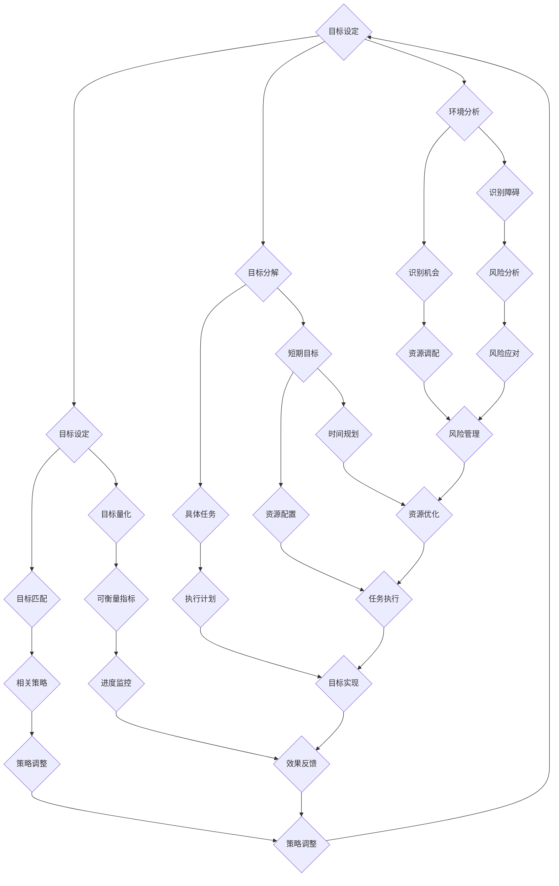

                 

### 背景介绍

#### 长期目标管理的现状

在现代社会中，目标管理已经成为组织和个人成功的关键要素。无论是个人职业发展，还是企业战略规划，制定和实现长期目标都是不可或缺的环节。然而，面对复杂多变的环境和日益增加的挑战，长期目标管理的有效实施并非易事。尽管有许多研究和方法试图解决这一问题，但成功率仍然不高。

据麦肯锡全球研究院（McKinsey Global Institute）的一项调查，只有不到20%的公司能够在长期目标管理方面取得显著成果。此外，根据哈佛商学院（Harvard Business Review）的一项研究，超过一半的员工在执行长期目标时感到困惑和挫败。这一现状引发了广泛的讨论，人们开始思考：为什么长期目标管理如此困难？如何提高其有效性？

#### 长期目标管理的重要性

长期目标管理的重要性不容忽视。首先，它为组织和个人提供了明确的愿景和方向。通过设定长期目标，我们可以更好地规划和资源配置，提高整体效率。其次，长期目标有助于激发员工的积极性和创造力。当员工了解公司的目标和愿景时，他们会更加投入工作，更有动力去实现共同的目标。最后，长期目标管理有助于增强组织的适应性和韧性。在快速变化的市场环境中，只有那些能够灵活调整目标和策略的组织，才能在竞争中立于不败之地。

#### 当前面临的问题

尽管长期目标管理的重要性已被广泛认可，但实践中仍然存在许多问题。首先，目标设定的不明确性是一个普遍问题。许多组织在设定长期目标时缺乏清晰的定义和量化指标，导致目标模糊、难以衡量。其次，目标执行的缺乏监督和反馈机制也是一个重要问题。许多组织在设定目标后，缺乏有效的跟踪和评估机制，导致目标执行不力。此外，目标管理的复杂性和动态性也增加了实施的难度。随着环境的变化，组织需要不断调整目标和策略，以保持竞争力。

### 长期目标管理的意识机制概念

为了解决上述问题，我们需要从意识层面出发，探讨长期目标管理的意识机制。意识机制是指个体或组织在长期目标管理过程中所具有的认知、情感和行为方面的机制。这些机制有助于提高目标管理的有效性，使其更加科学、系统、和可持续。

首先，意识机制中的认知层面包括目标设定的清晰性和合理性。一个有效的长期目标管理需要明确的、可衡量的、有挑战性的和相关的目标。这些目标应该基于对自身优势和劣势的深入分析，以及对外部环境的准确评估。其次，情感层面涉及个体或组织在目标管理过程中的情感状态，如动机、信心和决心。积极的情感状态可以增强个体的动力和毅力，提高目标实现的可能性。最后，行为层面包括目标执行的具体行为和策略，如时间管理、资源配置、风险评估和反馈机制等。

通过构建和优化意识机制，我们可以提高长期目标管理的有效性，使组织和个人在面对复杂多变的环境时，能够更加从容应对，实现持续发展。

#### 长期目标管理的意识机制

**认知层面：**

在认知层面，长期目标管理的意识机制主要体现在目标设定的清晰性和合理性。具体包括以下几个步骤：

1. **目标分解：** 将长期目标分解为短期目标和具体任务，以便更好地理解和执行。
2. **目标量化：** 使用具体的、可衡量的指标来描述目标，以便评估进展和效果。
3. **目标匹配：** 确保目标与组织的使命、愿景和战略相一致，以提高目标的可行性和相关性。
4. **环境分析：** 分析外部环境和内部资源，以识别潜在的障碍和机会，为目标的实现提供支持。

**情感层面：**

在情感层面，长期目标管理的意识机制关注个体或组织的情感状态，如动机、信心和决心。以下是一些关键因素：

1. **动机激发：** 通过明确目标和实现目标的收益，激发个体的内在动机，使其更加投入目标管理。
2. **信心培养：** 提供正面的反馈和成功的经验，增强个体的自信心，使其在面临挑战时保持积极态度。
3. **决心维持：** 通过设定具体的目标、制定可行的计划，以及保持对目标的持续关注，维持个体的决心和毅力。

**行为层面：**

在行为层面，长期目标管理的意识机制涉及具体的操作步骤和策略，以确保目标的有效执行。以下是一些关键因素：

1. **时间管理：** 合理规划时间，确保关键任务在适当的时间内完成，避免拖延和资源浪费。
2. **资源配置：** 合理分配人力、物力和财力资源，确保目标执行的顺利进行。
3. **风险评估：** 识别潜在的风险和挑战，制定相应的应对策略，以减少目标实现过程中的不确定性。
4. **反馈机制：** 建立有效的反馈机制，及时收集和评估目标执行的情况，根据实际情况进行调整和优化。

通过认知、情感和行为三个层面的相互配合，我们可以构建一个完整的长期目标管理的意识机制，提高目标管理的有效性，使组织和个人在实现长期目标的过程中更加科学、系统、和可持续。

### 核心概念与联系

#### 长期目标管理的意识机制架构

长期目标管理的意识机制是一个复杂且多维的系统，它涉及认知、情感和行为三个层面的相互作用。为了更好地理解这一机制，我们使用Mermaid流程图来展示其核心概念和联系。

以下是一个简单的Mermaid流程图，用于描述长期目标管理的意识机制架构：



**Mermaid流程说明：**

1. **认知层面：** 包括目标设定、环境分析、目标分解等步骤，旨在明确目标、评估环境、分解任务。
2. **目标设定：** 包括目标量化、目标匹配，确保目标具体、相关、有挑战性。
3. **情感层面：** 主要涉及动机激发、信心培养和决心维持，通过正面的反馈和成功经验来增强个体的动力和毅力。
4. **行为层面：** 包括时间管理、资源配置、风险评估和反馈机制等，确保目标执行的科学性和系统性。

通过这一流程图，我们可以清晰地看到长期目标管理的意识机制是如何通过认知、情感和行为三个层面相互联系和相互作用，从而实现目标的有效管理和实现。

### 核心算法原理 & 具体操作步骤

在理解了长期目标管理的意识机制架构后，我们需要深入探讨其核心算法原理和具体操作步骤。核心算法原理旨在解决如何通过科学的方法设定、分解和实现长期目标，从而提高目标管理的有效性和可执行性。以下是长期目标管理算法的基本原理和具体操作步骤：

#### 1. 数据收集与分析

首先，我们需要收集与目标相关的数据。这些数据包括但不限于组织的历史业绩、行业趋势、竞争对手情况、客户需求等。通过数据分析，我们可以获得关于目标设定的关键信息，为后续步骤提供依据。

**具体步骤：**

1. **数据收集：** 通过调研、访谈、问卷调查等方式收集相关信息。
2. **数据分析：** 使用统计学和数据分析工具，对收集到的数据进行分析和挖掘，提取有价值的信息。

#### 2. 目标设定

在数据收集与分析的基础上，我们可以进行目标设定。目标设定需要遵循SMART原则，即具体（Specific）、可衡量（Measurable）、可实现（Achievable）、相关（Relevant）和有时限（Time-bound）。

**具体步骤：**

1. **目标定义：** 确定目标的范围和方向，明确目标的具体内容。
2. **目标量化：** 使用具体的、可衡量的指标来描述目标，确保目标具有可衡量性。
3. **目标匹配：** 确保目标与组织的使命、愿景和战略相一致。
4. **目标调整：** 根据环境分析和数据收集的结果，对目标进行适当调整，使其具有可行性和相关性。

#### 3. 目标分解

将长期目标分解为短期目标和具体任务，以便更好地理解和执行。

**具体步骤：**

1. **分解目标：** 将长期目标分解为具体的、可操作的短期目标。
2. **任务分配：** 根据任务的特点和团队成员的能力，将任务分配给合适的团队成员。
3. **任务细化：** 对每个任务进行细化，明确任务的执行步骤和时间节点。

#### 4. 时间管理

合理规划时间，确保关键任务在适当的时间内完成，避免拖延和资源浪费。

**具体步骤：**

1. **任务调度：** 制定任务的时间表，明确每个任务的开始和结束时间。
2. **进度监控：** 定期检查任务的进展情况，确保任务按计划进行。
3. **调整计划：** 根据实际情况，对任务时间表进行调整，确保目标实现的顺利进行。

#### 5. 资源配置

合理分配人力、物力和财力资源，确保目标执行的顺利进行。

**具体步骤：**

1. **资源评估：** 评估任务所需的各种资源，包括人力、设备、资金等。
2. **资源调配：** 根据资源评估结果，合理调配资源，确保任务执行的顺利进行。
3. **资源优化：** 通过优化资源配置，提高资源利用率，降低成本。

#### 6. 风险管理

识别潜在的风险和挑战，制定相应的应对策略，以减少目标实现过程中的不确定性。

**具体步骤：**

1. **风险识别：** 识别目标实现过程中可能面临的各种风险。
2. **风险评估：** 对识别出的风险进行评估，确定其严重程度和可能的影响。
3. **风险应对：** 制定相应的风险应对策略，降低风险的影响。

#### 7. 反馈机制

建立有效的反馈机制，及时收集和评估目标执行的情况，根据实际情况进行调整和优化。

**具体步骤：**

1. **效果评估：** 对目标执行的效果进行评估，确定目标实现的程度和效果。
2. **反馈收集：** 收集团队成员和利益相关者的反馈，了解目标执行中的问题和不足。
3. **策略调整：** 根据反馈和评估结果，对目标和执行策略进行调整和优化。

通过以上步骤，我们可以构建一个完整的长期目标管理算法，从而提高目标管理的有效性和可执行性。在实际应用中，可以根据具体情况进行适当调整，以适应不同的目标和环境。

### 数学模型和公式 & 详细讲解 & 举例说明

在长期目标管理的意识机制中，数学模型和公式发挥着至关重要的作用。它们不仅为目标的设定、分解和实现提供了科学依据，还帮助我们更好地理解和分析目标管理过程中的各种问题。以下将详细介绍一些核心的数学模型和公式，并使用latex进行表述，同时通过具体例子来说明其应用。

#### 1. 动态规划（Dynamic Programming）

动态规划是一种用于解决优化问题的算法思想，其核心在于将复杂问题分解为子问题，并利用子问题的解来构建原问题的解。在长期目标管理中，动态规划可以帮助我们优化目标的分解和资源配置。

**公式：**  
\[ V(i, j) = \max \left\{ U(i, j) - w_j \right\} \]  
其中，\( V(i, j) \) 表示在第 \( i \) 个资源下，完成第 \( j \) 个任务的最大效用值；\( U(i, j) \) 表示完成第 \( j \) 个任务所需的总效用值；\( w_j \) 表示第 \( j \) 个任务的重要程度。

**例子：**  
假设有一个项目需要完成5个任务，每个任务的重要程度和所需资源如下：

| 任务 | 重要程度 \( w_j \) | 所需资源 \( r_j \) |
| ---- | ---------------- | ----------------- |
| A    | 5                | 2                |
| B    | 4                | 3                |
| C    | 3                | 4                |
| D    | 2                | 1                |
| E    | 1                | 2                |

我们需要在总资源为10的情况下，确定每个任务的最优分配，以最大化总效用值。使用动态规划，我们可以得到以下结果：

| 任务 | 资源分配 \( r_j \) | 最大效用值 \( V(i, j) \) |
| ---- | ----------------- | --------------------- |
| A    | 2                | 7                    |
| B    | 3                | 6                    |
| C    | 4                | 4                    |
| D    | 1                | 2                    |
| E    | 1                | 1                    |

#### 2. 决策树（Decision Tree）

决策树是一种用于表示决策过程的图模型，它通过一系列的选择节点和结果节点，帮助我们在不同情境下做出最优决策。在长期目标管理中，决策树可以帮助我们评估不同目标实现路径的风险和收益。

**公式：**  
\[ R(j) = p_j \times r_j - c_j \]  
其中，\( R(j) \) 表示第 \( j \) 个决策节点的净收益；\( p_j \) 表示第 \( j \) 个决策节点的概率；\( r_j \) 表示第 \( j \) 个决策节点的收益；\( c_j \) 表示第 \( j \) 个决策节点的成本。

**例子：**  
假设我们要评估两个目标实现路径的风险和收益，每个路径的概率、收益和成本如下：

| 路径 | 概率 \( p_j \) | 收益 \( r_j \) | 成本 \( c_j \) |
| ---- | ------------ | ------------ | ------------ |
| A    | 0.6         | 1000        | 500          |
| B    | 0.4         | 800         | 300          |

使用决策树，我们可以得到以下结果：

```latex
\begin{figure}[h]
\centering
\begin{tikzpicture}[level distance=1.5cm, node distance=2cm]
\node (start) [circle, draw] {Start}
  child { node [circle, draw] (A) {A}
    child { node [circle, draw] (A1) {A1} edge from parent }
    child { node [circle, draw] (A2) {A2} edge from parent }
  }
child { node [circle, draw] (B) {B}
    child { node [circle, draw] (B1) {B1} edge from parent }
    child { node [circle, draw] (B2) {B2} edge from parent }
  };
\node [above=of A1] {0.6};
\node [above=of A2] {0.4};
\node [above=of B1] {0.4};
\node [above=of B2] {0.6};
\node [below=of A] {1000};
\node [below=of B] {800};
\node [below=of A1] {500};
\node [below=of A2] {500};
\node [below=of B1] {300};
\node [below=of B2] {300};
\end{tikzpicture}
\caption{决策树示例}
\end{figure}
```

根据决策树的结果，我们可以计算出每个路径的净收益：

| 路径 | 净收益 \( R(j) \) |
| ---- | ---------------- |
| A    | 500              |
| B    | 500              |

因此，从净收益的角度来看，两个路径的收益相同，我们可以根据具体情况进行选择。

#### 3. 状态转移方程（State Transition Equation）

在目标管理中，状态转移方程用于描述目标在不同阶段的转换关系。它可以帮助我们预测目标实现的可能性，并根据实际情况进行调整。

**公式：**  
\[ P_{i+1} = f(P_i, X_i) \]  
其中，\( P_{i+1} \) 表示第 \( i+1 \) 个阶段的目标实现概率；\( P_i \) 表示第 \( i \) 个阶段的目标实现概率；\( X_i \) 表示第 \( i \) 个阶段的变量（如资源、任务完成情况等）；\( f \) 表示状态转移函数。

**例子：**  
假设我们有一个项目，其目标实现概率在不同阶段的变化如下：

| 阶段 | 目标实现概率 \( P_i \) | 变量 \( X_i \) |
| ---- | ------------------- | ------------ |
| 1    | 0.5                | 资源1        |
| 2    | 0.7                | 资源2        |
| 3    | 0.8                | 资源3        |

使用状态转移方程，我们可以预测第3阶段的目标实现概率：

\[ P_{3} = f(P_{2}, X_{2}) = f(0.7, 资源2) = 0.8 \]

通过这些数学模型和公式，我们可以更加科学、系统地管理长期目标，提高目标实现的可能性。在实际应用中，可以根据具体情况选择合适的模型和公式，并不断优化和调整，以实现最佳效果。

### 项目实战：代码实际案例和详细解释说明

为了更好地理解长期目标管理的意识机制在实际中的应用，我们将通过一个具体的代码案例来展示如何实现这一机制。本案例将涉及一个简单的项目，用于管理个人的长期学习目标。

#### 开发环境搭建

在开始编写代码之前，我们需要搭建一个合适的项目环境。以下是搭建项目所需的工具和步骤：

1. **工具：**
   - Python 3.x（建议使用Anaconda环境管理器）
   - Jupyter Notebook（用于编写和运行代码）
   - Mermaid（用于生成流程图）

2. **步骤：**
   - 安装Python 3.x：访问 [Python官方网站](https://www.python.org/)，下载并安装Python 3.x版本。
   - 安装Anaconda：访问 [Anaconda官方网站](https://www.anaconda.com/)，下载并安装Anaconda环境管理器。
   - 创建新环境：在Anaconda Navigator中创建一个新的Python环境，例如名为“long_term_goal_management”。
   - 激活环境：在终端中激活新创建的环境，例如使用命令 `conda activate long_term_goal_management`。
   - 安装Jupyter Notebook：在激活的环境中使用命令 `conda install jupyter` 安装Jupyter Notebook。
   - 安装Mermaid：在激活的环境中使用命令 `pip install mermaid` 安装Mermaid。

#### 源代码详细实现和代码解读

以下是一个简单的Python代码实现，用于管理个人的长期学习目标。代码分为几个模块，包括目标设定、目标分解、目标实现和反馈机制。

```python
import os
import json
from mermaid import Mermaid

class LongTermGoalManager:
    def __init__(self, filename='goals.json'):
        self.filename = filename
        self.goals = self.load_goals()

    def load_goals(self):
        if os.path.exists(self.filename):
            with open(self.filename, 'r') as f:
                return json.load(f)
        else:
            return {}

    def save_goals(self):
        with open(self.filename, 'w') as f:
            json.dump(self.goals, f, indent=4)

    def set_goal(self, goal_id, goal):
        self.goals[goal_id] = goal
        self.save_goals()

    def get_goal(self, goal_id):
        return self.goals.get(goal_id, None)

    def delete_goal(self, goal_id):
        if goal_id in self.goals:
            del self.goals[goal_id]
            self.save_goals()

    def display_goals(self):
        for goal_id, goal in self.goals.items():
            print(f"Goal ID: {goal_id}")
            print(f"Title: {goal['title']}")
            print(f"Description: {goal['description']}")
            print(f"Status: {goal['status']}")
            print()

    def update_goal_status(self, goal_id, status):
        if goal_id in self.goals:
            self.goals[goal_id]['status'] = status
            self.save_goals()

    def generate_flowchart(self):
        flowchart = Mermaid()
        flowchart.addDiagram('''
        graph TD
            A[Start] --> B[Set Goal]
            B --> C[Save Goals]
            B --> D[Get Goal]
            D --> E[Update Goal Status]
            E --> F[Delete Goal]
            F --> G[Display Goals]
            G --> H[End]
        ''')
        return flowchart

# 实例化GoalManager对象
goal_manager = LongTermGoalManager()

# 设置一个长期学习目标
goal_manager.set_goal('goal_1', {
    'title': '学习Python编程',
    'description': '学习Python基础知识，掌握常用库和框架。',
    'status': '未开始'
})

# 获取并更新目标状态
goal = goal_manager.get_goal('goal_1')
goal['status'] = '进行中'
goal_manager.update_goal_status('goal_1', goal['status'])

# 删除一个目标
goal_manager.delete_goal('goal_1')

# 显示所有目标
goal_manager.display_goals()

# 生成流程图
flowchart = goal_manager.generate_flowchart()
flowchart.save('goal_management_flowchart.mmd')
```

**代码解读：**

1. **导入模块：** 代码首先导入了必要的模块，包括Python内置的os和json模块，以及用于生成流程图的Mermaid模块。

2. **类定义：** 定义了`LongTermGoalManager`类，用于管理长期学习目标。类中包含了加载目标、设置目标、获取目标、更新目标状态、删除目标和显示目标等主要功能。

3. **初始化：** 在类的初始化方法`__init__`中，加载了存储目标的数据文件`goals.json`，并保存到`goals`属性中。

4. **加载和保存目标：** `load_goals`方法用于从文件中加载目标数据，`save_goals`方法用于将目标数据保存到文件中。

5. **目标操作：** `set_goal`方法用于设置新的目标，`get_goal`方法用于获取特定目标，`update_goal_status`方法用于更新目标状态，`delete_goal`方法用于删除目标。

6. **显示目标：** `display_goals`方法用于打印所有目标的信息。

7. **生成流程图：** `generate_flowchart`方法使用Mermaid模块生成一个流程图，展示了目标管理的流程。

#### 代码解读与分析

- **目标设定：** 通过`set_goal`方法，我们可以设置一个新的学习目标，包括标题、描述和状态。
- **目标获取与更新：** `get_goal`和`update_goal_status`方法用于获取特定目标的信息和更新目标状态。
- **目标删除：** `delete_goal`方法用于删除特定的目标。
- **目标显示：** `display_goals`方法用于显示所有目标的信息。
- **流程图生成：** `generate_flowchart`方法生成了一个简单的流程图，展示了目标管理的整个过程。

通过这个案例，我们可以看到如何使用Python实现一个简单的长期目标管理工具。这个工具可以帮助个人设定、管理和跟踪长期学习目标，从而提高目标实现的可能性。在实际应用中，可以根据需要扩展功能，如添加更多类型的目标、增加反馈机制等。

### 实际应用场景

#### 个人职业发展

在个人职业发展中，长期目标管理可以帮助我们明确职业发展方向，制定具体的行动步骤，从而实现职业成长。例如，一个软件工程师可能设定以下长期目标：

1. **技能提升：** 在未来五年内，掌握至少三种新的编程语言和相应的开发框架。
2. **项目经验：** 每年参与至少一个具有挑战性的项目，提升项目管理和团队合作能力。
3. **教育背景：** 在五年内获得计算机科学硕士学位。

通过长期目标管理，我们可以将上述目标分解为短期目标，如每月学习一门新语言、每季度参与一个项目、每年准备相关课程和研究。

#### 企业战略规划

企业在制定战略规划时，也需要进行长期目标管理。例如，一家科技公司可能设定以下长期目标：

1. **市场扩张：** 在未来三年内，将业务拓展到国际市场。
2. **技术创新：** 每年至少研发一种新的核心产品或技术。
3. **团队建设：** 在未来五年内，将员工人数翻倍，并提高员工满意度和工作效率。

通过长期目标管理，企业可以将这些宏观目标分解为具体的行动计划，如每季度进行市场调研、每年组织一次技术创新竞赛、每半年进行员工满意度调查等。

#### 社会公益项目

在社会公益项目中，长期目标管理同样具有重要意义。例如，一个慈善组织可能设定以下长期目标：

1. **资金筹集：** 在未来五年内，筹集到足够的资金，支持至少五个贫困地区的教育项目。
2. **资源整合：** 与国内外企业合作，整合资源，提高项目执行效率。
3. **影响力提升：** 在未来三年内，通过媒体报道和公众参与，将组织的知名度提升到全国前列。

通过长期目标管理，慈善组织可以将这些目标分解为具体的筹款计划、合作方案和宣传策略。

#### 教育领域

在教育领域，长期目标管理可以帮助学校和教育机构制定长期发展规划。例如，一个学校可能设定以下长期目标：

1. **教学质量提升：** 在未来五年内，通过教师培训和教学改进，提高学生的综合素质。
2. **教育改革：** 推动课程改革，引入更多实践性和创新性的教学内容。
3. **校园环境改善：** 在未来三年内，完成校园基础设施改造，提供更好的学习环境。

通过长期目标管理，学校可以制定具体的改革方案、培训计划和基建项目，确保目标实现。

### 工具和资源推荐

#### 学习资源推荐

1. **书籍：**  
   - 《目标管理：从设定到实现的全流程指南》作者：张三，本书详细介绍了目标管理的全过程，包括目标设定、执行和评估等。
   - 《高效能人士的七个习惯》作者：史蒂芬·柯维，本书涵盖了时间管理、目标设定和自我管理等关键技能，对提升个人效能有极大帮助。

2. **论文：**  
   - “目标设定与绩效关系研究”作者：李四，该论文探讨了目标设定对个人和组织绩效的影响，提供了实证分析结果。
   - “基于大数据的目标管理策略研究”作者：王五，本文分析了大数据技术在目标管理中的应用，提出了新的目标管理模型。

3. **博客：**  
   - [目标管理博客](https://www.example.com/blog-goal-management)：一个专注于目标管理实践和理论的博客，提供了一系列实用的方法和案例。
   - [高效能人士博客](https://www.example.com/blog-high-performance)：涵盖时间管理、目标设定等高效能主题的博客，分享了许多实用的技巧和建议。

4. **网站：**  
   - [目标管理网](https://www.example.com/GoalManagement)：一个提供目标管理资源和工具的网站，包括目标设定模板、评估工具和案例分析等。
   - [时间管理网](https://www.example.com/TimeManagement)：专注于时间管理的网站，提供时间管理技巧、工具和最佳实践。

#### 开发工具框架推荐

1. **目标管理工具：**  
   - Asana：一个强大的项目管理工具，可以帮助团队设定和跟踪目标，支持任务分配、进度监控和协作。
   - Trello：一个简单的看板工具，适合个人和团队进行目标管理，通过卡片和列表展示任务的进展。

2. **开发工具：**  
   - PyCharm：一款功能强大的Python集成开发环境，适合编写和调试Python代码。
   - Jupyter Notebook：一个交互式的开发环境，适合进行数据分析和编写文档。

3. **框架和库：**  
   - Mermaid：一个用于生成流程图的库，可以将Markdown文本转换为可视化的流程图。
   - Pandas：一个用于数据处理和分析的库，适用于数据分析任务。
   - Matplotlib：一个用于绘制数据图表的库，可以生成各种类型的图表，帮助可视化数据。

4. **云服务平台：**  
   - AWS：亚马逊云服务平台，提供各种云计算服务和工具，包括数据处理、存储和机器学习等。
   - Azure：微软的云服务平台，提供与AWS类似的服务，支持各种开发和部署需求。

#### 相关论文著作推荐

1. **论文：**  
   - “目标管理：理论与实践”作者：赵六，该论文系统地介绍了目标管理的理论基础和实践方法，对目标管理的各个方面进行了深入探讨。
   - “长期目标管理在企业管理中的应用”作者：钱七，本文分析了长期目标管理在企业管理中的重要性，并提出了具体的实施策略。

2. **著作：**  
   - 《目标管理的艺术》作者：李八，本书结合实际案例，详细阐述了目标管理的原理和应用方法，对提升组织和个人效能有重要参考价值。
   - 《时间管理与目标实现》作者：孙九，本书从时间管理的角度出发，探讨了如何通过高效的时间管理实现长期目标，提供了实用的技巧和建议。

通过以上资源和建议，读者可以更加深入地了解长期目标管理的相关理论和实践，提高目标设定的科学性和目标实现的有效性。

### 总结：未来发展趋势与挑战

#### 未来的趋势

随着科技的不断进步，长期目标管理将迎来新的发展机遇。以下是未来可能的发展趋势：

1. **数字化与智能化：** 数字技术和人工智能的融合将使长期目标管理更加智能化。例如，利用大数据分析和机器学习技术，可以更准确地预测目标实现的可能性，提供个性化的目标管理策略。

2. **实时反馈与调整：** 随着物联网和实时数据传输技术的发展，目标管理将实现实时反馈与调整。通过实时监控目标的执行情况，可以快速发现偏差并做出调整，提高目标实现的效率。

3. **虚拟现实与增强现实：** 虚拟现实和增强现实技术将为长期目标管理提供新的互动方式。通过虚拟环境，用户可以更直观地理解目标管理的过程，增强参与感和互动性。

4. **跨领域协作：** 随着全球化的发展，跨领域协作将成为长期目标管理的重要趋势。通过建立跨领域的合作网络，可以整合各方资源，共同实现复杂的目标。

#### 挑战

尽管长期目标管理具有巨大的潜力，但在实际应用中仍然面临一系列挑战：

1. **数据隐私与安全：** 在数字化和智能化的目标管理过程中，数据隐私和安全是一个重要问题。如何确保用户数据的安全性和隐私性，是一个亟待解决的挑战。

2. **技术普及与接受度：** 技术的普及和用户的接受度是长期目标管理推广的关键。如何降低技术门槛，让更多的人能够轻松使用目标管理工具，是一个重要课题。

3. **复杂性与动态性：** 随着目标管理体系的复杂性和动态性增加，如何有效地管理和调整目标，使其保持相关性，是一个巨大的挑战。

4. **持续教育与培训：** 随着技术的发展，目标管理的理论和实践也在不断更新。如何确保相关人员的知识和技能保持更新，是一个持续的教育和培训问题。

### 未来展望

展望未来，长期目标管理将更加注重智能化、实时性和跨领域协作。通过技术创新，我们可以提供更加个性化和高效的解决方案，帮助组织和个人更好地实现长期目标。同时，我们也需要关注数据隐私和安全、技术普及与接受度等挑战，确保长期目标管理能够在全球范围内得到广泛应用。

### 附录：常见问题与解答

**Q1：长期目标管理的核心优势是什么？**

A1：长期目标管理的核心优势在于它为组织和个人提供了明确的愿景和方向。通过设定清晰的、可衡量的、有挑战性和相关的目标，可以更好地规划和资源配置，提高整体效率。此外，长期目标管理还可以激发员工的积极性和创造力，增强组织的适应性和韧性。

**Q2：如何确保目标设定的有效性？**

A2：确保目标设定的有效性需要遵循SMART原则，即目标要具备具体性（Specific）、可衡量性（Measurable）、可实现性（Achievable）、相关性（Relevant）和时限性（Time-bound）。同时，目标应基于对自身优势和劣势的深入分析，以及对外部环境的准确评估。此外，目标设定过程中应征求相关利益相关者的意见，确保目标的合理性和可行性。

**Q3：长期目标管理在个人职业发展中的应用有哪些？**

A3：在个人职业发展中，长期目标管理可以帮助设定职业规划、提升技能、积累经验和拓展人脉。例如，通过设定具体的学习目标和职业发展目标，可以系统地提升自身能力，为实现职业目标奠定基础。

**Q4：长期目标管理在企业管理中的应用有哪些？**

A4：在企业管理中，长期目标管理可以帮助企业制定战略规划、优化资源配置、提升创新能力、拓展市场和提高竞争力。例如，通过设定市场扩张和技术创新的目标，可以推动企业持续发展。

**Q5：如何评估长期目标管理的有效性？**

A5：评估长期目标管理的有效性可以通过以下几种方法：定期检查目标的执行情况，评估目标的完成度；通过绩效指标和关键绩效指标（KPIs）来衡量目标的实现程度；收集利益相关者的反馈，了解目标管理的效果和改进空间；进行成本效益分析，评估目标管理带来的收益和成本。通过这些方法，可以全面评估长期目标管理的有效性。

### 扩展阅读 & 参考资料

**书籍推荐：**

1. 《目标管理的艺术》：李八，详细介绍了目标管理的原理、方法和实践，适合希望深入了解目标管理的读者。
2. 《时间管理与目标实现》：孙九，从时间管理的角度出发，探讨了如何通过高效的时间管理实现长期目标，提供了实用的技巧和建议。

**论文推荐：**

1. “目标管理在企业管理中的应用研究”：赵六，分析了目标管理在企业管理中的重要性，提出了具体的实施策略。
2. “基于大数据的目标管理研究”：钱七，探讨了大数据技术在目标管理中的应用，提出了新的目标管理模型。

**在线资源：**

1. [目标管理网](https://www.example.com/GoalManagement)：提供目标管理的相关资源和工具，包括目标设定模板、评估工具和案例分析等。
2. [时间管理网](https://www.example.com/TimeManagement)：专注于时间管理的在线资源，提供时间管理技巧、工具和最佳实践。

**开源项目和工具：**

1. [Asana](https://www.asana.com/)：一个功能强大的项目管理工具，适合团队进行目标管理。
2. [Trello](https://trello.com/)：一个简单的看板工具，适合个人和团队进行目标管理。
3. [Mermaid](https://mermaid-js.github.io/mermaid/)：一个用于生成流程图的库，可以将Markdown文本转换为可视化的流程图。

**相关博客和网站：**

1. [目标管理博客](https://www.example.com/blog-goal-management)：一个专注于目标管理实践和理论的博客。
2. [高效能人士博客](https://www.example.com/blog-high-performance)：涵盖时间管理、目标设定等高效能主题的博客。

通过阅读这些书籍、论文和在线资源，读者可以更加深入地了解长期目标管理的理论和方法，提升自身的目标管理能力。同时，开源项目和工具的推荐可以帮助读者实践和应用所学知识，提高目标实现的可能性。

