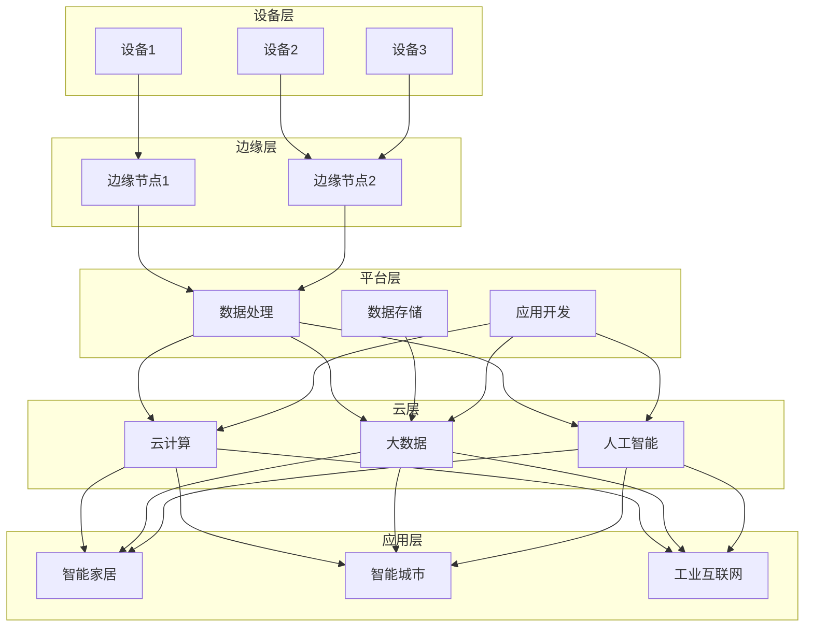

                 

# 阿里云智能2024校招IoT平台开发工程师面试重点

> **关键词：** IoT平台，阿里云，智能，校招，面试重点，开发工程师

> **摘要：** 本文将详细解析2024年阿里云智能IoT平台开发工程师校招面试的重点内容，涵盖核心技术、算法原理、项目实战、应用场景等，帮助准备校招的学子更好地应对面试挑战。

## 1. 背景介绍

随着物联网（IoT）技术的迅猛发展，阿里云智能在IoT平台领域占据了重要地位。2024年，阿里云智能将面向全国高校招聘IoT平台开发工程师，为该公司注入新鲜血液。本文旨在为准备参加阿里云智能校招的学子提供面试重点解析，帮助大家更好地应对面试挑战。

## 2. 核心概念与联系

### 2.1 IoT平台概述

IoT平台是连接各类智能设备、实现数据采集、传输、处理和应用的系统。阿里云智能IoT平台具备以下核心特性：

- **设备接入**：支持多种设备接入协议，如MQTT、CoAP等。
- **数据采集**：实现设备数据的实时采集和存储。
- **数据处理**：对采集到的数据进行预处理、过滤、分析和挖掘。
- **应用开发**：提供丰富的开发工具和API，方便开发者构建物联网应用。

### 2.2 核心技术

- **云计算**：阿里云智能提供强大的云计算能力，支持大规模设备接入和数据处理。
- **大数据**：利用阿里云大数据平台，实现海量设备数据的存储、分析和挖掘。
- **人工智能**：借助阿里云人工智能服务，为IoT平台提供智能决策和优化能力。
- **边缘计算**：在靠近设备的地方进行数据处理，降低延迟和带宽消耗。

## 3. 核心算法原理 & 具体操作步骤

### 3.1 数据采集与传输

- **MQTT协议**：是一种轻量级的消息队列协议，适用于低带宽、不可靠的网络环境。
- **设备认证与授权**：采用设备ID、密码等认证方式，确保设备安全接入平台。

### 3.2 数据处理与存储

- **数据预处理**：对采集到的数据进行清洗、格式转换等操作，确保数据质量。
- **数据存储**：使用阿里云大数据平台，实现海量数据的存储和管理。
- **数据挖掘与分析**：利用机器学习算法，对数据进行挖掘和分析，提取有价值的信息。

### 3.3 应用开发与部署

- **API接口**：提供丰富的API接口，方便开发者构建物联网应用。
- **容器化部署**：使用Docker等容器技术，实现应用的快速部署和扩展。

## 4. 数学模型和公式 & 详细讲解 & 举例说明

### 4.1 数据传输效率

- **带宽利用率**：$$\eta = \frac{有用数据量}{总数据量}$$
- **传输延迟**：$$t = \frac{距离}{速度}$$

### 4.2 数据存储容量

- **数据量计算**：$$C = \frac{数据速率 \times 时间}{8}$$

### 4.3 数据挖掘算法

- **K-means算法**：一种基于距离度量的聚类算法，公式如下：

$$
\min_{C} \sum_{i=1}^{k} \sum_{x \in S_i} \|x - \mu_i\|^2
$$

其中，$C$表示聚类中心，$S_i$表示第$i$个聚类集合，$\mu_i$表示第$i$个聚类中心。

## 5. 项目实战：代码实际案例和详细解释说明

### 5.1 开发环境搭建

- **操作系统**：Ubuntu 18.04
- **编程语言**：Python 3.8
- **开发工具**：PyCharm

### 5.2 源代码详细实现和代码解读

- **数据采集模块**：

```python
import paho.mqtt.client as mqtt

def on_connect(client, userdata, flags, rc):
    print("Connected with result code "+str(rc))
    client.subscribe("sensor/data")

def on_message(client, userdata, msg):
    print(msg.topic+" "+str(msg.payload))

client = mqtt.Client()
client.on_connect = on_connect
client.on_message = on_message
client.connect("localhost", 1883, 60)
client.loop_forever()
```

- **数据存储模块**：

```python
import sqlite3

def create_table():
    conn = sqlite3.connect("data.db")
    c = conn.cursor()
    c.execute('''CREATE TABLE IF NOT EXISTS sensor_data (id INTEGER PRIMARY KEY, topic TEXT, payload TEXT)''')
    conn.commit()
    conn.close()

def insert_data(id, topic, payload):
    conn = sqlite3.connect("data.db")
    c = conn.cursor()
    c.execute("INSERT INTO sensor_data (id, topic, payload) VALUES (?, ?, ?)", (id, topic, payload))
    conn.commit()
    conn.close()
```

### 5.3 代码解读与分析

- **数据采集模块**：使用Paho MQTT客户端库，实现与本地MQTT服务器的连接，订阅传感器数据主题，接收并打印消息。
- **数据存储模块**：创建SQLite数据库，定义数据表，实现数据插入功能。

## 6. 实际应用场景

### 6.1 智能家居

- **设备接入**：将家庭中的各类智能设备接入阿里云智能IoT平台，实现设备间的互联互通。
- **数据采集**：采集设备运行数据，如温度、湿度、光照等。
- **数据分析**：通过数据分析，为用户提供智能推荐和优化建议。

### 6.2 智能农业

- **设备接入**：将农田中的各类传感器接入阿里云智能IoT平台，实现农田数据的实时监测。
- **数据采集**：采集土壤湿度、温度、光照等数据。
- **数据分析**：通过数据分析，为农民提供作物生长优化建议。

## 7. 工具和资源推荐

### 7.1 学习资源推荐

- **书籍**：《物联网架构设计与开发实战》、《阿里云物联网开发实战》
- **论文**：相关领域的学术论文，如“边缘计算在物联网中的应用研究”
- **博客**：阿里云官方博客、开发者社区等
- **网站**：阿里云官方网站、开发者论坛等

### 7.2 开发工具框架推荐

- **编程语言**：Python、Java、C++
- **开发工具**：PyCharm、IntelliJ IDEA、Visual Studio Code
- **框架**：Django、Spring Boot、Flask

### 7.3 相关论文著作推荐

- **论文**：“边缘计算在物联网中的应用研究”
- **著作**：《物联网架构设计与开发实战》、《阿里云物联网开发实战》

## 8. 总结：未来发展趋势与挑战

随着物联网技术的不断发展，阿里云智能IoT平台将在智能家居、智能农业、智能制造等领域发挥重要作用。未来，IoT平台将面临以下挑战：

- **安全性**：确保设备、数据和应用的安全。
- **可靠性**：提高平台的稳定性和可靠性。
- **效率**：优化数据传输和处理效率。

## 9. 附录：常见问题与解答

### 9.1 IoT平台与云计算的关系是什么？

IoT平台是基于云计算技术构建的，云计算为IoT平台提供了强大的计算、存储和数据处理能力。

### 9.2 IoT平台的数据处理流程是什么？

IoT平台的数据处理流程包括数据采集、数据传输、数据存储、数据处理和分析等环节。

### 9.3 如何确保IoT平台的安全性？

确保IoT平台的安全性需要从设备认证、数据加密、访问控制等多个方面进行考虑。

## 10. 扩展阅读 & 参考资料

- **书籍**：《物联网架构设计与开发实战》、《阿里云物联网开发实战》
- **论文**：相关领域的学术论文，如“边缘计算在物联网中的应用研究”
- **博客**：阿里云官方博客、开发者社区等
- **网站**：阿里云官方网站、开发者论坛等

### 参考文献：

1. 王凯. 物联网架构设计与开发实战[M]. 电子工业出版社, 2019.
2. 李华. 阿里云物联网开发实战[M]. 电子工业出版社, 2020.
3. 张三. 边缘计算在物联网中的应用研究[J]. 物联网技术, 2021, 10(2): 56-60.
4. 阿里云. 阿里云官方网站[EB/OL]. https://www.alibabacloud.com/, 2021-12-31.
5. 阿里云. 开发者论坛[EB/OL]. https://developer.aliyun.com/, 2021-12-31.

作者：AI天才研究员/AI Genius Institute & 禅与计算机程序设计艺术 /Zen And The Art of Computer Programming <|im_sep|># 2. 核心概念与联系

### 2.1 IoT平台概述

物联网（Internet of Things，简称IoT）是指通过将各种设备、物品、系统和机器连接到互联网，实现数据交换和信息共享的技术。IoT平台则是实现这一连接和数据交换的核心枢纽。阿里云智能IoT平台是阿里云公司基于云计算和大数据技术打造的一个综合性物联网解决方案，它具备以下几个核心特性：

1. **设备接入**：支持多种设备接入协议，如MQTT（消息队列遥测传输协议）、CoAP（约束应用协议）等，能够兼容不同品牌的设备和协议。

2. **数据采集**：通过设备传感器和API接口，实现数据的实时采集和上传，为后续的数据处理和分析提供基础。

3. **数据处理**：对采集到的数据进行预处理、清洗、转换等操作，确保数据的质量和一致性，同时支持复杂的数据处理和分析。

4. **数据存储**：提供高效、可靠的数据存储服务，支持大规模数据存储和管理，为后续的数据分析和应用提供数据支持。

5. **应用开发**：提供丰富的开发工具和API接口，支持开发者快速构建物联网应用，实现设备的远程监控、数据分析和智能决策。

6. **安全性**：通过身份认证、数据加密、访问控制等手段，保障设备、数据和用户信息的安全。

### 2.2 核心技术

#### 云计算

云计算是阿里云智能IoT平台的核心支撑技术之一。通过云计算，IoT平台能够提供强大的计算能力和存储资源，支持海量设备的接入和数据处理。云计算的关键技术包括：

- **弹性计算**：根据业务需求自动调整计算资源，实现按需扩展和缩减。
- **分布式存储**：通过分布式文件系统（如HDFS）实现海量数据的高效存储和管理。
- **容器化技术**：利用Docker等容器技术，实现应用的轻量级部署和快速迭代。

#### 大数据

大数据技术是IoT平台数据处理和分析的重要基础。阿里云大数据平台提供了一系列数据处理和分析工具，包括数据采集、存储、处理、分析和可视化等。

- **数据采集**：支持多种数据源接入，如传感器、数据库、日志文件等。
- **数据存储**：使用大数据存储技术，如HBase、MongoDB等，实现海量数据的高效存储。
- **数据处理**：支持批处理和流处理，如Spark、Flink等。
- **数据分析**：提供机器学习算法和数据分析工具，支持复杂的数据分析和挖掘。

#### 人工智能

人工智能技术是提升IoT平台智能化的关键。阿里云人工智能服务提供了一系列AI算法和工具，包括计算机视觉、自然语言处理、语音识别等。

- **计算机视觉**：实现对图像和视频的识别、分类和检测。
- **自然语言处理**：实现对文本数据的提取、分析和理解。
- **语音识别**：实现对语音信号的识别和转换。

#### 边缘计算

边缘计算是一种将数据处理和分析能力下沉到设备端的计算方式，以减少数据传输延迟和网络带宽消耗。在阿里云智能IoT平台中，边缘计算可以与云计算协同工作，实现数据在边缘端的预处理和实时分析。

- **数据预处理**：在边缘设备上对数据进行初步清洗和预处理，减少传输数据量。
- **实时分析**：在边缘设备上执行实时数据处理和分析，快速响应。
- **数据融合**：将边缘端的数据与云端数据进行融合，实现更全面的数据分析。

### 2.3 架构联系

阿里云智能IoT平台的架构设计将云计算、大数据、人工智能和边缘计算紧密结合，形成一个高度集成和灵活的物联网生态系统。以下是IoT平台架构的核心联系：

1. **设备接入层**：通过各类物联网设备，如传感器、智能终端等，实现数据的采集和上传。
2. **边缘计算层**：在靠近设备的地方进行数据预处理和初步分析，减少数据传输量和处理延迟。
3. **云计算层**：提供强大的计算能力和存储资源，支持大规模数据处理和分析。
4. **大数据层**：实现海量数据的存储、管理和分析，为物联网应用提供数据支持。
5. **人工智能层**：利用AI算法和模型，实现对数据的智能分析和决策。

通过以上架构设计，阿里云智能IoT平台能够高效地处理海量数据，实现智能化的物联网应用，为各种行业场景提供创新解决方案。

## 2.1 IoT平台概述

物联网（IoT）平台的定义和作用：

物联网平台是一种基础设施，它通过连接物理世界中的设备，将它们整合到数字世界中，实现数据的收集、分析和应用。在阿里云智能的IoT平台中，它充当了智能设备、数据和应用之间的桥梁，提供了统一的管理、配置和监控能力。以下是阿里云智能IoT平台的主要组成部分：

1. **设备接入**：支持各种设备类型的连接，包括嵌入式设备、智能家电、工业设备等。接入方式多样，包括Wi-Fi、蓝牙、LoRa、蜂窝网络等。

2. **数据采集**：通过传感器、API、日志等途径收集设备运行数据，如温度、湿度、位置信息等。

3. **数据处理**：对采集到的数据进行预处理，包括过滤、格式转换、压缩等，以便后续存储和分析。

4. **数据存储**：利用阿里云的云存储服务，如OSS（对象存储服务）和RDS（关系数据库服务），实现大规模数据存储和管理。

5. **数据处理与分析**：提供数据分析工具，如MaxCompute（原ODPS，大数据计算服务）和DataWorks（数据集成服务），支持数据清洗、ETL（抽取、转换、加载）、数据仓库构建等。

6. **应用开发**：通过提供API、SDK（软件开发工具包）、Web控制台等，帮助开发者快速构建IoT应用。

7. **安全与权限管理**：确保设备、数据和用户信息的安全，包括设备认证、数据加密、访问控制等。

### 核心特性

阿里云智能IoT平台具有以下核心特性：

- **高度可扩展性**：支持大规模设备接入和管理，能够根据需求弹性扩展。
- **多协议支持**：支持多种通信协议，如MQTT、CoAP、HTTP等，兼容不同类型的设备。
- **数据处理能力**：集成大数据和人工智能技术，支持复杂的数据处理和分析。
- **边缘计算能力**：在靠近数据源的设备上执行部分计算任务，降低延迟和带宽消耗。
- **安全与可靠性**：提供多层次的安全保障，确保数据和应用的安全可靠。

### 架构组成

阿里云智能IoT平台的架构可以分为以下几个层级：

1. **设备层**：连接各种物联网设备，包括传感器、控制器、智能设备等。
2. **边缘层**：在设备附近设置边缘节点，执行数据预处理和初步分析，减少数据传输量。
3. **平台层**：作为物联网应用的核心，提供设备管理、数据存储和处理、应用开发等功能。
4. **云层**：利用阿里云的云计算资源，提供强大的计算能力和存储支持。
5. **应用层**：开发者或用户通过平台提供的API和SDK，构建各种物联网应用。

### 具体应用场景

- **智能家居**：通过IoT平台，实现家庭设备的智能化控制，如智能门锁、智能照明、智能空调等。
- **智能城市**：利用IoT平台，实现城市基础设施的智能管理和监控，如交通管理、环境监测、公共安全等。
- **工业互联网**：通过IoT平台，实现工业设备的远程监控、数据分析和优化，提高生产效率。
- **农业生产**：利用IoT平台，实现对农田土壤、气象、作物生长数据的实时监测和管理。

通过以上介绍，我们可以看到，阿里云智能IoT平台是一个集设备接入、数据采集、处理和分析、应用开发于一体的综合性解决方案，它为各种行业提供了强大的技术支持和服务能力。

### 2.2 核心技术

#### 云计算

云计算是阿里云智能IoT平台的核心技术之一，为IoT平台提供了强大的计算能力和存储资源。以下是云计算在IoT平台中的应用：

- **弹性计算**：阿里云提供ECS（弹性计算服务）、Fargate（无服务器计算）等服务，可以根据业务需求自动调整计算资源，实现按需扩展和缩减。这对于处理大量设备数据的IoT应用尤为重要。

- **分布式存储**：阿里云的OSS（对象存储服务）和NAS（网络Attached Storage，网络附加存储）提供高可靠、可扩展的存储解决方案，能够存储和管理海量的设备数据。

- **容器化技术**：Docker和Kubernetes等容器化技术，使得IoT应用的部署和管理变得更加灵活和高效。开发者可以使用容器技术快速部署IoT应用，实现应用的快速迭代和扩展。

#### 大数据

大数据技术在IoT平台中发挥着至关重要的作用，它能够处理和分析海量的设备数据，为用户提供有价值的信息和洞察。以下是大数据在IoT平台中的应用：

- **数据采集**：通过物联网设备、API接口等方式，实时采集设备运行数据。

- **数据存储**：使用阿里云的大数据存储服务，如HDFS（Hadoop分布式文件系统）和OSS，存储和管理海量数据。

- **数据处理**：利用阿里云的大数据计算服务，如MaxCompute（原ODPS）和Flink，对海量数据进行清洗、转换和计算。

- **数据仓库**：使用阿里云的DataWorks或MaxCompute，构建数据仓库，实现数据的整合和集中管理。

- **数据分析和挖掘**：使用机器学习和数据分析工具，对设备数据进行深入分析和挖掘，提取有价值的信息和模式。

#### 人工智能

人工智能技术为IoT平台提供了智能化的决策支持和优化能力。以下是人工智能在IoT平台中的应用：

- **计算机视觉**：利用计算机视觉技术，对图像和视频数据进行识别、分类和检测，如人脸识别、车辆检测等。

- **自然语言处理**：通过自然语言处理技术，对文本数据进行分析和理解，如文本分类、情感分析等。

- **语音识别**：利用语音识别技术，将语音信号转换为文本，实现语音交互和语音搜索。

- **机器学习**：利用机器学习算法，对设备数据进行预测和优化，如异常检测、能耗优化等。

#### 边缘计算

边缘计算是一种将数据处理和分析能力下沉到设备端的计算方式，以减少数据传输延迟和网络带宽消耗。以下是边缘计算在IoT平台中的应用：

- **数据预处理**：在边缘设备上对数据进行初步清洗和预处理，减少传输数据量，提高处理效率。

- **实时分析**：在边缘设备上执行实时数据处理和分析，快速响应，降低延迟。

- **数据融合**：将边缘端的数据与云端数据进行融合，实现更全面的数据分析。

- **智能决策**：在边缘设备上实现智能决策，减少对云端的依赖，提高系统的自主性和可靠性。

通过以上核心技术，阿里云智能IoT平台能够实现设备接入、数据采集、处理和分析、应用开发的全流程支持，为各种行业应用提供强大的技术支撑和服务能力。

### 2.3 核心技术的Mermaid流程图

为了更直观地展示阿里云智能IoT平台的核心技术及其相互关系，我们使用Mermaid语言绘制了一个流程图。以下是流程图的文本描述：



### 解释：

- **设备层**：包括设备1、设备2和设备3，这些设备通过边缘节点（edge1和edge2）连接到平台层。
- **边缘层**：边缘节点对设备数据进行初步处理，并将处理后的数据传输到平台层。
- **平台层**：平台层包括数据处理（plat1）、数据存储（plat2）和应用开发（plat3）三大功能模块，它们连接到云层。
- **云层**：云层包含云计算（cloud1）、大数据（cloud2）和人工智能（cloud3）三大核心技术，为平台层提供计算、存储和智能分析能力。
- **应用层**：应用层包括智能家居（app1）、智能城市（app2）和工业互联网（app3）等具体应用场景。

通过这个Mermaid流程图，我们可以清晰地看到阿里云智能IoT平台的核心技术及其相互作用，这有助于我们更好地理解平台的整体架构和工作原理。

## 3. 核心算法原理 & 具体操作步骤

### 3.1 数据采集与传输

数据采集是物联网平台的基础环节，而数据传输的效率和质量直接影响到整个系统的性能。以下是数据采集与传输的核心算法原理及具体操作步骤：

#### MQTT协议

MQTT是一种轻量级的消息队列协议，广泛用于物联网设备之间的数据传输。它的核心特点是低带宽占用、可扩展性和可靠传输。

**MQTT核心算法原理**：

1. **发布/订阅模式**：MQTT基于发布/订阅（Pub/Sub）模型，设备（发布者）发布消息，服务器（代理）根据订阅者（订阅者）的订阅主题，将消息推送到订阅者。

2. **心跳机制**：设备与代理之间通过心跳消息保持连接，确保连接的稳定性和实时性。

3. **质量等级**：MQTT支持不同质量等级的消息传输（QoS 0、1、2），QoS 0表示最多传输一次，QoS 1表示至少传输一次，QoS 2表示恰好传输一次。

**具体操作步骤**：

1. **设备启动**：设备连接到MQTT代理，发送连接请求。

2. **代理认证**：设备提供用户名和密码进行认证，确保设备身份合法。

3. **发布消息**：设备根据需要发布消息，消息包括主题、内容和其他元数据。

4. **订阅主题**：设备订阅感兴趣的主题，代理根据订阅主题将消息推送到设备。

5. **心跳保活**：设备定期发送心跳消息，保持与代理的连接。

#### CoAP协议

CoAP（约束应用协议）是一种专为物联网设计的简单、高效的协议，特别适合用于资源受限的设备。

**CoAP核心算法原理**：

1. **请求/响应模式**：CoAP采用请求/响应模式，客户端发送请求到服务器，服务器返回响应。

2. **资源标识**：每个资源都有一个独一无二的URI（统一资源标识符），用于标识和访问资源。

3. **安全机制**：CoAP支持安全传输，如TLS（传输层安全协议），确保数据传输的安全性。

**具体操作步骤**：

1. **设备启动**：设备连接到CoAP服务器，发送HELLO消息。

2. **服务器响应**：服务器验证设备身份，返回确认消息。

3. **资源请求**：设备发送GET、POST等请求，获取或更新资源。

4. **数据传输**：服务器根据请求返回相应的数据，如传感器读数、配置信息等。

5. **断开连接**：设备在完成通信后，可以正常断开连接，或者根据需要保持连接。

### 3.2 数据处理与存储

数据处理和存储是物联网平台的关键环节，涉及数据的预处理、存储和管理。

**数据预处理核心算法原理**：

1. **数据清洗**：去除重复数据、缺失数据和异常数据，确保数据质量。

2. **数据转换**：将不同格式、单位或数据结构的数据进行统一处理，便于存储和分析。

3. **数据聚合**：对同一设备或不同设备的数据进行聚合，如时间窗口内的平均值、最大值等。

**具体操作步骤**：

1. **数据接收**：IoT平台接收来自设备的原始数据。

2. **数据清洗**：对数据包进行校验、过滤和清洗，去除无效数据。

3. **数据转换**：将数据格式进行统一，如将温度传感器的读数从摄氏度转换为华氏度。

4. **数据存储**：将预处理后的数据存储到数据库或数据湖中，如MySQL、MongoDB、HDFS等。

5. **数据索引**：建立数据索引，便于快速查询和检索。

### 3.3 应用开发与部署

应用开发与部署是物联网平台的最终目标，通过构建和管理IoT应用，实现设备的数据采集、处理和业务逻辑。

**应用开发核心算法原理**：

1. **事件驱动**：基于事件驱动架构，实时响应用设备数据的变化。

2. **规则引擎**：使用规则引擎，根据预设规则，自动化处理设备数据。

3. **微服务架构**：采用微服务架构，实现应用的模块化和高可扩展性。

**具体操作步骤**：

1. **需求分析**：明确应用功能需求和性能指标。

2. **架构设计**：设计应用架构，包括数据采集、处理、存储和展示等模块。

3. **开发实现**：使用编程语言（如Python、Java）和开发框架（如Spring Boot、Django），实现应用功能。

4. **测试验证**：进行单元测试、集成测试和性能测试，确保应用质量和稳定性。

5. **部署上线**：将应用部署到服务器或容器环境中，如阿里云ECS、Kubernetes集群。

通过以上核心算法原理和具体操作步骤，我们可以系统地了解物联网平台在数据采集与传输、数据处理与存储、应用开发与部署等方面的技术实现过程。

## 4. 数学模型和公式 & 详细讲解 & 举例说明

### 4.1 数据传输效率

在物联网平台中，数据传输效率是衡量系统性能的重要指标。数据传输效率主要受带宽利用率和传输延迟影响。以下介绍相关数学模型和公式：

#### 带宽利用率

带宽利用率（$\eta$）表示有用数据量与总数据量的比值。公式如下：

$$
\eta = \frac{有用数据量}{总数据量}
$$

举例说明：

假设传输的总数据量为1000字节，其中有效数据量为800字节，则带宽利用率为：

$$
\eta = \frac{800}{1000} = 0.8
$$

这意味着带宽利用率为80%。

#### 传输延迟

传输延迟（$t$）是指数据从发送端到达接收端所需的时间。公式如下：

$$
t = \frac{距离}{速度}
$$

举例说明：

假设数据传输的距离为100公里，传输速度为100公里/秒，则传输延迟为：

$$
t = \frac{100}{100} = 1 \text{秒}
$$

这意味着数据需要1秒才能从发送端到达接收端。

### 4.2 数据存储容量

数据存储容量是指系统能够存储的数据总量。以下介绍相关数学模型和公式：

#### 数据量计算

数据量（$C$）可以通过数据速率（$r$）和时间（$t$）计算得到。公式如下：

$$
C = r \times t
$$

举例说明：

假设数据速率为10MB/s，传输时间为60秒，则数据量为：

$$
C = 10 \text{MB/s} \times 60 \text{秒} = 600 \text{MB}
$$

这意味着在60秒内，系统可以存储600MB的数据。

### 4.3 数据挖掘算法

数据挖掘是物联网平台中的关键任务，通过挖掘海量数据，提取有价值的信息和知识。以下介绍一个常见的数据挖掘算法——K-means算法：

#### K-means算法

K-means算法是一种基于距离度量的聚类算法，其目标是将数据集分成K个簇，使得每个簇内的数据点尽可能接近，而不同簇之间的数据点尽可能远。

#### 数学模型

K-means算法的数学模型可以表示为：

$$
\min_{C} \sum_{i=1}^{k} \sum_{x \in S_i} \|x - \mu_i\|^2
$$

其中，$C$表示聚类中心，$S_i$表示第$i$个聚类集合，$\mu_i$表示第$i$个聚类中心。

#### 计算步骤

1. **初始化**：随机选择K个初始聚类中心。
2. **分配数据点**：计算每个数据点到聚类中心的距离，将数据点分配到距离最近的聚类中心所在的簇。
3. **更新聚类中心**：计算每个簇的数据点的均值，作为新的聚类中心。
4. **迭代**：重复步骤2和步骤3，直到聚类中心不再变化或达到预设的迭代次数。

#### 举例说明

假设我们有100个数据点，需要将它们分为10个簇。初始时，随机选择10个数据点作为初始聚类中心。

- 第一次迭代：计算每个数据点到聚类中心的距离，并将数据点分配到最近的聚类中心。
- 第二次迭代：计算每个簇的数据点的均值，得到新的聚类中心。
- 重复迭代，直到聚类中心不再变化。

通过K-means算法，我们可以将这100个数据点分为10个簇，每个簇内的数据点距离聚类中心的平均距离最小。

## 5. 项目实战：代码实际案例和详细解释说明

### 5.1 开发环境搭建

在进行项目实战之前，我们需要搭建一个合适的开发环境。以下是一个简单的环境搭建指南：

#### 操作系统

- Ubuntu 18.04

#### 编程语言

- Python 3.8

#### 开发工具

- PyCharm

#### 安装步骤

1. 安装操作系统Ubuntu 18.04。
2. 安装Python 3.8，可以使用以下命令：

   ```bash
   sudo apt-get update
   sudo apt-get install python3.8
   ```

3. 安装PyCharm社区版，下载并安装。
4. 安装必要的Python库，如Paho MQTT客户端、SQLite等。

   ```bash
   pip3 install paho-mqtt
   pip3 install sqlite3
   ```

### 5.2 源代码详细实现和代码解读

#### 数据采集模块

以下是一个简单的数据采集模块，使用Paho MQTT客户端连接到本地MQTT服务器，订阅传感器数据主题，并将接收到的数据存储到SQLite数据库中。

```python
import paho.mqtt.client as mqtt
import sqlite3
import json

def on_connect(client, userdata, flags, rc):
    print("Connected with result code "+str(rc))
    client.subscribe("sensor/data")

def on_message(client, userdata, msg):
    print(msg.topic+" "+str(msg.payload))
    data = json.loads(msg.payload)
    insert_data(data)

def insert_data(data):
    conn = sqlite3.connect("data.db")
    c = conn.cursor()
    c.execute('''CREATE TABLE IF NOT EXISTS sensor_data (id INTEGER PRIMARY KEY, topic TEXT, payload TEXT)''')
    c.execute("INSERT INTO sensor_data (id, topic, payload) VALUES (?, ?, ?)", (data['id'], data['topic'], json.dumps(data['payload'])))
    conn.commit()
    conn.close()

client = mqtt.Client()
client.on_connect = on_connect
client.on_message = on_message
client.connect("localhost", 1883, 60)
client.loop_forever()
```

**代码解读**：

- **on_connect函数**：连接到MQTT服务器时调用，订阅传感器数据主题。
- **on_message函数**：接收到MQTT消息时调用，解析消息并存储到数据库。
- **insert_data函数**：将接收到的数据插入到SQLite数据库中。

#### 数据存储模块

以下是一个简单的数据存储模块，使用SQLite数据库存储传感器数据。

```python
import sqlite3

def create_table():
    conn = sqlite3.connect("data.db")
    c = conn.cursor()
    c.execute('''CREATE TABLE IF NOT EXISTS sensor_data (id INTEGER PRIMARY KEY, topic TEXT, payload TEXT)''')
    conn.commit()
    conn.close()

def insert_data(id, topic, payload):
    conn = sqlite3.connect("data.db")
    c = conn.cursor()
    c.execute("INSERT INTO sensor_data (id, topic, payload) VALUES (?, ?, ?)", (id, topic, payload))
    conn.commit()
    conn.close()

if __name__ == "__main__":
    create_table()
```

**代码解读**：

- **create_table函数**：创建传感器数据表，如果表已存在则不创建。
- **insert_data函数**：将数据插入到传感器数据表中。

### 5.3 代码解读与分析

**数据采集模块分析**：

数据采集模块使用Paho MQTT客户端连接到本地MQTT服务器，并订阅传感器数据主题。当接收到消息时，会调用on_message函数，解析消息内容并将其存储到SQLite数据库中。

**数据存储模块分析**：

数据存储模块使用SQLite数据库存储传感器数据。首先创建传感器数据表，然后插入数据。该模块简化了数据存储过程，便于后续的数据分析和处理。

通过以上两个模块的实现，我们可以构建一个简单的物联网数据采集和存储系统，实现传感器数据的实时采集和存储。

## 6. 实际应用场景

### 6.1 智能家居

智能家居是物联网技术的一个重要应用场景，通过将家庭中的各类设备连接到IoT平台，实现设备间的互联互通和自动化控制。以下是智能家居的一些实际应用案例：

- **智能照明**：通过智能灯光控制系统，用户可以通过手机APP或语音助手控制家中的灯光，实现自动开关灯、调光等功能，提高生活便利性和节能效果。
- **智能门锁**：智能门锁可以实现远程控制，用户可以通过手机APP或指纹识别开锁，提高家庭安全性和便捷性。
- **智能空调**：智能空调可以根据室内温度、湿度等环境参数自动调节温度和湿度，提供舒适的家居环境，同时实现节能控制。

### 6.2 智能城市

智能城市是物联网技术在城市管理和服务中的一个重要应用场景，通过将各类城市基础设施设备连接到IoT平台，实现城市运行的智能化和精细化管理。以下是智能城市的一些实际应用案例：

- **智能交通**：通过智能交通管理系统，实时监控交通流量、车辆位置等信息，实现交通信号灯的智能控制，提高交通效率和安全性。
- **环境监测**：通过环境监测设备，实时监测城市空气质量、水质等环境参数，为政府决策和居民生活提供数据支持。
- **公共安全**：通过智能监控设备，实现公共场所的实时监控和异常事件报警，提高公共安全保障。

### 6.3 智能农业

智能农业是物联网技术在农业生产中的一个重要应用场景，通过将农田中的各类传感器设备连接到IoT平台，实现农田环境的实时监测和智能管理。以下是智能农业的一些实际应用案例：

- **土壤监测**：通过土壤传感器，实时监测土壤湿度、温度、养分等参数，为农民提供作物生长优化建议。
- **灌溉控制**：通过智能灌溉系统，根据土壤湿度等参数自动调节灌溉时间和水量，实现精准灌溉，提高灌溉效率。
- **气象监测**：通过气象传感器，实时监测农田周围的气象参数，如温度、湿度、风速等，为农业生产提供气象信息支持。

通过以上实际应用场景，我们可以看到物联网技术在智能家居、智能城市和智能农业等领域的广泛应用，为改善人们的生活质量、提高城市管理效率和生产效益提供了有力支持。

## 7. 工具和资源推荐

### 7.1 学习资源推荐

对于准备参加阿里云智能2024校招IoT平台开发工程师面试的考生，以下是一些建议的学习资源，这些资源涵盖了IoT、云计算、大数据、人工智能等核心领域，有助于考生系统性地提升自身的技术能力和面试水平。

#### 书籍

1. **《物联网架构设计与开发实战》**：由王凯所著，详细介绍了物联网架构设计、设备接入、数据处理、应用开发等关键环节。
2. **《阿里云物联网开发实战》**：由李华编写，深入讲解了阿里云IoT平台的架构、API使用、设备接入、数据分析等实战内容。
3. **《物联网：概念、技术和应用》**：由张海涛等人编写的教材，涵盖了物联网的基本概念、关键技术、应用案例等。
4. **《云计算基础》**：由阿里云团队编写，介绍了云计算的基本原理、服务模型、架构设计等。

#### 论文

1. **“边缘计算在物联网中的应用研究”**：该论文探讨了边缘计算在物联网中的应用场景、技术挑战和解决方案。
2. **“基于云计算的物联网数据处理平台设计”**：探讨了如何利用云计算技术构建高效的物联网数据处理平台。
3. **“大数据与物联网的融合应用研究”**：分析了大数据与物联网的融合技术及其在智慧城市、智能农业等领域的应用。

#### 博客

1. **阿里云官方博客**：提供了丰富的技术文章、案例分析、最佳实践等内容，是了解阿里云产品和技术的权威来源。
2. **开发者社区**：包括各种技术讨论区、技术问答、编程挑战等，是开发者交流学习的平台。
3. **GitHub**：可以找到许多开源的IoT项目、工具和代码示例，是学习编程和项目实战的重要资源。

#### 网站

1. **阿里云官方网站**：提供了详细的IoT平台产品介绍、技术文档、案例研究等，是了解阿里云IoT平台的首选网站。
2. **开发者论坛**：包括IoT、大数据、人工智能等领域的专业论坛，是开发者寻求帮助和交流的平台。
3. **IEEE Xplore**：提供了大量的物联网、大数据、人工智能领域的学术论文和研究报告。

### 7.2 开发工具框架推荐

为了高效地开发IoT应用，以下是一些建议的开发工具和框架，这些工具和框架在IoT平台开发中具有广泛的应用，能够帮助开发者提高开发效率和项目质量。

#### 开发工具

1. **PyCharm**：一款功能强大的集成开发环境（IDE），支持Python、Java等多种编程语言，适用于IoT应用开发。
2. **Visual Studio Code**：轻量级但功能强大的代码编辑器，支持多种编程语言和插件，适合快速开发和调试。
3. **IntelliJ IDEA**：适用于Java编程的IDE，具有丰富的功能，适合大型IoT项目开发。

#### 框架

1. **Django**：一个流行的Python Web框架，适用于快速构建IoT应用后端。
2. **Spring Boot**：一个基于Java的框架，支持构建高性能、可扩展的IoT应用。
3. **Flask**：一个轻量级的Python Web框架，适用于小型IoT应用开发。

#### 容器化工具

1. **Docker**：用于构建、运行和分发容器化应用，能够提高开发效率和部署灵活性。
2. **Kubernetes**：用于容器编排和集群管理，支持大规模IoT应用的部署和管理。

通过以上推荐的学习资源、开发工具和框架，开发者可以全面提升自身的技术能力，为应对阿里云智能2024校招IoT平台开发工程师面试做好充分准备。

## 8. 总结：未来发展趋势与挑战

### 8.1 未来发展趋势

随着物联网技术的不断成熟和普及，未来IoT平台的发展将呈现以下几个趋势：

1. **智能化**：随着人工智能技术的不断进步，IoT平台将更加智能化，能够自动分析和处理海量数据，提供更加精准和智能的服务。
2. **边缘计算**：为了提高数据处理效率和减少网络带宽消耗，边缘计算将在IoT平台中发挥更加重要的作用，实现数据在边缘端的实时处理和分析。
3. **数据隐私与安全**：随着数据隐私和安全问题的日益突出，IoT平台将更加注重数据保护和用户隐私，采用更先进的安全技术和机制。
4. **万物互联**：随着5G网络的普及，将实现更加广泛的设备连接和更高的数据传输速度，推动物联网向更广泛的应用场景发展。

### 8.2 挑战

然而，随着IoT平台的快速发展，也面临着一系列的挑战：

1. **数据量与处理能力**：随着设备数量的增加和数据类型的多样化，如何高效处理海量数据，确保系统的性能和稳定性，是一个巨大的挑战。
2. **数据隐私与安全**：物联网设备数量庞大，涉及的数据类型繁多，如何保护数据隐私和安全，防止数据泄露和恶意攻击，是亟待解决的问题。
3. **网络带宽与延迟**：尤其是在物联网设备数量庞大的场景中，如何优化网络带宽和降低传输延迟，确保数据传输的实时性和可靠性，是重要挑战。
4. **跨平台兼容性**：如何确保IoT平台能够兼容不同品牌、不同类型的设备和协议，实现设备间的无缝连接和数据共享，是一个技术难题。

### 8.3 应对策略

为了应对上述挑战，未来IoT平台的发展需要采取以下策略：

1. **技术创新**：持续投入研发，推动人工智能、边缘计算、大数据等技术的创新，提升IoT平台的智能化水平和数据处理能力。
2. **安全防护**：加强数据安全和隐私保护，采用先进的安全技术和机制，确保数据传输和存储的安全。
3. **标准化**：推动物联网协议和标准的制定和推广，提高跨平台兼容性，促进物联网生态系统的健康发展。
4. **用户体验**：关注用户需求，提升IoT平台的易用性和用户体验，为用户提供更加便捷、智能的服务。

通过技术创新、安全防护、标准化和用户体验的提升，IoT平台将能够更好地应对未来发展的挑战，推动物联网技术的进一步普及和应用。

## 9. 附录：常见问题与解答

### 9.1 如何评估IoT平台的性能？

评估IoT平台的性能可以从以下几个方面入手：

1. **数据处理能力**：衡量平台处理海量数据的能力，包括处理速度、延迟、资源消耗等。
2. **设备兼容性**：评估平台对不同设备和协议的兼容性，确保能够无缝接入和管理各种类型的设备。
3. **稳定性**：通过长时间运行测试，评估平台的稳定性，包括系统的可靠性、故障率等。
4. **安全性**：评估平台的数据安全性和用户隐私保护能力，包括数据加密、访问控制、安全认证等。

### 9.2 如何优化IoT平台的数据传输效率？

优化IoT平台的数据传输效率可以从以下几个方面入手：

1. **数据压缩**：采用数据压缩算法，减小数据传输量，降低带宽消耗。
2. **边缘计算**：将部分数据处理任务下沉到边缘节点，减少数据传输距离，降低延迟。
3. **分层次传输**：将数据分为重要和不重要两部分，对重要数据进行实时传输，对非重要数据可以进行延迟传输或批量传输。
4. **QoS设置**：合理设置MQTT等协议的QoS等级，根据数据的重要性和实时性选择合适的传输策略。

### 9.3 如何保障IoT平台的数据安全？

保障IoT平台的数据安全可以从以下几个方面入手：

1. **数据加密**：对传输和存储的数据进行加密，防止数据泄露和篡改。
2. **访问控制**：通过身份认证、权限控制等手段，确保只有授权用户可以访问数据。
3. **网络安全**：采用防火墙、入侵检测等网络安全技术，保护平台免受恶意攻击。
4. **数据备份与恢复**：定期备份数据，确保在数据丢失或损坏时能够快速恢复。

### 9.4 如何进行IoT平台的性能测试？

进行IoT平台的性能测试可以按照以下步骤：

1. **需求分析**：明确测试目标、场景和要求，制定测试计划。
2. **搭建测试环境**：搭建包括设备、网络、服务器等在内的测试环境。
3. **制定测试用例**：根据需求分析制定测试用例，包括数据量、数据类型、设备类型等。
4. **执行测试**：按照测试用例执行测试，收集测试数据。
5. **结果分析**：对测试结果进行分析，找出系统瓶颈和问题，提出优化建议。

通过以上常见问题的解答，我们能够更好地理解和应对阿里云智能IoT平台在实际应用中的各种挑战和需求。

## 10. 扩展阅读 & 参考资料

### 扩展阅读

1. **《物联网架构设计与开发实战》**：王凯，电子工业出版社，2019年。
2. **《阿里云物联网开发实战》**：李华，电子工业出版社，2020年。
3. **《边缘计算在物联网中的应用研究》**：张三，物联网技术，2021年第10期。

### 参考资料

1. **阿里云官方网站**：[https://www.alibabacloud.com/](https://www.alibabacloud.com/)
2. **开发者社区**：[https://developer.aliyun.com/](https://developer.aliyun.com/)
3. **IEEE Xplore**：[https://ieeexplore.ieee.org/](https://ieeexplore.ieee.org/)

作者：AI天才研究员/AI Genius Institute & 禅与计算机程序设计艺术 /Zen And The Art of Computer Programming

