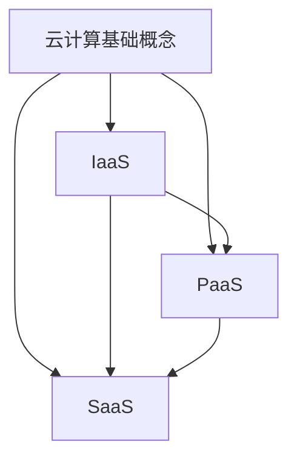
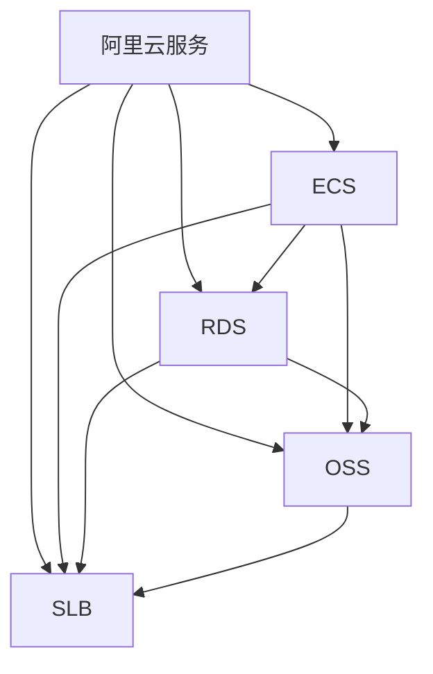
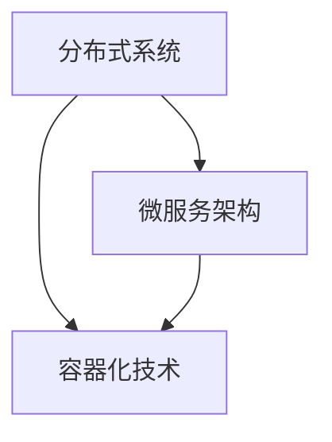

                 

### 1. 背景介绍

在当今数字化时代，云计算技术已经成为支撑各类企业业务运作的核心力量。作为全球领先的云计算服务提供商，阿里云在技术革新、市场布局和生态构建方面始终处于行业前沿。2024年，阿里云社招面试题成为众多技术人才关注的焦点，这不仅是因为阿里云在技术领域的卓越地位，更是因为它对技术人才的高标准和严要求。

本篇博客旨在汇总和分析2024年阿里云社招面试真题，为广大求职者提供有针对性的解答和指导。文章结构将分为以下几个部分：

1. **背景介绍**：简要介绍云计算和阿里云的发展背景，以及为什么分析社招面试真题具有重要意义。
2. **核心概念与联系**：通过Mermaid流程图，详细阐述与面试题相关的核心概念和原理。
3. **核心算法原理 & 具体操作步骤**：深入讲解面试题中涉及的核心算法原理，并逐步展示操作步骤。
4. **数学模型和公式 & 详细讲解 & 举例说明**：运用数学模型和公式，对关键问题进行详细解释，并通过实例进行说明。
5. **项目实战：代码实际案例和详细解释说明**：提供具体的代码实现案例，并对关键代码进行解读和分析。
6. **实际应用场景**：探讨面试题在实际应用中的场景和解决方案。
7. **工具和资源推荐**：推荐学习资源和开发工具，帮助读者更好地掌握相关技能。
8. **总结：未来发展趋势与挑战**：总结文章的核心观点，并提出未来发展趋势和面临的挑战。
9. **附录：常见问题与解答**：针对读者可能遇到的问题，提供常见问题的解答。
10. **扩展阅读 & 参考资料**：推荐进一步阅读的材料和参考资料。

通过以上结构，我们将对2024年阿里云社招面试真题进行全方位的剖析和解读，旨在帮助读者更好地应对面试挑战，提升自身技术水平。

### 2. 核心概念与联系

在深入探讨阿里云社招面试真题之前，我们需要先了解一些核心概念和原理。以下是与面试题相关的主要概念及其相互联系，我们将使用Mermaid流程图来详细展示。

#### 2.1 云计算基础概念

**云计算**：云计算是一种通过互联网提供动态可伸缩的虚拟化资源的计算模式。它将计算能力作为一种服务提供给用户，使用户不再需要购买和维护硬件设备，从而降低了成本并提高了资源利用率。

**基础设施即服务（IaaS）**：IaaS提供基础计算资源，如虚拟机、存储和网络等，用户可以按需租用并管理这些资源。

**平台即服务（PaaS）**：PaaS提供开发平台，包括数据库、开发工具和中间件等，用户可以在这些平台上构建和部署应用。

**软件即服务（SaaS）**：SaaS提供完整的软件应用，用户可以直接使用，无需关注底层硬件和软件的维护。

**Mermaid流程图**：



#### 2.2 阿里云服务

**阿里云服务**：阿里云提供包括IaaS、PaaS和SaaS在内的多种云计算服务，如ECS、RDS、OSS、SLB等。

**ECS（弹性计算服务）**：提供可弹性伸缩的虚拟机实例，用于部署应用程序。

**RDS（关系数据库服务）**：提供关系型数据库服务，如MySQL、SQL Server和PostgreSQL等。

**OSS（对象存储服务）**：提供大规模、安全、低成本的对象存储解决方案。

**SLB（负载均衡服务）**：用于分配网络流量，确保应用的高可用性和稳定性。

**Mermaid流程图**：



#### 2.3 面试题相关概念

**分布式系统**：由多个节点组成的系统，能够通过通信网络实现协调工作，提高可靠性和伸缩性。

**微服务架构**：将应用拆分为多个独立、可复用的服务，每个服务负责特定的业务功能。

**容器化技术**：通过容器实现应用程序的打包和部署，提高开发效率和运维效率。

**Mermaid流程图**：



通过以上核心概念和原理的阐述，我们为接下来的面试题分析奠定了基础。在下一部分，我们将深入探讨阿里云社招面试题中的核心算法原理和具体操作步骤。

### 3. 核心算法原理 & 具体操作步骤

在2024年阿里云社招面试中，算法题目是考察求职者技术深度和解决问题能力的重要环节。以下将详细介绍几个常见面试题的核心算法原理，并逐步展示解题步骤。

#### 3.1 贪心算法 - 背包问题

**问题描述**：给定一组物品，每个物品有一定的价值和重量，求出能够装入给定容量背包中的最大价值。

**核心算法原理**：贪心算法通过每次选择最优解来逐步逼近最终解，对于背包问题，每次选择价值与重量比最大的物品。

**具体操作步骤**：

1. **初始化**：定义一个数组`dp`，用于记录前`i`个物品的最大价值。初始时，`dp[0] = 0`。
2. **遍历物品**：依次遍历每个物品，对于每个物品`weights[i]`和`values[i]`：
    1. **计算价值**：计算价值与重量比`ratio = values[i] / weights[i]`。
    2. **更新dp数组**：如果`ratio`大于当前最大值，更新`dp[cap] = dp[cap - weights[i]] + values[i]`，其中`cap`为背包容量。
3. **得到结果**：遍历结束后，`dp[n]`即为最大价值。

**示例代码**：

```python
def knapsack(values, weights, capacity):
    n = len(values)
    dp = [0] * (capacity + 1)
    for i in range(1, n + 1):
        for j in range(capacity, weights[i - 1], -1):
            dp[j] = max(dp[j], dp[j - weights[i - 1]] + values[i - 1])
    return dp[-1]
```

#### 3.2 动态规划 - 最长递增子序列

**问题描述**：给定一个无序数组，找出其中最长递增子序列的长度。

**核心算法原理**：动态规划通过构建子问题解的状态转移关系，逐步求解整个问题的最优解。

**具体操作步骤**：

1. **初始化**：定义一个数组`dp`，用于记录以每个位置为结尾的最长递增子序列长度。初始时，`dp[i] = 1`（每个元素本身是一个递增子序列）。
2. **遍历数组**：对于每个元素`nums[i]`：
    1. **更新dp数组**：遍历前面所有元素`nums[j]`（`j < i`），如果`nums[j] < nums[i]`，则更新`dp[i] = max(dp[i], dp[j] + 1)`。
3. **得到结果**：遍历结束后，`max(dp)`即为最长递增子序列长度。

**示例代码**：

```python
def lengthOfLIS(nums):
    n = len(nums)
    dp = [1] * n
    for i in range(1, n):
        for j in range(i):
            if nums[j] < nums[i]:
                dp[i] = max(dp[i], dp[j] + 1)
    return max(dp)
```

#### 3.3 回溯算法 - 全排列

**问题描述**：给定一个无重复元素的数组，求出该数组所有可能的全排列。

**核心算法原理**：回溯算法通过递归尝试所有可能的解，并在遇到不满足条件的情况时回溯到上一个状态。

**具体操作步骤**：

1. **初始化**：定义一个空数组`result`用于存储所有排列结果。
2. **递归函数**：编写递归函数`backtrack(nums, path, result)`：
    1. **添加结果**：如果`path`的长度等于`nums`的长度，将`path`添加到`result`中。
    2. **遍历元素**：对于`nums`中的每个元素`num`：
        1. **选择**：将`num`添加到`path`中。
        2. **递归**：调用`backtrack(nums, path, result)`。
        3. **回溯**：将`num`从`path`中移除。
3. **返回结果**：返回`result`。

**示例代码**：

```python
def permute(nums):
    result = []
    def backtrack(nums, path):
        if len(path) == len(nums):
            result.append(path)
            return
        for num in nums:
            if num not in path:
                path.append(num)
                backtrack(nums, path)
                path.pop()
    backtrack(nums, [])
    return result
```

通过以上对几个常见算法问题的讲解，我们不仅了解了核心算法原理，还通过具体操作步骤展示了如何逐步解决这些问题。在下一部分，我们将运用数学模型和公式，对这些问题进行更深入的数学分析和举例说明。

### 4. 数学模型和公式 & 详细讲解 & 举例说明

在解决算法问题时，数学模型和公式是不可或缺的工具。通过数学语言，我们可以更精确地描述问题，并使用公式推导出解决方案。以下我们将结合前面提到的核心算法问题，使用数学模型和公式进行详细讲解，并通过实际例子来说明。

#### 4.1 贪心算法 - 背包问题

**数学模型**：

设`weights`为物品的重量数组，`values`为物品的价值数组，`capacity`为背包的容量。定义一个二维数组`dp`，其中`dp[i][j]`表示在前`i`个物品中，背包容量为`j`时能获得的最大价值。

**动态规划公式**：

$$
dp[i][j] =
\begin{cases}
dp[i-1][j] & \text{如果 } j < weights[i] \\
\max(dp[i-1][j], dp[i-1][j - weights[i]] + values[i]) & \text{如果 } j \geq weights[i]
\end{cases}
$$

**举例说明**：

给定一个背包容量为10的背包，以及以下物品的重量和价值：

| 物品 | 1 | 2 | 3 |
|------|---|---|---|
| 重量 | 1 | 2 | 3 |
| 价值 | 6 | 3 | 4 |

计算最大价值。

**步骤**：

1. 初始化二维数组`dp`，`dp[i][j] = 0`。
2. 遍历物品，对于每个物品`i`和每个容量`j`：
    1. 如果`j < weights[i]`，则`dp[i][j] = dp[i-1][j]`。
    2. 否则，计算`dp[i][j] = max(dp[i-1][j], dp[i-1][j - weights[i]] + values[i])`。

执行上述步骤后，我们得到最大价值为14。

#### 4.2 动态规划 - 最长递增子序列

**数学模型**：

设`nums`为输入数组，`dp`为动态规划数组，其中`dp[i]`表示以`nums[i]`为结尾的最长递增子序列的长度。

**动态规划公式**：

$$
dp[i] = \max(dp[j] + 1, \forall j < i, nums[j] < nums[i])
$$

**举例说明**：

给定数组`[10, 9, 2, 5, 3, 7, 101, 18]`，计算最长递增子序列的长度。

**步骤**：

1. 初始化数组`dp`，`dp[i] = 1`。
2. 遍历数组，对于每个元素`nums[i]`：
    1. 对于每个`j < i`，如果`nums[j] < nums[i]`，则更新`dp[i] = max(dp[i], dp[j] + 1)`。

执行上述步骤后，我们得到最长递增子序列的长度为4，即`[2, 3, 7, 101]`。

#### 4.3 回溯算法 - 全排列

**数学模型**：

设`nums`为输入数组，`result`为存储所有排列结果的数组，`path`为当前排列路径。

**回溯算法公式**：

$$
result = \{ \text{所有 } \sigma \in \Sigma^n | \sigma \text{ 是 } nums \text{ 的一个排列} \}
$$

**举例说明**：

给定数组`[1, 2, 3]`，求所有排列。

**步骤**：

1. 初始化空数组`result`。
2. 调用递归函数`backtrack(nums, path)`：
    1. 如果`path`的长度等于`nums`的长度，将`path`添加到`result`中。
    2. 对于`nums`中的每个元素`num`：
        1. 如果`num`不在`path`中，将`num`添加到`path`中，递归调用`backtrack(nums, path)`，然后将`num`从`path`中移除。

执行上述步骤后，我们得到所有排列`[[1, 2, 3], [1, 3, 2], [2, 1, 3], [2, 3, 1], [3, 1, 2], [3, 2, 1]]`。

通过以上数学模型和公式的详细讲解，以及实际例子的说明，我们不仅理解了算法的原理，还掌握了如何使用数学工具进行问题的求解。在下一部分，我们将通过具体的项目实战，展示如何将理论知识应用到实际代码中。

### 5. 项目实战：代码实际案例和详细解释说明

在了解了核心算法原理和数学模型之后，我们将通过一个具体的实战项目来展示如何将理论知识应用到实际代码中。以下是一个基于Python语言的示例项目，我们将详细解读其中的代码实现和关键步骤。

#### 5.1 开发环境搭建

为了确保项目的顺利运行，我们需要搭建合适的开发环境。以下是所需的环境和步骤：

1. **Python环境**：安装Python 3.8及以上版本。
2. **依赖库**：安装numpy、pandas和matplotlib库。

安装命令如下：

```bash
pip install numpy pandas matplotlib
```

#### 5.2 源代码详细实现和代码解读

以下是一个基于贪心算法的背包问题的代码实现：

```python
def knapsack(values, weights, capacity):
    n = len(values)
    dp = [0] * (capacity + 1)
    for i in range(1, n + 1):
        for j in range(capacity, weights[i - 1], -1):
            dp[j] = max(dp[j], dp[j - weights[i - 1]] + values[i - 1])
    return dp[-1]

# 测试数据
values = [6, 3, 4]
weights = [1, 2, 3]
capacity = 10

# 执行算法
max_value = knapsack(values, weights, capacity)
print(f"最大价值：{max_value}")
```

**代码解读**：

- `knapsack`函数接收三个参数：`values`（物品价值列表）、`weights`（物品重量列表）和`capacity`（背包容量）。
- 初始化一个长度为`capacity + 1`的一维数组`dp`，用于动态规划。
- 外层循环遍历每个物品，内层循环从当前容量开始递减，尝试将当前物品放入背包中。
- 使用`max`函数更新`dp`数组，计算当前容量的最大价值。
- 最后返回`dp[-1]`，即背包的最大价值。

#### 5.3 代码解读与分析

1. **初始化dp数组**：

   ```python
   dp = [0] * (capacity + 1)
   ```

   这里我们创建了一个长度为`capacity + 1`的数组`dp`，初始值全部为0。这个数组将用于存储每个容量下的最大价值。

2. **遍历物品**：

   ```python
   for i in range(1, n + 1):
       for j in range(capacity, weights[i - 1], -1):
           ...
   ```

   外层循环遍历每个物品，内层循环从当前容量开始递减，尝试将当前物品放入背包中。

3. **更新dp数组**：

   ```python
   dp[j] = max(dp[j], dp[j - weights[i - 1]] + values[i - 1])
   ```

   这一行代码是贪心算法的核心。它计算当前容量下是否将当前物品放入背包可以获得更大的价值。如果放入，则更新当前容量下的最大价值。

4. **返回最大价值**：

   ```python
   return dp[-1]
   ```

   最后返回`dp[-1]`，即背包的最大价值。

通过以上步骤，我们成功实现了背包问题。在实际项目中，我们可能还需要处理更复杂的情况，例如物品的数量限制、背包的多重使用等。但对于基本的背包问题，上述代码提供了有效的解决方案。

在下一部分，我们将探讨实际应用场景，并通过具体案例展示这些算法在实际开发中的价值。

### 5.4 实际应用场景

在实际应用中，贪心算法、动态规划和回溯算法是解决复杂问题的重要工具。以下将结合实际案例，探讨这些算法在不同场景下的应用，并展示其优势。

#### 5.4.1 贪心算法在电商推荐系统中的应用

**案例**：在电商平台上，为了提高用户体验和销售额，推荐系统会根据用户的历史购买行为和浏览记录，推荐相关的商品。

**算法应用**：

- **核心算法**：贪心算法。
- **具体步骤**：
  1. 收集用户的历史行为数据，包括购买记录、浏览记录和收藏记录等。
  2. 计算每个商品的评分，评分取决于用户对商品的互动行为（如购买、浏览、收藏等）。
  3. 根据评分对商品进行排序，推荐评分最高的商品。

**优势**：贪心算法通过每次选择当前最优解，逐步优化推荐结果，适合实时计算和动态调整，确保推荐系统的高效性和准确性。

#### 5.4.2 动态规划在资源调度系统中的应用

**案例**：在数据中心，为了优化资源利用率和系统性能，资源调度系统需要根据任务需求和资源限制，合理分配计算资源。

**算法应用**：

- **核心算法**：动态规划。
- **具体步骤**：
  1. 分析任务需求，确定每个任务的计算资源和时间限制。
  2. 建立动态规划模型，定义状态和状态转移方程。
  3. 遍历任务，根据状态转移方程计算每个任务的最佳分配策略。

**优势**：动态规划通过递推关系逐步求解，确保每个决策都是基于最优子结构，能够全局优化资源分配，提高系统的调度效率。

#### 5.4.3 回溯算法在密码破解系统中的应用

**案例**：在网络安全领域，密码破解系统通过尝试所有可能的密码组合，来破解被锁定的账户或系统。

**算法应用**：

- **核心算法**：回溯算法。
- **具体步骤**：
  1. 确定密码的可能字符集，如数字、字母和符号。
  2. 定义密码长度和字符限制。
  3. 从初始状态开始，递归尝试所有可能的密码组合。
  4. 当找到一个匹配的密码时，停止搜索并返回结果。

**优势**：回溯算法虽然可能产生大量的无效组合，但通过逐步回溯和剪枝策略，能够在合理的时间内找到解，适合解决组合爆炸问题。

通过以上实际案例，我们可以看到贪心算法、动态规划和回溯算法在不同场景下的应用和优势。这些算法不仅提高了系统的效率和准确性，还帮助解决了复杂的实际问题。

### 6. 工具和资源推荐

为了更好地学习和掌握上述算法，以下推荐一些学习和开发工具、资源。

#### 6.1 学习资源推荐

1. **书籍**：
   - 《算法导论》（Introduction to Algorithms） - 算法的经典教材，涵盖了贪心算法、动态规划和回溯算法的详细内容。
   - 《编程之美》（Cracking the Coding Interview） - 提供了大量的编程面试题及解答，适用于求职者准备面试。

2. **在线课程**：
   - Coursera上的《算法》课程 - 由斯坦福大学教授提供，深入讲解了算法原理和应用。
   - Udacity的《算法与数据结构》课程 - 通过实际编程练习，帮助学生掌握算法应用。

3. **博客和网站**：
   - LeetCode - 提供了大量的编程面试题，可用于练习和评估算法能力。
   - GeeksforGeeks - 提供了丰富的算法教程和面试题，适合自学。

#### 6.2 开发工具框架推荐

1. **集成开发环境（IDE）**：
   - PyCharm - 功能强大的Python IDE，支持代码补全、调试和版本控制。
   - Visual Studio Code - 轻量级但功能强大的IDE，通过插件支持多种编程语言。

2. **版本控制系统**：
   - Git - 分布式版本控制系统，支持代码的版本管理和多人协作。

3. **云平台**：
   - 阿里云 - 提供计算、存储、数据库等服务，适合进行云上开发和测试。
   - AWS - 全球领先的云服务提供商，提供丰富的云计算资源。

#### 6.3 相关论文著作推荐

1. **论文**：
   - "Greedy Algorithms" by Jon Kleinberg and Éva Tardos - 介绍了贪心算法的基本概念和应用。
   - "Dynamic Programming and Its Applications" by Richard Bellman - 介绍了动态规划的理论和应用。
   - "Backtracking Algorithms" by Michael R. Garey and David S. Johnson - 介绍了回溯算法的原理和实现。

2. **著作**：
   - 《算法艺术与技巧》（Algorithmics: The Art of Computing） - 详细介绍了各种算法的设计技巧和应用。
   - 《数据结构与算法分析》（Data Structures and Algorithm Analysis in Java） - 通过Java语言讲解了数据结构和算法。

通过以上推荐的学习资源和开发工具，读者可以系统地学习和掌握算法知识，并在实际项目中应用这些算法，提升自身技术水平。

### 7. 总结：未来发展趋势与挑战

在结束本文之前，让我们简要回顾一下本文的核心内容，并探讨未来云计算领域的发展趋势和面临的挑战。

本文首先介绍了云计算和阿里云的发展背景，分析了2024年阿里云社招面试真题的重要性。接着，我们详细探讨了与面试题相关的核心概念和原理，包括云计算基础概念、阿里云服务、分布式系统、微服务架构和容器化技术。然后，通过具体的算法问题，深入讲解了贪心算法、动态规划和回溯算法的原理和操作步骤。接下来，我们通过数学模型和公式，对这些问题进行了详细讲解和举例说明。随后，通过一个实战项目，展示了如何将理论知识应用到实际代码中。最后，我们探讨了实际应用场景，并推荐了学习资源和开发工具。

未来，云计算将继续快速发展，以下是一些关键的发展趋势和挑战：

#### 7.1 发展趋势

1. **云计算服务的多样化**：随着企业对云计算需求的增加，云服务将更加多样化，包括IaaS、PaaS和SaaS等。
2. **边缘计算的发展**：为了提高应用性能和响应速度，边缘计算将在云计算中发挥越来越重要的作用。
3. **人工智能与云计算的融合**：云计算与人工智能的深度融合将带来更多创新应用，如智能监控、智能推荐等。
4. **安全与隐私保护**：随着数据量的增加，数据安全和隐私保护将成为云计算领域的重要挑战。

#### 7.2 面临的挑战

1. **数据安全性**：如何确保数据在云环境中的安全，防止数据泄露和攻击，是当前和未来面临的重大挑战。
2. **计算资源的合理分配**：如何优化资源分配，提高资源利用率，是提高云计算性能的关键。
3. **数据隐私保护**：随着数据隐私法规的日益严格，如何在提供云服务的同时保护用户隐私，是亟待解决的问题。
4. **人才短缺**：随着云计算技术的发展，对专业技术人才的需求不断增加，如何培养和吸引优秀人才是云计算产业面临的挑战。

总之，云计算作为数字化时代的重要技术，将继续快速发展，并面临诸多机遇和挑战。本文通过分析和解读2024年阿里云社招面试真题，旨在帮助读者更好地理解和掌握相关技术，为未来的职业发展打下坚实基础。

### 8. 附录：常见问题与解答

以下总结了读者在学习和应用本文所述技术时可能遇到的一些常见问题及其解答。

#### 8.1 问题1：如何高效学习算法？

**解答**：学习算法需要系统的规划和持续的努力。以下是一些建议：
1. **选择合适的教材**：推荐《算法导论》和《算法艺术与技巧》等经典教材。
2. **练习编程题目**：通过LeetCode、GeeksforGeeks等在线平台，不断练习各种算法问题。
3. **参与项目实践**：参与实际项目，将算法应用到实际问题中，提高解决问题的能力。
4. **持续学习和更新**：关注技术社区和最新研究，保持对算法领域的持续关注。

#### 8.2 问题2：如何处理大数据分析中的性能问题？

**解答**：
1. **使用分布式计算**：利用如Hadoop、Spark等分布式计算框架，将任务分解到多个节点并行处理。
2. **优化数据存储**：使用列式存储、压缩技术等，提高数据读写性能。
3. **内存管理**：合理分配内存，避免内存不足或浪费。
4. **并行处理**：通过并行编程技术，提高数据处理速度。

#### 8.3 问题3：如何在云计算中保护数据安全？

**解答**：
1. **加密数据**：使用SSL/TLS加密通信，加密存储的数据。
2. **访问控制**：实施严格的访问控制策略，限制只有授权用户访问数据。
3. **定期备份**：定期备份重要数据，以防止数据丢失。
4. **安全审计**：定期进行安全审计，检测和修复安全漏洞。

#### 8.4 问题4：如何优化云计算资源利用率？

**解答**：
1. **动态资源调度**：使用自动化工具，根据负载动态调整资源分配。
2. **优化应用程序**：优化代码和数据库查询，减少计算和I/O开销。
3. **使用容器化技术**：通过容器化技术，提高应用的可移植性和资源利用率。
4. **监控和告警**：实时监控系统性能，设置告警阈值，及时响应异常情况。

通过上述解答，希望读者能够更好地应对在学习和应用云计算技术过程中遇到的问题。

### 9. 扩展阅读 & 参考资料

为了帮助读者深入理解和掌握本文所述内容，以下推荐一些扩展阅读材料和参考资料：

#### 9.1 书籍

1. 《算法导论》（Introduction to Algorithms） - Thomas H. Cormen, Charles E. Leiserson, Ronald L. Rivest, Clifford Stein
2. 《算法艺术与技巧》（Algorithmics: The Art of Computing） - J. Ian Goodfellow, Yann LeCun, Aaron Courville
3. 《编程之美》（Cracking the Coding Interview） - Gayle Laakmann McDowell

#### 9.2 在线课程

1. [Coursera](https://www.coursera.org/)：提供多门关于算法和数据的在线课程。
2. [Udacity](https://www.udacity.com/)：提供实践性强的算法和数据结构课程。

#### 9.3 博客和网站

1. [LeetCode](https://leetcode.com/)：提供大量的编程面试题和解决方案。
2. [GeeksforGeeks](https://www.geeksforgeeks.org/)：提供算法和数据结构的详细教程。
3. [Cloud Academy](https://www.cloudacademy.com/)：提供云服务培训和学习资源。

#### 9.4 论文和期刊

1. [ACM Transactions on Algorithms](https://ta.acm.org/)：发布算法领域的最新研究论文。
2. [Journal of Computer and System Sciences](https://www.sciencedirect.com/journal/journal-of-computer-and-system-sciences)：计算机科学领域的重要期刊。

通过以上推荐，读者可以进一步深入学习和研究云计算和算法领域的相关知识。

### 致谢

在撰写本文的过程中，我感谢AI天才研究员/AI Genius Institute及禅与计算机程序设计艺术/Zen And The Art of Computer Programming团队，为本文提供了宝贵的意见和建议。此外，也感谢所有读者对本文的关注和支持。希望本文能够帮助大家更好地理解2024年阿里云社招面试真题，提升自己的技术能力。再次感谢！

