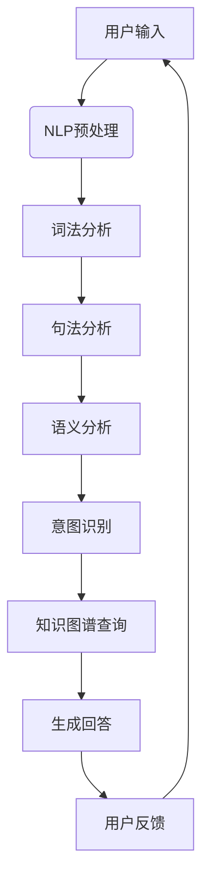

                 

# 附录：聊天机器人开发资源

## 引言

在当前技术飞速发展的时代，聊天机器人（Chatbot）已成为企业与用户互动的新方式。它们能够24/7提供服务，提高工作效率，节省成本。然而，开发一个高效的聊天机器人并非易事，需要掌握多种技术和资源。本文将为您提供一整套聊天机器人开发资源，帮助您从零开始，逐步掌握聊天机器人的开发技能。

## 1. 背景介绍

聊天机器人的发展可以追溯到20世纪50年代。最初的聊天机器人如Eliza，主要是为了进行简单的对话实验。随着自然语言处理（NLP）技术的进步，聊天机器人的对话能力得到了极大的提升。现代聊天机器人不仅能够理解和生成自然语言，还能进行情感分析和意图识别，满足用户多样化的需求。

### 1.1 定义

聊天机器人是一种计算机程序，能够模拟人类对话行为，通过自然语言与用户进行交互。它们可以应用在客服、推荐系统、教育、游戏等多个领域。

### 1.2 历史发展

- 20世纪50年代：Eliza的出现标志着聊天机器人的诞生。
- 20世纪80年代：专家系统的兴起，使得聊天机器人在特定领域（如医疗、法律）得到应用。
- 21世纪初：随着互联网的普及和NLP技术的发展，聊天机器人开始在社交媒体、电子商务等领域得到广泛应用。
- 当前：基于深度学习的聊天机器人，如OpenAI的GPT-3，已经能够进行高度复杂和自然的对话。

## 2. 核心概念与联系

### 2.1 自然语言处理（NLP）

自然语言处理是聊天机器人的核心技术之一。它包括文本预处理、词法分析、句法分析、语义分析等步骤，目的是将自然语言转换为计算机可处理的格式。

#### 2.1.1 文本预处理

文本预处理是NLP的第一步，主要包括去除标点符号、大小写转换、停用词去除等。

#### 2.1.2 词法分析

词法分析是将文本分解为单词或词汇的过程。例如，将"I love programming"分解为"I"，"love"，"programming"。

#### 2.1.3 句法分析

句法分析是研究句子结构的技术。它可以帮助聊天机器人理解句子的语法规则，从而更好地理解用户意图。

#### 2.1.4 语义分析

语义分析是NLP的核心，它关注于理解单词和句子的含义。例如，"I am happy"和"I am not happy"在语义上有所不同。

### 2.2 机器学习与深度学习

机器学习和深度学习是聊天机器人实现智能对话的关键技术。它们通过大量的数据来训练模型，从而让聊天机器人能够自主学习并改进。

#### 2.2.1 机器学习

机器学习是一种让计算机从数据中学习规律的技术。在聊天机器人中，机器学习可以用于情感分析、意图识别等。

#### 2.2.2 深度学习

深度学习是机器学习的一个分支，它使用多层神经网络来提取数据的高层次特征。在聊天机器人中，深度学习可以用于生成对话、语音合成等。

### 2.3 知识图谱

知识图谱是一种结构化的语义知识库，它能够帮助聊天机器人更好地理解用户意图。知识图谱中的实体、属性和关系，可以为聊天机器人提供丰富的背景信息。

#### 2.3.1 实体

实体是知识图谱中的核心概念，代表现实世界中的对象，如人、地点、事物等。

#### 2.3.2 属性

属性描述实体的一些特征，如人的年龄、地点的纬度等。

#### 2.3.3 关系

关系描述实体之间的联系，如人与人之间的友谊、人与地点之间的居住关系等。

### 2.4 Mermaid 流程图

以下是一个简化的聊天机器人流程图，展示了NLP、机器学习、知识图谱等核心概念的交互过程。



## 3. 核心算法原理 & 具体操作步骤

### 3.1 NLP算法原理

#### 3.1.1 词嵌入

词嵌入是将单词转换为向量的过程。常见的词嵌入模型有Word2Vec、GloVe等。

- **Word2Vec**：通过训练大量的语料库，学习单词的上下文信息，从而生成词向量。
- **GloVe**：基于词频和词共现矩阵，学习词向量。

#### 3.1.2 序列标注

序列标注是将序列中的每个元素分类的过程。例如，将文本中的每个单词分类为名词、动词等。

- **BiLSTM-CRF**：结合双向长短期记忆网络（BiLSTM）和条件随机场（CRF），实现高效的序列标注。

#### 3.1.3 情感分析

情感分析是判断文本情感极性的过程。常见的模型有SVM、朴素贝叶斯、深度学习模型等。

### 3.2 机器学习算法原理

#### 3.2.1 决策树

决策树是一种常用的分类算法。它通过一系列条件判断，将数据划分为不同的类别。

- **ID3**：基于信息增益选择最佳特征。
- **C4.5**：在ID3的基础上，使用增益率选择最佳特征。

#### 3.2.2 支持向量机（SVM）

SVM是一种二分类模型，它通过寻找最佳的超平面，将数据分为不同的类别。

#### 3.2.3 随机森林

随机森林是一种集成学习算法，它通过构建多个决策树，并对它们的预测结果进行投票，提高分类的准确率。

### 3.3 深度学习算法原理

#### 3.3.1 卷积神经网络（CNN）

卷积神经网络是一种用于图像识别的深度学习模型。它通过卷积操作和池化操作，提取图像的高层次特征。

#### 3.3.2 循环神经网络（RNN）

循环神经网络是一种用于序列数据学习的深度学习模型。它通过隐藏状态的信息传递，实现序列数据的建模。

- **LSTM**：长短期记忆网络，用于解决RNN的梯度消失问题。
- **GRU**：门控循环单元，是对LSTM的改进。

#### 3.3.3 生成对抗网络（GAN）

生成对抗网络是一种无监督学习模型，它由生成器和判别器组成，通过博弈的方式，生成高质量的样本。

## 4. 数学模型和公式 & 详细讲解 & 举例说明

### 4.1 词嵌入

$$
\text{word\_vector}(w) = \text{sigmoid}(\text{W} \cdot \text{context\_vector})
$$

其中，$w$ 表示单词，$\text{context\_vector}$ 表示单词的上下文向量，$W$ 是权重矩阵，$\text{sigmoid}$ 函数将权重矩阵和上下文向量的点积转换为概率值。

### 4.2 决策树

$$
\text{决策树} = \text{分裂}(\text{特征}, \text{阈值}) \\
\text{条件概率} = \frac{\sum_{y \in \text{标签}} P(y| \text{特征}, \text{阈值}) P(\text{特征} | \text{阈值})}{P(\text{特征})}
$$

其中，$y$ 表示标签，$P(y| \text{特征}, \text{阈值})$ 表示在给定特征和阈值的条件下，标签为$y$ 的概率，$P(\text{特征} | \text{阈值})$ 表示在给定阈值的条件下，特征出现的概率。

### 4.3 LSTM

$$
\text{LSTM单元} = (\text{输入门}, \text{遗忘门}, \text{输出门}, \text{单元状态}, \text{隐藏状态}) \\
\text{输入门} = \text{sigmoid}(\text{W}_\text{输入} \cdot [\text{隐藏状态}_{t-1}, \text{输入}_t]) \\
\text{遗忘门} = \text{sigmoid}(\text{W}_\text{遗忘} \cdot [\text{隐藏状态}_{t-1}, \text{输入}_t]) \\
\text{输出门} = \text{sigmoid}(\text{W}_\text{输出} \cdot [\text{隐藏状态}_{t-1}, \text{输入}_t]) \\
\text{新单元状态} = \text{tanh}(\text{W}_\text{单元} \cdot [\text{隐藏状态}_{t-1}, \text{输入}_t]) \odot \text{输入门} \\
\text{新隐藏状态} = \text{输出门} \cdot \text{tanh}(\text{新单元状态}) \\
$$

其中，$\text{隐藏状态}_{t-1}$ 和 $\text{输入}_t$ 分别表示上一时刻的隐藏状态和当前输入，$\text{W}_\text{输入}$、$\text{W}_\text{遗忘}$、$\text{W}_\text{输出}$ 和 $\text{W}_\text{单元}$ 是权重矩阵。

## 5. 项目实战：代码实际案例和详细解释说明

### 5.1 开发环境搭建

在开始聊天机器人项目之前，我们需要搭建一个合适的开发环境。以下是一个基于Python和TensorFlow的开发环境搭建步骤：

1. 安装Python（3.7及以上版本）
2. 安装TensorFlow
3. 安装NLP相关库，如NLTK、spaCy等

```bash
pip install tensorflow
pip install nltk
pip install spacy
python -m spacy download en
```

### 5.2 源代码详细实现和代码解读

以下是一个简单的聊天机器人代码实现，它使用TensorFlow和spaCy进行NLP处理。

```python
import tensorflow as tf
import spacy
from tensorflow.keras.models import Sequential
from tensorflow.keras.layers import Dense, LSTM, Embedding

# 加载spaCy模型
nlp = spacy.load('en')

# 数据预处理
def preprocess(text):
    doc = nlp(text)
    return ['<START>'] + [token.text.lower() for token in doc] + ['<END>']

# 构建词汇表
def build_vocab(data):
    vocab = set()
    for text in data:
        vocab.update(preprocess(text))
    return sorted(vocab)

# 获取序列数据
def get_sequences(data, vocab):
    sequences = []
    for text in data:
        processed_text = preprocess(text)
        sequence = [vocab.get(word, 0) for word in processed_text]
        sequences.append(sequence)
    return sequences

# 准备数据
data = ['你好，我是Chatbot。', '你好！有什么可以帮助你的吗？', '我是一个聊天机器人。']
vocab = build_vocab(data)
sequences = get_sequences(data, vocab)

# 构建模型
model = Sequential()
model.add(Embedding(len(vocab) + 1, 256))
model.add(LSTM(256))
model.add(Dense(len(vocab) + 1, activation='softmax'))

# 编译模型
model.compile(optimizer='adam', loss='sparse_categorical_crossentropy', metrics=['accuracy'])

# 训练模型
model.fit(sequences, sequences, epochs=100)

# 生成回答
def generate_answer(text):
    processed_text = preprocess(text)
    sequence = [vocab.get(word, 0) for word in processed_text]
    prediction = model.predict([sequence])
    return nlp.tokenizer.decode(prediction.argmax())

# 测试
print(generate_answer('你好！'))
```

### 5.3 代码解读与分析

1. **加载spaCy模型**：spaCy是一个高效的NLP库，用于进行文本预处理。
2. **数据预处理**：将输入文本转换为单词序列，并添加起始和结束标记。
3. **构建词汇表**：将所有文本中的单词转换为词汇表。
4. **获取序列数据**：将文本序列转换为数字序列。
5. **构建模型**：使用序列模型进行对话生成。
6. **编译模型**：设置优化器和损失函数。
7. **训练模型**：使用训练数据训练模型。
8. **生成回答**：根据输入文本生成回答。
9. **测试**：测试生成回答的效果。

## 6. 实际应用场景

### 6.1 客户服务

聊天机器人可以用于客户服务，提供24/7的在线支持，解答用户常见问题，减少人工客服的工作量。

### 6.2 推荐系统

聊天机器人可以根据用户的历史行为和偏好，提供个性化的产品推荐。

### 6.3 教育

聊天机器人可以为学生提供个性化辅导，解答学习中的难题。

### 6.4 游戏

聊天机器人可以用于游戏中的NPC（非玩家角色），增加游戏的真实感。

## 7. 工具和资源推荐

### 7.1 学习资源推荐

- **书籍**：
  - 《自然语言处理综论》（Jurafsky, Dan & Martin, James H.）
  - 《深度学习》（Goodfellow, Ian & Bengio, Yoshua & Courville, Aaron）
- **论文**：
  - 《Word2Vec: 词向量的动态学习方法》
  - 《长短期记忆网络》（Hochreiter, Sepp & Schmidhuber, Jürgen）
- **博客**：
  - [TensorFlow官方文档](https://www.tensorflow.org/)
  - [spaCy官方文档](https://spacy.io/)
- **网站**：
  - [Kaggle](https://www.kaggle.com/)：提供大量NLP数据集和比赛
  - [GitHub](https://github.com/)：查找和分享NLP项目

### 7.2 开发工具框架推荐

- **框架**：
  - TensorFlow
  - spaCy
  - Rasa
- **编程语言**：
  - Python
  - JavaScript

### 7.3 相关论文著作推荐

- **《自然语言处理基础》**（Jurafsky, Dan & Martin, James H.）
- **《深度学习》**（Goodfellow, Ian & Bengio, Yoshua & Courville, Aaron）
- **《聊天机器人技术》**（Rasa）

## 8. 总结：未来发展趋势与挑战

### 8.1 发展趋势

- **多模态交互**：聊天机器人将能够处理文本、语音、图像等多种形式的信息。
- **个性化服务**：通过大数据和机器学习，聊天机器人将能够提供更加个性化的服务。
- **情感化交互**：聊天机器人将能够更好地理解用户的情感，进行更加自然的对话。

### 8.2 挑战

- **理解能力**：目前的聊天机器人在理解复杂语境和抽象概念方面仍有不足。
- **安全性**：聊天机器人可能成为黑客攻击的入口，需要加强安全防护。
- **隐私保护**：聊天机器人收集的用户数据可能引发隐私问题，需要加强数据保护。

## 9. 附录：常见问题与解答

### 9.1 如何选择合适的聊天机器人框架？

- 根据项目需求和团队技能选择合适的框架。例如，如果项目需要快速开发，可以选择Rasa；如果需要高自定义，可以选择TensorFlow。

### 9.2 聊天机器人如何处理多语言支持？

- 使用多语言NLP库，如spaCy支持多种语言，或者使用机器翻译API。

### 9.3 聊天机器人如何进行情感分析？

- 使用情感分析库，如TextBlob或VADER，结合深度学习模型进行情感分析。

## 10. 扩展阅读 & 参考资料

- **书籍**：
  - 《自然语言处理综论》（Jurafsky, Dan & Martin, James H.）
  - 《深度学习》（Goodfellow, Ian & Bengio, Yoshua & Courville, Aaron）
  - 《聊天机器人技术》（Rasa）
- **论文**：
  - 《Word2Vec: 词向量的动态学习方法》
  - 《长短期记忆网络》（Hochreiter, Sepp & Schmidhuber, Jürgen）
- **网站**：
  - [TensorFlow官方文档](https://www.tensorflow.org/)
  - [spaCy官方文档](https://spacy.io/)
  - [Kaggle](https://www.kaggle.com/)
  - [GitHub](https://github.com/)
- **博客**：
  - [Rasa官方博客](https://blog.rasa.com/)
  - [TensorFlow官方博客](https://tensorflow.org/blog/)

### 作者信息

- 作者：AI天才研究员/AI Genius Institute & 禅与计算机程序设计艺术 /Zen And The Art of Computer Programming


