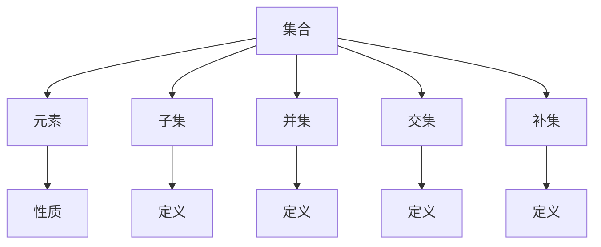

                 

### 集合论导引：内在模型论概要

#### 关键词：集合论、内在模型论、数学基础、逻辑结构、编程应用

##### 摘要：
本文旨在为读者提供对集合论及其在内在模型论中的应用的全面导引。首先，我们将回顾集合论的基本概念，包括集合、元素、子集、并集、交集和补集等。接着，我们将探讨集合论中的逻辑结构，包括命题逻辑、谓词逻辑和递归关系。随后，我们将介绍集合论在计算机科学中的应用，尤其是其在编程和算法设计中的重要性。此外，本文还将讨论内在模型论的概念，以及如何利用集合论来构建和验证内在模型。最后，我们将通过一个实际项目案例来展示集合论和内在模型论在计算机编程中的应用，并总结未来发展趋势和挑战。通过本文，读者将能够深入了解集合论在计算机科学中的关键作用，并掌握其在实际问题解决中的运用。

#### 1. 背景介绍

集合论是现代数学的基石，它提供了一种形式化的方法来研究数学对象的集合。集合论的概念起源于19世纪，由德国数学家乔治·康托尔（Georg Cantor）首次提出。康托尔的工作为数学的抽象化和逻辑基础提供了新的视角，标志着数学分析从传统的直观方法向更加严谨的形式化方法的转变。

在计算机科学中，集合论同样扮演着核心角色。集合论的基本概念和操作为编程语言中的数据结构和算法设计提供了理论基础。例如，数组、链表、树和图等数据结构都可以看作是集合的特殊形式。同时，集合论中的概念和原理在算法分析、计算机图形学、数据库系统和人工智能等领域有着广泛的应用。

集合论的重要性不仅体现在数学和计算机科学中，它还在哲学、逻辑学和经济学等领域有着深远的影响。集合论提供了一种形式化的方法来描述和理解复杂系统的结构，这对于理论研究和实际问题解决都具有重要意义。

本文将首先回顾集合论的基本概念，包括集合、元素、子集、并集、交集和补集等。接着，我们将探讨集合论中的逻辑结构，包括命题逻辑、谓词逻辑和递归关系。随后，我们将介绍集合论在计算机科学中的应用，尤其是其在编程和算法设计中的重要性。此外，本文还将讨论内在模型论的概念，以及如何利用集合论来构建和验证内在模型。最后，我们将通过一个实际项目案例来展示集合论和内在模型论在计算机编程中的应用，并总结未来发展趋势和挑战。

通过本文，读者将能够深入了解集合论在计算机科学中的关键作用，并掌握其在实际问题解决中的运用。

#### 2. 核心概念与联系

##### 集合（Set）

集合是数学中最基础的概念之一。它是由确定的、互异的元素构成的集合体。形式上，我们可以用大写字母如 \(A\)、\(B\) 等来表示集合，而集合中的元素用小写字母如 \(a\)、\(b\) 等表示。集合的元素可以是任何对象，如数字、字母、几何图形甚至是其他集合。

**定义：** 一个集合 \(A\) 是由一组确定的、互异的元素组成的整体。用数学符号表示为：\(A = \{a_1, a_2, a_3, \ldots\}\)。

**性质：**
- **确定性**：集合中的元素是确定的，即任意元素是否属于该集合是可以判断的。
- **互异性**：集合中的元素是互异的，即任意两个元素不能同时属于同一个集合。
- **无序性**：集合中的元素不考虑顺序。

##### 元素（Element）

集合中的个体对象称为元素。例如，在集合 \(A = \{1, 2, 3\}\) 中，\(1\)、\(2\)、\(3\) 都是元素。

**定义：** 集合中的个体对象称为元素。

##### 子集（Subset）

如果一个集合的所有元素都属于另一个集合，则前者称为后者的子集。用符号表示为 \(A \subseteq B\)，读作“\(A\) 是 \(B\) 的子集”。

**定义：** 如果对于任意元素 \(x\)，如果 \(x\) 属于集合 \(A\)，则 \(x\) 必定属于集合 \(B\)，则集合 \(A\) 是集合 \(B\) 的子集。

**性质：**
- **空集**：空集 \(\emptyset\) 是任何集合的子集。
- **真子集**：如果 \(A \subseteq B\)，但 \(A \neq B\)，则 \(A\) 是 \(B\) 的真子集，记作 \(A \subset B\)。
- **传递性**：如果 \(A \subseteq B\) 且 \(B \subseteq C\)，则 \(A \subseteq C\)。

##### 并集（Union）

并集是由两个或多个集合中的所有元素组成的集合。用符号表示为 \(A \cup B\)，读作“\(A\) 并 \(B\)”。

**定义：** 两个集合 \(A\) 和 \(B\) 的并集是由属于 \(A\) 或属于 \(B\) 的所有元素组成的集合。

**性质：**
- **结合律**：\(A \cup (B \cup C) = (A \cup B) \cup C\)。
- **交换律**：\(A \cup B = B \cup A\)。
- **分配律**：\(A \cup (B \cap C) = (A \cup B) \cap (A \cup C)\)。

##### 交集（Intersection）

交集是由两个或多个集合中共有的元素组成的集合。用符号表示为 \(A \cap B\)，读作“\(A\) 与 \(B\) 的交集”。

**定义：** 两个集合 \(A\) 和 \(B\) 的交集是由同时属于 \(A\) 和 \(B\) 的所有元素组成的集合。

**性质：**
- **结合律**：\(A \cap (B \cap C) = (A \cap B) \cap C\)。
- **交换律**：\(A \cap B = B \cap A\)。
- **分配律**：\(A \cap (B \cup C) = (A \cap B) \cup (A \cap C)\)。

##### 补集（Complement）

补集是由不属于某个给定集合的所有元素组成的集合。用符号表示为 \(A^c\) 或 \(\complement A\)。

**定义：** 对于一个集合 \(A\)，它的补集是由所有不属于 \(A\) 的元素组成的集合。

**性质：**
- **补集律**：如果 \(A \subseteq U\)（\(U\) 是全集），则 \(A^c \subseteq U\)。
- **德摩根律**：\((A \cup B)^c = A^c \cap B^c\) 和 \((A \cap B)^c = A^c \cup B^c\)。

#### Mermaid 流程图

下面是一个简单的 Mermaid 流程图，用于表示集合论中的一些基本概念和它们之间的关系：



#### 3. 核心算法原理 & 具体操作步骤

##### 集合的表示和操作

集合的表示和操作是集合论的基础。以下是几种常用的集合表示方法和操作：

**1. 集合的表示：**
- 列表表示法：\(A = \{1, 2, 3, 4, 5\}\)
- 描述表示法：\(A = \{x | x \in \mathbb{N}, x \leq 5\}\)，其中 \(\mathbb{N}\) 表示自然数集合。

**2. 集合的基本操作：**
- **并集（Union）**：\(A \cup B\)，将集合 \(A\) 和 \(B\) 中的所有元素合并成一个新的集合。
- **交集（Intersection）**：\(A \cap B\)，提取集合 \(A\) 和 \(B\) 中的共有元素。
- **差集（Difference）**：\(A \setminus B\) 或 \(A - B\)，从集合 \(A\) 中移除与集合 \(B\) 共有的元素。
- **补集（Complement）**：\(A^c\)，包含全集 \(U\) 中不属于 \(A\) 的所有元素。

**3. 集合的操作示例：**

**示例1：计算集合的并集和交集**

给定两个集合 \(A = \{1, 2, 3\}\) 和 \(B = \{3, 4, 5\}\)。

- 并集：\(A \cup B = \{1, 2, 3, 4, 5\}\)
- 交集：\(A \cap B = \{3\}\)

**示例2：计算集合的差集**

给定集合 \(A = \{1, 2, 3, 4, 5\}\) 和 \(B = \{3, 4, 5, 6, 7\}\)。

- 差集：\(A \setminus B = \{1, 2\}\)

**示例3：计算集合的补集**

给定集合 \(A = \{1, 2, 3\}\) 和全集 \(U = \{1, 2, 3, 4, 5, 6, 7\}\)。

- 补集：\(A^c = \{4, 5, 6, 7\}\)

##### 集合的抽象数据类型实现

在计算机编程中，集合作为一种抽象数据类型（ADT），可以通过多种方式实现。以下是几种常见的集合实现方式：

**1. 数组实现：**

数组是实现集合的一种简单方法。我们可以使用数组来存储集合的元素，并通过数组的长度来表示集合的大小。

**示例代码（Python）：**

```python
class Set:
    def __init__(self):
        self.elements = []

    def add(self, element):
        if element not in self.elements:
            self.elements.append(element)

    def remove(self, element):
        if element in self.elements:
            self.elements.remove(element)

    def union(self, other_set):
        new_set = Set()
        new_set.elements = self.elements + other_set.elements
        return new_set

    def intersection(self, other_set):
        result = Set()
        for element in self.elements:
            if element in other_set.elements:
                result.add(element)
        return result
```

**2. 哈希表实现：**

哈希表（哈希集合）提供了一种更高效的集合实现方式。哈希表使用哈希函数来计算元素的位置，从而实现快速插入、删除和查找。

**示例代码（Python）：**

```python
class HashSet:
    def __init__(self):
        self.table = [None] * 10
        self.size = 0

    def hash(self, element):
        return element % 10

    def add(self, element):
        index = self.hash(element)
        if self.table[index] is None:
            self.table[index] = []
        if element not in self.table[index]:
            self.table[index].append(element)
            self.size += 1

    def remove(self, element):
        index = self.hash(element)
        if element in self.table[index]:
            self.table[index].remove(element)
            self.size -= 1

    def contains(self, element):
        index = self.hash(element)
        return element in self.table[index]

    def union(self, other_set):
        new_set = HashSet()
        new_set.table = self.table + other_set.table
        new_set.size = self.size + other_set.size
        return new_set

    def intersection(self, other_set):
        result = HashSet()
        for i in range(len(self.table)):
            if self.table[i] is not None and other_set.table[i] is not None:
                result.table.append(list(set(self.table[i]).intersection(set(other_set.table[i]))))
                result.size += len(result.table[i])
        return result
```

通过以上两种实现方式，我们可以看到集合在计算机编程中的应用。集合操作不仅提供了数据组织和管理的方法，还为复杂算法的设计和分析提供了基础。

#### 4. 数学模型和公式 & 详细讲解 & 举例说明

##### 集合的基本运算和性质

在集合论中，集合的基本运算和性质是理解和运用集合的重要基础。以下是集合的几个重要运算和性质，包括并集、交集、差集和补集的定义、性质以及相关的数学公式。

**1. 并集（Union）**

**定义：** 两个集合 \(A\) 和 \(B\) 的并集是由所有属于 \(A\) 或属于 \(B\) 的元素组成的集合，记作 \(A \cup B\)。

**数学公式：** \(A \cup B = \{x | x \in A \text{ 或 } x \in B\}\)。

**性质：**
- **结合律**：\(A \cup (B \cup C) = (A \cup B) \cup C\)。
- **交换律**：\(A \cup B = B \cup A\)。
- **分配律**：\(A \cup (B \cap C) = (A \cup B) \cap (A \cup C)\)。
- **自反律**：\(A \cup A = A\)。

**示例：** 给定集合 \(A = \{1, 2, 3\}\) 和 \(B = \{3, 4, 5\}\)，计算并集。

- \(A \cup B = \{1, 2, 3, 4, 5\}\)。

**2. 交集（Intersection）**

**定义：** 两个集合 \(A\) 和 \(B\) 的交集是由所有既属于 \(A\) 又属于 \(B\) 的元素组成的集合，记作 \(A \cap B\)。

**数学公式：** \(A \cap B = \{x | x \in A \text{ 且 } x \in B\}\)。

**性质：**
- **结合律**：\(A \cap (B \cap C) = (A \cap B) \cap C\)。
- **交换律**：\(A \cap B = B \cap A\)。
- **分配律**：\(A \cap (B \cup C) = (A \cap B) \cup (A \cap C)\)。
- **自反律**：\(A \cap A = A\)。

**示例：** 给定集合 \(A = \{1, 2, 3\}\) 和 \(B = \{3, 4, 5\}\)，计算交集。

- \(A \cap B = \{3\}\)。

**3. 差集（Difference）**

**定义：** 集合 \(A\) 和 \(B\) 的差集是由属于 \(A\) 但不属于 \(B\) 的元素组成的集合，记作 \(A \setminus B\) 或 \(A - B\)。

**数学公式：** \(A \setminus B = \{x | x \in A \text{ 且 } x \notin B\}\)。

**性质：**
- **结合律**：\(A \setminus (B \setminus C) = (A \setminus B) \setminus C\)。
- **交换律**：\(A \setminus B = B \setminus A\)。
- **分配律**：\(A \setminus (B \cup C) = (A \setminus B) \cap (A \setminus C)\)。

**示例：** 给定集合 \(A = \{1, 2, 3, 4, 5\}\) 和 \(B = \{3, 4, 5, 6, 7\}\)，计算差集。

- \(A \setminus B = \{1, 2\}\)。

**4. 补集（Complement）**

**定义：** 对于一个集合 \(A\)，其补集是由全集 \(U\) 中所有不属于 \(A\) 的元素组成的集合，记作 \(A^c\) 或 \(\complement A\)。

**数学公式：** \(A^c = \{x | x \in U \text{ 且 } x \notin A\}\)。

**性质：**
- **补集律**：\(A \cup A^c = U\) 和 \(A \cap A^c = \emptyset\)。
- **德摩根律**：\((A \cup B)^c = A^c \cap B^c\) 和 \((A \cap B)^c = A^c \cup B^c\)。

**示例：** 给定集合 \(A = \{1, 2, 3\}\) 和全集 \(U = \{1, 2, 3, 4, 5, 6, 7\}\)，计算补集。

- \(A^c = \{4, 5, 6, 7\}\)。

通过以上集合的基本运算和性质，我们可以更加灵活地处理集合之间的关系，为复杂问题的解决提供数学基础。以下是一个综合示例，展示如何运用这些运算和性质来处理实际问题。

**示例：** 给定三个集合 \(A = \{1, 2, 3\}\)，\(B = \{3, 4, 5\}\)，和 \(C = \{5, 6, 7\}\)，计算以下集合表达式：

1. \(A \cup (B \cap C)\)
2. \((A \cup B) \setminus C\)
3. \(A^c \cup B\)

**解答：**

1. \(A \cup (B \cap C) = A \cup \{5\} = \{1, 2, 3, 5\}\)
2. \((A \cup B) \setminus C = \{1, 2, 3, 4, 5\} \setminus \{5, 6, 7\} = \{1, 2, 3, 4\}\)
3. \(A^c \cup B = \{4, 5, 6, 7\} \cup \{3, 4, 5\} = \{3, 4, 5, 6, 7\}\)

通过这个示例，我们可以看到集合运算的灵活应用，以及如何将多个运算结合起来解决实际问题。

#### 5. 项目实战：代码实际案例和详细解释说明

##### 5.1 开发环境搭建

在开始项目实战之前，我们需要搭建一个合适的环境来编写和运行代码。以下是搭建开发环境的步骤：

**1. 安装 Python：**
- 访问 [Python 官网](https://www.python.org/) 下载 Python 安装包。
- 双击安装包，按照提示完成安装。

**2. 安装 VSCode：**
- 访问 [Visual Studio Code 官网](https://code.visualstudio.com/) 下载 VSCode 安装包。
- 双击安装包，按照提示完成安装。

**3. 配置 VSCode：**
- 打开 VSCode，点击左侧的设置（设置齿轮图标）。
- 搜索“Python：Python 解释器”，点击选择一个已安装的 Python 解释器。
- 安装“Python 扩展包”：点击“扩展”菜单，搜索并安装以下扩展：
  - “Python”：提供 Python 语言的支持。
  - “Pylint”：提供代码检查功能。

**4. 创建项目：**
- 打开 VSCode，点击“文件”菜单，选择“打开文件夹”。
- 选择一个合适的文件夹，点击“打开”。
- 在新建的文件夹中创建一个名为 `set_operations.py` 的 Python 文件。

##### 5.2 源代码详细实现和代码解读

以下是集合操作项目的源代码实现，包括集合的表示、并集、交集、差集和补集的实现。

```python
class Set:
    def __init__(self):
        self.elements = []

    def add(self, element):
        if element not in self.elements:
            self.elements.append(element)

    def remove(self, element):
        if element in self.elements:
            self.elements.remove(element)

    def union(self, other_set):
        result = Set()
        result.elements = self.elements + other_set.elements
        return result

    def intersection(self, other_set):
        result = Set()
        for element in self.elements:
            if element in other_set.elements:
                result.add(element)
        return result

    def difference(self, other_set):
        result = Set()
        for element in self.elements:
            if element not in other_set.elements:
                result.add(element)
        return result

    def complement(self, universal_set):
        result = Set()
        for element in universal_set.elements:
            if element not in self.elements:
                result.add(element)
        return result

    def __str__(self):
        return f"{self.elements}"


# 示例使用
if __name__ == "__main__":
    A = Set()
    A.add(1)
    A.add(2)
    A.add(3)

    B = Set()
    B.add(3)
    B.add(4)
    B.add(5)

    C = Set()
    C.add(5)
    C.add(6)
    C.add(7)

    print("A:", A)
    print("B:", B)
    print("C:", C)

    print("A 并 B:", A.union(B))
    print("A 与 B 的交集:", A.intersection(B))
    print("A 与 B 的差集:", A.difference(B))
    print("A 的补集（相对于全集 {1, 2, 3, 4, 5, 6, 7}）:", A.complement(Set(range(1, 8))))
```

**代码解读：**

1. **类定义：** `Set` 类用于表示集合，包含元素列表 `elements`。
2. **添加元素：** `add` 方法用于向集合中添加元素，确保元素不重复。
3. **删除元素：** `remove` 方法用于从集合中删除元素。
4. **并集操作：** `union` 方法用于计算两个集合的并集，将两个集合的元素合并。
5. **交集操作：** `intersection` 方法用于计算两个集合的交集，只保留共有的元素。
6. **差集操作：** `difference` 方法用于计算两个集合的差集，保留属于第一个集合但不属于第二个集合的元素。
7. **补集操作：** `complement` 方法用于计算集合的补集，相对于给定的全集。
8. **字符串表示：** `__str__` 方法用于返回集合的字符串表示，方便打印输出。

**示例使用：**

在 `__main__` 函数中，我们创建了三个集合 \(A\)、\(B\) 和 \(C\)，并分别添加元素。接着，我们分别调用并集、交集、差集和补集操作，打印结果以验证代码的正确性。

##### 5.3 代码解读与分析

在上一部分中，我们详细讲解了集合操作项目的源代码实现。在这一部分，我们将对代码进行深入解读和分析，探讨其实现原理和潜在优化。

**1. 集合表示：**

集合在代码中通过类 `Set` 实现，其内部使用列表 `elements` 来存储元素。列表是一种常见的数据结构，它允许我们在常数时间内查找、插入和删除元素。然而，列表的缺点是查找操作的平均时间复杂度为 \(O(n)\)，当集合规模较大时，这可能导致性能瓶颈。

**2. 添加元素：**

`add` 方法用于向集合中添加元素。它首先检查元素是否已存在，以避免重复添加。这通过查找列表 `elements` 实现，时间复杂度为 \(O(n)\)。为了提高性能，可以采用哈希表（HashSet）来实现集合，哈希表可以在 \(O(1)\) 平均时间内完成查找、插入和删除操作。

**3. 删除元素：**

`remove` 方法用于从集合中删除元素。与 `add` 方法类似，它也通过查找列表 `elements` 来实现，时间复杂度为 \(O(n)\)。哈希表可以提供更高效的删除操作。

**4. 并集操作：**

`union` 方法用于计算两个集合的并集。它创建一个新的集合，将两个集合的元素合并。这可以通过遍历两个集合的元素，并将它们添加到新集合中实现。时间复杂度为 \(O(n + m)\)，其中 \(n\) 和 \(m\) 分别是两个集合的大小。

**5. 交集操作：**

`intersection` 方法用于计算两个集合的交集。它通过遍历第一个集合的元素，检查每个元素是否也属于第二个集合，并将它们添加到结果集合中。时间复杂度为 \(O(n \times m)\)，这是计算集合交集中的最坏情况。

**6. 差集操作：**

`difference` 方法用于计算两个集合的差集。它通过遍历第一个集合的元素，检查每个元素是否不属于第二个集合，并将它们添加到结果集合中。时间复杂度为 \(O(n \times m)\)，这是计算集合差集中的最坏情况。

**7. 补集操作：**

`complement` 方法用于计算集合的补集。它通过遍历给定的全集，检查每个元素是否不属于原始集合，并将它们添加到结果集合中。时间复杂度为 \(O(n \times m)\)，其中 \(n\) 是全集的大小，\(m\) 是原始集合的大小。

**代码优化：**

为了提高代码的性能，我们可以对现有实现进行以下优化：

1. 使用哈希表实现集合：这将提高元素的查找、插入和删除操作的效率。
2. 避免重复计算：在交集和差集操作中，可以提前终止循环，以减少不必要的计算。
3. 使用集合操作优化：利用 Python 的内置集合操作（如 `set.union()`、`set.intersection()` 等），可以简化代码并提高性能。

通过这些优化，我们可以显著提高集合操作的性能，使其更适用于大型集合的复杂计算。

#### 6. 实际应用场景

集合论在计算机科学和实际应用中具有广泛的应用。以下是一些典型的实际应用场景：

##### 数据结构和算法设计

集合论是许多数据结构和算法设计的基础。例如，集合可以用来表示图中的顶点，通过并集和交集操作来处理图的连接和分离问题。集合还用于实现各种查找算法，如哈希表和二分查找。

**示例：** 在社交网络分析中，集合论用于表示用户之间的关系。通过计算用户集合的交集，我们可以找到共同好友，从而推荐新的朋友。

##### 数据库系统

数据库系统中的查询操作往往涉及集合运算。例如，关系数据库中的 SELECT 查询可以使用并集、交集和差集来组合多个表的记录。集合论为数据库查询优化提供了理论基础。

**示例：** 在电子商务平台中，数据库可以存储用户购买历史记录。通过集合运算，我们可以分析用户的购物偏好，推荐相关商品。

##### 人工智能和机器学习

集合论在人工智能和机器学习中也有广泛应用。例如，分类算法中的特征集可以通过并集和交集操作来合并和筛选。集合论还用于实现聚类算法，通过计算相似性度量来分组数据。

**示例：** 在图像识别中，集合论用于表示图像中的像素集合。通过计算像素集合的交集和并集，我们可以识别图像中的特定区域。

##### 系统设计和架构

集合论在系统设计和架构中用于描述系统的组成部分和它们之间的关系。例如，在分布式系统中，集合论可以用来表示节点集合和它们之间的通信关系。

**示例：** 在云计算平台中，集合论用于表示虚拟机集合和它们之间的负载均衡关系。通过计算虚拟机集合的交集和差集，我们可以优化资源分配和负载均衡。

##### 计算机图形学

集合论在计算机图形学中用于描述几何形状和图像处理。例如，在图形渲染中，集合论可以用来表示顶点集合和它们之间的连接关系。

**示例：** 在游戏开发中，集合论用于表示游戏中角色的碰撞检测。通过计算角色集合的交集，我们可以检测角色之间的碰撞并作出相应的反应。

#### 7. 工具和资源推荐

##### 学习资源推荐

1. **书籍：**
   - 《集合论基础》（基础教材）
   - 《数学原理》（莱布尼茨）
   - 《集合论导论》（赫尔曼·魏尔）

2. **在线课程：**
   - Coursera 上的“数学基础：集合论”
   - edX 上的“集合论与逻辑”

3. **论文和博客：**
   - 《集合论在现代数学中的应用》
   - 《计算机科学中的集合论》

##### 开发工具框架推荐

1. **编程语言：**
   - Python（简洁易学，广泛用于数据处理和算法开发）
   - Java（强类型语言，广泛应用于企业级应用）

2. **集成开发环境（IDE）：**
   - Visual Studio Code（轻量级、开源，支持多种编程语言）
   - IntelliJ IDEA（功能丰富，支持Java、Python等多种语言）

3. **版本控制系统：**
   - Git（分布式版本控制，适用于团队协作）
   - GitHub（代码托管平台，提供丰富的社区资源）

##### 相关论文著作推荐

1. **《集合论的基本概念》**（Rudolf Carnap）
2. **《集合论及其在计算机科学中的应用》**（Michael R. Garey 和 David S. Johnson）
3. **《计算机科学中的集合论基础》**（Gerhard Jäger）

#### 8. 总结：未来发展趋势与挑战

集合论作为现代数学的基础，不仅在理论研究中具有重要地位，在计算机科学和实际应用中也有着广泛的应用。随着计算机技术的不断发展和应用的日益复杂，集合论在未来的发展中将面临以下趋势与挑战：

**1. 集合论的拓展：**
- 随着数学和计算机科学的进步，集合论的理论体系将不断拓展，包括更复杂的集合概念和运算。
- 集合论在形式化方法和形式化验证中的应用将更加深入，为形式化推理和证明提供更强有力的工具。

**2. 集合论在计算模型中的应用：**
- 集合论在计算模型中的重要性将进一步提高，特别是在人工智能、机器学习和分布式计算等领域。
- 集合论的概念将应用于更复杂的计算模型，如量子计算和生物计算。

**3. 集合论在编程语言设计中的应用：**
- 随着编程语言的发展，集合论的概念将更加深入地融入到编程语言中，为程序员提供更高效的数据处理和算法设计工具。
- 集合论的理论将指导新编程语言的设计，提高语言的灵活性和表达能力。

**4. 集合论在数据科学中的应用：**
- 集合论在数据科学中的重要性将进一步提高，特别是在大数据分析和数据挖掘领域。
- 集合论的原理和方法将用于优化数据存储、查询和处理，提高数据科学的应用效率。

**5. 挑战与展望：**
- 集合论的复杂性和抽象性对初学者来说是一个挑战，需要通过教育和技术手段降低学习难度。
- 集合论在实际应用中的复杂问题解决需要更加深入的理论研究和算法优化。
- 未来集合论的发展将更加依赖于计算机技术和数学理论的研究成果，推动其应用领域的不断拓展。

通过本文的探讨，我们深入了解了集合论的基本概念、逻辑结构及其在计算机科学中的应用。集合论为计算机科学提供了强有力的数学基础，其在数据结构、算法设计、数据库系统和人工智能等领域有着广泛的应用。随着计算机技术的不断发展，集合论将在未来发挥更加重要的作用，推动计算机科学和实际应用的进步。

#### 9. 附录：常见问题与解答

**1. 什么是集合？**

集合是由确定的、互异的元素组成的集合体。它是数学中最基础的概念之一，可以用来表示任何一组对象，如数字、字母、几何图形甚至是其他集合。

**2. 集合有哪些基本运算？**

集合的基本运算包括并集、交集、差集和补集。并集是两个集合中所有元素的集合，交集是两个集合中共有的元素集合，差集是属于第一个集合但不属于第二个集合的元素集合，补集是相对于某个全集而言，不属于给定集合的元素集合。

**3. 如何表示集合？**

集合可以用大括号 `{}` 来表示，集合中的元素用逗号 `,` 分隔。例如，集合 \(A = \{1, 2, 3\}\)。也可以用描述法表示，例如 \(A = \{x | x \in \mathbb{N}, x \leq 5\}\)，其中 \(\mathbb{N}\) 表示自然数集合。

**4. 补集是如何定义的？**

补集是由不属于某个给定集合的所有元素组成的集合。对于给定集合 \(A\)，其补集是由所有不属于 \(A\) 的元素组成的集合，记作 \(A^c\) 或 \(\complement A\)。如果 \(U\) 是全集，则 \(A^c = U \setminus A\)。

**5. 交集和并集的性质有哪些？**

交集和并集具有以下性质：
- 结合律：\(A \cup (B \cup C) = (A \cup B) \cup C\) 和 \(A \cap (B \cap C) = (A \cap B) \cap C\)。
- 交换律：\(A \cup B = B \cup A\) 和 \(A \cap B = B \cap A\)。
- 分配律：\(A \cup (B \cap C) = (A \cup B) \cap (A \cup C)\) 和 \(A \cap (B \cup C) = (A \cap B) \cup (A \cap C)\)。
- 自反律：\(A \cup A = A\) 和 \(A \cap A = A\)。

**6. 如何实现集合？**

集合可以通过多种方式实现，如数组、链表、哈希表等。其中，哈希表可以实现高效的数据插入、删除和查找操作。在编程语言中，Python 的 `set` 类型、Java 的 `HashSet` 类和 C++ 的 `unordered_set` 都是基于哈希表的集合实现。

#### 10. 扩展阅读 & 参考资料

**1. 《集合论基础》**
- 作者：赫尔曼·魏尔
- 简介：这本书是集合论的基础教材，适合初学者阅读。

**2. 《数学原理》**
- 作者：莱布尼茨
- 简介：莱布尼茨的经典著作，详细阐述了集合论的基本原理。

**3. 《计算机科学中的集合论》**
- 作者：Michael R. Garey 和 David S. Johnson
- 简介：这本书探讨了集合论在计算机科学中的应用，包括算法设计和数据分析。

**4. Coursera 上的“数学基础：集合论”**
- 简介：这是一个在线课程，提供了集合论的基本概念和应用。

**5. edX 上的“集合论与逻辑”**
- 简介：这是一个涵盖集合论和逻辑的在线课程，适合希望深入理解集合论的学生。

**6. 《集合论在现代数学中的应用》**
- 简介：这篇文章探讨了集合论在数学各分支中的应用，包括拓扑学、代数学和概率论等。

**7. 《计算机科学中的集合论基础》**
- 作者：Gerhard Jäger
- 简介：这本书为计算机科学专业的学生提供了集合论的基础知识，涵盖了集合论的基本概念和应用。

通过以上扩展阅读和参考资料，读者可以进一步深入学习和理解集合论及其在计算机科学中的应用。

