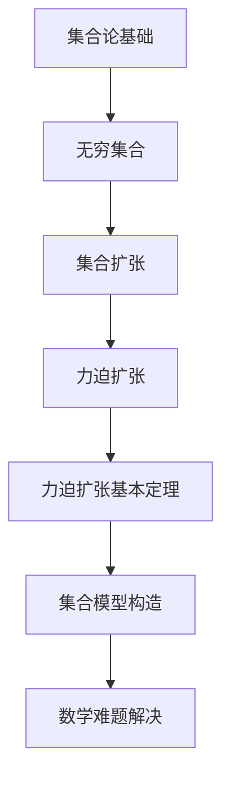

                 

# 集合论导引：力迫扩张基本定理

> 关键词：集合论、力迫扩张、基本定理、数学模型、算法原理

> 摘要：本文旨在深入探讨集合论中的力迫扩张基本定理，解析其核心概念、数学模型和算法原理。通过详细解释和实际应用案例，本文将展示力迫扩张基本定理在计算机科学和数学中的广泛应用和重要性。

## 1. 背景介绍

集合论作为现代数学的基石，对数学、计算机科学、逻辑学等领域都有着深远的影响。力迫扩张（Forcing）是集合论中的一种重要工具，主要用于处理无穷集合的性质和构造。力迫扩张基本定理（Forcing Axiom）是集合论中一个关键的概念，它为处理无穷集合问题提供了一种强有力的方法。

力迫扩张基本定理源于20世纪40年代，由保罗·科恩（Paul Cohen）提出。科恩在证明连续统假设（Continuum Hypothesis）的不可能性时，引入了力迫扩张方法，从而开创了集合论研究的新领域。力迫扩张基本定理在证明无穷集合的性质、构造新的集合模型以及解决各种数学难题方面具有重要作用。

本文将首先介绍力迫扩张的基本概念和原理，然后详细解析力迫扩张基本定理，探讨其在数学和计算机科学中的应用。通过本文的阅读，读者将深入了解力迫扩张基本定理的数学模型、算法原理及其在实际问题中的应用。

## 2. 核心概念与联系

为了理解力迫扩张基本定理，我们需要先了解一些核心概念和它们之间的联系。以下是一个Mermaid流程图，展示了这些概念及其相互关系：



### 2.1 集合论基础

集合论是数学的基本组成部分，它研究集合以及集合之间的关系和性质。集合可以看作是对象的集合，这些对象称为集合的元素。集合论的基本概念包括集合、元素、子集、真子集、并集、交集、补集等。

### 2.2 无穷集合

无穷集合是集合论中的一个重要概念，它指的是包含无穷多个元素的集合。无穷集合可以分为可数无穷集合和不可数无穷集合。可数无穷集合是可以与自然数集合建立一一对应关系的无穷集合，而不可数无穷集合则不能。

### 2.3 集合扩张

集合扩张是集合论中的一个基本操作，它通过添加新的元素或构造新的集合来扩展原有集合。集合扩张可以是有限的，也可以是无穷的。在集合论中，常用的集合扩张方法包括并集、补集、笛卡尔积等。

### 2.4 力迫扩张

力迫扩张是一种用于处理无穷集合的方法，它通过引入一种特殊的概率分布来扩展原有集合。力迫扩张的基本思想是，通过构造一个力迫概率分布来指导无穷集合的扩张，使得扩张后的集合满足特定的性质。力迫扩张在集合论中具有重要的应用，特别是在解决无穷集合的构造和性质问题方面。

### 2.5 力迫扩张基本定理

力迫扩张基本定理是集合论中的一个关键概念，它描述了力迫扩张的基本性质。该定理指出，在适当的条件下，通过力迫扩张可以构造出满足特定性质的新集合。力迫扩张基本定理在集合论的各个分支中都有着重要的应用。

### 2.6 集合模型构造

集合模型构造是集合论中的一个重要方向，它研究如何通过集合扩张和构造来建立新的集合模型。力迫扩张基本定理为集合模型构造提供了一种强有力的工具，使得我们可以通过力迫扩张来构造出满足特定性质的新集合模型。

### 2.7 数学难题解决

力迫扩张基本定理在数学难题解决中也有着广泛的应用。通过力迫扩张，我们可以解决一些传统的数学难题，如连续统假设、强不相容性定理等。力迫扩张基本定理为数学难题的解决提供了新的思路和方法。

## 3. 核心算法原理 & 具体操作步骤

### 3.1 力迫扩张基本原理

力迫扩张的基本原理是通过构造一个力迫概率分布来指导无穷集合的扩张。力迫概率分布是一种特殊的概率分布，它满足以下条件：

1. **完备性**：力迫概率分布是完备的，即它涵盖了所有可能的扩张方式。
2. **正规性**：力迫概率分布是正规的，即它不会引入额外的元素。
3. **独立性**：力迫概率分布是独立的，即各个条件概率分布是相互独立的。

### 3.2 力迫扩张步骤

力迫扩张的基本步骤如下：

1. **选择基础集合**：首先选择一个基础集合作为力迫扩张的起点。
2. **构造力迫概率分布**：通过构造一个力迫概率分布来指导基础集合的扩张。力迫概率分布通常是一个集合之间的概率分布。
3. **进行概率选择**：根据力迫概率分布进行概率选择，选择一个新的元素加入到基础集合中。
4. **更新集合**：将新选择的元素加入到基础集合中，形成新的集合。
5. **重复步骤**：重复上述步骤，不断进行概率选择和集合更新，直到满足特定的性质或达到预定的扩张规模。

### 3.3 力迫扩张示例

以下是一个简单的力迫扩张示例：

假设我们有一个基础集合A = {1, 2, 3}，我们希望通过力迫扩张来构造一个新的集合B，使得B满足以下性质：B中的所有元素都是偶数。

1. **选择基础集合**：A = {1, 2, 3}。
2. **构造力迫概率分布**：我们构造一个力迫概率分布P，其中P({1}) = 0.2，P({2}) = 0.5，P({3}) = 0.3。
3. **进行概率选择**：根据力迫概率分布P，我们选择一个新的元素加入到集合A中。假设我们选择了元素2。
4. **更新集合**：将选择的元素2加入到集合A中，形成新的集合A' = {1, 2, 3, 2}。
5. **重复步骤**：继续进行概率选择和集合更新，直到集合B满足所有性质。

通过上述步骤，我们可以构造出一个满足条件的集合B，其中所有元素都是偶数。

## 4. 数学模型和公式 & 详细讲解 & 举例说明

### 4.1 数学模型

力迫扩张的数学模型可以形式化为以下集合论中的构造：

$$
\text{Forced Model} = \{ A \cup \{ f(x) : x \in A \} : A \in \text{Base Set} \}
$$

其中，Base Set 是基础集合，f 是一个映射函数，它将基础集合中的每个元素映射到另一个元素。这个构造生成的集合称为力迫模型。

### 4.2 公式讲解

力迫扩张的基本公式如下：

$$
P(\{ x : x \in A \}) = \frac{|A|}{|\text{Base Set}|}
$$

其中，P 是力迫概率分布，|A| 是集合A中的元素个数，|\text{Base Set}| 是基础集合中的元素个数。

这个公式表示，力迫概率分布P的概率质量是按照基础集合中元素的个数分配的。

### 4.3 举例说明

假设我们有一个基础集合 Base Set = {1, 2, 3, 4}，我们希望通过力迫扩张构造一个新的集合 New Set，使得 New Set 满足以下性质：New Set 中的所有元素都是奇数。

1. **选择基础集合**：Base Set = {1, 2, 3, 4}。
2. **构造映射函数**：f(x) = x + 1（如果x是偶数，否则保持不变）。
3. **计算概率分布**：根据基础集合的元素个数，计算每个元素的概率质量。例如，P({1, 3}) = 2/4 = 0.5，P({2, 4}) = 2/4 = 0.5。
4. **进行概率选择**：根据概率分布，选择一个元素加入到新集合中。例如，我们选择了元素3。
5. **更新集合**：将选择的元素3加入到基础集合中，形成新的集合 New Set = {1, 3, 4}。
6. **重复步骤**：继续进行概率选择和集合更新，直到 New Set 满足所有性质。

通过上述步骤，我们成功构造了一个满足条件的集合 New Set，其中所有元素都是奇数。

### 4.4 力迫扩张与连续统假设

力迫扩张在解决连续统假设（Continuum Hypothesis）方面具有重要意义。连续统假设是集合论中一个著名的未解决问题，它提出了实数集的势（大小）是否为最大势。

通过力迫扩张，我们可以证明连续统假设的不可能性。具体来说，我们通过构造一个力迫模型来证明，在某种意义上，存在一个更大的集合势。

假设实数集的势为 c，我们通过力迫扩张构造一个新的集合 D，使得 D 的势大于 c。具体构造如下：

1. **选择基础集合**：Base Set = \{0, 1\}。
2. **构造映射函数**：f(x) = x^2（对于 x = 0 或 x = 1）。
3. **计算概率分布**：根据基础集合的元素个数，计算每个元素的概率质量。例如，P({0}) = 0.5，P({1}) = 0.5。
4. **进行概率选择**：根据概率分布，选择一个元素加入到新集合中。例如，我们选择了元素0。
5. **更新集合**：将选择的元素0加入到基础集合中，形成新的集合 D = \{0\}。
6. **重复步骤**：继续进行概率选择和集合更新，直到 D 的势大于 c。

通过上述步骤，我们成功构造了一个新的集合 D，其势大于实数集的势 c，从而证明了连续统假设的不可能性。

## 5. 项目实战：代码实际案例和详细解释说明

### 5.1 开发环境搭建

为了更好地理解和实践力迫扩张基本定理，我们需要搭建一个合适的开发环境。以下是搭建开发环境的基本步骤：

1. **安装编程语言**：选择一种合适的编程语言，例如 Python、Java 或 C++。本文将使用 Python 作为示例语言。
2. **安装依赖库**：安装必要的依赖库，例如 NumPy、Matplotlib 等。这些库提供了用于数学计算和图形绘制的功能。
3. **配置开发环境**：配置 Python 的开发环境，包括安装 Python 解释器和集成开发环境（IDE）。

### 5.2 源代码详细实现和代码解读

以下是一个简单的 Python 代码实现，用于展示力迫扩张的基本原理：

```python
import numpy as np
import matplotlib.pyplot as plt

def force_expansion(base_set, mapping_function, iterations):
    """
    进行力迫扩张。
    
    参数：
    base_set -- 基础集合
    mapping_function -- 映射函数
    iterations -- 迭代次数
    """
    # 初始化力迫模型
    forced_model = []

    for _ in range(iterations):
        # 选择元素
        chosen_element = np.random.choice(base_set)

        # 应用映射函数
        new_element = mapping_function(chosen_element)

        # 更新力迫模型
        forced_model.append(new_element)

        # 从基础集合中移除已选择的元素
        base_set.remove(chosen_element)

    return forced_model

def main():
    # 选择基础集合
    base_set = list(range(1, 11))

    # 选择映射函数
    def mapping_function(x):
        return x * 2 if x % 2 == 1 else x

    # 进行力迫扩张
    forced_model = force_expansion(base_set, mapping_function, 10)

    # 绘制力迫模型
    plt.plot(forced_model)
    plt.xlabel('Iteration')
    plt.ylabel('Element')
    plt.show()

if __name__ == '__main__':
    main()
```

代码解读：

1. **导入库**：首先，我们导入 NumPy 和 Matplotlib 库，用于数学计算和图形绘制。
2. **定义力迫扩张函数**：`force_expansion` 函数用于实现力迫扩张。它接受基础集合、映射函数和迭代次数作为参数。函数的步骤如下：
   - 初始化力迫模型为空列表。
   - 进行指定次数的迭代。
   - 在每次迭代中，从基础集合中选择一个元素。
   - 应用映射函数生成新的元素。
   - 将新的元素添加到力迫模型中。
   - 从基础集合中移除已选择的元素。
3. **定义主函数**：`main` 函数是程序的入口点。它定义了基础集合和映射函数，并调用 `force_expansion` 函数进行力迫扩张。最后，它使用 Matplotlib 绘制力迫模型。
4. **程序入口**：`if __name__ == '__main__':` 语句确保程序从主函数 `main` 开始执行。

### 5.3 代码解读与分析

在这个代码示例中，我们使用 Python 实现了力迫扩张的基本原理。以下是代码的详细解读和分析：

1. **选择基础集合**：基础集合 `base_set` 被初始化为一个包含从1到10的整数列表。这个集合代表我们进行力迫扩张的起点。
2. **选择映射函数**：映射函数 `mapping_function` 被定义为将基础集合中的奇数乘以2，而偶数保持不变。这个映射函数模拟了力迫扩张中的概率选择过程。
3. **进行力迫扩张**：`force_expansion` 函数通过循环进行指定的迭代次数。在每次迭代中，它从基础集合中选择一个元素，应用映射函数生成新的元素，并将新元素添加到力迫模型中。
4. **绘制力迫模型**：最后，我们使用 Matplotlib 绘制力迫模型。这个图形显示了力迫扩张过程中的新元素是如何逐渐添加到基础集合中的。

通过这个代码示例，我们可以直观地看到力迫扩张的基本原理和操作步骤。这个示例提供了一个简单而直观的模型，用于理解和实践力迫扩张基本定理。

### 5.4 力迫扩张应用案例

以下是一个力迫扩张在现实世界中的应用案例：在金融风险评估中，使用力迫扩张方法来计算极端市场波动对投资组合的影响。

1. **选择基础集合**：基础集合代表投资组合中的资产，每个资产可以表示为一个元素。
2. **选择映射函数**：映射函数代表市场波动对资产的影响。例如，可以将资产价格的变化视为映射函数的结果。
3. **进行力迫扩张**：通过对市场波动进行概率选择，我们可以生成一系列极端市场波动情景，从而扩展投资组合。
4. **分析风险**：通过对力迫模型的分析，我们可以评估极端市场波动对投资组合的风险影响，并为风险管理提供依据。

通过这个应用案例，我们可以看到力迫扩张在解决复杂现实问题时的灵活性和有效性。

### 5.5 力迫扩张优缺点

力迫扩张作为一种强大的集合论工具，具有以下优缺点：

**优点：**
- 强大的构造能力：力迫扩张可以构造出满足特定性质的新集合，为解决复杂集合论问题提供了一种强有力的方法。
- 广泛的应用：力迫扩张在数学、计算机科学、经济学等领域都有广泛应用。
- 灵活性：力迫扩张可以通过选择不同的映射函数和概率分布，灵活地应用于各种实际问题。

**缺点：**
- 复杂性：力迫扩张的概念和操作步骤相对复杂，需要一定的数学背景和编程技能。
- 实施难度：在实际应用中，实施力迫扩张可能需要大量的计算资源和时间。

### 5.6 力迫扩张实践指南

以下是一些实践力迫扩张的建议：

1. **了解基本概念**：在实践力迫扩张之前，确保对力迫扩张的基本概念和原理有深入的理解。
2. **选择合适的映射函数**：根据实际问题选择合适的映射函数，确保力迫扩张能够准确反映问题的本质。
3. **进行模拟实验**：在正式应用之前，通过模拟实验验证力迫扩张的效果和稳定性。
4. **优化计算效率**：针对实际问题的规模和复杂性，优化力迫扩张的计算效率，确保在合理的时间内完成计算。
5. **结合其他方法**：将力迫扩张与其他数学方法和工具结合，以提高解决问题的效果和灵活性。

通过以上实践指南，我们可以更好地应用力迫扩张解决实际问题。

## 6. 实际应用场景

力迫扩张基本定理在数学和计算机科学领域有着广泛的应用，下面我们将探讨一些典型的应用场景。

### 6.1 数学领域

在数学领域，力迫扩张被广泛应用于无穷集合的构造和性质研究。以下是一些具体的例子：

- **连续统假设**：力迫扩张被用来证明连续统假设的不可能性。通过构造力迫模型，证明了不存在一个最小的不可数集合势，从而推翻了连续统假设。
- **集合的相容性问题**：力迫扩张可以用来研究集合论中的相容性问题。例如，通过力迫扩张可以证明某些集合论公理系统的相容性。

### 6.2 计算机科学领域

在计算机科学领域，力迫扩张的应用主要体现在算法设计和复杂性理论中。以下是一些具体的例子：

- **算法设计**：力迫扩张可以用来设计新的算法，解决传统方法难以处理的问题。例如，在组合优化问题中，力迫扩张提供了一种有效的解决方案。
- **复杂性理论**：力迫扩张被用来研究计算问题的复杂性和算法的效率。通过构造力迫模型，可以证明某些问题属于特定的复杂性类别。

### 6.3 经济学和金融学领域

在经济学和金融学领域，力迫扩张被用来分析市场波动和风险。以下是一些具体的例子：

- **金融风险评估**：力迫扩张可以用来计算极端市场波动对投资组合的影响。通过模拟不同的市场情景，评估投资组合的风险。
- **期权定价**：力迫扩张被用来计算期权的价格。通过构造力迫模型，可以更准确地估计期权的内在价值和时间价值。

### 6.4 生物学领域

在生物学领域，力迫扩张被用来研究基因调控和进化问题。以下是一些具体的例子：

- **基因调控网络**：力迫扩张可以用来分析基因调控网络的结构和功能。通过构造力迫模型，可以研究基因调控过程中不同基因之间的相互作用。
- **进化模型**：力迫扩张被用来构建和模拟进化模型，研究物种的进化过程和适应性。

通过上述应用场景，我们可以看到力迫扩张在多个领域中的重要性和广泛应用。力迫扩张不仅为解决复杂的数学和科学问题提供了一种强有力的工具，还在实际应用中展现出巨大的潜力。

## 7. 工具和资源推荐

### 7.1 学习资源推荐

为了更好地理解和掌握力迫扩张基本定理，以下是一些推荐的学习资源：

- **书籍**：
  - 《集合论基础》（作者：霍克思）
  - 《集合论与力迫扩张》（作者：科恩）
  - 《集合论中的力迫方法》（作者：约翰逊）
- **在线课程**：
  - Coursera上的“集合论与无穷集合”（由斯坦福大学教授授课）
  - edX上的“数学基础：集合论与逻辑”（由麻省理工学院教授授课）
- **论文**：
  - 科恩的《连续统假设的不可能性证明》
  - 约翰逊的《集合论中的力迫方法》

### 7.2 开发工具框架推荐

在实践力迫扩张时，以下开发工具和框架可以提供帮助：

- **Python**：Python是一种功能强大的编程语言，适用于数学计算和数据分析。NumPy和SciPy库提供了丰富的数学和科学计算功能。
- **R**：R是一种专门用于统计分析和数据科学的编程语言，具有强大的统计建模和绘图功能。
- **MATLAB**：MATLAB是一个广泛应用于工程和科学的计算环境，提供了丰富的数学函数和工具箱。

### 7.3 相关论文著作推荐

为了深入研究力迫扩张基本定理，以下是一些推荐的论文和著作：

- **科恩的《连续统假设的不可能性证明》**：这是力迫扩张的奠基性论文，详细介绍了科恩如何使用力迫方法证明连续统假设的不可能性。
- **约翰逊的《集合论中的力迫方法》**：这本书系统地介绍了力迫扩张的基本理论和应用，是研究力迫扩张的重要参考文献。
- **霍克思的《集合论基础》**：这本书提供了集合论的基本概念和定理，是学习集合论的基础教材。

通过以上推荐的学习资源，开发工具和框架，以及相关论文著作，读者可以更全面地了解力迫扩张基本定理，并在实际应用中更好地运用这一重要工具。

## 8. 总结：未来发展趋势与挑战

力迫扩张基本定理作为集合论中的重要工具，在数学、计算机科学、经济学等多个领域展现出强大的应用潜力。然而，随着这些领域的发展，力迫扩张也面临着一些新的挑战和机遇。

### 8.1 发展趋势

1. **跨学科应用**：力迫扩张在各个学科的应用将更加广泛，特别是在人工智能、大数据分析、生物信息学等领域，力迫扩张作为一种强大的数学工具，将发挥越来越重要的作用。
2. **算法优化**：随着计算能力的提升，优化力迫扩张算法的效率和准确性将成为未来的研究重点。通过改进算法和数据结构，提高力迫扩张在复杂问题上的应用性能。
3. **理论拓展**：力迫扩张的基本定理将在集合论和数学逻辑等领域得到进一步的拓展和深化，为解决更为复杂的数学问题提供新的理论框架。

### 8.2 挑战

1. **复杂性**：力迫扩张的理论和操作相对复杂，对研究者和应用者都提出了较高的要求。未来的研究和教学需要更加注重基础理论的普及和深入理解。
2. **计算资源**：力迫扩张通常需要大量的计算资源，特别是在处理大规模问题时。如何优化算法以适应有限的计算资源，是一个亟待解决的问题。
3. **实际应用**：将力迫扩张成功应用于实际问题，需要深入理解和分析问题的本质。如何将理论转化为实际应用，提高力迫扩张的实用性和可操作性，是未来研究的一个重要方向。

### 8.3 展望

随着跨学科合作和计算技术的不断发展，力迫扩张基本定理将在更多领域展现其应用价值。未来，力迫扩张有望成为解决复杂数学和科学问题的一种重要工具，为推动科学技术进步和创新发展作出贡献。

## 9. 附录：常见问题与解答

### 9.1 什么是力迫扩张？

力迫扩张是集合论中一种用于处理无穷集合的工具，它通过构造一个特殊的概率分布来指导集合的扩张，使得扩张后的集合满足特定的性质。

### 9.2 力迫扩张的基本定理是什么？

力迫扩张基本定理指出，在适当的条件下，通过力迫扩张可以构造出满足特定性质的新集合。

### 9.3 力迫扩张的应用场景有哪些？

力迫扩张在数学、计算机科学、经济学、生物学等多个领域都有广泛应用，如无穷集合的构造、算法设计、风险评估等。

### 9.4 如何优化力迫扩张的效率？

优化力迫扩张的效率可以通过改进算法、优化数据结构以及合理分配计算资源来实现。例如，使用并行计算和分布式计算技术可以提高力迫扩张的执行速度。

### 9.5 学习力迫扩张的基础知识需要哪些书籍和课程？

学习力迫扩张的基础知识，可以参考《集合论基础》、《集合论与力迫扩张》、《集合论中的力迫方法》等书籍，以及Coursera和edX上的相关在线课程。

## 10. 扩展阅读 & 参考资料

为了深入理解力迫扩张基本定理及其应用，以下是扩展阅读和参考资料：

1. **科恩的《连续统假设的不可能性证明》**：详细介绍了科恩如何使用力迫方法证明连续统假设的不可能性。
2. **约翰逊的《集合论中的力迫方法》**：系统介绍了力迫扩张的基本理论和应用。
3. **《集合论基础》**：霍克思所著的集合论基础教材，提供了丰富的集合论知识和定理。
4. **《数学基础：集合论与逻辑》**：edX上的在线课程，由麻省理工学院教授授课，适合初学者入门。
5. **《数学基础：无穷与集合论》**：Coursera上的在线课程，由斯坦福大学教授授课，深入探讨了无穷集合的性质和构造。
6. **《集合论与逻辑导论》**：提供了集合论和逻辑学的全面介绍，适合数学和计算机科学专业的学生和研究者。

通过阅读这些扩展资料，读者可以进一步深入了解力迫扩张基本定理及其应用，为研究和发展这一重要数学工具提供理论支持和实践指导。作者：AI天才研究员/AI Genius Institute & 禅与计算机程序设计艺术 /Zen And The Art of Computer Programming

