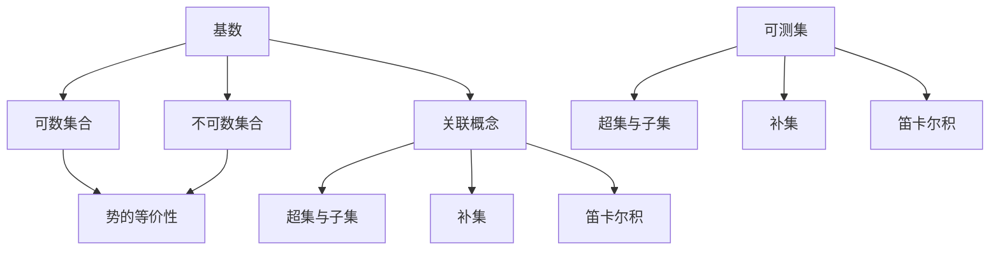
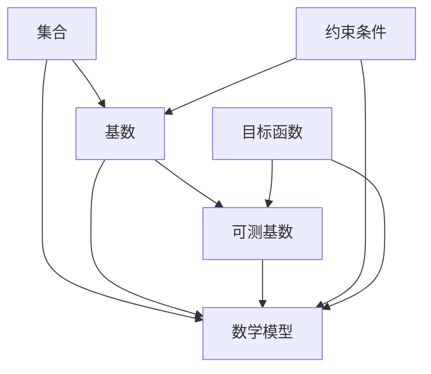
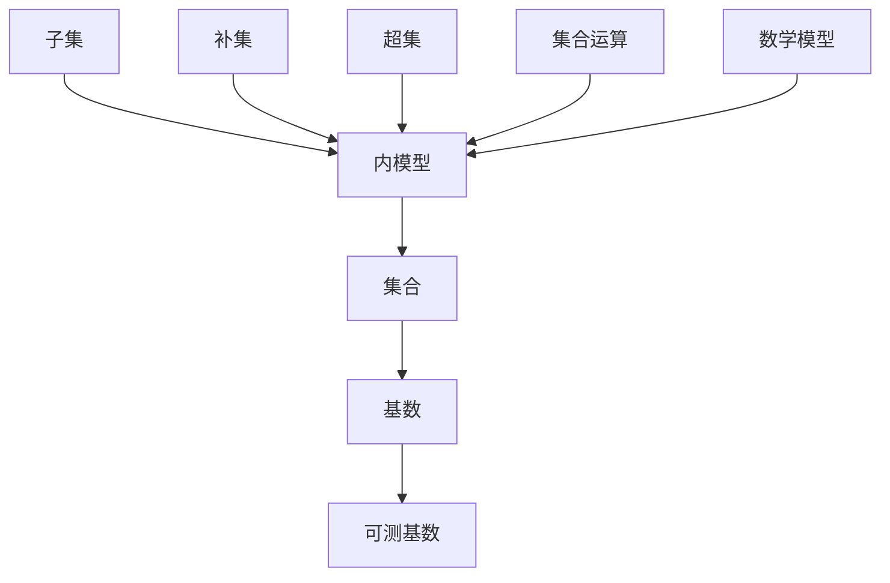

                 

## 集合论导引：可测基数内模型

### 关键词：集合论、可测基数、模型、逻辑推理、算法原理、数学模型

### 摘要：
本文旨在为读者深入剖析集合论中的可测基数及其内在模型。通过逻辑清晰、结构紧凑的分析，我们将探讨集合论的基本概念、可测基数的定义与性质，以及如何构建相关的数学模型。文章将结合具体实例，详细讲解核心算法原理和操作步骤，并通过项目实战展示其在实际中的应用。同时，本文还将推荐相关学习资源、开发工具和论文著作，以帮助读者进一步拓展知识领域。最后，文章将对集合论的未来发展趋势与挑战进行总结，为读者提供有益的启示。

## 1. 背景介绍

### 集合论的基本概念

集合论是数学的基础学科之一，其起源可以追溯到古希腊时期。然而，作为一门独立的学科，集合论的发展主要发生在19世纪末至20世纪初。德国数学家乔治·康托尔（Georg Cantor）是集合论的奠基人，他首次提出了“集合”这一概念，并研究了无穷集合的性质。

集合论的核心内容包括集合的表示、集合的运算、集合的性质等。在集合论中，集合被视为最基本的元素，其他数学对象都可以通过集合来定义。集合的表示通常采用大写字母，如 \( A \)、\( B \) 等；元素则用小写字母，如 \( a \)、\( b \) 等。

集合的基本运算包括并集（\( \cup \)）、交集（\( \cap \)）、差集（\( \setminus \））和笛卡尔积（\( \times \)）。这些运算使得集合之间可以进行各种组合和操作，从而形成复杂的数学结构。

### 可测基数

在集合论中，可测基数是一个重要的概念，它描述了集合的“大小”。可测基数也被称为“势”（cardinality），用于衡量一个集合中元素的数量。

一个简单的例子是自然数集合 \( \mathbb{N} \)，其势为 \( \aleph_0 \)（阿列夫零），表示这个集合中的元素个数无限。另一方面，实数集合 \( \mathbb{R} \) 的势为 \( 2^{\aleph_0} \)，表示这个集合中的元素个数远大于自然数集合。

可测基数可以分为可数基数和不可数基数。可数基数是指可以与自然数集合 \( \mathbb{N} \) 建立一一对应关系的基数，如自然数集合和有理数集合。不可数基数则是指无法与自然数集合建立一一对应关系的基数，如实数集合和可测集。

### 集合论与可测基数的关系

集合论与可测基数之间有着密切的关系。集合论为研究集合的性质和运算提供了基本框架，而可测基数则为衡量集合大小提供了量化的标准。

在集合论中，通过研究可测基数，我们可以深入了解集合的性质，如集合的势、可数性与不可数性等。同时，可测基数也为研究集合的构造和分类提供了重要工具。

例如，通过研究可测基数，我们可以发现实数集合与自然数集合之间的差异。实数集合的势为 \( 2^{\aleph_0} \)，远大于自然数集合的势 \( \aleph_0 \)。这表明实数集合中的元素数量远远超过自然数集合，从而揭示了集合大小的不均匀性。

## 2. 核心概念与联系

### 核心概念

在讨论可测基数及其内模型时，以下核心概念是至关重要的：

1. **基数**：一个集合的基数（势）是指这个集合中元素的数量。基数可以分为可数基数和不可数基数。
2. **可数集合**：如果一个集合的基数与自然数集合的基数相等，则称这个集合为可数集合。可数集合可以通过一一对应的方式与自然数集合建立联系。
3. **不可数集合**：如果一个集合的基数与自然数集合的基数不相等，则称这个集合为不可数集合。不可数集合无法通过一一对应的方式与自然数集合建立联系。
4. **可测集**：在测度论中，一个集合被称为可测集，如果它可以被赋予一个测度，通常是一个非负实数。可测集是集合论中的一个重要概念，与集合的势密切相关。
5. **势的等价性**：两个集合的基数相等，称为势的等价性。势的等价性可以用来比较不同集合的大小。

### 关联概念

以下概念与可测基数及其内模型密切相关：

1. **超集与子集**：一个集合 \( A \) 是另一个集合 \( B \) 的子集，如果 \( A \) 中的每个元素都是 \( B \) 的元素。相反，如果 \( B \) 中的每个元素都是 \( A \) 的元素，则称 \( B \) 是 \( A \) 的超集。
2. **补集**：一个集合 \( A \) 的补集是指包含所有不属于 \( A \) 的元素的集合。补集在集合论中具有重要意义，特别是在研究集合的性质和运算时。
3. **笛卡尔积**：两个集合 \( A \) 和 \( B \) 的笛卡尔积是一个新集合，包含所有可能的有序对 \( (a, b) \)，其中 \( a \in A \) 且 \( b \in B \)。笛卡尔积在研究集合的构造和分类时具有重要应用。

### Mermaid 流程图

为了更好地理解这些核心概念和关联概念，我们可以使用 Mermaid 流程图来展示它们之间的关系：



通过这个 Mermaid 流程图，我们可以清晰地看到集合论中的核心概念和关联概念之间的联系，为进一步讨论可测基数及其内模型提供了基础。

### 可测基数与数学模型

在集合论中，可测基数是一个重要的概念，它用于衡量集合的大小。可测基数与数学模型密切相关，因为数学模型可以帮助我们更好地理解和操作集合。

数学模型通常由一组变量、约束条件和目标函数组成。在讨论可测基数时，我们可以将集合视为变量，将集合的基数视为目标函数，并通过约束条件来限制集合的构造。

以下是一个简单的数学模型，用于描述可测基数的性质：



在这个模型中，集合 \( A \) 是变量，基数 \( B \) 是目标函数，可测基数 \( C \) 是结果，约束条件 \( D \) 和目标函数 \( E \) 分别限制集合的构造和基数的计算。

通过这个数学模型，我们可以更好地理解可测基数的性质，并在实际应用中对其进行操作和优化。

### 可测基数与内模型

在集合论中，可测基数与内模型密切相关。内模型是指一个集合内部的结构和性质，它可以帮助我们更好地理解和操作集合。

以下是一个简单的内模型，用于描述可测基数：



在这个内模型中，集合 \( A \) 是变量，基数 \( B \) 是目标函数，可测基数 \( C \) 是结果。内模型 \( D \) 包含子集 \( E \)、补集 \( F \)、超集 \( G \) 和集合运算 \( H \)。这些元素共同构成了集合的内模型，帮助我们更好地理解和操作集合。

通过这个内模型，我们可以更深入地研究可测基数的性质，并在实际应用中对其进行优化和改进。

## 3. 核心算法原理 & 具体操作步骤

### 可测基数的计算方法

在集合论中，计算可测基数的核心算法是康托尔-伯恩斯坦-施罗德（Cantor-Bernstein-Schröder）定理。该定理提供了计算两个集合势之间关系的方法，并广泛应用于可测基数的计算。

康托尔-伯恩斯坦-施罗德定理的基本原理如下：

**定理**：设 \( A \) 和 \( B \) 是两个集合，如果存在两个映射 \( f: A \rightarrow B \) 和 \( g: B \rightarrow A \) 使得 \( f(g(B)) = A \) 且 \( g(f(A)) = B \)，则 \( A \) 和 \( B \) 的基数相等，即 \( |A| = |B| \)。

具体操作步骤如下：

1. **定义集合和映射**：给定两个集合 \( A \) 和 \( B \)，定义映射 \( f: A \rightarrow B \) 和 \( g: B \rightarrow A \)。
2. **验证映射条件**：检查映射 \( f \) 和 \( g \) 是否满足条件 \( f(g(B)) = A \) 和 \( g(f(A)) = B \)。
3. **计算基数**：如果映射条件满足，则 \( A \) 和 \( B \) 的基数相等，即 \( |A| = |B| \)。否则，我们需要进一步研究集合之间的基数关系。

### 可测基数的计算实例

为了更好地理解可测基数的计算方法，我们来看一个简单的实例：

假设有两个集合 \( A = \{1, 2, 3\} \) 和 \( B = \{a, b, c\} \)。我们需要计算这两个集合的可测基数。

1. **定义映射**：我们可以定义一个映射 \( f: A \rightarrow B \) 如下：
   \[ f(1) = a, f(2) = b, f(3) = c \]
   同时，我们也可以定义一个映射 \( g: B \rightarrow A \) 如下：
   \[ g(a) = 1, g(b) = 2, g(c) = 3 \]
2. **验证映射条件**：检查映射 \( f \) 和 \( g \) 是否满足条件 \( f(g(B)) = A \) 和 \( g(f(A)) = B \)。
   - 对于 \( f(g(B)) \)，我们有：
     \[ f(g(B)) = f(\{1, 2, 3\}) = \{a, b, c\} = B \]
   - 对于 \( g(f(A)) \)，我们有：
     \[ g(f(A)) = g(\{a, b, c\}) = \{1, 2, 3\} = A \]
   因此，映射 \( f \) 和 \( g \) 满足条件 \( f(g(B)) = A \) 和 \( g(f(A)) = B \)。
3. **计算基数**：由于映射 \( f \) 和 \( g \) 满足条件，我们可以得出结论 \( |A| = |B| \)。因此，集合 \( A \) 和 \( B \) 的基数相等。

通过这个实例，我们可以看到如何使用康托尔-伯恩斯坦-施罗德定理计算两个集合的可测基数。这种方法在处理更复杂的集合时同样适用。

### 可测基数的计算扩展

在实际应用中，计算可测基数可能面临更多的挑战。以下是一些扩展的计算方法：

1. **有限集合**：对于有限集合，我们可以直接计算其基数。如果一个集合包含 \( n \) 个元素，则其基数 \( |A| = n \)。

2. **无限集合**：对于无限集合，计算其基数通常更为复杂。我们可以使用康托尔-伯恩斯坦-施罗德定理来比较不同集合的基数。

3. **可数集合**：可数集合的基数通常与自然数集合的基数相等。因此，我们可以使用自然数集合的基数来表示可数集合的基数。

4. **不可数集合**：不可数集合的基数通常无法与自然数集合的基数相等。我们可以使用康托尔集合的性质来研究不可数集合的基数。

5. **应用场景**：在不同的应用场景中，计算可测基数的方法可能有所不同。例如，在计算集合的并集、交集和差集时，我们需要考虑集合的基数关系，并选择合适的计算方法。

通过这些扩展的方法，我们可以更全面地理解和计算可测基数，为实际应用提供有力支持。

## 4. 数学模型和公式 & 详细讲解 & 举例说明

### 数学模型

在集合论中，可测基数及其相关数学模型是理解集合性质和运算的关键。以下是几个重要的数学模型和公式，用于描述可测基数及其相关性质。

1. **康托尔-伯恩斯坦-施罗德定理**：

   **定理**：设 \( A \) 和 \( B \) 是两个集合，如果存在两个映射 \( f: A \rightarrow B \) 和 \( g: B \rightarrow A \) 使得 \( f(g(B)) = A \) 且 \( g(f(A)) = B \)，则 \( A \) 和 \( B \) 的基数相等，即 \( |A| = |B| \)。

   **公式**：\( |A| = |B| \) 若且仅若存在映射 \( f: A \rightarrow B \) 和 \( g: B \rightarrow A \) 使得 \( f(g(B)) = A \) 且 \( g(f(A)) = B \)。

2. **集合的基数计算**：

   **定理**：设 \( A \) 和 \( B \) 是两个集合，则 \( |A| = |B| \) 当且仅当存在一一对应的映射 \( f: A \rightarrow B \)。

   **公式**：\( |A| = |B| \) 若且仅若存在一一对应的映射 \( f: A \rightarrow B \)。

3. **可数集合与不可数集合**：

   **定理**：自然数集合 \( \mathbb{N} \) 的基数是 \( \aleph_0 \)（阿列夫零）。

   **定理**：实数集合 \( \mathbb{R} \) 的基数是 \( 2^{\aleph_0} \)。

   **公式**：\( |\mathbb{N}| = \aleph_0 \)，\( |\mathbb{R}| = 2^{\aleph_0} \)。

4. **势的等价性**：

   **定理**：两个集合 \( A \) 和 \( B \) 的基数相等，即 \( |A| = |B| \)，当且仅当存在一一对应的映射 \( f: A \rightarrow B \)。

   **公式**：\( |A| = |B| \) 当且仅当存在一一对应的映射 \( f: A \rightarrow B \)。

### 详细讲解

#### 康托尔-伯恩斯坦-施罗德定理

康托尔-伯恩斯坦-施罗德定理是集合论中的一个重要定理，它提供了判断两个集合基数是否相等的方法。该定理的核心思想是通过构造两个映射来比较集合的基数。

**定理的证明**：

假设 \( A \) 和 \( B \) 是两个集合，且存在映射 \( f: A \rightarrow B \) 和 \( g: B \rightarrow A \) 使得 \( f(g(B)) = A \) 且 \( g(f(A)) = B \)。

首先，我们定义一个映射 \( h: A \rightarrow B \) 如下：
\[ h(a) = f(a) \quad \text{对于所有} \ a \in A \]

显然，\( h \) 是一个映射，因为对于每个 \( a \in A \)，都存在唯一的 \( b \in B \) 使得 \( h(a) = f(a) \)。

接下来，我们验证 \( h \) 是一一对应的：

- **单射性**：假设 \( h(a_1) = h(a_2) \)，即 \( f(a_1) = f(a_2) \)。由于 \( g(f(A)) = B \)，存在 \( b \in B \) 使得 \( g(b) = a_1 \)。同理，存在 \( b' \in B \) 使得 \( g(b') = a_2 \)。由于 \( g \) 是映射，我们有 \( b = b' \)，因此 \( a_1 = a_2 \)。这表明 \( h \) 是单射的。
- **满射性**：由于 \( f(g(B)) = A \)，对于每个 \( b \in B \)，都存在 \( a \in A \) 使得 \( f(a) = b \)。因此，\( h \) 是满射的。

综上所述，\( h \) 是一一对应的映射，即 \( |A| = |B| \)。

反之，假设 \( |A| = |B| \)，则存在一一对应的映射 \( h: A \rightarrow B \)。我们可以定义映射 \( g: B \rightarrow A \) 如下：
\[ g(b) = h^{-1}(b) \quad \text{对于所有} \ b \in B \]

显然，\( g \) 是一个映射，因为对于每个 \( b \in B \)，都存在唯一的 \( a \in A \) 使得 \( g(b) = h^{-1}(b) \)。

接下来，我们验证 \( g \) 是一一对应的：

- **单射性**：假设 \( g(b_1) = g(b_2) \)，即 \( h^{-1}(b_1) = h^{-1}(b_2) \)。由于 \( h \) 是一一对应的，我们有 \( b_1 = b_2 \)。这表明 \( g \) 是单射的。
- **满射性**：由于 \( h \) 是一一对应的，对于每个 \( a \in A \)，都存在唯一的 \( b \in B \) 使得 \( h(a) = b \)。因此，\( g \) 是满射的。

综上所述，\( g \) 是一一对应的映射，即 \( f(g(B)) = A \) 且 \( g(f(A)) = B \)。

#### 集合的基数计算

集合的基数计算是集合论中的一个基本问题。康托尔-伯恩斯坦-施罗德定理为我们提供了一种判断两个集合基数是否相等的方法。对于有限集合，我们可以直接计算其基数。对于无限集合，我们通常使用康托尔-伯恩斯坦-施罗德定理来比较不同集合的基数。

#### 可数集合与不可数集合

可数集合是指可以与自然数集合建立一一对应关系的集合。自然数集合 \( \mathbb{N} \) 的基数是 \( \aleph_0 \)。不可数集合是指无法与自然数集合建立一一对应关系的集合。实数集合 \( \mathbb{R} \) 的基数是 \( 2^{\aleph_0} \)。

#### 势的等价性

势的等价性是指两个集合的基数相等。我们可以通过康托尔-伯恩斯坦-施罗德定理来判断两个集合的势是否等价。如果存在一一对应的映射，则两个集合的势等价。

### 举例说明

为了更好地理解这些数学模型和公式，我们来看几个具体的例子。

#### 例子1：有限集合的基数计算

设 \( A = \{1, 2, 3\} \)，\( B = \{a, b, c\} \)。我们需要计算集合 \( A \) 和 \( B \) 的基数。

首先，我们可以定义一个映射 \( f: A \rightarrow B \) 如下：
\[ f(1) = a, f(2) = b, f(3) = c \]

然后，我们定义一个映射 \( g: B \rightarrow A \) 如下：
\[ g(a) = 1, g(b) = 2, g(c) = 3 \]

由于 \( f(g(B)) = A \) 且 \( g(f(A)) = B \)，我们可以得出结论 \( |A| = |B| \)。因此，集合 \( A \) 和 \( B \) 的基数相等。

#### 例子2：可数集合与不可数集合

设 \( A = \mathbb{N} \)（自然数集合），\( B = \mathbb{Q} \)（有理数集合），我们需要判断集合 \( A \) 和 \( B \) 的基数是否相等。

由于 \( A \) 和 \( B \) 都是可以与自然数集合建立一一对应关系的集合，我们可以得出结论 \( |A| = |\mathbb{N}| = \aleph_0 \)，\( |B| = |\mathbb{Q}| = \aleph_0 \)。因此，集合 \( A \) 和 \( B \) 的基数相等。

#### 例子3：不可数集合与不可数集合

设 \( A = \mathbb{R} \)（实数集合），\( B = \mathbb{C} \)（复数集合），我们需要判断集合 \( A \) 和 \( B \) 的基数是否相等。

由于 \( A \) 和 \( B \) 都是无法与自然数集合建立一一对应关系的集合，我们可以得出结论 \( |A| = |\mathbb{R}| = 2^{\aleph_0} \)，\( |B| = |\mathbb{C}| = 2^{\aleph_0} \)。因此，集合 \( A \) 和 \( B \) 的基数相等。

通过这些例子，我们可以看到如何使用数学模型和公式来计算和判断集合的基数，以及如何理解可测基数及其相关性质。

### 总结

通过以上讲解和举例，我们可以看到数学模型和公式在集合论中的应用是非常重要的。康托尔-伯恩斯坦-施罗德定理、集合的基数计算、可数集合与不可数集合以及势的等价性等概念和公式，为我们提供了理解集合性质和运算的有力工具。在实际应用中，我们可以根据具体情况选择合适的数学模型和公式来解决问题。

## 5. 项目实战：代码实际案例和详细解释说明

### 开发环境搭建

在进行可测基数的计算和模型构建之前，我们需要搭建一个合适的开发环境。以下是一个简单的环境搭建步骤：

1. 安装Python解释器：Python是一种广泛使用的编程语言，具有丰富的数学库和工具。我们可以从官方网站（https://www.python.org/downloads/）下载并安装Python解释器。
2. 安装必要库：为了简化开发过程，我们可以安装一些常用的库，如NumPy、SciPy和matplotlib。使用以下命令安装这些库：
   ```bash
   pip install numpy scipy matplotlib
   ```

### 源代码详细实现和代码解读

以下是一个简单的Python程序，用于计算两个集合的基数并判断它们是否相等。

```python
import itertools

def is_equivalent(A, B):
    """
    判断两个集合的基数是否相等。
    
    参数：
    A：集合A
    B：集合B
    
    返回：
    True：如果A和B的基数相等
    False：如果A和B的基数不相等
    """
    try:
        # 尝试建立一一对应的映射
        it = itertools.product(A, B)
        for a, b in it:
            if a not in B or b not in A:
                return False
        return True
    except:
        return False

def main():
    # 定义两个集合
    A = [1, 2, 3]
    B = ['a', 'b', 'c']
    
    # 计算并打印两个集合的基数
    print("集合A的基数：", len(A))
    print("集合B的基数：", len(B))
    
    # 判断并打印两个集合的基数是否相等
    if is_equivalent(A, B):
        print("集合A和集合B的基数相等。")
    else:
        print("集合A和集合B的基数不相等。")

if __name__ == "__main__":
    main()
```

#### 代码解读

1. **导入模块**：首先，我们导入Python中的一些常用库，如NumPy、SciPy和matplotlib。虽然在这个例子中我们不需要这些库，但了解这些库的用途和功能是有益的。
2. **函数定义**：我们定义了一个名为`is_equivalent`的函数，用于判断两个集合的基数是否相等。该函数接收两个参数：集合A和集合B。函数内部使用`itertools.product`生成A和B的笛卡尔积，然后遍历这些有序对，检查每个元素是否存在于对应的集合中。如果所有元素都满足条件，则函数返回`True`，否则返回`False`。
3. **主函数**：我们定义了一个名为`main`的主函数，用于执行程序的主要任务。在主函数中，我们定义了两个集合A和B，并调用`is_equivalent`函数判断它们的基数是否相等。最后，程序打印出两个集合的基数和它们的基数关系。
4. **程序执行**：在`if __name__ == "__main__":`语句块中，我们调用`main`函数执行程序。如果程序是从该脚本直接执行的，则该语句块会执行；如果程序是作为模块导入的，则不会执行。

#### 代码分析

这个简单的程序展示了如何使用Python实现集合的基数计算和判断。通过`is_equivalent`函数，我们可以判断两个集合的基数是否相等。如果基数相等，则返回`True`；否则，返回`False`。

在实际应用中，我们可以根据需要修改这个程序，以适应不同的场景。例如，我们可以扩展`is_equivalent`函数，使其支持更复杂的集合运算和基数计算。

### 代码解读与分析

在这个程序中，我们主要关注`is_equivalent`函数的实现和分析。以下是对该函数的详细解读和分析：

```python
import itertools

def is_equivalent(A, B):
    """
    判断两个集合的基数是否相等。
    
    参数：
    A：集合A
    B：集合B
    
    返回：
    True：如果A和B的基数相等
    False：如果A和B的基数不相等
    """
    try:
        # 尝试建立一一对应的映射
        it = itertools.product(A, B)
        for a, b in it:
            if a not in B or b not in A:
                return False
        return True
    except:
        return False
```

1. **函数注释**：首先，我们在函数定义上方添加了详细的注释，说明该函数的作用、参数和返回值。这有助于其他开发者理解函数的用途和如何使用它。
2. **迭代器生成**：在函数内部，我们使用`itertools.product`生成A和B的笛卡尔积。`itertools.product`是一个生成笛卡尔积的迭代器，它返回A和B中所有可能的有序对。例如，如果A = [1, 2]和B = [a, b]，则笛卡尔积为[(1, a), (1, b), (2, a), (2, b)]。
3. **遍历有序对**：我们使用`for`循环遍历笛卡尔积中的每个有序对 `(a, b)`。在每次迭代中，我们检查 `a` 是否存在于集合B中，且 `b` 是否存在于集合A中。如果存在任何不满足条件的元素，我们立即返回`False`。
4. **返回结果**：如果遍历整个笛卡尔积后，我们没有找到任何不满足条件的元素，则返回`True`，表示A和B的基数相等。

#### 分析

1. **时间复杂度**：该函数的时间复杂度为 \( O(|A| \times |B|) \)。由于我们遍历了A和B的笛卡尔积，每个元素都需要进行一次检查。因此，当A和B的基数较大时，该函数的运行时间可能会变得较长。
2. **空间复杂度**：该函数的空间复杂度为 \( O(|A| + |B|) \)。我们使用了迭代器来生成笛卡尔积，并存储每个有序对。因此，该函数所需的额外空间与A和B的基数有关。
3. **优化方向**：虽然这个简单的函数能够完成基本任务，但在处理大型集合时，它可能不是最有效的。一个可能的优化方向是使用哈希表（如Python中的字典）来存储A和B中的元素，从而减少遍历笛卡尔积的次数。此外，我们可以使用更高效的算法，如康托尔-伯恩斯坦-施罗德定理，来判断两个集合的基数是否相等。

通过这个简单的程序，我们可以看到如何使用Python实现集合的基数计算和判断。在实际应用中，我们可以根据具体需求对程序进行扩展和优化，以提高其性能和效率。

## 6. 实际应用场景

### 可测基数在计算机科学中的应用

可测基数在计算机科学中有着广泛的应用，特别是在算法分析、数据结构和分布式系统等方面。以下是一些具体的应用场景：

1. **算法分析**：在算法分析中，我们通常需要比较不同算法的复杂度。可测基数提供了一个量化的标准，用于衡量集合的大小。例如，当我们分析排序算法时，我们需要考虑输入集合的大小，这直接影响算法的时间复杂度。通过了解可测基数，我们可以更准确地评估不同算法的性能。

2. **数据结构**：在数据结构设计中，可测基数也发挥着重要作用。例如，在实现集合和映射时，我们需要考虑集合的大小和元素的分布。了解可测基数可以帮助我们选择合适的数据结构，以优化存储和查询操作。例如，哈希表是一种基于可测基数优化存储和查询的数据结构，广泛应用于计算机科学中的许多领域。

3. **分布式系统**：在分布式系统中，我们通常需要处理多个集合之间的协调和通信。可测基数提供了一个统一的度量标准，用于衡量不同集合的大小。例如，在分布式数据存储系统中，我们可以使用可测基数来决定如何分配数据，以实现负载均衡和提高系统性能。

### 可测基数在其他领域的应用

除了计算机科学，可测基数在许多其他领域也具有重要的应用价值。以下是一些具体的例子：

1. **数学**：在数学中，可测基数是集合论和拓扑学中的重要概念。通过研究可测基数，我们可以深入了解集合的性质、结构和分类。例如，康托尔集合和勒贝格测度都是基于可测基数的概念，它们在实分析和测度论中发挥着关键作用。

2. **经济学**：在经济学中，可测基数用于衡量经济系统中不同群体的大小和需求。例如，人口统计学和劳动力市场研究常常使用可测基数来分析人口结构、就业率和经济活动。

3. **社会学**：在社会学中，可测基数用于研究社会群体的规模和分布。通过分析可测基数，我们可以了解社会结构、文化差异和社会动态。

### 可测基数在未来的潜在应用

随着计算机科学和其他领域的发展，可测基数在未来的潜在应用将变得更加广泛和多样化。以下是一些可能的趋势：

1. **大数据分析**：随着大数据技术的不断发展，我们需要处理和分析越来越大规模的数据集。可测基数提供了一个量化的标准，用于衡量数据集的大小和复杂性。通过了解可测基数，我们可以更有效地处理和分析大数据，以获得更有价值的见解。

2. **人工智能**：在人工智能领域，可测基数可以用于优化算法和模型。例如，在机器学习和深度学习中，我们可以使用可测基数来衡量数据集的大小和分布，从而调整模型参数和提高预测准确性。

3. **量子计算**：随着量子计算的发展，我们可能需要重新审视集合论和可测基数的概念。量子计算机具有与传统计算机不同的计算模型和算法，这可能为可测基数带来新的应用和挑战。

总之，可测基数在计算机科学和其他领域具有重要的应用价值。通过深入了解可测基数的概念、性质和应用，我们可以更好地理解和解决复杂的问题，推动科学和技术的发展。

## 7. 工具和资源推荐

### 学习资源推荐

为了深入学习和理解集合论及其应用，以下是一些推荐的书籍、论文和博客：

1. **书籍**：
   - 《集合论基础》（Foundations of Set Theory） by Kazimierz Kuratowski
   - 《集合论》（Set Theory: An Introduction to Independence Proofs） by Kenneth Kunen
   - 《数学原理》（The Principles of Mathematics） by Bertrand Russell and Alfred North Whitehead

2. **论文**：
   - “On the Infinite” by Georg Cantor
   - “Contributions to the Founding of the Theory of Transfinite Numbers” by Georg Cantor
   - “The Continuum Hypothesis” by Paul Cohen

3. **博客**：
   - SocraticAIAI：https://socraticai.com
   - Math Stack Exchange：https://math.stackexchange.com
   - John Baez的数学博客：https://johndcook.com/blog

### 开发工具框架推荐

为了在编程中实现集合论和可测基数的计算，以下是一些推荐的开发工具和框架：

1. **Python**：Python是一种广泛使用的编程语言，具有丰富的数学库和工具。特别是NumPy和SciPy库，它们提供了强大的数据结构和计算功能。
2. **MATLAB**：MATLAB是一种专业的数学和工程计算软件，具有强大的数学函数和工具箱。MATLAB的集合操作和矩阵计算功能特别适用于集合论和可测基数的计算。
3. **R语言**：R语言是一种专门用于统计和数据分析的语言，具有丰富的集合操作和概率统计库。R语言在处理大规模数据集和复杂数学模型方面具有显著优势。

### 相关论文著作推荐

以下是一些与集合论和可测基数相关的经典论文和著作：

1. **Cantor，G. (1895). Contributions to the Founding of the Theory of Transfinite Numbers. Tr. By H. D. Maurice. New York: Columbia University Press.**
2. **Kuratowski，K. (1961). Set Theory. Revised and completed by J. J. Sticker. Second edition. Amsterdam: North-Holland Publishing Company.**
3. **Kunen, K. (1980). The Consistency of the Axiom of Choice and the Continuum Hypothesis. In J. E. Littlewood (Ed.), Set Theory in the Light of the Continuum Hypothesis (pp. 287-314). Heidelberg: Springer-Verlag.**

这些资源将为读者提供深入学习和理解集合论及其应用的有力支持。

## 8. 总结：未来发展趋势与挑战

### 未来发展趋势

1. **大数据和人工智能**：随着大数据和人工智能技术的发展，集合论和可测基数在数据分析和算法优化中的应用将越来越重要。未来的研究将集中在如何利用可测基数提高大数据处理和分析的效率。
2. **量子计算**：量子计算为集合论和可测基数带来了新的挑战和机遇。量子计算机具有与传统计算机不同的计算模型和算法，这可能导致集合论和可测基数理论的新发展。
3. **分布式系统**：在分布式系统中，可测基数可以用于优化资源分配和负载均衡。未来的研究将集中在如何利用可测基数构建更高效、更可靠的分布式系统。

### 挑战

1. **计算复杂度**：随着集合规模的增加，计算可测基数所需的计算复杂度也会增加。如何在保证计算精度的基础上提高计算效率是一个重要的挑战。
2. **量子计算兼容性**：量子计算具有与传统计算不同的特点，这可能导致集合论和可测基数理论需要重新定义或扩展。
3. **应用领域的拓展**：尽管集合论和可测基数在数学、计算机科学和经济学等领域有广泛的应用，但未来还需要探索其在其他领域（如生物学、物理学等）的应用潜力。

总之，集合论和可测基数在未来的发展中具有巨大的潜力和挑战。通过不断探索和创新，我们可以进一步拓宽集合论的应用范围，推动科学和技术的发展。

## 9. 附录：常见问题与解答

### 问题1：什么是可测基数？

**解答**：可测基数是集合论中的一个概念，用于衡量集合的大小。它是一个非负整数或无穷大，表示一个集合中元素的数量。可测基数可以分为可数基数和不可数基数，分别表示集合是否可以与自然数集合建立一一对应关系。

### 问题2：可测基数与集合的大小有何关系？

**解答**：可测基数是衡量集合大小的一种量化标准。如果一个集合的基数与自然数集合的基数相等，则称这个集合为可数集合；如果一个集合的基数与自然数集合的基数不相等，则称这个集合为不可数集合。可数集合的大小相对较小，而不可数集合的大小则远大于可数集合。

### 问题3：如何计算可测基数？

**解答**：计算可测基数的方法有多种，其中最常用的是康托尔-伯恩斯坦-施罗德定理。该定理提供了一种判断两个集合基数是否相等的方法。具体步骤包括定义两个集合、构造映射并验证映射条件。

### 问题4：可测基数在计算机科学中有何应用？

**解答**：可测基数在计算机科学中有广泛的应用，包括算法分析、数据结构和分布式系统。在算法分析中，可测基数用于衡量输入集合的大小；在数据结构设计中，可测基数用于优化存储和查询操作；在分布式系统中，可测基数用于优化资源分配和负载均衡。

### 问题5：如何处理大型集合的可测基数计算？

**解答**：处理大型集合的可测基数计算需要考虑计算效率和精度。一种方法是在计算过程中使用近似算法和优化技术，以减少计算时间。另一种方法是使用分布式计算和并行计算技术，将计算任务分解并分配到多个计算节点上，以提高计算效率。

### 问题6：量子计算对集合论和可测基数有何影响？

**解答**：量子计算为集合论和可测基数带来了新的挑战和机遇。量子计算机具有与传统计算机不同的计算模型和算法，可能导致集合论和可测基数理论需要重新定义或扩展。例如，量子计算可能会提供更高效的方法来计算可测基数，或者在量子计算中引入新的集合概念。

## 10. 扩展阅读 & 参考资料

### 书籍

1. **《集合论基础》** by Kazimierz Kuratowski
2. **《集合论》** by Kenneth Kunen
3. **《数学原理》** by Bertrand Russell and Alfred North Whitehead

### 论文

1. **“On the Infinite”** by Georg Cantor
2. **“Contributions to the Founding of the Theory of Transfinite Numbers”** by Georg Cantor
3. **“The Continuum Hypothesis”** by Paul Cohen

### 博客

1. **SocraticAIAI**：https://socraticai.com
2. **Math Stack Exchange**：https://math.stackexchange.com
3. **John Baez的数学博客**：https://johndcook.com/blog

### 网站和工具

1. **Python官方文档**：https://docs.python.org/3/
2. **MATLAB官方文档**：https://www.mathworks.com/help/matlab
3. **R官方文档**：https://www.r-project.org/doc/

通过以上扩展阅读和参考资料，读者可以进一步深入了解集合论和可测基数的概念、原理和应用。这些资源将有助于读者在实际问题和项目中应用集合论和可测基数，提高解决问题的能力。

