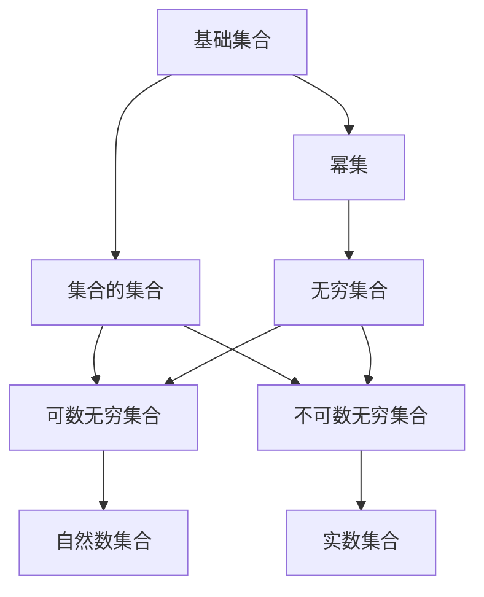

                 

### 集合论导引：大基数理论

> **关键词：集合论、大基数理论、无限集合、连续统假设、数学基础**
>
> **摘要：本文将深入探讨集合论中的大基数理论，解析无限集合的概念及其数学基础，包括连续统假设等重要内容，帮助读者构建扎实的数学理论基础，同时探讨其在现代数学和计算机科学中的实际应用。**

---

## 1. 背景介绍

集合论作为现代数学的基础理论，起源于19世纪末，由德国数学家乔治·康托尔（Georg Cantor）创立。集合论旨在研究集合的性质和关系，为数学的其他分支提供了坚实的逻辑基础。康托尔的工作彻底改变了数学的本质，他首次提出了无穷集合的概念，并探讨了无穷集合的大小。

大基数理论是集合论的一个核心分支，它研究的是“大”集合的性质。这些集合相对于可数集合（如自然数集合）来说，其“大小”是不可数的。大基数理论不仅具有理论意义，还广泛应用于多个数学领域，如数论、集合论、拓扑学和计算机科学。

本文将首先回顾集合论的基本概念，然后重点介绍大基数理论，包括连续统假设、无穷级数和集合论中的其他重要结果。我们将通过具体的例子和数学模型来展示这些理论的实际应用，并讨论其在现代数学和计算机科学中的重要性。

## 2. 核心概念与联系

### 2.1 集合与无穷集合

**集合（Set）**：集合是由确定对象组成的无序集。这些对象称为集合的元素。集合通常用大写字母表示，如\(A\)、\(B\)等。集合的表示方法为大括号括起来的一组元素，如：
$$A = \{1, 2, 3\}$$

**无穷集合（Infinite Set）**：无穷集合是指包含无穷多个元素的集合。康托尔的伟大贡献之一是证明了存在无穷多个不同大小的无穷集合。

- **可数无穷集合（Countably Infinite Set）**：如果一个集合可以与自然数集合\( \mathbb{N} \)建立一一对应关系，则该集合是可数的。自然数集合本身就是一个可数无穷集合。

- **不可数无穷集合（Uncountably Infinite Set）**：如果一个集合不能与自然数集合建立一一对应关系，则该集合是不可数的。例如，实数集合\( \mathbb{R} \)是一个不可数无穷集合。

### 2.2 康托尔定理与连续统假设

**康托尔定理（Cantor's Theorem）**：康托尔定理指出，对于任意集合\(X\)，其幂集（即所有子集的集合）的势（大小）总是大于\(X\)的势。形式化地，如果\( |X| \)表示集合\(X\)的势，则对于任意集合\(X\)，都有：
$$|P(X)| > |X|$$

- **连续统假设（Continuum Hypothesis, CH）**：连续统假设是一个关于实数集合\( \mathbb{R} \)势的问题。它声称不存在任何集合，其势介于可数无穷集合和实数集合之间。形式化地，连续统假设可以表述为：
  $$\neg \exists X \, (|X| > |\mathbb{N}| \wedge |X| < |\mathbb{R}|)$$

### 2.3 集合论的架构

集合论的基本架构通常包括以下层次：

1. **基础集合**：由基本对象组成的集合。
2. **幂集**：一个集合的所有子集构成的集合。
3. **集合的集合**：由多个集合构成的集合。
4. **无穷集合**：包括可数无穷集合和不可数无穷集合。

集合论的架构展示了集合的层次性和复杂性，这些概念为研究大基数理论提供了基础。

### 2.4 Mermaid 流程图

为了更好地理解集合论中的核心概念和关系，我们可以使用Mermaid流程图来展示它们。以下是一个示例：

在这个流程图中，我们展示了集合论中的几个关键概念及其相互关系。

---

通过上述内容，我们为读者构建了一个集合论和大基数理论的基本框架。在接下来的章节中，我们将深入探讨大基数理论的核心算法原理，详细讲解数学模型和公式，并展示实际应用案例。让我们继续深入这个充满挑战和机遇的数学领域。

