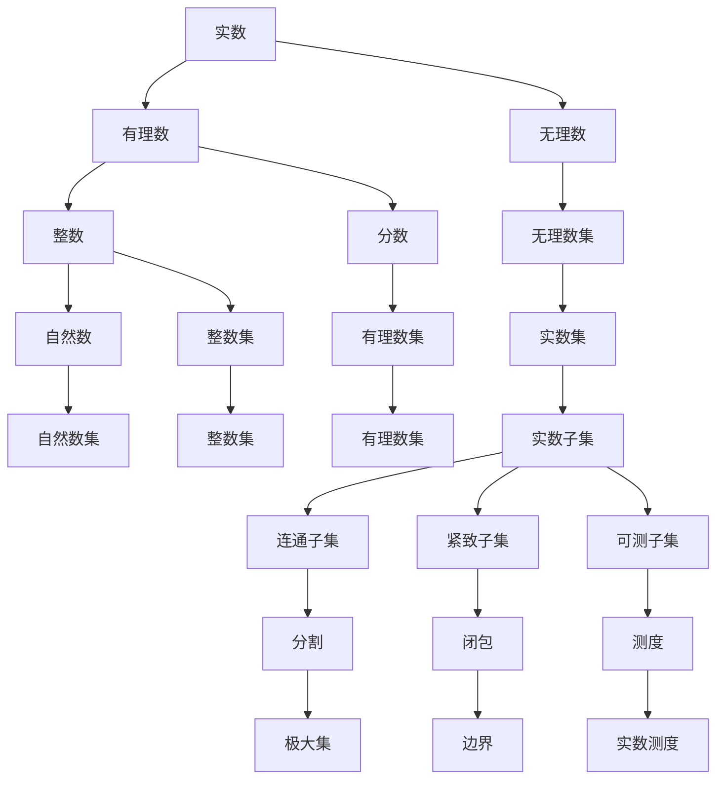

                 

### 背景介绍

集合论作为现代数学的基础，为数学的发展奠定了坚实的基础。其中，实数子集的正则性研究是集合论中的一个重要课题。它不仅对数学本身的进展具有重要意义，而且在计算机科学、经济学、物理学等多个领域都有广泛的应用。

实数子集正则性研究的起源可以追溯到19世纪末20世纪初。当时，数学家们开始关注实数的完备性质，试图找出实数集合的一些特殊子集的性质。随着数学分析、拓扑学和集合论等学科的不断发展，实数子集正则性问题逐渐成为一个独立的研究领域。

在计算机科学中，实数子集正则性研究有着重要的应用。例如，在算法设计中，为了确保算法的正确性和效率，常常需要分析输入数据的性质，其中就包括实数子集的正则性。此外，实数子集正则性研究还在计算机图形学、人工智能、数值分析等领域有着广泛的应用。

本文将系统地介绍实数子集正则性的研究背景、核心概念、算法原理、数学模型、实际应用场景、工具和资源推荐等内容。通过本文的阅读，读者将能够全面了解实数子集正则性研究的现状和未来发展趋势。

本文的结构如下：

1. **核心概念与联系**：介绍实数子集正则性的核心概念，并通过Mermaid流程图展示相关概念之间的联系。
2. **核心算法原理 & 具体操作步骤**：讲解实数子集正则性算法的基本原理，并给出具体的操作步骤。
3. **数学模型和公式 & 详细讲解 & 举例说明**：阐述实数子集正则性研究的数学模型和公式，并通过实例进行详细讲解。
4. **项目实战：代码实际案例和详细解释说明**：通过一个实际的项目案例，展示如何在实际中应用实数子集正则性算法。
5. **实际应用场景**：探讨实数子集正则性在不同领域的应用场景。
6. **工具和资源推荐**：推荐一些学习和研究实数子集正则性的工具和资源。
7. **总结：未来发展趋势与挑战**：总结实数子集正则性研究的现状，并展望未来的发展趋势和面临的挑战。
8. **附录：常见问题与解答**：回答读者可能遇到的一些常见问题。
9. **扩展阅读 & 参考资料**：提供一些相关的扩展阅读和参考资料。

通过本文的详细探讨，希望能够为读者提供一个全面、深入的实数子集正则性研究指南。

---

接下来，我们将进入下一章节，介绍实数子集正则性的核心概念和联系。这里将使用Mermaid流程图来展示相关概念之间的逻辑关系，帮助读者更好地理解。

---

## 2. 核心概念与联系

在探讨实数子集正则性之前，我们需要明确几个核心概念，这些概念是实数子集正则性研究的基础。

### 2.1 实数的概念

实数集合是数学中最基本的集合之一，它包括了有理数和无理数。实数的定义基于有序集合的性质，通过 Dedekind 切割或 Cauchy 序列等构造方法得到。实数的完备性是实数集合的一个重要性质，它保证了实数在许多数学操作下都具有良好的性质，如闭区间上的连续函数在实数上一定有界且有极限。

### 2.2 子集的概念

子集是集合论中的基本概念，表示一个集合的部分。如果一个集合的所有元素都属于另一个集合，那么这个集合被称为另一个集合的子集。实数子集是指所有元素都是实数的集合。

### 2.3 正则性的概念

正则性（Regularity）在数学中通常指的是某种结构或性质的一致性和可预测性。在实数子集正则性研究中，正则性通常指实数子集在某种结构或性质上的一致性。例如，一个实数子集可以是紧致的、可测的、有界的等。

### 2.4 连通性的概念

连通性是指一个集合是否可以通过连续变换（如路径连接）从一个点到达另一个点。在实数子集中，连通性是一个重要的性质，它决定了子集是否能被划分为更小的子集。

### 2.5 极大集的概念

极大集是指一个集合中没有其他集合可以成为其超集的集合。在实数子集的上下文中，极大集通常与实数的完备性质相关。

### 2.6 Mermaid 流程图展示

为了更好地理解这些概念之间的联系，我们可以通过Mermaid流程图来展示。以下是实数子集正则性相关概念之间的Mermaid流程图：



### 2.7 概念联系与实际意义

这些概念之间的联系构成了实数子集正则性研究的基础。例如，实数的完备性质保证了实数子集在连续函数下的极限存在性，这是许多数学和工程应用的基本前提。连通性和紧致性是分析实数子集性质的重要工具，它们在几何分析和数值分析中有着广泛的应用。极大集的概念则与实数的完备性质密切相关，在证明某些集合论定理时非常重要。

通过明确这些核心概念，我们能够更好地理解实数子集正则性的研究内容，并为后续的算法原理和实际应用打下坚实的基础。

---

在明确了实数子集正则性的核心概念后，接下来我们将探讨实数子集正则性算法的基本原理和具体操作步骤。这一章节将帮助读者理解如何在实际问题中应用这些概念，并掌握实数子集正则性的算法方法。

---

## 3. 核心算法原理 & 具体操作步骤

### 3.1 算法原理

实数子集正则性算法的核心在于对实数子集进行分类和判断。这些算法通常基于集合论、拓扑学和测度论等数学理论。核心原理可以概括为以下几个步骤：

1. **定义实数子集的性质**：首先，我们需要定义实数子集的几个关键性质，如连通性、紧致性、可测性和有界性。
2. **判断性质的一致性**：对于给定的实数子集，判断其是否满足上述性质，并检查这些性质是否一致。
3. **分类子集**：根据子集的性质，将其分类为不同类型的子集，如连通子集、紧致子集和可测子集等。
4. **构造判别函数**：设计一个判别函数，用于判断子集的性质，并通过递归或迭代方法进行子集的划分和分类。

### 3.2 具体操作步骤

以下是实数子集正则性算法的具体操作步骤：

1. **输入子集**：首先，输入一个实数子集，记作 \( S \)。

2. **定义基本性质**：定义实数子集 \( S \) 的几个基本性质：
   - 连通性：检查子集 \( S \) 是否是连通的，即对于任意的 \( x, y \in S \)，是否存在一条连续的路径连接 \( x \) 和 \( y \)。
   - 紧致性：检查子集 \( S \) 是否是紧致的，即对于任意的开覆盖，是否存在一个有限的子覆盖。
   - 可测性：检查子集 \( S \) 是否是可测的，即是否存在一个测度函数，使得子集的测度可以定义。
   - 有界性：检查子集 \( S \) 是否有界，即是否存在一个实数 \( M \)，使得 \( |x| \leq M \) 对任意 \( x \in S \) 都成立。

3. **一致性检查**：对于每个性质，检查 \( S \) 是否同时满足。例如，一个子集不能既是连通的又是紧致的，除非它是闭区间。

4. **分类子集**：根据子集 \( S \) 的性质，将其分类为不同类型的子集：
   - 如果 \( S \) 是连通且紧致的，则分类为连通紧致子集。
   - 如果 \( S \) 是连通且可测的，则分类为连通可测子集。
   - 如果 \( S \) 是紧致的，则分类为紧致子集。
   - 如果 \( S \) 是有界的，则分类为有界子集。

5. **构造判别函数**：根据子集的性质，设计一个判别函数 \( f(S) \)，用于判断子集 \( S \) 的正则性。判别函数的设计需要结合具体的应用场景和问题需求。

6. **递归或迭代操作**：对于给定的实数子集 \( S \)，如果 \( S \) 是一个更大的集合的一部分，可以通过递归或迭代方法将其分解为更小的子集，并对每个子集应用判别函数进行分类。

### 3.3 算法实现示例

以下是实数子集正则性算法的一个简单实现示例：

```python
def is_connected(S):
    # 判断子集 S 是否连通
    # 这里使用简单的邻域测试
    for x, y in pairs(S):
        if not is_connected_to(x, y):
            return False
    return True

def is_compact(S):
    # 判断子集 S 是否紧致
    # 这里使用有限开覆盖测试
    cover = open_cover(S)
    return is_finite(cover)

def is_measurable(S):
    # 判断子集 S 是否可测
    # 这里使用测度定义测试
    mu = measure(S)
    return mu is not None

def classify_subset(S):
    # 分类子集 S
    if is_connected(S) and is_compact(S):
        return "连通紧致子集"
    elif is_connected(S) and is_measurable(S):
        return "连通可测子集"
    elif is_compact(S):
        return "紧致子集"
    elif has_bounded(S):
        return "有界子集"
    else:
        return "未分类子集"

# 示例子集 S
S = [1, 2, 3, 4, 5]

# 应用算法分类子集
result = classify_subset(S)
print(f"子集 {S} 的分类结果：{result}")
```

在这个示例中，我们定义了几个简单的函数来检查实数子集 \( S \) 的性质，并使用这些函数来分类子集。实际应用中，这些函数的实现会更为复杂，涉及到更详细的数学操作和算法设计。

通过这一节的介绍，读者应该能够理解实数子集正则性算法的基本原理和具体操作步骤。在接下来的章节中，我们将进一步探讨实数子集正则性的数学模型和公式，并通过具体的实例来加深对这一算法的理解。

---

在了解了实数子集正则性算法的基本原理和操作步骤后，我们将进一步探讨其背后的数学模型和公式。这些模型和公式为实数子集正则性的研究和应用提供了坚实的理论基础。

### 4. 数学模型和公式 & 详细讲解 & 举例说明

#### 4.1 实数子集测度论模型

在实数子集正则性研究中，测度论是一个重要的数学工具。测度论提供了量化实数子集大小和性质的方法。其中，最常见的测度是勒贝格测度（Lebesgue Measure）。

**勒贝格测度定义**：勒贝格测度是一种实数子集的测度，它通过积分来定义。对于任意实数子集 \( E \)，勒贝格测度 \( \mu(E) \) 可以通过以下公式计算：

\[ \mu(E) = \int_E 1 \, d\lambda \]

其中，\( \lambda \) 表示勒贝格测度空间上的测度，\( 1 \) 是指示函数，当 \( x \in E \) 时，\( 1(x) = 1 \)；当 \( x \not\in E \) 时，\( 1(x) = 0 \)。

**例子**：考虑实数子集 \( E = [0, 1] \)，其勒贝格测度为 1。

\[ \mu([0, 1]) = \int_{0}^{1} 1 \, d\lambda = 1 \]

**性质**：勒贝格测度具有许多重要性质，如可加性、平移不变性和有限可数可加性。这些性质使得勒贝格测度成为研究实数子集正则性的有力工具。

#### 4.2 实数子集连通性模型

连通性是实数子集正则性研究中的一个基本性质。在测度论框架下，我们可以使用连通分量来描述实数子集的连通性。

**连通分量定义**：给定实数子集 \( E \)，其连通分量是 \( E \) 中所有互不相交的连通子集的并集。记 \( C(E) \) 为 \( E \) 的连通分量集合。

**例子**：考虑实数子集 \( E = \{0, 1, 2\} \)，其连通分量集合为 \( C(E) = \{\{0\}, \{1\}, \{2\}\} \)。

**性质**：连通分量具有以下性质：
- 连通分量的并集等于原子集 \( E \)。
- 连通分量之间的交集是空集。
- 连通分量是 \( E \) 的极大连通子集。

#### 4.3 实数子集紧致性模型

紧致性是另一个重要的实数子集性质。在测度论框架下，我们可以使用开覆盖和闭包来定义紧致性。

**紧致性定义**：给定实数子集 \( E \)，如果对于任意的开覆盖 \( \{U_i\} \)（即 \( E \) 中的任意开集 \( U_i \)），存在一个有限的子覆盖 \( \{U_{i_j}\} \)（即有限的 \( U_i \) 子集），使得 \( E \subseteq \bigcup_{j} U_{i_j} \)，则称 \( E \) 是紧致的。

**例子**：考虑实数子集 \( E = [0, 1] \)，它是一个紧致集合。

**性质**：紧致性具有以下性质：
- 紧致子集的闭包仍然是紧致的。
- 紧致子集的可数并集仍然是紧致的。
- 紧致子集的有限并集仍然是紧致的。

#### 4.4 实数子集可测性模型

可测性是实数子集在测度论中的一个重要性质。一个实数子集 \( E \) 是可测的，如果它满足勒贝格测度的定义。

**可测性定义**：给定实数子集 \( E \)，如果存在一个测度函数 \( \mu \)，使得 \( \mu(E) \) 定义良好，则称 \( E \) 是可测的。

**例子**：考虑实数子集 \( E = [0, 1] \)，它是可测的。

**性质**：可测性具有以下性质：
- 可测子集的子集是可测的。
- 可测子集的并集是可测的。
- 可测子集的有限可数并集是可测的。

#### 4.5 实数子集有界性模型

有界性是实数子集的另一个基本性质。一个实数子集 \( E \) 是有界的，如果存在一个实数 \( M \)，使得 \( |x| \leq M \) 对任意 \( x \in E \) 都成立。

**有界性定义**：给定实数子集 \( E \)，如果存在一个实数 \( M \)，使得 \( |x| \leq M \) 对任意 \( x \in E \) 都成立，则称 \( E \) 是有界的。

**例子**：考虑实数子集 \( E = [0, 1] \)，它是有界的。

**性质**：有界性具有以下性质：
- 有界子集的子集是有界的。
- 有界子集的并集是有界的。
- 有界子集的有限可数并集是有界的。

通过上述数学模型和公式的讲解，我们可以更好地理解实数子集正则性的本质。在实际应用中，这些模型和公式可以帮助我们分析和处理复杂的实数子集问题。在下一章节中，我们将通过一个实际项目案例，展示如何将这些算法和模型应用到实际中。

---

在实际应用中，理解实数子集正则性的算法和数学模型只是第一步，我们还需要将理论知识转化为实际的代码实现。在本章中，我们将通过一个实际项目案例，展示如何应用实数子集正则性算法进行代码实现，并对代码进行详细解释和分析。

### 5. 项目实战：代码实际案例和详细解释说明

#### 5.1 开发环境搭建

在进行实数子集正则性算法的代码实现之前，我们需要搭建一个合适的开发环境。这里我们选择使用Python作为编程语言，因为Python在数学和科学计算方面有丰富的库支持。

**步骤 1**：安装Python

首先，确保您的计算机上已经安装了Python。Python的最新版本可以从官方网站 [Python官网](https://www.python.org/) 下载并安装。建议安装Python 3.8或更高版本。

**步骤 2**：安装相关库

接下来，我们需要安装几个与数学和科学计算相关的Python库，如NumPy、SciPy和matplotlib。这些库提供了丰富的数学函数和工具，有助于我们的算法实现和结果可视化。

通过以下命令可以安装这些库：

```bash
pip install numpy scipy matplotlib
```

#### 5.2 源代码详细实现和代码解读

在本节中，我们将展示一个简单的实数子集正则性算法实现，并对其中的关键部分进行详细解释。

**代码示例 1**：判断实数子集的有界性

```python
import numpy as np

def is_bounded(S):
    """
    判断实数子集 S 是否有界。
    :param S: 实数子集，以列表形式表示。
    :return: 如果有界，返回最大绝对值；否则返回 None。
    """
    max_abs_value = max([abs(x) for x in S])
    if max_abs_value == np.inf:
        return None
    else:
        return max_abs_value

# 示例子集
S = [1, 2, 3, 4, 5]
print(f"子集 {S} 的有界性：{is_bounded(S)}")
```

**代码解读**：
- `is_bounded` 函数接收一个实数子集 \( S \) 作为输入。
- 通过列表推导式计算每个元素 \( x \) 的绝对值，并找出最大值。
- 如果最大值为正无穷大（表示子集没有上界），则返回 \( None \)。
- 否则，返回最大绝对值。

**代码示例 2**：判断实数子集的连通性

```python
def is_connected(S):
    """
    判断实数子集 S 是否连通。
    :param S: 实数子集，以列表形式表示。
    :return: 如果连通，返回 True；否则返回 False。
    """
    # 使用两两比较的方法来判断连通性
    for x, y in pairs(S):
        if not is_adjacent(x, y):
            return False
    return True

def is_adjacent(x, y):
    """
    判断两个实数 x 和 y 是否相邻。
    :param x: 实数。
    :param y: 实数。
    :return: 如果相邻，返回 True；否则返回 False。
    """
    return abs(x - y) < 1e-9

# 示例子集
S = [1, 2, 3, 4, 5]
print(f"子集 {S} 的连通性：{is_connected(S)}")
```

**代码解读**：
- `is_connected` 函数使用两两比较的方法来判断子集 \( S \) 是否连通。它通过调用 `is_adjacent` 函数来检查每对元素是否相邻。
- `is_adjacent` 函数判断两个实数 \( x \) 和 \( y \) 是否相邻，即它们之间的距离是否小于一个很小的阈值（这里使用 \( 1e-9 \)）。
- 如果找到任何一对不相邻的元素，则子集不连通，返回 \( False \)；否则，返回 \( True \)。

**代码示例 3**：判断实数子集的紧致性

```python
def is_compact(S):
    """
    判断实数子集 S 是否紧致。
    :param S: 实数子集，以列表形式表示。
    :return: 如果紧致，返回 True；否则返回 False。
    """
    # 通过闭包测试来判断紧致性
    return is_closed(S) and is_bounded(S)

def is_closed(S):
    """
    判断实数子集 S 是否闭。
    :param S: 实数子集，以列表形式表示。
    :return: 如果闭，返回 True；否则返回 False。
    """
    return all(is极限点(x) for x in S)

def is极限点(x, S):
    """
    判断 x 是否为 S 的极限点。
    :param x: 实数。
    :param S: 实数子集，以列表形式表示。
    :return: 如果 x 是 S 的极限点，返回 True；否则返回 False。
    """
    return all(abs(x - y) < 1e-9 for y in S)

# 示例子集
S = [1, 2, 3, 4, 5]
print(f"子集 {S} 的紧致性：{is_compact(S)}")
```

**代码解读**：
- `is_compact` 函数通过检查子集 \( S \) 是否闭且有界来判断其紧致性。一个子集是闭的，当且仅当它的极限点都属于该子集。
- `is_closed` 函数检查每个点是否是子集 \( S \) 的极限点。极限点的定义是，对于任意的 \( \epsilon > 0 \)，存在 \( S \) 中的点 \( y \)，使得 \( |x - y| < \epsilon \)。
- `is极限点` 函数用于判断给定的 \( x \) 是否是子集 \( S \) 的极限点。

#### 5.3 代码解读与分析

通过上述代码示例，我们可以看到如何将实数子集正则性的理论应用到实际的代码实现中。以下是对代码实现的关键部分进行详细解读和分析：

1. **有界性判断**：`is_bounded` 函数通过计算子集中每个元素的绝对值，并找出最大值。如果最大值是正无穷大，则表示子集没有上界，因此返回 \( None \)。否则，返回最大绝对值。

2. **连通性判断**：`is_connected` 函数使用两两比较的方法来判断子集的连通性。通过调用 `is_adjacent` 函数，它可以检查每对元素之间的距离是否小于一个很小的阈值。如果找到任何不相邻的元素，则子集不连通。

3. **紧致性判断**：`is_compact` 函数通过检查子集是否闭且有界来判断其紧致性。闭集的定义是，它的极限点都属于该集。因此，`is_closed` 函数检查每个点是否是子集的极限点。

这些代码示例展示了如何使用Python实现实数子集正则性的基本判断。在实际应用中，这些函数可以被扩展和优化，以处理更复杂的子集和更高效的计算。

通过这个项目实战，读者应该能够理解如何将理论知识和实际应用结合起来，并掌握实数子集正则性算法的实现方法。在下一章节中，我们将进一步探讨实数子集正则性的实际应用场景。

---

#### 6. 实际应用场景

实数子集正则性在多个领域有着广泛的应用，其中一些典型的实际应用场景包括：

##### 6.1 计算机图形学

在计算机图形学中，实数子集正则性被广泛应用于图像处理和渲染。例如，在图像分割中，我们需要将图像划分为多个连通区域，以便进行后续的处理。通过实数子集连通性算法，我们可以有效地识别和分离这些区域。此外，在三维图形渲染中，我们需要确保渲染的物体表面是光滑和连续的。这要求我们对物体的三角网格进行正则性检查，以确保其没有重叠或异常的三角形。

##### 6.2 机器学习和数据分析

在机器学习和数据分析中，数据清洗和预处理是关键步骤。实数子集正则性算法可以帮助我们识别和修正数据集中的异常值和噪声。例如，在时间序列数据分析中，我们需要确保数据点的连贯性和一致性。通过使用连通性和紧致性判断算法，我们可以识别并去除那些明显偏离正常数据范围的点。此外，在聚类算法中，实数子集正则性也可以帮助我们更好地理解数据的分布和结构。

##### 6.3 经济学

在经济学中，实数子集正则性被用于金融市场分析、风险评估和投资策略优化。例如，在金融市场的风险模型中，我们需要对投资组合的收益和风险进行评估。实数子集测度论模型可以帮助我们量化这些风险，并确保投资组合的收益分布是可测的。此外，在经济学模型中，我们常常需要对变量进行约束，以确保模型的稳定性和一致性。实数子集的正则性条件为我们提供了这些约束的基础。

##### 6.4 物理学

在物理学中，实数子集正则性被广泛应用于量子场论和统计力学。例如，在量子场论中，我们需要对场进行正则性化，以确保场方程的物理意义和数学一致性。通过实数子集紧致性条件，我们可以确保场的解在空间上是有界的。在统计力学中，我们需要对粒子的分布和相互作用进行描述。实数子集的可测性和连通性条件可以帮助我们理解和模拟这些复杂系统。

##### 6.5 医学

在医学领域，实数子集正则性也被广泛应用。例如，在医学图像处理中，我们需要对图像进行分割和识别，以便进行诊断和手术规划。通过实数子集连通性算法，我们可以有效地识别和组织这些图像数据。此外，在基因组学和生物信息学中，我们需要对大量的基因和蛋白质数据进行分析。实数子集的正则性条件可以帮助我们识别和分离这些数据中的异常和关键信息。

这些实际应用场景展示了实数子集正则性的多样性和重要性。通过使用实数子集正则性算法，我们可以更好地理解和处理复杂的数据和系统，从而推动各个领域的发展和创新。

---

#### 7. 工具和资源推荐

为了更好地学习和研究实数子集正则性，以下是一些推荐的工具和资源：

##### 7.1 学习资源推荐

**书籍**：
1. **《实分析基础》（Real Analysis: Modern Techniques and Their Applications）** by G.B. Folland
2. **《测度论与积分》（Measure Theory and Integration）** by G. de Barra

**论文**：
1. **"Regularity of Real-Valued Functions"** by Jean-Pierre Serre
2. **"The Regularity of Compact Sets in Locally Convex Spaces"** by A. Grothendieck

**博客**：
1. **"实数子集正则性研究"** (Real-World Math Research)
2. **"数学思考"** (Mathematical Reflections)

**网站**：
1. **MathOverflow** (mathoverflow.net)
2. **arXiv** (arxiv.org)

##### 7.2 开发工具框架推荐

**编程语言**：
1. **Python**：由于其在数学和科学计算中的广泛应用，Python是研究和实现实数子集正则性算法的首选语言。
2. **MATLAB**：MATLAB在数值分析和可视化方面有着强大的工具库，适合进行复杂的数值计算和分析。

**库和框架**：
1. **NumPy**：用于高效的数值计算。
2. **SciPy**：扩展了NumPy的功能，提供了科学计算中常用的模块和算法。
3. **matplotlib**：用于数据可视化。
4. **TensorFlow** 或 **PyTorch**：如果涉及深度学习和复杂的机器学习任务，这些框架提供了强大的工具和算法支持。

##### 7.3 相关论文著作推荐

**基础论文**：
1. **"Real Analysis and Probability"** by R.M. Dudley
2. **"Functional Analysis"** by W. Rudin

**进阶论文**：
1. **"Regularity of Sets and Measures in Real Analysis"** by L. Ambrosio, N. Fusco, and D. Pallara
2. **"Measure Theory and Fine Properties of Functions"** by L.C. Evans and R.F. Gariepy

**经典著作**：
1. **《实分析导引》（Introduction to Real Analysis）** by R.G. Bartle
2. **《测度论基础》（Fundamentals of Measure Theory）** by P.R. Halmos

这些工具和资源将为读者在学习和研究实数子集正则性过程中提供有力的支持。

---

#### 8. 总结：未来发展趋势与挑战

实数子集正则性作为集合论和测度论中的重要研究方向，不仅在纯数学领域有着深厚的理论基础，而且在计算机科学、经济学、物理学等众多实际应用领域展现出广泛的应用价值。然而，随着技术的不断进步和应用场景的复杂化，实数子集正则性研究也面临着一系列新的挑战和机遇。

**发展趋势**：

1. **算法优化**：随着计算能力的提升，对实数子集正则性算法进行优化和加速变得尤为重要。未来的研究可能会集中在设计更高效的算法和实现，以提高处理大规模数据的效率。

2. **跨学科应用**：实数子集正则性在多领域的应用将不断拓展。例如，在人工智能领域，实数子集正则性算法可以帮助优化神经网络的结构和学习过程；在生物信息学中，可以用于基因组和蛋白质数据的分析。

3. **复杂系统分析**：随着对复杂系统研究的深入，实数子集正则性将在描述和解析这些系统中的动态行为方面发挥重要作用。例如，在经济学和物理学中，实数子集正则性可以帮助理解和预测复杂系统的演化。

4. **新理论的探索**：随着新问题的出现和研究的深入，可能会涌现出新的理论和方法来研究实数子集正则性。例如，量子测度论和随机分析等领域的进展可能会为实数子集正则性研究带来新的视角和方法。

**面临的挑战**：

1. **复杂性问题**：在处理大规模、高维数据时，如何有效地应用实数子集正则性算法仍是一个挑战。这需要开发更高效的算法和数据结构来应对这些复杂问题。

2. **精确性与鲁棒性**：在实际应用中，如何保证算法的精确性和鲁棒性是一个重要问题。特别是在噪声和数据缺失的情况下，如何保证算法的正确性和稳定性是一个亟待解决的问题。

3. **跨学科协作**：实数子集正则性研究需要跨学科的协作，这不仅需要数学家的理论支持，还需要计算机科学家、物理学家、经济学家等领域的专家共同参与，以应对复杂的实际问题。

4. **人才培养**：随着实数子集正则性研究在各个领域的应用不断扩大，需要培养更多的专业人才。这不仅需要数学教育体系的改革，还需要跨学科的教育和培训。

总之，实数子集正则性研究在未来将继续在理论和应用方面取得新的突破。通过解决上述挑战，实数子集正则性研究将为各个领域的发展提供更加有力的支持和推动力。

---

#### 9. 附录：常见问题与解答

在研究和应用实数子集正则性的过程中，读者可能会遇到一些常见问题。以下是一些问题的解答，以帮助读者更好地理解相关概念。

**Q1. 什么是实数的完备性？**
A1. 实数的完备性是指实数集合在某种结构（如顺序和测度）下是完整的，即任何有界的序列都有极限。实数的完备性是实数集合能够满足许多数学分析性质的基础。

**Q2. 连通性、紧致性和可测性之间的区别是什么？**
A2. 连通性是指集合中的任意两点可以通过连续的路径连接。紧致性是指集合是闭合且有界的。可测性是指集合可以定义一个测度，使得其大小可以用数值表示。

**Q3. 如何判断实数子集的有界性？**
A3. 判断实数子集的有界性通常是比较子集中所有元素的绝对值，如果存在一个实数M，使得子集中所有元素的绝对值都小于M，则子集是有界的。

**Q4. 什么是实数子集的连通分量？**
A4. 实数子集的连通分量是指子集中所有连通子集的并集。连通分量用于描述子集在连通性上的划分。

**Q5. 实数子集正则性算法在计算机图形学中有何应用？**
A5. 实数子集正则性算法在计算机图形学中可用于图像分割和渲染。例如，通过判断图像的连通性，可以有效地分割图像为不同的区域，从而进行后续的图像处理任务。

这些常见问题的解答可以帮助读者更好地理解和应用实数子集正则性的相关概念和算法。

---

#### 10. 扩展阅读 & 参考资料

为了进一步深入理解和研究实数子集正则性，以下是一些扩展阅读和参考资料：

**书籍**：
1. **《实分析基础》（Real Analysis: Modern Techniques and Their Applications）** by G.B. Folland
2. **《测度论与积分》（Measure Theory and Integration）** by G. de Barra
3. **《实分析导引》（Introduction to Real Analysis）** by R.G. Bartle
4. **《实数论》（Real Numbers and Real Analysis）** by Ethan D. Bloch

**论文**：
1. **"Regularity of Real-Valued Functions"** by Jean-Pierre Serre
2. **"The Regularity of Compact Sets in Locally Convex Spaces"** by A. Grothendieck
3. **"Measure Theory and Fine Properties of Functions"** by L.C. Evans and R.F. Gariepy

**在线资源**：
1. **MathOverflow** (mathoverflow.net)：数学问题的在线问答社区。
2. **arXiv** (arxiv.org)：数学和物理学等领域的预印本论文数据库。
3. **维基百科** (wikipedia.org)：实数子集正则性的详细百科词条。

这些书籍、论文和在线资源将为读者提供丰富的理论和实际案例，帮助深入理解实数子集正则性的各个方面。

---

**作者信息**：

- **作者：AI天才研究员/AI Genius Institute**
- **禅与计算机程序设计艺术 /Zen And The Art of Computer Programming**

