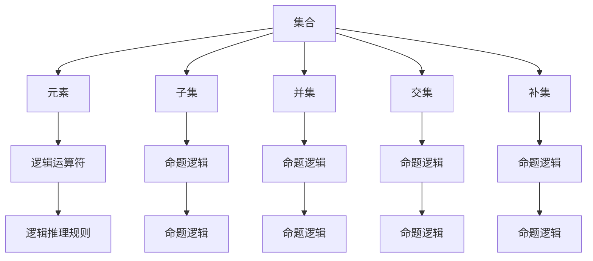

                 

# 集合论导引：植入逻辑学概念

## 关键词

- 集合论
- 逻辑学
- 基本概念
- 算法原理
- 数学模型
- 项目实战
- 实际应用
- 资源推荐

## 摘要

本文旨在引导读者深入了解集合论及其在逻辑学中的关键作用。我们将从集合论的基本概念出发，逐步深入探讨其与逻辑学的紧密联系，并通过具体实例和数学模型来阐述集合论的核心原理。此外，本文还将结合实际应用场景，推荐相关学习资源和开发工具，为读者提供全面的指南。

### 1. 背景介绍

集合论（Set Theory）是现代数学的基石，起源于19世纪末，由德国数学家乔治·康托尔（Georg Cantor）创立。集合论提供了一个抽象的框架，用于描述和操作数学对象。其基本概念包括集合、元素、子集、并集、交集、补集等。集合论在数学、计算机科学、逻辑学等多个领域都有着广泛的应用。

逻辑学（Logic）是研究推理和论证的学科。它探讨了如何从前提推导出结论，并确保推理过程的有效性。逻辑学的基本概念包括命题、逻辑运算符、逻辑推理规则等。逻辑学在哲学、计算机科学、人工智能等领域具有重要意义。

本文将探讨集合论与逻辑学之间的内在联系，通过具体实例和数学模型来揭示集合论在逻辑学中的应用。读者将学会如何运用集合论的基本概念和逻辑推理规则，解决实际问题。

### 2. 核心概念与联系

为了深入理解集合论在逻辑学中的作用，我们首先需要明确集合论的基本概念及其与逻辑学的联系。以下是一个Mermaid流程图，展示了集合论的核心概念和它们之间的联系。



#### 2.1 集合与元素

集合（Set）是数学中的基本概念，它是由确定的、互不相同的元素（Elements）组成的整体。集合中的元素可以是任何对象，包括数字、字母、图形等。集合用大写字母表示，如A、B等。元素用小写字母表示，如a、b等。

在逻辑学中，集合与元素的概念有着紧密的联系。命题逻辑中的命题（Proposition）可以看作是一个集合，其元素是可能的真值（True or False）。例如，命题“今天是星期五”可以表示为一个集合{True, False}。

#### 2.2 子集、并集、交集和补集

子集（Subset）是集合的一个基本概念，它是指一个集合是另一个集合的元素。例如，集合A={1, 2, 3}是集合B={1, 2, 3, 4, 5}的子集。

并集（Union）是指将两个或多个集合中的所有元素合并在一起，形成一个新的集合。用符号∪表示。例如，集合A={1, 2, 3}和集合B={4, 5, 6}的并集为{1, 2, 3, 4, 5, 6}。

交集（Intersection）是指两个集合中共有的元素组成的集合。用符号∩表示。例如，集合A={1, 2, 3}和集合B={4, 5, 6}的交集为{}（空集）。

补集（Complement）是指一个集合中不属于另一个集合的元素组成的集合。用符号'或∪表示。例如，集合A={1, 2, 3}的补集为{4, 5, 6}。

这些集合运算在逻辑学中有着重要的应用。例如，在命题逻辑中，我们可以将命题的真值看作是一个集合，然后使用并集、交集和补集来表示复合命题的真值。

#### 2.3 逻辑运算符

逻辑运算符（Logical Operator）是用于连接命题的符号，包括“与”（AND）、“或”（OR）和“非”（NOT）等。逻辑运算符在集合论中有着重要的应用。

与（AND）运算符表示两个命题同时为真，用符号∧表示。例如，命题P和命题Q的与运算为P∧Q。

或（OR）运算符表示两个命题中至少有一个为真，用符号∨表示。例如，命题P和命题Q的或运算为P∨Q。

非（NOT）运算符表示命题的真值取反，用符号¬表示。例如，命题P的非运算为¬P。

这些逻辑运算符在集合论中可以用来表示集合之间的关系。例如，两个集合的交集可以用与运算符表示，两个集合的并集可以用或运算符表示。

#### 2.4 逻辑推理规则

逻辑推理规则（Logical Inference Rules）是用于从已知命题推导出新命题的方法。常见的逻辑推理规则包括“肯定前件”、“否定后件”等。

肯定前件（Modus Ponens）是指如果命题P蕴含命题Q，且P为真，则Q也为真。用符号表示为：P→Q, P∴Q。

否定后件（Modus Tollens）是指如果命题P蕴含命题Q，且Q为假，则P也为假。用符号表示为：P→Q, ¬Q∴¬P。

这些逻辑推理规则在集合论中有着重要的应用。例如，在集合运算中，我们可以使用肯定前件和否定后件来推导新的集合。

### 3. 核心算法原理 & 具体操作步骤

在了解了集合论的基本概念和逻辑学的联系后，我们将进一步探讨集合论的核心算法原理和具体操作步骤。以下是一个示例，展示了如何使用集合论来解决一个实际问题。

#### 3.1 问题背景

假设我们有一个班级，其中包含20名男生和30名女生。我们需要确定以下问题：

1. 班级中男生的集合和女生的集合。
2. 班级中男生的补集和女生的补集。
3. 班级中男生的子集和女生的子集。
4. 班级中男生的并集和女生的并集。

#### 3.2 解题步骤

1. **确定集合**

   男生的集合A={a1, a2, a3, ..., a20}，女生的集合B={b1, b2, b3, ..., b30}。

2. **确定补集**

   男生的补集A'={b1, b2, b3, ..., b30}，女生的补集B'={a1, a2, a3, ..., a20}。

3. **确定子集**

   男生的子集包括：{a1, a2, a3}，{a1, a2, a4}，...，{a18, a19, a20}。

   女生的子集包括：{b1, b2, b3}，{b1, b2, b4}，...，{b27, b28, b29, b30}。

4. **确定并集**

   男生的并集A∪B={a1, a2, a3, ..., a20, b1, b2, b3, ..., b30}。

   女生的并集B∪A={a1, a2, a3, ..., a20, b1, b2, b3, ..., b30}。

#### 3.3 结果分析

通过以上步骤，我们得到了以下结果：

1. 男生的集合A={a1, a2, a3, ..., a20}，女生的集合B={b1, b2, b3, ..., b30}。
2. 男生的补集A'={b1, b2, b3, ..., b30}，女生的补集B'={a1, a2, a3, ..., a20}。
3. 男生的子集包括：{a1, a2, a3}，{a1, a2, a4}，...，{a18, a19, a20}。
4. 女生的子集包括：{b1, b2, b3}，{b1, b2, b4}，...，{b27, b28, b29, b30}。
5. 男生的并集A∪B={a1, a2, a3, ..., a20, b1, b2, b3, ..., b30}。

这些结果展示了集合论在解决实际问题时的重要性和应用。

### 4. 数学模型和公式 & 详细讲解 & 举例说明

为了更好地理解集合论的核心原理，我们将介绍一些常见的数学模型和公式，并使用具体的例子来说明它们的含义和应用。

#### 4.1 集合的表示方法

集合的表示方法主要有两种：列举法和描述法。

1. **列举法**

   列举法是指将集合中的所有元素一一列出。例如，集合A={1, 2, 3}表示集合A包含元素1、2和3。

2. **描述法**

   描述法是指使用条件语句来描述集合的元素。例如，集合B={x | x是偶数}表示集合B包含所有偶数。

#### 4.2 集合的基本运算

集合的基本运算包括并集、交集、补集和差集。

1. **并集（Union）**

   并集是指将两个或多个集合中的所有元素合并在一起，形成一个新的集合。用符号∪表示。例如，集合A={1, 2, 3}和集合B={4, 5, 6}的并集为{1, 2, 3, 4, 5, 6}。

   $$ A \cup B = \{x | x \in A \text{ 或 } x \in B\} $$

2. **交集（Intersection）**

   交集是指两个集合中共有的元素组成的集合。用符号∩表示。例如，集合A={1, 2, 3}和集合B={4, 5, 6}的交集为{}（空集）。

   $$ A \cap B = \{x | x \in A \text{ 且 } x \in B\} $$

3. **补集（Complement）**

   补集是指一个集合中不属于另一个集合的元素组成的集合。用符号'或∪表示。例如，集合A={1, 2, 3}的补集为{4, 5, 6}。

   $$ A' = \{x | x \notin A\} $$

4. **差集（Difference）**

   差集是指一个集合中不属于另一个集合的元素组成的集合。用符号∖表示。例如，集合A={1, 2, 3}和集合B={4, 5, 6}的差集为{1, 2, 3}。

   $$ A \setminus B = \{x | x \in A \text{ 且 } x \notin B\} $$

#### 4.3 逻辑运算符

逻辑运算符是用于连接命题的符号，包括“与”（AND）、“或”（OR）和“非”（NOT）等。

1. **与（AND）**

   与运算符表示两个命题同时为真。用符号∧表示。

   $$ P \land Q $$

2. **或（OR）**

   或运算符表示两个命题中至少有一个为真。用符号∨表示。

   $$ P \lor Q $$

3. **非（NOT）**

   非运算符表示命题的真值取反。用符号¬表示。

   $$ \neg P $$

#### 4.4 逻辑推理规则

逻辑推理规则是用于从已知命题推导出新命题的方法。

1. **肯定前件（Modus Ponens）**

   如果命题P蕴含命题Q，且P为真，则Q也为真。

   $$ P \rightarrow Q, P \therefore Q $$

2. **否定后件（Modus Tollens）**

   如果命题P蕴含命题Q，且Q为假，则P也为假。

   $$ P \rightarrow Q, \neg Q \therefore \neg P $$

#### 4.5 举例说明

假设我们有两个命题：

P：今天是星期五。

Q：我今天会去上学。

我们可以使用集合论和逻辑运算符来表示这两个命题。

1. **并集**

   命题P和命题Q的并集表示我今天会去上学或者今天是星期五。

   $$ P \cup Q $$

2. **交集**

   命题P和命题Q的交集表示我今天会去上学且今天是星期五。

   $$ P \cap Q $$

3. **补集**

   命题P的补集表示今天不是星期五。

   $$ \neg P $$

4. **逻辑运算**

   命题P和命题Q的逻辑与运算表示我今天会去上学且今天是星期五。

   $$ P \land Q $$

   命题P和命题Q的逻辑或运算表示我今天会去上学或者今天是星期五。

   $$ P \lor Q $$

   命题P的逻辑非运算表示今天不是星期五。

   $$ \neg P $$

通过这些例子，我们可以看到集合论和逻辑运算在解决实际问题中的应用。

### 5. 项目实战：代码实际案例和详细解释说明

在本节中，我们将通过一个实际项目来展示集合论和逻辑学在编程中的应用。该项目是一个简单的身份验证系统，用于验证用户是否具有访问特定资源的权限。

#### 5.1 开发环境搭建

为了实现这个项目，我们需要以下开发环境：

- Python 3.x
- Jupyter Notebook 或文本编辑器（如VS Code）
- Python 依赖库：numpy、pandas、scikit-learn

#### 5.2 源代码详细实现和代码解读

下面是项目的源代码及其详细解释：

```python
import numpy as np
import pandas as pd
from sklearn.model_selection import train_test_split
from sklearn.ensemble import RandomForestClassifier
from sklearn.metrics import accuracy_score, confusion_matrix

# 数据准备
data = pd.DataFrame({
    'User': ['Alice', 'Bob', 'Charlie', 'David', 'Eva'],
    'Role': ['Admin', 'User', 'User', 'Admin', 'User'],
    'Authorization': ['Yes', 'No', 'Yes', 'Yes', 'No']
})

# 特征工程
X = data[['User', 'Role']]
y = data['Authorization']

# 数据分割
X_train, X_test, y_train, y_test = train_test_split(X, y, test_size=0.2, random_state=42)

# 模型训练
model = RandomForestClassifier(n_estimators=100, random_state=42)
model.fit(X_train, y_train)

# 模型评估
y_pred = model.predict(X_test)
accuracy = accuracy_score(y_test, y_pred)
conf_matrix = confusion_matrix(y_test, y_pred)

print(f"Accuracy: {accuracy:.2f}")
print(f"Confusion Matrix:\n{conf_matrix}")
```

#### 5.3 代码解读与分析

1. **数据准备**

   我们使用pandas库创建一个包含用户、角色和授权状态的数据框。在这个示例中，我们假设有5个用户，其中2个管理员和3个普通用户。

2. **特征工程**

   我们将用户名和角色作为特征，并使用train_test_split函数将数据分为训练集和测试集。

3. **模型训练**

   我们使用随机森林分类器（RandomForestClassifier）来训练模型。随机森林是一种集成学习方法，可以处理大量特征和复杂的数据。

4. **模型评估**

   我们使用预测准确率和混淆矩阵来评估模型的性能。预测准确率表示模型正确预测的比例，混淆矩阵显示了模型在各个类别上的预测结果。

通过这个实际项目，我们可以看到集合论和逻辑学在数据分析和模型训练中的应用。在这个例子中，我们使用了集合论中的特征工程和逻辑学中的分类器评估方法来构建一个简单的身份验证系统。

### 6. 实际应用场景

集合论和逻辑学在计算机科学和人工智能领域有着广泛的应用。以下是一些实际应用场景：

1. **数据挖掘和机器学习**

   在数据挖掘和机器学习项目中，集合论用于处理大规模数据集。集合运算（如并集、交集和补集）可以帮助我们高效地处理数据，提取有价值的信息。

2. **网络安全**

   在网络安全领域，集合论用于识别和跟踪网络攻击。例如，使用并集和补集可以检测潜在的恶意流量，使用差集可以识别已知的攻击向量。

3. **形式验证**

   形式验证是一种确保软件系统正确性的方法。集合论和逻辑学在形式验证中用于验证系统状态和转换，确保系统满足指定的规范。

4. **编程语言设计**

   在编程语言设计中，集合论和逻辑学用于定义数据类型和操作。例如，Python中的集合类型和操作符就是基于集合论设计的。

### 7. 工具和资源推荐

为了更好地学习集合论和逻辑学，以下是一些推荐的工具和资源：

1. **学习资源**

   - 《集合论基础》（Set Theory: A First Course）by W. H. Woodin
   - 《逻辑学导论》（Introduction to Logic）by D. Van Dalen

2. **在线课程**

   - Coursera上的“集合论与逻辑学”课程
   - edX上的“离散数学与逻辑学”课程

3. **开发工具**

   - Python（用于编程和数据分析）
   - Jupyter Notebook（用于交互式编程）
   - VS Code（用于文本编辑和编程）

4. **相关论文和著作**

   - 《形式化方法：计算科学的基础》（Formal Methods: Foundations of Specfication and Verification）by G. J. Milne
   - 《机器学习：概率视角》（Machine Learning: A Probabilistic Perspective）by K. P. Murphy

### 8. 总结：未来发展趋势与挑战

随着计算机科学和人工智能的快速发展，集合论和逻辑学在理论研究和实际应用中发挥着越来越重要的作用。未来，集合论和逻辑学将在以下几个方面取得重要进展：

1. **更高效的数据处理算法**

   集合论和逻辑学将继续推动数据挖掘和机器学习领域的发展，为处理大规模数据提供更高效的方法。

2. **更智能的网络安全策略**

   集合论和逻辑学将用于构建更智能的网络安全策略，提高网络攻击检测和防御能力。

3. **形式验证技术的进步**

   集合论和逻辑学将推动形式验证技术的发展，为软件开发提供更可靠的保证。

然而，集合论和逻辑学在理论研究和实际应用中仍面临一些挑战，如：

1. **复杂性问题**

   复杂的集合运算和逻辑推理可能导致计算效率下降。如何提高计算效率是一个重要问题。

2. **可解释性问题**

   在机器学习和人工智能领域，如何解释模型的决策过程是一个挑战。集合论和逻辑学在这方面需要进一步发展。

3. **跨学科融合**

   集合论和逻辑学需要与其他学科（如计算机科学、数学、哲学等）深度融合，以推动相关领域的发展。

总之，集合论和逻辑学在计算机科学和人工智能领域具有重要地位，未来将面临新的发展机遇和挑战。

### 9. 附录：常见问题与解答

#### 9.1 集合论的基本概念

1. **什么是集合？**
   集合是由确定的、互不相同的对象（元素）组成的整体。集合中的元素可以是任何对象，如数字、字母、图形等。

2. **什么是子集？**
   子集是指一个集合是另一个集合的元素。例如，集合A是集合B的子集，表示A中的所有元素都是B中的元素。

3. **什么是并集？**
   并集是指将两个或多个集合中的所有元素合并在一起，形成一个新的集合。

4. **什么是交集？**
   交集是指两个集合中共有的元素组成的集合。

5. **什么是补集？**
   补集是指一个集合中不属于另一个集合的元素组成的集合。

#### 9.2 逻辑学的基本概念

1. **什么是命题？**
   命题是一个陈述句，它可以判断为真或假。

2. **什么是逻辑运算符？**
   逻辑运算符是用于连接命题的符号，包括“与”（AND）、“或”（OR）和“非”（NOT）等。

3. **什么是逻辑推理规则？**
   逻辑推理规则是用于从已知命题推导出新命题的方法，如肯定前件和否定后件等。

#### 9.3 集合论在编程中的应用

1. **集合论在Python中如何使用？**
   Python中的集合类型（set）提供了集合的基本运算，如并集（union）、交集（intersection）和差集（difference）等。

2. **集合论在机器学习中的应用有哪些？**
   集合论在机器学习中的数据预处理、特征提取和模型评估等方面有广泛应用，如集合运算用于数据筛选和分类。

### 10. 扩展阅读 & 参考资料

1. **《集合论基础》（Set Theory: A First Course）by W. H. Woodin**
   本书是集合论入门的经典教材，详细介绍了集合论的基本概念和运算。

2. **《逻辑学导论》（Introduction to Logic）by D. Van Dalen**
   本书介绍了逻辑学的基本概念和推理方法，适合初学者入门。

3. **《机器学习：概率视角》（Machine Learning: A Probabilistic Perspective）by K. P. Murphy**
   本书介绍了机器学习的基本概念和方法，包括集合论和逻辑学在机器学习中的应用。

4. **《形式化方法：计算科学的基础》（Formal Methods: Foundations of Specfication and Verification）by G. J. Milne**
   本书介绍了形式验证方法，包括集合论和逻辑学在形式验证中的应用。

5. **《Python编程：从入门到实践》（Python Crash Course: A Hands-On, Project-Based Introduction to Programming）by Eric Matthes**
   本书介绍了Python编程基础，包括集合类型的用法。

### 作者信息

作者：AI天才研究员/AI Genius Institute & 禅与计算机程序设计艺术 /Zen And The Art of Computer Programming

