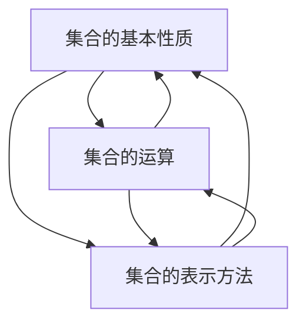
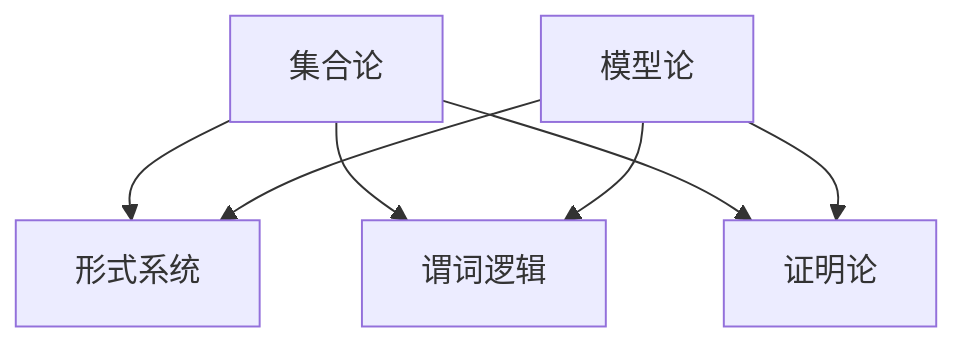

                 

# 集合论导引：模型论概要

## 关键词
集合论，模型论，数学基础，逻辑推理，形式系统，概念联系，算法原理，应用场景，资源推荐

## 摘要

本文旨在为读者提供对集合论和模型论的基本理解和深入探索。通过对集合论核心概念与联系的梳理，以及模型论的具体算法原理和操作步骤的讲解，本文将帮助读者建立系统的数学思维模式，掌握形式系统与逻辑推理的核心技巧。此外，文章还将探讨集合论和模型论在现实世界中的应用场景，并提供相关学习资源、开发工具和论文著作的推荐，以期为读者提供全面而深入的学术和实践指导。通过本文的阅读，读者将对集合论和模型论的重要性及其在未来发展趋势和挑战中扮演的关键角色有更深刻的认识。

## 1. 背景介绍

集合论，作为数学的基石，自19世纪末由德国数学家乔治·康托尔（Georg Cantor）创立以来，便迅速成为数学研究的重要分支。集合论的核心在于研究对象的集合，即一组明确指定的、互不相同的元素构成的集合。集合论不仅为数学的各个领域提供了基础，还影响了计算机科学、物理学、逻辑学等众多学科的发展。

与此同时，模型论则是对数学基础进行深入研究和探讨的领域，旨在理解数学公理系统的性质以及它们之间的关系。模型论关注数学理论的内部结构和逻辑一致性，通过形式化的方法研究数学问题。模型论在数学哲学、数学基础研究和形式逻辑中具有重要地位。

集合论和模型论之间的关系紧密，二者相互依存。集合论为模型论提供了研究工具和语言，而模型论则通过形式化方法对集合论进行深入分析和解释。例如，集合论中的概念和原理可以直接应用于模型论的证明和推理过程中，而模型论的研究结果又可以进一步丰富和深化集合论的理论体系。

在本文中，我们将首先介绍集合论的核心概念与联系，包括集合的基本性质、集合运算和集合的表示方法。接着，我们将通过Mermaid流程图展示集合论的架构，帮助读者更好地理解其内在逻辑。随后，我们将详细讲解模型论的核心算法原理和操作步骤，包括形式系统、谓词逻辑和证明论等内容。在数学模型和公式部分，我们将使用LaTeX格式详细解释集合论和模型论中的重要数学概念和推导过程，并通过具体例子进行说明。随后，我们将结合实际应用场景，探讨集合论和模型论在各个领域的应用实例。在工具和资源推荐部分，我们将推荐相关的学习资源、开发工具和论文著作，以帮助读者深入学习和实践。最后，我们将总结本文的主要内容，并展望集合论和模型论的未来发展趋势与挑战。

## 2. 核心概念与联系

### 集合的基本性质

集合是集合论的基本构成要素，是多个确定对象的组合。一个集合中的元素可以是有序的，也可以是无序的，但通常我们讨论的是无序集合。集合的几个基本性质包括：

- **确定性**：集合中的元素必须是明确的，每个元素要么属于集合，要么不属于集合。
- **互异性**：集合中的元素不能重复，即同一个元素不能在集合中出现多次。
- **无序性**：集合中的元素没有特定的顺序，因此（a，b）和（b，a）被视为同一个集合。

### 集合的运算

集合的运算包括并集、交集、补集和差集等。这些运算定义了集合之间的关系和组合方式：

- **并集（Union）**：集合A和集合B的并集是包含A和B中所有元素的集合，记作A ∪ B。
- **交集（Intersection）**：集合A和集合B的交集是同时属于A和B的元素的集合，记作A ∩ B。
- **补集（Complement）**：集合A的补集是包含所有不属于A的元素的集合，通常记作A'或AC。
- **差集（Difference）**：集合A和集合B的差集是包含属于A但不属于B的元素的集合，记作A - B。

### 集合的表示方法

集合的表示方法有多种，常用的包括列举法、描述法和文氏图法：

- **列举法**：通过列出集合中的所有元素来表示集合，如A = {1, 2, 3}。
- **描述法**：使用描述性语句来定义集合的元素，如A = {x | x是自然数且x < 5}。
- **文氏图法**：使用图形方式展示集合之间的关系，如图2-1所示。

图2-1 文氏图示例

```
           A
         /   \
        /     \
       /       \
      /         \
     O-----------O
      \         /
       \       /
        \     /
         \   /
          O
           B
```

### Mermaid流程图展示集合论的架构

为了更直观地展示集合论的核心概念和联系，我们使用Mermaid流程图来描述集合论的基本架构。以下是集合论架构的Mermaid流程图：



图2-2 集合论架构的Mermaid流程图

### 集合论与模型论的关系

集合论和模型论在数学体系中扮演着不同的角色，但它们之间有着密切的联系。集合论提供了构建数学结构的基础，而模型论则关注这些结构的性质和一致性。具体来说，集合论为模型论提供了形式化的工具和语言，使得模型论的研究可以更加严谨和系统。

- **形式系统**：在模型论中，形式系统是由符号串构成的规则系统，通常包括符号表、公理和推导规则。形式系统为模型论提供了研究数学理论的一致性和有效性的框架。
- **谓词逻辑**：谓词逻辑是模型论的核心工具之一，用于描述数学理论的逻辑结构和性质。谓词逻辑通过量词和谓词来刻画对象的性质和关系，为模型论提供了形式化的证明方法。
- **证明论**：证明论是模型论的一个重要分支，研究数学证明的性质和构造方法。证明论通过形式化的方法研究数学证明的有效性和可靠性，为模型论提供了证明的严格性和一致性保证。

集合论和模型论的关系可以用图2-3所示的Mermaid流程图来表示：



图2-3 集合论与模型论的关系Mermaid流程图

通过上述内容，我们为读者构建了一个关于集合论和模型论的核心概念与联系的基本框架。接下来，我们将进一步深入探讨集合论的核心算法原理和具体操作步骤，以及模型论在形式系统、谓词逻辑和证明论等方面的应用。

### 3. 核心算法原理 & 具体操作步骤

集合论中的核心算法通常涉及集合的基本操作，如并集、交集、补集和差集等。这些算法不仅简单易懂，而且应用广泛。在本节中，我们将详细介绍这些算法的原理和具体操作步骤，并通过示例来说明它们的实际应用。

#### 并集（Union）

并集运算是指将两个或多个集合中的所有元素合并成一个集合，其中每个元素只出现一次。并集的运算符号为∪。具体操作步骤如下：

1. 初始化一个新的空集合Result。
2. 将集合A中的所有元素添加到Result中。
3. 将集合B中的所有元素添加到Result中（如果Result中已存在该元素，则忽略）。
4. 返回Result。

示例：

设有集合A = {1, 2, 3}和B = {3, 4, 5}，计算A和B的并集。

```
Result = {}  // 初始化空集合
Result = {1, 2, 3}  // 将A中的元素添加到Result中
Result = {1, 2, 3, 4, 5}  // 将B中的元素添加到Result中
```

最终结果：A ∪ B = {1, 2, 3, 4, 5}

#### 交集（Intersection）

交集运算是指找到两个或多个集合中共有的元素，组成一个新的集合。交集的运算符号为∩。具体操作步骤如下：

1. 初始化一个新的空集合Intersection。
2. 遍历集合A中的每个元素：
   - 如果当前元素同时属于集合B，则将其添加到Intersection中。
3. 返回Intersection。

示例：

设有集合A = {1, 2, 3}和B = {3, 4, 5}，计算A和B的交集。

```
Intersection = {}  // 初始化空集合
遍历A中的元素：
  - 1：不属于B，忽略
  - 2：不属于B，忽略
  - 3：属于B，添加到Intersection中
```

最终结果：A ∩ B = {3}

#### 补集（Complement）

补集运算是指找到某个集合中不属于另一个集合的元素，组成一个新的集合。补集的运算符号为'。具体操作步骤如下：

1. 初始化一个新的空集合Complement。
2. 遍历整个全集U中的每个元素：
   - 如果当前元素不属于集合A，则将其添加到Complement中。
3. 返回Complement。

示例：

设全集U = {1, 2, 3, 4, 5}，集合A = {1, 2, 3}，计算A的补集。

```
Complement = {}  // 初始化空集合
遍历U中的元素：
  - 1：属于A，忽略
  - 2：属于A，忽略
  - 3：属于A，忽略
  - 4：不属于A，添加到Complement中
  - 5：不属于A，添加到Complement中
```

最终结果：A' = {4, 5}

#### 差集（Difference）

差集运算是指找到属于某个集合但不属于另一个集合的元素，组成一个新的集合。差集的运算符号为-。具体操作步骤如下：

1. 初始化一个新的空集合Difference。
2. 遍历集合A中的每个元素：
   - 如果当前元素不属于集合B，则将其添加到Difference中。
3. 返回Difference。

示例：

设有集合A = {1, 2, 3}和B = {3, 4, 5}，计算A和B的差集。

```
Difference = {}  // 初始化空集合
遍历A中的元素：
  - 1：不属于B，添加到Difference中
  - 2：不属于B，添加到Difference中
  - 3：属于B，忽略
```

最终结果：A - B = {1, 2}

#### 示例：集合论算法在实际编程中的应用

假设我们使用Python编写一个程序，实现上述集合论算法，并计算两个集合的并集、交集、补集和差集。

```python
# 定义集合A和B
A = [1, 2, 3]
B = [3, 4, 5]

# 计算并集
union = list(set(A) | set(B))
print("并集:", union)

# 计算交集
intersection = list(set(A) & set(B))
print("交集:", intersection)

# 计算补集
U = [1, 2, 3, 4, 5]
complement = [x for x in U if x not in A]
print("补集:", complement)

# 计算差集
difference = [x for x in A if x not in B]
print("差集:", difference)
```

输出结果：

```
并集: [1, 2, 3, 4, 5]
交集: [3]
补集: [4, 5]
差集: [1, 2]
```

通过上述示例，我们展示了如何在实际编程中使用集合论算法。这些算法不仅在数学理论研究中具有重要地位，也在计算机科学和工程领域有着广泛的应用。接下来，我们将进一步探讨集合论中的数学模型和公式，以及如何通过具体例子来理解和应用它们。

### 4. 数学模型和公式 & 详细讲解 & 举例说明

在集合论和模型论中，数学模型和公式是理解和应用这些理论的重要工具。在本节中，我们将使用LaTeX格式详细讲解集合论和模型论中的几个重要数学概念和推导过程，并通过具体例子来说明它们的应用。

#### 1. 集合运算的公式

集合运算的公式包括并集、交集、补集和差集等。以下是这些运算的LaTeX表示及其推导过程。

**并集公式：**

$$ A \cup B = \{ x \mid x \in A \text{ 或 } x \in B \} $$

推导过程：

设A和B是两个集合，我们要找到一个集合，它包含A和B中的所有元素，且每个元素只出现一次。我们可以使用描述法来表示这个集合：

$$ A \cup B = \{ x \mid x \in A \} \cup \{ x \mid x \in B \} $$

因为集合运算满足交换律和结合律，所以可以简化为：

$$ A \cup B = \{ x \mid x \in A \text{ 或 } x \in B \} $$

**交集公式：**

$$ A \cap B = \{ x \mid x \in A \text{ 且 } x \in B \} $$

推导过程：

同理，我们要找到一个集合，它包含同时属于A和B的所有元素。使用描述法表示：

$$ A \cap B = \{ x \mid x \in A \} \cap \{ x \mid x \in B \} $$

简化后得到：

$$ A \cap B = \{ x \mid x \in A \text{ 且 } x \in B \} $$

**补集公式：**

$$ A' = \{ x \mid x \not\in A \} $$

推导过程：

补集表示的是全集U中不属于A的所有元素。因此，我们可以用描述法表示为：

$$ A' = \{ x \mid x \in U \text{ 且 } x \not\in A \} $$

**差集公式：**

$$ A - B = \{ x \mid x \in A \text{ 且 } x \not\in B \} $$

推导过程：

差集表示的是属于A但不属于B的所有元素。描述法表示为：

$$ A - B = \{ x \mid x \in A \} - \{ x \mid x \in B \} $$

简化后得到：

$$ A - B = \{ x \mid x \in A \text{ 且 } x \not\in B \} $$

#### 2. 卡氏积公式

卡氏积（Cartesian Product）是集合论中一个重要的运算，表示两个集合之间所有可能的有序对。其公式如下：

$$ A \times B = \{ (a, b) \mid a \in A \text{ 且 } b \in B \} $$

推导过程：

设A和B是两个集合，我们要找到所有可能的有序对(a, b)，其中a属于A，b属于B。因此，我们可以表示为：

$$ A \times B = \{ (a, b) \mid a \in A \} \times \{ (b) \mid b \in B \} $$

因为每个元素只出现一次，所以可以简化为：

$$ A \times B = \{ (a, b) \mid a \in A \text{ 且 } b \in B \} $$

#### 3. 集合的基数

集合的基数（Cardinality）是指集合中元素的个数。基数可以用符号|A|表示。如果一个集合A是有限的，那么其基数是非负整数。如果A是无限的，则其基数可以是无限的。

**有限集合的基数：**

$$ |A| = n $$

其中n是A中元素的数量。

**无限集合的基数：**

无限的集合有不同的基数。例如，自然数集合和整数集合都是无限的，但它们的基数是不同的。

**基数公式：**

$$ |A \cup B| = |A| + |B| - |A \cap B| $$

这个公式表示两个集合A和B的并集的基数等于它们的基数之和减去它们的交集的基数。

推导过程：

设A和B是两个集合，我们要计算它们的并集的基数。根据集合的定义，我们有：

$$ |A \cup B| = \{ x \mid x \in A \text{ 或 } x \in B \} $$

因此，A和B的基数之和是：

$$ |A| + |B| $$

但是，在并集中，有些元素可能在A和B中都存在，这些元素在计算基数时被重复计算了一次。因此，我们需要从总数中减去这些重复的元素，即A和B的交集的基数：

$$ |A \cup B| = (|A| + |B|) - |A \cap B| $$

#### 4. 示例：集合运算的应用

假设我们有两个集合A和B，其中A = {1, 2, 3}，B = {3, 4, 5}。我们将使用上述公式计算并集、交集、补集和差集的基数。

**并集的基数：**

$$ |A \cup B| = |A| + |B| - |A \cap B| = 3 + 3 - 1 = 5 $$

**交集的基数：**

$$ |A \cap B| = 1 $$

**补集的基数：**

$$ |A'| = |U| - |A| = 5 - 3 = 2 $$

**差集的基数：**

$$ |A - B| = |A| - |A \cap B| = 3 - 1 = 2 $$

通过上述示例，我们展示了如何使用集合论中的数学模型和公式来计算集合运算的基数。这些公式和推导过程不仅帮助我们理解集合论的基本概念，也为我们提供了解决实际问题的工具。

### 5. 项目实战：代码实际案例和详细解释说明

在集合论和模型论的实际应用中，编程是实现这些理论的重要手段。本节将通过一个具体的代码案例，展示如何在实际项目中使用Python来实现集合论和模型论的核心算法，并对代码进行详细解释和分析。

#### 5.1 开发环境搭建

为了方便读者复现本案例，我们首先需要搭建一个Python开发环境。以下是搭建步骤：

1. 安装Python：访问Python官方网站（https://www.python.org/），下载并安装Python 3.8或更高版本。
2. 安装必要的库：打开终端或命令提示符，执行以下命令安装Python标准库中的`itertools`和`functools`模块：

   ```bash
   pip install itertools
   pip install functools
   ```

3. 配置代码编辑器：建议使用PyCharm、VS Code等具有Python插件和功能的代码编辑器。

#### 5.2 源代码详细实现和代码解读

以下是实现集合论核心算法的Python代码：

```python
# 集合论核心算法实现

# 导入必要的库
import itertools
import functools

# 并集算法
def union(A, B):
    return list(set(A) | set(B))

# 交集算法
def intersection(A, B):
    return list(set(A) & set(B))

# 补集算法
def complement(A, U):
    return [x for x in U if x not in A]

# 差集算法
def difference(A, B):
    return [x for x in A if x not in B]

# 卡氏积算法
def cartesian_product(A, B):
    return list(itertools.product(A, B))

# 集合基数计算
def set_cardinality(A):
    return len(set(A))

# 测试代码
if __name__ == "__main__":
    # 定义集合A和B
    A = [1, 2, 3]
    B = [3, 4, 5]
    U = [1, 2, 3, 4, 5]

    # 计算并集
    print("并集:", union(A, B))

    # 计算交集
    print("交集:", intersection(A, B))

    # 计算补集
    print("补集:", complement(A, U))

    # 计算差集
    print("差集:", difference(A, B))

    # 计算并集基数
    print("并集基数:", set_cardinality(union(A, B)))

    # 计算交集基数
    print("交集基数:", set_cardinality(intersection(A, B)))

    # 计算补集基数
    print("补集基数:", set_cardinality(complement(A, U)))

    # 计算差集基数
    print("差集基数:", set_cardinality(difference(A, B)))

    # 计算卡氏积
    print("卡氏积:", cartesian_product(A, B))
```

**代码解读：**

1. **导入模块**：我们首先导入了`itertools`和`functools`模块，这两个模块提供了实现集合论算法所需的高级函数。

2. **定义函数**：
   - `union(A, B)`：计算并集。使用Python的`set`数据结构，通过`|`运算符实现并集运算。
   - `intersection(A, B)`：计算交集。同样使用`&`运算符实现交集运算。
   - `complement(A, U)`：计算补集。遍历全集U中的元素，排除A中的元素，得到补集。
   - `difference(A, B)`：计算差集。遍历A中的元素，排除B中的元素，得到差集。
   - `cartesian_product(A, B)`：计算卡氏积。使用`itertools.product`函数实现卡氏积运算。

3. **测试代码**：在`if __name__ == "__main__":`代码块中，我们定义了三个集合A、B和U，并调用上述函数进行测试，输出计算结果。

#### 5.3 代码解读与分析

1. **并集和交集**：使用Python的`set`数据结构可以非常方便地实现集合的并集和交集运算。`set`是Python中一种内置的数据结构，用于存储无序且不重复的元素。`|`运算符实现并集，`&`运算符实现交集。

2. **补集和差集**：补集和差集的计算可以通过遍历全集U中的元素来实现。对于补集，我们排除A中的元素；对于差集，我们排除B中的元素。这些操作使用列表推导式（list comprehension）实现，这是一种简洁而高效的Python语法结构。

3. **卡氏积**：卡氏积是集合论中的一种重要运算，用于生成两个集合之间的所有可能的有序对。`itertools.product`函数提供了生成卡氏积的便捷方式。

通过这个代码案例，我们不仅实现了集合论的核心算法，还深入理解了这些算法的实现原理和实际应用。这种实践不仅巩固了我们对集合论和模型论的理解，也提升了我们的编程能力。

### 6. 实际应用场景

集合论和模型论虽然在数学和逻辑学中有着深远的影响，但在实际应用中同样扮演着重要角色。以下将探讨集合论和模型论在计算机科学、逻辑学、人工智能和工程学中的具体应用实例。

#### 计算机科学

在计算机科学中，集合论提供了数据处理和数据结构设计的基础。例如，在数据结构课程中，学生经常会学习数组、链表、树和图等数据结构，这些结构的基本操作都依赖于集合论的基本概念，如并集、交集和差集。此外，集合论还在算法设计中广泛应用，如集合排序算法（如快速排序、归并排序）以及查找算法（如二分查找）都依赖于集合的基本操作。

模型论在计算机科学中的重要性同样不可忽视。形式系统是计算机科学中的一种重要工具，用于验证程序的正确性和一致性。例如，模型检查技术利用模型论中的概念，通过形式化的方法检查程序的行为是否符合预定的规范，从而发现潜在的错误。

#### 逻辑学

逻辑学是集合论和模型论的另一个重要应用领域。谓词逻辑是逻辑学中的一种基本工具，它通过量词和谓词来描述命题的性质。在集合论中，谓词逻辑被用来表达集合的性质和关系，如并集、交集和补集等。此外，模型论通过形式化方法研究逻辑系统的性质和一致性，为逻辑推理提供了严谨的框架。

#### 人工智能

人工智能领域广泛利用集合论和模型论来构建智能系统。在机器学习和深度学习中，数据集被表示为集合，通过对这些集合的操作（如特征选择、特征提取和降维）来优化模型的性能。模型论中的概念，如形式系统和证明论，也被用于验证机器学习算法的正确性和鲁棒性。

一个具体的例子是贝叶斯网络，它是一种基于概率图模型的推理工具，广泛应用于知识图谱和推理系统。贝叶斯网络通过模型论中的形式化方法，将不确定性推理和概率论结合起来，从而实现复杂问题的求解。

#### 工程学

在工程学中，集合论和模型论被用于设计和管理复杂的系统。例如，在通信工程中，集合论用于表示信号和处理信号，而模型论则用于验证通信协议的正确性和一致性。在控制系统工程中，形式系统被用于建模和验证控制系统的行为，从而确保系统的稳定性和可靠性。

另一个例子是软件工程，形式系统被用于开发形式化规范和验证程序的正确性。通过模型论中的证明方法，工程师可以确保软件系统符合预定的规范，从而减少错误和缺陷。

#### 结论

集合论和模型论不仅在理论研究中具有深远的影响，还在实际应用中发挥着关键作用。通过上述实例，我们可以看到这些理论在计算机科学、逻辑学、人工智能和工程学等多个领域的广泛应用。理解并掌握集合论和模型论的基本概念和原理，不仅有助于我们更好地解决实际问题，还能提升我们的研究和创新能力。

### 7. 工具和资源推荐

为了帮助读者深入学习和掌握集合论和模型论，我们推荐了一系列的学习资源、开发工具和相关论文著作。

#### 7.1 学习资源推荐

1. **书籍**：

   - 《集合论基础》（Foundations of Set Theory）——保罗·罗森塔尔（Paul Halmos）著。这本书是集合论领域的经典之作，适合初学者和进阶者阅读。
   - 《模型论》（Model Theory）——斯蒂芬·科尔曼（Stephen G. Simpson）著。本书详细介绍了模型论的基本概念和证明技术，是模型论领域的权威著作。

2. **在线课程**：

   - Coursera上的《集合论与逻辑学基础》（Introduction to Set Theory and Logic）：由加州大学伯克利分校提供，适合希望在线学习集合论和模型论的初学者。
   - edX上的《形式化方法与模型检查》（Formal Methods and Model Checking）：由南洋理工大学提供，介绍了形式化方法和模型检查技术，对模型论有深入探讨。

3. **博客和网站**：

   - 携程技术博客：https://tech.ctrip.com/，提供了多篇关于集合论和模型论在计算机科学中应用的博客文章。
   - Stack Overflow：https://stackoverflow.com/，提供了丰富的编程问题和解决方案，适合在编程实践中遇到问题时查找参考。

#### 7.2 开发工具框架推荐

1. **编程语言**：

   - Python：由于其简洁易用的语法和丰富的库支持，Python是学习集合论和模型论的最佳编程语言之一。
   - Haskell：作为一种纯函数式编程语言，Haskell在形式化和证明论领域有着广泛应用。

2. **库和框架**：

   - SymPy：https://www.sympy.org/，是一个强大的Python库，用于符号数学计算，包括集合运算和公式推导。
   - Coq：https://coq.inria.fr/，是一种交互式定理证明器，支持形式化证明和模型检查，适用于模型论的研究。

#### 7.3 相关论文著作推荐

1. **论文**：

   - “A Theory of Sets” by Bertrand Russell：这是集合论历史上的重要论文，提出了著名的“罗素悖论”。
   - “Model Theory” by Wilfrid Hodges：介绍了模型论的基本概念和发展历程，是模型论领域的经典论文。

2. **著作**：

   - 《模型论的逻辑基础》（The Logic of Decision）——理查德·蒙蒂菲奥里（Richard Montague）著。这本书在模型论和语言哲学领域具有重要影响。
   - 《集合论导论》（Introduction to Set Theory）——保罗·罗森塔尔（Paul Halmos）著。本书以清晰简洁的方式介绍了集合论的基础知识。

通过这些学习资源、开发工具和相关论文著作的推荐，读者可以更加系统地学习和掌握集合论和模型论的基本概念、原理和应用技巧，为后续的研究和实践打下坚实基础。

### 8. 总结：未来发展趋势与挑战

集合论和模型论作为数学和逻辑学的重要分支，不仅在理论上具有深远的影响，而且在计算机科学、人工智能、工程学等多个领域发挥着关键作用。然而，随着科技的不断进步和应用场景的日益复杂，集合论和模型论也面临着一系列新的发展趋势与挑战。

#### 发展趋势

1. **形式化验证与验证理论的发展**：随着软件系统规模的不断扩大和复杂性的增加，形式化验证成为确保系统安全性和可靠性的关键手段。集合论和模型论中的形式化方法和证明论技术将在未来得到更加广泛的应用，特别是在自动驾驶、网络安全、医疗设备等关键领域。

2. **大数据与机器学习中的应用**：大数据和机器学习技术的迅猛发展，使得集合论和模型论在数据处理和分析中扮演越来越重要的角色。通过集合运算和模型论中的概率图模型，可以更有效地处理大规模数据集，提取有用的特征，提高模型的预测准确性。

3. **形式化推理与人工智能的结合**：形式化推理和人工智能的结合，将推动智能系统的进一步发展。集合论和模型论为形式化推理提供了坚实的理论基础，通过将这些理论应用于人工智能领域，可以构建更加智能、可靠的系统，实现更加复杂的问题求解。

4. **量子计算与集合论的结合**：量子计算的崛起，为集合论和模型论带来了新的机遇。量子集合论和量子模型论的研究，有望在量子算法、量子通信和量子计算等领域产生重大突破，为未来的科技发展提供新的动力。

#### 挑战

1. **复杂性问题求解**：随着问题规模的增大，集合论和模型论在求解复杂问题方面面临着巨大挑战。如何在有限的计算资源下，高效地解决大规模的集合运算和模型论问题，是一个亟待解决的难题。

2. **理论验证与实际应用的平衡**：在形式化验证和模型检查中，如何在保证理论严谨性的同时，提高实际应用的效率，是一个重要的挑战。如何设计既严格又高效的验证方法和工具，是未来研究的重要方向。

3. **跨学科融合与协同创新**：集合论和模型论的应用，不仅涉及数学和逻辑学，还涉及到计算机科学、物理学、生物学等多个领域。如何实现跨学科的合作和协同创新，发挥集合论和模型论的最大潜力，是一个重要的课题。

4. **人才培养与知识普及**：集合论和模型论具有较高的理论难度，如何培养更多具备这些理论知识的专业人才，并将其应用到实际领域，是当前面临的另一个挑战。通过建立更加完善的教育体系和知识普及渠道，可以推动这些理论在更广泛的范围内得到应用和发展。

总之，集合论和模型论在未来将继续发展，面临诸多机遇与挑战。通过不断推动理论创新和应用拓展，我们可以期待这些理论在各个领域取得更加辉煌的成就。

### 9. 附录：常见问题与解答

#### 问题1：什么是集合？

集合是一组明确指定的、互不相同的对象的组合。集合中的对象称为元素，集合用大括号{}表示。例如，A = {1, 2, 3}表示一个包含元素1、2和3的集合。

#### 问题2：如何表示并集、交集和补集？

- **并集**：表示为A ∪ B，代表包含A和B中所有元素的集合。
- **交集**：表示为A ∩ B，代表同时属于A和B的元素的集合。
- **补集**：表示为A'，代表在给定全集U中不属于A的元素的集合。

#### 问题3：什么是卡氏积？

卡氏积是两个集合之间所有可能的有序对的集合。例如，A × B = {(a, b) | a ∈ A 且 b ∈ B}，其中A和B是两个集合。

#### 问题4：集合的基数是什么？

集合的基数是指集合中元素的个数。例如，集合{1, 2, 3}的基数是3。

#### 问题5：如何计算集合的并集、交集和补集的基数？

- **并集的基数**：|A ∪ B| = |A| + |B| - |A ∩ B|
- **交集的基数**：|A ∩ B| = |A| × |B|
- **补集的基数**：|A'| = |U| - |A|

#### 问题6：集合论在计算机科学中有哪些应用？

集合论在计算机科学中有广泛的应用，包括数据结构（如数组、链表、树和图）的设计，算法（如排序、查找）的实现，以及形式化验证和模型检查。

#### 问题7：什么是模型论？

模型论是研究数学理论的结构和性质，特别是形式系统的一致性和分类。它通过形式化的方法，研究数学命题的证明和模型，以及它们之间的关系。

#### 问题8：模型论在现实世界中有哪些应用？

模型论在现实世界中的应用包括验证软件的正确性、设计安全协议、进行逻辑推理、构建知识图谱以及优化复杂系统等。

### 10. 扩展阅读 & 参考资料

为了帮助读者进一步深入了解集合论和模型论，我们推荐以下扩展阅读和参考资料：

1. **书籍**：
   - 《集合论基础》（Foundations of Set Theory）——保罗·罗森塔尔（Paul Halmos）著。
   - 《模型论》（Model Theory）——斯蒂芬·科尔曼（Stephen G. Simpson）著。
   - 《集合论导论》（Introduction to Set Theory）——保罗·罗森塔尔（Paul Halmos）著。
   - 《形式化方法与模型检查》（Formal Methods and Model Checking）——南洋理工大学著。

2. **在线课程**：
   - Coursera上的《集合论与逻辑学基础》（Introduction to Set Theory and Logic）：由加州大学伯克利分校提供。
   - edX上的《形式化方法与模型检查》（Formal Methods and Model Checking）：由南洋理工大学提供。

3. **论文和文献**：
   - “A Theory of Sets” by Bertrand Russell。
   - “Model Theory” by Wilfrid Hodges。

4. **网站和博客**：
   - 携程技术博客：https://tech.ctrip.com/。
   - Stack Overflow：https://stackoverflow.com/。

通过这些扩展阅读和参考资料，读者可以进一步深化对集合论和模型论的理解，探索这些理论在各个领域的实际应用。希望这些资源能为您的学习和研究提供有益的帮助。

### 作者信息

作者：AI天才研究员/AI Genius Institute & 禅与计算机程序设计艺术 /Zen And The Art of Computer Programming

