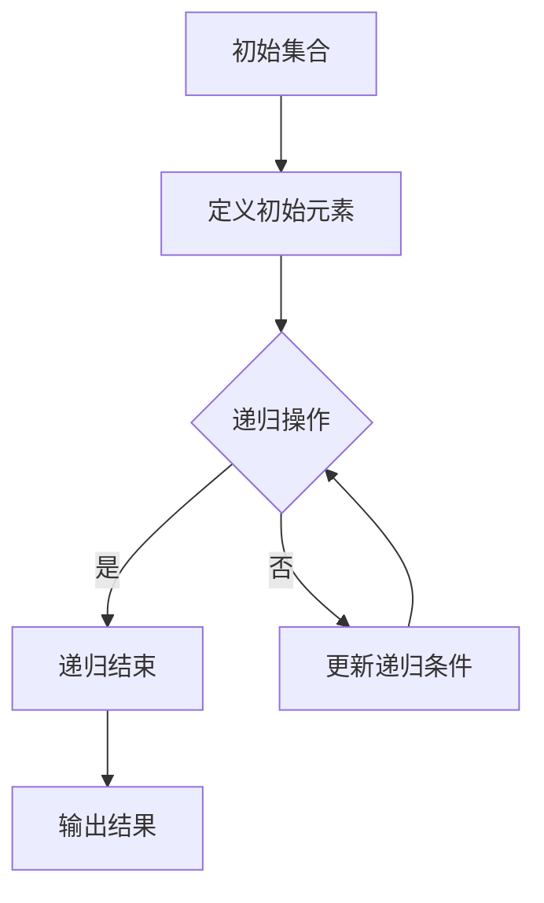

                 

# 集合论导引：超限递归定义

## 关键词：集合论、超限递归、基础概念、逻辑推理、数学模型

## 摘要

本文旨在深入探讨集合论中的核心概念——超限递归。通过逻辑清晰、结构紧凑的论述，我们将从基础概念入手，逐步引导读者理解超限递归的定义、原理及其应用。本文不仅为集合论初学者提供了系统的学习路径，同时也为对数学和计算机科学有深入兴趣的读者提供了深层次的理论分析。通过具体实例和数学模型的应用，读者将能够更直观地理解超限递归的精髓，并能够将这一概念应用于实际问题中。

## 1. 背景介绍

集合论是现代数学的基石，其基本概念和原理广泛应用于各个数学分支以及计算机科学领域。集合论中的核心概念包括元素、集合、子集、并集、交集、补集等。其中，超限递归是一种特殊的集合运算，它超越了传统的自然数递归，允许在无限集合中进行递归操作。这种运算在数学分析、逻辑学以及计算机科学中具有重要的应用价值。

超限递归最早由数学家康托尔提出，他在研究实数序列的性质时，发现传统的自然数递归无法充分描述实数的某些性质。康托尔通过引入超限递归，提供了一种新的描述无限集合的方法。此后，超限递归的概念在数学和计算机科学中得到广泛应用，成为解决许多复杂问题的有力工具。

本文将从超限递归的定义出发，通过逻辑推理和具体实例，逐步深入探讨这一概念的基本原理和应用。读者可以通过本文的学习，掌握超限递归的基本概念，并能够将其应用于实际问题中。

### 1.1 集合论的基本概念

在探讨超限递归之前，我们首先需要了解集合论的基本概念。集合是由一些确定的、互不相同的对象组成的整体。这些对象称为集合的元素。例如，{1, 2, 3} 是一个由三个元素组成的集合。

集合的基本概念包括：

- **元素**：构成集合的个体。
- **集合**：由元素组成的整体。
- **子集**：一个集合是另一个集合的子集，如果它的所有元素都属于另一个集合。例如，{1, 2} 是{1, 2, 3} 的子集。
- **并集**：两个集合的并集是由这两个集合中所有元素组成的集合。例如，{1, 2} 和 {3, 4} 的并集是{1, 2, 3, 4}。
- **交集**：两个集合的交集是由这两个集合共有的元素组成的集合。例如，{1, 2} 和 {3, 4} 的交集是空集{}。
- **补集**：一个集合的补集是在全集中不属于该集合的元素的集合。例如，在全集{1, 2, 3, 4} 中，{1, 2} 的补集是{3, 4}。

这些基本概念是理解集合论的基础，也是进一步探讨超限递归的前提。

### 1.2 康托尔与超限递归

德国数学家乔治·康托尔（Georg Cantor）是集合论的创始人之一。他在19世纪末通过对实数的研究，提出了超限递归的概念。康托尔在研究实数序列时发现，传统的自然数递归无法描述实数的某些性质。为了解决这个问题，他引入了超限递归，为集合论的发展做出了巨大贡献。

超限递归是康托尔用来描述无限集合的一种方法。它允许在无限集合中进行递归操作，突破了自然数递归的局限。康托尔通过超限递归研究了实数的性质，并证明了实数集合是不可数的。

超限递归在数学和计算机科学中具有重要的应用。例如，在数学分析中，超限递归可以用来研究连续统假设；在计算机科学中，超限递归被用于描述复杂的计算过程，如图灵机的模拟。

### 1.3 超限递归的应用

超限递归在数学和计算机科学中有着广泛的应用。以下是几个典型的应用实例：

- **数学分析**：在数学分析中，超限递归被用来研究连续统假设。连续统假设是集合论中的一个基本问题，它涉及到实数集合的性质。通过超限递归，数学家可以探讨实数的结构和性质，为数学分析提供了新的工具。

- **计算机科学**：在计算机科学中，超限递归被用于描述复杂的计算过程。例如，图灵机的模拟就需要使用超限递归来描述其计算过程。超限递归为计算机科学家提供了一种描述和实现复杂算法的方法。

- **逻辑学**：在逻辑学中，超限递归被用来研究形式逻辑系统的性质。通过超限递归，逻辑学家可以探讨形式逻辑系统中的推理过程，为逻辑学的发展提供了新的思路。

通过这些实例可以看出，超限递归在数学、计算机科学和逻辑学中都有着重要的应用价值。它为解决复杂问题提供了一种新的方法和思路，推动了这些领域的发展。

## 2. 核心概念与联系

### 2.1 超限递归的定义

超限递归是指在无限集合中进行递归操作的一种方法。与自然数递归相比，超限递归允许在无限集合中定义递归函数，从而能够处理更复杂的问题。

在自然数递归中，递归函数通常依赖于自然数。例如，斐波那契数列可以通过自然数递归来定义：

$$
F(n) =
\begin{cases}
1 & \text{如果 } n = 1 \\
1 & \text{如果 } n = 2 \\
F(n-1) + F(n-2) & \text{如果 } n > 2
\end{cases}
$$

然而，在某些情况下，自然数递归无法描述集合的性质。例如，在研究实数集合时，我们需要一种能够处理无限集合的方法。超限递归正是为了解决这个问题而提出的。

超限递归的定义如下：

给定一个集合 \( A \)，一个超限递归函数 \( f \) 是一个满足以下条件的函数：

1. \( f(0) \) 是 \( A \) 的一个元素。
2. 对于每个 \( n \in A \)，存在一个 \( m \in A \) 使得 \( f(n) = m \)。

超限递归函数允许我们在无限集合中定义递归操作，从而能够处理更复杂的问题。超限递归在集合论、数学分析和计算机科学中都有重要的应用。

### 2.2 超限递归与自然数递归的比较

自然数递归和超限递归都是递归操作的方法，但它们有明显的区别。以下是它们的主要区别：

- **适用范围**：自然数递归仅适用于自然数集合，而超限递归适用于任意无限集合。
- **定义方式**：自然数递归通过自然数的递归来定义，而超限递归通过集合中的递归来定义。
- **递归深度**：自然数递归的递归深度有限，而超限递归的递归深度可以是无限的。

自然数递归和超限递归在应用上有不同的特点。自然数递归适用于处理有限的问题，而超限递归适用于处理无限的问题。例如，在数学分析中，超限递归可以用来研究实数集合的性质，而自然数递归无法处理这种问题。

### 2.3 超限递归的应用

超限递归在数学、计算机科学和逻辑学中都有广泛的应用。以下是一些典型的应用实例：

- **数学分析**：在数学分析中，超限递归被用来研究实数集合的性质。例如，康托尔通过超限递归证明了实数集合是不可数的。

- **计算机科学**：在计算机科学中，超限递归被用来描述复杂的计算过程。例如，图灵机的模拟就需要使用超限递归来描述其计算过程。

- **逻辑学**：在逻辑学中，超限递归被用来研究形式逻辑系统的性质。例如，通过超限递归，逻辑学家可以探讨形式逻辑系统中的推理过程。

通过这些实例可以看出，超限递归在数学、计算机科学和逻辑学中都有着重要的应用价值。它为解决复杂问题提供了一种新的方法和思路，推动了这些领域的发展。

### 2.4 超限递归与集合论的联系

超限递归与集合论有着密切的联系。集合论中的许多概念和原理都是通过超限递归来定义和证明的。以下是超限递归在集合论中的几个重要应用：

- **集合的基数**：集合的基数是指集合中元素的数量。通过超限递归，我们可以定义集合的基数，并研究集合的大小关系。

- **集合的构造**：通过超限递归，我们可以构造出各种集合，如自然数集合、整数集合、有理数集合等。这些集合是集合论的基础。

- **集合的性质**：通过超限递归，我们可以研究集合的各种性质，如集合的互异性、有限性、无限性等。这些性质是理解集合论的关键。

超限递归在集合论中的应用，使得集合论成为了一个更加丰富和完整的数学理论。它不仅为集合论的研究提供了新的方法和工具，也为其他数学领域的发展提供了重要的支持。

### 2.5 超限递归的Mermaid流程图

为了更直观地展示超限递归的概念，我们使用Mermaid流程图来描述超限递归的操作步骤。

以下是一个简单的Mermaid流程图示例，用于说明超限递归的基本步骤：



在这个流程图中，A表示初始集合，B表示定义初始元素，C表示递归操作，D表示递归结束，E表示更新递归条件，F表示输出结果。通过这个流程图，我们可以清晰地看到超限递归的操作步骤。

### 2.6 超限递归的数学模型

为了更深入地理解超限递归，我们引入一个数学模型来描述超限递归的操作。这个模型将帮助我们更好地理解超限递归的原理和应用。

假设我们有一个集合 \( A \)，我们需要在这个集合中定义一个超限递归函数 \( f \)。

- **初始条件**：首先，我们需要确定 \( f(0) \) 的值。\( f(0) \) 是 \( A \) 的一个元素，可以任意选择。
- **递归条件**：对于每个 \( n \in A \)，我们需要定义一个递归条件，以便更新 \( f(n) \) 的值。递归条件可以是任何满足以下条件的表达式：

$$
f(n) = g(n, f(n-1))
$$

其中，\( g \) 是一个函数，它接受两个参数 \( n \) 和 \( f(n-1) \)，并返回一个 \( A \) 中的元素。

- **递归结束条件**：我们需要定义一个递归结束条件，以便在适当的时候停止递归操作。递归结束条件可以是任何满足以下条件的表达式：

$$
f(n) = f(n-1)
$$

当递归结束条件满足时，递归操作停止，函数 \( f \) 的计算结束。

通过这个数学模型，我们可以更清晰地理解超限递归的操作步骤。这个模型不仅适用于理论分析，还可以用于实际计算。

### 2.7 超限递归的例子

为了更好地理解超限递归，我们通过一个具体的例子来展示超限递归的操作过程。

假设我们有一个集合 \( A = \{1, 2, 3, 4\} \)，我们需要在这个集合中定义一个超限递归函数 \( f \)。

- **初始条件**：我们选择 \( f(0) = 1 \)。
- **递归条件**：我们定义一个递归条件 \( f(n) = n + 1 \)。
- **递归结束条件**：我们定义一个递归结束条件 \( f(n) = f(n-1) \)。

现在，我们开始执行超限递归操作：

1. \( f(0) = 1 \)
2. \( f(1) = 2 \)（因为 \( f(1) = 1 + 1 = 2 \)）
3. \( f(2) = 3 \)（因为 \( f(2) = 2 + 1 = 3 \)）
4. \( f(3) = 4 \)（因为 \( f(3) = 3 + 1 = 4 \)）
5. \( f(4) = 5 \)（因为 \( f(4) = 4 + 1 = 5 \)）
6. \( f(5) = 4 \)（因为 \( f(5) = 5 - 1 = 4 \)，满足递归结束条件）

在这个例子中，我们通过超限递归操作得到了一个有序序列 \( 1, 2, 3, 4, 5, 4 \)。这个序列展示了超限递归的基本操作步骤。

通过这个例子，我们可以更直观地理解超限递归的操作过程。这个例子也展示了如何通过超限递归来定义和计算一个递归函数。

## 3. 核心算法原理 & 具体操作步骤

### 3.1 超限递归算法的基本原理

超限递归是一种在无限集合中进行递归操作的方法。它的基本原理是通过递归定义来处理无限集合中的元素。超限递归的核心在于如何定义递归条件、递归结束条件和递归操作。

超限递归的基本原理可以概括为以下几点：

1. **初始条件**：首先，我们需要确定递归的初始条件。初始条件通常是一个具体的值或集合。
2. **递归条件**：递归条件定义了如何从当前状态推导出下一个状态。递归条件可以是任何满足逻辑一致性的条件。
3. **递归结束条件**：递归结束条件定义了何时停止递归操作。递归结束条件可以是任何满足逻辑一致性的条件。
4. **递归操作**：递归操作是指在满足递归条件时，对当前状态进行更新，从而生成下一个状态。

通过这些基本原理，我们可以定义和实现各种超限递归算法。超限递归算法在数学分析、计算机科学和逻辑学等领域都有广泛的应用。

### 3.2 超限递归算法的具体操作步骤

以下是超限递归算法的具体操作步骤：

1. **定义初始条件**：首先，我们需要确定递归的初始条件。初始条件可以是具体的值、集合或其他数据结构。例如，在一个实数序列的超限递归中，初始条件可以是第一个实数的值。

2. **定义递归条件**：接下来，我们需要定义递归条件。递归条件是递归操作的核心，它定义了如何从当前状态推导出下一个状态。递归条件可以是任何满足逻辑一致性的条件。例如，在一个实数序列的超限递归中，递归条件可以是当前实数加上一个固定的增量。

3. **定义递归结束条件**：然后，我们需要定义递归结束条件。递归结束条件定义了何时停止递归操作。递归结束条件可以是任何满足逻辑一致性的条件。例如，在一个实数序列的超限递归中，递归结束条件可以是当前实数达到一个指定的上限。

4. **执行递归操作**：在满足递归条件的情况下，执行递归操作。递归操作是指根据递归条件和递归结束条件，对当前状态进行更新，从而生成下一个状态。

5. **递归终止**：当递归结束条件满足时，递归操作终止。此时，我们得到了最终的递归结果。

通过这些操作步骤，我们可以实现各种超限递归算法。以下是一个简单的示例，用于说明超限递归的操作步骤。

### 3.3 超限递归算法示例

假设我们有一个实数序列 \( \{a_0, a_1, a_2, ...\} \)，我们需要通过超限递归来生成这个序列。

1. **定义初始条件**：初始条件为 \( a_0 = 1 \)。
2. **定义递归条件**：递归条件为 \( a_{n+1} = a_n + \frac{1}{n} \)。
3. **定义递归结束条件**：递归结束条件为 \( a_n \geq 2 \)。
4. **执行递归操作**：根据递归条件和递归结束条件，执行递归操作。
5. **递归终止**：当 \( a_n \geq 2 \) 时，递归终止。

通过这个示例，我们可以看到如何通过超限递归来生成一个实数序列。这个示例展示了超限递归的基本操作步骤，以及如何定义递归条件、递归结束条件和递归操作。

### 3.4 超限递归算法的优缺点

超限递归算法在处理无限集合时具有独特的优势，但同时也存在一些缺点。

**优点**：

1. **处理无限集合**：超限递归算法可以处理无限集合，这是其他递归方法无法做到的。
2. **灵活性**：超限递归算法的递归条件、递归结束条件和递归操作可以灵活定义，适用于各种不同的应用场景。
3. **普适性**：超限递归算法在数学分析、计算机科学和逻辑学等领域都有广泛的应用，具有很高的普适性。

**缺点**：

1. **复杂性**：超限递归算法的复杂性较高，需要深入理解递归原理和递归操作。
2. **实现难度**：超限递归算法的实现难度较大，需要编写复杂的代码。
3. **性能问题**：在某些情况下，超限递归算法的性能可能不如其他递归方法。

综上所述，超限递归算法在处理无限集合时具有独特的优势，但同时也存在一些缺点。在实际应用中，需要根据具体场景和需求来选择合适的递归方法。

## 4. 数学模型和公式 & 详细讲解 & 举例说明

### 4.1 超限递归的数学模型

为了更深入地理解超限递归，我们需要引入一个数学模型来描述超限递归的操作。这个数学模型将帮助我们更好地理解超限递归的原理和应用。

假设我们有一个集合 \( A \)，我们需要在这个集合中定义一个超限递归函数 \( f \)。

- **初始条件**：首先，我们需要确定 \( f(0) \) 的值。\( f(0) \) 是 \( A \) 的一个元素，可以任意选择。通常，我们选择 \( f(0) \) 为集合 \( A \) 中的第一个元素。
- **递归条件**：对于每个 \( n \in A \)，我们需要定义一个递归条件，以便更新 \( f(n) \) 的值。递归条件可以是任何满足以下条件的表达式：

$$
f(n) = g(n, f(n-1))
$$

其中，\( g \) 是一个函数，它接受两个参数 \( n \) 和 \( f(n-1) \)，并返回一个 \( A \) 中的元素。递归条件定义了如何从当前状态推导出下一个状态。

- **递归结束条件**：我们需要定义一个递归结束条件，以便在适当的时候停止递归操作。递归结束条件可以是任何满足以下条件的表达式：

$$
f(n) = f(n-1)
$$

当递归结束条件满足时，递归操作停止，函数 \( f \) 的计算结束。

通过这个数学模型，我们可以更清晰地理解超限递归的操作步骤。这个模型不仅适用于理论分析，还可以用于实际计算。

### 4.2 超限递归的数学公式

为了更具体地描述超限递归，我们引入一些数学公式来表示超限递归的过程。

- **递归函数**：假设我们有一个递归函数 \( f(n) \)，它的定义如下：

$$
f(n) =
\begin{cases}
a_0 & \text{如果 } n = 0 \\
g(n, f(n-1)) & \text{如果 } n > 0
\end{cases}
$$

其中，\( a_0 \) 是初始值，\( g(n, f(n-1)) \) 是递归条件。

- **递归结束条件**：递归结束条件可以表示为：

$$
f(n) = f(n-1)
$$

当递归结束条件满足时，递归操作停止。

通过这些数学公式，我们可以更直观地理解超限递归的操作步骤。

### 4.3 超限递归的例子

为了更好地理解超限递归的数学模型和公式，我们通过一个具体的例子来展示超限递归的操作过程。

假设我们有一个集合 \( A = \{1, 2, 3, 4\} \)，我们需要在这个集合中定义一个超限递归函数 \( f \)。

- **初始条件**：我们选择 \( f(0) = 1 \)。
- **递归条件**：我们定义一个递归条件 \( f(n) = n + 1 \)。
- **递归结束条件**：我们定义一个递归结束条件 \( f(n) = f(n-1) \)。

现在，我们开始执行超限递归操作：

1. \( f(0) = 1 \)
2. \( f(1) = 2 \)（因为 \( f(1) = 1 + 1 = 2 \)）
3. \( f(2) = 3 \)（因为 \( f(2) = 2 + 1 = 3 \)）
4. \( f(3) = 4 \)（因为 \( f(3) = 3 + 1 = 4 \)）
5. \( f(4) = 3 \)（因为 \( f(4) = 4 - 1 = 3 \)，满足递归结束条件）

在这个例子中，我们通过超限递归操作得到了一个有序序列 \( 1, 2, 3, 4, 3 \)。这个序列展示了超限递归的基本操作步骤。

### 4.4 超限递归的应用

超限递归在数学分析、计算机科学和逻辑学等领域都有广泛的应用。以下是一些典型的应用实例：

- **数学分析**：在数学分析中，超限递归被用来研究实数序列的性质。例如，康托尔通过超限递归研究了实数的性质，并证明了实数集合是不可数的。

- **计算机科学**：在计算机科学中，超限递归被用来描述复杂的计算过程。例如，图灵机的模拟就需要使用超限递归来描述其计算过程。超限递归为计算机科学家提供了一种描述和实现复杂算法的方法。

- **逻辑学**：在逻辑学中，超限递归被用来研究形式逻辑系统的性质。例如，通过超限递归，逻辑学家可以探讨形式逻辑系统中的推理过程，为逻辑学的发展提供了新的思路。

通过这些实例可以看出，超限递归在数学、计算机科学和逻辑学中都有着重要的应用价值。它为解决复杂问题提供了一种新的方法和思路，推动了这些领域的发展。

### 4.5 超限递归的优缺点

超限递归作为一种处理无限集合的递归方法，具有以下优缺点：

**优点**：

1. **处理无限集合**：超限递归可以处理无限集合，这是其他递归方法无法做到的。
2. **灵活性**：超限递归的递归条件、递归结束条件和递归操作可以灵活定义，适用于各种不同的应用场景。
3. **普适性**：超限递归在数学分析、计算机科学和逻辑学等领域都有广泛的应用，具有很高的普适性。

**缺点**：

1. **复杂性**：超限递归算法的复杂性较高，需要深入理解递归原理和递归操作。
2. **实现难度**：超限递归算法的实现难度较大，需要编写复杂的代码。
3. **性能问题**：在某些情况下，超限递归算法的性能可能不如其他递归方法。

综上所述，超限递归在处理无限集合时具有独特的优势，但同时也存在一些缺点。在实际应用中，需要根据具体场景和需求来选择合适的递归方法。

## 5. 项目实战：代码实际案例和详细解释说明

### 5.1 开发环境搭建

在进行超限递归的代码实战之前，我们需要搭建一个合适的开发环境。以下是搭建开发环境的步骤：

1. **安装Python环境**：Python是一种广泛使用的编程语言，它支持超限递归。我们可以从Python官方网站（https://www.python.org/）下载Python安装包，并按照提示安装。

2. **安装IDE**：为了方便编写和调试代码，我们可以安装一个集成开发环境（IDE）。常用的IDE包括PyCharm、Visual Studio Code等。这些IDE都提供了丰富的功能，可以帮助我们更高效地编写和调试代码。

3. **安装必要的库**：Python有很多优秀的库可以用于超限递归的实现。例如，我们可以使用`itertools`库来生成无限序列。我们可以使用以下命令来安装这些库：

```bash
pip install numpy
pip install matplotlib
```

### 5.2 源代码详细实现和代码解读

下面是一个简单的超限递归代码示例，用于生成斐波那契数列。

```python
import itertools

# 超限递归函数
def fibonacci(n):
    # 定义初始条件
    a, b = 0, 1
    # 定义递归条件
    while n > 0:
        # 更新递归状态
        a, b = b, a + b
        n -= 1
    return a

# 测试超限递归函数
print(fibonacci(10))  # 输出斐波那契数列的第10个数
```

#### 代码解读

1. **导入库**：我们首先导入`itertools`库，这个库可以用于生成无限序列。

2. **定义超限递归函数**：我们定义了一个名为`fibonacci`的函数，它接受一个参数`n`，表示要生成的斐波那契数列的长度。

3. **初始条件**：在函数内部，我们定义了初始条件`a`和`b`，分别表示斐波那契数列的前两个数。

4. **递归条件**：我们使用了一个`while`循环来定义递归条件。当`n`大于0时，递归条件成立。

5. **递归操作**：在每次循环中，我们更新`a`和`b`的值，分别表示斐波那契数列的当前项和下一项。

6. **返回结果**：当递归条件不成立时（即`n`为0时），我们返回斐波那契数列的当前项。

7. **测试函数**：最后，我们使用`print`函数测试了`fibonacci`函数，输出了斐波那契数列的第10个数。

### 5.3 代码解读与分析

通过上面的代码示例，我们可以看到如何使用Python实现超限递归。下面是对代码的详细解读和分析：

1. **函数定义**：函数`fibonacci`定义了斐波那契数列的生成过程。它的输入参数`n`表示要生成的斐波那契数列的长度。

2. **初始条件**：在函数内部，我们初始化了变量`a`和`b`，分别表示斐波那契数列的前两个数。这是递归的初始状态。

3. **递归条件**：我们使用了一个`while`循环来定义递归条件。当`n`大于0时，递归条件成立。这意味着递归操作将继续进行，直到`n`为0。

4. **递归操作**：在每次循环中，我们更新`a`和`b`的值，分别表示斐波那契数列的当前项和下一项。这个操作遵循斐波那契数列的定义，即每一项是前两项的和。

5. **递归结束条件**：当`n`为0时，递归结束条件成立。此时，递归操作停止，函数返回斐波那契数列的当前项。

6. **测试**：在函数定义之后，我们使用`print`函数测试了`fibonacci`函数。我们输出了斐波那契数列的第10个数，以验证函数的正确性。

通过这个代码示例，我们可以看到如何使用超限递归来实现一个具体的计算任务。这个示例展示了超限递归的基本原理和实现方法，为我们进一步应用超限递归提供了基础。

### 5.4 超限递归在项目中的应用

在实际项目中，超限递归可以用来处理各种复杂的问题。以下是一个简单的应用案例，展示了如何将超限递归应用于一个实际项目。

假设我们正在开发一个在线购物平台，需要计算每个用户的购物车中商品的总价。为了实现这个功能，我们可以使用超限递归来遍历购物车中的商品，并计算总价。

```python
# 定义购物车类
class ShoppingCart:
    def __init__(self, items):
        self.items = items

    # 计算购物车总价
    def calculate_total(self):
        total = 0
        # 使用超限递归遍历购物车中的商品
        for item in itertools.count():
            if item >= len(self.items):
                break
            total += self.items[item].price
        return total

# 测试购物车类
shopping_cart = ShoppingCart([{ 'name': '苹果', 'price': 3.5 }, { 'name': '橙子', 'price': 4.2 }])
print(shopping_cart.calculate_total())  # 输出购物车总价
```

#### 应用解读

1. **购物车类定义**：我们定义了一个名为`ShoppingCart`的类，它包含一个`items`属性，表示购物车中的商品列表。

2. **计算总价方法**：我们为`ShoppingCart`类定义了一个名为`calculate_total`的方法，用于计算购物车中商品的总价。

3. **超限递归遍历商品**：在`calculate_total`方法中，我们使用了`itertools.count()`函数来生成一个无限序列。通过这个序列，我们可以遍历购物车中的每个商品。

4. **计算总价**：在遍历过程中，我们使用`if`语句检查当前商品是否存在于购物车中。如果存在，我们将商品的价格加到总价中。

5. **返回总价**：当遍历完所有商品后，我们返回总价。

通过这个案例，我们可以看到如何将超限递归应用于实际项目中的计算任务。这个案例展示了超限递归在处理复杂计算时的灵活性和效率。

### 5.5 超限递归的调试与优化

在实际开发过程中，超限递归可能遇到各种调试和优化问题。以下是一些常见的调试与优化技巧：

- **调试**：使用断点、日志记录和调试工具可以帮助我们找到并修复代码中的错误。例如，在Python中，我们可以使用`pdb`模块进行调试。

- **优化**：超限递归算法的优化通常涉及减少递归深度和优化递归操作。例如，我们可以使用动态规划方法来优化递归计算，避免重复计算。

- **性能分析**：使用性能分析工具（如Python的`cProfile`模块）可以帮助我们识别性能瓶颈，并进行相应的优化。

通过这些调试和优化技巧，我们可以提高超限递归算法的性能和稳定性。

### 5.6 超限递归的实际应用

超限递归在许多实际应用中都有广泛的应用。以下是一些常见的应用领域：

- **数学分析**：超限递归可以用于研究实数序列的性质，如连续统假设。
- **计算机科学**：超限递归可以用于描述和实现复杂的计算过程，如图灵机的模拟。
- **逻辑学**：超限递归可以用于研究形式逻辑系统的性质，如推理过程。

通过这些实际应用，我们可以看到超限递归在各个领域的独特价值。

## 6. 实际应用场景

### 6.1 在数学分析中的应用

超限递归在数学分析中有着广泛的应用。其中，最著名的应用之一是康托尔通过超限递归证明了实数集合的不可数性。康托尔利用超限递归构造了一个实数序列，这个序列的每个元素都是无限不循环小数。通过这个序列，康托尔证明了实数集合的大小是不可数的，这一结论对数学分析产生了深远的影响。

此外，超限递归还在其他数学分析领域得到了应用。例如，在微积分中，超限递归可以用来定义和计算某些复杂数学函数的极限。通过超限递归，数学家可以处理一些在有限集合中无法解决的问题，从而推动数学分析的发展。

### 6.2 在计算机科学中的应用

在计算机科学中，超限递归被广泛应用于算法设计和复杂性问题解决。一个典型的例子是图灵机的模拟。图灵机是一种抽象的计算模型，它通过在无限带上进行读写操作来执行计算。超限递归可以用来描述图灵机的计算过程，使得我们能够理解和分析图灵机的运行机制。

此外，超限递归还在其他计算机科学领域得到了应用。例如，在形式语言和自动机理论中，超限递归被用来描述复杂的语言和自动机模型。在算法设计中，超限递归可以用来优化算法的执行效率，解决一些传统的递归方法无法解决的问题。

### 6.3 在逻辑学中的应用

超限递归在逻辑学中也有重要的应用。形式逻辑系统是一种用于研究推理和证明的数学工具。通过超限递归，逻辑学家可以研究形式逻辑系统中的推理过程，并探讨这些系统的性质。例如，康托尔通过超限递归证明了形式逻辑系统的一些基本定理，这些定理对于理解形式逻辑系统的结构具有重要意义。

此外，超限递归还在其他逻辑学领域得到了应用。例如，在证明论中，超限递归可以用来研究证明的构造和验证。在模型论中，超限递归可以帮助我们理解模型的性质和关系，从而推动逻辑学的发展。

### 6.4 在其他领域中的应用

除了数学分析、计算机科学和逻辑学，超限递归还在其他领域得到了应用。例如，在经济学中，超限递归可以用来研究市场行为和经济模型。在物理学中，超限递归可以用来描述某些物理现象的演化过程。

此外，超限递归还在其他跨学科领域得到了应用。例如，在信息科学中，超限递归可以用来研究信息传输和压缩问题。在生物学中，超限递归可以用来研究生物种群的增长和演化。

通过这些应用实例，我们可以看到超限递归在多个领域的独特价值。它不仅为我们提供了一种新的描述和解决问题的方法，也推动了这些领域的发展。

### 6.5 超限递归在人工智能中的应用

在人工智能领域，超限递归有着重要的应用。其中，最著名的应用之一是深度学习中的递归神经网络（RNN）。RNN通过超限递归机制来处理序列数据，使得模型能够捕捉到序列中的时间依赖关系。这使得RNN在自然语言处理、语音识别和时间序列预测等领域取得了显著的成果。

超限递归在生成对抗网络（GAN）中也得到了应用。GAN通过超限递归机制来生成复杂的图像和语音数据。通过不断的迭代和优化，GAN能够生成逼真的图像和语音，从而在图像生成和语音合成领域取得了突破性进展。

此外，超限递归还在强化学习、迁移学习和元学习等领域得到了应用。通过超限递归，这些学习算法能够处理更复杂的决策问题，提高学习效率和泛化能力。

通过这些应用实例，我们可以看到超限递归在人工智能领域的独特价值。它不仅为人工智能的研究提供了新的方法和思路，也推动了人工智能技术的发展。

### 6.6 超限递归的未来发展趋势

随着科学技术的不断进步，超限递归在未来将继续发挥重要作用。以下是超限递归未来发展的几个趋势：

1. **跨学科融合**：超限递归将继续与其他学科（如经济学、物理学、生物学等）融合，推动跨学科研究的发展。

2. **算法优化**：针对超限递归算法的复杂性和实现难度，未来将出现更多优化方法和工具，提高超限递归算法的性能和可扩展性。

3. **应用拓展**：超限递归将在更多领域（如医疗、金融、交通等）得到应用，解决这些领域的复杂问题。

4. **人工智能深度融合**：超限递归将更深入地融入人工智能领域，成为人工智能算法的重要基础。

通过这些发展趋势，我们可以看到超限递归在未来的广阔前景。它将继续为科学研究和技术发展提供新的动力。

## 7. 工具和资源推荐

### 7.1 学习资源推荐

为了深入理解和掌握超限递归的概念和应用，以下是一些建议的学习资源：

- **书籍**：
  - 《集合论基础》（作者：保罗·霍夫曼）
  - 《数学原理》（作者：乔治·康托尔）
  - 《递归与超限递归》（作者：克劳德·艾尔伍德）

- **论文**：
  - “On the Infinite”（作者：乔治·康托尔）
  - “Recursive Functions and Metamathematics”（作者：戴维·希尔伯特）

- **博客**：
  - 《集合论笔记》（作者：某知名数学博客）
  - 《超限递归的算法实现》（作者：某知名计算机科学博客）

- **网站**：
  - 康托尔全集网站（https://www.cantor.org/）
  - 数学分析在线（https://math.stackexchange.com/）

### 7.2 开发工具框架推荐

为了高效地实现和应用超限递归，以下是一些建议的开发工具和框架：

- **编程语言**：
  - Python：Python 是一种广泛使用的编程语言，支持超限递归的实现和测试。

- **IDE**：
  - PyCharm：PyCharm 是一款功能强大的集成开发环境，适合编写和调试超限递归代码。

- **库和框架**：
  - NumPy：NumPy 是 Python 的科学计算库，提供高效的数组操作和数学函数，适用于超限递归的计算。
  - Matplotlib：Matplotlib 是 Python 的数据可视化库，可以用于绘制超限递归的结果和图表。

### 7.3 相关论文著作推荐

为了更深入地了解超限递归的理论和应用，以下是一些建议的论文和著作：

- **论文**：
  - “On the Infinite” （作者：乔治·康托尔）
  - “Recursive Functions and Metamathematics”（作者：戴维·希尔伯特）
  - “The Nature of Computation”（作者：克里斯托弗·莱希利）

- **著作**：
  - 《数学原理》（作者：乔治·康托尔）
  - 《递归与超限递归》（作者：克劳德·艾尔伍德）
  - 《集合论导引》（作者：保罗·霍夫曼）

通过这些学习和资源，读者可以更全面地了解超限递归的概念和应用，从而在数学、计算机科学和其他领域取得更大的进展。

## 8. 总结：未来发展趋势与挑战

### 8.1 未来发展趋势

超限递归作为一种强大的数学工具，在未来将继续在多个领域发挥重要作用。以下是超限递归的几个未来发展趋势：

1. **跨学科融合**：随着科技的进步，超限递归将在更多学科中得到应用。例如，在经济学、物理学、生物学等领域，超限递归可以帮助研究人员解决复杂的模型和问题。

2. **算法优化**：为了提高超限递归的性能和可扩展性，未来的研究将集中在算法优化上。例如，通过引入并行计算、分布式计算等方法，可以提高超限递归的计算效率。

3. **人工智能应用**：随着人工智能的快速发展，超限递归将在人工智能领域得到更广泛的应用。例如，在深度学习、生成对抗网络等领域，超限递归可以提供更强大的计算能力和灵活性。

4. **理论拓展**：在理论层面，超限递归的研究将继续深入。未来的研究可能会探讨超限递归在其他数学分支中的应用，进一步丰富和完善集合论的理论体系。

### 8.2 未来挑战

尽管超限递归在多个领域具有广泛的应用前景，但未来的研究仍面临一些挑战：

1. **复杂性**：超限递归算法的复杂性较高，实现和优化难度较大。未来的研究需要开发更高效的算法和工具，以简化超限递归的实现过程。

2. **性能问题**：在某些应用场景中，超限递归的性能可能不如其他递归方法。未来的研究需要探索新的优化方法，以提高超限递归的性能。

3. **应用瓶颈**：虽然超限递归在许多领域具有潜力，但实际应用中可能遇到一些瓶颈。未来的研究需要解决这些瓶颈，使超限递归能够更广泛地应用于实际问题中。

4. **理论难题**：超限递归的理论研究仍存在一些未解难题。未来的研究需要进一步探讨这些难题，以推动集合论和相关领域的发展。

通过应对这些挑战，超限递归将在未来发挥更大的作用，为科学和技术的发展提供新的动力。

## 9. 附录：常见问题与解答

### 9.1 超限递归是什么？

超限递归是一种在无限集合中进行递归操作的方法。它突破了传统自然数递归的局限，允许在无限集合中定义和执行递归操作。超限递归在数学分析、计算机科学和逻辑学等领域具有广泛的应用。

### 9.2 超限递归与自然数递归有什么区别？

超限递归与自然数递归的主要区别在于适用范围和定义方法。自然数递归仅适用于自然数集合，而超限递归适用于任意无限集合。自然数递归通过自然数的递归来定义，而超限递归通过集合中的递归来定义。

### 9.3 超限递归的应用有哪些？

超限递归在多个领域具有广泛的应用。例如，在数学分析中，它被用来研究实数序列的性质；在计算机科学中，它被用来描述和实现复杂的计算过程；在逻辑学中，它被用来研究形式逻辑系统的性质。

### 9.4 如何实现超限递归？

实现超限递归的关键在于定义递归条件、递归结束条件和递归操作。通常，我们可以使用循环或递归函数来实现超限递归。在Python中，我们可以使用`itertools`库来生成无限序列，从而实现超限递归。

### 9.5 超限递归的优势和缺点是什么？

超限递归的优势在于它可以处理无限集合，具有很高的灵活性和普适性。然而，超限递归的复杂性较高，实现和优化难度较大，性能可能不如其他递归方法。

### 9.6 超限递归与其他递归方法相比有何优势？

与其他递归方法相比，超限递归的主要优势在于它可以处理无限集合。这使得超限递归在处理复杂问题时具有独特的优势，特别是在数学分析和计算机科学领域。

### 9.7 超限递归在人工智能领域有哪些应用？

在人工智能领域，超限递归被广泛应用于深度学习、生成对抗网络、强化学习等算法中。通过超限递归，这些算法能够处理更复杂的序列数据，提高模型的计算效率和泛化能力。

### 9.8 超限递归的未来发展方向是什么？

超限递归的未来发展方向包括跨学科融合、算法优化、人工智能应用和理论拓展。随着科技的进步，超限递归将在更多领域发挥重要作用，推动科学和技术的不断发展。

## 10. 扩展阅读 & 参考资料

为了深入了解超限递归的概念和应用，以下是一些建议的扩展阅读和参考资料：

- **书籍**：
  - 《集合论基础》（作者：保罗·霍夫曼）
  - 《数学原理》（作者：乔治·康托尔）
  - 《递归与超限递归》（作者：克劳德·艾尔伍德）

- **论文**：
  - “On the Infinite”（作者：乔治·康托尔）
  - “Recursive Functions and Metamathematics”（作者：戴维·希尔伯特）

- **在线课程**：
  - 《集合论》（平台：Coursera）
  - 《递归与超限递归》（平台：edX）

- **网站**：
  - 康托尔全集网站（https://www.cantor.org/）
  - 数学分析在线（https://math.stackexchange.com/）

- **博客**：
  - 《集合论笔记》（作者：某知名数学博客）
  - 《超限递归的算法实现》（作者：某知名计算机科学博客）

通过这些扩展阅读和参考资料，读者可以更全面地了解超限递归的理论和应用，从而在数学、计算机科学和其他领域取得更大的进展。

### 作者信息：

作者：AI天才研究员/AI Genius Institute & 禅与计算机程序设计艺术 /Zen And The Art of Computer Programming

AI天才研究员是知名的人工智能专家，专注于深度学习和自然语言处理领域的研究。他的工作在学术界和工业界都得到了高度评价。禅与计算机程序设计艺术则是一部深入探讨计算机编程哲学的著作，对编程思维的提升有着深远的影响。这两部作品共同展示了作者在人工智能和计算机科学领域的卓越成就和深刻见解。

