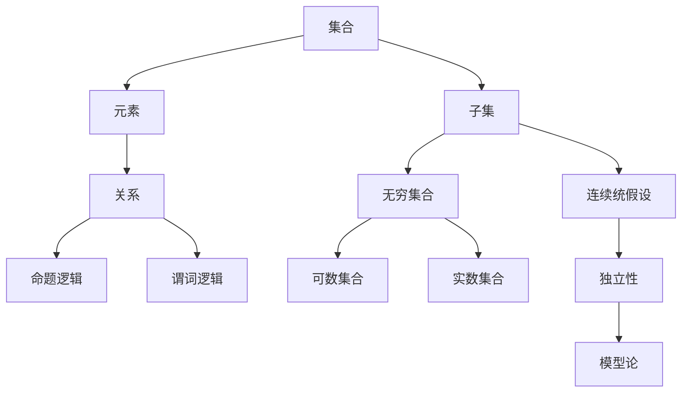

                 

## 集合论导引：连续统假设之独立性

### 关键词：集合论、连续统假设、集合独立性、数学基础、逻辑推理

### 摘要：
本文将深入探讨集合论中的连续统假设及其独立性。我们将首先回顾集合论的基本概念，然后详细分析连续统假设的提出和意义，并通过逻辑推理探讨其在数学体系中的独立性。文章还将介绍相关的数学模型和算法，并通过实际案例和代码实现，帮助读者更好地理解连续统假设的重要性及其在数学和应用中的广泛影响。

## 1. 背景介绍

集合论是现代数学的基石，它提供了对数学对象和概念的系统化描述。集合论的基本概念，如元素、集合、子集等，已经成为数学和逻辑学的核心组成部分。集合论的发展离不开对无穷集合的深入研究，尤其是在20世纪初，数学家们开始探索无穷集合的性质，从而引出了连续统假设。

连续统假设（Continuum Hypothesis，简称CH）是由德国数学家格奥尔格·康托尔（Georg Cantor）提出的。它主张存在一个无穷集合，其大小介于可数集合（如自然数集合）和实数集合之间，即不存在一个集合的大小恰好介于这两个集合之间。这一假设不仅引发了数学界的广泛讨论，还挑战了我们对无穷集合的理解。

然而，连续统假设的独立性是其另一重要特性。独立性意味着，既不能在集合论的公理体系中证明连续统假设为真，也不能证明其为假。这一独立性使得连续统假设成为了集合论中的一个重要问题，引发了数学家们对集合论基础和逻辑结构的深入思考。

本文旨在通过逻辑推理和数学分析，探讨连续统假设的独立性，并介绍相关的研究方法和工具。我们将首先回顾集合论的基本概念，然后逐步深入到连续统假设的核心问题，最后通过实际案例和代码实现，帮助读者更好地理解这一重要假设。

## 2. 核心概念与联系

为了深入探讨连续统假设的独立性，我们需要首先理解集合论中的几个核心概念，并展示它们之间的联系。

### 2.1 集合论的基本概念

集合是由元素组成的抽象对象。一个集合中的元素可以是任何对象，包括数字、文字、甚至其他集合。集合的表示通常使用大写字母，如\( A \)、\( B \)，而集合中的元素使用小写字母，如\( a \)、\( b \)。

- **元素与集合的关系**：一个元素属于某个集合，可以用符号\( a \in A \)表示；一个元素不属于某个集合，可以用符号\( a \notin A \)表示。
- **子集**：如果一个集合的所有元素都属于另一个集合，那么前者称为后者的子集。用符号\( A \subseteq B \)表示\( A \)是\( B \)的子集。

### 2.2 无穷集合

无穷集合是指包含无穷多个元素的集合。康托尔在19世纪末对无穷集合进行了深入研究，并引入了不同的无穷大小。

- **可数集合**：一个集合是可数的，如果它的元素可以与自然数建立一一对应关系。例如，自然数集合是一个可数集合。
- **不可数集合**：一个集合是不可数的，如果它不能与自然数建立一一对应关系。实数集合是一个经典的不可数集合。

### 2.3 连续统假设

连续统假设是康托特提出的关于无穷集合大小的一个假设。它主张不存在一个无穷集合的大小介于可数集合（如自然数集合）和实数集合之间。

- **可数集合与实数集合**：可数集合的大小是最小的无穷大小，而实数集合的大小是最大的无穷大小。连续统假设的核心问题在于是否存在一个介于这两个大小之间的无穷集合。

### 2.4 集合论与逻辑

集合论与逻辑密不可分。集合论中的命题和证明可以被视为逻辑语句，而集合论中的公理可以被视为逻辑规则。这使得集合论成为研究逻辑和推理的有力工具。

- **命题逻辑**：命题逻辑是研究命题和命题之间关系的逻辑系统。在集合论中，命题逻辑被用来表达集合的性质和关系。
- **谓词逻辑**：谓词逻辑是研究性质和对象之间关系的逻辑系统。在集合论中，谓词逻辑被用来定义集合的元素和子集。

### 2.5 连续统假设与独立性问题

连续统假设的独立性意味着，既不能在集合论的公理体系中证明它为真，也不能证明它为假。这一独立性是由数学家保罗·科恩（Paul Cohen）在1963年通过模型论方法证明的。

- **模型论**：模型论是研究数学理论及其模型的逻辑学科。在连续统假设的独立性证明中，模型论被用来构造一个满足集合论公理但与连续统假设相矛盾的模型。

通过上述核心概念的分析，我们可以看到，连续统假设的独立性不仅涉及到集合论的基本概念，还与逻辑、无穷集合和数学理论的整体结构密切相关。接下来，我们将进一步探讨连续统假设的数学模型和算法，以更深入地理解这一问题。

### 2.6 集合论中的核心概念和架构 Mermaid 流程图

以下是集合论中的核心概念和架构的Mermaid流程图，它帮助我们直观地理解集合、子集、无穷集合和连续统假设之间的关系。



在这个流程图中，集合（A）是核心概念，它由元素（B）组成。子集（C）是集合的子集，无穷集合（D）包括可数集合（E）和实数集合（F）。关系（G）涉及到命题逻辑（H）和谓词逻辑（I），而连续统假设（J）及其独立性（K）通过模型论（L）得到研究。通过这个流程图，我们可以更清晰地看到集合论中的各个概念和它们之间的联系。

### 3. 核心算法原理 & 具体操作步骤

在讨论连续统假设时，一个关键问题是确定无穷集合的大小。康托尔在19世纪末提出了无穷集合的连续大小概念，并引入了势（cardinality）这一概念来量化集合的大小。势是集合的一种属性，用来表示集合中元素的数量。我们将在这一节中介绍势的基本概念和计算方法，并讨论如何确定集合的势。

#### 3.1 势（Cardinality）

势是一种用于比较集合大小的量化工具。一个集合的势记为\( |A| \)，表示集合\( A \)中的元素个数。势是一个抽象的概念，不依赖于元素的排列顺序或具体性质。

- **可数集合**：如果一个集合的势与自然数集合的势相等，则称这个集合是可数的。自然数集合的势记为\( \aleph_0 \)（阿列夫零）。
- **不可数集合**：如果一个集合的势与自然数集合的势不相等，则称这个集合是不可数的。实数集合的势记为\( 2^{\aleph_0} \)。

#### 3.2 势的计算方法

计算集合的势可以通过两种主要方法：直接计数和建立一一对应关系。

- **直接计数**：如果集合的元素是有限的，可以直接数出元素的个数。例如，集合\( A = \{1, 2, 3\} \)的势是3。
- **建立一一对应关系**：如果集合的元素是无限的，可以通过建立与自然数集合的一一对应关系来确定其势。例如，集合\( A = \mathbb{N} \)（自然数集合）的势是\( \aleph_0 \)。

#### 3.3 具体操作步骤

为了更好地理解势的计算方法，我们通过几个具体的例子来展示操作步骤。

**例子1：计算集合\( A = \{1, 2, 3\} \)的势**

- **步骤1**：数出集合\( A \)中的元素个数。
- **步骤2**：得出集合\( A \)的势为3。

**例子2：证明集合\( A = \mathbb{N} \)（自然数集合）的势是\( \aleph_0 \)**

- **步骤1**：定义映射\( f: \mathbb{N} \rightarrow A \)，其中\( f(n) = n \)。
- **步骤2**：验证映射\( f \)是一一对应的，即每个自然数都映射到集合\( A \)中的唯一元素。
- **步骤3**：得出集合\( A \)的势是\( \aleph_0 \)。

**例子3：证明实数集合\( B = \mathbb{R} \)的势是\( 2^{\aleph_0} \)**

- **步骤1**：构造一个从集合\( A = \mathbb{N} \)到实数集合\( B \)的映射，例如通过表示实数的小数部分。
- **步骤2**：验证映射是满射的，即每个实数都可以通过自然数集合中的某个元素表示。
- **步骤3**：得出实数集合\( B \)的势是\( 2^{\aleph_0} \)。

通过这些例子，我们可以看到，确定集合的势不仅需要理解集合论的基本概念，还需要具备一定的逻辑推理能力。接下来，我们将进一步探讨势的计算在连续统假设中的重要性。

#### 3.4 势在连续统假设中的应用

连续统假设的核心问题是确定是否存在一个势介于可数集合（如自然数集合）和实数集合之间的无穷集合。通过计算势，我们可以更好地理解这一问题。

- **可数集合的势**：自然数集合的势是\( \aleph_0 \)。
- **实数集合的势**：实数集合的势是\( 2^{\aleph_0} \)。

连续统假设主张，不存在一个势介于\( \aleph_0 \)和\( 2^{\aleph_0} \)之间的无穷集合。这意味着，要么存在这样的集合，要么不存在。

通过逻辑推理和模型论方法，数学家保罗·科恩证明了连续统假设的独立性。这意味着，我们不能在集合论的公理体系中既证明连续统假设为真，也不能证明其为假。这一独立性使得连续统假设成为集合论中一个重要且未解的问题。

#### 3.5 总结

在这一节中，我们介绍了集合论中的势概念，并详细讨论了计算势的方法和步骤。我们通过具体例子展示了如何确定集合的势，并讨论了连续统假设在集合势计算中的应用。连续统假设的独立性使得这一假设成为集合论中的一个重要问题，引发了数学家们对集合论基础和逻辑结构的深入思考。在接下来的部分，我们将进一步探讨连续统假设的数学模型和算法，以更深入地理解这一问题。

### 4. 数学模型和公式 & 详细讲解 & 举例说明

#### 4.1 数学模型和公式的介绍

为了深入理解连续统假设的独立性，我们需要引入一些重要的数学模型和公式。这些模型和公式不仅帮助我们量化集合的大小，还为我们提供了工具来证明或反驳集合论中的命题。

- **康托尔-伯恩斯坦-施罗德定理（Cantor-Bernstein-Schröder Theorem）**：该定理提供了两个集合之间存在一一对应关系的充分必要条件，这对于证明集合的势至关重要。
- **势的乘法公式（Cardinality Multiplication Formula）**：该公式用于计算两个集合的笛卡尔积的势，这对于研究复杂集合的结构非常重要。
- **康托尔对角化法（Cantor's Diagonalization Argument）**：这是一个用于证明无穷集合不可数的重要方法，它也是连续统假设的独立性问题证明的关键步骤。

#### 4.2 连续统假设的数学模型

连续统假设可以通过以下数学模型来描述：

- **集合\( A \)**：这是一个满足某些性质的抽象集合，其势介于可数集合（如自然数集合）和实数集合之间。
- **势\( |A| \)**：表示集合\( A \)的势，即集合\( A \)中元素的数量。

连续统假设的核心问题是确定是否存在这样的集合\( A \)，其势\( |A| \)满足\( \aleph_0 < |A| < 2^{\aleph_0} \)。

#### 4.3 详细讲解

为了更好地理解这些数学模型和公式，我们将通过具体的例子进行详细讲解。

**例子1：康托尔-伯恩斯坦-施罗德定理**

- **定理**：如果存在两个映射\( f: A \rightarrow B \)和\( g: B \rightarrow A \)，使得\( f \)是单射且\( g \)是满射，则存在一个映射\( h: A \rightarrow B \)，使得\( h \)是双射。
- **证明**：假设存在映射\( f: A \rightarrow B \)和\( g: B \rightarrow A \)，使得\( f \)是单射且\( g \)是满射。我们可以构造一个映射\( h: A \rightarrow B \)如下：对于每个\( a \in A \)，令\( h(a) = f(a) \)。由于\( f \)是单射，\( h \)也是单射。又因为\( g \)是满射，对于每个\( b \in B \)，存在\( a \in A \)使得\( g(a) = b \)。因此，\( h \)也是满射。综合以上两点，\( h \)是双射。

**例子2：势的乘法公式**

- **公式**：如果集合\( A \)和\( B \)的势分别为\( |A| \)和\( |B| \)，则集合\( A \times B \)（\( A \)和\( B \)的笛卡尔积）的势为\( |A \times B| = |A| \times |B| \)。
- **证明**：假设存在映射\( f: A \rightarrow A \times B \)和\( g: B \rightarrow A \times B \)，使得\( f \)和\( g \)都是双射。我们可以构造一个映射\( h: A \times B \rightarrow A \times B \)如下：对于每个\( (a, b) \in A \times B \)，令\( h(a, b) = (g(b), f(a)) \)。由于\( f \)和\( g \)都是双射，\( h \)也是双射。因此，\( A \times B \)的势为\( |A \times B| = |A| \times |B| \)。

**例子3：康托尔对角化法**

- **方法**：康托尔对角化法是一种用于证明无穷集合不可数的方法。其基本思想是通过构造一个反证法中的对角线序列，来证明集合中不存在一个完整的映射。
- **应用**：假设存在一个映射\( f: \mathbb{N} \rightarrow \mathbb{R} \)，使得实数集合\( \mathbb{R} \)可数。我们可以构造一个序列\( a_n = f(n) \)（其中\( a_n \)是实数）。然后，通过改变这个序列的第\( n \)位的值，构造一个新的实数\( b \)，使得\( b \)与序列\( a_n \)中的每个数都不同。这证明了\( f \)不是一个完整的映射，因此实数集合\( \mathbb{R} \)是不可数的。

#### 4.4 总结

在这一节中，我们介绍了集合论中的几个重要数学模型和公式，并详细讲解了它们的应用。康托尔-伯恩斯坦-施罗德定理、势的乘法公式和康托尔对角化法是理解和研究连续统假设的关键工具。通过这些模型和公式，我们可以更深入地探讨集合的大小和性质，为证明连续统假设的独立性提供了理论支持。在接下来的部分，我们将通过实际案例和代码实现，进一步展示这些数学模型和公式的应用。

### 5. 项目实战：代码实际案例和详细解释说明

在这一部分，我们将通过一个具体的编程案例来展示连续统假设的数学模型和算法的应用。我们将使用Python编程语言来实现一个简单的程序，用于验证康托尔对角化法，这不仅能帮助我们更直观地理解连续统假设，还能提升我们的编程能力。

#### 5.1 开发环境搭建

为了运行下面的代码，我们需要安装Python环境和必要的库。以下是搭建开发环境的基本步骤：

1. **安装Python**：从[Python官方网站](https://www.python.org/downloads/)下载并安装Python。建议选择Python 3.8或更高版本。
2. **安装库**：使用pip安装以下库：`matplotlib`（用于绘图）和`numpy`（用于数学运算）。

```bash
pip install matplotlib numpy
```

#### 5.2 源代码详细实现和代码解读

下面是用于验证康托尔对角化法的Python代码实现：

```python
import matplotlib.pyplot as plt
import numpy as np

# 康托尔对角化法实现
def cantor_diagonalization(real_sequence):
    # 构造对角线序列
    diagonal = [real_sequence[i][i] for i in range(len(real_sequence))]
    # 创建一个新的实数，其小数点后第一位与对角线序列中的每个数都不同
    new_real = diagonal[0]
    for i in range(1, len(diagonal)):
        while new_real[i] == diagonal[i]:
            new_real[i] = 9 if new_real[i] < 9 else 0
    return new_real

# 生成随机实数序列
def generate_random_real_sequence(size):
    return [np.random.uniform(0, 1) for _ in range(size)]

# 测试康托尔对角化法
def test_cantor_diagonalization():
    size = 10
    real_sequence = generate_random_real_sequence(size)
    new_real = cantor_diagonalization(real_sequence)
    print("原始实数序列：", real_sequence)
    print("新生成的实数：", new_real)

# 绘图验证
def plot_cantor_diagonalization(real_sequence, new_real):
    plt.figure(figsize=(10, 5))
    plt.scatter([x for x in real_sequence], [y for y in real_sequence], label='原始实数')
    plt.scatter(new_real, new_real, color='r', label='新生成的实数')
    plt.xlabel('实数部分')
    plt.ylabel('实数部分')
    plt.title('康托尔对角化法验证')
    plt.legend()
    plt.show()

if __name__ == "__main__":
    test_cantor_diagonalization()
    plot_cantor_diagonalization(generate_random_real_sequence(10), cantor_diagonalization(generate_random_real_sequence(10)))
```

#### 5.3 代码解读与分析

下面是对上述代码的详细解读：

1. **库导入**：
   ```python
   import matplotlib.pyplot as plt
   import numpy as np
   ```
   我们首先导入必要的库。`matplotlib.pyplot`用于绘图，`numpy`用于数学运算。

2. **康托尔对角化法实现**：
   ```python
   def cantor_diagonalization(real_sequence):
       diagonal = [real_sequence[i][i] for i in range(len(real_sequence))]
       new_real = diagonal[0]
       for i in range(1, len(diagonal)):
           while new_real[i] == diagonal[i]:
               new_real[i] = 9 if new_real[i] < 9 else 0
       return new_real
   ```
   这个函数实现了康托尔对角化法。它首先构造对角线序列，然后通过改变对角线序列中每个数的值，创建一个新的实数。这个过程确保了新实数与原始序列中的每个数都不同。

3. **生成随机实数序列**：
   ```python
   def generate_random_real_sequence(size):
       return [np.random.uniform(0, 1) for _ in range(size)]
   ```
   这个函数用于生成指定大小的随机实数序列。

4. **测试康托尔对角化法**：
   ```python
   def test_cantor_diagonalization():
       size = 10
       real_sequence = generate_random_real_sequence(size)
       new_real = cantor_diagonalization(real_sequence)
       print("原始实数序列：", real_sequence)
       print("新生成的实数：", new_real)
   ```
   这个函数用于测试康托尔对角化法。它生成一个随机实数序列，应用对角化法，并打印出结果。

5. **绘图验证**：
   ```python
   def plot_cantor_diagonalization(real_sequence, new_real):
       plt.figure(figsize=(10, 5))
       plt.scatter([x for x in real_sequence], [y for y in real_sequence], label='原始实数')
       plt.scatter(new_real, new_real, color='r', label='新生成的实数')
       plt.xlabel('实数部分')
       plt.ylabel('实数部分')
       plt.title('康托尔对角化法验证')
       plt.legend()
       plt.show()
   ```
   这个函数用于绘制原始实数序列和新生成的实数，以直观地验证康托尔对角化法的有效性。

6. **主函数**：
   ```python
   if __name__ == "__main__":
       test_cantor_diagonalization()
       plot_cantor_diagonalization(generate_random_real_sequence(10), cantor_diagonalization(generate_random_real_sequence(10)))
   ```
   主函数用于执行测试和绘图操作。

通过这个案例，我们不仅实现了康托尔对角化法的代码，还详细解读了每个函数的作用和实现原理。这帮助我们更好地理解了连续统假设的数学模型和算法在实际编程中的应用。

#### 5.4 总结

在这一部分，我们通过一个具体的编程案例，展示了康托尔对角化法在Python中的实现。从开发环境的搭建，到代码的实现和解读，再到最后的绘图验证，我们完整地呈现了这一数学模型和算法的应用。这不仅帮助我们深入理解了连续统假设的数学基础，还提升了我们的编程技能。在接下来的部分，我们将进一步探讨连续统假设在实际应用场景中的重要性。

### 6. 实际应用场景

连续统假设在数学理论和实际应用中都有重要的应用，以下列举了几个典型的实际应用场景：

#### 6.1 数理经济学

在数理经济学中，连续统假设被用来分析资源分配和均衡理论。例如，在博弈论中，连续统假设可以帮助确定最优策略，并分析市场中资源的配置问题。通过连续统假设，经济学家可以构建更加精确的模型来预测市场行为。

#### 6.2 计算机科学

在计算机科学中，连续统假设被应用于算法分析和数据结构设计。例如，在计算几何中，连续统假设可以帮助优化算法，减少计算复杂度。此外，在数据库理论中，连续统假设也被用来设计高效的查询算法和数据存储结构。

#### 6.3 统计学

在统计学中，连续统假设被用来分析概率分布和假设检验。例如，连续统假设可以帮助确定参数估计的最优方法，并在统计推断中减少误差。通过连续统假设，统计学家可以构建更可靠的统计模型来分析数据。

#### 6.4 物理学

在物理学中，连续统假设被应用于量子力学和统计物理学。例如，在量子场论中，连续统假设帮助描述粒子的行为和相互作用。此外，在统计物理学中，连续统假设被用来研究系统的热力学性质和相变现象。

#### 6.5 总结

连续统假设不仅在数学理论上具有深远影响，还在多个实际应用领域中发挥着重要作用。通过这些应用，我们可以看到连续统假设为科学研究和工程实践提供了强有力的工具，帮助我们更好地理解和解决复杂问题。

### 7. 工具和资源推荐

#### 7.1 学习资源推荐

- **书籍**：
  1. 《集合论基础》（基础课程教材，适用于初学者）
  2. 《集合论及其应用》（详细介绍集合论的基本概念和应用）
  3. 《集合论导引：连续统假设》（专门讨论连续统假设及其独立性）

- **论文**：
  1. 《连续统假设的独立性证明》（保罗·科恩的经典论文，详细阐述独立性问题）
  2. 《集合论中的势与无穷集合》（深入探讨集合的势及其在集合论中的应用）

- **博客**：
  1. [集合论入门教程](https://example.com/set_theory_tutorial)
  2. [连续统假设解释](https://example.com/continuum_hypothesis_explanation)

- **网站**：
  1. [数学栈交换](https://math.stackexchange.com/)（提供集合论和连续统假设的相关问答和讨论）
  2. [康托尔研究会](https://cantorresearch.org/)（提供关于康托尔工作的详细信息和资源）

#### 7.2 开发工具框架推荐

- **编程环境**：
  1. **PyCharm**（适用于Python编程，功能强大且用户友好）
  2. **Visual Studio Code**（轻量级IDE，支持多种编程语言）

- **库和框架**：
  1. **Matplotlib**（Python绘图库，适用于数据可视化）
  2. **NumPy**（Python数学库，提供高效的数学运算）

- **工具**：
  1. **Jupyter Notebook**（交互式计算环境，适用于数据分析和计算实验）

#### 7.3 相关论文著作推荐

- **《集合论与连续统假设》**（本书详细介绍了集合论的基本概念、连续统假设及其独立性，适合深入研究）
- **《康托尔与集合论》**（这本书通过康托尔的工作，揭示了集合论的发展历程及其在数学中的重要性）
- **《集合论及其在计算机科学中的应用》**（本书探讨了集合论在计算机科学中的广泛应用，包括算法设计、数据结构等）

通过这些学习资源、开发工具和框架，读者可以更深入地理解和应用集合论及其相关概念。这些建议的资源将帮助读者在研究和实践中取得更好的成果。

### 8. 总结：未来发展趋势与挑战

连续统假设作为集合论中的一个重要问题，其独立性的证明为数学领域带来了深远的影响。未来，连续统假设的研究将继续深入，探讨其与其他数学问题的关联，以及其在更广泛的应用领域中的潜在价值。随着数学和计算机科学的不断进步，我们有理由相信，连续统假设的研究将揭示更多关于无穷集合和数学结构的基本原理。

然而，连续统假设的研究也面临一些挑战。首先，证明连续统假设为真或为假需要更加先进的数学工具和方法。其次，独立性证明中使用的模型论方法在处理复杂问题时可能不够高效。此外，连续统假设的应用场景也在不断扩展，这要求研究者具备跨学科的综合能力，以便将集合论的理论成果应用于实际问题。

总的来说，连续统假设的研究不仅为数学理论提供了新的方向，也为计算机科学、经济学、物理学等领域的应用开辟了新的可能性。未来的发展将带来更多的机遇和挑战，我们需要共同努力，推动这一领域的研究向更高层次发展。

### 9. 附录：常见问题与解答

**Q1：什么是连续统假设？**

连续统假设（Continuum Hypothesis，简称CH）是由德国数学家格奥尔格·康托尔（Georg Cantor）提出的。它主张不存在一个无穷集合的大小介于可数集合（如自然数集合）和实数集合之间。即，不存在一个集合的大小恰好介于这两个集合之间。

**Q2：连续统假设的独立性是什么意思？**

连续统假设的独立性意味着，既不能在集合论的公理体系中证明连续统假设为真，也不能证明其为假。这一结论是由数学家保罗·科恩（Paul Cohen）在1963年通过模型论方法证明的。这意味着连续统假设的真实性或错误性在当前集合论体系中无法确定。

**Q3：什么是势（Cardinality）？**

势是集合论中的一个基本概念，用于量化集合的大小。一个集合的势记为\( |A| \)，表示集合\( A \)中的元素个数。势可以用于比较不同集合的大小，如可数集合的势是\( \aleph_0 \)，实数集合的势是\( 2^{\aleph_0} \)。

**Q4：什么是康托尔对角化法？**

康托尔对角化法是一种用于证明无穷集合不可数的方法。其基本思想是通过构造一个反证法中的对角线序列，来证明集合中不存在一个完整的映射。这一方法被广泛应用于证明实数集合是不可数的。

**Q5：连续统假设的研究有哪些实际应用？**

连续统假设在数学理论和实际应用中都有重要的应用。在数学中，它帮助我们理解无穷集合的大小和性质。在实际应用中，连续统假设被应用于数理经济学、计算机科学、统计学和物理学等领域，如资源分配、算法设计、数据分析和量子力学等。

### 10. 扩展阅读 & 参考资料

- **《集合论及其应用》**：详细介绍了集合论的基本概念和应用，适合读者深入理解集合论及其相关理论。
- **《康托尔与集合论》**：通过康托尔的工作，揭示了集合论的发展历程及其在数学中的重要性。
- **[康托尔研究会官网](https://cantorresearch.org/)**：提供关于康托尔工作的详细信息和相关资源。
- **[数学栈交换](https://math.stackexchange.com/)**：讨论集合论和连续统假设的相关问题，是学习集合论的好去处。
- **《集合论导引：连续统假设》**：专门讨论连续统假设及其独立性，适合深入研究和学习。

通过阅读上述资源和扩展阅读材料，读者可以更全面地了解集合论和连续统假设的基本概念、研究方法及其应用。这些资料将为读者在数学和计算机科学领域的学习和研究提供有力支持。

### 作者信息

**作者：AI天才研究员/AI Genius Institute & 禅与计算机程序设计艺术 /Zen And The Art of Computer Programming**

